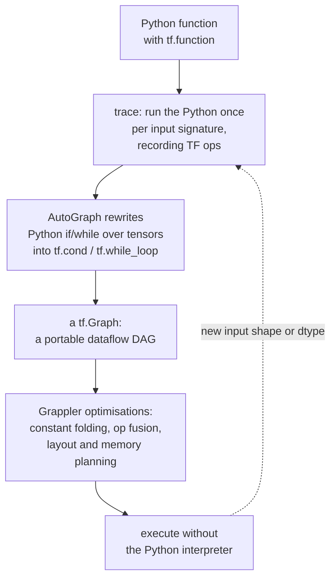

# TensorFlow & Keras: Graphs, Deployment, and the Production Path

TensorFlow's reputation was built on production deployment and its reputation
for awkwardness was built on TF1's static graphs. TF2 kept the deployment story
— TF Serving, TFLite, TF.js, TPUs, TFX — and replaced the static graph with
eager execution plus an opt-in compiler. Keras 3 then went multi-backend, so the
same model code runs on TensorFlow, JAX, or PyTorch.

If you are choosing a framework for research, PyTorch is the default. If you are
shipping to mobile, embedded, browsers, or a large existing serving estate, this
is the stack you will meet.

## Eager and graph execution

```python
import tensorflow as tf

a = tf.constant([[1., 2.], [3., 4.]])
b = a @ a                 # runs immediately, like NumPy
print(b.numpy())
```

TF2 is eager by default. `tf.function` opts a Python function into graph mode:

```python
@tf.function
def train_step(x, y):
    with tf.GradientTape() as tape:
        loss = loss_fn(model(x, training=True), y)
    grads = tape.gradient(loss, model.trainable_variables)
    optimizer.apply_gradients(zip(grads, model.trainable_variables))
    return loss
```



**Tracing is the concept that explains every `tf.function` surprise.** The
Python body runs only during tracing. Anything that is not a TF op — a `print`, a
Python counter, appending to a list — happens once per trace and never again.

```python
@tf.function
def f(x):
    print("tracing!")        # Python side effect: printed only when traced
    tf.print("running!")     # a TF op: printed on every call
    return x * 2

f(tf.constant(1.0))   # tracing! running!
f(tf.constant(2.0))   # running!
f(tf.constant([1.]))  # tracing! running!   <- different shape, retraced
```

**Retracing is the main performance trap.** Passing Python floats or ints instead
of tensors triggers a new trace per distinct value. Fix it by passing tensors, or
by declaring a relaxed signature:

```python
@tf.function(input_signature=[tf.TensorSpec([None, 784], tf.float32)])
def infer(x): ...

@tf.function(reduce_retracing=True)      # let TF generalise shapes automatically
def step(x): ...
```

**AutoGraph** converts Python control flow over tensors into graph ops. `if` on a
tensor becomes `tf.cond`; a `for` over a tensor becomes `tf.while_loop`. A `for`
over a Python list is unrolled at trace time, which can produce enormous graphs.

## Variables, gradients, and the tape

```python
w = tf.Variable(tf.random.normal([784, 10]))     # mutable state
x = tf.constant(...)                              # immutable

with tf.GradientTape() as tape:
    logits = x @ w
    loss = tf.reduce_mean(tf.nn.softmax_cross_entropy_with_logits(y, logits))
grads = tape.gradient(loss, [w])
```

| Behaviour | Detail |
|---|---|
| Watching | `tf.Variable`s are watched automatically; call `tape.watch(t)` for a constant |
| Single use | a tape is consumed by one `gradient()` call unless `persistent=True` |
| Higher order | nest tapes for second derivatives |
| Stopping | `tf.stop_gradient(t)` is PyTorch's `.detach()` |
| Memory | the tape holds intermediates; keep it as narrow as possible |

```python
with tf.GradientTape() as outer, tf.GradientTape() as inner:
    y = x ** 3
d1 = inner.gradient(y, x)      # 3x^2
d2 = outer.gradient(d1, x)     # 6x
```

## Keras: three ways to define a model

### Sequential — a linear stack

```python
from tensorflow import keras
from tensorflow.keras import layers

model = keras.Sequential([
    layers.Input(shape=(784,)),
    layers.Dense(256, activation="relu"),
    layers.Dropout(0.3),
    layers.Dense(10),                       # logits, no activation
])
```

### Functional — a DAG, and the right default

```python
inputs = keras.Input(shape=(28, 28, 1))
x = layers.Conv2D(32, 3, padding="same")(inputs)
x = layers.BatchNormalization()(x)
x = layers.Activation("relu")(x)
skip = x
x = layers.Conv2D(32, 3, padding="same", activation="relu")(x)
x = layers.Add()([x, skip])                     # residual connection
x = layers.GlobalAveragePooling2D()(x)
outputs = layers.Dense(10)(x)

model = keras.Model(inputs, outputs, name="tiny_resnet")
model.summary()
keras.utils.plot_model(model, show_shapes=True)
```

The functional API builds an explicit graph object, so Keras can validate shapes
at construction time, serialise the architecture to JSON, plot it, and support
multiple inputs and outputs. Prefer it unless you need dynamic control flow.

### Subclassing — full flexibility

```python
class Transformer(keras.Model):
    def __init__(self, d_model, n_heads, **kw):
        super().__init__(**kw)
        self.attn = layers.MultiHeadAttention(n_heads, d_model // n_heads)
        self.ln1, self.ln2 = layers.LayerNormalization(), layers.LayerNormalization()
        self.ffn = keras.Sequential([layers.Dense(4 * d_model, activation="gelu"),
                                     layers.Dense(d_model)])

    def call(self, x, training=False):
        h = self.ln1(x)
        x = x + self.attn(h, h, use_causal_mask=True, training=training)
        return x + self.ffn(self.ln2(x), training=training)
```

Note `training=False` in `call`: it is how Dropout and BatchNormalization learn
which mode they are in, and forgetting to thread it through is a classic
subclassing bug that leaves dropout active at inference.

| API | Choose when |
|---|---|
| Sequential | a plain stack, prototyping |
| Functional | branches, skips, multiple inputs/outputs — most real models |
| Subclassing | dynamic control flow, custom training semantics, research |

## Training: `compile`/`fit`, and the custom escape hatch

```python
model.compile(
    optimizer=keras.optimizers.AdamW(learning_rate=1e-3, weight_decay=1e-4),
    loss=keras.losses.SparseCategoricalCrossentropy(from_logits=True),
    metrics=["accuracy", keras.metrics.AUC(name="auc")],
    jit_compile=True,                      # XLA
)

history = model.fit(
    train_ds, validation_data=val_ds, epochs=50,
    callbacks=[
        keras.callbacks.EarlyStopping("val_auc", mode="max", patience=8,
                                      restore_best_weights=True),
        keras.callbacks.ModelCheckpoint("best.keras", save_best_only=True,
                                        monitor="val_auc", mode="max"),
        keras.callbacks.ReduceLROnPlateau(factor=0.5, patience=4),
        keras.callbacks.TensorBoard(log_dir="logs"),
        keras.callbacks.CSVLogger("history.csv"),
    ],
)
```

**`from_logits=True` is the setting that quietly costs accuracy.** If the final
layer has no activation (recommended, for numerical stability) then the loss
must be told, or it will apply `log` to raw logits. Similarly, choose
`SparseCategoricalCrossentropy` for integer labels and `CategoricalCrossentropy`
for one-hot — mixing them up produces a shape error at best and silently wrong
training at worst.

**When you need a custom loop**, override `train_step` and keep everything else
that `fit` gives you (callbacks, progress bars, distribution):

```python
class CustomModel(keras.Model):
    def train_step(self, data):
        x, y = data
        with tf.GradientTape() as tape:
            y_pred = self(x, training=True)
            loss = self.compute_loss(x, y, y_pred)
        self.optimizer.apply_gradients(
            zip(tape.gradient(loss, self.trainable_variables), self.trainable_variables))
        for m in self.metrics:
            m.update_state(y, y_pred)
        return {m.name: m.result() for m in self.metrics}
```

## tf.data

`tf.data` is TensorFlow's genuinely strong component: a declarative, C++-backed
input pipeline that overlaps loading with computation.

```python
ds = (tf.data.Dataset.from_tensor_slices((X, y))
      .shuffle(10_000, reshuffle_each_iteration=True)
      .map(augment, num_parallel_calls=tf.data.AUTOTUNE)
      .batch(128, drop_remainder=True)
      .prefetch(tf.data.AUTOTUNE)
      .cache())
```

**Order matters, and the standard ordering is:**

```
shuffle -> map(expensive) -> batch -> prefetch
```

| Rule | Reason |
|---|---|
| `cache()` **before** random augmentation | otherwise you cache one fixed augmentation forever |
| `shuffle` before `batch` | shuffling batches only permutes their order, not their contents |
| Buffer ≥ a few thousand, ideally the dataset size | a small buffer gives poor mixing on sorted data |
| `map` before `batch` for per-example work; after for vectorisable work | batched maps amortise op overhead |
| `prefetch(AUTOTUNE)` last | overlaps the CPU pipeline with the accelerator step |
| `num_parallel_calls=AUTOTUNE` | let the runtime pick the parallelism |

For large datasets, **TFRecord** is the native format: a sequence of serialised
`tf.train.Example` protos, shardable and streamable from cloud storage.

```python
ds = (tf.data.Dataset.list_files("gs://bucket/train-*.tfrecord")
      .interleave(tf.data.TFRecordDataset, cycle_length=16,
                  num_parallel_calls=tf.data.AUTOTUNE)
      .map(parse_example, num_parallel_calls=tf.data.AUTOTUNE))
```

`interleave` across shards is what saturates network bandwidth; reading shards
sequentially is the usual reason a TPU sits idle.

Profile the input pipeline with the TensorBoard Profiler's trace viewer — if the
accelerator has gaps between steps, the pipeline is the bottleneck, not the
model.

## Preprocessing layers

Keras preprocessing layers are part of the model, which means the same
transformation ships to production — no train/serve skew.

```python
normalizer = layers.Normalization()
normalizer.adapt(train_features)             # learn mean/variance from data

lookup = layers.StringLookup(output_mode="one_hot")
lookup.adapt(train_categories)

text_vec = layers.TextVectorization(max_tokens=20_000, output_sequence_length=256)
text_vec.adapt(train_texts)

inference_model = keras.Sequential([normalizer, trained_model])   # preprocessing baked in
```

This is the strongest argument for Keras in a production setting: the exported
SavedModel accepts raw strings or raw floats, so the serving layer does not have
to reimplement your preprocessing in another language.

## Distribution strategies

```python
strategy = tf.distribute.MirroredStrategy()          # multi-GPU, one machine
with strategy.scope():
    model = build_model()
    model.compile(...)
model.fit(ds, epochs=10)
```

| Strategy | Scope |
|---|---|
| `MirroredStrategy` | multiple GPUs on one host, synchronous all-reduce |
| `MultiWorkerMirroredStrategy` | multiple hosts, synchronous |
| `TPUStrategy` | TPU pods |
| `ParameterServerStrategy` | asynchronous, very large sparse models |

Everything that creates variables must be **inside `strategy.scope()`**. The
global batch size is split across replicas, so a `global_batch_size` of 512 on 8
GPUs is 64 each — and your learning rate should be chosen for the global batch.

TPUs add their own constraints: fixed shapes (use `drop_remainder=True`), data
from cloud storage rather than local disk, and `steps_per_execution` set high to
amortise host–device round trips.

## Deployment

| Target | Path |
|---|---|
| Server | SavedModel + **TF Serving** (gRPC/REST, versioning, batching) |
| Mobile / embedded | **TFLite** — converted, quantised `.tflite` |
| Browser / Node | **TensorFlow.js** |
| Cross-framework | ONNX via `tf2onnx` |
| Pipelines | **TFX** — data validation, transform, trainer, evaluator, pusher |

```python
model.export("saved_model/1")                    # SavedModel for TF Serving
model.save("model.keras")                        # Keras 3 native format

converter = tf.lite.TFLiteConverter.from_saved_model("saved_model/1")
converter.optimizations = [tf.lite.Optimize.DEFAULT]
converter.representative_dataset = rep_data_gen  # for full int8 quantisation
converter.target_spec.supported_ops = [tf.lite.OpsSet.TFLITE_BUILTINS_INT8]
open("model.tflite", "wb").write(converter.convert())
```

TFLite post-training quantisation ladder, in increasing aggressiveness: dynamic
range (weights int8, activations float), float16, full integer with a
representative dataset, then integer-only for microcontrollers. Full int8 gives
roughly 4× smaller models and 2–3× faster CPU inference; measure the accuracy
drop on your own data rather than trusting a headline number.

TF Serving's server-side **dynamic batching** is a genuine production advantage:
it groups concurrent requests into one accelerator call, trading a few
milliseconds of latency for a large throughput gain.

## Keras 3 and multi-backend

Keras 3 runs on TensorFlow, JAX, or PyTorch:

```python
import os; os.environ["KERAS_BACKEND"] = "jax"     # set BEFORE importing keras
import keras
```

`keras.ops` provides a NumPy-like API that works across all three, so model code
is portable. In practice, the backend still determines your data pipeline
(`tf.data` vs `torch.utils.data`) and your deployment target, so portability is
real but not total.

## TensorFlow vs PyTorch, honestly

| Dimension | TensorFlow / Keras | PyTorch |
|---|---|---|
| Research mindshare | minority and shrinking | dominant |
| Ease of debugging | good in eager, harder inside `tf.function` | plain Python throughout |
| Input pipeline | `tf.data` is excellent | `DataLoader` is simpler, less optimised |
| Mobile / embedded | TFLite is mature and widely deployed | ExecuTorch is newer |
| Browser | TF.js | ONNX Runtime Web |
| TPU support | first class | improving via XLA |
| Serving | TF Serving, TFX | TorchServe, vLLM, Triton |
| Pretrained LLMs | few released TF-first | essentially everything |
| Graph compilation | `tf.function` + XLA, mature | `torch.compile`, newer but fast-moving |

**A fair summary**: pick PyTorch for research and for anything involving modern
pretrained language models; pick TensorFlow when you are deploying to mobile or
the browser, when you are on TPUs, or when you are extending an existing TF
production system.

## Common bugs

| Symptom | Cause |
|---|---|
| Loss stuck; accuracy near chance | `from_logits` mismatch with the final layer |
| Retracing warning, training is slow | Python scalars passed to a `tf.function` |
| `print` never fires | Python side effect inside a traced function — use `tf.print` |
| Metrics wrong under distribution | metric not created inside `strategy.scope()` |
| Same augmentation every epoch | `cache()` placed after the random `map` |
| Shuffling looks ineffective | buffer too small, or shuffle applied after batch |
| Shape error only at `fit` time | subclassed model without an `Input`; build it first |
| Dropout active at inference | `training` flag not threaded through a custom `call` |
| OOM on TPU | variable shapes; use `drop_remainder=True` |
| Serving output differs from training | preprocessing reimplemented outside the model |

## Self-check

1. Explain tracing, and why `print` inside a `@tf.function` fires once.
2. Where must `cache()` go relative to a random augmentation, and what breaks
   otherwise?
3. Your final `Dense` layer has no activation. What must the loss be configured
   with, and why is that arrangement preferred?
4. When would you choose the functional API over subclassing?
5. What must be constructed inside `strategy.scope()`?
6. Give three deployment targets where TensorFlow is the stronger choice, with
   the specific tool for each.
7. What is the practical benefit of Keras preprocessing layers over doing the
   same work in pandas?

## Where to go next

- [PyTorch](./pytorch.md) — the same concepts with a different execution model.
- [MLOps & Serving](./mlops-and-serving.md) — deploying whatever you trained.
- [Deep Learning notes](../deep-learning.md) — the architectures behind the
  layers.
