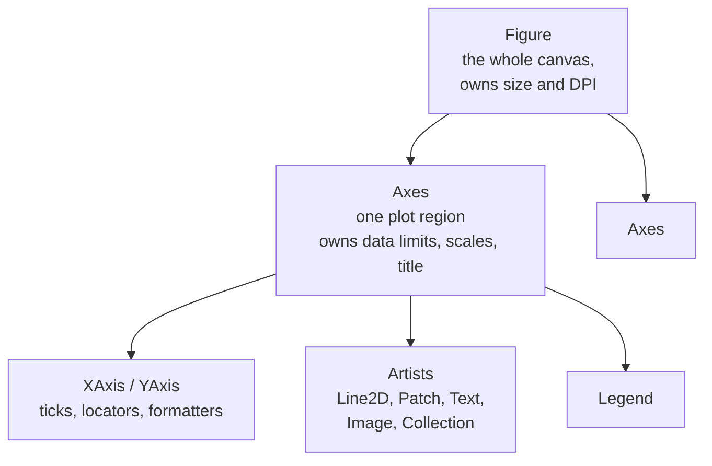

# Visualization: Seeing What the Numbers Hide

Anscombe's quartet is four datasets with identical means, variances,
correlations, and regression lines that look completely different when plotted.
That is not a curiosity — it is the argument for this entire page. Summary
statistics compress, and compression loses exactly the structure you most need
to see.

## The library landscape

| Library | Model | Best for |
|---|---|---|
| **Matplotlib** | imperative, object-oriented | full control, publication figures, anything custom |
| **Seaborn** | declarative over Matplotlib | statistical plots in one line, faceting, good defaults |
| **Plotly** | declarative, JSON → JS | interactive plots, hover, zoom, dashboards, notebooks |
| **Altair** | grammar of graphics (Vega-Lite) | declarative, composable, great for exploration |
| **Bokeh** | interactive server | streaming and server-backed dashboards |
| **HoloViews / hvPlot** | high-level over Bokeh | quick interactive plots from dataframes |
| **Datashader** | server-side rasterisation | millions to billions of points |
| **UMAP / openTSNE** | dimensionality reduction | embedding visualisation |
| **TensorBoard / W&B** | experiment tracking | training curves, comparisons, artefacts |

The practical policy: **Seaborn for statistical exploration, Matplotlib when you
need to control something Seaborn will not expose, Plotly when someone will
interact with the figure.**

## Matplotlib: learn the object model, not the `plt` shortcuts

Matplotlib has two interfaces. The stateful `plt.plot()` API mutates a hidden
"current figure", which is fine in a scratch notebook and terrible in a function
that must not depend on global state. The object-oriented API is explicit:

```python
import matplotlib.pyplot as plt

fig, axes = plt.subplots(2, 3, figsize=(15, 8), sharex=True,
                         constrained_layout=True)
ax = axes[0, 1]
ax.plot(x, y, lw=2, label="train")
ax.set(xlabel="epoch", ylabel="loss", title="Training loss", yscale="log")
ax.legend(frameon=False)
fig.savefig("loss.png", dpi=200, bbox_inches="tight")
```



The vocabulary that unlocks the documentation:

| Term | Meaning |
|---|---|
| **Figure** | the canvas; one `savefig` per figure |
| **Axes** | a single plot with its own coordinate system — *not* the x/y lines |
| **Axis** | one of the x or y axes, with ticks and formatters |
| **Artist** | anything drawable: a line, a patch, a text object |
| **Backend** | renderer — `Agg` for files, `inline`/`widget` in notebooks |

```python
plt.rcParams.update({
    "figure.dpi": 120, "savefig.dpi": 200,
    "font.size": 11, "axes.titlesize": 13,
    "axes.spines.top": False, "axes.spines.right": False,
    "axes.grid": True, "grid.alpha": 0.3,
    "figure.constrained_layout.use": True,
})
```

Setting `rcParams` once at the top of a notebook does more for figure quality
than styling each plot individually. `constrained_layout` solves the overlapping
labels problem that `tight_layout` handles less reliably.

**Close your figures in loops.** `plt.close(fig)` — Matplotlib keeps every figure
alive until closed, and a training loop that plots each epoch will exhaust
memory.

## Seaborn: statistical plots as one-liners

Seaborn's figure-level functions take a tidy (long-format) dataframe and produce
a whole grid.

```python
import seaborn as sns
sns.set_theme(style="whitegrid", context="notebook", palette="colorblind")

sns.relplot(data=df, x="epoch", y="loss", hue="model", col="dataset",
            kind="line", errorbar=("ci", 95), height=4)

sns.displot(data=df, x="score", hue="label", kind="kde",
            common_norm=False, fill=True)

sns.catplot(data=df, x="model", y="auc", kind="box", col="split")

sns.pairplot(df[num_cols + ["target"]], hue="target", corner=True, diag_kind="kde")

sns.heatmap(df[num_cols].corr(), annot=True, fmt=".2f",
            cmap="RdBu_r", center=0, vmin=-1, vmax=1, square=True)
```

| Level | Functions | Returns |
|---|---|---|
| Figure-level | `relplot`, `displot`, `catplot`, `lmplot`, `pairplot` | a `FacetGrid` — owns the whole figure |
| Axes-level | `lineplot`, `scatterplot`, `histplot`, `boxplot`, `heatmap` | draws into an `Axes` you pass |

Mixing them up is the usual Seaborn frustration: figure-level functions **cannot**
be drawn into an existing subplot. If you are composing a multi-panel figure by
hand, use the axes-level functions with `ax=`.

**`common_norm=False`** on `displot`/`kdeplot` with `hue` is worth remembering:
by default Seaborn normalises across all hue groups together, so a rare class
appears as a flat line. Setting it to `False` normalises each group separately,
which is almost always what you meant.

## Choosing the right plot

| Question | Plot | Watch out for |
|---|---|---|
| Distribution of one variable | histogram, KDE, ECDF | bin width changes the story; KDE invents smoothness |
| Compare distributions | overlaid KDE, box, violin, ridgeline | boxes hide bimodality; violins hide sample size |
| Relationship between two numerics | scatter, hexbin, 2-D density | overplotting at scale — use alpha or hexbin |
| Trend over time | line | do not connect points across gaps |
| Compare categories | bar (sorted), dot plot | never a pie chart with > 3 slices |
| Part-to-whole over time | stacked area | hard to read anything but the bottom band |
| Many pairwise relations | pair plot, correlation heatmap | $O(d^2)$ panels; sample the features |
| Uncertainty | error bars, CI bands, raw points | bar charts with error bars hide the distribution |
| High-dimensional structure | PCA / UMAP scatter | distances between clusters are not meaningful |
| Ranking with uncertainty | dot plot with intervals | leaderboards without intervals mislead |

**The ECDF is under-used.** Unlike a histogram it has no bin-width parameter,
unlike a KDE it invents nothing, and it makes quantiles readable directly:
`sns.ecdfplot(data=df, x="latency", hue="version")` answers "what fraction is
under 200 ms?" at a glance.

**Bar charts of means with error bars** are the worst common choice: they hide
sample size, distribution shape, and outliers. Prefer a box or violin with the
raw points overlaid (`sns.stripplot` on top of `sns.boxplot`) whenever $n$ is
small enough.

## The plots that matter in ML

### Learning curves — is it bias or variance?

```python
from sklearn.model_selection import LearningCurveDisplay
LearningCurveDisplay.from_estimator(model, X, y, cv=5, n_jobs=-1,
                                    score_type="both", std_display_style="fill_between")
```

| Shape | Diagnosis | Action |
|---|---|---|
| Both curves plateau at a poor score | **high bias** (underfitting) | bigger model, better features, less regularisation |
| Large persistent gap, train near perfect | **high variance** (overfitting) | more data, regularisation, augmentation, simpler model |
| Validation still improving at max $n$ | data-limited | collect more data — this is the one that justifies the spend |
| Validation curve rising late in training | overfitting in time | early stopping |

That third row is the reason to plot learning curves at all: it is the only
principled way to answer "would more data help?" before buying it.

### Training curves — is it converging?

Plot training and validation loss on a **log y-axis** against steps, not epochs.
Log scale reveals whether loss is still decreasing when the linear plot has
flattened, and steps let you compare runs with different batch sizes.

Also plot: learning rate (confirms the schedule fired), gradient norm (spikes
precede divergence), and per-layer parameter-update ratio
$\|\Delta w\|/\|w\|$ (should sit around $10^{-3}$; orders of magnitude off means
the learning rate is wrong).

### Confusion matrix — normalised, always

```python
from sklearn.metrics import ConfusionMatrixDisplay
ConfusionMatrixDisplay.from_estimator(model, X_test, y_test,
                                      normalize="true", values_format=".2f",
                                      cmap="Blues", xticks_rotation=45)
```

`normalize="true"` gives per-class recall on the diagonal; without it, a
dominant class visually swamps everything and a rare class's total failure is
invisible. For many classes, sort the classes by frequency and look for
off-diagonal blocks — they reveal systematically confusable groups, which is a
label-taxonomy problem, not a model problem.

### ROC and precision–recall

```python
fig, (a1, a2) = plt.subplots(1, 2, figsize=(11, 4.5))
RocCurveDisplay.from_estimator(model, X_test, y_test, ax=a1)
a1.plot([0, 1], [0, 1], "k--", lw=1, label="chance")
PrecisionRecallDisplay.from_estimator(model, X_test, y_test, ax=a2)
a2.axhline(y_test.mean(), ls="--", c="k", lw=1, label="base rate")
```

Always draw the baselines. The ROC diagonal and the PR base-rate line are what
turn "0.85" into "0.85 against a chance level of 0.5" or "0.30 against a base
rate of 0.02". On imbalanced problems the PR curve is the informative one.

### Calibration

```python
from sklearn.calibration import CalibrationDisplay
CalibrationDisplay.from_estimator(model, X_test, y_test, n_bins=15, strategy="quantile")
```

Plot predicted probability against observed frequency. A perfectly calibrated
model sits on the diagonal. Below it means overconfident; above means
underconfident. Use `strategy="quantile"` so each bin has equal count —
uniform-width bins on a skewed score distribution produce meaningless endpoints
with two samples in them.

Add a histogram of predicted probabilities underneath: a model whose
probabilities all cluster near the base rate is calibrated but useless, and the
reliability diagram alone will not show you that.

### Residual analysis for regression

```python
fig, axes = plt.subplots(1, 3, figsize=(15, 4))
axes[0].scatter(y_pred, y_true - y_pred, s=8, alpha=0.3); axes[0].axhline(0, c="k")
axes[0].set(xlabel="predicted", ylabel="residual", title="Residuals vs fitted")
stats.probplot(y_true - y_pred, plot=axes[1])          # Q-Q plot
axes[2].scatter(y_true, y_pred, s=8, alpha=0.3)
axes[2].plot([y_true.min(), y_true.max()], [y_true.min(), y_true.max()], "k--")
axes[2].set(xlabel="actual", ylabel="predicted", title="Predicted vs actual")
```

Read it as: **curvature** in panel 1 means missing non-linearity; a **funnel**
means heteroscedasticity (consider a log target or a different loss); fat tails
in the Q-Q plot mean outliers or the wrong noise model; **compression toward the
mean** in panel 3 is the signature of an underfit or over-regularised model.

### Embedding visualisation

```python
import umap
emb = umap.UMAP(n_neighbors=30, min_dist=0.1, metric="cosine",
                random_state=0).fit_transform(features)
sns.scatterplot(x=emb[:, 0], y=emb[:, 1], hue=labels, s=6, alpha=0.6,
                palette="tab20", linewidth=0)
```

**Read these plots with real caution.** In both t-SNE and UMAP:

- Cluster **sizes** are meaningless — the algorithms equalise density.
- Distances **between** clusters are largely meaningless.
- Apparent clusters can appear in pure noise, especially with small perplexity or
  `n_neighbors`.
- The result changes with the random seed and with every hyperparameter.

They are useful for *generating hypotheses* — "these two classes overlap
entirely, maybe the labels are ambiguous" — and for spotting duplicates or
mislabelled points. They are not evidence. PCA, being linear, is less pretty and
more trustworthy: its axes have meaning and the explained-variance ratio is
interpretable.

### Drift monitoring

```python
fig, axes = plt.subplots(1, 3, figsize=(15, 4))
for ax, col in zip(axes, watch_cols):
    sns.kdeplot(train[col], ax=ax, label="train", fill=True, alpha=0.3)
    sns.kdeplot(live[col],  ax=ax, label="live",  fill=True, alpha=0.3)
    ks = stats.ks_2samp(train[col], live[col])
    ax.set_title(f"{col}  KS={ks.statistic:.3f}  p={ks.pvalue:.1e}")
```

Overlay the training and production distributions per feature, and pair the plot
with a quantitative test (KS for continuous, chi-square or population stability
index for categorical). A PSI above 0.2 is the usual "investigate" threshold.

## Large data

Scatter plots stop working around 10⁵ points — everything overplots into a
solid blob, and the SVG file becomes unusable.

| $n$ | Approach |
|---|---|
| < 10⁴ | plain scatter |
| 10⁴–10⁵ | small markers, `alpha=0.1`, or `rasterized=True` |
| 10⁵–10⁶ | `hexbin`, 2-D histogram, or contour |
| > 10⁶ | Datashader — aggregate to a raster server-side |
| any | sample — but state that you sampled |

```python
ax.hexbin(x, y, gridsize=80, bins="log", cmap="viridis")   # density, not points
ax.scatter(x, y, s=1, alpha=0.05, rasterized=True)         # keeps vector text, raster points
```

`rasterized=True` is the trick for publication figures: the marker layer becomes
a bitmap inside the PDF while axes and text stay vector.

## Colour, and getting it right

| Data | Colormap | Examples |
|---|---|---|
| Sequential (low → high) | perceptually uniform | `viridis`, `magma`, `cividis` |
| Diverging (around a midpoint) | symmetric, set `center=0` | `RdBu_r`, `coolwarm` |
| Categorical | qualitative, colourblind-safe | `tab10`, `colorblind`, `Set2` |
| Cyclic (angles, hours) | wraps around | `twilight`, `hsv` |

Rules that are not stylistic preferences:

- **Never use `jet`/`rainbow` for continuous data.** It has false luminance
  boundaries that create visual features where the data has none, and it is
  unreadable in greyscale and to colourblind viewers.
- **Diverging maps need an explicit centre.** `center=0`, `vmin=-1`, `vmax=1` on
  a correlation heatmap; otherwise the colour scale drifts with the data and two
  heatmaps are not comparable.
- **~8% of men have red–green colour deficiency.** Use `colorblind` palettes, and
  encode with shape or line style in addition to colour.
- **Do not encode a variable twice** (colour *and* size for the same quantity)
  unless it is deliberate redundancy for accessibility.

## Interactive plots

```python
import plotly.express as px

fig = px.scatter(df, x="pc1", y="pc2", color="label",
                 hover_data=["id", "text", "confidence"],
                 opacity=0.7, width=900, height=650)
fig.update_traces(marker=dict(size=5))
fig.write_html("embeddings.html")           # self-contained, shareable
```

Interactivity earns its place when hovering reveals the identity of a point —
which is exactly the case for embedding plots, error analysis, and anything where
"what *is* that outlier?" is the question. For a static figure in a report, it
adds weight and no information.

## Anti-patterns

| Anti-pattern | Why it misleads | Instead |
|---|---|---|
| Truncated y-axis on a bar chart | exaggerates small differences | start bars at zero |
| Dual y-axes | any correlation can be manufactured by rescaling | two stacked panels sharing x |
| 3-D bar/pie charts | perspective distorts the encoded values | 2-D |
| Pie chart with many slices | angles are hard to compare | sorted bar chart |
| Unsorted categorical bars | forces the reader to search | sort by value |
| Connecting points across missing data | invents a trend | break the line at gaps |
| Smoothing without showing raw data | hides variance | plot both |
| No axis labels or units | unreadable out of context | label everything |
| Overplotted scatter at 10⁶ points | shows only the outline | hexbin or Datashader |
| Leaderboard without confidence intervals | rank noise reads as a result | plot intervals |
| Accuracy on an imbalanced problem | flattering and uninformative | PR curve, per-class recall |

## A reusable diagnostic panel

```python
def evaluate(model, X, y, name=""):
    p = model.predict_proba(X)[:, 1]
    fig, ax = plt.subplots(2, 3, figsize=(16, 9), constrained_layout=True)
    RocCurveDisplay.from_predictions(y, p, ax=ax[0, 0])
    ax[0, 0].plot([0, 1], [0, 1], "k--", lw=1)
    PrecisionRecallDisplay.from_predictions(y, p, ax=ax[0, 1])
    ax[0, 1].axhline(y.mean(), ls="--", c="k", lw=1)
    CalibrationDisplay.from_predictions(y, p, n_bins=15, strategy="quantile", ax=ax[0, 2])
    sns.histplot(x=p, hue=y, bins=50, stat="density", common_norm=False, ax=ax[1, 0])
    ConfusionMatrixDisplay.from_predictions(y, p > 0.5, normalize="true", ax=ax[1, 1])
    thr = np.linspace(0.01, 0.99, 99)
    ax[1, 2].plot(thr, [f1_score(y, p > t) for t in thr], label="F1")
    ax[1, 2].plot(thr, [precision_score(y, p > t, zero_division=0) for t in thr], label="precision")
    ax[1, 2].plot(thr, [recall_score(y, p > t) for t in thr], label="recall")
    ax[1, 2].legend(); ax[1, 2].set_xlabel("threshold")
    fig.suptitle(name)
    return fig
```

Six panels, one call, and it answers: does it rank well, does it work at the
operating point, are the probabilities meaningful, are the classes separable,
what does it confuse, and where should the threshold go.

## Self-check

1. What does Anscombe's quartet demonstrate, and what habit does it justify?
2. Why normalise a confusion matrix, and along which axis for per-class recall?
3. A learning curve shows validation still improving at the largest training
   size. What does that justify spending money on?
4. Give three things a t-SNE plot cannot tell you.
5. Why is `jet` a bad colormap? Give two independent reasons.
6. When is a PR curve more informative than an ROC curve, and why?
7. You must plot 5 million points. Name two approaches and what each sacrifices.

## Where to go next

- [Pandas](./pandas.md) — shaping data into the tidy form these plots expect.
- [Scikit-learn](./scikit-learn.md) — the `Display` classes used throughout.
- [Math for ML notes](../math.md) — the uncertainty these plots
  should be showing.
