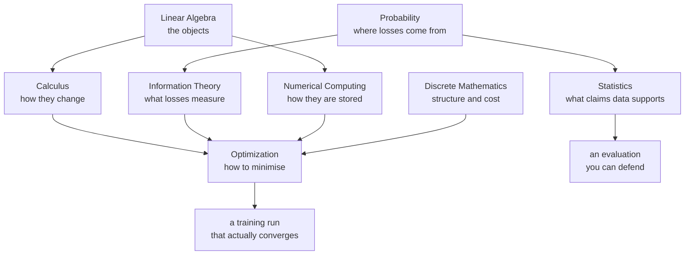

# Math for ML

Everything a machine learning model does reduces to a handful of mathematical
ideas applied at scale. A forward pass is linear algebra. A backward pass is the
chain rule. A loss function is a negative log-likelihood. A training run is
constrained optimisation over a non-convex surface, executed in finite
precision.

These eight pages build that stack from the bottom. They are written to be read
in order, but each one stands alone — and each ends with self-check questions of
the kind that actually get asked in interviews.

## Topics

| Topic | Level | What it covers |
|---|---|---|
| [Linear Algebra](./math/linear-algebra.md) | intermediate | vectors, dot products, matrices, hyperplanes, eigenvectors, SVD — with five interactive visualisations |
| [Calculus](./math/calculus.md) | intermediate | derivatives from first principles, gradients, Jacobians, Hessians, matrix calculus, hand-derived backward passes, automatic differentiation |
| [Probability](./math/probability.md) | intermediate | sample spaces, Bayes, distributions, expectation, the CLT, concentration, and why every loss is a negative log-likelihood |
| [Statistics & Inference](./math/statistics.md) | intermediate | estimators, bias–variance, confidence intervals, hypothesis testing, A/B tests, the bootstrap, causal inference |
| [Optimization](./math/optimization.md) | advanced | convexity, gradient descent, momentum, Adam and AdamW, learning-rate schedules, KKT conditions, second-order methods |
| [Information Theory](./math/information-theory.md) | intermediate | entropy, cross-entropy, KL and JS divergence, mutual information, coding, perplexity, distillation |
| [Discrete Mathematics](./math/discrete-math.md) | intermediate | combinatorics, graphs and the Laplacian, recurrences, complexity, dynamic programming, logic |
| [Numerical Computing](./math/numerical-methods.md) | advanced | floating point, catastrophic cancellation, log-sum-exp, conditioning, mixed precision, quantization, reproducibility |

## How these fit together

## Suggested order

1. **Linear Algebra** first — every other page uses its vocabulary.
2. **Calculus** next, up to the matrix-calculus section.
3. **Probability**, then **Information Theory** — they are one subject read two
   ways, and together they explain why cross-entropy is the loss.
4. **Optimization** — now every symbol in an optimiser update means something.
5. **Statistics** when you start evaluating models rather than training them.
6. **Numerical Computing** the first time a run produces `NaN`.
7. **Discrete Mathematics** as a reference for complexity and graph questions.
