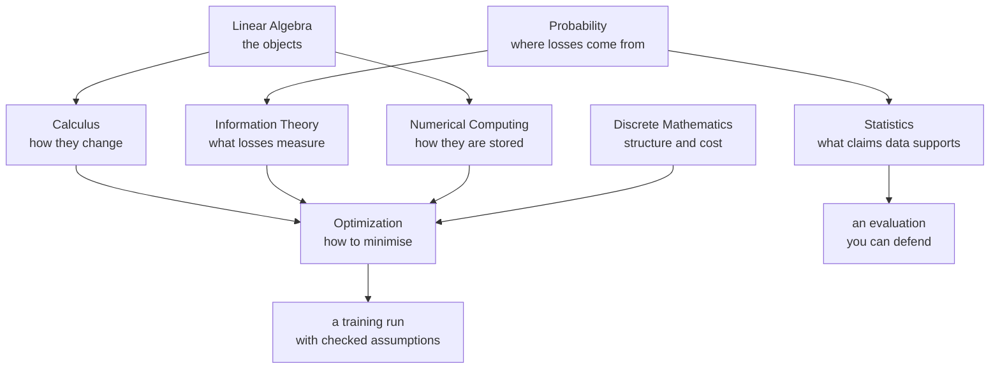

# Math for ML

Everything a machine learning model does reduces to a handful of mathematical
ideas applied at scale. A forward pass is linear algebra. A backward pass is the
chain rule. Many losses are negative log-likelihoods; hinge and task-specific losses need not be. Training may be convex or nonconvex, constrained or unconstrained, and is executed in finite precision.

These eight pages build that stack from the bottom. They are written to be read
in order, but each one stands alone — and each ends with self-check questions of
the kind that actually get asked in interviews.

## Prerequisites and learning outcomes

Start with algebraic rearrangement, functions, powers/logarithms and summation notation. A placement check: $2x+3=11$ gives $x=4$; $\sum_{i=1}^3 i=6$; $\log(ab)=\log a+\log b$ requires positive real $a,b$. Review these before matrix derivatives.

After the sequence, you should be able to choose a stable linear solver; derive and check an affine gradient; normalize and condition a joint distribution; construct a justified paired interval; verify an optimizer's step assumptions; compute entropy with units; prove a graph traversal invariant; and separate rounding error from input-information loss.

**Assumptions legend.** iid means independent and identically distributed, not merely shuffled. Finite moments must exist before using mean/variance formulas. Convexity claims specify a convex domain; Hessian criteria require twice differentiability. SPD means symmetric positive definite. Learned preprocessing uses training observations only.

Use the numbered path for first learning. For interview revision, solve each self-check before reviewing its answer. For numerical debugging, begin with [numerical computing](./math/numerical-methods.md), then [conditioning and solvers](./math/linear-algebra.md#19-conditioning-and-finite-precision-reasoning). These are bounded foundations, not a claim to cover all mathematics.

## Topics

| Topic | Level | What it covers |
|---|---|---|
| [Linear Algebra](./math/linear-algebra.md) | foundations to advanced | vector spaces, rank, projections, eigenvalues, SVD, PCA, least squares, stable solvers, matrix calculus, and ML applications, with five visualisations and worked exercises |
| [Calculus](./math/calculus.md) | intermediate | derivatives from first principles, gradients, Jacobians, Hessians, matrix calculus, hand-derived backward passes, automatic differentiation |
| [Probability](./math/probability.md) | intermediate | sample spaces, Bayes, distributions, expectation, the CLT, concentration, and the likelihood interpretation of common losses |
| [Statistics & Inference](./math/statistics.md) | intermediate | estimators, bias–variance, confidence intervals, hypothesis testing, A/B tests, the bootstrap, causal inference |
| [Optimization](./math/optimization.md) | advanced | convexity, gradient descent, momentum, Adam and AdamW, learning-rate schedules, KKT conditions, second-order methods |
| [Information Theory](./math/information-theory.md) | intermediate | entropy, cross-entropy, KL and JS divergence, mutual information, coding, perplexity, distillation |
| [Discrete Mathematics](./math/discrete-math.md) | intermediate | combinatorics, graphs and the Laplacian, recurrences, complexity, dynamic programming, logic |
| [Numerical Computing](./math/numerical-methods.md) | advanced | floating point, catastrophic cancellation, log-sum-exp, conditioning, mixed precision, quantization, reproducibility |

## Advanced numerical labs

- [Low-rank updates](./math/linear-algebra.md#low-rank-updates-sherman-morrison-and-woodbury): derive Woodbury without requiring an invertible middle factor, solve multiple right-hand sides, and diagnose nearly singular updates.
- [Generalized eigenproblems](./math/linear-algebra.md#generalized-eigenvectors-use-a-different-metric) and [Schur dynamics](./math/linear-algebra.md#schur-form-survives-when-diagonalization-fails): use the correct metric, preserve matrix structure, and separate asymptotic stability from transient amplification.
- [Hessian-vector products](./math/calculus.md#curvature-without-constructing-the-hessian): compare automatic differentiation routes, finite differences, and matrix-free curvature solves.
- [Implicit differentiation](./math/optimization.md#implicit-differentiation-through-a-stationary-solution): derive the adjoint equation and compare stationary, unrolled, and finite-difference hypergradients.

Each linked lab includes executable CPU checks and its numerical assumptions.
Read the [structured-solve diagnostics](./math/numerical-methods.md#structured-solves-still-need-error-checks)
before treating a small residual or agreement between two implementations as a
general accuracy guarantee.

## How these fit together

## Suggested order

1. **Linear Algebra** first — every other page uses its vocabulary.
2. **Calculus** next, up to the matrix-calculus section.
3. **Probability**, then **Information Theory** — they are one subject read two
   ways, and together they explain why cross-entropy is the loss.
4. **Optimization** — now every symbol in an optimiser update means something.
5. **Statistics** when you start evaluating models rather than training them.
6. **Numerical Computing** alongside the first calculations: shapes, dtypes and tolerances matter before a run produces `NaN`.
7. **Discrete Mathematics** as a reference for complexity and graph questions.
