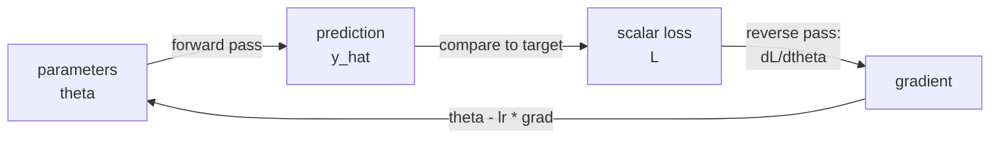
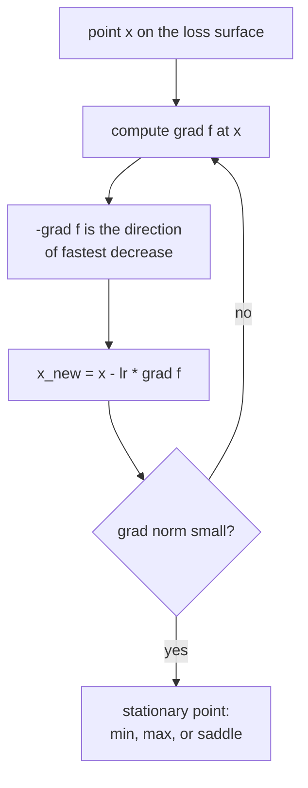
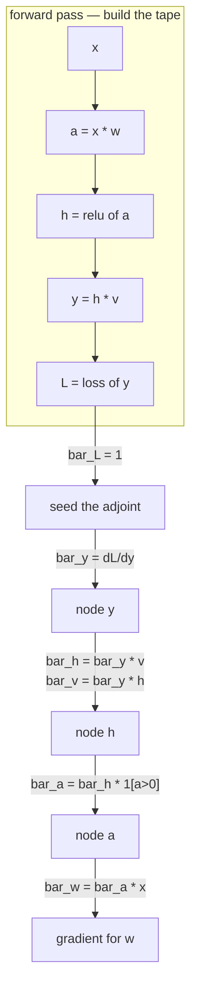

# Calculus: How Models Learn to Move

Linear algebra tells you what a model *is* — a stack of matrices acting on
vectors. Calculus tells you how to *change* it. Every training run you have ever
launched is the same loop: measure how wrong the model is, ask calculus which
direction reduces that wrongness, take a step, repeat. This page derives that
machinery end to end, from the definition of a derivative up to the matrix
calculus you need to hand-derive a backward pass.

## The one question calculus answers

> If I nudge this input a little, how much does the output move, and in which
> direction?

That is it. Everything below is a more precise, higher-dimensional, or more
computationally efficient way of asking that question.

In machine learning the "input" is a parameter $\theta$ (a weight, a bias, an
embedding entry), the "output" is a scalar loss $L$, and the answer is
$\partial L / \partial \theta$. A model with 70 billion parameters asks that
question 70 billion times per step, which is why the *efficiency* of answering it
— reverse-mode automatic differentiation — matters as much as the mathematics.



## Derivatives from first principles

### The definition

The derivative of $f$ at $x$ is the limit of the slope of a secant line as the
secant collapses to a tangent:

$$f'(x) = \lim_{h \to 0} \frac{f(x+h) - f(x)}{h}$$

Read it as: *the rate at which $f$ changes per unit change in $x$, measured
infinitesimally close to $x$.*

Let's actually do one. Take $f(x) = x^2$:

$$\frac{(x+h)^2 - x^2}{h} = \frac{x^2 + 2xh + h^2 - x^2}{h} = \frac{2xh + h^2}{h} = 2x + h$$

Let $h \to 0$ and the $h$ term vanishes: $f'(x) = 2x$. No rule memorised, just
algebra and a limit.

### What a derivative buys you: local linear approximation

The single most useful way to think about $f'(x)$ is that it gives you the best
straight-line approximation to $f$ near $x$:

$$f(x + \Delta) \approx f(x) + f'(x)\,\Delta$$

This is the first-order Taylor expansion, and it is the *entire justification for
gradient descent*. If you only trust the model of the loss surface near your
current point, you should only take a small step — which is exactly what a
learning rate is.

| $\Delta$ | true $f(2+\Delta)$ for $f=x^2$ | linear estimate $4 + 4\Delta$ | error |
|---|---|---|---|
| $0.1$ | $4.41$ | $4.40$ | $0.01$ |
| $0.5$ | $6.25$ | $6.00$ | $0.25$ |
| $1.0$ | $9.00$ | $8.00$ | $1.00$ |
| $2.0$ | $16.00$ | $12.00$ | $4.00$ |

The error grows like $\Delta^2$. Small steps are cheap in error; big steps are
not. That table is the learning-rate trade-off in miniature.

### Continuity, differentiability, and why ReLU is fine

A function is **continuous** at $x$ if small input changes give small output
changes. It is **differentiable** at $x$ if it also has a well-defined tangent
there. Differentiable implies continuous; the converse is false.

$\mathrm{ReLU}(x) = \max(0, x)$ is continuous everywhere but not differentiable
at $x = 0$ — the slope jumps from $0$ to $1$. Frameworks paper over this with a
**subgradient**: PyTorch and TensorFlow both define $\mathrm{ReLU}'(0) = 0$.
This is a convention, not a theorem, and it is harmless because the event
$x = 0$ has measure zero in floating point. Interviewers love this question; the
answer is "subgradient, and the framework picks one by fiat."

### The rules, and why they are true

| Rule | Statement | One-line reason |
|---|---|---|
| Constant | $\frac{d}{dx} c = 0$ | a flat line has no slope |
| Power | $\frac{d}{dx} x^n = n x^{n-1}$ | binomial expansion of $(x+h)^n$; all but one term dies |
| Sum | $(f+g)' = f' + g'$ | limits are linear |
| Product | $(fg)' = f'g + fg'$ | expand $f(x+h)g(x+h)$, drop the $O(h^2)$ cross term |
| Quotient | $(f/g)' = \frac{f'g - fg'}{g^2}$ | product rule applied to $f \cdot g^{-1}$ |
| Chain | $(f \circ g)'(x) = f'(g(x)) \, g'(x)$ | rates multiply through a composition |
| Exponential | $\frac{d}{dx} e^x = e^x$ | $e$ is *defined* as the base where this holds |
| Log | $\frac{d}{dx} \ln x = 1/x$ | inverse-function rule applied to $e^x$ |

The chain rule is the load-bearing one. Every other rule is convenience; the
chain rule *is* backpropagation.

### Chain rule, intuitively

If a car travels twice as fast as a bicycle, and the bicycle travels three times
as fast as a walker, the car travels six times as fast as the walker. Rates
compose by multiplication. Formally, with $z = f(y)$ and $y = g(x)$:

$$\frac{dz}{dx} = \frac{dz}{dy} \cdot \frac{dy}{dx}$$

The notation is suggestive — it looks like the $dy$ terms cancel — and while
that is not a proof, it is a reliable mnemonic.

**Worked example.** The logistic sigmoid $\sigma(x) = \dfrac{1}{1 + e^{-x}}$.

Write it as $\sigma = u^{-1}$ where $u = 1 + e^{-x}$.

$$\frac{d\sigma}{dx} = \frac{d\sigma}{du}\cdot\frac{du}{dx} = \left(-u^{-2}\right)\cdot\left(-e^{-x}\right) = \frac{e^{-x}}{(1+e^{-x})^2}$$

Now the classic rearrangement. Note $\dfrac{e^{-x}}{1+e^{-x}} = 1 - \sigma(x)$, so

$$\sigma'(x) = \sigma(x)\bigl(1 - \sigma(x)\bigr)$$

This is why sigmoid was popular: the derivative costs nothing extra once you
have the forward value. It is also why sigmoid *died*: $\sigma' \le 0.25$
everywhere, so ten stacked sigmoid layers shrink the gradient by at least
$4^{-10} \approx 10^{-6}$. That is the vanishing-gradient problem, and it falls
straight out of this one line of calculus.

## Going multivariate

A neural network is not a function of one number. It is a function of millions.
Three objects generalise the derivative.

### Partial derivatives

$\partial f / \partial x_i$ is the ordinary derivative of $f$ with respect to
$x_i$, holding every other variable fixed.

For $f(x, y) = x^2 y + 3y$:

$$\frac{\partial f}{\partial x} = 2xy, \qquad \frac{\partial f}{\partial y} = x^2 + 3$$

When differentiating with respect to $x$, the symbol $y$ is a constant. That is
the whole trick.

### The gradient

Stack the partials into a vector:

$$\nabla f(\mathbf{x}) = \begin{bmatrix} \partial f/\partial x_1 \\ \partial f/\partial x_2 \\ \vdots \\ \partial f/\partial x_n \end{bmatrix}$$

Two facts make the gradient the centre of optimisation:

1. **$\nabla f$ points in the direction of steepest ascent.** So $-\nabla f$ is
   steepest descent — the direction gradient descent walks.
2. **$\|\nabla f\|$ is the rate of change in that direction.** A flat region has
   a small gradient; a cliff has a huge one. Gradient clipping exists because
   cliffs exist.

Why is (1) true? The **directional derivative** of $f$ along a unit vector
$\mathbf{u}$ is

$$D_{\mathbf{u}} f = \nabla f \cdot \mathbf{u} = \|\nabla f\| \, \|\mathbf{u}\| \cos\theta = \|\nabla f\| \cos\theta$$

That is maximised when $\cos\theta = 1$, i.e. when $\mathbf{u}$ points along
$\nabla f$. The dot product from linear algebra does the work; steepest ascent is
a corollary, not an axiom.



### The Jacobian

When the output is also a vector, $\mathbf{f}: \mathbb{R}^n \to \mathbb{R}^m$,
every output has a gradient. Stack them as rows:

$$J = \frac{\partial \mathbf{f}}{\partial \mathbf{x}} = \begin{bmatrix} \partial f_1/\partial x_1 & \cdots & \partial f_1/\partial x_n \\ \vdots & \ddots & \vdots \\ \partial f_m/\partial x_1 & \cdots & \partial f_m/\partial x_n \end{bmatrix} \in \mathbb{R}^{m \times n}$$

The gradient is the special case $m = 1$ (transposed). The Jacobian of a linear
map $\mathbf{f}(\mathbf{x}) = W\mathbf{x}$ is just $W$ — linear functions are
their own derivative, which is precisely why linear algebra and calculus fit
together so cleanly in a neural network.

Crucially, **frameworks never build the Jacobian**. A layer mapping 4096
activations to 4096 activations has a $4096 \times 4096$ Jacobian — 16.7M
entries per layer per example. Autodiff computes *vector–Jacobian products*
$\mathbf{v}^\top J$ instead, which cost the same as one forward pass. Hold that
thought for the autodiff section.

### The Hessian

Second derivatives of a scalar function, arranged in a matrix:

$$H_{ij} = \frac{\partial^2 f}{\partial x_i \, \partial x_j}, \qquad H \in \mathbb{R}^{n \times n}$$

By Schwarz's theorem $H$ is symmetric for any function with continuous second
partials, which every loss you will meet is. The Hessian describes **curvature**
— how the gradient itself changes as you move.

| Hessian at a stationary point | Eigenvalues | Meaning |
|---|---|---|
| Positive definite | all $> 0$ | local minimum — bowl |
| Negative definite | all $< 0$ | local maximum — dome |
| Indefinite | mixed signs | **saddle point** |
| Singular | some $= 0$ | flat direction; test inconclusive |

In high dimensions, saddle points vastly outnumber local minima. For a random
symmetric matrix, all $n$ eigenvalues being positive is exponentially unlikely,
so a random stationary point of a large network is almost surely a saddle. This
reframes a common misconception: deep-learning optimisation is not usually
trapped by bad local minima, it is *slowed* by saddles and plateaus.

The **condition number** $\kappa = \lambda_{\max}/\lambda_{\min}$ of the Hessian
predicts how badly gradient descent will zig-zag. A ravine that is 1000 times
steeper across than along has $\kappa = 1000$, and plain gradient descent needs
roughly $\kappa$ iterations to make progress along the ravine floor. Momentum,
Adam, and batch normalisation are all, in different ways, attacks on a bad
condition number.

## Taylor series: the bridge to optimisation

Expand $f$ around $\mathbf{x}_0$ to second order:

$$f(\mathbf{x}_0 + \Delta) \approx f(\mathbf{x}_0) + \nabla f^\top \Delta + \tfrac{1}{2}\Delta^\top H \Delta$$

Every optimiser is a decision about how much of this expansion to use.

| Method | Uses | Step | Cost per step |
|---|---|---|---|
| Gradient descent | first order only | $-\eta \nabla f$ | $O(n)$ |
| Newton's method | full second order | $-H^{-1}\nabla f$ | $O(n^3)$ solve |
| Quasi-Newton (L-BFGS) | approximate $H^{-1}$ | $-B \nabla f$ | $O(nm)$ |
| Adam / RMSProp | diagonal curvature proxy | $-\eta \, \hat{m}/(\sqrt{\hat{v}} + \epsilon)$ | $O(n)$ |

Newton's method converges quadratically — it can solve a quadratic in a single
step — but $H^{-1}$ for $n = 10^9$ parameters is not a thing anyone will ever
compute. Adam's $\sqrt{v}$ term is best understood as a cheap, diagonal, rolling
estimate of curvature: parameters with historically large gradients get smaller
effective steps.

**Derive Newton's step yourself.** Minimise the quadratic model over $\Delta$:
set its gradient to zero.

$$\nabla_\Delta \left[ f + \nabla f^\top \Delta + \tfrac12 \Delta^\top H \Delta \right] = \nabla f + H\Delta = 0 \;\Longrightarrow\; \Delta = -H^{-1}\nabla f$$

## Convexity, checked with calculus

A function is **convex** if the line between any two points on its graph lies on
or above the graph:

$$f(\lambda \mathbf{x} + (1-\lambda)\mathbf{y}) \le \lambda f(\mathbf{x}) + (1-\lambda) f(\mathbf{y}), \quad \lambda \in [0,1]$$

The calculus test: $f$ is convex iff its Hessian is positive semi-definite
everywhere. In one dimension, iff $f'' \ge 0$.

Why it matters: **for a convex function every local minimum is global.** Linear
regression, logistic regression, and SVMs with convex losses have this
guarantee. Neural networks do not — a network with hidden layers is non-convex
even with convex loss and convex activations, because composing convex functions
does not preserve convexity, and because permuting hidden units gives you a
combinatorial number of equivalent minima.

| Loss | Convex in parameters? | Consequence |
|---|---|---|
| MSE for linear regression | yes | closed form exists; any optimiser finds the optimum |
| Log-loss for logistic regression | yes | unique optimum (if not separable) |
| Hinge loss for linear SVM | yes (not smooth) | subgradient methods |
| Any loss for a 2-layer MLP | no | initialisation and schedule matter |

## Matrix calculus: deriving a backward pass by hand

This is the section that separates people who *use* autograd from people who can
*debug* it.

### Layout convention — pick one and never waver

Two conventions exist for $\partial y / \partial \mathbf{x}$ when $y$ is scalar:
numerator layout (a row vector) and denominator layout (a column vector). ML
practice, and this page, uses the convention that **the gradient of a scalar
with respect to any tensor has the same shape as that tensor.** If $W$ is
$m \times n$, then $\partial L / \partial W$ is $m \times n$. This makes
$W \leftarrow W - \eta \, \partial L/\partial W$ type-check, which is the only
thing you actually need.

**Shape-checking is your debugger.** If a hand-derived gradient does not have
the same shape as its parameter, the derivation is wrong. In practice you can
often recover the right expression from shapes alone.

### The identities worth memorising

| $f$ | $\partial f / \partial \mathbf{x}$ |
|---|---|
| $\mathbf{a}^\top \mathbf{x}$ | $\mathbf{a}$ |
| $\mathbf{x}^\top A \mathbf{x}$ | $(A + A^\top)\mathbf{x}$; $=2A\mathbf{x}$ if $A$ symmetric |
| $\lVert\mathbf{x}\rVert_2^2 = \mathbf{x}^\top\mathbf{x}$ | $2\mathbf{x}$ |
| $\lVert A\mathbf{x} - \mathbf{b}\rVert_2^2$ | $2A^\top(A\mathbf{x} - \mathbf{b})$ |
| $\mathrm{tr}(A^\top B)$ w.r.t. $A$ | $B$ |
| $\log \det X$ w.r.t. $X$ | $X^{-\top}$ |

### Worked derivation 1 — linear regression normal equations

Loss: $L(\mathbf{w}) = \|X\mathbf{w} - \mathbf{y}\|_2^2$ with
$X \in \mathbb{R}^{N \times d}$.

Expand:

$$L = (X\mathbf{w} - \mathbf{y})^\top(X\mathbf{w}-\mathbf{y}) = \mathbf{w}^\top X^\top X \mathbf{w} - 2\mathbf{y}^\top X \mathbf{w} + \mathbf{y}^\top \mathbf{y}$$

Differentiate term by term using the table ($X^\top X$ is symmetric):

$$\nabla_{\mathbf{w}} L = 2X^\top X \mathbf{w} - 2X^\top \mathbf{y}$$

Set to zero:

$$\boxed{\;\mathbf{w}^\star = (X^\top X)^{-1} X^\top \mathbf{y}\;}$$

Four lines of matrix calculus produce the normal equations. Add L2
regularisation $\lambda\|\mathbf{w}\|^2$ and the gradient gains $2\lambda
\mathbf{w}$, giving ridge regression
$\mathbf{w}^\star = (X^\top X + \lambda I)^{-1}X^\top \mathbf{y}$ — and now the
matrix is invertible even when $X^\top X$ is singular. That is the entire
mathematical content of "regularisation stabilises the solution".

### Worked derivation 2 — a linear layer's backward pass

Forward: $Y = XW + \mathbf{b}$, where $X \in \mathbb{R}^{B \times d_{in}}$,
$W \in \mathbb{R}^{d_{in} \times d_{out}}$, $Y \in \mathbb{R}^{B \times d_{out}}$.

Given the incoming gradient $G = \partial L/\partial Y \in \mathbb{R}^{B \times d_{out}}$:

$$\frac{\partial L}{\partial W} = X^\top G \in \mathbb{R}^{d_{in}\times d_{out}}, \qquad \frac{\partial L}{\partial X} = G W^\top \in \mathbb{R}^{B \times d_{in}}, \qquad \frac{\partial L}{\partial \mathbf{b}} = \sum_{i=1}^{B} G_{i,:}$$

Every one of these is forced by shape. $X^\top G$ is the only way to get
$(d_{in}, d_{out})$ from a $(B, d_{in})$ and a $(B, d_{out})$. The bias
gradient sums over the batch because the bias was *broadcast* over the batch in
the forward pass — and the rule is general: **the backward of a broadcast is a
sum over the broadcast axis.**

```python
import numpy as np

class Linear:
    def __init__(self, d_in, d_out):
        self.W = np.random.randn(d_in, d_out) * (2.0 / d_in) ** 0.5
        self.b = np.zeros(d_out)

    def forward(self, X):
        self.X = X                       # cached for the backward pass
        return X @ self.W + self.b

    def backward(self, G):
        self.dW = self.X.T @ G           # (d_in, d_out)
        self.db = G.sum(axis=0)          # broadcast -> sum
        return G @ self.W.T              # (B, d_in), passed to the layer below
```

Note what `forward` had to keep: `X`. That cached activation is why training
memory scales with batch size and depth, and why gradient checkpointing —
recomputing `X` instead of storing it — trades compute for memory.

### Worked derivation 3 — softmax + cross-entropy

Softmax over logits $\mathbf{z} \in \mathbb{R}^K$:

$$p_i = \frac{e^{z_i}}{\sum_{k} e^{z_k}}$$

Its Jacobian, derived with the quotient rule (case $i = j$ and $i \ne j$
separately):

$$\frac{\partial p_i}{\partial z_j} = p_i(\delta_{ij} - p_j)$$

Cross-entropy against a one-hot target $\mathbf{y}$:
$L = -\sum_k y_k \log p_k$, so $\partial L/\partial p_k = -y_k/p_k$. Chain them:

$$\frac{\partial L}{\partial z_j} = \sum_i \frac{\partial L}{\partial p_i}\frac{\partial p_i}{\partial z_j} = -\sum_i \frac{y_i}{p_i} p_i(\delta_{ij}-p_j) = -y_j + p_j \sum_i y_i$$

Since $\sum_i y_i = 1$ for a one-hot target:

$$\boxed{\;\frac{\partial L}{\partial \mathbf{z}} = \mathbf{p} - \mathbf{y}\;}$$

Predicted minus actual. All that algebra collapses to a subtraction. This is
why every framework fuses the two operations into one kernel
(`cross_entropy_with_logits`): fusing skips the $K \times K$ Jacobian entirely,
and it is also numerically safer, because you never materialise
$e^{z_i}$ for a large $z_i$.

The same clean form appears for sigmoid + binary cross-entropy and for linear +
MSE. That is not a coincidence: all three are canonical link functions for
exponential-family likelihoods, and the identity $\partial L/\partial \mathbf{z}
= \mathbf{p} - \mathbf{y}$ is a general property of that pairing.

## Automatic differentiation

Autodiff is neither symbolic differentiation (which explodes in expression size)
nor numerical differentiation (which is inaccurate and slow). It applies the
chain rule numerically over the computation graph.

### Forward mode vs reverse mode

Consider $f: \mathbb{R}^n \to \mathbb{R}^m$ built from elementary operations.

- **Forward mode** propagates derivatives *with* the computation. One pass gives
  you one column of the Jacobian — the derivative of *all outputs* with respect
  to *one input*. Cost: $O(n)$ passes for the full Jacobian.
- **Reverse mode** runs the graph forward, then walks it backwards accumulating
  *adjoints* $\bar{v} = \partial L/\partial v$. One pass gives you one row — the
  derivative of *one output* with respect to *all inputs*. Cost: $O(m)$ passes.

Neural network training has $n \approx 10^9$ parameters and $m = 1$ scalar loss.
Reverse mode wins by nine orders of magnitude. That asymmetry is the reason
deep learning is computationally possible at all.

| | Forward mode | Reverse mode |
|---|---|---|
| Best when | few inputs, many outputs | many inputs, few outputs |
| Memory | $O(1)$ extra | stores the whole forward tape |
| Passes for full Jacobian | $n$ | $m$ |
| Used for | Jacobian-vector products, some ODE/sensitivity work | all of deep learning |



### The adjoint rule in one line

For every node $v$ with children $c$ that consume it:

$$\bar{v} = \sum_{c \,:\, v \to c} \bar{c} \, \frac{\partial c}{\partial v}$$

The sum matters. If a tensor is used twice (a residual connection, a shared
embedding matrix, weight tying between input and output embeddings), gradients
from every consumer **add**. Getting this wrong — overwriting instead of
accumulating — is the classic hand-rolled-autograd bug, and it is why PyTorch's
`.grad` accumulates and you must call `optimizer.zero_grad()`.

### Vector–Jacobian products

Reverse mode never forms $J$. It computes $\mathbf{v}^\top J$ for the incoming
adjoint $\mathbf{v}$. For the linear layer above, $\mathbf{v}^\top J$ with
respect to $X$ *is* $GW^\top$ — a matmul, not a $10^7$-entry matrix. Every
`backward()` you have ever written is a VJP rule.

```python
import torch

x = torch.tensor([2.0], requires_grad=True)
w = torch.tensor([3.0], requires_grad=True)

y = (x * w).relu()
L = y ** 2

L.backward()                 # reverse-mode sweep, seeded with dL/dL = 1
print(x.grad, w.grad)        # tensor([72.]) tensor([48.])
# check by hand: L = (xw)^2 = 36x^2 -> dL/dx = 72x = ... wait, dL/dx = 2(xw)(w) = 2*6*3 = 36
```

Run that and you will find `x.grad = 36`, not 72 — the comment is deliberately
wrong so you check rather than trust. $L = (xw)^2$, so
$\partial L/\partial x = 2xw \cdot w = 2 \cdot 6 \cdot 3 = 36$ and
$\partial L/\partial w = 2xw \cdot x = 2 \cdot 6 \cdot 2 = 24$. Always verify a
gradient you did not derive.

### Gradient checking

When you write a custom kernel, verify it against a finite difference. Use the
**central** difference, whose error is $O(h^2)$ rather than the forward
difference's $O(h)$:

$$\frac{\partial f}{\partial x_i} \approx \frac{f(\mathbf{x} + h\mathbf{e}_i) - f(\mathbf{x} - h\mathbf{e}_i)}{2h}$$

```python
def grad_check(f, x, analytic_grad, h=1e-5):
    """Relative error should be < 1e-7 in float64, < 1e-4 in float32."""
    numeric = np.zeros_like(x)
    it = np.nditer(x, flags=['multi_index'])
    while not it.finished:
        i = it.multi_index
        old = x[i]
        x[i] = old + h; f_plus  = f(x)
        x[i] = old - h; f_minus = f(x)
        x[i] = old
        numeric[i] = (f_plus - f_minus) / (2 * h)
        it.iternext()
    denom = np.maximum(np.abs(numeric) + np.abs(analytic_grad), 1e-8)
    return np.max(np.abs(numeric - analytic_grad) / denom)
```

Two practical warnings. Use `float64` — `float32` round-off swamps the signal at
$h = 10^{-5}$. And do not gradient-check through ReLU at a kink or through
dropout with a live RNG; freeze the mask first.

## Integration, briefly but honestly

Derivatives dominate training; integrals dominate probabilistic modelling.

| Where integrals show up | Form |
|---|---|
| Expectation of a loss | $\mathbb{E}_{x\sim p}[f(x)] = \int f(x)p(x)\,dx$ |
| Normalising a density | $\int p(x)\,dx = 1$ |
| Marginalising a latent | $p(x) = \int p(x, z)\,dz$ |
| Evidence lower bound (VAE) | $\log p(x) \ge \mathbb{E}_{q}[\log p(x \mid z)] - \mathrm{KL}(q \,\Vert\, p)$ |
| Continuous normalising flows | $\log p(x_T) = \log p(x_0) - \int \mathrm{tr}(J)\,dt$ |

Two techniques carry most of the weight in ML.

**Change of variables.** If $z = g(x)$ is invertible, then

$$p_Z(z) = p_X(x)\left|\det \frac{\partial x}{\partial z}\right|$$

That determinant of a Jacobian is exactly why normalising flows are designed
around architectures with cheap determinants (triangular Jacobians, coupling
layers).

**The reparameterisation trick.** You cannot backpropagate through a sample. But
if $z \sim \mathcal{N}(\mu, \sigma^2)$ is rewritten as $z = \mu + \sigma
\epsilon$ with $\epsilon \sim \mathcal{N}(0,1)$, the randomness moves into a
constant input and $\partial z/\partial \mu = 1$, $\partial z/\partial \sigma =
\epsilon$ flow normally. This single substitution is what makes VAEs trainable
by ordinary autodiff.

## Where calculus quietly fails you

| Symptom | Calculus cause | Standard fix |
|---|---|---|
| Vanishing gradients | products of derivatives $< 1$ over depth | ReLU-family activations, residual connections, normalisation |
| Exploding gradients | products of derivatives $> 1$; sharp cliffs | gradient clipping by global norm |
| Dead ReLUs | $f' = 0$ for all $x < 0$; unit never recovers | LeakyReLU/GELU, better init, lower LR |
| Slow zig-zag progress | ill-conditioned Hessian | normalisation, momentum, Adam |
| `NaN` after a few steps | $\log 0$ or $e^{\text{large}}$ in the loss | log-sum-exp trick, fused loss kernels, clamp inputs to $\log$ |
| Plateau in the middle of training | saddle point, small gradient in every direction | momentum carries you across; noise from SGD helps |

The **log-sum-exp trick** is worth stating outright because it appears in every
softmax implementation:

$$\log \sum_k e^{z_k} = z_{\max} + \log \sum_k e^{z_k - z_{\max}}$$

Mathematically an identity; numerically the difference between a working model
and `inf`. Every exponent is now $\le 0$, so nothing overflows.

## Interview-grade questions and their answers

**Why do we minimise the loss instead of maximising accuracy directly?**
Accuracy is piecewise constant — its gradient is zero almost everywhere and
undefined at the jumps. Cross-entropy is a differentiable surrogate that is
monotonically related to what we want. This is the single most common "why" in
ML and the answer is purely calculus.

**What is the gradient of $\|\mathbf{w}\|_1$?** $\mathrm{sign}(\mathbf{w})$,
undefined at zero. The constant magnitude regardless of $|w_i|$ is exactly why
L1 drives weights to *exactly* zero and produces sparsity, whereas L2's gradient
$2\mathbf{w}$ shrinks proportionally and never quite reaches zero.

**Why divide attention scores by $\sqrt{d_k}$?** For independent
zero-mean unit-variance components, $\mathbf{q}\cdot\mathbf{k}$ has variance
$d_k$. Large-magnitude logits push softmax into a saturated regime where its
Jacobian $p_i(\delta_{ij}-p_j)$ is near zero — vanishing gradients again.
Dividing by $\sqrt{d_k}$ restores unit variance.

**Can you have a zero gradient at a point that is not a minimum?** Yes: maxima,
saddle points, and flat plateaus. Check the Hessian's eigenvalues to tell them
apart.

**Why is the gradient of the loss w.r.t. a shared weight a sum?** Because the
adjoint rule sums over every consumer of a node. Weight tying, convolution
(one kernel applied at every position), and recurrence (one $W_{hh}$ applied at
every timestep) all produce summed gradients — and that summation over $T$
timesteps is precisely why RNN gradients explode.

## Self-check

1. Derive $\sigma'(x) = \sigma(x)(1-\sigma(x))$ without looking, then explain in
   one sentence why it causes vanishing gradients.
2. A layer computes $Y = XW$ with $X \in \mathbb{R}^{32 \times 512}$ and
   $W \in \mathbb{R}^{512 \times 128}$. Write $\partial L/\partial W$ and
   $\partial L/\partial X$ from shapes alone.
3. Why does reverse-mode autodiff need to store the forward activations, and what
   is the standard technique to avoid storing all of them?
4. Show that $\partial L/\partial \mathbf{z} = \mathbf{p} - \mathbf{y}$ for
   softmax + cross-entropy.
5. Your loss goes to `NaN` at step 40 with a large learning rate. Name three
   distinct calculus-level explanations and the diagnostic for each.
6. Given $H$ with eigenvalues $\{100, 1, 0.01\}$ at a stationary point, classify
   the point and estimate how badly plain gradient descent will behave.

## Where to go next

- [Linear Algebra](./linear-algebra.md) — the objects calculus differentiates.
- [Optimization Techniques](./optimization.md) — what to do with the gradient
  once you have it.
- [Probability](./probability.md) — where the losses you differentiate come from.
