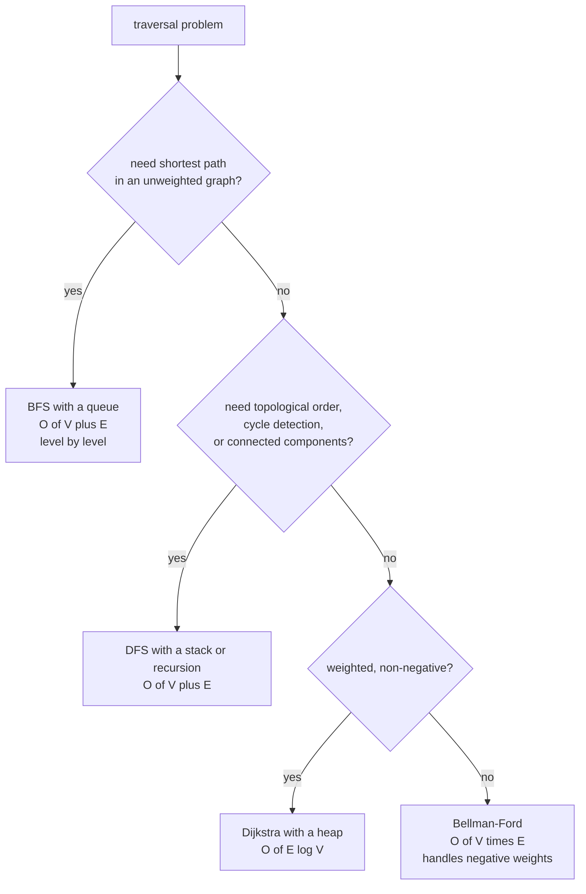

# Discrete Mathematics: Counting, Graphs, and Structure

Continuous mathematics gives you gradients. Discrete mathematics gives you
*structure*: how many ways there are to do something, what connects to what, and
how long an algorithm will take. It shows up in ML more than people expect —
attention is a complete graph, BPE training greedily merges adjacent token pairs, beam search is a bounded tree search, and every "why is this $O(n^2)$?"
question about transformers is a discrete-maths question.

## Sets and relations

A **set** is an unordered collection of distinct elements. The operations —
union $\cup$, intersection $\cap$, difference $\setminus$, complement, and the
power set $2^S$ — are the vocabulary for talking about data.

Two facts that get used constantly:

- $|2^S| = 2^{|S|}$. The number of feature subsets grows exponentially, which is
  why exhaustive feature selection is impossible past ~20 features and why
  greedy/regularised methods exist.
- **Inclusion–exclusion**: $|A\cup B| = |A|+|B|-|A\cap B|$, generalising to
  alternating sums. This is exactly the computation behind the Jaccard index
  $J(A,B) = \frac{|A\cap B|}{|A\cup B|}$ used for deduplication, MinHash
  near-duplicate detection in pretraining corpora, and set-based retrieval
  metrics.

A **relation** on $S$ is a subset of $S\times S$. When it is reflexive,
symmetric, and transitive it is an **equivalence relation** and it partitions $S$
into disjoint classes — which is what clustering produces, what union-find
computes, and what "these two documents are duplicates" asserts.

A finite **partial order** is reflexive, antisymmetric and transitive. Its strict comparisons omit self-pairs and form a DAG; a Hasse diagram keeps only cover relations. The reflexive relation itself contains self-loops and is not a DAG edge set. Then
**topological sort** on that DAG is how autodiff decides the order to evaluate
nodes and how a build system decides what to compile first.

## Combinatorics: counting without enumerating

### The rules

| Rule | Statement | Example |
|---|---|---|
| Sum rule | disjoint choices add | 3 CNNs or 4 transformers → 7 architectures |
| Product rule | sequential choices multiply | 5 LRs × 3 batch sizes × 4 depths = 60 configs |
| Permutations | $P(n,k) = \frac{n!}{(n-k)!}$ | ordered top-$k$ rankings |
| Combinations | $\binom{n}{k} = \frac{n!}{k!(n-k)!}$ | choosing a feature subset |
| With repetition | $n^k$ ordered, $\binom{n+k-1}{k}$ unordered | sequences of length $k$ over a vocab of $n$ |
| Multinomial | $\frac{n!}{n_1!\cdots n_k!}$ | arrangements with repeated items |

### Why this matters concretely

**Sequence space.** A vocabulary of 50,000 tokens and a context of 1,000 tokens
gives $50000^{1000} \approx 10^{4700}$ possible sequences. There are about
$10^{80}$ atoms in the observable universe. A language model cannot be a lookup
table; it *must* generalise. This counting argument is the cleanest one-line
justification for parametric models.

**Hyperparameter grids.** 6 hyperparameters at 5 values each is $5^6 = 15{,}625$
runs. At 2 GPU-hours each that is 31,250 GPU-hours. Random search and successive
halving are not laziness; they are the only options.

**Pairwise attention.** Query/key pairs are directed: dense self-attention has $n^2$ scores including self-access; causal attention allows $n(n+1)/2$. Unordered distinct pairs instead number $\binom n2$. Exact memory-efficient attention can retain all interactions while avoiding materialization of the full score matrix.

**Bagging.** Sampling $n$ items with replacement from $n$ leaves each item out
with probability $(1-1/n)^n \to e^{-1} \approx 0.368$. So each bootstrap sample
contains about 63.2% of the unique data, and the remaining 36.8% is the
**out-of-bag** set that random forests use for free validation. That number
falls straight out of a limit.

### Binomial coefficients and Pascal's identity

$$\binom{n}{k} = \binom{n-1}{k-1} + \binom{n-1}{k}$$

Either you take element $n$ or you do not. This recurrence is the standard
warm-up for dynamic programming, and the same "include/exclude" decomposition
drives subset-sum, knapsack, and edit distance.

### Pigeonhole principle

$n$ items in $m < n$ boxes forces some box to hold at least $\lceil n/m\rceil$
items. Consequences you actually meet:

- **Hash collisions are unavoidable.** The hashing trick maps an unbounded
  feature space into $2^{20}$ buckets; collisions are guaranteed, and the
  practical claim is only that they are rare and roughly harmless.
- **Lossless compression cannot compress everything.** There are more $n$-bit
  strings than shorter ones.
- **Quantisation** maps $2^{16}$ float values into 256 int8 levels — the
  information loss is a pigeonhole certainty, and calibration is about choosing
  *which* collisions to accept.

The **birthday paradox** is the probabilistic version: among $k$ items drawn
from $N$ possibilities, a collision becomes likely at $k \approx \sqrt{N}$. With
64-bit hashes, expect collisions after ~$2^{32}$ = 4 billion documents — which is
a real consideration when deduplicating web-scale corpora, and the reason 128-bit
hashes are used there.

## Graph theory

A graph $G = (V, E)$ is a set of vertices and a set of edges. This is the single
most reusable structure in computer science, and machine learning is full of
graphs that people do not always name as such.

| Type | Definition | ML instance |
|---|---|---|
| Undirected | edges are unordered pairs | social network, molecule |
| Directed | edges are ordered | citation graph, causal DAG |
| Weighted | edges carry values | similarity graph, attention weights |
| Bipartite | two disjoint vertex sets | user–item recommendation |
| DAG | directed, no cycles | computation graph, Bayesian network |
| Tree | connected, acyclic, $|E| = |V| - 1$ | decision tree, parse tree, beam search tree |
| Complete | every pair connected | self-attention over a sequence |
| Hypergraph | edges join $>2$ vertices | group interactions |

### Representations, and their trade-offs

| Representation | Space | Edge query | Neighbour iteration | Used by |
|---|---|---|---|---|
| Adjacency matrix | $O(V^2)$ | $O(1)$ | $O(V)$ | dense graphs, attention masks |
| Adjacency list | $O(V+E)$ | $O(\deg)$ | $O(\deg)$ | sparse graphs, most GNN libraries |
| Edge list (COO) | $O(E)$ | $O(E)$ | $O(E)$ | PyTorch Geometric's `edge_index` |
| CSR/CSC | $O(V+E)$ | $O(\log \deg)$ with sorted indices | $O(\deg)$ | sparse matmul kernels, DGL |

Real graphs are sparse: a social network with $10^9$ users has average degree in
the hundreds, so $E \approx 10^{11}$ against $V^2 = 10^{18}$. Adjacency matrices
are not an option, and this is why GNN frameworks are built around
message-passing over edge lists rather than dense matrix multiplication.

### Traversal



BFS explores by distance and therefore finds shortest paths in unweighted
graphs; DFS goes deep and is what you want for topological sort, cycle
detection, and strongly connected components (Tarjan/Kosaraju). Both are
$O(V+E)$.

### Graph algorithms with ML relevance

| Algorithm | Complexity | Why it appears in ML |
|---|---|---|
| BFS/DFS | $O(V+E)$ | $k$-hop neighbourhoods for GNN sampling |
| Dijkstra | $O(E\log V)$ | shortest-path features, routing |
| Union-find | $O(\alpha(n))$ amortized with path compression and rank/size union | connected components, single-link clustering, dedup clusters |
| Kruskal / Prim MST | $O(E\log V)$ | single-linkage clustering is exactly MST cutting |
| PageRank | power iteration | node importance; the original was a Markov chain on a graph |
| Spectral clustering | eigendecomposition of the Laplacian | community detection, image segmentation |
| Max-flow / min-cut | $O(V^2E)$ or better | image segmentation (graph cuts), matching |
| Bipartite matching | Hungarian, $O(n^3)$ | DETR's set prediction loss, assignment problems |
| Viterbi | $O(TK^2)$ | best path in an HMM/CRF — dynamic programming on a trellis |

### The graph Laplacian

$$L = D - A, \qquad L_{\text{sym}} = I - D^{-1/2}AD^{-1/2}$$

Assume an undirected graph with nonnegative weights. $D$ is its diagonal degree matrix. The normalized expression above assumes positive degrees; with isolates use zero inverse degree and $D^{-1/2}LD^{-1/2}$, giving a zero isolated row/column. See [SciPy's convention](https://docs.scipy.org/doc/scipy/reference/generated/scipy.sparse.csgraph.laplacian.html). Key facts:

- $L$ is symmetric positive semi-definite.
- $\mathbf{x}^\top L \mathbf{x} = \sum_{(i,j)\in E} w_{ij}(x_i - x_j)^2$ — it
  measures how much a signal varies across edges. This is a **smoothness
  penalty**, which is why it appears in semi-supervised learning as a
  manifold-regularisation term.
- The multiplicity of eigenvalue 0 equals the number of connected components.
  The eigenvector for the second-smallest eigenvalue (the **Fiedler vector**)
  solves a continuous relaxation; rounding it into a cut is not a guarantee of the optimal discrete bipartition.
- Graph convolutional networks are, in their original derivation, a first-order
  approximation to spectral filtering with $L_{\text{sym}}$. The famous GCN
  layer $H' = \sigma(\tilde D^{-1/2}\tilde A\tilde D^{-1/2}HW)$ comes directly
  from truncating a Chebyshev expansion of a spectral filter.

**Over-smoothing** can occur under repeated neighborhood propagation. A finite irreducible, aperiodic random walk converges to a unique stationary distribution; disconnected graphs have separate component limits and bipartite walks can oscillate without laziness/self-loops. Symmetrically normalized propagation can approach degree-scaled signals rather than identical rows. Nonlinear learned layers need separate analysis. Residual connections, jumping knowledge and PairNorm address related depth difficulties, but no theorem limits every useful GNN to three layers.

## Recurrences and complexity

### Solving recurrences

Divide-and-conquer algorithms give recurrences of the form
$T(n) = aT(n/b) + f(n)$. The **master theorem** resolves them by comparing
$f(n)$ against $n^{\log_b a}$:

| Case | Condition | Result | Example |
|---|---|---|---|
| 1 | $f(n) = O(n^{\log_b a - \epsilon})$ | $T = \Theta(n^{\log_b a})$ | Karatsuba: $T=3T(n/2)+O(n) \Rightarrow n^{1.585}$ |
| 2 | $f(n) = \Theta(n^{\log_b a})$ | $T = \Theta(n^{\log_b a}\log n)$ | merge sort: $2T(n/2)+O(n)\Rightarrow n\log n$ |
| 3 | $f(n) = \Omega(n^{\log_b a+\epsilon})$, regularity | $T = \Theta(f(n))$ | work dominated by the combine step |

Strassen's matrix multiplication, $T(n) = 7T(n/2) + O(n^2)$, lands in case 1 and
gives $n^{\log_2 7} \approx n^{2.807}$ — asymptotically better than $n^3$, but
rarely used in ML because it is numerically less stable and the constant factors
lose to hardware-tuned $n^3$ kernels. A good reminder that asymptotics are not
the whole story.

### Complexity of things you actually run

| Operation | Complexity | Note |
|---|---|---|
| Dense matmul $(n\times m)(m\times p)$ | $O(nmp)$ | the cost model for all of deep learning |
| Self-attention, sequence $n$, dim $d$ | $O(n^2 d)$ time, $O(n^2)$ memory naively | FlashAttention keeps the time, uses $O(nd)$ activation storage plus kernel workspace, linear in $n$ at fixed $d$ |
| Feed-forward block, dim $d$, hidden $4d$ | $O(nd^2)$ | dominates attention until $n > d$ |
| Sorting $n$ items | $O(n\log n)$ | top-$k$ can be $O(n\log k)$ or expected $O(n)$ with randomized quickselect |
| $k$-NN, brute force | $O(Nd)$ per query | ANN indexes (HNSW, IVF-PQ) trade recall for speed |
| $k$-means, one Lloyd iteration | $O(NKd)$ | why $K$ and $d$ both matter |
| Decision tree training | often $O(Nd\log N)$ under favorable balanced-tree/sort-reuse assumptions | repeated sorting and unbalanced depth can cost more |
| Backprop through $L$ layers | same order as forward | reverse mode's key guarantee |
| Beam search, beam $B$, length $T$ | $O(BTV)$ candidate-score access, e.g. $O(TBV\log B)$ heap selection | linear in beam, not exponential |
| Exact Viterbi decoding | $O(TK^2)$ | vs $O(K^T)$ for brute force |

Notice the shape of the attention row. Attention is $O(n^2 d)$ and the FFN is
$O(nd^2)$; attention only dominates when $n > d$. For a model with $d = 4096$ and
$n = 512$, the FFN is the bottleneck, not attention — a fact that surprises
people who have absorbed "attention is quadratic" without the constant.

### P, NP, and why we approximate

- **P** — decision problems solvable in polynomial time in input encoding length.
- **NP** — decision problems whose yes instances have polynomial-length certificates verifiable in polynomial time.
- **NP-complete** — the hardest problems in NP; a polynomial algorithm for one
  gives one for all.
- **NP-hard** — at least as hard as NP-complete, not necessarily in NP.

ML problems that are NP-hard, and what we do instead:

| Problem | Hardness | Practical approach |
|---|---|---|
| Size-bounded decision-tree consistency decision problem | NP-complete | greedy splitting (CART, ID3) |
| Exact $k$-means | NP-hard | Lloyd's algorithm with $k$-means++ init |
| Best feature subset | NP-hard | L1 regularisation, greedy forward/backward |
| Learning optimal Bayesian network structure | NP-hard | score-based greedy search, constraint-based |
| Exact MAP inference in a general graphical model | NP-hard | loopy BP, variational, sampling |
| Consistency of specific small threshold-network architectures | NP-complete in established formulations | continuous surrogate training does not solve the worst-case decision problem |

Hardness depends on activation, architecture, input encoding and decision versus optimization formulation. It is a worst-case statement, not proof that each small network or each dataset is hard. Avoid transferring a threshold-network hardness theorem to every modern architecture.

The classical small-network result uses linear-threshold nodes; see [Blum and Rivest's original paper](https://people.csail.mit.edu/rivest/pubs/BR93.pdf).

## Dynamic programming

DP applies when a problem has **optimal substructure** (the optimum is built
from optima of subproblems) and **overlapping subproblems** (the same
subproblems recur). It appears throughout NLP.

| DP algorithm | Recurrence idea | Where |
|---|---|---|
| Edit distance | insert/delete/substitute, take the min | spelling correction, WER, diff |
| Longest common subsequence | match or skip one side | ROUGE-L, diffing |
| Viterbi | best path to each state at each time | HMM POS tagging, CRF decoding |
| Forward–backward | sum over paths instead of max | HMM training, CTC loss |
| CTC | sum over all alignments of a label sequence | speech recognition without alignments |
| CKY parsing | best parse of each span | constituency parsing |
| Knapsack | include/exclude with a capacity | budgeted selection |

**Edit distance, worked.** With $D[i][j]$ the distance between the first $i$ and
first $j$ characters:

$$D[i][j] = \begin{cases} \max(i,j) & \text{if } \min(i,j)=0 \\ \min\bigl(D[i{-}1][j]+1,\; D[i][j{-}1]+1,\; D[i{-}1][j{-}1]+\mathbb{1}[a_i\ne b_j]\bigr) & \text{otherwise}\end{cases}$$

$O(mn)$ time, and $O(\min(m,n))$ space if you only need the number. Word error
rate is word-level $(S+D+I)/N_{\rm reference}$, so it normalizes the minimum edit count and can exceed one. An empty reference needs a declared convention.

**CTC** is the one to understand if you touch speech. It sums over *all*
alignments of a short label sequence to a long audio sequence using a
forward–backward DP, so you never need frame-level labels. The dynamic program
makes the sum computationally tractable; differentiability follows from the underlying sum/product probability expression, not from dynamic programming itself.

## Logic and Boolean algebra

Propositional logic gives you $\land, \lor, \neg, \Rightarrow$, and the
equivalence $(p \Rightarrow q) \equiv (\neg p \lor q)$ that trips people up in
interviews. **De Morgan's laws** $\neg(p\land q) \equiv \neg p \lor \neg q$ are
worth reflexive fluency because they show up in query rewriting and in reasoning
about masks.

Where logic touches ML:

- **Attention masks** are Boolean matrices; causal masking is the predicate
  $j \le i$.
- **Neuro-symbolic systems** attach differentiable relaxations to logical
  operators (t-norms: $p \land q \approx pq$ or $\min(p,q)$).
- **SAT/SMT solvers** back constrained decoding and program synthesis.
- **Formal verification** of network properties (robustness certificates) is
  encoded as satisfiability over piecewise-linear constraints — which is one reason piecewise-linear ReLU networks admit useful verification encodings; other activation families can also be verified with different methods.

## Number theory, the useful fragment

- **Modular arithmetic** underlies hashing (`h(x) mod m`), the hashing trick,
  and reproducible sharding of data across workers.
- **Primes** can help simple modular hashing avoid particular patterns; good bit-mixing functions also work with power-of-two table sizes.
- **GCD/LCM** appear in scheduling and stride computations.
- **Universal and locality-sensitive hashing** are number-theoretic
  constructions; MinHash estimates Jaccard similarity and SimHash estimates
  cosine similarity, both by hashing rather than by comparing. Web-scale
  deduplication of pretraining data runs on exactly these.

## Discrete structures inside familiar models

| ML object | Discrete structure |
|---|---|
| Self-attention | complete weighted directed graph over tokens |
| Causal masking | all allowed ordered pairs $j\le i$, including self-access; not just adjacent chain edges |
| Byte-pair encoding | greedy adjacent-pair merges with a learned ordered merge list |
| Beam search | breadth-limited tree search |
| MoE routing | bipartite assignment of tokens to experts, often solved with an auxiliary balanced-assignment objective |
| Decision tree | rooted tree with axis-aligned predicates |
| Random forest | forest of trees over bootstrapped multisets |
| Computation graph | DAG, evaluated in topological order |
| Tokenizer vocabulary | a trie |
| KV cache paging | a block table — an indirection layer, exactly like virtual memory |
| RadixAttention prefix cache | a radix tree over token prefixes |

The last two are worth noticing: modern inference servers borrow the operating
system's page table and the string algorithm's radix tree wholesale. Systems
work in ML is largely discrete algorithms applied to tensors.

## Proofs and algorithms worked through

### Quantifiers and proof methods

"For every input there exists a parameter" is not the same claim as "there
exists one parameter that works for every input." Order matters:
$\forall x\,\exists w$ permits $w$ to depend on $x$, while
$\exists w\,\forall x$ does not.
A direct proof derives the conclusion from assumptions, such as showing
the sum of two even integers $2a+2b=2(a+b)$ is even.
A contrapositive proves $\neg Q\Rightarrow\neg P$ instead of $P\Rightarrow Q$:
if $n^2$ is odd then $n$ is odd because an even $n$ has an even square.
A contradiction assumes the negation and derives an impossibility.

Induction proves a base case and a step from $n$ to $n+1$.
For $\sum_{i=1}^n i=n(n+1)/2$, add $n+1$ to the induction hypothesis:
$n(n+1)/2+n+1=(n+1)(n+2)/2$.
Strong induction may assume every smaller case, useful for recursion with
several smaller arguments. A loop invariant is the same discipline applied
to iterations: establish it initially, preserve it, then use it at termination.
Termination itself needs an argument, such as a decreasing count of unprocessed
vertices; partial correctness is not a termination proof.

### Counting exactly before approximating

For $k$ independent uniform hashes into $N$ buckets, no-collision probability
is $\prod_{j=0}^{k-1}(1-j/N)$ for $k\le N$. Taking logarithms and using
$\log(1-x)\approx-x$ gives
$P(\text{collision})\approx1-\exp[-k(k-1)/(2N)]$ when the approximation
is appropriate. At $k=5\cdot10^9,N=2^{64}$, the exponent is about
$.6776$, giving probability about $.492$. "Expected collisions" and
"probability of at least one collision" are not the same number.
The union bound $P(\text{collision})\le\binom{k}{2}/N$ needs no independence
between individual pair-collision events.

For bootstrap occupancy, indicator $I_i$ says item $i$ appears at least once.
Linearity of expectation gives
$E[\sum I_i]=n[1-(1-1/n)^n]$, even though occupancy indicators are dependent.
At $n=5$ this is $5(1-.8^5)=3.3616$, not exactly $0.632n$.

### BFS and topological order on one graph

Take edges $a\to b,a\to c,b\to d,c\to d$. BFS starts with queue $[a]$,
then $[b,c]$, then $[c,d]$, then $[d]$, finally empty.
Mark a vertex when enqueuing it, so $d$ is not inserted twice.
The invariant is that queued vertices occur in nondecreasing distance from
the start; discovering an unseen neighbor of distance $k$ assigns $k+1$.
This proves shortest unweighted distances $0,1,1,2$.

Kahn's topological algorithm removes zero-indegree vertices and decrements
their outgoing neighbors. On this graph it can return $a,b,c,d$.
Adding $d\to a$ leaves no way to remove every vertex; a remaining positive
indegree subgraph certifies a directed cycle. DFS instead detects a directed
cycle via an edge to an active recursion-stack vertex; a visited neighbor
alone is not sufficient evidence.

```python runnable
from collections import deque
from graphlib import TopologicalSorter, CycleError

graph = {"a": ["b", "c"], "b": ["d"], "c": ["d"], "d": []}
def bfs(graph, start):
    distance, queue = {start: 0}, deque([start])
    while queue:
        node = queue.popleft()
        for neighbor in graph[node]:
            if neighbor not in distance:
                distance[neighbor] = distance[node]+1
                queue.append(neighbor)
    return distance

assert bfs(graph, "a") == {"a": 0, "b": 1, "c": 1, "d": 2}
assert bfs(graph, "d") == {"d": 0}
predecessors = {node: set() for node in graph}
for node, neighbors in graph.items():
    for neighbor in neighbors:
        predecessors[neighbor].add(node)
order = tuple(TopologicalSorter(predecessors).static_order())
position = {node: i for i, node in enumerate(order)}
assert all(position[u] < position[v] for u in graph for v in graph[u])
predecessors["a"].add("d")
try:
    tuple(TopologicalSorter(predecessors).static_order())
except CycleError:
    pass
else:
    raise AssertionError("Expected a directed cycle")
print("BFS:", bfs(graph, "a"), "topological order:", order)
```

### An edit-distance grid and log-domain Viterbi

For source "cat" and target "cut", the full grid is:

| | empty | c | u | t |
|---|---|---|---|---|
| empty | 0 | 1 | 2 | 3 |
| c | 1 | 0 | 1 | 2 |
| a | 2 | 1 | 1 | 2 |
| t | 3 | 2 | 2 | 1 |

Backtracking diagonally from the final one gives match t, substitute a to u,
match c. This yields one optimal alignment; ties can yield several. Two-row
DP retains only distances, not enough information for direct backtracking
without recomputation or a more sophisticated linear-space alignment algorithm.

```python runnable
def edit_distance(a, b):
    if len(a) < len(b):
        a, b = b, a
    previous = list(range(len(b)+1))
    for i, left in enumerate(a, 1):
        current = [i]
        for j, right in enumerate(b, 1):
            current.append(min(previous[j]+1, current[-1]+1,
                               previous[j-1]+(left != right)))
        previous = current
    return previous[-1]

assert edit_distance("cat", "cut") == 1
assert edit_distance("", "") == 0
assert edit_distance("", "abc") == 3
assert edit_distance("kitten", "sitting") == 3
reference = "one two".split()
hypothesis = "one two three four five".split()
wer = edit_distance(reference, hypothesis)/len(reference)
assert wer == 1.5
print("WER with three insertions:", wer)
```

For HMM states $j$, Viterbi uses
$v_t(j)=\log p(x_t\mid j)+\max_i[v_{t-1}(i)+\log P(j\mid i)]$,
initialized by $\log\pi_j+\log p(x_1\mid j)$.
Store maximizing predecessors to reconstruct the path. Zero transitions have
log probability $-\infty$. Replacing max by log-sum-exp computes a summed
forward probability, not the most likely path.

### Complexity terminology before applying a theorem

$f=O(g)$ is an eventual upper bound up to a fixed constant;
$f=\Omega(g)$ is a lower bound; $\Theta$ means both.
Worst-case bounds maximize over inputs of a size, expected bounds specify
a randomness distribution, and amortized bounds spread total cost over a
sequence without a probability assumption.
Input size means encoding length: an integer $M$ needs $O(\log M)$ bits,
so a runtime proportional to $M$ is not polynomial in its bit length.

Merge sort has $\log_2n$ levels, each processing total size $n$,
giving $\Theta(n\log n)$. The standard master theorem assumes fixed
$a\ge1,b>1$ and regularity in its third case; it does not apply to
$T(n)=T(n-1)+n$. Direct summation gives $\Theta(n^2)$ for that recurrence.

## Self-check

1. A context window of 8k tokens grows to 32k. By what factor do attention FLOPs
   and attention memory grow, and does the FFN cost change?
2. Derive the 63.2% figure for bootstrap coverage.
3. Why do most GNNs stop at 2–3 layers? Answer in terms of random walks.
4. What is the complexity of Viterbi decoding, and what is it replacing?
5. You hash 5 billion documents with a 64-bit hash. Should you expect
   collisions? Show the birthday-bound reasoning.
6. Write the edit-distance recurrence and say what WER is in terms of it.
7. Explain what $\mathbf{x}^\top L\mathbf{x}$ measures and why it is used as a
   regulariser.

## Worked self-check answers

1. Four times the sequence length gives sixteen times the dense attention
   interaction work and naive score storage, at fixed width. FFN work and
   memory-efficient attention activation storage scale by four.
2. Each item is absent with probability $(1-1/n)^n$; sum appearance
   indicators and take its $e^{-1}$ limit to obtain $1-e^{-1}$.
3. Repeated propagation can suppress distinctions within connected components
   under mixing conditions. This explains one failure mode, not a universal
   two-to-three-layer limit; periodicity, degrees and nonlinear layers matter.
4. Dense-transition Viterbi uses $O(TK^2)$ work, replacing enumeration of
   $K^T$ state sequences. Sparse transitions can lower that cost.
5. The expected colliding-pair count is about $.6776$, and the usual
   birthday approximation gives about $.492$ probability of at least one.
6. Minimize deletion, insertion and substitution costs with empty-prefix
   boundary conditions. WER is minimum word edit count divided by reference length.
7. For an undirected nonnegative graph, $x^\top Lx$ sums weighted squared
   edge differences once per undirected edge, favoring neighboring predictions
   that agree. Negative or directed weights require different claims.

## Where to go next

- [Linear Algebra](./linear-algebra.md) — the Laplacian's spectrum, and matrices
  as graphs.
- [Probability](./probability.md) — sampling and conditioning; a full random-graph or Markov-chain course remains further study.
- [Numerical Computing](./numerical-methods.md) — what the complexity table
  costs once floating point is involved.
