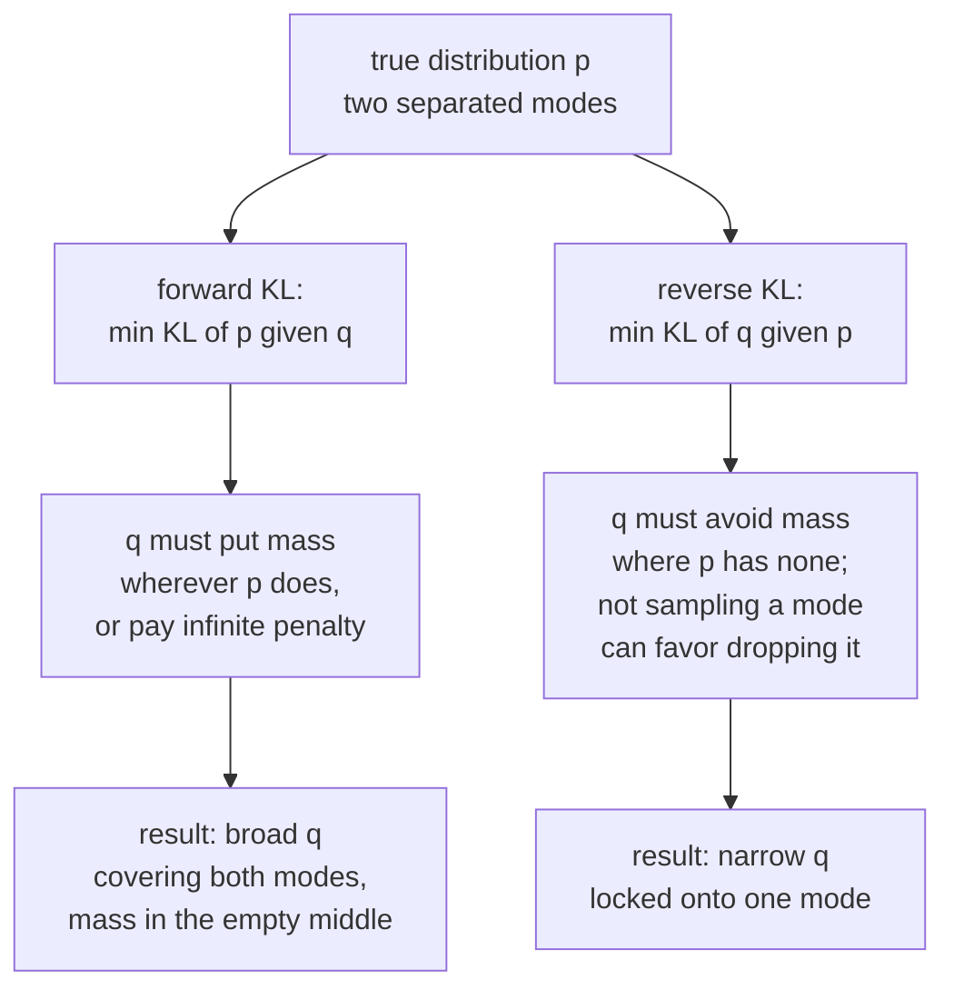
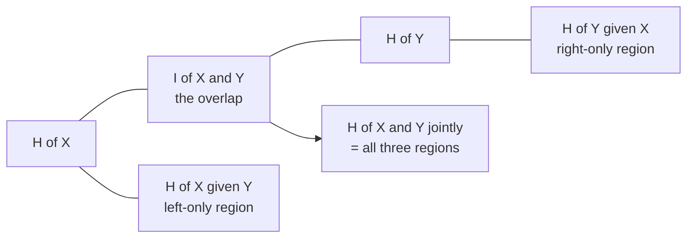

# Information Theory: Measuring Surprise

Shannon set out in 1948 to answer an engineering question — how few bits can
carry a message reliably — and produced the measuring system that machine
learning now runs on. Many classification losses are cross-entropies; language models use exponentiated cross-entropy as perplexity. Some decision trees use information gain, and certain contrastive objectives yield mutual-information bounds under sampling assumptions.
Your model's job, under one influential reading, is compression.

This page builds the quantities from the ground up and then shows where each one
already appears in your training loop.

## Surprisal: the atom

How surprised should you be by an outcome with probability $p$?

Three requirements pin the answer down completely:

1. Surprise decreases with probability. Certain events surprise nobody.
2. $p = 1$ gives surprise 0.
3. Surprise of independent events **adds**: seeing two independent things should
   surprise you as much as the sum of each.

Requirement 3 forces a logarithm, since it is the only function turning products
into sums:

$$I(x) = -\log p(x) = \log\frac{1}{p(x)}$$

Base 2 gives **bits**; base $e$ gives **nats**; base 10 gives **hartleys**. ML
uses nats internally (the log in your loss function) and quotes bits when
talking about compression. $1\ \text{nat} = 1.4427$ bits.

| $p(x)$ | surprisal (bits) | intuition |
|---|---|---|
| 1 | 0 | "the sun rose" |
| 1/2 | 1 | one coin flip |
| 1/8 | 3 | three coin flips |
| 1/1000 | 9.97 | a rare token |
| $\to 0$ | $\to \infty$ | why $\log 0$ blows up your loss |

That last row is not an abstraction. Assigning probability zero to something that
then happens gives infinite loss — which is precisely why label smoothing,
epsilon floors, and clamped logits exist.

## Entropy

Entropy is expected surprisal:

$$H(X) = \mathbb{E}_{x\sim p}[-\log p(x)] = -\sum_x p(x)\log p(x)$$

It measures **average uncertainty** in a distribution, and — via Shannon's source
coding theorem — the average number of bits needed per symbol under the best
possible lossless code.

### Properties

- $H(X) \ge 0$, with equality iff $X$ is deterministic.
- $H(X) \le \log |\mathcal{X}|$, with equality iff $X$ is uniform. **Uniform is
  maximum entropy.**
- Entropy depends only on the probabilities, not on the values. Relabelling
  outcomes changes nothing.
- For a continuous variable, **differential entropy**
  $h(X) = -\int f\log f$ can be negative and is not coordinate-invariant. Use it
  with care; KL and mutual information remain well behaved.

### Worked: the binary entropy function

$$H_b(p) = -p\log_2 p - (1-p)\log_2(1-p)$$

| $p$ | $H_b(p)$ bits |
|---|---|
| 0.5 | 1.000 |
| 0.7 | 0.881 |
| 0.9 | 0.469 |
| 0.99 | 0.081 |
| 0.999 | 0.011 |

A 90/10 class split carries less than half a bit per label. This is a concrete
statement of why imbalanced classification is easy to score well on and hard to
do well at: a constant predictor already captures most of the available
information.

### Maximum entropy as a modelling principle

Among all distributions satisfying your known constraints, pick the one with
maximum entropy — it assumes the least beyond what you actually know.

| Constraints | MaxEnt distribution |
|---|---|
| support on $\{1..K\}$, nothing else | Uniform |
| support $[0,\infty)$, fixed mean | Exponential |
| fixed mean and variance on $\mathbb{R}$ | **Gaussian** |
| fixed mean on $\{0,1,2,\dots\}$ | Geometric |
| fixed expected feature values | **Softmax / logistic regression** |

The last row is the deep one: logistic regression and softmax classifiers are
*derived*, not invented. Maximise entropy subject to matching the empirical
feature expectations and the exponential-family form
$p(y\mid x) \propto \exp(w_y^\top x)$ falls out. "Maximum entropy classifier"
was the original name in NLP.

## Joint, conditional, and the chain rule

$$H(X,Y) = -\sum_{x,y}p(x,y)\log p(x,y), \qquad H(Y\mid X) = -\sum_{x,y}p(x,y)\log p(y\mid x)$$

$$H(X,Y) = H(X) + H(Y\mid X)$$

Uncertainty about a pair equals uncertainty about the first plus remaining
uncertainty about the second. Conditioning never increases entropy on average:
$H(Y\mid X)\le H(Y)$, with equality iff independent. (Note "on average": a
*particular* observation can increase your uncertainty.)

For a sequence, the chain rule iterates:

$$H(X_1,\dots,X_T)=\sum_{t=1}^{T}H(X_t\mid X_{<t})$$

An autoregressive language model is a machine for estimating each term on the
right. Its empirical loss estimates cross-entropy under the fitted model, equal to true conditional entropy only for correct conditionals in expectation. Evaluation on training data also carries fitting optimism.

## Cross-entropy and KL divergence

You have the true distribution $p$ and a model $q$. Encode data from $p$ using a
code optimised for $q$ and you pay:

$$H(p,q) = -\sum_x p(x)\log q(x)$$

The excess over the best possible ($H(p)$) is the **Kullback–Leibler
divergence**:

$$D_{\mathrm{KL}}(p\,\|\,q) = \sum_x p(x)\log\frac{p(x)}{q(x)} = H(p,q) - H(p) \;\ge\; 0$$

Non-negativity follows from Jensen's inequality applied to the concave $\log$;
equality holds iff $p=q$ everywhere. It is **not** a metric: not symmetric, and
it violates the triangle inequality.

### The identity that explains supervised learning

For a fixed dataset, $H(p)$ is a constant. Therefore

$$\arg\min_q H(p,q) = \arg\min_q D_{\mathrm{KL}}(p\,\|\,q)$$

**Minimising cross-entropy loss is fitting your model's distribution to the
data's distribution in KL.** You are not learning a decision boundary; you are
doing density estimation, and the decision boundary is a downstream `argmax`.

With a one-hot target the cross-entropy collapses to $-\log q(y_{\text{true}})$
— the surprisal of the correct answer. That is the whole of your classification
loss.

### Direction matters

The following picture describes possible tendencies when $q$ belongs to a restricted family unable to represent $p$. If $p$ is representable, both KL directions minimize at $q=p$. Finite underweighting is not the same as assigning zero support.



| | Forward $D_{\mathrm{KL}}(p \,\Vert\, q)$ | Reverse $D_{\mathrm{KL}}(q \,\Vert\, p)$ |
|---|---|---|
| Nickname | mean-seeking, zero-avoiding | mode-seeking, zero-forcing |
| Penalty | $\infty$ if $q=0$ where $p>0$ | $\infty$ if $q>0$ where $p=0$ |
| Possible restricted-family tendency | over-dispersion | mode concentration |
| Appears in | MLE, cross-entropy training, knowledge distillation | variational inference, VAE ELBO, RLHF KL penalty |

VAE blur can reflect decoder likelihood and averaging; GAN mode dropping also depends on model restrictions and training dynamics. Neither is universally determined by one KL direction. The original idealized GAN minimax objective involves JS, not simply reverse KL.

### Jensen–Shannon divergence

A symmetric, bounded alternative:

$$\mathrm{JS}(p\|q) = \tfrac12 D_{\mathrm{KL}}(p\|m) + \tfrac12 D_{\mathrm{KL}}(q\|m), \qquad m = \tfrac{p+q}{2}$$

$\sqrt{\mathrm{JS}}$ is a true metric, and JS is bounded by $\log 2$. The
original GAN objective is, at the optimal discriminator, minimising
$2\,\mathrm{JS}(p_{\text{data}}\|p_g) - \log 4$. **Its flaw is instructive**:
when the two distributions have disjoint support — which is generic for
high-dimensional data on low-dimensional manifolds — JS is constant at $\log 2$
over parameter regions where supports stay disjoint. This motivates studying Wasserstein objectives, but does not certify the gradient of a finite, imperfect discriminator or diagnose every training failure. See the [original GAN analysis](https://arxiv.org/abs/1406.2661).

### Other divergences worth recognising

| Divergence | Formula/idea | Where |
|---|---|---|
| $f$-divergence | $\int q\,f(p/q)$; generalises KL, JS, $\chi^2$, TV | $f$-GAN family |
| Total variation | $\tfrac12\sum \lvert p-q \rvert$ | bounds on distinguishability |
| Wasserstein-1 | min cost to move mass | WGAN, FID's cousin, distribution shift metrics |
| Rényi $\alpha$-divergence | $\frac{1}{\alpha-1}\log\sum p^\alpha q^{1-\alpha}$ | differential privacy accounting |
| Bregman divergence | $f(p)-f(q)-\nabla f(q)^\top(p-q)$ | unifies squared error and KL |

## Mutual information

$$I(X;Y) = D_{\mathrm{KL}}\bigl(p(x,y)\,\|\,p(x)p(y)\bigr) = H(X) - H(X\mid Y) = H(X)+H(Y)-H(X,Y)$$

The reduction in uncertainty about $X$ from learning $Y$. Symmetric,
non-negative, and zero **iff** $X \perp Y$ — which is strictly stronger than
zero correlation, because it detects non-linear dependence too.



### Where mutual information already appears in your work

- **Decision trees**: information gain is $I(Y; \text{split})$ — the entropy of
  the labels minus weighted child entropy. ID3 uses information gain; C4.5 uses gain ratio, normalizing gain by split entropy with additional selection details.
- **Feature selection**: mutual information filters rank features by
  $I(X_j; Y)$, catching non-linear relevance that correlation misses. mRMR adds
  a redundancy penalty $I(X_j; X_k)$.
- **Contrastive learning**: with $N$ total candidates (one joint positive and $N-1$ independent marginal negatives), the usual InfoNCE result is $I(X;Y)\ge\log N-\mathcal L_{\mathrm{NCE}}$. The loss itself is not the lower bound; changing negative sampling can invalidate this interpretation. The bound cannot exceed $\log N$. See [CPC](https://arxiv.org/abs/1807.03748).
- **Information bottleneck**: learn $Z$ minimising $I(X;Z) - \beta I(Z;Y)$ —
  compress the input as much as possible while keeping what predicts the label.
  It is a clean formal statement of what a good representation is.
- **Clustering evaluation**: adjusted mutual information scores a clustering
  against ground truth without needing label alignment.

**Estimating MI from samples is hard.** In high dimensions, estimators (KSG,
MINE, InfoNCE) have high variance and known pathologies — MI can be infinite for
deterministic continuous maps, and bounds are loose. Treat reported MI numbers
with the same suspicion as reported p-values.

## Coding: where the bits come from

Shannon's **source coding theorem**: uniquely decodable binary coding of iid symbols from
$p$ has expected length $\ge H(p)$ bits per symbol, and codes achieving $H(p) +
\epsilon$ exist.

| Code | Idea | Optimality |
|---|---|---|
| Huffman | greedy binary merge of the two rarest symbols | optimal among integer-length symbol codes; within 1 bit of $H$ |
| Arithmetic coding | encode the whole message as one interval | reaches $H$ asymptotically; handles fractional bits |
| Asymmetric numeral systems (ANS) | state-machine version of arithmetic coding | modern default (Zstandard, JPEG XL) |

**The connection to language models is operational.** Feed shared conditional probabilities to an arithmetic coder and ideal message length approaches the summed negative base-two log probabilities. Actual finite files also include coder overhead, finite-precision effects and any model or tokenizer metadata not already shared. Tokenization must be reversible to recover the exact source bytes. No corpus-independent claim of beating all classical compressors follows from a model's reported bits per byte.

### Kolmogorov complexity, in one paragraph

$K(x)$ is the length of the shortest program that outputs $x$. It is the
individual-object analogue of entropy, it is uncomputable, and it underpins
**minimum description length** (MDL): choose the model minimising
(bits to describe the model) + (bits to describe the data given the model). MDL
is a rigorous derivation of Occam's razor and a principled account of
regularisation — a model with fewer effective bits of parameters is preferred
unless it pays for itself in data-coding savings.

## Perplexity: the LM metric, demystified

$$\mathrm{PPL} = \exp\left(-\frac{1}{T}\sum_{t=1}^{T}\log p(x_t\mid x_{<t})\right) = e^{H}$$

Perplexity is the exponentiated average cross-entropy, i.e. the **effective
number of equally likely choices** at each step. A model with PPL 20 assigns the observed targets geometric-mean probability $1/20$; its actual predictive entropy need not equal that of a uniform distribution.

For a uniform model over 50,000 tokens, perplexity is 50,000. Other model-family values require a named corpus, tokenizer and evaluation protocol; there is no universal historical-to-modern quality ladder.

Three caveats that decide whether a perplexity comparison is meaningful at all:

1. **Tokenisation.** Byte-level, subword, and word-level perplexities are not
   comparable. Normalise to bits-per-byte if you must compare across
   tokenisers.
2. **Corpus.** Perplexity on Wikipedia and on code are different numbers about
   different things.
3. **Context length.** True conditional entropy cannot increase on average when conditioning on more information. A fitted model's measured perplexity can increase with added context or changed evaluation windows.

Perplexity also correlates imperfectly with downstream usefulness — an
instruction-tuned model often has *worse* perplexity on raw web text than its
base model while being far more useful.

## Label smoothing, read information-theoretically

Replace the one-hot target with

$$y'_k = (1-\epsilon)\,y_k + \frac{\epsilon}{K}$$

The target now has entropy $>0$, so the minimum achievable loss is no longer
zero when $0<\epsilon<1$ and $K>1$. At an unconstrained optimum, probability ratios and hence relative logit differences are finite. Absolute logits remain shift-invariant and unbounded. Possible empirical effects:

- Less extreme probability targets, which can improve or worsen held-out **calibration** depending on the data and model.
- A small regularisation effect, since the model is penalised for extreme
  confidence.
- Tighter, more equidistant class clusters in the penultimate layer.
- A cost: it can *hurt* knowledge distillation, because it erases the
  fine-grained inter-class information in the teacher's soft targets that
  distillation depends on.

Which brings us to distillation itself: the student minimises
$D_{\mathrm{KL}}(p_{\text{teacher}}^{T} \,\|\, p_{\text{student}}^{T})$ with
temperature-softened distributions. The teacher's "dark knowledge" is the
relative probability it assigns to *wrong* classes — that a 7 looks a bit like a
1 — and that is information a one-hot label simply does not contain.

## Information theory in RL and alignment

- **Entropy bonus**: adding $+\beta H(\pi(\cdot\mid s))$ to the policy objective
  keeps the policy stochastic and encourages exploration. Soft actor-critic
  builds this in as a maximum-entropy objective.
- **KL trust regions**: TRPO uses a KL-constrained surrogate. PPO includes a clipped-surrogate variant and a KL-penalty variant; clipping is not a hard KL constraint and does not guarantee policy improvement. See [PPO](https://arxiv.org/abs/1707.06347).
- **RLHF KL penalty**: the reward is $r(x,y) - \beta
  D_{\mathrm{KL}}(\pi_{\text{RL}}\|\pi_{\text{SFT}})$. Without it the policy
  drifts into degenerate text that games the reward model. $\beta$ is the
  alignment tax dial.
- **DPO** rewrites that constrained objective in closed form, removing the need
  for an explicit reward model — its derivation is essentially an exercise in
  KL-regularised optimisation.

## Worked information and coding

### A binary channel connects every entropy quantity

Let $X$ be a fair bit, $E$ an independent Bernoulli$(1/4)$ bit, and
$Y=X\oplus E$. Joint probabilities are $p(0,0)=p(1,1)=3/8$ and
$p(0,1)=p(1,0)=1/8$. Both marginals are uniform, so $H(X)=H(Y)=1$
bit. The uncertainty in $Y$ given $X$ is the flip uncertainty:
$H(Y\mid X)=H_b(1/4)\approx.811278$ bits. Consequently
$H(X,Y)=1.811278$ and $I(X;Y)=.188722$ bits.

Conditional information is different: knowing the error bit makes $Y$
determine $X$, so $I(X;Y\mid E)=H(X\mid E)-H(X\mid Y,E)=1$ bit.
Conditioning can increase mutual information; there is no blanket
"conditioning reduces every information quantity" rule.

### Data processing needs a Markov relation

If $X\to Y\to Z$ is a Markov chain, meaning $X\perp Z\mid Y$, then
$I(X;Z)\le I(X;Y)$. To see this, expand the same quantity two ways:

$$
I(X;Y,Z)=I(X;Y)+I(X;Z\mid Y)
=I(X;Z)+I(X;Y\mid Z).
$$

The first conditional term vanishes under the Markov assumption and the last
is nonnegative. Equality means $Z$ has discarded no information in $Y$
relevant to $X$, formally $I(X;Y\mid Z)=0$ where the chain rules are finite.
A learned representation does not add information about the original sample,
but can make task-relevant information easier for a restricted classifier to use.

For a second independent bit flip with probability $1/4$, the combined
flip probability is $1/4(3/4)+3/4(1/4)=3/8$.
Thus $I(X;Z)=1-H_b(3/8)\approx.045566$, less than $.188722$.

### KL support conventions and a short proof

Use $0\log(0/q)=0$. If $p_i>0,q_i=0$, KL is infinite. Otherwise
$-\log t\ge1-t$ gives

$$
D_{\rm KL}(p\|q)\ge\sum_{p_i>0}p_i(1-q_i/p_i)
=1-\sum_{p_i>0}q_i\ge0.
$$

Equality requires the distributions to agree, including support. Log base
changes units, not this conclusion.
For continuous $U\sim U(0,1)$, $h(U)=0$ nats and
$h(2U)=\log2$: differential entropy depends on units.
For a non-atomic continuous $X$, the joint law of $(X,X)$ lies on the
diagonal, while the product marginal law assigns that diagonal zero mass.
Therefore $I(X;X)=\infty$. Subtracting informal infinite differential
entropies is not a valid computation; the measure-based KL definition explains it.

### Prefix codes, Kraft and Huffman

A binary prefix code has no codeword that prefixes another. Lengths $\ell_i$
satisfy Kraft's inequality $\sum_i2^{-\ell_i}\le1$; conversely such integer
lengths admit a prefix code. This prevents ambiguity when concatenating symbols.
For probabilities $(1/2,1/4,1/8,1/8)$, repeatedly merge the smallest pair:
$1/8+1/8=1/4$, then $1/4+1/4=1/2$, then $1/2+1/2=1$.
One Huffman code is $0,10,110,111$, with lengths $(1,2,3,3)$.
Expected length is $1.75$ bits, exactly the entropy for these dyadic masses.
For general finite distributions, Huffman satisfies $H\le E[\ell]<H+1$.

Language is not iid. Block coding under stationary ergodic source assumptions
connects achievable per-symbol rates to entropy rate, while an autoregressive
coder uses conditional probabilities explicitly. Coding the model and preserving
source bytes remain separate engineering obligations.

```python runnable
import numpy as np

def entropy(p):
    p = np.asarray(p, dtype=float)
    if np.any(p < 0) or not np.isclose(p.sum(), 1):
        raise ValueError("Expected normalized nonnegative masses")
    positive = p > 0
    return -np.sum(p[positive]*np.log2(p[positive]))

def kl(p, q):
    p, q = np.asarray(p, float), np.asarray(q, float)
    if p.shape != q.shape:
        raise ValueError("Shapes must agree")
    entropy(p)
    entropy(q)
    active = p > 0
    if np.any(q[active] == 0):
        return np.inf
    return np.sum(p[active]*np.log2(p[active]/q[active]))

joint = np.array([[3/8, 1/8], [1/8, 3/8]])
mi = kl(joint, joint.sum(1)[:, None]*joint.sum(0)[None, :])
assert np.isclose(mi, 1-entropy([.25, .75]))
later = 1-entropy([.375, .625])
assert 0 <= later < mi
assert entropy([1., 0.]) == 0.
assert np.isinf(kl([1., 0.], [0., 1.]))
p, q = np.array([.8, .2]), np.array([.5, .5])
assert not np.isclose(kl(p, q), kl(q, p))
lengths = np.array([1, 2, 3, 3])
probabilities = np.array([.5, .25, .125, .125])
assert np.isclose(np.sum(2.**-lengths), 1.)
assert np.isclose(probabilities@lengths, entropy(probabilities))
print("MI before / after second channel:", mi, later)
```

## Common misconceptions

| Claim | Correction |
|---|---|
| "KL is a distance" | asymmetric, no triangle inequality; use square-root JS or an appropriate Wasserstein metric |
| "High entropy means noisy data" | it means uniform-ish; a fair coin is maximally uncertain but perfectly clean |
| "$I(X;Y)=0$ means unrelated" | it does mean independent — this one is true, unlike $\rho = 0$ |
| "Lower perplexity is a better model" | only within identical tokenisation, corpus, and context length |
| "Cross-entropy and KL are different losses" | they differ by a constant; the same gradient |
| "Differential entropy is entropy" | it can be negative and changes under reparameterisation |
| "Compression is a metaphor for prediction" | ideal code length follows negative log probabilities; finite coding and model-sharing overhead still matter |

## Self-check

1. Why must surprisal be logarithmic? Give the additivity argument.
2. Show that minimising cross-entropy equals minimising KL, and state which term
   is constant.
3. A GAN's discriminator becomes perfect and the generator stops improving.
   Explain in terms of JS divergence and disjoint support.
4. What is the maximum-entropy distribution on $\mathbb{R}$ with fixed mean and
   variance, and what does that imply about MSE loss?
5. Your LM reports perplexity 12 with a byte-level tokeniser and a competitor
   reports 8 with a 100k-token vocabulary. Who is better?
6. Explain the information-bottleneck objective and what $\beta$ controls.
7. Why can label smoothing hurt distillation?

## Worked self-check answers

1. Independent probabilities multiply while surprises add; a monotone solution
   of $s(pq)=s(p)+s(q)$ is $-c\log p$, with positive $c$ fixing the unit.
2. $H(p,q)=H(p)+D_{\rm KL}(p\|q)$; fixed data entropy does not depend on
   model parameters. Both objectives therefore have the same minimizers.
3. At an ideal optimal discriminator, the original minimax value is constant
   for disjoint supports. That can remove an informative distributional gradient,
   but a finite discriminator and non-saturating loss need their own analysis.
4. The Gaussian maximizes differential entropy at fixed finite mean and
   variance. Its fixed-variance NLL is squared error plus constants; squared
   error can also target a conditional mean without assuming Gaussian outcomes.
5. Neither number establishes superiority across tokenizers. Compare exact
   source bytes, corpus, context and compatible bits-per-byte code lengths,
   or evaluate the actual downstream task.
6. $I(X;Z)-\beta I(Z;Y)$ trades input compression against retained target
   information. Increasing $\beta$ favors target information, but estimation,
   deterministic continuous variables and feasibility complicate optimization.
7. Smoothing can erase relative teacher probabilities among wrong classes,
   reducing information available to the student. The effect is empirical,
   and neither calibration improvement nor distillation harm is universal.

## Where to go next

- [Probability](./probability.md) — the distributions these quantities measure.
- [Calculus](./calculus.md) — differentiating cross-entropy, and the
  softmax gradient that falls out.
- [NLP notes](../nlp.md) — perplexity, tokenisation, and language modelling in
  practice.
