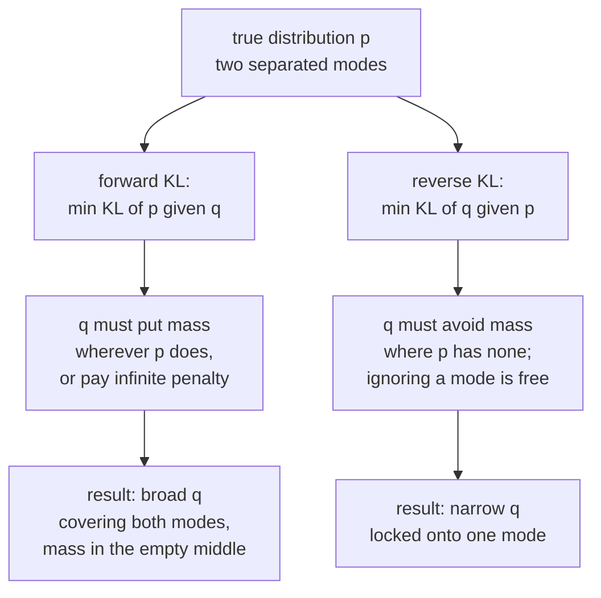
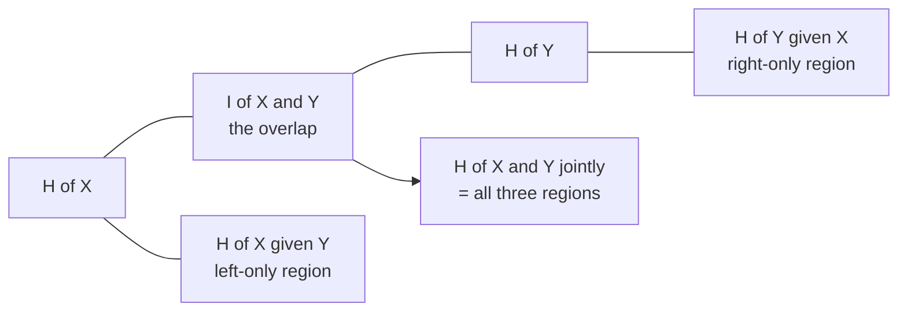

# Information Theory: Measuring Surprise

Shannon set out in 1948 to answer an engineering question — how few bits can
carry a message reliably — and produced the measuring system that machine
learning now runs on. Your loss function is a cross-entropy. Your evaluation
metric is an exponentiated entropy. Your decision-tree splits maximise
information gain. Your contrastive objective is a bound on mutual information.
Your model's job, under one influential reading, is compression.

This page builds the quantities from the ground up and then shows where each one
already appears in your training loop.

## Surprisal: the atom

How surprised should you be by an outcome with probability $p$?

Three requirements pin the answer down completely:

1. Surprise decreases with probability. Certain events surprise nobody.
2. $p = 1$ gives surprise 0.
3. Surprise of independent events **adds**: seeing two independent things should
   surprise you as much as the sum of each.

Requirement 3 forces a logarithm, since it is the only function turning products
into sums:

$$I(x) = -\log p(x) = \log\frac{1}{p(x)}$$

Base 2 gives **bits**; base $e$ gives **nats**; base 10 gives **hartleys**. ML
uses nats internally (the log in your loss function) and quotes bits when
talking about compression. $1\ \text{nat} = 1.4427$ bits.

| $p(x)$ | surprisal (bits) | intuition |
|---|---|---|
| 1 | 0 | "the sun rose" |
| 1/2 | 1 | one coin flip |
| 1/8 | 3 | three coin flips |
| 1/1000 | 9.97 | a rare token |
| $\to 0$ | $\to \infty$ | why $\log 0$ blows up your loss |

That last row is not an abstraction. Assigning probability zero to something that
then happens gives infinite loss — which is precisely why label smoothing,
epsilon floors, and clamped logits exist.

## Entropy

Entropy is expected surprisal:

$$H(X) = \mathbb{E}_{x\sim p}[-\log p(x)] = -\sum_x p(x)\log p(x)$$

It measures **average uncertainty** in a distribution, and — via Shannon's source
coding theorem — the average number of bits needed per symbol under the best
possible lossless code.

### Properties

- $H(X) \ge 0$, with equality iff $X$ is deterministic.
- $H(X) \le \log |\mathcal{X}|$, with equality iff $X$ is uniform. **Uniform is
  maximum entropy.**
- Entropy depends only on the probabilities, not on the values. Relabelling
  outcomes changes nothing.
- For a continuous variable, **differential entropy**
  $h(X) = -\int f\log f$ can be negative and is not coordinate-invariant. Use it
  with care; KL and mutual information remain well behaved.

### Worked: the binary entropy function

$$H_b(p) = -p\log_2 p - (1-p)\log_2(1-p)$$

| $p$ | $H_b(p)$ bits |
|---|---|
| 0.5 | 1.000 |
| 0.7 | 0.881 |
| 0.9 | 0.469 |
| 0.99 | 0.081 |
| 0.999 | 0.011 |

A 90/10 class split carries less than half a bit per label. This is a concrete
statement of why imbalanced classification is easy to score well on and hard to
do well at: a constant predictor already captures most of the available
information.

### Maximum entropy as a modelling principle

Among all distributions satisfying your known constraints, pick the one with
maximum entropy — it assumes the least beyond what you actually know.

| Constraints | MaxEnt distribution |
|---|---|
| support on $\{1..K\}$, nothing else | Uniform |
| support $[0,\infty)$, fixed mean | Exponential |
| fixed mean and variance on $\mathbb{R}$ | **Gaussian** |
| fixed mean on $\{0,1,2,\dots\}$ | Geometric |
| fixed expected feature values | **Softmax / logistic regression** |

The last row is the deep one: logistic regression and softmax classifiers are
*derived*, not invented. Maximise entropy subject to matching the empirical
feature expectations and the exponential-family form
$p(y\mid x) \propto \exp(w_y^\top x)$ falls out. "Maximum entropy classifier"
was the original name in NLP.

## Joint, conditional, and the chain rule

$$H(X,Y) = -\sum_{x,y}p(x,y)\log p(x,y), \qquad H(Y\mid X) = -\sum_{x,y}p(x,y)\log p(y\mid x)$$

$$H(X,Y) = H(X) + H(Y\mid X)$$

Uncertainty about a pair equals uncertainty about the first plus remaining
uncertainty about the second. Conditioning never increases entropy on average:
$H(Y\mid X)\le H(Y)$, with equality iff independent. (Note "on average": a
*particular* observation can increase your uncertainty.)

For a sequence, the chain rule iterates:

$$H(X_1,\dots,X_T)=\sum_{t=1}^{T}H(X_t\mid X_{<t})$$

An autoregressive language model is a machine for estimating each term on the
right, and its training loss is a direct estimate of that sum.

## Cross-entropy and KL divergence

You have the true distribution $p$ and a model $q$. Encode data from $p$ using a
code optimised for $q$ and you pay:

$$H(p,q) = -\sum_x p(x)\log q(x)$$

The excess over the best possible ($H(p)$) is the **Kullback–Leibler
divergence**:

$$D_{\mathrm{KL}}(p\,\|\,q) = \sum_x p(x)\log\frac{p(x)}{q(x)} = H(p,q) - H(p) \;\ge\; 0$$

Non-negativity follows from Jensen's inequality applied to the concave $\log$;
equality holds iff $p=q$ everywhere. It is **not** a metric: not symmetric, and
it violates the triangle inequality.

### The identity that explains supervised learning

For a fixed dataset, $H(p)$ is a constant. Therefore

$$\arg\min_q H(p,q) = \arg\min_q D_{\mathrm{KL}}(p\,\|\,q)$$

**Minimising cross-entropy loss is fitting your model's distribution to the
data's distribution in KL.** You are not learning a decision boundary; you are
doing density estimation, and the decision boundary is a downstream `argmax`.

With a one-hot target the cross-entropy collapses to $-\log q(y_{\text{true}})$
— the surprisal of the correct answer. That is the whole of your classification
loss.

### Direction matters

| | Forward $D_{\mathrm{KL}}(p \,\Vert\, q)$ | Reverse $D_{\mathrm{KL}}(q \,\Vert\, p)$ |
|---|---|---|
| Nickname | mean-seeking, zero-avoiding | mode-seeking, zero-forcing |
| Penalty | $\infty$ if $q=0$ where $p>0$ | $\infty$ if $q>0$ where $p=0$ |
| Failure | over-dispersed, blurry samples | mode collapse |
| Appears in | MLE, cross-entropy training, knowledge distillation | variational inference, VAE ELBO, RLHF KL penalty, expectation propagation's dual |

Blurry VAE reconstructions and mode-dropping GANs are two sides of the same
coin, and which side you land on is determined by which KL direction your
objective implies.

### Jensen–Shannon divergence

A symmetric, bounded alternative:

$$\mathrm{JS}(p\|q) = \tfrac12 D_{\mathrm{KL}}(p\|m) + \tfrac12 D_{\mathrm{KL}}(q\|m), \qquad m = \tfrac{p+q}{2}$$

$\sqrt{\mathrm{JS}}$ is a true metric, and JS is bounded by $\log 2$. The
original GAN objective is, at the optimal discriminator, minimising
$2\,\mathrm{JS}(p_{\text{data}}\|p_g) - \log 4$. **Its flaw is instructive**:
when the two distributions have disjoint support — which is generic for
high-dimensional data on low-dimensional manifolds — JS is constant at $\log 2$
and its gradient is zero. That is the theoretical diagnosis of GAN training
failure, and the reason Wasserstein GAN swapped in the earth-mover distance,
which stays informative for disjoint supports.

### Other divergences worth recognising

| Divergence | Formula/idea | Where |
|---|---|---|
| $f$-divergence | $\int q\,f(p/q)$; generalises KL, JS, $\chi^2$, TV | $f$-GAN family |
| Total variation | $\tfrac12\sum \lvert p-q \rvert$ | bounds on distinguishability |
| Wasserstein-1 | min cost to move mass | WGAN, FID's cousin, distribution shift metrics |
| Rényi $\alpha$-divergence | $\frac{1}{\alpha-1}\log\sum p^\alpha q^{1-\alpha}$ | differential privacy accounting |
| Bregman divergence | $f(p)-f(q)-\nabla f(q)^\top(p-q)$ | unifies squared error and KL |

## Mutual information

$$I(X;Y) = D_{\mathrm{KL}}\bigl(p(x,y)\,\|\,p(x)p(y)\bigr) = H(X) - H(X\mid Y) = H(X)+H(Y)-H(X,Y)$$

The reduction in uncertainty about $X$ from learning $Y$. Symmetric,
non-negative, and zero **iff** $X \perp Y$ — which is strictly stronger than
zero correlation, because it detects non-linear dependence too.

### Where mutual information already appears in your work

- **Decision trees**: information gain is $I(Y; \text{split})$ — the entropy of
  the labels minus the weighted entropy of the children. ID3 and C4.5 split on
  whichever feature maximises it.
- **Feature selection**: mutual information filters rank features by
  $I(X_j; Y)$, catching non-linear relevance that correlation misses. mRMR adds
  a redundancy penalty $I(X_j; X_k)$.
- **Contrastive learning**: InfoNCE is a lower bound on $I(\text{view}_1;
  \text{view}_2)$. With $N$ negatives the bound saturates at $\log N$, which is
  the honest reason large batch sizes help SimCLR and CLIP.
- **Information bottleneck**: learn $Z$ minimising $I(X;Z) - \beta I(Z;Y)$ —
  compress the input as much as possible while keeping what predicts the label.
  It is a clean formal statement of what a good representation is.
- **Clustering evaluation**: adjusted mutual information scores a clustering
  against ground truth without needing label alignment.

**Estimating MI from samples is hard.** In high dimensions, estimators (KSG,
MINE, InfoNCE) have high variance and known pathologies — MI can be infinite for
deterministic continuous maps, and bounds are loose. Treat reported MI numbers
with the same suspicion as reported p-values.

## Coding: where the bits come from

Shannon's **source coding theorem**: any lossless code for i.i.d. symbols from
$p$ has expected length $\ge H(p)$ bits per symbol, and codes achieving $H(p) +
\epsilon$ exist.

| Code | Idea | Optimality |
|---|---|---|
| Huffman | greedy binary merge of the two rarest symbols | optimal among integer-length symbol codes; within 1 bit of $H$ |
| Arithmetic coding | encode the whole message as one interval | reaches $H$ asymptotically; handles fractional bits |
| Asymmetric numeral systems (ANS) | state-machine version of arithmetic coding | modern default (Zstandard, JPEG XL) |

**The connection to language models is exact, not metaphorical.** An LM gives
$p(x_t\mid x_{<t})$; feed those probabilities to an arithmetic coder and you
compress the text at a rate equal to the model's cross-entropy. A model with 0.7
bits/byte on English text *is* a compressor achieving 0.7 bits/byte — better
than any classical algorithm. This is the precise sense in which "prediction is
compression", and why "compression = intelligence" arguments keep resurfacing.

### Kolmogorov complexity, in one paragraph

$K(x)$ is the length of the shortest program that outputs $x$. It is the
individual-object analogue of entropy, it is uncomputable, and it underpins
**minimum description length** (MDL): choose the model minimising
(bits to describe the model) + (bits to describe the data given the model). MDL
is a rigorous derivation of Occam's razor and a principled account of
regularisation — a model with fewer effective bits of parameters is preferred
unless it pays for itself in data-coding savings.

## Perplexity: the LM metric, demystified

$$\mathrm{PPL} = \exp\left(-\frac{1}{T}\sum_{t=1}^{T}\log p(x_t\mid x_{<t})\right) = e^{H}$$

Perplexity is the exponentiated average cross-entropy, i.e. the **effective
number of equally likely choices** at each step. A model with PPL 20 is as
uncertain as one choosing uniformly among 20 options.

| Model class | Rough PPL on English (word-level, historical) |
|---|---|
| Uniform over 50k vocab | 50,000 |
| Unigram | ~950 |
| Trigram with smoothing | ~150 |
| LSTM LM (2016 era) | ~60 |
| Transformer LM (modern, large) | ~10 or below |

Three caveats that decide whether a perplexity comparison is meaningful at all:

1. **Tokenisation.** Byte-level, subword, and word-level perplexities are not
   comparable. Normalise to bits-per-byte if you must compare across
   tokenisers.
2. **Corpus.** Perplexity on Wikipedia and on code are different numbers about
   different things.
3. **Context length.** Longer context lowers perplexity for free.

Perplexity also correlates imperfectly with downstream usefulness — an
instruction-tuned model often has *worse* perplexity on raw web text than its
base model while being far more useful.

## Label smoothing, read information-theoretically

Replace the one-hot target with

$$y'_k = (1-\epsilon)\,y_k + \frac{\epsilon}{K}$$

The target now has entropy $>0$, so the minimum achievable loss is no longer
zero and the model cannot drive the correct logit to $+\infty$. Effects:

- Bounded logit magnitudes, which improves **calibration** — networks trained on
  hard targets are famously overconfident.
- A small regularisation effect, since the model is penalised for extreme
  confidence.
- Tighter, more equidistant class clusters in the penultimate layer.
- A cost: it can *hurt* knowledge distillation, because it erases the
  fine-grained inter-class information in the teacher's soft targets that
  distillation depends on.

Which brings us to distillation itself: the student minimises
$D_{\mathrm{KL}}(p_{\text{teacher}}^{T} \,\|\, p_{\text{student}}^{T})$ with
temperature-softened distributions. The teacher's "dark knowledge" is the
relative probability it assigns to *wrong* classes — that a 7 looks a bit like a
1 — and that is information a one-hot label simply does not contain.

## Information theory in RL and alignment

- **Entropy bonus**: adding $+\beta H(\pi(\cdot\mid s))$ to the policy objective
  keeps the policy stochastic and encourages exploration. Soft actor-critic
  builds this in as a maximum-entropy objective.
- **KL trust region**: TRPO and PPO constrain
  $D_{\mathrm{KL}}(\pi_{\text{old}}\|\pi_{\text{new}})$ so a policy update
  cannot destroy the policy.
- **RLHF KL penalty**: the reward is $r(x,y) - \beta
  D_{\mathrm{KL}}(\pi_{\text{RL}}\|\pi_{\text{SFT}})$. Without it the policy
  drifts into degenerate text that games the reward model. $\beta$ is the
  alignment tax dial.
- **DPO** rewrites that constrained objective in closed form, removing the need
  for an explicit reward model — its derivation is essentially an exercise in
  KL-regularised optimisation.

## Common misconceptions

| Claim | Correction |
|---|---|
| "KL is a distance" | asymmetric, no triangle inequality; use JS or Wasserstein if you need a metric |
| "High entropy means noisy data" | it means uniform-ish; a fair coin is maximally uncertain but perfectly clean |
| "$I(X;Y)=0$ means unrelated" | it does mean independent — this one is true, unlike $\rho = 0$ |
| "Lower perplexity is a better model" | only within identical tokenisation, corpus, and context length |
| "Cross-entropy and KL are different losses" | they differ by a constant; the same gradient |
| "Differential entropy is entropy" | it can be negative and changes under reparameterisation |
| "Compression is a metaphor for prediction" | it is an exact equivalence via arithmetic coding |

## Self-check

1. Why must surprisal be logarithmic? Give the additivity argument.
2. Show that minimising cross-entropy equals minimising KL, and state which term
   is constant.
3. A GAN's discriminator becomes perfect and the generator stops improving.
   Explain in terms of JS divergence and disjoint support.
4. What is the maximum-entropy distribution on $\mathbb{R}$ with fixed mean and
   variance, and what does that imply about MSE loss?
5. Your LM reports perplexity 12 with a byte-level tokeniser and a competitor
   reports 8 with a 100k-token vocabulary. Who is better?
6. Explain the information-bottleneck objective and what $\beta$ controls.
7. Why can label smoothing hurt distillation?

## Where to go next

- [Probability](./probability.md) — the distributions these quantities measure.
- [Calculus](./calculus.md) — differentiating cross-entropy, and the
  softmax gradient that falls out.
- [NLP notes](../nlp.md) — perplexity, tokenisation, and language modelling in
  practice.
