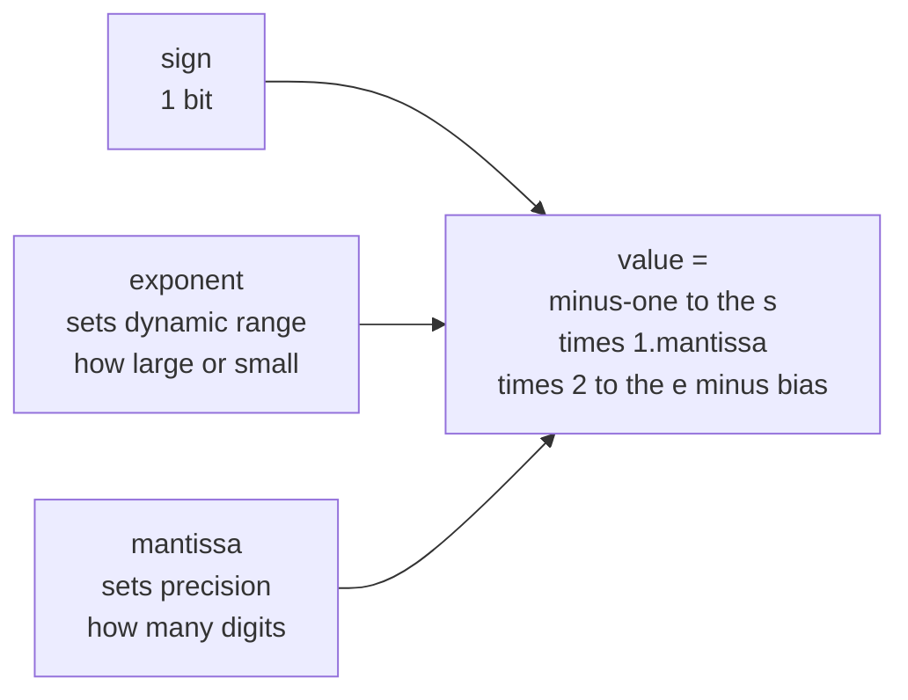
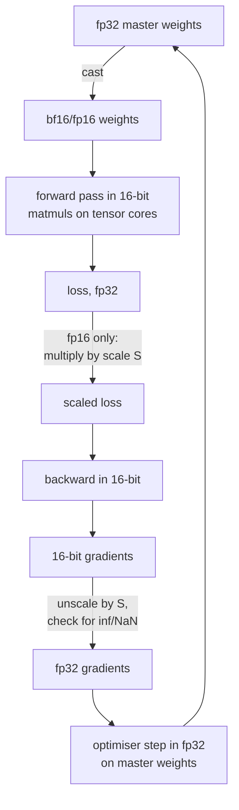

# Numerical Computing: When the Maths Meets the Hardware

Every equation on this site is exact. Nothing your computer does is. Real
numbers are approximated by a finite set of floats, and the gap between those two
facts is where `NaN` losses, non-reproducible runs, quantisation damage, and
"it worked in fp32 but not fp16" all live.

This page is about that gap: how floats work, which operations destroy
information, and what to do about it.

## Floating point in one diagram

A normal binary float stores $(-1)^s \times 1.m \times 2^{e - \text{bias}}$: a sign bit, an
exponent that sets the *range*, and a mantissa that sets the *precision*.



| Format | Bits | Exponent | Mantissa | Max | Smallest normal | Decimal digits |
|---|---|---|---|---|---|---|
| fp64 | 64 | 11 | 52 | $1.8\times10^{308}$ | $2.2\times10^{-308}$ | ~15.9 |
| fp32 | 32 | 8 | 23 | $3.4\times10^{38}$ | $1.2\times10^{-38}$ | ~7.2 |
| tf32 | 19 used | 8 | 10 | as fp32 | as fp32 | ~3.3 |
| bf16 | 16 | 8 | 7 | $3.4\times10^{38}$ | $1.2\times10^{-38}$ | ~2.4 |
| fp16 | 16 | 5 | 10 | $65{,}504$ | $6.1\times10^{-5}$ | ~3.3 |
| fp8 E4M3FN (finite-number variant) | 8 | 4 | 3 | 448 | — | ~1 |
| fp8 E5M2 | 8 | 5 | 2 | 57,344 | — | ~0.8 |

**The bf16-vs-fp16 trade is the whole story of modern training.** Both are 16
bits. fp16 spends them on precision (10 mantissa bits) and has a narrow
exponent, with largest finite value 65,504 and smallest normal $2^{-14}$. Subnormals extend down to $2^{-24}\approx5.96\times10^{-8}$, with reduced relative precision. Some devices flush subnormals to zero; that is distinct from representability. bf16 has fp32's exponent width but a slightly smaller largest finite value, so identical range is only an approximation.

The practical consequence: fp16 often benefits from loss scaling; bf16's wider exponent usually makes it unnecessary. Neither format guarantees numerical safety, and hardware/operator support must be checked.

### Machine epsilon and what it means

Machine epsilon is the gap between 1.0 and the next representable float:
$2^{-23}\approx1.19\times10^{-7}$ for fp32, $2^{-10}\approx9.8\times10^{-4}$ for
fp16, $2^{-7}\approx7.8\times10^{-3}$ for bf16.

So in bf16, **1.0 + 0.001 = 1.0**. Adding a small learning-rate update to a
large weight can be a complete no-op. This is precisely why optimiser states are
often kept in fp32 even when the forward pass runs in bf16 — the "master weights"
pattern in mixed precision.

```python
import numpy as np
a = np.float16(1.0)
print(a + np.float16(1e-4) == a)   # True — the update vanished
print(np.float32(1.0) + np.float32(1e-4) == np.float32(1.0))  # False
```

### The surprises everyone hits

```python
0.1 + 0.2 == 0.3            # False; the left side is 0.30000000000000004
```

0.1 has no exact binary representation, exactly as 1/3 has no exact decimal one.
For approximate numerical results use a scale-aware tolerance (exact equality is still appropriate for representable invariants or copied values):

```python
abs(a - b) <= atol + rtol * abs(b)      # np.isclose / torch.allclose semantics
```

Floating-point addition is **not associative**:

```python
(1e20 + -1e20) + 1.0   # 1.0
1e20 + (-1e20 + 1.0)   # 0.0
```

This single fact is why GPU reductions are non-deterministic (thread scheduling
changes the summation order), why `torch.use_deterministic_algorithms(True)`
costs performance, and why two mathematically identical implementations can give
different losses.

The table describes NumPy floating operations under its default warning policy, not Python integer division or the scalar `math` module. Python `1/0` raises `ZeroDivisionError`; `math.log(0)` raises `ValueError`.

| Expression | Result |
|---|---|
| `1/0` | `inf` |
| `-1/0` | `-inf` |
| `0/0`, `inf - inf`, `inf * 0` | `NaN` |
| `NaN == NaN` | `False` |
| `NaN` in ordinary arithmetic | usually propagates; functions such as `nansum` deliberately differ |
| `log(0)` | `-inf` |
| `log(negative)` | `NaN` |

`NaN` propagation is why one bad example can poison an entire batch's gradient
and, through the optimiser state, every subsequent step. When debugging, use
`torch.autograd.set_detect_anomaly(True)` to find the first op producing it.

## Catastrophic cancellation

Subtracting two nearly equal numbers annihilates the significant digits and
promotes rounding error to leading order.

$$\text{Naive variance: } \mathrm{Var} = \frac1n\sum x_i^2 - \bar{x}^2$$

At $10^8$, fp32 spacing is eight, so converting $[10^8,10^8+1,10^8+2]$ already loses every difference. No summation algorithm can recover lost input information. Cancellation is a separate failure when representable deviations are present but subtracting large second moments destroys their variance.

The fix is **Welford's online algorithm**, which never forms that difference:

```python
def welford(xs):
    n, mean, M2 = 0, 0.0, 0.0
    for x in xs:
        n += 1
        delta = x - mean
        mean += delta / n
        M2 += delta * (x - mean)     # note: the updated mean
    if n < 2:
        raise ValueError("Sample variance requires at least two observations")
    return mean, M2 / (n - 1)
```

This returns sample variance with denominator $n-1$; the preceding identity is population variance with denominator $n$. Welford avoids subtracting large raw moments, but cannot fix input rounding. BatchNorm running statistics are exponential moving averages of batch statistics, not this exact streaming estimator.

Other cancellation traps and their stable forms:

| Unstable | Stable | Why |
|---|---|---|
| $\sqrt{x+1}-\sqrt{x}$ | $\dfrac{1}{\sqrt{x+1}+\sqrt{x}}$ | rationalise; no subtraction of near-equals |
| $\log(1+x)$ for tiny $x$ | `log1p(x)` | $1+x$ rounds to 1 |
| $e^x - 1$ for tiny $x$ | `expm1(x)` | same |
| $1 - \cos x$ | $2\sin^2(x/2)$ | trig identity |
| Quadratic formula, $b^2 \gg 4ac$ | compute the well-conditioned root, then use $x_1x_2 = c/a$ | one root cancels |
| $\sum$ of many small floats | Kahan/Neumaier summation, or pairwise | different worst-case error bounds: pairwise has logarithmic-depth accumulation; compensation reduces leading roundoff |

## The log-sum-exp trick

The most important numerical identity in machine learning:

$$\log\sum_k e^{z_k} = z_{\max} + \log\sum_k e^{z_k - z_{\max}}$$

For a nonempty finite-input row, every exponent is now $\le0$,
so nothing overflows, and the largest term is exactly $e^0 = 1$, so nothing
underflows to a zero sum.

Without it, $e^{800}$ overflows fp32 (`inf`) and $e^{-800}$ underflows to 0,
giving `inf/inf = NaN` in softmax. Logits of 800 are not hypothetical — a
mis-scaled attention score or a diverging run produces them routinely.

```python
def softmax_stable(z):
    z = z - z.max(axis=-1, keepdims=True)     # the entire trick
    e = np.exp(z)
    return e / e.sum(axis=-1, keepdims=True)

def log_softmax_stable(z):
    m = z.max(axis=-1, keepdims=True)
    return z - m - np.log(np.exp(z - m).sum(axis=-1, keepdims=True))
```

Prefer `log_softmax` + `nll_loss` (or the fused `cross_entropy_with_logits`)
over `log(softmax(z))`. The fused version never materialises the probabilities,
so it avoids both the overflow and the $\log 0$ underflow when a probability
rounds to zero. **Never pass softmax outputs to a function that will take their
log.** This is the single most common numerical bug in hand-written training
loops.

Similar stable forms worth knowing:

- $\log \sigma(x) = -\text{softplus}(-x)$, and `softplus(x) = log1p(exp(-|x|)) + max(x,0)`.
- Binary cross-entropy from logits:
  $\max(z,0) - zy + \log(1+e^{-|z|})$ — the form PyTorch's
  `binary_cross_entropy_with_logits` actually computes.

## Conditioning: when the problem itself is fragile

The **condition number** of a matrix,
$\kappa(A) = \sigma_{\max}/\sigma_{\min}$, bounds how much a relative
perturbation in the input can be amplified in the output:

$$\frac{\|\delta x\|}{\|x\|} \le \kappa(A)\frac{\|\delta b\|}{\|b\|}$$

Worst-case warning: relative error can scale like $\kappa u$ for a backward-stable solve. The heuristic $\log_{10}\kappa$ lost digits is not a prediction for every right-hand side or perturbation.

| $\kappa$ | fp32 verdict |
|---|---|
| $10^0$–$10^2$ | well conditioned |
| $10^3$–$10^5$ | fine, watch it |
| $10^6$–$10^7$ | marginal; use fp64 |
| $>10^8$ | worst-case relative accuracy is uncontrolled; some favorable directions may still be accurate |

This is why you should **never solve normal equations by forming
$(X^\top X)^{-1}$**: squaring the matrix squares the condition number.
$\kappa(X^\top X) = \kappa(X)^2$, so a merely awkward $\kappa(X)=10^4$ becomes a
hopeless $10^8$.

| Task | Do not | Do |
|---|---|---|
| Least squares | `inv(X.T @ X) @ X.T @ y` | `np.linalg.lstsq` (QR or SVD based) |
| Solve $Ax=b$ | `inv(A) @ b` | `np.linalg.solve(A, b)` (LU with pivoting) |
| Covariance inverse | explicit inverse | Cholesky factor, then triangular solves |
| Near-singular system | blindly change its diagonal | inspect singular directions; truncated SVD or a justified regularized least-squares model |

Ridge regularisation has a precise numerical reading here:
$\kappa(X^\top X + \lambda I) = \frac{\sigma_{\max}^2+\lambda}{\sigma_{\min}^2+\lambda}$,
which is no larger for $\lambda>0$, and remains one when the original spectrum is constant. This is ridge on a Gram matrix, not justification for adding $\lambda I$ to an arbitrary nonsymmetric equation. "Ridge
stabilises the solve" is not hand-waving; it is a bound.

## Mixed precision training

The standard recipe stores master weights in fp32, runs the forward and backward
passes in 16-bit, and accumulates reductions in fp32.



**Why loss scaling is often used with fp16.** Gradients are small — often
$10^{-7}$ to $10^{-4}$ — and fp16's smallest normal value is $6\times10^{-5}$.
Multiply the loss by $S \approx 2^{16}$ before the backward pass and every
gradient scales with it, landing back in representable range; divide by $S$
before the optimiser step. Dynamic loss scaling raises $S$ when steps succeed
and halves it whenever an `inf` or `NaN` appears, skipping that step.

bf16 usually needs no loss scaling because of its exponent range, but overflow, cancellation and small updates still require monitoring.

**Operations often retained in fp32 or other higher-accuracy forms**, depending on the implementation:

- Optimiser states (momentum, second moment) and master weights.
- Loss accumulation and reductions over long axes.
- Softmax and layer-norm statistics — sums over the feature dimension.
- Anything involving `exp`, `log`, or a division by a possibly-tiny number.

Modern kernels handle this internally: FlashAttention computes the softmax
running max and sum in fp32 while keeping the matmuls in 16-bit. That is the
same log-sum-exp trick, tiled.

## Quantisation arithmetic

Post-training quantisation maps floats to low-bit integers:

$$q=\operatorname{clip}\left(\operatorname{round}(x/s)+z,q_{\min},q_{\max}\right),\qquad\hat x=s(q-z),\quad s>0.$$

Use integer zero-point $z$ in range and a declared rounding rule, such as ties-to-even. The $s/2$ absolute error bound applies only without saturation; clipping error can be arbitrarily larger.

| Choice | Options | Trade-off |
|---|---|---|
| Symmetric vs asymmetric | $z=0$ vs $z$ free | symmetric is faster; asymmetric fits skewed ranges (post-ReLU) |
| Granularity | per-tensor, per-channel, per-group (e.g. 128) | finer is more accurate, more metadata |
| Calibration | min/max, percentile, MSE-optimal, entropy (KL) | min/max is destroyed by a single outlier |
| Static vs dynamic | activation ranges precomputed vs per-batch | dynamic is more accurate, costs runtime |

**Outliers are the whole difficulty.** Transformer activations develop a handful
of channels with magnitudes 100× the rest. Naive per-tensor min/max calibration
then wastes almost the entire integer range on those channels and crushes
everything else to a few levels. The published fixes are all forms of "handle
the outliers separately": LLM.int8() keeps outlier channels in fp16, SmoothQuant
migrates the scale from activations into weights, AWQ protects the salient
channels identified by activation statistics, and GPTQ solves a layerwise
reconstruction problem with second-order information.

**Quality must be measured.** Per-channel int8 and group-wise int4 often improve on naive low-bit per-tensor quantization, but no fixed benchmark-point loss is guaranteed. Calibration data, model architecture, method and task determine the result.

**Quantisation-aware training** inserts fake-quant nodes in the forward pass and
uses the **straight-through estimator** for the backward — pretending
$\partial \text{round}/\partial x = 1$, since the true derivative is zero almost
everywhere. It can recover accuracy lost by PTQ, with task-dependent results and the cost of a training run.

## Reproducibility

Bitwise reproducibility can be achievable within a fixed environment and supported deterministic operations; it is not guaranteed across releases, platforms or devices.

| Source of non-determinism | Fix |
|---|---|
| Python/NumPy/framework RNG | seed all three; seed each dataloader worker |
| cuDNN algorithm autotuning | `torch.backends.cudnn.deterministic = True`, `benchmark = False` |
| Atomic-add reductions on GPU | `torch.use_deterministic_algorithms(True)` |
| `scatter_add`, some pooling backward | same flag; some ops then raise instead of silently varying |
| Multi-threaded dataloader ordering | fixed seed per worker, `generator=` on the sampler |
| TF32 on Ampere matmuls | `torch.backends.cuda.matmul.allow_tf32 = False` to avoid TF32 input precision; fp32 arithmetic is still rounded |
| Different GPU model or driver | not fixable; document the environment |
| Distributed all-reduce order | fixed process ranks, deterministic reduction algorithm |

```python
import os, random, numpy as np, torch

def set_seed(seed=0, deterministic=True):
    random.seed(seed); np.random.seed(seed)
    torch.manual_seed(seed); torch.cuda.manual_seed_all(seed)
    if deterministic:
        torch.backends.cudnn.deterministic = True
        torch.backends.cudnn.benchmark = False
        torch.use_deterministic_algorithms(True)
```

Set `PYTHONHASHSEED` before launching Python, and any required `CUBLAS_WORKSPACE_CONFIG` before CUDA initialization. Changing a running interpreter's environment cannot reseed its hash function. See [Python startup settings](https://docs.python.org/3/using/cmdline.html#envvar-PYTHONHASHSEED) and [PyTorch reproducibility limits](https://docs.pytorch.org/docs/stable/notes/randomness.html). Determinism's performance cost is workload-dependent, not a universal percentage. Use it for debugging and for
regression tests; consider dropping it for production training runs, where
reporting mean and variance across seeds is more honest than pretending a single
run is the truth.

Note also that **batch size changes results even with a fixed seed**, because
reduction order changes. Serving a request in a batch of 1 and in a batch of 32
can produce different logits — the "batch invariance" problem that matters for
reproducible LLM evaluation.

## A numerical debugging checklist

When a run produces `NaN` or diverges:

1. **Find the first bad tensor.** `torch.isnan(x).any()` after each block, or
   `set_detect_anomaly(True)` for the op-level answer.
2. **Check the loss inputs.** `log(0)` from a zero probability and `log(negative)`
   from a mis-signed term are the two most common causes.
3. **Check for division by a near-zero.** Add an epsilon *inside* the sqrt, not
   outside: `sqrt(x + eps)`, not `sqrt(x) + eps` — the derivative of `sqrt` at 0
   is infinite.
4. **Print gradient norms per layer.** A single layer producing $10^{20}$
   localises the problem immediately.
5. **Lower the learning rate 10×.** If the `NaN` disappears, it was a stability
   symptom sensitive to step size; this does not rule out a data, reduction or implementation bug.
6. **Switch to fp32.** If it goes away, it is a precision problem: check loss
   scaling, attention overflow and reductions; altered precision may hide rather than fix an implementation error.
7. **Clip gradients** by global norm as insurance.
8. **Check the data.** A `NaN` or `inf` in an input feature, or a label outside
   the valid class range, can fail or corrupt downstream operations; validate both explicitly.

## Speed and memory, since numerics decides both

| Stored precision | Bytes per scalar before scales/metadata |
|---|---|
| fp32 / TF32-backed fp32 tensors | 4 |
| bf16 / fp16 | 2 |
| fp8 / int8 | 1 |
| packed int4 | 0.5 |

Throughput depends on the actual accelerator, kernel, matrix shapes and accumulation mode; these storage counts are not speed ratios. Decode can be weight-bandwidth bound, but KV traffic, batching, dequantization and communication can prevent a twofold byte reduction from halving latency. Training also depends on tensor-core support and non-matmul work.

Rough training memory for a model with $P$ parameters under mixed precision with
AdamW: 2 bytes (bf16 weights) + 4 (fp32 master) + 4 + 4 (two optimiser moments)
+ 4 (fp32 gradients) $\approx$ 18 bytes per parameter, before activations. A 7B
model is ~126 GB of state — which is the entire reason ZeRO sharding, 8-bit
optimisers, and gradient checkpointing exist.

## Worked finite-precision experiments

### Epsilon, unit roundoff and a spacing number line

With $p$ significant binary bits, the spacing above one is
$\epsilon=2^{1-p}$. Under round-to-nearest, unit roundoff is
$u=\epsilon/2=2^{-p}$, the usual relative-error bound for a normal rounded
result away from range exceptions. Spacing scales with the exponent:
fp32 numbers near $2^{26}$ are eight apart. This explains why adding one
to a number near $10^8$ can be lost before any algorithm begins.

Ties-to-even selects the representable neighbor with an even trailing
significand bit at an exact midpoint, reducing systematic tie bias.
Subnormals keep fixed absolute spacing while relative precision degrades.
Signed zeros compare equal, but a floating reciprocal distinguishes $+0$
and $-0$. Overflow, underflow and invalid operations are distinct exceptions.
The definitions and platform limits are exposed by [NumPy finfo](https://numpy.org/doc/stable/reference/generated/numpy.finfo.html).

### Representation error versus algorithmic error

For already representable observations $(10000,10001,10002)$, population
variance is $2/3$ and sample variance is one. A centered float64 or streaming
calculation recovers them; a fp32 difference of raw second moments can fail.
For $(10^8,10^8+1,10^8+2)$ converted to fp32, both stable methods
correctly report zero variance of the rounded inputs. That is not recovery
of the original real-valued data.

Sequential summation's standard absolute bound is approximately
$\gamma_{n-1}\sum|x_i|$, $\gamma_k=ku/(1-ku)$ when $ku<1$.
Balanced pairwise summation replaces a linear depth by logarithmic depth.
Compensated methods can reduce the leading accumulation error substantially.
These are not the same as a probabilistic $\sqrt n$ RMS model. Relative
accuracy also depends on the condition of the sum,
$\sum|x_i|/|\sum x_i|$, which can be enormous under cancellation.

```python runnable
import math
import numpy as np
from scipy.special import logsumexp

tiny = np.finfo(np.float16).smallest_subnormal
assert tiny == np.float16(2.**-24)
assert np.float16(1e-5) > 0  # subnormal is representable on this CPU path
assert np.spacing(np.float32(1e8)) == 8.
lost = np.array([1e8, 1e8+1, 1e8+2], dtype=np.float32)
assert np.var(lost.astype(np.float64)) == 0.
kept = np.array([10000., 10001., 10002.], dtype=np.float32)
assert np.isclose(np.var(kept.astype(np.float64)), 2/3)

def pairwise(values):
    if len(values) <= 1:
        return sum(values)
    middle = len(values)//2
    return pairwise(values[:middle])+pairwise(values[middle:])

def neumaier(values):
    total, correction = 0., 0.
    for x in values:
        new = total+x
        if abs(total) >= abs(x):
            correction += (total-new)+x
        else:
            correction += (x-new)+total
        total = new
    return total+correction

values = [1e16, 1., -1e16]
naive = 0.
for value in values:
    naive += value
reference = math.fsum(values)
assert reference == 1. and naive == 0.
assert neumaier(values) == reference
print("naive / pairwise / compensated / fsum:",
      naive, pairwise(values), neumaier(values), reference)
assert np.isneginf(logsumexp([-np.inf, -np.inf]))
assert np.isposinf(logsumexp([np.inf, 0.]))
# Older SciPy versions reject empty reductions; apply the explicit sum convention.
empty = np.array([], dtype=float)
empty_lse = -np.inf if empty.size == 0 else logsumexp(empty)
assert np.isneginf(empty_lse)
```

Pairwise summation is not promised to fix this particular cancellation order.
The reference uses compensated high-accuracy summation of the represented
float64 inputs, not arbitrary-precision recovery of decimal inputs.

### Stable reductions need domain policies

The earlier softmax snippets require a nonempty row of finite logits.
With all entries $-\infty$, subtracting the maximum gives $-\infty-(-\infty)$,
and probabilities have no normalized finite mass. With a $+\infty$ entry,
the same subtraction is invalid. A production masking policy should reject
or explicitly zero all-masked rows, and reject nonfinite unmasked logits
unless a carefully defined limiting distribution is intended.
Log-sum-exp itself has the natural value $-\infty$ for an empty sum or
all-negative-infinity input and $+\infty$ if any input is positive infinity;
that does not make softmax or its derivatives well-defined on those rows.
Use stable logit losses and check gradients as well as forward values.

### Quantization, accumulation and requantization

Take signed int8, $s=.1,z=0$, and $x=(-20,-.15,0,.26,20)$.
The endpoints saturate to $-128,127$, reconstructing $-12.8,12.7$.
For values inside range, nearest rounding contributes at most $.05$ error;
endpoint clipping contributes $7.2$ and $7.3$. Binary representation can move
a nominal decimal midpoint slightly, so exact tie examples should use binary
fractions.

For two quantized vectors, a dot product reconstructs approximately as
$s_xs_w\sum_i(q_{x,i}-z_x)(q_{w,i}-z_w)$.
Accumulate in a sufficiently wide integer type; int8 multiplication/summation
can overflow before conversion. A conservative bound is
$d\max|q_x-z_x|\max|q_w-z_w|$, which must fit the accumulator.
Requantization to scale $s_y$ then applies
$q_y=\operatorname{clip}(\operatorname{round}(s_xs_w a/s_y)+z_y)$.
Bias must be expressed in consistent accumulator units.

```python runnable
import numpy as np

x = np.array([-20., -.15, 0., .26, 20.])
scale, zero = .1, 0
q = np.clip(np.rint(x/scale)+zero, -128, 127).astype(np.int8)
restored = scale*(q.astype(np.int32)-zero)
inside = (x >= -12.8) & (x <= 12.7)
assert np.max(np.abs(restored[inside]-x[inside])) <= .05+1e-12
assert np.isclose(restored[0], -12.8) and np.isclose(restored[-1], 12.7)
qa, qb = np.array([10, -20], np.int8), np.array([3, 4], np.int8)
accumulator = qa.astype(np.int64) @ qb.astype(np.int64)
assert accumulator == -50
assert np.isclose(.1*.2*accumulator, -1.)
assert np.array_equal(np.rint([.5, 1.5, 2.5]), [0., 2., 2.])
print("quantized:", q, "reconstructed:", restored,
      "MSE:", np.mean((x-restored)**2))
```

### Complete CPU mixed-precision update semantics

This small CPU experiment validates autocast/scaler control flow, not GPU
throughput or accelerator-specific subnormal handling. It deliberately injects
one nonfinite scaled gradient to verify the skipped-step path. Gradients are
unscaled once, after the complete accumulation window and before clipping.
The scheduler advances only for a successful optimizer update. Keeping the
scale fixed within a window is essential; partial windows use their actual
example count. See [PyTorch AMP examples](https://docs.pytorch.org/docs/stable/notes/amp_examples.html).

```python runnable
import torch
from torch import nn

torch.manual_seed(72)
torch.set_num_threads(1)
model = nn.Linear(2, 1)
optimizer = torch.optim.SGD(model.parameters(), lr=.05)
scheduler = torch.optim.lr_scheduler.StepLR(optimizer, step_size=1, gamma=.9)
scaler = torch.amp.GradScaler("cpu", init_scale=128.)
X, y = torch.randn(11, 2), torch.randn(11, 1)
microbatches = [(X[i:i+3], y[i:i+3]) for i in range(0, 11, 3)]
successful, skipped = 0, 0
for attempt in range(3):
    optimizer.zero_grad(set_to_none=True)
    for xb, yb in microbatches:
        with torch.autocast(device_type="cpu", dtype=torch.float16):
            prediction = model(xb)
            loss = nn.functional.mse_loss(prediction, yb, reduction="sum")/len(X)
        scaler.scale(loss).backward()
    if attempt == 0:
        next(model.parameters()).grad.reshape(-1)[0] = float("inf")
    saved = [p.detach().clone() for p in model.parameters()]
    old_scale = scaler.get_scale()
    scaler.unscale_(optimizer)
    nn.utils.clip_grad_norm_(model.parameters(), 1.)
    scaler.step(optimizer)
    scaler.update()
    if scaler.get_scale() < old_scale:
        skipped += 1
        assert all(torch.equal(p, old) for p, old in zip(model.parameters(), saved))
    else:
        successful += 1
        scheduler.step()
assert skipped == 1 and successful == 2
assert scheduler.last_epoch == successful
assert all(torch.isfinite(p).all() for p in model.parameters())
print("successful / skipped updates:", successful, skipped)
```

Scale decrease identifies overflow skips in this standard dynamic-scaler
configuration; custom optimizer/scaler behavior may need an explicit success
signal. A learning-rate schedule based on samples rather than successful steps
must make that alternate clock deliberate.

## Self-check

1. Why is loss scaling commonly useful for fp16 and often unnecessary for bf16? Distinguish exponent range, subnormal representation and hardware flush-to-zero.
2. Compute `1.0 + 1e-4` in bf16 and explain the result. What does this imply for
   master weights?
3. Write the log-sum-exp trick and state which two failure modes it prevents.
4. Why is $\kappa(X^\top X) = \kappa(X)^2$ an argument against the normal
   equations, and what should you use instead?
5. Your loss becomes `NaN` at step 1,200 in fp16 but not fp32. List your first
   four diagnostic steps.
6. Explain why naive per-tensor int8 quantisation fails on transformer
   activations and name two published fixes.
7. Two identical runs on the same GPU give different losses at step 500. Give
   three possible causes.

## Worked self-check answers

1. fp16 has five exponent bits and bf16 eight; fp16 gradients more readily
   underflow. Its subnormals extend below the smallest normal, and bf16 is
   usually unscaled, not immune to every range or precision error.
2. Near one, bf16 spacing is $2^{-7}$, so $10^{-4}$ is below half an ULP
   and rounds away under nearest rounding. Higher-precision master updates
   can preserve repeated small changes; this is a common strategy, not the only one.
3. Subtract the finite row maximum before exponentiating, then restore it
   outside the logarithm. This prevents exponent overflow and an all-underflowed
   sum for finite nonempty inputs, not invalid masked rows.
4. Singular values square in $X^\top X$, worsening sensitivity. Use QR/SVD
   least squares and inspect the original problem's conditioning.
5. Locate the first nonfinite tensor, inspect data/domains, inspect scaled and
   unscaled gradients/scale history, then compare suspect operations at higher
   precision. Do not diagnose solely from the final loss.
6. A large channel can set a coarse per-tensor scale for all others.
   LLM.int8 uses mixed-precision outlier handling; SmoothQuant redistributes
   activation scale into weights. Their actual task quality must be measured.
7. Unseeded RNG or worker streams, nondeterministic reduction kernels, and changed
   environment/algorithm selection are distinct causes. Fixing seeds alone
   does not constrain all of them.

## Where to go next

- [Optimization Techniques](./optimization.md) — the algorithms this arithmetic
  has to survive.
- [Linear Algebra](./linear-algebra.md) — condition numbers, SVD, and matrix
  factorisation.
- [The Inference Engineering Course](/courses/inference/) — quantisation, kernels,
  and precision in a production serving stack.
