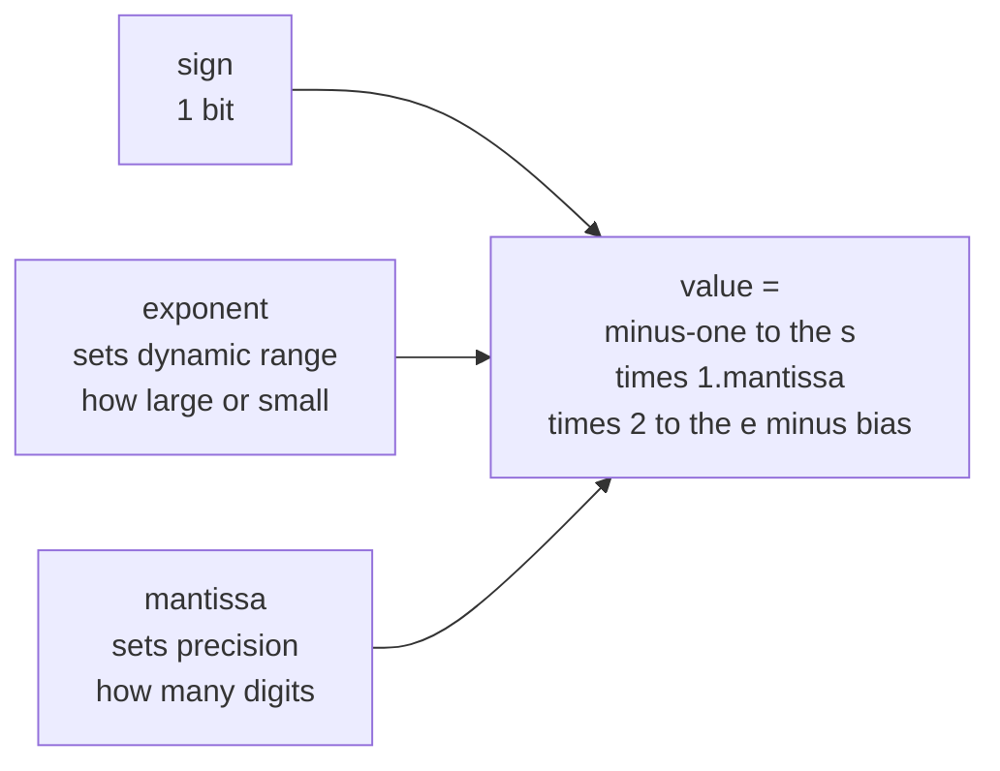
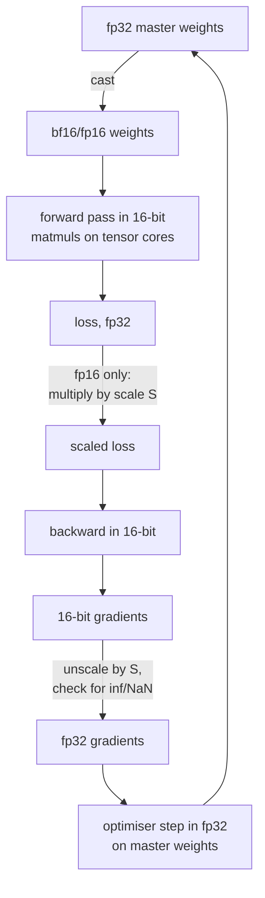

# Numerical Computing: When the Maths Meets the Hardware

Every equation on this site is exact. Nothing your computer does is. Real
numbers are approximated by a finite set of floats, and the gap between those two
facts is where `NaN` losses, non-reproducible runs, quantisation damage, and
"it worked in fp32 but not fp16" all live.

This page is about that gap: how floats work, which operations destroy
information, and what to do about it.

## Floating point in one diagram

A float stores $(-1)^s \times 1.m \times 2^{e - \text{bias}}$: a sign bit, an
exponent that sets the *range*, and a mantissa that sets the *precision*.



| Format | Bits | Exponent | Mantissa | Max | Smallest normal | Decimal digits |
|---|---|---|---|---|---|---|
| fp64 | 64 | 11 | 52 | $1.8\times10^{308}$ | $2.2\times10^{-308}$ | ~15.9 |
| fp32 | 32 | 8 | 23 | $3.4\times10^{38}$ | $1.2\times10^{-38}$ | ~7.2 |
| tf32 | 19 used | 8 | 10 | as fp32 | as fp32 | ~3.3 |
| bf16 | 16 | 8 | 7 | $3.4\times10^{38}$ | $1.2\times10^{-38}$ | ~2.4 |
| fp16 | 16 | 5 | 10 | $65{,}504$ | $6.1\times10^{-5}$ | ~3.3 |
| fp8 E4M3 | 8 | 4 | 3 | 448 | — | ~1 |
| fp8 E5M2 | 8 | 5 | 2 | 57,344 | — | ~0.8 |

**The bf16-vs-fp16 trade is the whole story of modern training.** Both are 16
bits. fp16 spends them on precision (10 mantissa bits) and has a narrow
exponent, so it overflows above 65,504 and underflows below $6\times10^{-5}$ —
and gradients routinely live below that. bf16 keeps fp32's exponent, so it never
overflows where fp32 would not, at the cost of ~3 mantissa bits.

The practical consequence: **fp16 training needs loss scaling; bf16 does not.**
That is why every accelerator built after 2020 supports bf16 and why it is the
default for large-model training.

### Machine epsilon and what it means

Machine epsilon is the gap between 1.0 and the next representable float:
$2^{-23}\approx1.19\times10^{-7}$ for fp32, $2^{-10}\approx9.8\times10^{-4}$ for
fp16, $2^{-7}\approx7.8\times10^{-3}$ for bf16.

So in bf16, **1.0 + 0.001 = 1.0**. Adding a small learning-rate update to a
large weight can be a complete no-op. This is precisely why optimiser states are
kept in fp32 even when the forward pass runs in bf16 — the "master weights"
pattern in mixed precision.

```python
import numpy as np
a = np.float16(1.0)
print(a + np.float16(1e-4) == a)   # True — the update vanished
print(np.float32(1.0) + np.float32(1e-4) == np.float32(1.0))  # False
```

### The surprises everyone hits

```python
0.1 + 0.2 == 0.3            # False; the left side is 0.30000000000000004
```

0.1 has no exact binary representation, exactly as 1/3 has no exact decimal one.
**Never test floats for equality**; use a tolerance:

```python
abs(a - b) <= atol + rtol * abs(b)      # np.isclose / torch.allclose semantics
```

Floating-point addition is **not associative**:

```python
(1e20 + -1e20) + 1.0   # 1.0
1e20 + (-1e20 + 1.0)   # 0.0
```

This single fact is why GPU reductions are non-deterministic (thread scheduling
changes the summation order), why `torch.use_deterministic_algorithms(True)`
costs performance, and why two mathematically identical implementations can give
different losses.

Special values follow IEEE-754 rules that are worth memorising:

| Expression | Result |
|---|---|
| `1/0` | `inf` |
| `-1/0` | `-inf` |
| `0/0`, `inf - inf`, `inf * 0` | `NaN` |
| `NaN == NaN` | `False` |
| `NaN` in any arithmetic | propagates |
| `log(0)` | `-inf` |
| `log(negative)` | `NaN` |

`NaN` propagation is why one bad example can poison an entire batch's gradient
and, through the optimiser state, every subsequent step. When debugging, use
`torch.autograd.set_detect_anomaly(True)` to find the first op producing it.

## Catastrophic cancellation

Subtracting two nearly equal numbers annihilates the significant digits and
promotes rounding error to leading order.

$$\text{Naive variance: } \mathrm{Var} = \frac1n\sum x_i^2 - \bar{x}^2$$

With $x = [10^8, 10^8+1, 10^8+2]$ the two terms agree to ~16 digits and their
difference is pure noise — in fp32 you can get a **negative variance**.

The fix is **Welford's online algorithm**, which never forms that difference:

```python
def welford(xs):
    n, mean, M2 = 0, 0.0, 0.0
    for x in xs:
        n += 1
        delta = x - mean
        mean += delta / n
        M2 += delta * (x - mean)     # note: the updated mean
    return mean, M2 / (n - 1)
```

This is one pass, numerically stable, and it is what BatchNorm's running
statistics and every serious streaming-statistics library use.

Other cancellation traps and their stable forms:

| Unstable | Stable | Why |
|---|---|---|
| $\sqrt{x+1}-\sqrt{x}$ | $\dfrac{1}{\sqrt{x+1}+\sqrt{x}}$ | rationalise; no subtraction of near-equals |
| $\log(1+x)$ for tiny $x$ | `log1p(x)` | $1+x$ rounds to 1 |
| $e^x - 1$ for tiny $x$ | `expm1(x)` | same |
| $1 - \cos x$ | $2\sin^2(x/2)$ | trig identity |
| Quadratic formula, $b^2 \gg 4ac$ | compute the well-conditioned root, then use $x_1x_2 = c/a$ | one root cancels |
| $\sum$ of many small floats | Kahan/Neumaier summation, or pairwise | error grows as $O(\sqrt{n})$ instead of $O(n)$ |

## The log-sum-exp trick

The most important numerical identity in machine learning:

$$\log\sum_k e^{z_k} = z_{\max} + \log\sum_k e^{z_k - z_{\max}}$$

Mathematically trivial, computationally decisive. Every exponent is now $\le 0$,
so nothing overflows, and the largest term is exactly $e^0 = 1$, so nothing
underflows to a zero sum.

Without it, $e^{800}$ overflows fp32 (`inf`) and $e^{-800}$ underflows to 0,
giving `inf/inf = NaN` in softmax. Logits of 800 are not hypothetical — a
mis-scaled attention score or a diverging run produces them routinely.

```python
def softmax_stable(z):
    z = z - z.max(axis=-1, keepdims=True)     # the entire trick
    e = np.exp(z)
    return e / e.sum(axis=-1, keepdims=True)

def log_softmax_stable(z):
    m = z.max(axis=-1, keepdims=True)
    return z - m - np.log(np.exp(z - m).sum(axis=-1, keepdims=True))
```

Prefer `log_softmax` + `nll_loss` (or the fused `cross_entropy_with_logits`)
over `log(softmax(z))`. The fused version never materialises the probabilities,
so it avoids both the overflow and the $\log 0$ underflow when a probability
rounds to zero. **Never pass softmax outputs to a function that will take their
log.** This is the single most common numerical bug in hand-written training
loops.

Similar stable forms worth knowing:

- $\log \sigma(x) = -\text{softplus}(-x)$, and `softplus(x) = log1p(exp(-|x|)) + max(x,0)`.
- Binary cross-entropy from logits:
  $\max(z,0) - zy + \log(1+e^{-|z|})$ — the form PyTorch's
  `binary_cross_entropy_with_logits` actually computes.

## Conditioning: when the problem itself is fragile

The **condition number** of a matrix,
$\kappa(A) = \sigma_{\max}/\sigma_{\min}$, bounds how much a relative
perturbation in the input can be amplified in the output:

$$\frac{\|\delta x\|}{\|x\|} \le \kappa(A)\frac{\|\delta b\|}{\|b\|}$$

Rule of thumb: **you lose $\log_{10}\kappa$ decimal digits.** With fp32's ~7
digits and $\kappa = 10^6$, you have one digit of signal left.

| $\kappa$ | fp32 verdict |
|---|---|
| $10^0$–$10^2$ | well conditioned |
| $10^3$–$10^5$ | fine, watch it |
| $10^6$–$10^7$ | marginal; use fp64 |
| $>10^8$ | the fp32 answer is noise |

This is why you should **never solve normal equations by forming
$(X^\top X)^{-1}$**: squaring the matrix squares the condition number.
$\kappa(X^\top X) = \kappa(X)^2$, so a merely awkward $\kappa(X)=10^4$ becomes a
hopeless $10^8$.

| Task | Do not | Do |
|---|---|---|
| Least squares | `inv(X.T @ X) @ X.T @ y` | `np.linalg.lstsq` (QR or SVD based) |
| Solve $Ax=b$ | `inv(A) @ b` | `np.linalg.solve(A, b)` (LU with pivoting) |
| Covariance inverse | explicit inverse | Cholesky factor, then triangular solves |
| Near-singular system | anything | add ridge $\lambda I$, or use the pseudo-inverse with truncated SVD |

Ridge regularisation has a precise numerical reading here:
$\kappa(X^\top X + \lambda I) = \frac{\sigma_{\max}^2+\lambda}{\sigma_{\min}^2+\lambda}$,
which is strictly smaller than $\kappa(X^\top X)$ for $\lambda > 0$. "Ridge
stabilises the solve" is not hand-waving; it is a bound.

## Mixed precision training

The standard recipe stores master weights in fp32, runs the forward and backward
passes in 16-bit, and accumulates reductions in fp32.



**Why loss scaling exists (fp16 only).** Gradients are small — often
$10^{-7}$ to $10^{-4}$ — and fp16's smallest normal value is $6\times10^{-5}$.
Multiply the loss by $S \approx 2^{16}$ before the backward pass and every
gradient scales with it, landing back in representable range; divide by $S$
before the optimiser step. Dynamic loss scaling raises $S$ when steps succeed
and halves it whenever an `inf` or `NaN` appears, skipping that step.

**bf16 skips all of this**, which is why it is the default on Ampere and later
and on TPUs. If you see a `GradScaler` in modern code, it is either fp16 or
legacy.

**What must stay in fp32** regardless:

- Optimiser states (momentum, second moment) and master weights.
- Loss accumulation and reductions over long axes.
- Softmax and layer-norm statistics — sums over the feature dimension.
- Anything involving `exp`, `log`, or a division by a possibly-tiny number.

Modern kernels handle this internally: FlashAttention computes the softmax
running max and sum in fp32 while keeping the matmuls in 16-bit. That is the
same log-sum-exp trick, tiled.

## Quantisation arithmetic

Post-training quantisation maps floats to low-bit integers:

$$q = \mathrm{round}\!\left(\frac{x}{s}\right) + z, \qquad \hat{x} = s\,(q - z)$$

with **scale** $s$ and **zero-point** $z$.

| Choice | Options | Trade-off |
|---|---|---|
| Symmetric vs asymmetric | $z=0$ vs $z$ free | symmetric is faster; asymmetric fits skewed ranges (post-ReLU) |
| Granularity | per-tensor, per-channel, per-group (e.g. 128) | finer is more accurate, more metadata |
| Calibration | min/max, percentile, MSE-optimal, entropy (KL) | min/max is destroyed by a single outlier |
| Static vs dynamic | activation ranges precomputed vs per-batch | dynamic is more accurate, costs runtime |

**Outliers are the whole difficulty.** Transformer activations develop a handful
of channels with magnitudes 100× the rest. Naive per-tensor min/max calibration
then wastes almost the entire integer range on those channels and crushes
everything else to a few levels. The published fixes are all forms of "handle
the outliers separately": LLM.int8() keeps outlier channels in fp16, SmoothQuant
migrates the scale from activations into weights, AWQ protects the salient
channels identified by activation statistics, and GPTQ solves a layerwise
reconstruction problem with second-order information.

**A practical accuracy ladder** for LLM weight quantisation, roughly:

| Precision | Typical quality impact |
|---|---|
| bf16/fp16 | baseline |
| int8 weight-only | essentially lossless with per-channel scales |
| int4 group-wise (GPTQ/AWQ, group 128) | small, usually a fraction of a point on benchmarks |
| int4 per-tensor, naive | often severe |
| int3 and below | needs specialised methods; quality falls off |

**Quantisation-aware training** inserts fake-quant nodes in the forward pass and
uses the **straight-through estimator** for the backward — pretending
$\partial \text{round}/\partial x = 1$, since the true derivative is zero almost
everywhere. It recovers most of the accuracy lost by aggressive PTQ, at the cost
of a training run.

## Reproducibility

Bitwise reproducibility is achievable but not free.

| Source of non-determinism | Fix |
|---|---|
| Python/NumPy/framework RNG | seed all three; seed each dataloader worker |
| cuDNN algorithm autotuning | `torch.backends.cudnn.deterministic = True`, `benchmark = False` |
| Atomic-add reductions on GPU | `torch.use_deterministic_algorithms(True)` |
| `scatter_add`, some pooling backward | same flag; some ops then raise instead of silently varying |
| Multi-threaded dataloader ordering | fixed seed per worker, `generator=` on the sampler |
| TF32 on Ampere matmuls | `torch.backends.cuda.matmul.allow_tf32 = False` for exactness |
| Different GPU model or driver | not fixable; document the environment |
| Distributed all-reduce order | fixed process ranks, deterministic reduction algorithm |

```python
import os, random, numpy as np, torch

def set_seed(seed=0, deterministic=True):
    os.environ["PYTHONHASHSEED"] = str(seed)
    random.seed(seed); np.random.seed(seed)
    torch.manual_seed(seed); torch.cuda.manual_seed_all(seed)
    if deterministic:
        torch.backends.cudnn.deterministic = True
        torch.backends.cudnn.benchmark = False
        torch.use_deterministic_algorithms(True)
        os.environ["CUBLAS_WORKSPACE_CONFIG"] = ":4096:8"
```

Determinism typically costs 5–20% throughput. Use it for debugging and for
regression tests; consider dropping it for production training runs, where
reporting mean and variance across seeds is more honest than pretending a single
run is the truth.

Note also that **batch size changes results even with a fixed seed**, because
reduction order changes. Serving a request in a batch of 1 and in a batch of 32
can produce different logits — the "batch invariance" problem that matters for
reproducible LLM evaluation.

## A numerical debugging checklist

When a run produces `NaN` or diverges:

1. **Find the first bad tensor.** `torch.isnan(x).any()` after each block, or
   `set_detect_anomaly(True)` for the op-level answer.
2. **Check the loss inputs.** `log(0)` from a zero probability and `log(negative)`
   from a mis-signed term are the two most common causes.
3. **Check for division by a near-zero.** Add an epsilon *inside* the sqrt, not
   outside: `sqrt(x + eps)`, not `sqrt(x) + eps` — the derivative of `sqrt` at 0
   is infinite.
4. **Print gradient norms per layer.** A single layer producing $10^{20}$
   localises the problem immediately.
5. **Lower the learning rate 10×.** If the `NaN` disappears, it was a stability
   problem, not a bug.
6. **Switch to fp32.** If it goes away, it is a precision problem: check loss
   scaling, check for fp16 overflow in attention logits, check reductions.
7. **Clip gradients** by global norm as insurance.
8. **Check the data.** A `NaN` or `inf` in an input feature, or a label outside
   the valid class range, propagates silently until the loss.

## Speed and memory, since numerics decides both

| Precision | Relative matmul throughput (modern GPU) | Memory per parameter |
|---|---|---|
| fp32 | 1× | 4 B |
| tf32 | ~8× | 4 B |
| bf16/fp16 | ~16× | 2 B |
| fp8 | ~32× | 1 B |
| int8 | ~32× | 1 B |
| int4 | weight-only, memory-bound wins | 0.5 B |

For inference, low precision is usually a **memory-bandwidth** win rather than a
compute win: decoding one token reads the entire weight matrix and does very
little arithmetic per byte, so halving the bytes nearly halves the latency. For
training, it is a compute win via tensor cores. Different bottleneck, same
lever.

Rough training memory for a model with $P$ parameters under mixed precision with
AdamW: 2 bytes (bf16 weights) + 4 (fp32 master) + 4 + 4 (two optimiser moments)
+ 4 (fp32 gradients) $\approx$ 18 bytes per parameter, before activations. A 7B
model is ~126 GB of state — which is the entire reason ZeRO sharding, 8-bit
optimisers, and gradient checkpointing exist.

## Self-check

1. Why does fp16 training need loss scaling and bf16 not? Answer with exponent
   bits.
2. Compute `1.0 + 1e-4` in bf16 and explain the result. What does this imply for
   master weights?
3. Write the log-sum-exp trick and state which two failure modes it prevents.
4. Why is $\kappa(X^\top X) = \kappa(X)^2$ an argument against the normal
   equations, and what should you use instead?
5. Your loss becomes `NaN` at step 1,200 in fp16 but not fp32. List your first
   four diagnostic steps.
6. Explain why naive per-tensor int8 quantisation fails on transformer
   activations and name two published fixes.
7. Two identical runs on the same GPU give different losses at step 500. Give
   three possible causes.

## Where to go next

- [Optimization Techniques](./optimization.md) — the algorithms this arithmetic
  has to survive.
- [Linear Algebra](./linear-algebra.md) — condition numbers, SVD, and matrix
  factorisation.
- [The Inference Engineering Book](/courses/inference/) — quantisation, kernels,
  and precision in a production serving stack.
