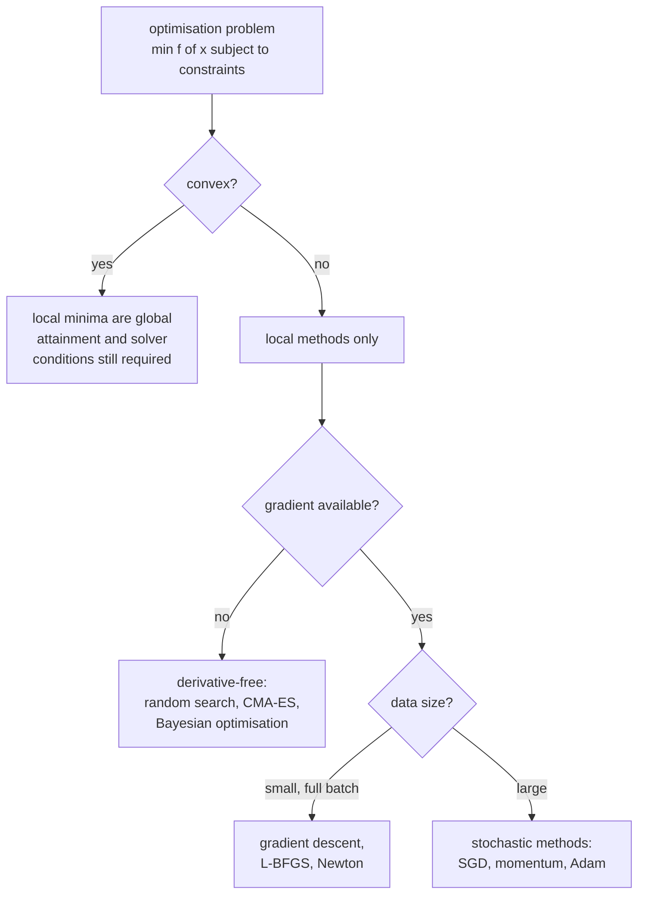
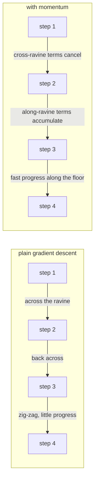

# Optimization: Actually Finding the Minimum

Training is optimisation. You have a loss surface defined over hundreds of
millions of dimensions, no ability to see it, and a budget of a few hundred
thousand steps. Every optimiser is a different answer to the same question: given
only local information, where should I step next?

This page builds that answer from convex analysis, through the whole family of
first-order methods, to the practical recipes that actually train models.



## The problem, stated

$$\min_{\theta \in \mathbb{R}^d} f(\theta) \quad \text{subject to} \quad g_i(\theta) \le 0, \; h_j(\theta) = 0$$

In supervised learning $f$ is the empirical risk

$$f(\theta) = \frac{1}{N}\sum_{i=1}^{N} \ell(f_\theta(x_i), y_i) + \Omega(\theta)$$

and this is worth pausing on. The thing you actually want to minimise is the
**true risk** $\mathbb{E}_{(x,y)\sim \mathcal{D}}[\ell]$, which you cannot
evaluate. Empirical risk minimisation substitutes the sample average. **Every
generalisation problem in ML is the gap between those two objectives**, and optimization does not alone resolve it. The selected solution and implicit regularization can improve or worsen generalization.

## Convexity, and why it is the dividing line

$f$ is convex if for all $x, y$ and $\lambda \in [0,1]$:

$$f(\lambda x + (1-\lambda)y) \le \lambda f(x) + (1-\lambda)f(y)$$

On a convex domain, the first-order characterization assumes differentiability. The Hessian characterization additionally assumes twice differentiability on an open domain:

- **First order**: $f(y) \ge f(x) + \nabla f(x)^\top (y - x)$ — the tangent plane
  lies below the function everywhere.
- **Second order**: $\nabla^2 f \succeq 0$ — the Hessian is positive
  semi-definite everywhere.

**The payoff**: for convex $f$, every local minimum is global, and
$\nabla f(x^\star)=0$ is sufficient for optimality. For non-convex $f$, neither
holds.

| Model | Convex in its parameters? |
|---|---|
| Linear/ridge/lasso regression | yes |
| Logistic regression | yes |
| Linear SVM (hinge loss) | yes, non-smooth |
| PCA | non-convex but solvable exactly via SVD |
| $k$-means | non-convex; Lloyd's algorithm is a local method |
| Matrix factorisation | non-convex; benign landscape only in specific formulations |
| Typical jointly trained nonlinear network | generally non-convex |

Two operations preserve convexity and are worth knowing because they let you
*prove* a new objective is convex: non-negative weighted sums, and composition
with an affine map. $\|Ax-b\|^2 + \lambda\|x\|_1$ is convex because both terms
are, and $\|\cdot\|$ composed with the affine $x \mapsto Ax-b$ stays convex.

### Strong convexity and smoothness

Two constants govern how fast first-order methods converge.

- **$L$-smooth**: $\|\nabla f(x)-\nabla f(y)\| \le L\|x-y\|$. Gradients do not
  change too fast. For twice differentiable functions this requires $\|\nabla^2f\|_2\le L$, equivalently $-LI\preceq H\preceq LI$. For convex $f$, the lower bound is already zero.
- **$\mu$-strongly convex**: $f(y) \ge f(x)+\nabla f(x)^\top(y-x)+\frac{\mu}{2}\|y-x\|^2$;
  equivalently $\nabla^2 f \succeq \mu I$.

For $\mu>0$, $\kappa=L/\mu$ controls worst-case bounds. The table concerns function error with a suitable algorithm and step size, not arbitrary momentum:

| Assumption | Gradient descent rate | Steps to $\epsilon$ |
|---|---|---|
| Convex, $L$-smooth | $O(1/k)$ | $O(1/\epsilon)$ |
| Strongly convex, $L$-smooth | $f(x_k)-f_*\le(1-\mu/L)^k(f(x_0)-f_*)$ at $\eta=1/L$ | $O(\kappa\log\frac1\epsilon)$ |
| + Nesterov momentum | accelerated | $O(\sqrt{\kappa}\log\frac1\epsilon)$ |

Suitably tuned Nesterov acceleration improves the worst-case dependence from $\kappa$ to $\sqrt\kappa$ in this smooth strongly convex setting. This is an order-bound comparison, not a guaranteed 100-fold runtime gain or a property of every momentum scheme.

## Gradient descent

$$\theta_{t+1} = \theta_t - \eta \nabla f(\theta_t)$$

### The learning rate is a stability question

For a quadratic $f(\theta) = \frac12\theta^\top H\theta$, the update is
$\theta_{t+1} = (I - \eta H)\theta_t$. Along the eigenvector with eigenvalue
$\lambda_i$ the iterate is multiplied by $(1 - \eta\lambda_i)$ each step. This
converges to the unique minimizer from every start iff, assuming $H$ is SPD,

$$|1-\eta\lambda_i| < 1 \quad\text{for all } i \quad\Longleftrightarrow\quad 0 < \eta < \frac{2}{\lambda_{\max}}$$

So **the largest stable learning rate is set by the sharpest direction, while
progress is limited by the flattest.** That single sentence explains ill
conditioning and instability past a threshold. Normalization can alter optimization geometry, but does not universally shrink every maximum Hessian eigenvalue. Negative curvature cannot be stabilized toward a minimum by this positive-step linear iteration; zero eigenvalues leave flat coordinates unchanged.

| $\eta$ relative to $2/\lambda_{\max}$ | Behaviour |
|---|---|
| far below | converges, slowly, monotonically |
| near $1/\lambda_{\max}$ | fastest for that direction |
| between $1/\lambda_{\max}$ and $2/\lambda_{\max}$ | converges while oscillating |
| above $2/\lambda_{\max}$ | diverges — loss goes to `inf` or `NaN` |

### Batch, stochastic, and mini-batch

| Variant | Gradient per step | Cost/step | Noise | Notes |
|---|---|---|---|---|
| Batch GD | all $N$ examples | $O(N)$ | none | smooth, exact, unusable at scale |
| SGD | 1 example | $O(1)$ | high | noisy, escapes saddles, poor hardware use |
| Mini-batch | $B$ examples | $O(B)$ | $\propto 1/\sqrt{B}$ | the actual default |

Mini-batch wins for two independent reasons. Statistically, the gradient
estimate's standard error falls as $1/\sqrt{B}$ — so going from $B=32$ to
$B=512$ (16× the compute) reduces iid standard error by a factor of four, a poor trade past a point.
Computationally, GPUs are matrix-multiply engines: $B=1$ leaves them idle, and
throughput rises steeply up to a saturation point.

**Gradient noise is not purely a cost.** It helps escape saddle points and sharp
minima, and there is good evidence that the flat minima SGD prefers generalise
better. This is why simply cranking the batch size up often *hurts* test
accuracy unless you compensate.

**Scaling rules for large batches** (empirical candidates, neither universal):

- **Linear scaling**: multiply $\eta$ by $k$ when multiplying $B$ by $k$, with a
  warmup of a few epochs. Works up to $B \approx 8$k for ImageNet-scale work.
- **Square-root scaling**: $\eta \propto \sqrt{B}$, better motivated for
  Adam-family optimisers where the update is normalised.

Warmup exists because at initialisation the gradient direction is nearly random
and the curvature estimate in adaptive methods is based on almost no data; a
large step then is actively destructive.

## Momentum

Plain gradient descent in a ravine bounces across the steep walls and creeps
along the floor. Momentum accumulates a velocity that cancels the oscillation and
compounds the consistent direction.

$$v_{t+1} = \beta v_t + \nabla f(\theta_t), \qquad \theta_{t+1} = \theta_t - \eta v_{t+1}$$

With $\beta = 0.9$, a persistent gradient reaches an effective step of
$\eta/(1-\beta) = 10\eta$ — a 10× speedup in consistent directions, while
alternating-sign components cancel. The **effective averaging window is
$1/(1-\beta)$ steps**, which is the number to reason with when tuning $\beta$.

**Nesterov accelerated gradient** evaluates the gradient at the *look-ahead*
point:

$$v_{t+1} = \beta v_t + \nabla f(\theta_t - \eta\beta v_t), \qquad \theta_{t+1} = \theta_t - \eta v_{t+1}$$

Because it sees where momentum is about to put it, it corrects earlier when
overshooting. With appropriate assumptions and tuning, Nesterov methods achieve accelerated rates. Empirical gains over heavy-ball in nonconvex networks are not guaranteed.



## Adaptive methods

The insight: different parameters deserve different learning rates. A rare
feature's weight sees a gradient once in ten thousand steps and should take a
big step when it does.

### AdaGrad

$$G_t = G_{t-1} + g_t^2, \qquad \theta_{t+1} = \theta_t - \frac{\eta}{\sqrt{G_t}+\epsilon}\,g_t$$

(All operations elementwise.) Parameters with large accumulated gradients get
smaller steps. Excellent for sparse features — it was built for convex problems
with sparse data. **Fatal flaw**: $G_t$ only grows, so the effective learning
rate decays to zero monotonically and training stalls.

### RMSProp

Replace the sum with an exponential moving average, so old gradients are
forgotten:

$$v_t = \beta_2 v_{t-1} + (1-\beta_2) g_t^2, \qquad \theta_{t+1} = \theta_t - \frac{\eta}{\sqrt{v_t}+\epsilon}g_t$$

Now the effective rate can rise again when gradients shrink. This fixed
AdaGrad's stall.

### Adam

RMSProp plus momentum, plus bias correction.

$$m_t = \beta_1 m_{t-1} + (1-\beta_1)g_t \qquad\text{(first moment, direction)}$$
$$v_t = \beta_2 v_{t-1} + (1-\beta_2)g_t^2 \qquad\text{(second moment, scale)}$$
$$\hat m_t = \frac{m_t}{1-\beta_1^t}, \qquad \hat v_t = \frac{v_t}{1-\beta_2^t}$$
$$\theta_{t+1} = \theta_t - \eta \frac{\hat m_t}{\sqrt{\hat v_t}+\epsilon}$$

**Why bias correction?** $m_0 = 0$, so $m_1 = (1-\beta_1)g_1 = 0.1 g_1$ — a
10× underestimate. Dividing by $1-\beta_1^t$ removes exactly that
initialization bias under stationary moment assumptions. The denominators approach one as $t$ grows. Ignoring epsilon at step one, the uncorrected ratio is $0.1/\sqrt{0.001}\operatorname{sign}(g)=\sqrt{10}\operatorname{sign}(g)$, versus a unit-sign corrected ratio: the initial step is larger, not absurdly small. Changing gradients and epsilon affect later behavior.

Defaults: $\beta_1 = 0.9$, $\beta_2 = 0.999$, $\epsilon = 10^{-8}$. For
transformers, $\beta_2 = 0.95$ and $\epsilon = 10^{-8}$ is common — a shorter
second-moment window reacts faster to the loss spikes large language models
suffer.

The moments and zero-start correction follow the [original Adam algorithm](https://arxiv.org/abs/1412.6980); the first-step ratio above is direct substitution, not a claim about every later update.

**Reading Adam correctly**: the update magnitude is roughly $\eta$ regardless of
gradient scale, because $\hat m/\sqrt{\hat v} \approx \pm 1$. Adam is closer to
*sign* descent with a smoothed sign than to scaled gradient descent. That is why
Adam is robust to bad loss scaling and why its learning rates are so much
smaller than SGD's (3e-4 vs 0.1).

### AdamW — and why plain Adam + weight decay is wrong

L2 regularisation adds $\lambda\theta$ to the gradient. Inside Adam that term
gets divided by $\sqrt{\hat v}$ along with everything else, so parameters with
large gradients get *less* regularisation — the opposite of the intent. AdamW
**decouples** it:

$$\theta_{t+1} = \theta_t - \eta\left(\frac{\hat m_t}{\sqrt{\hat v_t}+\epsilon} + \lambda\theta_t\right)$$

The decay is applied directly to the parameters, not routed through the adaptive
scaling. AdamW is a common transformer choice. Excluding biases and normalization gains is a useful recipe to test, not a mathematical requirement; parameter grouping and decay strength depend on the architecture and task.

### The full family, compared

| Optimiser | State per param | Key idea | Best for | Watch out for |
|---|---|---|---|---|
| SGD | 0 | plain gradient | convex, tiny models | slow, LR-sensitive |
| SGD + momentum | 1 | velocity | CNNs, vision | needs LR schedule |
| Nesterov | 1 | look-ahead gradient | same | marginal gains |
| AdaGrad | 1 | accumulate $g^2$ | sparse convex | learning rate dies |
| RMSProp | 1 | EMA of $g^2$ | RNNs, RL | no momentum |
| Adam | 2 | EMA of $g$ and $g^2$ | default everywhere | can generalise worse than SGD |
| AdamW | 2 | decoupled decay | transformers, LLMs | tune $\lambda$ separately |
| LAMB / LARS | 2 | layerwise trust ratio | batch sizes in the tens of thousands | complex |
| Lion | 1 | sign of momentum | memory-constrained training | needs smaller LR, higher decay |
| Adafactor | $O(n+m)$ | factored second moment | huge embedding matrices | slightly worse quality |
| Shampoo / SOAP | matrix | full-matrix preconditioning | frontier-scale pretraining | expensive, complex |

**Memory matters at scale.** Adam stores two extra tensors per parameter. In
fp32, a 7B model needs 28 GB for weights and 56 GB for optimiser state — the
optimiser is twice the model. Adafactor factors the second moment into row and
column statistics; 8-bit optimisers quantise it; ZeRO shards it across devices.

### The SGD-vs-Adam generalisation question

Adam converges faster in training loss; SGD with momentum often reaches better
test accuracy on vision tasks. The going explanations are that Adam's
per-parameter normalisation finds sharper minima, and that its implicit
regularisation differs from SGD's. Language-model recipes commonly use adaptive optimizers because gradient scales can differ markedly, but this is not a theorem that SGD cannot train a transformer. Use AdamW for transformers, and consider SGD+momentum for
convolutional vision models with long schedules.

## Learning-rate schedules

The single highest-leverage hyperparameter, and the one most worth scheduling.

| Schedule | Formula | Where it is used |
|---|---|---|
| Step decay | $\eta \times \gamma$ every $k$ epochs | classic ResNet recipes |
| Exponential | $\eta_0 e^{-kt}$ | simple, smooth |
| Cosine | $\eta_t = \eta_{\min}+\tfrac12(\eta_0-\eta_{\min})(1+\cos(\pi t/T))$ | the modern default |
| Linear decay to zero | $\eta_0(1 - t/T)$ | LLM pretraining, very competitive |
| Warmup + cosine | linear rise for $w$ steps, then cosine | transformers, almost universally |
| Inverse sqrt | $\eta \propto 1/\sqrt{t}$ | original Transformer paper |
| One-cycle | rise then fall, with inverse momentum schedule | fast convergence, `fastai` |
| Cyclical / warm restarts | sawtooth with restarts | escaping poor basins; ensembling snapshots |
| ReduceLROnPlateau | drop when validation stalls | when you cannot pre-plan $T$ |

**Warmup is recipe-dependent.** It can reduce early instability while activations and optimizer statistics change rapidly. Initialization, normalization, batch size and optimizer affect whether it is needed and for how long. LayerNorm has no BatchNorm-style running statistics; monitor actual activations, gradients and loss before adopting a schedule.

**Decay to (nearly) zero.** The end-of-training low learning rate does real work
— it is where the model settles into a minimum rather than bouncing around it.
Schedules truncated early lose a surprising amount of final quality.

## Constrained optimisation

### Lagrange multipliers

To minimise $f(x)$ subject to $h(x) = 0$, form

$$\mathcal{L}(x,\lambda) = f(x) + \lambda h(x)$$

and set $\nabla_x\mathcal{L} = 0$, $h(x) = 0$. Geometrically: at the optimum the
gradient of the objective is parallel to the gradient of the constraint, because
any component along the constraint surface could still be exploited.

### KKT conditions

For differentiable constraints, KKT conditions are necessary at a local optimum under an appropriate constraint qualification (for example LICQ):

1. **Stationarity**: $\nabla f + \sum_i \mu_i \nabla g_i + \sum_j \lambda_j \nabla h_j = 0$
2. **Primal feasibility**: $g_i \le 0$, $h_j = 0$
3. **Dual feasibility**: $\mu_i \ge 0$
4. **Complementary slackness**: $\mu_i g_i = 0$

Condition 4 is the interesting one: either a constraint is active ($g_i = 0$) or
its multiplier is zero. **This is exactly what makes SVM support vectors
sparse** in a feasible hard-margin formulation: positive multipliers require active margin constraints, although active constraints can have zero multipliers. Soft-margin examples inside the margin or misclassified can also have nonzero multipliers.

### Duality

A Lagrangian dual can be formed for nonconvex problems too. Weak duality ($d^\star\le p^\star$) does not require convexity. In convex problems with the usual affine equality and convex inequality structure, Slater's strict-feasibility condition is a sufficient strong-duality condition. The
dual is why SVMs can use kernels: the dual formulation depends on the data only
through inner products $x_i^\top x_j$, which can be swapped for $K(x_i,x_j)$
without ever computing the feature map.

### Projected gradient and proximal methods

For simple constraint sets, take a gradient step and project back:

$$\theta_{t+1} = \Pi_{\mathcal{C}}\bigl(\theta_t - \eta\nabla f(\theta_t)\bigr)$$

For non-smooth regularisers, use the proximal operator. For L1 this gives
**soft-thresholding**, the closed form behind ISTA/FISTA and behind why lasso
produces exact zeros:

$$\mathrm{prox}_{\eta\lambda\|\cdot\|_1}(v)_i = \mathrm{sign}(v_i)\max(|v_i|-\eta\lambda,\,0)$$

## Second-order and beyond

| Method | Update | Cost | Reality |
|---|---|---|---|
| Newton | $-H^{-1}\nabla f$ | $O(d^3)$ | one step for SPD quadratics; dense cost becomes prohibitive as dimension grows |
| Gauss–Newton | $-(J^\top J)^{-1}J^\top r$ | $O(d^3)$ | least squares; PSD by construction |
| Levenberg–Marquardt | $-(J^\top J+\lambda I)^{-1}J^\top r$ | $O(d^3)$ | damps Gauss-Newton toward a gradient-like step |
| BFGS | rank-2 update to $H^{-1}$ | $O(d^2)$ memory | small/medium problems |
| L-BFGS | last $m$ pairs only | $O(md)$ | the workhorse for classical ML; poor with minibatch noise |
| Conjugate gradient | $H$-orthogonal directions | one matvec plus $O(d)$ vector work per iteration | SPD systems; dense matvec costs $O(d^2)$ |
| K-FAC | Kronecker-factored Fisher | practical | genuine speedups on some networks |
| Hessian-free | CG on Hessian-vector products | practical | needs no explicit $H$ |

The trick that makes several of these possible is that a **Hessian-vector
product costs one extra backward pass**, no explicit Hessian required:

$$Hv = \nabla_\theta\bigl(\nabla_\theta f \cdot v\bigr)$$

L-BFGS deserves a specific warning: it assumes a deterministic objective. With
minibatch noise its curvature pairs are garbage. Use it for full-batch problems
(logistic regression, CRFs, physics-informed nets with small data), not for SGD
training.

## Gradient-free optimisation

When gradients do not exist — hyperparameters, discrete architectures, black-box
simulators, non-differentiable metrics like BLEU or revenue.

| Method | Idea | Sample efficiency |
|---|---|---|
| Grid search | try everything | terrible in $>3$ dims |
| Random search | sample uniformly | better than grid; strictly dominates it when few dims matter |
| Bayesian optimisation (GP/TPE) | fit a surrogate, optimise an acquisition function | best for expensive evaluations |
| Hyperband / ASHA | aggressive early stopping of bad runs | best when a partial run predicts the final one |
| BOHB | Bayesian + Hyperband | strong practical default |
| Evolutionary / CMA-ES | population, mutation, selection | robust, parallel, many evaluations |
| Simulated annealing | accept worse moves with decaying probability | combinatorial problems |

**Random beats grid** for a specific and often-missed reason: if only 2 of your
6 hyperparameters matter, a grid of $4^6$ points tries only 4 distinct values of
each important one, while 4,096 random points try 4,096 distinct values of each.

## Practical failure modes

| Symptom | Likely cause | Action |
|---|---|---|
| Loss `NaN` in the first few steps | LR too high; no warmup; fp16 overflow | lower LR 10×, add warmup, check loss scaling |
| Loss flat from step 0 | LR too low; dead activations; wrong loss reduction | LR range test; check activation statistics |
| Loss decreases then explodes | LR too high for the late-training sharp region | decay schedule, gradient clipping |
| Train loss falls, val loss rises | overfitting | more data, augmentation, regularisation, early stop |
| Loss oscillates without trend | batch too small; LR at the stability edge | raise batch or lower LR |
| Sudden spike then recovery | bad batch, or an outlier example | clip gradients; inspect the batch |
| Progress stalls mid-training | plateau/saddle; schedule decayed too early | warm restart; check the schedule |
| Works at batch 32, fails at 512 | LR not rescaled | linear or sqrt scaling, longer warmup |

**Gradient clipping** by global norm is nearly free insurance:

```python
torch.nn.utils.clip_grad_norm_(model.parameters(), max_norm=1.0)
```

It rescales the whole gradient vector when $\|g\| > 1$, preserving direction and
capping magnitude. Standard for RNNs and transformers.

**The learning-rate range test** is the fastest way to pick $\eta$: start
absurdly low, increase exponentially over a few hundred steps, plot loss vs LR.
Choose roughly an order of magnitude below where the loss starts rising.

## A default recipe that works

This complete CPU example makes accumulation units explicit. Equal-sized examples
are accumulated through summed losses, divided by the actual window's example
count, including the final partial window. A sequence model would count valid
target tokens instead. The scheduler advances only after an optimizer step;
OneCycle's momentum cycling is disabled deliberately.

```python runnable
import math
import torch
from torch import nn

torch.manual_seed(17)
torch.set_num_threads(1)
X = torch.randn(23, 3)
y = X @ torch.tensor([1., -2., .5]) + .1
model = nn.Linear(3, 1)
optimizer = torch.optim.AdamW([
    {"params": [model.weight], "weight_decay": .01},
    {"params": [model.bias], "weight_decay": 0.},
], lr=.01)
batches = [(X[i:i+4], y[i:i+4]) for i in range(0, len(X), 4)]
accum_steps, epochs = 4, 10
total_steps = epochs * math.ceil(len(batches) / accum_steps)
scheduler = torch.optim.lr_scheduler.OneCycleLR(
    optimizer, max_lr=.05, total_steps=total_steps,
    pct_start=.3, cycle_momentum=False,
)
before = nn.functional.mse_loss(model(X).squeeze(1), y).item()
updates = 0
for _ in range(epochs):
    for start in range(0, len(batches), accum_steps):
        window = batches[start:start+accum_steps]
        count = sum(len(xb) for xb, _ in window)
        optimizer.zero_grad(set_to_none=True)
        for xb, yb in window:
            loss = nn.functional.mse_loss(
                model(xb).squeeze(1), yb, reduction="sum"
            ) / count
            loss.backward()
        nn.utils.clip_grad_norm_(model.parameters(), 1.)
        optimizer.step()
        scheduler.step()
        updates += 1
after = nn.functional.mse_loss(model(X).squeeze(1), y).item()
assert updates == total_steps
assert after < before
print("optimizer updates:", updates, "MSE:", before, "->", after)
```

## Worked convergence and constrained examples

### The descent lemma supplies a usable step condition

Write $h=y-x$ and integrate the gradient along the segment:
$f(y)-f(x)=\int_0^1\nabla f(x+th)^\top h\,dt$.
Lipschitz gradients bound the difference from $\nabla f(x)^\top h$
by $\int_0^1Lt\|h\|^2dt=L\|h\|^2/2$. Thus

$$
f(x-\eta g)\le f(x)-\eta(1-L\eta/2)\|g\|^2.
$$

For $g=\nabla f(x)$ and $0<\eta<2/L$ this guarantees descent unless the
gradient vanishes, as long as the relevant segment stays in the domain.
For convex $L$-smooth $f$ with attained minimizer and $\eta=1/L$,
$f(x_k)-f_*\le L\|x_0-x_*\|^2/(2k)$. Strong convexity additionally
gives the geometric function-error bound shown earlier. These guarantees
do not apply to Adam simply because it uses gradients.

### Safeguarding Newton

For $f(x)=x^4-x^2$, at $x=.1$ the gradient is $-.196$ and Hessian is
$-1.88$. Newton's step $-f'/f''\approx-.1043$ heads toward the local maximum
at zero and increases the objective. A Newton direction must be checked for
descent, or its Hessian model modified.

Armijo backtracking tests
$f(x+\alpha p)\le f(x)+c\alpha g^\top p$ with $0<c<1$ and $g^\top p<0$,
shrinking $\alpha$ until sufficient decrease. A trust-region method instead
limits $\|p\|\le\Delta$ and compares actual decrease with predicted model
decrease. A poor ratio rejects/shrinks the step; a good ratio can expand the
radius. Neither blindly accepts an indefinite quadratic's stationary point.

### Stochastic gradients: what averaging actually guarantees

For a fixed dataset, uniform sampling makes $g_i=\nabla\ell_i$ satisfy
$E[g_i\mid\theta]=N^{-1}\sum_i g_i$. With-replacement averaging over $B$
independent draws has covariance $\Sigma/B$, where $\Sigma$ is the population
covariance of the finite list of gradients. Sampling $B$ distinct indices
instead gives $(N-B)\Sigma/[B(N-1)]$.

For the scalar quadratic with noisy gradient $\mu x+\epsilon_t$,
$E[\epsilon_t]=0$, variance $\sigma_g^2/B$, the recursion is
$x_{t+1}=(1-\eta\mu)x_t-\eta\epsilon_t$. If $0<\eta\mu<2$ and noise is
independent across steps, stationary variance is
$\eta\sigma_g^2/[B\mu(2-\eta\mu)]$. A fixed step leaves a noise floor.
Classical diminishing-step convergence results require assumptions such as
unbiased bounded-variance noise and $\sum_t\eta_t=\infty$,
$\sum_t\eta_t^2<\infty$, not merely "decrease LR occasionally."

### A primal solution, multiplier and dual certificate

Minimize $\tfrac12(x-2)^2$ subject to $x\le1$.
The constrained solution is $x_*=1$, objective $1/2$. With
$\mathcal L=\tfrac12(x-2)^2+\lambda(x-1)$,
stationarity gives $x=2-\lambda$ and dual function
$g(\lambda)=\lambda-\lambda^2/2$, $\lambda\ge0$.
Its maximum at $\lambda_*=1$ is also $1/2$. Feasibility,
stationarity, nonnegative multiplier and complementary slackness all hold.
Strict feasibility at $x=0$ supplies Slater's condition.

Constraint qualifications matter: minimize $x$ subject to $x^2\le0$.
Only $x=0$ is feasible, but stationarity would require $1+\lambda(2x)=0$,
impossible there. The gradient of the active constraint vanishes, violating
the relevant qualification; the optimizer exists without KKT multipliers.

### Soft-thresholding from its minimization problem

Minimize $\tfrac12(z-v)^2+t|z|$ for $t\ge0$.
On $z>0$, stationarity gives $z=v-t$ and requires $v>t$.
On $z<0$, it gives $z=v+t$ and requires $v<-t$.
At zero, $0\in-v+t[-1,1]$ precisely when $|v|\le t$.
Combining cases gives $\operatorname{sign}(v)\max(|v|-t,0)$.
ISTA applies this to $v=w-\eta X^\top(Xw-y)$ with $t=\eta\lambda$.

```python runnable
import numpy as np

rng = np.random.default_rng(61)
X = rng.normal(size=(60, 8))
true = np.array([2., -1., 0., 0., 0., 0., 0., 0.])
y = X @ true
lam = 1.
L = np.linalg.norm(X, 2)**2
w = np.zeros(8)
objectives = []
for _ in range(600):
    v = w-X.T@(X@w-y)/L
    w = np.sign(v)*np.maximum(np.abs(v)-lam/L, 0.)
    objectives.append(.5*np.sum((X@w-y)**2)+lam*np.abs(w).sum())
assert np.max(np.diff(objectives)) < 1e-10
g = X.T@(X@w-y)
active = np.abs(w) > 1e-10
assert np.max(np.abs(g[active]+lam*np.sign(w[active]))) < 1e-7
assert np.max(np.abs(g[~active])) <= lam+1e-7
assert np.isclose(.1/np.sqrt(.001), np.sqrt(10))
assert np.isclose(np.sqrt(32/512), .25)

def f(x):
    return x**4-x**2
x = .1
gradient, hessian = 4*x**3-2*x, 12*x*x-2
assert f(x-gradient/hessian) > f(x)
p, alpha = -gradient, 1.
while f(x+alpha*p) > f(x)+1e-4*alpha*gradient*p:
    alpha *= .5
assert f(x+alpha*p) < f(x)
print("ISTA coefficients:", w, "Armijo step:", alpha)
```

For the theorem assumptions, see [Boyd and Vandenberghe's text](https://web.stanford.edu/~boyd/cvxbook/).
The numerical checks test these examples, not convergence on arbitrary neural networks.

## Self-check

1. Derive the largest stable learning rate for gradient descent on a quadratic
   with Hessian eigenvalues $\{100, 1\}$, and say how many steps it takes to make
   progress along the flat direction.
2. Explain Adam's bias correction: what goes wrong without it, and for how long?
3. Why is Adam + L2 different from AdamW, and which parameters should be excluded
   from weight decay?
4. Your transformer diverges at step 300 with LR 1e-3. Give four independent
   fixes, ranked.
5. What does complementary slackness say, and what does it imply about SVMs?
6. You quadruple the batch size. What do you do to the learning rate, and why
   two different answers exist.
7. Why does random search beat grid search, in one sentence about effective
   dimensionality?

## Worked self-check answers

1. SPD eigenvalues $100,1$ require $0<\eta<.02$. At $\eta=.01$ the
   flat coordinate contracts by $.99$; about 100 steps reduce it by $e^{-1}$.
2. Zero-start EMAs underestimate stationary moments by factors
   $1-\beta_1^t,1-\beta_2^t$. Their ratio matters: the first uncorrected
   update is $\sqrt{10}$ times the corrected one for the given defaults.
   There is no universal duration or direction of error for changing gradients.
3. Coupled L2 enters Adam's moments and adaptive scale; AdamW applies decay
   directly. Bias/norm exclusions are recipe choices to validate.
4. Inspect the first invalid tensor and data before ranking interventions.
   Test a smaller LR, revised warmup, stable logits/precision, and correctly
   unscaled clipping. Each addresses a distinct possible failure.
5. $\lambda_i g_i=0$: inactive inequalities have zero multipliers.
   Hard-margin support vectors with positive multipliers are on the margin;
   soft-margin positive multipliers can also occur inside it.
6. Quadrupling iid batch size halves gradient standard error. Linear and
   square-root LR scaling preserve different approximate regimes; neither
   is a universal update rule. Tune and inspect optimizer-step counts.
7. With few important continuous coordinates, random search explores many more
   distinct values per coordinate than a comparably sized Cartesian grid.

## Where to go next

- [Calculus](./calculus.md) — where the gradients come from.
- [Linear Algebra](./linear-algebra.md) — eigenvalues, conditioning, and the
  geometry of the loss surface.
- [Numerical Computing](./numerical-methods.md) — floating point, stability, and
  the arithmetic that makes all of this actually run.
