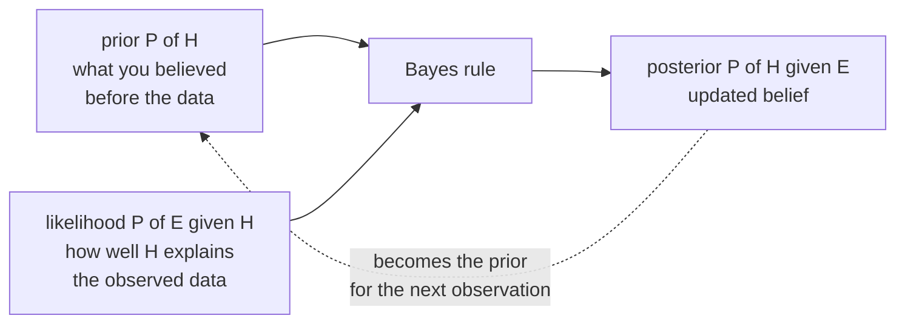

# Probability: Reasoning Under Uncertainty

Machine learning is applied probability with a compute budget. A probabilistic classifier estimates $p(y\mid x)$; other classifiers may output labels or scores. Many common losses are negative log-likelihoods, and some penalties admit a prior interpretation. Dropout is a Bernoulli mask.
Diffusion models are a Markov chain run backwards. If you understand probability
properly, half of ML stops being a list of tricks and becomes one idea applied
repeatedly.

## Two ways to read a probability

Before any formula, settle what a probability *means*, because the two schools
lead to different algorithms.

| | Frequentist | Bayesian |
|---|---|---|
| A probability is | a long-run frequency | a degree of belief |
| Parameters are | fixed but unknown | random variables with distributions |
| Data is | random | fixed once observed |
| You estimate with | MLE, confidence intervals | posteriors, credible intervals |
| ML examples | ERM, cross-validation, bootstrap | MAP, Bayesian NNs, Gaussian processes, Thompson sampling |

Neither is "correct". They answer different questions. "What is the probability
this specific coin is fair?" is meaningless to a strict frequentist (the coin
either is or is not) and perfectly natural to a Bayesian. Most practical ML is
frequentist in its training loop and Bayesian in its regularisers.

## The foundations

### Sample space, events, axioms

A **sample space** $\Omega$ is the set of all outcomes. An **event** is a subset
of $\Omega$. A probability measure $P$ satisfies three axioms (Kolmogorov):

1. $P(A) \ge 0$ for every event $A$.
2. $P(\Omega) = 1$.
3. For pairwise disjoint $A_1, A_2, \dots$: $P(\bigcup_i A_i) = \sum_i P(A_i)$.

Everything else is a theorem. The inclusion–exclusion rule, for instance:

$$P(A \cup B) = P(A) + P(B) - P(A \cap B)$$

You subtract the intersection because axiom 3 only applies to disjoint sets and
you would otherwise count the overlap twice.

### Conditional probability

$$P(A \mid B) = \frac{P(A \cap B)}{P(B)}, \qquad P(B) > 0$$

Read it geometrically: conditioning **restricts the sample space to $B$ and
renormalises**. That is the whole idea, and it is why $P(\cdot \mid B)$ is itself
a valid probability measure.

The **chain rule** follows by rearranging and iterating:

$$P(x_1, x_2, \dots, x_T) = \prod_{t=1}^{T} P(x_t \mid x_1, \dots, x_{t-1})$$

That factorisation is not a piece of trivia — it is *literally the definition of
an autoregressive language model*. GPT computes each conditional on the right
and multiplies. Nothing more.

### Independence

$A$ and $B$ are independent iff $P(A \cap B) = P(A)P(B)$, equivalently
$P(A \mid B) = P(A)$. Knowing $B$ tells you nothing about $A$.

**Conditional independence** is subtler and more useful:
$A \perp B \mid C$ iff $P(A, B \mid C) = P(A\mid C)P(B\mid C)$. Naive Bayes
assumes features are conditionally independent given the label — false in
practice, useful anyway. Graphical models are entirely a language for stating
which conditional independencies hold.

Independence does **not** follow from conditional independence, nor the reverse.
Ice cream sales and drownings are dependent, but conditionally independent given
temperature. Two independent coin flips become *dependent* once you condition on
their sum — this is "explaining away", and it is why adding a collider to a
causal graph creates spurious correlation.

## Bayes' theorem

Rearranging the definition of conditional probability two ways gives:

$$\underbrace{P(H \mid E)}_{\text{posterior}} = \frac{\overbrace{P(E \mid H)}^{\text{likelihood}} \; \overbrace{P(H)}^{\text{prior}}}{\underbrace{P(E)}_{\text{evidence}}}$$

with $P(E) = \sum_h P(E \mid h)P(h)$ by the law of total probability.



### The medical-test example, done properly

A disease affects 1 in 1000 people. A test has 99% sensitivity
($P(+ \mid D) = 0.99$) and 99% specificity ($P(- \mid \neg D) = 0.99$). You test
positive. What is $P(D \mid +)$?

Work in natural frequencies over 100,000 people:

| | Has disease (100) | No disease (99,900) | Total |
|---|---|---|---|
| Test positive | 99 | 999 | 1,098 |
| Test negative | 1 | 98,901 | 98,902 |

$$P(D \mid +) = \frac{99}{1098} \approx 9\%$$

A 99%-accurate test on a positive result leaves you 91% likely to be healthy.
The reason is **base rates**: false positives are drawn from a pool 999 times
larger than true positives.

This is not a puzzle, it is your fraud detector, your anomaly detector, and your
rare-disease classifier. It is why precision collapses on imbalanced data even
at high recall, and why "99% accurate" is a meaningless claim without the base
rate. Take the same test to a population where 30% are sick and
$P(D\mid+)$ jumps to 98%.

### MLE, MAP, and full Bayes

Three ways to turn Bayes into an algorithm:

$$\theta_{\text{MLE}} = \arg\max_\theta \; p(\mathcal{D}\mid\theta) \qquad \theta_{\text{MAP}} = \arg\max_\theta \; p(\mathcal{D}\mid\theta)\,p(\theta) \qquad p(\theta \mid \mathcal{D}) \text{ in full}$$

MLE ignores the prior. MAP includes it but returns a single point. Full Bayes
keeps the whole posterior and integrates over it.

**The crucial connection.** Take the log of the MAP objective:

$$\log p(\mathcal{D}\mid\theta) + \log p(\theta)$$

With a Gaussian prior $\theta \sim \mathcal{N}(0, \tau^2 I)$, $\log p(\theta) =
-\|\theta\|^2/(2\tau^2) + c$. Negate to get a loss:

$$\underbrace{-\log p(\mathcal{D}\mid\theta)}_{\text{your usual loss}} + \underbrace{\lambda \|\theta\|_2^2}_{\text{L2 penalty}}$$

With a sum negative log-likelihood, Gaussian MAP gives $\lambda=1/(2\tau^2)$; dividing the entire objective by $N$ gives $\lambda=1/(2N\tau^2)$ beside an average loss. L1 similarly matches a proper Laplace prior. Not every penalty exponentiates to a normalizable density, and early stopping is an algorithmic rule, not generally exact MAP. Coupled L2 and decoupled AdamW weight decay differ under adaptive updates.

## Random variables and distributions

A **random variable** is a function $X : \Omega \to \mathbb{R}$. It is neither
random nor a variable; it is a deterministic map from outcomes to numbers, and
the randomness lives in $\Omega$.

### PMF, PDF, CDF

| Object | Discrete | Continuous |
|---|---|---|
| Mass/density | $p(x) = P(X=x)$ | $f(x)$, with $P(X=x)=0$ |
| Normalisation | $\sum_x p(x) = 1$ | $\int f(x)\,dx = 1$ |
| CDF | $F(x)=\sum_{t\le x}p(t)$ | $F(x)=\int_{-\infty}^x f(t)\,dt$ |
| Probability of an interval | sum | $F(b)-F(a)$ |

A density can exceed 1 — $\mathrm{Uniform}(0, 0.5)$ has $f = 2$ everywhere on its
support. Densities are not probabilities; only their integrals are.

### The distributions you must know cold

| Distribution | Support | Parameters | Mean | Variance | Where it shows up in ML |
|---|---|---|---|---|---|
| Bernoulli | $\{0,1\}$ | $p$ | $p$ | $p(1-p)$ | binary labels, dropout masks |
| Binomial | $\{0..n\}$ | $n, p$ | $np$ | $np(1-p)$ | counts of successes, A/B tests |
| Categorical | $\{1..K\}$ | $\mathbf{p}$ | — | — | softmax output, next-token distribution |
| Multinomial | counts | $n,\mathbf{p}$ | $np_k$ | — | bag-of-words counts |
| Poisson | $\{0,1,2,...\}$ | $\lambda$ | $\lambda$ | $\lambda$ | arrival rates, count regression |
| Geometric | $\{1,2,...\}$ | $p$ | $1/p$ | $(1-p)/p^2$ | trials until success |
| Uniform | $[a,b]$ | $a,b$ | $\frac{a+b}{2}$ | $\frac{(b-a)^2}{12}$ | initialisation, sampling |
| Gaussian | $\mathbb{R}$ | $\mu,\sigma^2$ | $\mu$ | $\sigma^2$ | noise, weight init, VAE latents |
| Exponential | $[0,\infty)$ | $\lambda$ | $1/\lambda$ | $1/\lambda^2$ | waiting times, survival models |
| Beta | $[0,1]$ | $\alpha,\beta$ | $\frac{\alpha}{\alpha+\beta}$ | — | prior on a probability, Thompson sampling |
| Dirichlet | simplex | $\boldsymbol{\alpha}$ | — | — | prior over categorical, LDA topics |
| Gumbel | $\mathbb{R}$ | $\mu,\beta$ | — | — | Gumbel-max / Gumbel-softmax sampling |
| Laplace | $\mathbb{R}$ | $\mu,b$ | $\mu$ | $2b^2$ | L1 prior, differential privacy noise |

**Conjugacy** is why Beta and Dirichlet appear: a Beta prior with a Binomial
likelihood gives a Beta posterior, so the update is arithmetic on the
parameters rather than an integral. Beta$(\alpha,\beta)$ + $s$ successes and $f$
failures $\to$ Beta$(\alpha+s, \beta+f)$. That is one line of code and it is the
whole of a Thompson-sampling bandit.

### The Gaussian, and why it is everywhere

$$f(x) = \frac{1}{\sqrt{2\pi\sigma^2}} \exp\left(-\frac{(x-\mu)^2}{2\sigma^2}\right)$$

Four reasons it dominates:

1. **The CLT** makes standardized iid sums approach Gaussian under finite, positive variance; heavy-tailed or dependent sequences need different conditions.
2. **Maximum entropy**: among all distributions on $\mathbb{R}$ with a given mean
   and variance, the Gaussian has the highest entropy — it assumes the least
   beyond those two facts.
3. **Closure**: linear combinations of jointly Gaussian variables are Gaussian, including sums of independent Gaussians. Marginal Gaussianity alone is insufficient. Nondegenerate multivariate Gaussian marginals and conditionals remain Gaussian.
4. **Analytic convenience**: negative log-likelihood is exactly squared error.
   $-\log f(x) = \frac{(x-\mu)^2}{2\sigma^2} + c$. **MSE loss is a Gaussian
   likelihood interpretation** when residual variance is fixed. More generally squared error targets the conditional mean whenever the necessary second moments exist; heavy tails can make it unstable without making that target mathematically wrong.

Marginal Gaussianity is not enough for closure: take $X\sim N(0,1)$ and an independent fair sign $S$, and set $Y=SX$. Both marginals are standard normal, but $X+Y$ equals zero with probability one half and $2X$ otherwise, so the sum is not Gaussian. The pair is not jointly Gaussian.

The multivariate density below assumes SPD covariance:

$$f(\mathbf{x}) = \frac{1}{(2\pi)^{d/2}|\Sigma|^{1/2}}\exp\left(-\tfrac{1}{2}(\mathbf{x}-\boldsymbol{\mu})^\top \Sigma^{-1}(\mathbf{x}-\boldsymbol{\mu})\right)$$

The quadratic form $(\mathbf{x}-\boldsymbol\mu)^\top\Sigma^{-1}(\mathbf{x}-\boldsymbol\mu)$
is the squared **Mahalanobis distance** — Euclidean distance after whitening by
the covariance. Level sets are ellipsoids whose axes are $\Sigma$'s
eigenvectors, scaled by $\sqrt{\lambda_i}$. That is the same eigendecomposition
PCA uses, which is why PCA and Gaussian modelling keep meeting.

## Expectation, variance, and their algebra

$$\mathbb{E}[X] = \sum_x x\,p(x) \quad\text{or}\quad \int x f(x)\,dx, \qquad \mathrm{Var}(X) = \mathbb{E}[(X-\mathbb{E}[X])^2] = \mathbb{E}[X^2] - \mathbb{E}[X]^2$$

The properties below assume the required expectations exist; variance identities require finite second moments:

| Property | Holds when | Note |
|---|---|---|
| $\mathbb{E}[aX+b] = a\mathbb{E}[X]+b$ | always | linearity |
| $\mathbb{E}[X+Y] = \mathbb{E}[X]+\mathbb{E}[Y]$ | **always**, even if dependent | the most under-used fact in probability |
| $\mathbb{E}[XY] = \mathbb{E}[X]\mathbb{E}[Y]$ | if independent; also for dependent uncorrelated variables with finite second moments | |
| $\mathrm{Var}(aX+b) = a^2\mathrm{Var}(X)$ | always | shifts do not change spread |
| $\mathrm{Var}(X+Y) = \mathrm{Var}X + \mathrm{Var}Y$ | only if uncorrelated | otherwise add $2\mathrm{Cov}(X,Y)$ |

Linearity of expectation without independence is what makes variance-reduction
arguments work. Averaging $n$ i.i.d. estimates keeps the mean and divides the
variance by $n$:

$$\mathrm{Var}\!\left(\tfrac{1}{n}\sum X_i\right) = \frac{\sigma^2}{n}$$

**That single line is the mathematical case for ensembles, for bagging, for
larger minibatches, and for averaging multiple sampled generations.** Averaging identically distributed predictors preserves their common bias, but bagging changes the fitting distribution and can change bias too — and the
$\rho\sigma^2 + \frac{1-\rho}{n}\sigma^2$ correction for correlated estimators
is why random forests bother to decorrelate trees with feature subsampling.

### Law of total expectation and variance

$$\mathbb{E}[X] = \mathbb{E}\bigl[\mathbb{E}[X\mid Y]\bigr]$$

$$\mathrm{Var}(X) = \mathbb{E}[\mathrm{Var}(X\mid Y)] + \mathrm{Var}(\mathbb{E}[X\mid Y])$$

These terms mean within-condition variance and variance of conditional means. They become **aleatoric** and **epistemic** terms in a posterior predictive model when conditioning on uncertain parameters $\Theta$ at fixed input and observed data. Conditioning on an ordinary feature instead does not make feature-driven variation epistemic. Ensembles are an approximation, not automatically posterior samples.

### Covariance and correlation

$$\mathrm{Cov}(X,Y) = \mathbb{E}[(X-\mu_X)(Y-\mu_Y)], \qquad \rho = \frac{\mathrm{Cov}(X,Y)}{\sigma_X\sigma_Y} \in [-1,1]$$

Correlation measures **linear** dependence only. $Y = X^2$ with $X$ symmetric
about zero has $\rho = 0$ and total dependence. Zero correlation does not imply
independence — except for jointly Gaussian variables, where it does.

## Concentration: why finite samples work at all

### Law of large numbers

For iid observations with finite absolute mean, the sample mean converges to the true mean as $n\to\infty$. Weak LLN gives
convergence in probability; strong LLN gives almost-sure convergence. This is the
licence to estimate expectations by averaging, i.e. to use minibatches.

### Central limit theorem

For i.i.d. $X_i$ with finite mean $\mu$ and positive finite variance $\sigma^2$:

$$\frac{\bar{X}_n - \mu}{\sigma/\sqrt{n}} \xrightarrow{d} \mathcal{N}(0,1)$$

Three things people get wrong:

- The CLT is about the **sampling distribution of the mean**, not about the data.
  Your features do not become Gaussian.
- The sample mean's standard-error scale is $1/\sqrt n$, so halving it needs four times the data under this model. This is not a distributional convergence-rate theorem: a Berry-Esseen $O(n^{-1/2})$ approximation bound additionally needs a finite third absolute centered moment.
- It needs finite variance. Cauchy-distributed data breaks it entirely.

### Tail bounds

| Bound | Statement | Assumption |
|---|---|---|
| Markov | $P(X \ge a) \le \mathbb{E}[X]/a$ | $X\ge0$, finite expectation, $a>0$ |
| Chebyshev | $P(\lvert X-\mu\rvert \ge k\sigma) \le 1/k^2$ | finite positive variance, $k>0$ |
| Hoeffding | $P(\lvert\bar{X}-\mu\rvert\ge t)\le 2e^{-2nt^2/(b-a)^2}$ | independent samples in $[a,b]$, $b>a$, $t>0$; $\mu$ is their average expectation |

Hoeffding is the one to remember: it gives **exponential** concentration, and it
is the engine behind generalisation bounds and behind honest error bars on
accuracy. For accuracy in $[0,1]$ on $n=1000$ test points, a 95% interval is
roughly $\pm 1.36/\sqrt{n} \approx \pm 4.3$ points. Reporting a 1-point
improvement on a 1000-example test set requires a paired uncertainty analysis; a loose single-model bound cannot establish that the difference is noise.

## From probability to loss functions

This section is the payoff. Many ML losses admit a negative-log-likelihood interpretation; this is a modeling connection, not the definition of a loss.

Assume the data is i.i.d. from $p_\theta$. The likelihood is
$\prod_i p_\theta(y_i \mid x_i)$; maximising it is minimising

$$\mathcal{L}(\theta) = -\frac{1}{N}\sum_{i=1}^{N}\log p_\theta(y_i\mid x_i)$$

Logarithms turn products into sums and preserve the maximizer. Stable log-domain calculations reduce underflow risk, though sums can still overflow or accumulate rounding error.

| Assumed $p(y\mid x)$ | Negative log-likelihood | Known as |
|---|---|---|
| $\mathcal{N}(f_\theta(x), \sigma^2)$ | $\frac{1}{2\sigma^2}(y - f_\theta(x))^2 + c$ | MSE / L2 loss |
| $\mathrm{Laplace}(f_\theta(x), b)$ | $\frac{1}{b}\lvert y - f_\theta(x)\rvert + c$ | MAE / L1 loss |
| $\mathrm{Bernoulli}(\sigma(f_\theta(x)))$ | $-y\log \hat p - (1-y)\log(1-\hat p)$ | binary cross-entropy |
| $\mathrm{Categorical}(\mathrm{softmax}(f_\theta(x)))$ | $-\sum_k y_k \log \hat p_k$ | cross-entropy |
| $\mathrm{Poisson}(e^{f_\theta(x)})$ | $e^{f} - y f + c$ | Poisson regression loss |

A likelihood-derived loss commits to a probabilistic model; a decision-theoretic squared loss can instead target a conditional mean without Gaussian residuals. Count outcomes do not guarantee Poisson variance-equals-mean behavior. Check overdispersion, zero inflation, exposure and the target decision before comparing Poisson NLL, negative binomial or squared loss.

## Information theory, the part you need

### Entropy

$$H(X) = -\sum_x p(x)\log p(x) = \mathbb{E}[-\log p(X)]$$

$-\log p(x)$ is the **surprisal** of an outcome; entropy is average surprisal, in
bits (log base 2) or nats (natural log). A fair coin has 1 bit. A biased coin
has less. A deterministic outcome has zero.

### Cross-entropy and KL divergence

$$H(p, q) = -\sum_x p(x)\log q(x), \qquad D_{\mathrm{KL}}(p\,\|\,q) = \sum_x p(x)\log\frac{p(x)}{q(x)} = H(p,q) - H(p)$$

KL is the **expected extra nats** you pay for coding data from $p$ with a code
optimised for $q$. It is $\ge 0$, zero iff $p = q$, and **not symmetric** — so
it is a divergence, not a distance.

Because $H(p)$ is a constant of the data, **minimising cross-entropy is exactly
minimising $D_{\mathrm{KL}}(p_{\text{data}} \| p_{\text{model}})$**. Training a
classifier is fitting a distribution, not learning a decision rule; the decision
rule is a downstream `argmax`.

The asymmetry has real consequences:

| Direction | Called | Behaviour | Used by |
|---|---|---|---|
| $D_{\mathrm{KL}}(p \,\Vert\, q)$ | forward, "mean-seeking" | $q=0$ where $p>0$ gives infinite KL; restricted families often spread mass | MLE, cross-entropy training |
| $D_{\mathrm{KL}}(q \,\Vert\, p)$ | reverse, "mode-seeking" | restricted approximations can prefer one mode; not inevitable | variational inference, VAE ELBO, RLHF KL penalty |

These are tendencies for restricted approximation families. If $q=p$ is available, both directions have their minimum there; multimodality and optimization can also affect the actual result.

### Mutual information

$$I(X;Y) = D_{\mathrm{KL}}\bigl(p(x,y)\,\|\,p(x)p(y)\bigr) = H(X) - H(X\mid Y)$$

How many nats knowing $Y$ saves you about $X$. Zero iff independent. It captures
*any* dependence, not just linear — unlike correlation. It underpins
information-gain splits in decision trees, InfoNCE in contrastive learning, and
the information bottleneck view of representation learning.

### Perplexity

$$\mathrm{PPL} = \exp\left(-\frac{1}{T}\sum_{t}\log p(x_t \mid x_{<t})\right) = e^{H}$$

The exponentiated average cross-entropy. Interpret it as the **effective
vocabulary size** the model is choosing among at each step: perplexity 20 means
the model is as uncertain as if picking uniformly among 20 tokens. It is
tokeniser-dependent, so cross-model comparisons are only valid on identical
tokenisation.

## Sampling: how randomness gets generated

| Method | Idea | Used for |
|---|---|---|
| Inverse CDF | $X = F^{-1}(U)$, $U\sim\mathrm{Unif}(0,1)$ | exponential, any invertible CDF |
| Box–Muller | two uniforms to two Gaussians | Gaussian RNG |
| Rejection sampling | propose from $q$, accept with probability $p/(Mq)$ when $p\le Mq$ | feasible when a useful envelope exists |
| Importance sampling | reweight by $p(x)/q(x)$ | off-policy RL, rare-event estimation |
| MCMC (Metropolis–Hastings, Gibbs, HMC) | build a chain whose stationary distribution is $p$ | Bayesian posteriors |
| Reparameterisation | express a sample via parameter-independent noise, e.g. $z=\mu+\sigma\epsilon$ | gradient-friendly sampling representation, not a separate universal sampler |
| Gumbel-max | $\arg\max_k(\log p_k + g_k)$, $g_k\sim$ Gumbel | exact categorical sampling; softened into Gumbel-softmax for gradients |

The Gumbel-max trick is worth internalising: adding i.i.d. Gumbel noise to
log-probabilities and taking the argmax draws *exactly* from the categorical
distribution. Replacing the argmax with a temperature-softmax gives a
differentiable relaxation, which is how discrete latents get trained.

Temperature sampling in an LLM is the same object: dividing logits by $T$ before
softmax interpolates between greedy ($T\to0$) and uniform ($T\to\infty$).

## Curse of dimensionality, probabilistically

Intuitions built in 2D fail badly in 500D.

- The volume of the unit ball concentrates in a thin shell near its surface. Draw
  points uniformly in a $d$-ball and almost all of them are near the boundary.
- Under suitable high-dimensional product models and controlled sample growth, relative distances concentrate. This is not universal for clustered or low-dimensional structured data.
- Two random high-dimensional vectors are nearly orthogonal with high
  probability under isotropic sampling assumptions; related concentration explains why random projections preserve structure
  (Johnson–Lindenstrauss) and why random initialisation gives near-orthogonal
  features for free.
- Sample requirements for density estimation grow exponentially in $d$.

The escape hatch is the **manifold hypothesis**: real data occupies a
low-dimensional manifold inside the ambient space. Images of faces are a tiny
subset of all $256^{H\times W\times 3}$ pixel arrays. Representation learning is
the business of finding coordinates on that manifold.

## Worked probability calculations

### One joint table answers several different questions

Let $X,Y\in\{0,1\}$ have joint masses:

| | $Y=0$ | $Y=1$ | $p_X$ |
|---|---|---|---|
| $X=0$ | .4 | .1 | .5 |
| $X=1$ | .2 | .3 | .5 |
| $p_Y$ | .6 | .4 | 1 |

The masses are nonnegative and sum to one. Marginalizing means summing over
the unobserved coordinate, so $P(Y=1)=.4$. Conditioning means renormalizing
one slice: $P(Y=1\mid X=1)=.3/.5=.6$. Independence fails because
$P(X=1,Y=1)=.3\ne.5(.4)$. Further,
$E[X]=.5$, $E[Y]=.4$, $E[XY]=.3$, and covariance is $.1$.

For continuous support $0<y<x<1$ with density two, the analogous marginal is
$f_X(x)=2x$. The conditional density of $Y$ given $X=x$ is $1/x$ on
$(0,x)$, so $E[Y\mid X=x]=x/2$ and $E[Y]=E[X]/2=1/3$.
The density's support limits are part of the calculation.

### Distribution formulas and a posterior predictive

All parameters below satisfy $0<p<1$, positive shape/rate/scale, and integer
counts where required:

| Distribution | Mass or density |
|---|---|
| Bernoulli | $p^x(1-p)^{1-x}$ for $x\in\{0,1\}$ |
| Binomial | $\binom nkp^k(1-p)^{n-k}$ for $0\le k\le n$ |
| Poisson | $e^{-\lambda}\lambda^k/k!$ for integers $k\ge0$ |
| Geometric, trials including success | $(1-p)^{k-1}p$, $k\ge1$ |
| Exponential, rate parameterization | $\lambda e^{-\lambda x}$, $x\ge0$ |
| Beta | $p^{\alpha-1}(1-p)^{\beta-1}/B(\alpha,\beta)$, $0<p<1$ |
| Laplace | $e^{-|x-\mu|/b}/(2b)$, $x\in\mathbb R$ |

A Beta$(2,2)$ prior and eight successes in ten conditionally independent trials
give Beta$(10,4)$. The next-success probability integrates out the unknown
parameter: $E[p\mid D]=10/14=5/7$, not the MLE $.8$. For two future trials,

$$P(K=2\mid D)=E[p^2\mid D]=\frac{10\cdot11}{14\cdot15}=\frac{11}{21}.$$

This exceeds $(5/7)^2$ because the two future outcomes share the uncertain
parameter. They are independent conditional on $p$, but dependent after
integrating it out. In general
$P(K=k\mid D)=\binom mk B(\alpha'+k,\beta'+m-k)/B(\alpha',\beta')$.
Posterior variance is
$\alpha'\beta'/[(\alpha'+\beta')^2(\alpha'+\beta'+1)]$.

### Transformations and sums

For $U\sim U(0,1)$ and $Z=-\log U/\lambda$,
$P(Z\le z)=P(U\ge e^{-\lambda z})=1-e^{-\lambda z}$ for $z\ge0$.
This derives inverse-CDF exponential sampling. With $Y=U^2$,
$F_Y(y)=\sqrt y$ and $f_Y(y)=1/(2\sqrt y)$ for $0<y<1$:
the density diverges near zero but integrates to one.

For independent $U,V\sim U(0,1)$, convolution gives
$f_{U+V}(s)=\int 1_{0<u<1}1_{0<s-u<1}\,du$.
The overlap interval has length $s$ for $0<s<1$ and $2-s$ for $1<s<2$.
Independence is what permits the product of the two marginal densities.

### Importance sampling and Metropolis acceptance

If $q(x)>0$ wherever $p(x)h(x)\ne0$, then
$E_p[h]=E_q[h(X)p(X)/q(X)]$ for normalized densities and an integrable
target. Sample $X_i\sim q$ and average $w_i h(X_i)$. If only an
unnormalized target is available, the ratio $\sum_iw_ih_i/\sum_iw_i$
is self-normalized importance sampling: generally biased at finite sample
size, though consistent under suitable laws of large numbers.
Weight ESS $(\sum w)^2/\sum w^2$ diagnoses concentration, not target coverage;
missing modes can remain invisible.

Metropolis-Hastings proposes $y\sim q(y\mid x)$ and accepts with

$$a(x,y)=\min\left(1,\frac{p(y)q(x\mid y)}{p(x)q(y\mid x)}\right).$$

The resulting off-diagonal flow is the minimum of the two directional
proposal flows, establishing detailed balance. For a symmetric random-walk
proposal on a standard-normal target, moving from zero to one has acceptance
$e^{-1/2}$. Invariance alone does not ensure convergence from every start:
check support, irreducibility, periodicity, mixing and multiple-chain
diagnostics. Autocorrelated draws do not count as equally many iid observations.

```python runnable
import numpy as np
from scipy.stats import beta, betabinom

rng = np.random.default_rng(44)
joint = np.array([[.4, .1], [.2, .3]])
assert np.isclose(joint.sum(), 1)
assert np.isclose(joint[1, 1]/joint[1].sum(), .6)
assert np.isclose(beta.mean(10, 4), 5/7)
assert np.isclose(betabinom.pmf(2, 2, 10, 4), 11/21)

# Dependent yet uncorrelated; an exact finite distribution avoids sampling noise.
x = np.array([-1., 0., 1.])
assert np.isclose(np.mean(x*x*x), np.mean(x)*np.mean(x*x))
assert not np.all(x*x == np.mean(x*x))

# p(x)=2x, q(x)=1 on (0,1): E_p[X]=2/3.
u = rng.uniform(size=100_000)
w = 2*u
estimate = np.mean(w*u)
ess = w.sum()**2/(w@w)
assert abs(estimate-2/3) < .01
assert 0 < ess <= len(u)

# Repeated means: exact SE scaling differs from shape convergence.
means16 = rng.exponential(size=(8000, 16)).mean(1)
means256 = rng.exponential(size=(8000, 256)).mean(1)
assert abs(means16.std()/means256.std()-4) < .2
print("importance estimate / ESS:", estimate, ess)
```

## Common traps

| Trap | Reality |
|---|---|
| "The test is 99% accurate so I'm 99% likely sick" | base-rate neglect; compute $P(D\mid+)$ |
| "$\rho = 0$ so they're independent" | only true for jointly Gaussian |
| "The CLT makes my data Gaussian" | it makes the *sample mean's* distribution Gaussian |
| "More features can only help" | curse of dimensionality; variance grows |
| "$P(A\mid B) = P(B\mid A)$" | prosecutor's fallacy; they differ by the base-rate ratio |
| "This coin came up heads 5 times, tails is due" | gambler's fallacy; i.i.d. has no memory |
| "The model is 95% confident so it's right 95% of the time" | only if calibrated; modern nets are overconfident |
| "Averaging predictions always helps" | covariance, biases and the target loss determine whether it helps |

## Self-check

1. A model assigns confidence 0.9 to its predicted class on 100 examples and is right 70 times. What is
   wrong, what is the term for it, and name one fix.
2. Derive the L2-regularised objective from a Gaussian prior over weights, and
   say what $\lambda$ corresponds to.
3. Why is minimising cross-entropy the same as minimising a KL divergence, and
   which of the two arguments is the data distribution?
4. You have 500 test examples and observe 84% accuracy. Give a rough 95%
   interval and say whether a rival model at 86% is meaningfully better.
5. Explain when restricted-family reverse KL can prefer a mode and forward KL can prefer a broader approximation. Why is neither outcome universal?
6. Two events are independent. You condition on a third event that both cause.
   Are they still independent? Name the phenomenon.
7. Write down the decomposition of predictive variance into aleatoric and
   epistemic parts, and say which one more data reduces.

## Worked self-check answers

1. Predicted-class confidence exceeds observed correctness: apparent
   overconfidence in that bin. Account for binomial uncertainty, then consider
   calibration fitted on independent representative data.
2. Negating a Gaussian log prior gives $\|\theta\|^2/(2\tau^2)$ beside
   a sum NLL; beside an average NLL its equivalent coefficient is
   $1/(2N\tau^2)$. AdamW is not automatically Gaussian MAP.
3. $H(p,q)=H(p)+D_{\rm KL}(p\|q)$ and the data distribution $p$ is the
   fixed first argument. The entropy term has zero derivative with respect to $q$.
4. The rough Wald half-width is
   $1.96\sqrt{.84(.16)/500}\approx.0321$, giving $[.808,.872]$.
   A rival's marginal accuracy alone cannot establish the paired difference's
   uncertainty; obtain the disagreement table or per-example paired losses.
5. A restricted unimodal family may spread mass under forward KL or select
   one mode under reverse KL. If it contains $p$, both minimize at $p$;
   the tendency is not a universal mode-collapse theorem.
6. Generally no: conditioning on a common effect can induce dependence,
   called collider bias or explaining away. Particular parameterizations
   can yield exceptions, so "always dependent" is too strong.
7. At fixed $x,D$, total predictive variance is
   $E_{\Theta\mid D}[\operatorname{Var}(Y\mid x,\Theta)]
   +\operatorname{Var}_{\Theta\mid D}(E[Y\mid x,\Theta])$.
   Under a well-specified learning model, more informative data can reduce
   parameter uncertainty; it does not remove intrinsic outcome noise.

## Where to go next

- [Statistics & Inference](./statistics.md) — estimators, tests, and the
  bootstrap, built on this foundation.
- [Calculus](./calculus.md) — differentiating the likelihoods defined here.
- [Optimization Techniques](./optimization.md) — minimising them.
