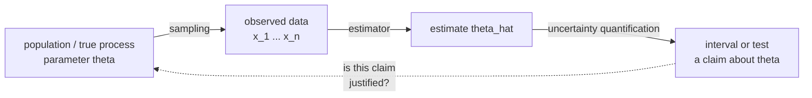

# Statistics: Turning Data Into Claims

Probability starts from a known distribution and asks what data looks like.
Statistics runs the arrow backwards: given data, what can you say about the
process that produced it? Every model comparison you make, every "our model is
better" claim, every dashboard metric with a confidence band, is an act of
statistical inference — usually an implicit one, which is exactly why it goes
wrong so often.



## Descriptive statistics, and when each summary lies

### Centre

| Statistic | Definition | Breaks when |
|---|---|---|
| Mean | $\bar{x} = \frac1n\sum x_i$ | outliers or heavy tails — one billionaire moves the average income |
| Median | 50th percentile | you need differentiability or algebraic convenience |
| Mode | most frequent value | continuous data, multimodality |
| Trimmed mean | mean of the middle $1-2\alpha$ | you need every observation to count |

Latency is the canonical case: mean latency is nearly useless because the
distribution is right-skewed. Report p50, p95, p99. The same logic applies to
per-example loss — a mean loss of 0.4 can hide a subpopulation at 3.0.

### Spread

$$s^2 = \frac{1}{n-1}\sum_{i=1}^{n}(x_i - \bar{x})^2$$

**Why $n-1$?** Because $\bar{x}$ was estimated from the same data, the deviations
$x_i - \bar{x}$ are constrained to sum to zero — only $n-1$ of them are free.
Dividing by $n$ gives a systematically small (biased) estimate; dividing by
$n-1$ makes $\mathbb{E}[s^2] = \sigma^2$. This is **Bessel's correction**, and
it is the simplest concrete example of "degrees of freedom".

Also worth knowing: the **interquartile range** $\mathrm{IQR} = Q_3 - Q_1$ and
the outlier fence $[Q_1 - 1.5\,\mathrm{IQR},\; Q_3 + 1.5\,\mathrm{IQR}]$, which
is what a boxplot's whiskers mean, and the **coefficient of variation**
$\sigma/\mu$ for comparing spread across different scales.

### Shape

- **Skewness** — third standardised moment. Positive means a long right tail
  (income, latency, word frequency).
- **Kurtosis** — fourth standardised moment. Excess kurtosis > 0 means heavier
  tails than Gaussian. Financial returns and gradient norms are famously
  leptokurtic, which is why "3-sigma events" happen weekly.

**Anscombe's quartet** and the Datasaurus dozen make the point that must be
made once and remembered forever: four datasets can share mean, variance,
correlation, and regression line while looking completely different. **Plot the
data.**

## Estimators and their properties

An **estimator** $\hat\theta$ is a function of the sample. It is itself a random
variable — run the experiment again and you get a different number. All of
inference is reasoning about that sampling distribution.

| Property | Definition | Interpretation |
|---|---|---|
| Bias | $\mathbb{E}[\hat\theta] - \theta$ | systematically off |
| Variance | $\mathrm{Var}(\hat\theta)$ | jumpy across samples |
| MSE | $\mathbb{E}[(\hat\theta-\theta)^2] = \mathrm{Bias}^2 + \mathrm{Var}$ | total error |
| Consistency | $\hat\theta \xrightarrow{p} \theta$ as $n\to\infty$ | converges eventually |
| Efficiency | attains the Cramér–Rao lower bound | lowest possible variance |

### The bias–variance decomposition, derived

For a fixed input $x$ with true value $y = f(x) + \varepsilon$,
$\mathrm{Var}(\varepsilon) = \sigma^2$, and a model $\hat f$ trained on a random
dataset:

$$\mathbb{E}\bigl[(y - \hat f(x))^2\bigr] = \underbrace{\bigl(\mathbb{E}[\hat f(x)] - f(x)\bigr)^2}_{\text{bias}^2} + \underbrace{\mathrm{Var}(\hat f(x))}_{\text{variance}} + \underbrace{\sigma^2}_{\text{irreducible}}$$

The derivation is: add and subtract $\mathbb{E}[\hat f(x)]$ inside the square,
expand, and observe the cross term has expectation zero.

This is the single most important formula in applied ML, and it is a statistics
result, not a deep-learning one. A biased estimator can beat an unbiased one on
MSE — which is the entire justification for ridge regression, for shrinkage, for
early stopping, and for using a smaller model when data is scarce.

**A modern caveat worth stating.** The classical U-shaped test-error curve is not
the whole story for overparameterised models. **Double descent** — test error
rises to a peak at the interpolation threshold (roughly, parameters ≈ samples)
and then *falls again* as capacity grows further — is real and reproducible in
both deep networks and simple linear models. The bias–variance decomposition is
still true as algebra; the assumption that variance must grow monotonically with
capacity is what fails, because implicit regularisation from the optimiser
selects low-norm interpolants.

### Maximum likelihood estimation

$$\hat\theta_{\mathrm{MLE}} = \arg\max_\theta \sum_{i=1}^n \log p(x_i \mid \theta)$$

**Worked example — the Gaussian.** With
$\log p = -\frac{n}{2}\log(2\pi\sigma^2) - \frac{1}{2\sigma^2}\sum(x_i-\mu)^2$:

$$\frac{\partial}{\partial\mu} = \frac{1}{\sigma^2}\sum(x_i-\mu) = 0 \;\Rightarrow\; \hat\mu = \bar{x}$$

$$\frac{\partial}{\partial\sigma^2} = -\frac{n}{2\sigma^2} + \frac{1}{2\sigma^4}\sum(x_i-\hat\mu)^2 = 0 \;\Rightarrow\; \hat\sigma^2 = \frac{1}{n}\sum(x_i-\bar{x})^2$$

Note the MLE variance divides by $n$ and is therefore **biased** — MLE is not
guaranteed unbiased. It *is* consistent, asymptotically normal, and
asymptotically efficient, which is why it dominates practice anyway.

The **Fisher information** $I(\theta) = -\mathbb{E}[\partial^2 \log p/\partial\theta^2]$
measures how sharply the likelihood peaks. The Cramér–Rao bound says
$\mathrm{Var}(\hat\theta) \ge 1/(nI(\theta))$: no unbiased estimator can do
better. Fisher information is also the metric used by natural gradient descent
and K-FAC, so it is not purely theoretical.

## Confidence intervals

A 95% CI is **not** "95% probability the parameter is in this interval" — under
the frequentist reading the parameter is fixed and the interval is random. It is
"a procedure that, run repeatedly, produces intervals covering the true value
95% of the time." The Bayesian object that *does* mean what people want is the
**credible interval**.

For a mean with known $\sigma$:

$$\bar{x} \pm z_{\alpha/2}\frac{\sigma}{\sqrt{n}}, \qquad z_{0.025} = 1.96$$

With $\sigma$ estimated from the data, swap $z$ for a $t$ quantile with $n-1$
degrees of freedom — the $t$ distribution has fatter tails to pay for the extra
uncertainty in $s$. For $n > 30$ the difference is negligible.

**For accuracy on a test set** (a proportion), the Wald interval
$\hat p \pm 1.96\sqrt{\hat p(1-\hat p)/n}$ is the usual one, and it is bad near
0 or 1. Prefer **Wilson** or **Clopper–Pearson** for extreme rates. A quick
worst-case rule: half-width $\le 0.98/\sqrt{n}$, so

| Test set size | Worst-case 95% half-width |
|---|---|
| 100 | ±9.8 pts |
| 1,000 | ±3.1 pts |
| 10,000 | ±1.0 pt |
| 100,000 | ±0.31 pts |

Print that table on the wall next to any leaderboard.

## Hypothesis testing

### The machinery

1. State $H_0$ (no effect) and $H_1$.
2. Choose a significance level $\alpha$, conventionally 0.05, **before** looking.
3. Compute a test statistic and its distribution under $H_0$.
4. The **p-value** is $P(\text{statistic at least this extreme} \mid H_0)$.
5. Reject $H_0$ if $p < \alpha$.

**What a p-value is not**: the probability $H_0$ is true; the probability the
result was chance; the size of the effect; evidence a result will replicate. It
is one conditional probability, conditioning on the null being true.

| | $H_0$ true | $H_0$ false |
|---|---|---|
| Reject $H_0$ | Type I error, prob. $\alpha$ | correct (power $= 1-\beta$) |
| Fail to reject | correct | Type II error, prob. $\beta$ |

Lowering $\alpha$ trades Type I for Type II errors. The only way to reduce both
is more data or a larger effect.

### Which test, when

| Situation | Test |
|---|---|
| One mean vs a constant, $\sigma$ unknown | one-sample $t$-test |
| Two independent group means | two-sample (Welch) $t$-test |
| Same subjects measured twice | paired $t$-test |
| Two proportions (conversion, click rate) | two-proportion $z$-test / chi-square |
| Categorical association | chi-square test of independence |
| 3+ group means | ANOVA, then post-hoc with correction |
| Non-normal, small $n$, ordinal | Mann–Whitney U, Wilcoxon signed-rank |
| Two ML models on the same test set | **paired** test — McNemar for classification |
| Distribution equality | Kolmogorov–Smirnov |

**McNemar's test deserves its own line** because it is the right tool for the
most common ML question and almost nobody uses it. Comparing two classifiers on
the *same* test set, build the disagreement table: $b$ = examples A got right and
B got wrong, $c$ = the reverse. Then

$$\chi^2 = \frac{(\lvert b - c\rvert - 1)^2}{b+c}$$

Examples both models get right or both get wrong carry no information about which
is better, and an unpaired test wastes exactly that structure — which is why
unpaired comparisons on shared test sets are badly underpowered.

### Statistical power and sample size

Power $= 1-\beta$ is the probability of detecting a real effect. Conventionally
you target 0.8. For a two-sample comparison of means with effect size
$d = \Delta/\sigma$:

$$n \text{ per group} \approx \frac{2(z_{\alpha/2}+z_\beta)^2}{d^2} \approx \frac{16}{d^2} \text{ for } \alpha=0.05,\ \text{power}=0.8$$

To detect a 0.1-standard-deviation effect you need about 1,600 per group. Run
this calculation *before* the experiment. An underpowered experiment that finds
nothing tells you nothing, and — worse — an underpowered experiment that *does*
find something has an inflated effect size (the winner's curse).

### Multiple comparisons

Test 20 hypotheses at $\alpha = 0.05$ with all nulls true and the probability of
at least one false positive is $1 - 0.95^{20} \approx 64\%$. This is why
hyperparameter sweeps produce "significant" improvements that vanish on a fresh
test set.

| Correction | Controls | Note |
|---|---|---|
| Bonferroni: use $\alpha/m$ | family-wise error rate | simple, very conservative |
| Holm–Bonferroni | FWER | uniformly more powerful than Bonferroni |
| Benjamini–Hochberg | false discovery rate | the right default when $m$ is large |

**p-hacking** is what happens without this discipline: trying variants, peeking
early, slicing subgroups, and reporting whatever crossed 0.05. Pre-register the
metric and the stopping rule, or use a sequential testing procedure designed for
peeking (always-valid p-values, mSPRT).

## A/B testing, end to end

The applied form of everything above. A checklist that survives contact with
production:

1. **One primary metric**, defined before launch. Guardrail metrics (latency,
   error rate, revenue) are monitored, not optimised.
2. **Randomisation unit** = the unit of independence. Randomise by user, not by
   request, or the same user lands in both arms and your independence assumption
   dies.
3. **Power analysis first.** Compute the minimum detectable effect for the
   traffic and duration you can afford. If the MDE is larger than any plausible
   effect, do not run the test.
4. **Run for full weekly cycles.** Weekday/weekend behaviour differs; stopping
   Wednesday biases the result.
5. **A/A test** the pipeline first. If an A/A test shows a significant
   difference, your assignment or logging is broken.
6. **No peeking.** Continuous monitoring with a fixed-horizon test inflates false
   positives dramatically. Use sequential methods if you must look.
7. **Check for interference.** Marketplace and social products violate SUTVA —
   the treatment of one user affects the control group. Cluster or switchback
   designs help.
8. **Novelty and primacy effects.** Early lifts often decay. Look at the trend,
   not just the total.
9. **Simpson's paradox check.** Segment the result; a positive aggregate can hide
   a negative effect in every segment when segment sizes shift.

### Simpson's paradox, concretely

| Group | Model A | Model B |
|---|---|---|
| Easy examples | 93% (900 of 970) | **95%** (190 of 200) |
| Hard examples | 60% (18 of 30) | **65%** (520 of 800) |
| **Overall** | **94.6%** (918 of 1000) | 71.0% (710 of 1000) |

B is better on *both* segments and much worse overall, because B was evaluated
mostly on hard examples. Aggregate comparisons across non-identical
distributions are meaningless. This is the same failure mode as comparing models
on different test splits, and it is why fixed benchmarks exist.

## Resampling: the bootstrap and permutation tests

When you cannot write down a sampling distribution, simulate one.

### Bootstrap

Resample $n$ points **with replacement** from your data, recompute the
statistic, repeat $B \approx 10{,}000$ times. The spread of those values
estimates the sampling distribution.

```python
import numpy as np

def bootstrap_ci(data, statistic, B=10_000, alpha=0.05, seed=0):
    rng = np.random.default_rng(seed)
    n = len(data)
    stats = np.empty(B)
    for b in range(B):
        idx = rng.integers(0, n, n)          # with replacement
        stats[b] = statistic(data[idx])
    lo, hi = np.percentile(stats, [100 * alpha / 2, 100 * (1 - alpha / 2)])
    return lo, hi

# 95% interval on test-set F1, no distributional assumption required
```

The bootstrap works for medians, correlations, AUC, F1, p95 latency — anything
with no clean closed form. It fails for extreme-order statistics (the maximum),
for very small $n$, and under strong dependence (use a block bootstrap for time
series).

For comparing two models on the same test set, **bootstrap the paired
difference**, not each score separately. Resample example indices once and
compute $\Delta = \mathrm{score}_A - \mathrm{score}_B$ on the same resample. If
the 95% interval for $\Delta$ excludes zero, the difference is real.

### Permutation tests

Under $H_0$ the group labels are exchangeable. Shuffle them thousands of times,
recompute the statistic, and see where the observed value falls in that null
distribution. Assumption-free, exact in the limit, and trivially parallel.

### Jackknife

Leave one out, recompute, repeat $n$ times. Cheaper, older, works for smooth
statistics, and its influence values are useful for spotting the single example
that is dominating your metric.

## Regression as inference

Fitting $y = X\beta + \varepsilon$ gives more than predictions. Under the
classical assumptions — linearity, independence, homoscedasticity, normal errors
— the coefficient estimates have standard errors, so you can test them.

$$\mathrm{Var}(\hat\beta) = \sigma^2 (X^\top X)^{-1}, \qquad t_j = \frac{\hat\beta_j}{\mathrm{SE}(\hat\beta_j)}$$

| Diagnostic | What it catches |
|---|---|
| Residuals vs fitted | non-linearity, heteroscedasticity (funnel shape) |
| Q-Q plot of residuals | non-normal errors, heavy tails |
| Variance inflation factor $> 5$–$10$ | multicollinearity; coefficients unstable |
| Cook's distance | single points dominating the fit |
| Durbin–Watson | autocorrelated residuals (time series) |
| $R^2$ vs adjusted $R^2$ | $R^2$ never decreases when adding features; adjusted does |

**Multicollinearity** is the one that bites in practice. If two features are
nearly collinear, $X^\top X$ is near-singular, its inverse blows up, and
coefficient estimates become enormous with opposite signs and huge standard
errors. Predictions can still be fine — it is *interpretation* that breaks. This
is a precise reason not to read feature importances off a linear model with
correlated inputs.

## Causal inference, briefly

Correlation supports prediction; causation supports intervention. The difference
matters the moment anyone acts on your model.

| Confound | Example | Fix |
|---|---|---|
| Common cause | ice cream and drowning (both caused by heat) | control for the confounder |
| Selection bias | survey only of surviving customers | model the selection process |
| Survivorship bias | reinforce the bullet holes on returning planes | ask what is missing from the sample |
| Collider bias | conditioning on a common effect | do **not** control for colliders |
| Reverse causation | "hospitals cause death" | temporal ordering, design |

Tools, in rough order of strength:

1. **Randomised controlled trial** — randomisation destroys confounding by
   construction. The gold standard; an A/B test is one.
2. **Difference-in-differences** — compare the change over time in treated vs
   untreated groups; needs the parallel-trends assumption.
3. **Instrumental variables** — find a variable affecting treatment but not the
   outcome except through treatment.
4. **Regression discontinuity** — exploit a sharp cutoff in treatment assignment.
5. **Propensity score matching / weighting** — match on estimated probability of
   treatment. Only handles *observed* confounders.

The **backdoor criterion** on a causal DAG tells you which variables to
condition on. The important negative result: adding more controls is not safer.
Conditioning on a collider *creates* bias where none existed.

## Statistics for evaluating ML systems — a practical checklist

- Report a confidence interval, not a point estimate, on every headline metric.
- Use a **paired** test when models share a test set. McNemar for accuracy,
  paired bootstrap for anything else.
- Fix seeds and report variance **across seeds** — for small models, seed
  variance often exceeds the improvement being claimed.
- Never tune on the test set. If you looked at it $k$ times, your effective
  $\alpha$ is inflated roughly $k$-fold.
- Check for distribution shift between train, validation, and test with a
  two-sample test on features or by training a classifier to distinguish the
  splits (an AUC well above 0.5 means they differ).
- Slice metrics by segment. An aggregate number can hide a subgroup regression,
  which is both a quality problem and a fairness problem.
- Prefer a nested CV or a held-out test set that is touched exactly once for the
  final number.

## Self-check

1. Explain why $s^2$ divides by $n-1$ without using the word "unbiased", then
   with it.
2. You get $p = 0.03$. Write down three statements this does *not* license.
3. Model A: 84.0% on 500 test examples. Model B: 85.2%. Which test do you run,
   and roughly how many examples would you need for a 1.2-point difference to be
   detectable?
4. Derive the bias–variance decomposition, then explain what double descent
   contradicts and what it does not.
5. Your A/B test is significant after 2 days. Give three reasons not to ship yet.
6. When is the bootstrap invalid? Name two cases and the alternatives.
7. A feature has a large, significant coefficient in a linear model. Give two
   reasons this may not mean the feature matters.

## Where to go next

- [Probability](./probability.md) — the distributions these estimators assume.
- [Machine Learning notes](../ml.md) — metrics and validation protocols built
  on this.
- [Optimization Techniques](./optimization.md) — fitting the estimators.
