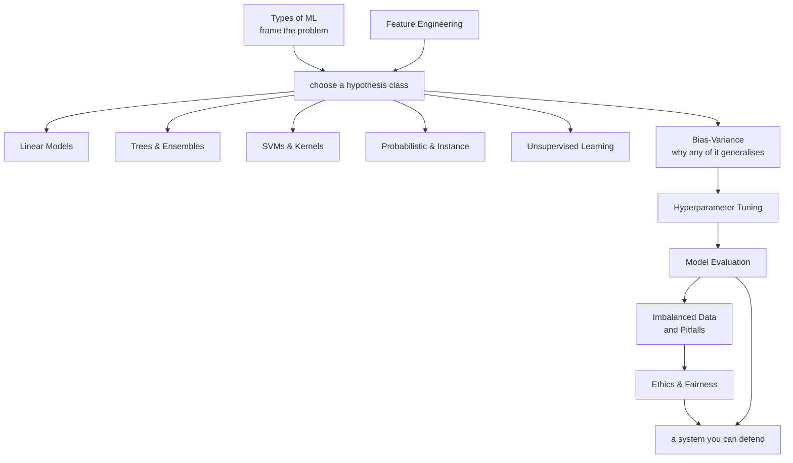

# Machine Learning

Machine learning is a small number of ideas applied repeatedly. Fit a function by
minimising a loss. Trade bias against variance. Regularise, because the data you
have is not the data you will see. Measure honestly, because the easiest person
to fool is yourself.

These twelve pages build that from the ground up: how to frame a problem, the
algorithm families and what each one assumes, why generalisation works at all,
and the long list of ways a good cross-validation score turns into a bad
production system.

## Prerequisites and outcomes

The mathematical prerequisites are [linear algebra](./math/linear-algebra.md),
[probability](./math/probability.md), [statistics](./math/statistics.md), and
[optimization](./math/optimization.md). For implementation, use the
[NumPy](./libraries/numpy.md), [pandas](./libraries/pandas.md), and
[scikit-learn](./libraries/scikit-learn.md) guides. You need matrix dimensions,
conditional probability, derivatives of a scalar loss, and Python functions;
you do not need to reimplement an estimator before applying it correctly.

By the end, you should be able to define a prediction-time information set,
choose a defensible split and baseline, explain each model's objective and
assumptions, fit it without leakage, evaluate uncertainty and decision costs,
and diagnose why an apparently strong offline result might not transfer.

## Topics

| Topic | Level | What it covers |
|---|---|---|
| [Types of ML](./ml/types-of-ml.md) | beginner | supervised, unsupervised, self-supervised, semi-supervised, RL — and how to frame a real problem |
| [Linear Models](./ml/linear-models.md) | intermediate | normal equations, MLE, ridge/lasso/elastic net, logistic regression, GLMs, diagnostics |
| [Trees & Ensembles](./ml/trees-and-ensembles.md) | intermediate | splitting criteria, pruning, bagging, random forests, boosting, stacking |
| [SVMs & Kernels](./ml/svm-and-kernels.md) | advanced | maximum margin, the dual, KKT and support vectors, soft margins, the kernel trick |
| [Probabilistic & Instance Models](./ml/probabilistic-and-instance-models.md) | intermediate | generative vs discriminative, naive Bayes, $k$-NN, LDA/QDA, Gaussian processes |
| [Unsupervised Learning](./ml/unsupervised-learning.md) | intermediate | $k$-means, hierarchical clustering, DBSCAN/HDBSCAN, GMMs and EM, PCA, t-SNE and UMAP, anomaly detection |
| [Bias–Variance & Generalization](./ml/bias-variance-and-generalization.md) | intermediate | the decomposition derived, diagnosis, regularisation, double descent, distribution shift |
| [Model Evaluation](./ml/model-evaluation.md) | intermediate | metrics, validation protocols, leakage, thresholds, calibration, significance, slicing |
| [Feature Engineering](./ml/feature-engineering.md) | intermediate | transforms, encoding, dates, aggregations, time-safe windows, selection, leakage rules |
| [Hyperparameter Tuning](./ml/hyperparameter-tuning.md) | advanced | random and Bayesian search, Hyperband, search-space design, not overfitting validation |
| [Imbalanced Data & Pitfalls](./ml/imbalanced-data-and-pitfalls.md) | intermediate | class imbalance done properly, plus the data, modelling, deployment and process pitfalls |
| [Ethics & Fairness](./ml/ethics-and-fairness.md) | intermediate | where bias enters, the fairness impossibility result, mitigation, interpretability, privacy |

## Algorithm directory

These algorithms share chapters where their assumptions and comparisons belong
together. Each entry has a complete fit/evaluate or clustering experiment in
addition to its mathematical explanation.

| Algorithm | Explanation | Complete experiment |
|---|---|---|
| Linear regression | [Least squares and likelihood](./ml/linear-models.md#linear-regression) | [Fit, predict, and compare a baseline](./ml/linear-models.md#least-squares-as-a-complete-experiment) |
| Logistic regression | [Likelihood and decision boundaries](./ml/linear-models.md#logistic-regression) | [Probabilities, loss, and decisions](./ml/linear-models.md#logistic-regression-as-a-complete-experiment) |
| Decision trees | [Splits and pruning](./ml/trees-and-ensembles.md#the-decision-tree) | [Validation-selected pruning](./ml/trees-and-ensembles.md#decision-trees-fit-predict-and-prune) |
| Random forest | [Bagging and feature subsampling](./ml/trees-and-ensembles.md#random-forests) | [OOB and held-out diagnostics](./ml/trees-and-ensembles.md#random-forest-oob-and-feature-diagnostics) |
| KNN | [Geometry and instance models](./ml/probabilistic-and-instance-models.md) | [Classification and regression](./ml/probabilistic-and-instance-models.md#knn-complete-classification-and-regression-workflows) |
| KMeans | [Clustering objectives](./ml/unsupervised-learning.md#clustering) | [Scaling, restarts, and evaluation](./ml/unsupervised-learning.md#kmeans-a-complete-clustering-experiment) |
| AdaBoost | [Weighted learners](./ml/trees-and-ensembles.md#boosting) | [Weights and classifier evaluation](./ml/trees-and-ensembles.md#adaboost-a-complete-weighted-learning-example) |
| Gradient boosting | [Additive function fitting](./ml/trees-and-ensembles.md#boosting) | [Residual steps and histogram boosting](./ml/trees-and-ensembles.md#gradient-boosting-two-iterations-and-two-implementations) |
| XGBoost | [Second-order trees](./ml/trees-and-ensembles.md#xgboost-second-order-trees-and-honest-early-stopping) | [Validation-only early stopping](./ml/trees-and-ensembles.md#xgboost-second-order-trees-and-honest-early-stopping) |
| CatBoost | [Ordered statistics and symmetric trees](./ml/trees-and-ensembles.md#catboost-categories-ordered-statistics-and-symmetric-trees) | [Mixed categorical and numeric data](./ml/trees-and-ensembles.md#catboost-categories-ordered-statistics-and-symmetric-trees) |
| Hierarchical clustering | [Linkage and dendrograms](./ml/unsupervised-learning.md#hierarchical-and-agglomerative-clustering-in-depth) | [Agglomerative clustering and distance cuts](./ml/unsupervised-learning.md#hierarchical-and-agglomerative-clustering-in-depth) |

The surrounding chapters also cover SVM/SVR, naive Bayes, LDA/QDA, Gaussian
processes, DBSCAN, mixtures, spectral methods, PCA, and anomaly detection. The
[boosting-library guide](./libraries/boosting-libraries.md) goes further into
library-specific configuration; the model chapters own the objectives and
evaluation logic.

## How they fit together



## Suggested order

1. **Types of ML** — framing first; nothing downstream fixes a wrong frame.
2. **Linear Models** — the one family you should be able to derive completely.
3. **Bias–Variance & Generalization** — the lens for everything that follows.
4. **Trees & Ensembles** — what you will actually deploy on tabular data.
5. **Model Evaluation** — read its split and metric sections before any model comparison, then return for calibration and uncertainty.
6. **Feature Engineering** — where the accuracy comes from in practice.
7. **Imbalanced Data & Pitfalls** — before your first production deployment.
8. The rest as needed: **SVMs**, **Probabilistic & Instance Models**, and
   **Unsupervised Learning** for coverage; **Hyperparameter Tuning** when you
   have compute to spend; **Ethics & Fairness** whenever a person is affected by
   the output.

## Example environment

The independent CPU experiments use Python 3.11 with NumPy 1.26.4, SciPy
1.11.4, pandas 2.1.3, scikit-learn 1.3.2, and PyTorch 2.8.0. These are a
reproduced environment, not a claim that they are the newest package releases.
The [core requirements](/assets/examples/requirements.txt) and
[optional booster requirements](/assets/examples/requirements-boosters.txt)
specify the exact versions. XGBoost 3.2.0 and CatBoost 1.2.10 are needed only
for their two dedicated examples. The shared environment also includes
Gymnasium 1.2.0 and Stable-Baselines3 2.7.0 for the DL reinforcement-learning lab.

```bash
python3.11 -m venv .venv
source .venv/bin/activate
python -m pip install -r requirements.txt
python -m pip install -r requirements-boosters.txt
python example-01.py
```

On Windows, activate with `.venv\Scripts\activate` instead. On Linux, install
the PyTorch CPU wheel before the requirements to avoid a CUDA runtime download:
`python -m pip install torch==2.8.0 --index-url https://download.pytorch.org/whl/cpu`.
See [PyTorch's version-specific installation instructions](https://pytorch.org/get-started/previous-versions/).
The experiments use generated data or datasets bundled with the installed
libraries; they do not fetch datasets or need API credentials. Fixed seeds
make comparisons repeatable within an environment, not bit-identical across
every platform. Assertions test the intended property; printed metrics can vary
slightly with numerical libraries.

## A connected capstone

Use a single decision problem to connect the twelve chapters rather than
collecting twelve unrelated leaderboard scores. For a retention problem, the
deliverables are:

1. **Framing:** define the customer snapshot, feature cutoff, outcome horizon,
   eligible population, delayed labels, and action. Prediction of churn is not
   automatically estimation of an offer's treatment effect.
2. **Data:** split by time and customer before fitting encoders or imputers.
   Record which columns could actually have existed at each prediction time.
3. **Baselines:** compare a constant predictor, regularized logistic regression,
   and a constrained tree with the same splits and metric definitions.
4. **Selection:** tune within the development period. Inspect learning curves,
   repeated-seed variability, and calibration without repeatedly opening the
   final test set.
5. **Decision:** select a threshold using held-out development probabilities,
   explicit costs or an alert budget, then evaluate that frozen rule once.
6. **Review:** report paired uncertainty, subgroup sample sizes, invalid or
   missing inputs, rollback criteria, and monitoring with delayed outcomes.

A defensible submission includes executable preprocessing, immutable split
indices, a baseline comparison, a chosen threshold and its justification,
failure slices, and a [model card](./ml/ethics-and-fairness.md). This is an
assessment specification, not a claim that a production retention system has
already been built here.

## Beyond this sequence

Causal identification, recommendation/ranking, forecasting, survival analysis,
and graph learning deserve their own full pathways. For the existing adjacent
material, continue to [deep learning](./deep-learning.md),
[NLP and retrieval](./nlp.md), [production ML](./libraries/mlops-and-serving.md),
and [deep reinforcement learning](./deep-learning/deep-rl.md).

## The short version

If you remember five things from this section:

- **Framing beats modelling.** The most expensive mistakes are made before any
  code is written.
- **Fit learned preprocessing inside the fold.** Also check feature availability,
  entity overlap, delayed labels, and repeated test-set selection.
- **The threshold is a decision rule.** A deployment-calibrated posterior and
  equal error costs imply 0.5; unequal costs or capacity constraints change it.
- **Slice your metrics.** An average is a promise about a population, not about
  a person.
- **Quantify the paired improvement over a baseline.** Uncertainty in the
  difference, and the size worth acting on, matter more than separate intervals.
