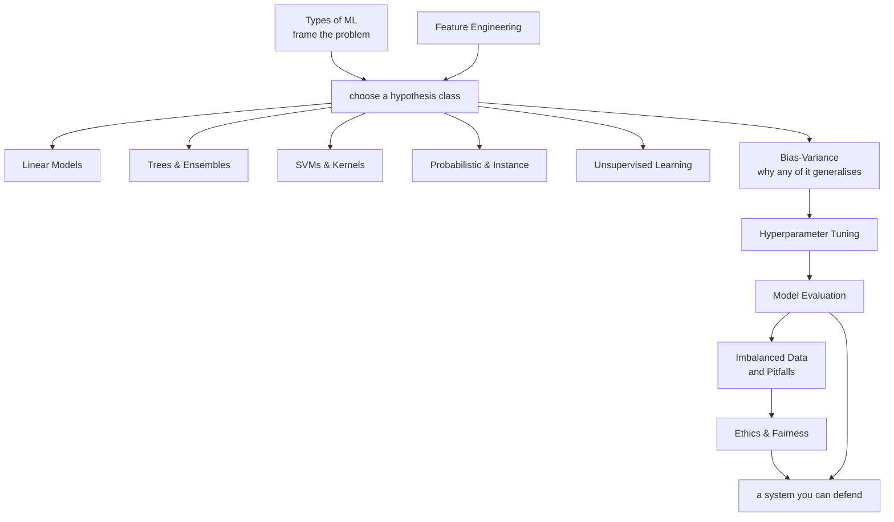

# Machine Learning

Machine learning is a small number of ideas applied repeatedly. Fit a function by
minimising a loss. Trade bias against variance. Regularise, because the data you
have is not the data you will see. Measure honestly, because the easiest person
to fool is yourself.

These twelve pages build that from the ground up: how to frame a problem, the
algorithm families and what each one assumes, why generalisation works at all,
and the long list of ways a good cross-validation score turns into a bad
production system.

## Topics

| Topic | Level | What it covers |
|---|---|---|
| [Types of ML](./ml/types-of-ml.md) | beginner | supervised, unsupervised, self-supervised, semi-supervised, RL — and how to frame a real problem |
| [Linear Models](./ml/linear-models.md) | intermediate | normal equations, MLE, ridge/lasso/elastic net, logistic regression, GLMs, diagnostics |
| [Trees & Ensembles](./ml/trees-and-ensembles.md) | intermediate | splitting criteria, pruning, bagging, random forests, boosting, stacking |
| [SVMs & Kernels](./ml/svm-and-kernels.md) | advanced | maximum margin, the dual, KKT and support vectors, soft margins, the kernel trick |
| [Probabilistic & Instance Models](./ml/probabilistic-and-instance-models.md) | intermediate | generative vs discriminative, naive Bayes, $k$-NN, LDA/QDA, Gaussian processes |
| [Unsupervised Learning](./ml/unsupervised-learning.md) | intermediate | $k$-means, DBSCAN/HDBSCAN, GMMs and EM, PCA, t-SNE and UMAP, anomaly detection |
| [Bias–Variance & Generalization](./ml/bias-variance-and-generalization.md) | intermediate | the decomposition derived, diagnosis, regularisation, double descent, distribution shift |
| [Model Evaluation](./ml/model-evaluation.md) | intermediate | metrics, validation protocols, leakage, thresholds, calibration, significance, slicing |
| [Feature Engineering](./ml/feature-engineering.md) | intermediate | transforms, encoding, dates, aggregations, time-safe windows, selection, leakage rules |
| [Hyperparameter Tuning](./ml/hyperparameter-tuning.md) | advanced | random and Bayesian search, Hyperband, search-space design, not overfitting validation |
| [Imbalanced Data & Pitfalls](./ml/imbalanced-data-and-pitfalls.md) | intermediate | class imbalance done properly, plus the data, modelling, deployment and process pitfalls |
| [Ethics & Fairness](./ml/ethics-and-fairness.md) | intermediate | where bias enters, the fairness impossibility result, mitigation, interpretability, privacy |

## How they fit together

## Suggested order

1. **Types of ML** — framing first; nothing downstream fixes a wrong frame.
2. **Linear Models** — the one family you should be able to derive completely.
3. **Bias–Variance & Generalization** — the lens for everything that follows.
4. **Trees & Ensembles** — what you will actually deploy on tabular data.
5. **Model Evaluation** — before you believe any number.
6. **Feature Engineering** — where the accuracy comes from in practice.
7. **Imbalanced Data & Pitfalls** — before your first production deployment.
8. The rest as needed: **SVMs**, **Probabilistic & Instance Models**, and
   **Unsupervised Learning** for coverage; **Hyperparameter Tuning** when you
   have compute to spend; **Ethics & Fairness** whenever a person is affected by
   the output.

## The short version

If you remember five things from this section:

- **Framing beats modelling.** The most expensive mistakes are made before any
  code is written.
- **Fit everything inside the fold.** Every leakage disaster is a transform
  fitted on data it should not have seen.
- **The threshold is a business decision.** 0.5 is almost never right.
- **Slice your metrics.** An average is a promise about a population, not about
  a person.
- **Beat a baseline by more than its confidence interval**, or you have not
  beaten it.
