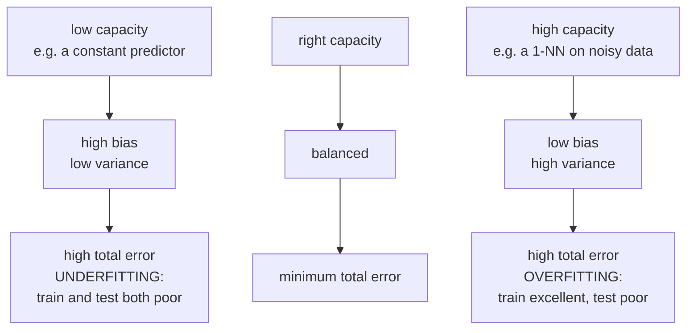
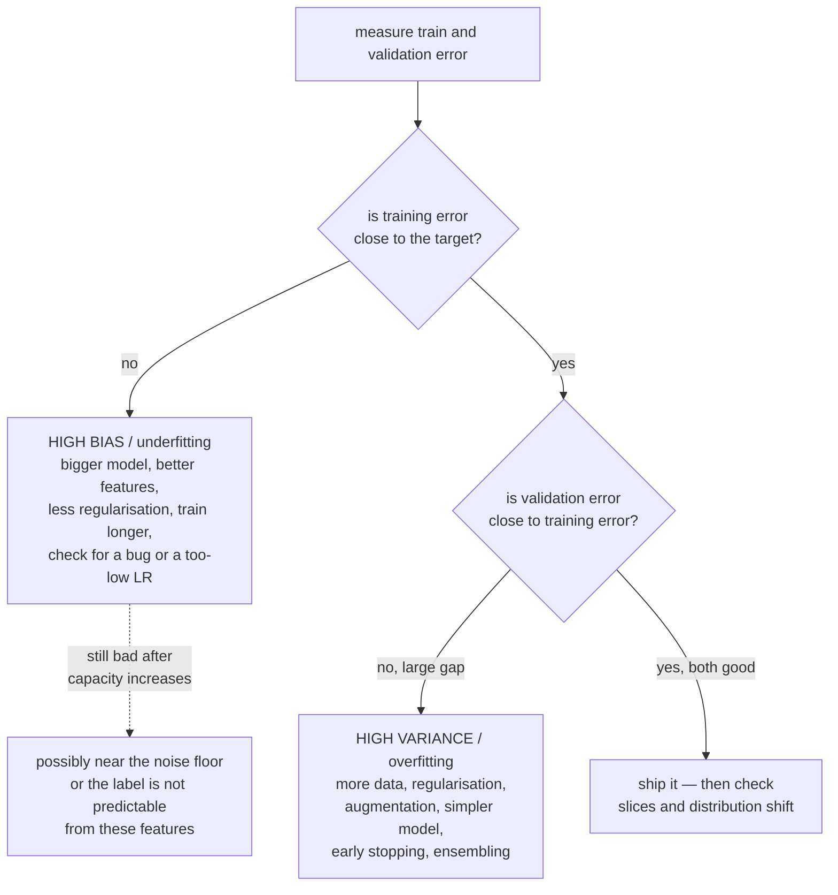
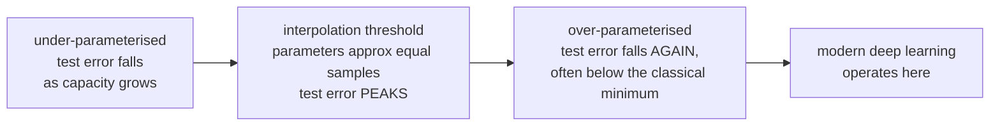

# Bias, Variance, and Generalization

Every practical question in machine learning — should I use a bigger model, do I
need more data, will regularisation help, why is my validation score worse than
my training score — is a question about generalisation. This page gives you the
decomposition that answers most of them, the honest limits of that
decomposition, and the diagnostic procedure that turns it into action.

## The problem: two objectives, only one measurable

What you want to minimise is the **true risk**:

$$R(f) = \mathbb{E}_{(x,y)\sim\mathcal{D}}\bigl[\ell(f(x), y)\bigr]$$

What you can actually minimise is the **empirical risk**:

$$\hat{R}(f) = \frac{1}{N}\sum_{i=1}^{N}\ell(f(x_i), y_i)$$

The **generalisation gap** is $R(f) - \hat{R}(f)$. Every technique in this page
is an attempt to control it, and no optimiser can close it — a better optimiser
minimises the wrong objective more thoroughly.

## The bias–variance decomposition

For squared error at a fixed input $x$, with $y = f(x) + \varepsilon$ and
$\mathrm{Var}(\varepsilon) = \sigma^2$, where $\hat{f}$ is trained on a random
dataset $D$:

$$\mathbb{E}_D\bigl[(y - \hat{f}(x))^2\bigr] = \underbrace{\bigl(\mathbb{E}_D[\hat{f}(x)] - f(x)\bigr)^2}_{\text{bias}^2} + \underbrace{\mathbb{E}_D\bigl[(\hat{f}(x)-\mathbb{E}_D[\hat{f}(x)])^2\bigr]}_{\text{variance}} + \underbrace{\sigma^2}_{\text{irreducible}}$$

**The derivation** is three lines: add and subtract $\mathbb{E}_D[\hat f(x)]$
inside the square, expand, and note that the cross term has expectation zero
because $\mathbb{E}_D[\hat f - \mathbb{E}_D[\hat f]] = 0$.

| Term | Means | Caused by |
|---|---|---|
| **Bias** | your model class systematically cannot represent the truth | too simple, wrong functional form, over-regularised |
| **Variance** | your model changes a lot with a different training sample | too flexible, too little data, unstable algorithm |
| **Irreducible** | genuine noise in $y$ given $x$ | measurement error, missing causes, inherent randomness |

The archery metaphor is standard and genuinely useful: bias is aiming at the
wrong spot, variance is a shaky hand, irreducible error is wind. You can
correct your aim and steady your hand; you cannot control the wind.

### The trade-off

Increasing model capacity reduces bias and increases variance. Classically, the
sum is U-shaped:

| Model | Bias | Variance |
|---|---|---|
| Constant predictor | maximal | zero |
| Linear regression | high | low |
| Ridge with large $\lambda$ | higher | lower |
| Polynomial degree 15 | low | very high |
| Unpruned decision tree | very low | very high |
| Random forest | low | **reduced by averaging** |
| Boosted trees (many rounds) | very low | rises with rounds |
| 1-NN | zero on training data | maximal |
| $k$-NN with large $k$ | high | low |

### Where the standard remedies act

| Technique | Reduces | Mechanism |
|---|---|---|
| More training data | variance | the estimator concentrates |
| More features / capacity | bias | richer hypothesis class |
| Regularisation | variance (raises bias) | shrinks the effective hypothesis space |
| **Bagging** | variance | averages decorrelated predictors |
| **Boosting** | bias | sequentially fits residual error |
| Early stopping | variance | limits effective capacity |
| Dropout / augmentation | variance | injects noise, prevents co-adaptation |
| Feature selection | variance | fewer parameters to estimate |
| Ensembling different model families | variance | decorrelated errors |
| Better features | bias **and** irreducible-looking error | some "noise" is just a missing feature |

That last row is the most under-appreciated. Irreducible error is only
irreducible **given the features you have**. If $y$ depends on something you did
not measure, it looks like noise. Finding that feature reduces what appeared to
be a floor.

## Diagnosing which one you have

The numeric version, with a human/target baseline for reference:

| Target | Train error | Val error | Diagnosis |
|---|---|---|---|
| 1% | 15% | 16% | high bias |
| 1% | 1% | 12% | high variance |
| 1% | 15% | 30% | both |
| 1% | 0.5% | 1% | good |
| 1% | 0.5% | 0.6% but production is 20% | distribution shift, not variance |

**Always establish a baseline error rate first** — human performance, an existing
system, or a rough estimate of label noise. Without it you cannot tell "high
bias" from "this is as good as anyone gets".

### Learning curves answer "would more data help?"

Plot training and validation error against training set size.

| Pattern | Meaning | Action |
|---|---|---|
| Both plateau at a poor level, small gap | high bias | more data will **not** help; increase capacity |
| Large gap, validation still falling | high variance | **more data will help** |
| Curves have converged with a small gap | at the limit for this model | change the model or the features |

This is the only principled way to justify a data-collection budget before
spending it.

## Regularisation, three ways to think about it

**1. As a constraint.** Minimise $\hat{R}(f)$ subject to $\Omega(f)\le t$. You
have shrunk the hypothesis space, so the best achievable fit is worse (more bias)
but the fit varies less across samples (less variance).

**2. As a prior.** MAP estimation gives
$-\log p(\mathcal{D}\mid\theta) - \log p(\theta)$; a Gaussian prior yields L2, a
Laplace prior yields L1. $\lambda$ encodes how strongly you believed, before
seeing data, that parameters are near zero.

**3. As implicit bias of the optimiser.** Even without an explicit penalty, SGD
does not choose an arbitrary interpolating solution. Gradient descent on
separable logistic regression converges to the max-margin solution; SGD prefers
flatter minima; early stopping in a linear model is approximately equivalent to
ridge. Modern overparameterised models are regularised mostly by this third
mechanism, which is why they generalise despite having capacity to memorise.

| Method | Type | Notes |
|---|---|---|
| L2 / weight decay | explicit | shrinks all weights; the default |
| L1 | explicit | sparsity, feature selection |
| Elastic net | explicit | sparsity with grouping |
| Early stopping | implicit | free; limits effective capacity |
| Dropout | implicit | approximates an ensemble of subnetworks |
| Batch/layer normalisation | implicit | smooths the loss landscape |
| Data augmentation | implicit | encodes invariances you know are true |
| Label smoothing | explicit | caps confidence, improves calibration |
| Mixup / CutMix | implicit | linear behaviour between examples |
| Noise injection | implicit | on inputs, weights, or gradients |
| Ensembling | implicit | variance reduction by averaging |
| Parameter sharing | architectural | convolution, recurrence, weight tying |
| Reduced precision | incidental | acts as gradient noise |

**Data augmentation is the strongest regulariser available** when you know a
genuine invariance. A rotated cat is still a cat, so rotation augmentation adds
real information. Rotating a digit turns 6 into 9, so it does not. Augmentation
is a way of injecting domain knowledge, and it fails exactly when the asserted
invariance is false.

## Double descent, and what it overturns

The classical U-curve is not the whole story. For modern overparameterised
models, test error:

1. Falls as capacity increases (classical regime),
2. **Rises to a peak** at the *interpolation threshold* — roughly where the model
   has just enough parameters to fit the training data exactly,
3. **Falls again**, often below the classical minimum, as capacity grows further.

**What this does not overturn**: the decomposition itself, which is an algebraic
identity and remains true.

**What it does overturn**: the assumption that variance grows monotonically with
parameter count. At the interpolation threshold there is exactly one solution
fitting the data, and it is forced to be contorted. Beyond it there are infinitely
many, and the optimiser's implicit bias selects a low-norm, smooth one. Capacity
alone is the wrong complexity measure; the relevant quantity is something like
the norm of the learned function.

There is also **epoch-wise double descent** (test error rises then falls again
with longer training) and **sample-wise non-monotonicity** (more data can
temporarily hurt, by moving you toward the interpolation threshold). Both are
reproducible and both should make you cautious about drawing conclusions from a
single point on a curve.

## Classical generalisation theory, briefly

| Framework | Says |
|---|---|
| **VC dimension** | with hypothesis class of VC dimension $h$, the gap is $O(\sqrt{h/N})$ |
| **Rademacher complexity** | data-dependent capacity; tighter than VC |
| **PAC learning** | how many samples to be $(\epsilon,\delta)$-accurate |
| **Margin bounds** | large-margin classifiers generalise regardless of dimension (the SVM's justification) |
| **PAC-Bayes** | bounds via a prior and posterior over hypotheses; currently the tightest for neural nets |
| **Stability** | an algorithm insensitive to one changed example generalises |

These are correct and, for deep networks, **vacuous**: a network with $10^8$
parameters has a VC bound predicting error above 1 even with millions of
examples. Yet it generalises. The gap between classical theory and practice here
is one of the genuine open problems in the field, and PAC-Bayes with data-
dependent priors is the most promising line.

The **no-free-lunch theorem** is the honest framing: averaged over all possible
problems, every algorithm performs identically. Learning is only possible because
real problems are not arbitrary — they have structure (smoothness, locality,
compositionality, sparsity), and a model generalises when its inductive bias
matches that structure. Convolutions work on images because images have
translation-equivariant local structure, not because convolutions are generically
good.

## Distribution shift: the failure the decomposition assumes away

The decomposition assumes train and test come from the same distribution. In
production, they do not.

| Type | Definition | Detection | Response |
|---|---|---|---|
| **Covariate shift** | $P(X)$ changes, $P(Y\mid X)$ stable | KS test, PSI, train-vs-live classifier | importance weighting, retrain |
| **Label shift** | $P(Y)$ changes, $P(X\mid Y)$ stable | monitor prediction and base rates | prior correction, recalibrate |
| **Concept drift** | $P(Y\mid X)$ changes | metric decay (needs labels) | retrain, online learning |
| **Domain shift** | a different population entirely | evaluate on the target domain | domain adaptation, fine-tune |
| **Feedback loop** | your model changes the data it later sees | compare against a randomised holdout | log propensities, keep an exploration slice |

A model with perfect bias–variance balance on a static benchmark can fail
completely under shift. This is why a held-out **temporal** test set beats a
random one for anything deployed over time, and why monitoring is part of
generalisation and not an afterthought.

## A practical procedure

1. **Establish a baseline error** — human, incumbent system, or estimated noise
   floor.
2. **Split honestly** — grouped, temporal, or stratified as the data demands.
   Touch the test set once.
3. **Train and read the two numbers.** Train error vs baseline diagnoses bias;
   the train–validation gap diagnoses variance.
4. **Attack the larger term first.** Adding regularisation to an underfit model
   makes it worse; adding capacity to an overfit model makes it worse.
5. **Plot the learning curve** before buying more data.
6. **Slice the error.** An aggregate can hide a subgroup at 3× the error rate.
   Aggregate bias–variance is not per-slice bias–variance.
7. **Re-check under shift.** Evaluate on the most recent data you have, not a
   random slice of the whole history.
8. **Report with intervals.** On 1,000 test examples the 95% half-width is about
   3 points; a 1-point improvement is noise.

## Common misconceptions

| Claim | Correction |
|---|---|
| "More parameters always overfit" | double descent; and implicit regularisation matters more than count |
| "Regularisation always helps" | it hurts an underfit model |
| "Training error tells you about quality" | it tells you about optimisation, not generalisation |
| "More data always helps" | not against bias; and it can transiently hurt near the interpolation threshold |
| "The gap between train and val is the whole story" | not under distribution shift, where both can look fine |
| "Random forests can't overfit" | more *trees* do not, but the model can with noisy labels and deep trees |
| "A validation score is an unbiased estimate" | not after you have selected on it dozens of times |
| "Irreducible error is a property of the problem" | it is a property of the problem **given your features** |
| "Deep nets generalise because of small VC dimension" | the bounds are vacuous; the explanation is implicit bias |

## Self-check

1. Derive the bias–variance decomposition and identify where independence is
   used.
2. Train error 2%, validation 3%, human baseline 1%. Which term dominates, and
   what do you do?
3. Train error 18%, validation 19%, human baseline 2%. Same questions.
4. Explain double descent and say precisely which classical claim it refutes.
5. Why does bagging reduce variance but not bias, and boosting the reverse?
6. Your model is excellent offline and poor in production with the same feature
   distributions. Which failure is it and how would you confirm?
7. Why is the no-free-lunch theorem compatible with deep learning working?

## Where to go next

- [Model Evaluation](./model-evaluation.md) — measuring these quantities without
  fooling yourself.
- [Hyperparameter Tuning](./hyperparameter-tuning.md) — searching capacity and
  regularisation jointly.
- [Trees & Ensembles](./trees-and-ensembles.md) — bagging and boosting as
  engineered answers to this decomposition.
