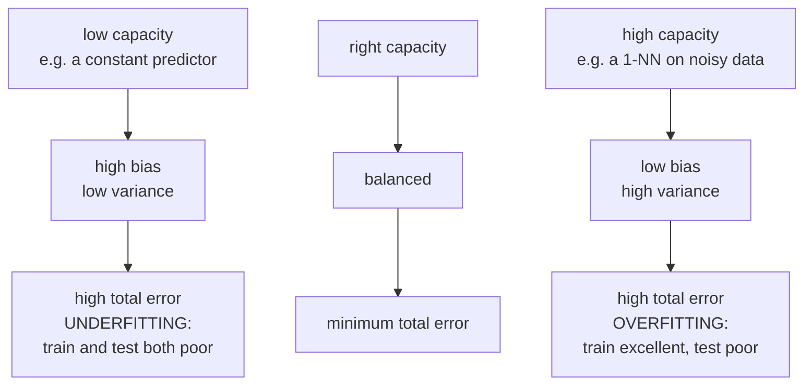
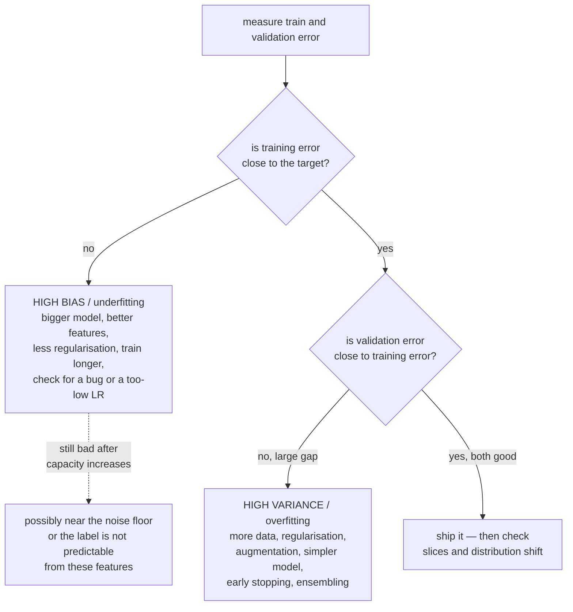
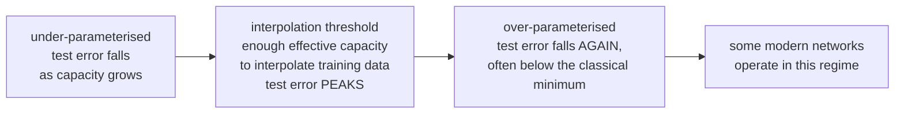

# Bias, Variance, and Generalization

Every practical question in machine learning — should I use a bigger model, do I
need more data, will regularisation help, why is my validation score worse than
my training score — is a question about generalisation. This page gives you the
decomposition that answers most of them, the honest limits of that
decomposition, and the diagnostic procedure that turns it into action.

## The problem: two objectives, only one measurable

What you want to minimise is the **true risk**:

$$R(f) = \mathbb{E}_{(x,y)\sim\mathcal{D}}\bigl[\ell(f(x), y)\bigr]$$

What you can actually minimise is the **empirical risk**:

$$\hat{R}(f) = \frac{1}{N}\sum_{i=1}^{N}\ell(f(x_i), y_i)$$

The **generalisation gap** is $R(f) - \hat{R}(f)$. Training procedures try to control both empirical fit and performance on new data. Optimization can change which solution is selected and therefore its generalization; lowering training loss alone does not determine that effect.

## The bias–variance decomposition

For squared error at fixed $x$, define $f(x)=E[Y\mid X=x]$ and write $Y=f(x)+\varepsilon$ with $E[\varepsilon\mid x]=0$ and $\operatorname{Var}(\varepsilon\mid x)=\sigma^2(x)$. Let $\hat f_D$ be trained on random data $D$, independently of the new test noise. Expectations below include both training randomness and independent test noise:

$$\mathbb{E}_{D,\varepsilon}\bigl[(Y - \hat{f}_D(x))^2\mid x\bigr] = \underbrace{\bigl(\mathbb{E}_D[\hat{f}(x)] - f(x)\bigr)^2}_{\text{bias}^2} + \underbrace{\mathbb{E}_D\bigl[(\hat{f}(x)-\mathbb{E}_D[\hat{f}(x)])^2\bigr]}_{\text{variance}} + \underbrace{\sigma^2(x)}_{\text{irreducible}}$$

**The derivation** is three lines: add and subtract $\mathbb{E}_D[\hat f(x)]$
inside the square, expand, and note that the cross term has expectation zero
because $\mathbb{E}_D[\hat f - \mathbb{E}_D[\hat f]] = 0$.

| Term | Means | Caused by |
|---|---|---|
| **Bias** | mean fitted prediction differs systematically from the conditional mean | too simple, wrong functional form, over-regularised |
| **Variance** | your model changes a lot with a different training sample | too flexible, too little data, unstable algorithm |
| **Irreducible** | genuine noise in $y$ given $x$ | measurement error, missing causes, inherent randomness |

The archery metaphor is standard and genuinely useful: bias is aiming at the
wrong spot, variance is a shaky hand, irreducible error is wind. You can
correct your aim and steady your hand; you cannot control the wind.

### The trade-off

A familiar empirical pattern is decreasing bias and increasing variance with flexibility, producing a U-shaped curve. Neither monotonicity is a general theorem; the tables and diagram describe possible regimes, not fixed attributes of algorithm names:



| Model | Bias | Variance |
|---|---|---|
| Learned sample-mean predictor | depends on how $f(x)$ varies | generally nonzero; sample mean varies across datasets |
| Linear regression | low when linear assumptions fit | depends on design, noise and sample size |
| Ridge with large $\lambda$ | higher | lower |
| Polynomial degree 15 | low | very high |
| Unpruned decision tree | very low | very high |
| Random forest | low | **reduced by averaging** |
| Boosted trees (many rounds) | can decrease with added stages | can increase or decrease depending on regularization |
| 1-NN | training interpolation is not zero statistical bias | often sensitive to sampling and noise |
| $k$-NN with large $k$ | high | low |

### Where the standard remedies act

| Technique | Reduces | Mechanism |
|---|---|---|
| More training data | variance | the estimator concentrates |
| More features / capacity | bias | richer hypothesis class |
| Regularisation | variance (raises bias) | shrinks the effective hypothesis space |
| **Bagging** | variance | averages decorrelated predictors |
| **Boosting** | often bias, sometimes variance too | sequential correction changes both approximation and stability |
| Early stopping | variance | limits effective capacity |
| Dropout / augmentation | variance | injects noise, prevents co-adaptation |
| Feature selection | variance | fewer parameters to estimate |
| Ensembling different model families | variance | decorrelated errors |
| Better features | bias **and** irreducible-looking error | some "noise" is just a missing feature |

That last row is the most under-appreciated. Irreducible error is only
irreducible **given the features you have**. If $y$ depends on something you did
not measure, it looks like noise. Finding that feature reduces what appeared to
be a floor.

## Diagnosing which one you have



The numeric version, with a human/target baseline for reference:

| Target | Train error | Val error | Diagnosis |
|---|---|---|---|
| 1% | 15% | 16% | high bias |
| 1% | 1% | 12% | high variance |
| 1% | 15% | 30% | both |
| 1% | 0.5% | 1% | good |
| 1% | 0.5% | 0.6% but production is 20% | distribution shift, not variance |

**Always establish a baseline error rate first** — human performance, an existing
system, or a rough estimate of label noise. Without it you cannot tell "high
bias" from "this is as good as anyone gets".

### Learning curves answer "would more data help?"

Plot training and validation error against training set size.

| Pattern | Meaning | Action |
|---|---|---|
| Both plateau poorly with small gap | possible approximation/optimization limit | test features, capacity and optimization; further data may or may not help |
| Large gap, validation still falling | sampling sensitivity is plausible | additional representative data is worth testing |
| Curves have converged with a small gap | at the limit for this model | change the model or the features |

Learning curves inform data collection, alongside label audits, coverage gaps, uncertainty, causal identification and acquisition costs.

## Regularisation, three ways to think about it

**1. As a constraint.** Minimise $\hat{R}(f)$ subject to $\Omega(f)\le t$. You
have shrunk the hypothesis space, so the minimum training loss cannot improve under exact optimization. This can increase statistical bias and often reduces sampling variance, but neither change is universal for every estimator and data distribution.

**2. As a prior.** MAP estimation gives
$-\log p(\mathcal{D}\mid\theta) - \log p(\theta)$; a Gaussian prior yields L2, a
Laplace prior yields L1. $\lambda$ encodes how strongly you believed, before
seeing data, that parameters are near zero.

**3. As implicit bias of the optimiser.** Even without an explicit penalty, SGD
does not choose an arbitrary interpolating solution. For unregularized logistic regression on linearly separable data under suitable gradient-descent conditions, the weight norm diverges while its direction approaches a maximum-margin direction. Claims about SGD preferring flat minima depend on parameterization and dynamics. Early stopping has ridge-like spectral filtering, not a universal one-to-one equivalence. Implicit bias is one contributor to generalization, not a complete explanation of every overparameterized model.

| Method | Type | Notes |
|---|---|---|
| L2 / weight decay | explicit | shrinks all weights; the default |
| L1 | explicit | sparsity, feature selection |
| Elastic net | explicit | sparsity with grouping |
| Early stopping | implicit | free; limits effective capacity |
| Dropout | implicit | approximates an ensemble of subnetworks |
| Batch/layer normalisation | architectural | changes optimization; batch-statistic noise can regularize, but layer normalization has no such batch noise |
| Data augmentation | implicit | encodes invariances you know are true |
| Label smoothing | explicit | changes target probabilities; calibration effects require evaluation |
| Mixup / CutMix | implicit | linear behaviour between examples |
| Noise injection | implicit | on inputs, weights, or gradients |
| Ensembling | implicit | variance reduction by averaging |
| Parameter sharing | architectural | convolution, recurrence, weight tying |
| Reduced precision | incidental | introduces rounding error; it is not a dependable regularization strategy |

**Data augmentation encodes a useful inductive bias** when a proposed transformation preserves the task target. A rotated cat is still a cat, so rotation augmentation imposes that structural assumption without creating independent observations. Rotating a digit turns 6 into 9, so it does not. Augmentation
is a way of injecting domain knowledge, and it fails exactly when the asserted
invariance is false.

## Double descent, and what it overturns

The classical U-curve is not the whole story. In some model/data/training families, test error:

1. Falls as capacity increases (classical regime),
2. **Rises to a peak** at the *interpolation threshold* — roughly where the model
   has just enough parameters to fit the training data exactly,
3. **Falls again**, often below the classical minimum, as capacity grows further.



**What this does not overturn**: the decomposition itself, which is an algebraic
identity and remains true.

**What it does overturn**: the assumption that variance grows monotonically with
parameter count. A square full-rank linear system has a unique interpolating coefficient vector, while an underdetermined full-row-rank system has many. Nonlinear networks, rank-deficient designs and constrained models need not follow that uniqueness story. Near-singular directions can amplify noise around interpolation; beyond it, an explicitly chosen minimum-norm rule can have lower variance in particular regimes. Capacity
alone is the wrong complexity measure; the relevant quantity is something like
the norm of the learned function.

There is also **epoch-wise double descent** (test error rises then falls again
with longer training) and **sample-wise non-monotonicity** (more data can
temporarily hurt, by moving you toward the interpolation threshold). Both are
reproducible and both should make you cautious about drawing conclusions from a
single point on a curve.

## Classical generalisation theory, briefly

| Framework | Says |
|---|---|
| **VC dimension** | with hypothesis class of VC dimension $h$, the gap is $O(\sqrt{h/N})$ |
| **Rademacher complexity** | distribution/sample-sensitive class complexity; not uniformly tighter in every setting |
| **PAC learning** | how many samples to be $(\epsilon,\delta)$-accurate |
| **Margin bounds** | control involving margin, input norm and sample size, sometimes avoiding explicit ambient dimension |
| **PAC-Bayes** | bounds using a valid prior/posterior construction and complexity divergence |
| **Stability** | an algorithm insensitive to one changed example generalises |

Crude parameter-count bounds can be vacuous for large networks, but it is false that every bound in these families is vacuous. Stability, norm/margin and PAC-Bayes analyses can provide informative results under particular conditions. A data-dependent prior needs an appropriate construction or correction; inspecting training data and calling the result a fixed prior invalidates the simplest theorem.

The **no-free-lunch theorem** is the honest framing: under particular uniform averages over finite problem classes, no learner is uniformly favored. The averaging assumptions matter. Learning is only possible because
real problems are not arbitrary — they have structure (smoothness, locality,
compositionality, sparsity), and a model generalises when its inductive bias
matches that structure. Convolutions work on images because images have
translation-equivariant local structure, not because convolutions are generically
good.

## Distribution shift: the failure the decomposition assumes away

The squared-loss identity can still be written relative to a chosen test distribution even when training differs. What fails under shift is the inference that a source-domain validation decomposition describes deployment. Changes in the target conditional mean or in which inputs receive weight alter the relevant risk.

| Type | Definition | Detection | Response |
|---|---|---|---|
| **Covariate shift** | $P(X)$ changes, $P(Y\mid X)$ stable | KS test, PSI, train-vs-live classifier | importance weighting, retrain |
| **Label shift** | $P(Y)$ changes, $P(X\mid Y)$ stable | monitor prediction and base rates | prior correction, recalibrate |
| **Concept drift** | $P(Y\mid X)$ changes | metric decay (needs labels) | retrain, online learning |
| **Domain shift** | a different population entirely | evaluate on the target domain | domain adaptation, fine-tune |
| **Feedback loop** | your model changes the data it later sees | compare against a randomised holdout | log propensities, keep an exploration slice |

A model with perfect bias–variance balance on a static benchmark can fail
completely under shift. This is why a held-out **temporal** test is often essential when deployment means predicting later periods, and why monitoring is part of
generalisation and not an afterthought.

## A practical procedure

1. **Establish a baseline error** — human, incumbent system, or estimated noise
   floor.
2. **Split honestly** — grouped, temporal, or stratified as the data demands.
   Touch the test set once.
3. **Inspect training and validation together.** They suggest approximation, optimization or sampling problems but do not identify bias and variance uniquely from one fit.
4. **Test the most plausible bottleneck.** Capacity, regularization and optimization interact; change them in controlled comparisons rather than treating one diagnosis as certain.
5. **Plot the learning curve** before buying more data.
6. **Slice the error.** An aggregate can hide a subgroup at 3× the error rate.
   Aggregate bias–variance is not per-slice bias–variance.
7. **Re-check under shift.** Evaluate on the most recent data you have, not a
   random slice of the whole history.
8. **Report paired uncertainty.** A worst-case marginal accuracy interval on 1,000 examples has roughly a three-point half-width, but uncertainty in the difference depends on paired disagreements. A one-point difference is not automatically noise.

## Common misconceptions

| Claim | Correction |
|---|---|
| "More parameters always overfit" | double descent; and implicit regularisation matters more than count |
| "Regularisation always helps" | excessive regularization can add harmful bias; validate the penalty and its optimization effects |
| "Training error tells you about quality" | it tells you about optimisation, not generalisation |
| "More data always helps" | it need not remove approximation error, and can transiently hurt near an interpolation threshold |
| "The gap between train and val is the whole story" | not under distribution shift, where both can look fine |
| "Random forests cannot overfit" | averaging approaches a limiting ensemble; that limit can still generalize poorly |
| "A validation score is an unbiased estimate" | not after you have selected on it dozens of times |
| "Irreducible error is a property of the problem" | it is a property of the problem **given your features** |
| "Deep nets generalize because of small VC dimension" | raw class capacity alone is often uninformative; several data- and algorithm-dependent explanations matter |

## Deriving the decomposition carefully

Write $m(x)=E_D[\hat f_D(x)]$. At fixed $x$:

$$Y-\hat f_D=(f-m)+(m-\hat f_D)+\varepsilon.$$

Squaring yields three squares and three cross terms. The first cross term
vanishes because $E_D[m-\hat f_D]=0$. The terms involving test noise vanish
because its conditional mean is zero and it is independent of the fitted
predictor given the fixed test input. Thus

$$E_{D,\varepsilon}[(Y-\hat f_D)^2\mid x]
=(f-m)^2+E_D[(\hat f_D-m)^2]+\sigma^2(x).$$

The training randomness can include sampling, optimizer seeds and random feature
construction if those are part of the procedure being evaluated. Holding a
dataset fixed and varying only initialization estimates a different, narrower
variance component than repeatedly collecting training datasets.

Integrating over a target input distribution gives integrated squared bias,
variance and noise. A single train/test split does not reveal these components
separately because the true $f(x)$ is usually unknown. Synthetic repeated-fit
experiments are valuable precisely because the data-generating function is known.
For zero-one classification loss, this additive squared-error identity does not
apply unchanged; do not read a classification-error gap as a numerical estimate
of the displayed squared-loss variance.

### Approximation, estimation, and optimization

Approximation error is the best target risk achievable within the chosen class
relative to a richer reference. Estimation concerns learning from finitely many
observations. Optimization concerns failing to find the intended fitted solution.
They are related to, but not identical with, prediction bias and variance.
A highly expressive class can have biased fitted predictions because of strong
regularization or an early-stopped optimizer. A simple correctly specified class
can have low bias but high variance under an ill-conditioned design.

A small train-validation gap with poor scores can mean underfitting, but also
high label noise, distribution mismatch shared by both splits, an inappropriate
metric or insufficient optimization. A large gap can arise from variance, from
preprocessing differences or from a shifted validation population. Diagnostics
become stronger when several controlled interventions agree, not merely when
one pair of losses fits a familiar table row.

### Ridge makes the tradeoff explicit

For fixed design $X$, let $y=X\beta+\varepsilon$ with independent zero-mean
noise covariance $\sigma^2I$. Ridge without an intercept term minimizes
$\|y-Xb\|^2+\lambda\|b\|^2$ and has

$$\hat\beta_\lambda=(X^\top X+\lambda I)^{-1}X^\top y.$$

Let $A=(X^\top X+\lambda I)^{-1}$. Then

$$E[\hat\beta_\lambda]-\beta=-\lambda A\beta,\qquad
\operatorname{Cov}(\hat\beta_\lambda)=\sigma^2AX^\top XA.$$

For a test vector $x$, prediction bias is $-\lambda x^\top A\beta$ and
variance is $\sigma^2x^\top AX^\top XAx$. These depend on the direction being
predicted, not just parameter count. If $X^\top X$ has eigenvalues $s_i^2$,
the coefficient-variance factor in direction $i$ is
$\sigma^2s_i^2/(s_i^2+\lambda)^2$. Small singular values are especially
noise-sensitive without regularization.

For $X^\top X=\operatorname{diag}(1,100)$, $\beta=(1,1)$ and $\lambda=1$,
mean coefficients become $(0.5,100/101)$. With unit noise variance,
coefficient variances are $(1/4,100/10201)$. Shrinkage strongly biases the weak
first direction but also reduces its variance from one to one-quarter. Whether
that improves prediction depends on the test distribution and true signal.

Effective degrees of freedom for fitted values are
$\operatorname{tr}[X(X^\top X+\lambda I)^{-1}X^\top]
=\sum_i s_i^2/(s_i^2+\lambda)$. This is often more informative than counting
all stored coefficients. Handle an unpenalized intercept separately, and use
stable solvers rather than explicitly forming inverses in an implementation.
See [linear models](./linear-models.md) and [linear algebra](../math/linear-algebra.md).

## Experiment: estimate bias and variance across training datasets

This library-led experiment repeatedly fits polynomial ridge models to noisy
samples of a known sine function. Every model sees the same set of training
replicates. It verifies the finite-ensemble algebra and compares simulated noisy
test error with bias squared plus variance plus the known noise level.

```python runnable
import numpy as np
from sklearn.linear_model import Ridge
from sklearn.pipeline import make_pipeline
from sklearn.preprocessing import PolynomialFeatures
from threadpoolctl import threadpool_limits

rng = np.random.default_rng(111)
grid = np.linspace(-1, 1, 151)[:, None]
truth = np.sin(np.pi * grid[:, 0])
noise_std = 0.25
training_sets = []
for repetition in range(100):
    x = rng.uniform(-1, 1, size=(40, 1))
    y = np.sin(np.pi * x[:, 0]) + rng.normal(0, noise_std, size=40)
    training_sets.append((x, y))
with threadpool_limits(limits=1):
    for degree, penalty in ((1, 1e-8), (3, 1e-8), (12, 0.1)):
        predictions = []
        for x, y in training_sets:
            model = make_pipeline(PolynomialFeatures(degree, include_bias=False),
                                  Ridge(alpha=penalty, solver="svd"))
            model.fit(x, y)
            predictions.append(model.predict(grid))
        predictions = np.asarray(predictions)
        mean_prediction = predictions.mean(axis=0)
        bias_squared = np.mean((mean_prediction - truth) ** 2)
        variance = predictions.var(axis=0, ddof=0).mean()
        noiseless_error = np.mean((predictions - truth) ** 2)
        np.testing.assert_allclose(noiseless_error, bias_squared + variance, atol=1e-12)
        observed = truth + rng.normal(0, noise_std, size=predictions.shape)
        noisy_error = np.mean((predictions - observed) ** 2)
        predicted_risk = bias_squared + variance + noise_std ** 2
        assert abs(noisy_error - predicted_risk) < 0.015
        print("degree/penalty", degree, penalty, "bias^2", round(bias_squared, 4),
              "variance", round(variance, 4), "noise", noise_std ** 2,
              "measured risk", round(noisy_error, 4))
```

Use `ddof=0` for the displayed finite-ensemble identity: the same empirical mean
defines both terms. An unbiased sample-variance estimate with `ddof=1` answers
a population-estimation question and does not satisfy this exact finite-sample
sum without adjustment. Plotting each predictor as a faint curve with the mean
and truth overlaid exposes systematic misspecification versus sample sensitivity.

### Bagging is about covariance too

If $M$ predictors have common variance $v$ and pairwise correlation $\rho$, the
variance of their average is

$$\operatorname{Var}(\bar f)=v\left(\rho+\frac{1-\rho}{M}\right).$$

At $v=4$, $\rho=0.25$, and $M=10$, variance is $1.3$, not $0.4$.
Correlated error sets a floor. For a fixed collection of identically distributed
estimators, averaging preserves their common expectation. Bagging itself changes
the training procedure through bootstrap samples and can change bias relative
to one fit on the original sample. Boosting can change both bias and variance;
neither algorithm is restricted to one term by definition.

## A bounded generalization argument

For a finite hypothesis class of size $M$, independent samples and loss in
$[0,1]$, Hoeffding's inequality gives
$P(|R(f)-\hat R(f)|>\epsilon)\le2e^{-2n\epsilon^2}$ for a fixed $f$.
A union bound over the class gives probability at most
$2M e^{-2n\epsilon^2}$ that any member violates the bound. Hence with
probability at least $1-\delta$:

$$\sup_{f\in\mathcal F}|R(f)-\hat R(f)|
\le\sqrt{\frac{\log(2M/\delta)}{2n}}.$$

Uniformity is why the statement can cover selecting a model after inspecting
training data. For $M=100,n=1000,\delta=0.05$, the upper bound is about
$0.0644$. It can be loose; it is a worst-case guarantee under its assumptions,
not a prediction that the observed gap must be six points. Unbounded log loss
needs other conditions, clipping or a different concentration argument.

VC and Rademacher theory extend the complexity reasoning beyond finite lists.
Stability studies the learning algorithm's sensitivity to changing examples.
PAC-Bayes concerns a distribution over predictors and a carefully specified
prior. These frameworks answer different questions; an informal ranking of which
is universally tightest obscures the assumptions that make a bound valid.

## Experiment: interpolation is a regime, not a universal law

This minimum-norm linear example adds irrelevant Gaussian features to a fixed
five-dimensional signal. Near $p=n$, unstable directions can amplify noise.
For $p\ge n$, the least-squares solution interpolates training labels, while
its held-out error still varies substantially. The experiment reports median
error across replicated designs rather than pretending a single run is a theorem.

```python runnable
import numpy as np
from threadpoolctl import threadpool_limits

rng = np.random.default_rng(112)
dimensions = [5, 15, 30, 39, 40, 41, 60, 100]
errors = {p: [] for p in dimensions}
training_errors = {p: [] for p in dimensions}
beta = np.array([1.0, -0.8, 0.6, 0.4, -0.2])
with threadpool_limits(limits=1):
    for repetition in range(30):
        X = rng.normal(size=(40, 100))
        y = X[:, :5] @ beta + rng.normal(scale=0.3, size=40)
        test_X = rng.normal(size=(250, 100))
        test_mean = test_X[:, :5] @ beta
        for p in dimensions:
            coefficient = np.linalg.lstsq(X[:, :p], y, rcond=None)[0]
            training_mse = np.mean((X[:, :p] @ coefficient - y) ** 2)
            test_mse = np.mean((test_X[:, :p] @ coefficient - test_mean) ** 2)
            assert np.isfinite(test_mse)
            if p >= 40:
                assert training_mse < 1e-12
            training_errors[p].append(training_mse)
            errors[p].append(test_mse)
for p in dimensions:
    print("features", p, "median training MSE", np.median(training_errors[p]),
          "median noiseless-test MSE", np.median(errors[p]))
assert np.median(errors[40]) > np.median(errors[5])
```

The held-out target is the conditional mean, so adding fresh observation noise
would add its variance to expected risk. In this construction the first five
features already contain all signal: a second descent need not beat that useful
small model. Changing feature scaling, ridge penalty, signal structure or solution
selection changes the curve. Interpolation does not automatically imply a unique
solution or a smooth function in nonlinear models.

### Transporting risk under covariate shift

If the target and source share $P(Y\mid X)$ and target support lies within
source support, then

$$R_{target}(f)=E_{source}\left[
\frac{p_{target}(X)}{p_{source}(X)}\ell(f(X),Y)\right].$$

The density ratio changes which source examples count most. Large weights can
make the estimate extremely variable; absent source support cannot be repaired
by finite weights. A common diagnostic is effective sample size
$(\sum_iw_i)^2/\sum_iw_i^2$, not a new count of truly independent observations.
If $P(Y\mid X)$ changes, this covariate-shift formula no longer identifies
target risk. Monitor outcomes, not only input histograms.

## Self-check

1. **Where does independence enter?** Independent mean-zero test noise makes
   $E[\varepsilon(m-\hat f_D)]=0$. Centering the fitted predictor removes its
   cross term with deterministic bias. Both expectations are required for the
   bias-squared plus variance plus noise identity.
2. **Train 2%, validation 3%, baseline 1%: what dominates?** One fit does not
   identify the decomposition. Both approximation/optimization and sampling
   could matter. Check uncertainty, label quality and learning curves before
   choosing capacity or regularization changes.
3. **Train 18%, validation 19%, baseline 2%?** A fitting or representation limit
   is plausible, but the baseline may use different information. Verify targets,
   optimization and comparable inputs, then test richer features/capacity.
4. **What does double descent refute?** Universal monotonic variance growth with
   parameter count, not the squared-loss decomposition. Its occurrence depends
   on the design, signal, noise and interpolation rule.
5. **Can bagging change bias or boosting change variance?** Yes. Averaging a fixed
   identically distributed collection preserves its mean, but bootstrap training
   changes the estimator. Boosting changes the whole fitted procedure and can
   affect both components.
6. **Same input marginals, worse deployment outcomes?** Conditional shift is one
   possibility, but label/pipeline changes and selection effects also matter.
   Obtain mature outcomes, check conditional/slice metrics and audit data contracts.
7. **Why no conflict with no-free-lunch?** Real tasks are not uniformly arbitrary
   labelings. Structural assumptions can help on that task distribution while
   hurting elsewhere; no one method is preferred under every problem average.
8. **Can a learned constant have variance?** Yes. The sample mean changes across
   datasets; under independent homoscedastic observations its variance is
   $\sigma^2/n$. A fixed predetermined constant has zero training-sample variance.
9. **Is a one-point paired gain on 1,000 examples impossible to establish?** No.
   The relevant uncertainty depends on the disagreement pattern and sampling
   design, not solely on either model's marginal worst-case accuracy interval.
10. **When is importance weighting invalid?** When target support is absent from
    source, conditional labels change, or the ratio estimate is wrong. Large
    finite weights can also make a formally valid estimator too noisy to use.

## Where to go next

- [Model Evaluation](./model-evaluation.md) — measuring these quantities without
  fooling yourself.
- [Hyperparameter Tuning](./hyperparameter-tuning.md) — searching capacity and
  regularisation jointly.
- [Trees & Ensembles](./trees-and-ensembles.md) — bagging and boosting as
  engineered answers to this decomposition.

Primary reading: [Elements of Statistical Learning](https://hastie.su.domains/ElemStatLearn/),
[double descent](https://arxiv.org/abs/1812.11118), and
[implicit bias of gradient descent](https://arxiv.org/abs/1710.10345).
See [statistics](../math/statistics.md) for uncertainty and
[optimization](../math/optimization.md) for the distinction between stationary
solutions, convergence and regularization.
