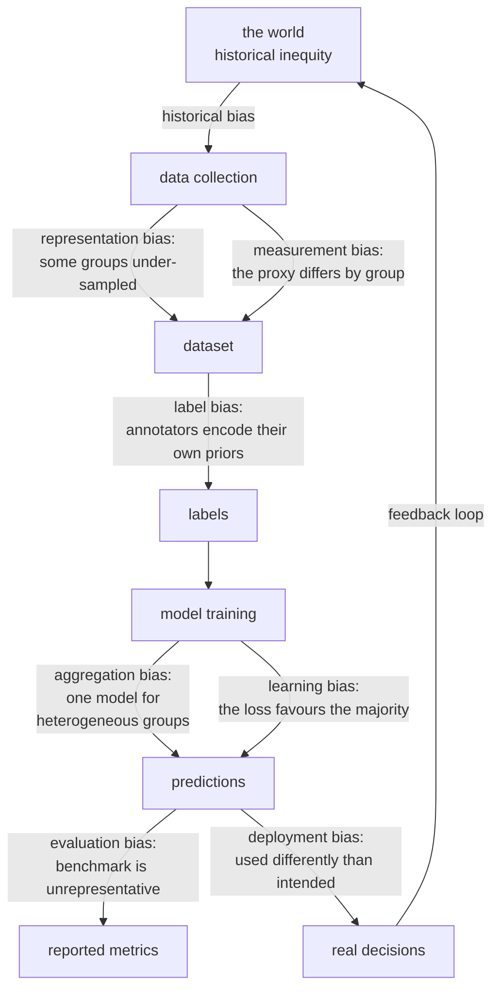

# Ethics, Fairness, and Interpretability

A model that decides who gets a loan, a job interview, bail, or a medical
referral is making a consequential decision about a person. This page treats
that as an engineering problem with real techniques and real trade-offs — not as
a compliance appendix — because the failures are concrete, well documented, and
mostly preventable.

## Where bias enters

Bias is not one thing that appears in one place. It enters at every stage, and
each entry point has a different fix.



| Source | Concrete example |
|---|---|
| **Historical** | past hiring favoured one group; the labels record that, and the model learns it |
| **Representation** | facial recognition trained mostly on light-skinned faces |
| **Measurement** | using arrests as a proxy for crime, where policing intensity varies by area |
| **Label** | annotators rate the same content differently by dialect |
| **Aggregation** | one diabetes model across ethnicities where HbA1c means different things |
| **Learning** | the loss is dominated by the majority group |
| **Evaluation** | the benchmark under-represents a group, so the failure is invisible |
| **Deployment** | a risk score built for triage used as a sentencing input |

**Measurement bias is the subtlest and the most damaging.** The classic case: a
healthcare algorithm used *healthcare spending* as a proxy for *health need*.
Because less money was historically spent on Black patients at the same level of
illness, the model systematically under-referred them — while being an accurate
predictor of the variable it was actually trained on. The model was right; the
proxy was wrong.

**Removing the protected attribute does not remove the bias.** Postcode encodes
race. First name encodes gender and ethnicity. Purchase history encodes almost
everything. "Fairness through unawareness" fails because of these proxies, and
it also removes your ability to *measure* disparity — which is why many fairness
approaches deliberately keep the attribute for evaluation while excluding it from
the model.

## Fairness definitions

There is no single definition, and the differences are not academic — they
prescribe different models.

| Definition | Requires | Reading |
|---|---|---|
| **Demographic parity** | $P(\hat{Y}=1\mid A=a)$ equal | equal selection rates across groups |
| **Equal opportunity** | $P(\hat{Y}=1\mid Y=1, A=a)$ equal | equal **recall** for qualified individuals |
| **Equalised odds** | equal TPR **and** FPR | equal error rates both ways |
| **Predictive parity** | $P(Y=1\mid \hat{Y}=1, A=a)$ equal | equal **precision**; a score means the same thing |
| **Calibration within groups** | $P(Y=1\mid \hat{p}=p, A=a) = p$ | a 0.7 means 0.7 for everyone |
| **Individual fairness** | similar individuals get similar outcomes | requires a similarity metric — which is the hard part |
| **Counterfactual fairness** | the decision is unchanged if $A$ were different | requires a causal model |

### The impossibility result

**You cannot satisfy calibration, equal false-positive rates, and equal
false-negative rates simultaneously** when base rates differ across groups and
the classifier is imperfect. This is a theorem (Kleinberg–Mullainathan–Raghavan;
Chouldechova), not a limitation of current methods.

The arithmetic is forced. If group A has a 30% base rate and group B 10%, then a
calibrated score must produce different error-rate profiles for the two groups.
Equalising the error rates requires abandoning calibration — which means the same
score means different things depending on group membership.

This was exactly the COMPAS dispute: ProPublica showed unequal false-positive
rates by race; Northpointe showed the score was calibrated by race. **Both were
correct.** They were measuring different, mutually incompatible fairness
criteria, and no model could have satisfied both given the different base rates.

**The consequence for practice**: you must choose which definition matters for
your application, justify the choice in terms of the harm you are trying to
prevent, and document it. There is no technical escape.

| Context | Usually the right criterion |
|---|---|
| Hiring, admissions, lending access | equal opportunity — do not miss qualified people |
| Criminal risk, medical diagnosis | equalised odds — both error types cause harm |
| Resource allocation from a score | calibration — the score must mean one thing |
| Legal disparate-impact scrutiny | demographic parity (the four-fifths rule) |
| Individual recourse and appeals | individual/counterfactual fairness |

## Measuring disparity

```python
from fairlearn.metrics import MetricFrame, demographic_parity_difference, equalized_odds_difference

mf = MetricFrame(
    metrics={"accuracy": accuracy_score, "recall": recall_score,
             "precision": precision_score, "selection_rate": lambda y, p: p.mean(),
             "fpr": false_positive_rate},
    y_true=y_test, y_pred=y_pred, sensitive_features=A_test,
)
print(mf.by_group)
print(mf.difference(method="between_groups"))
print(equalized_odds_difference(y_test, y_pred, sensitive_features=A_test))
```

| Measure | Definition | Threshold in common use |
|---|---|---|
| Disparate impact ratio | $\frac{\text{selection rate}_{\min}}{\text{selection rate}_{\max}}$ | the **four-fifths rule**: below 0.8 triggers scrutiny in US employment law |
| Statistical parity difference | difference in selection rates | 0 is parity |
| Equal opportunity difference | difference in TPR | 0 is parity |
| Average odds difference | mean of TPR and FPR differences | 0 is parity |

Always report **per-group sample sizes** alongside the metrics. A 20-point recall
gap measured on 40 examples may be noise; compute intervals before acting on it.
And evaluate **intersections**, not just single attributes — a model can be fair
by gender and by race while failing badly for one intersection of the two.

## Mitigation

| Stage | Technique | Trade-off |
|---|---|---|
| **Pre-processing** | reweighting, resampling, learned fair representations, relabelling | model-agnostic; may be legally awkward to alter data |
| **In-processing** | fairness constraints, adversarial debiasing, exponentiated gradient reduction | usually the most effective; needs training-time access |
| **Post-processing** | group-specific thresholds, calibrated equalised odds | simple, works on a black box; **explicitly uses the protected attribute at decision time**, which may be illegal |

```python
from fairlearn.reductions import ExponentiatedGradient, EqualizedOdds

mitigated = ExponentiatedGradient(LGBMClassifier(), constraints=EqualizedOdds(), eps=0.02)
mitigated.fit(X_train, y_train, sensitive_features=A_train)
```

**Group-specific thresholds are the most effective and most legally fraught
technique.** Setting a different cut-off per group directly equalises the chosen
error rate, but in many jurisdictions using a protected attribute in the decision
is itself unlawful, regardless of intent. Check with counsel before implementing
it.

**Fairness usually costs accuracy** — often a small amount, sometimes not. Plot
the fairness–accuracy frontier and make the trade explicit rather than
discovering it after launch.

**And technical mitigation is not always the answer.** If the labels themselves
encode discrimination, a fairer model trained on them is still learning
discrimination. Sometimes the right conclusion is that the problem is
mis-specified, the label is wrong, or the system should not be automated.

## Interpretability

| Method | Scope | Model | Note |
|---|---|---|---|
| Linear coefficients | global | linear only | with confidence intervals; unreliable under collinearity |
| Tree structure | global | trees | readable only when shallow |
| **Permutation importance** | global | any | honest about generalisation; misleads under correlation |
| **Partial dependence / ICE** | global | any | PDP averages away interactions; ICE shows the spread |
| **SHAP** | local + global | any (fast exact for trees) | additive, theoretically grounded in Shapley values |
| **LIME** | local | any | fits a local surrogate; unstable across runs |
| Counterfactuals | local | any | "what minimal change flips the decision?" — the most actionable form |
| Anchors | local | any | high-precision rules that pin the prediction |
| Attention weights | local | transformers | **not a reliable explanation** — attention is not attribution |
| Integrated gradients | local | differentiable | axiomatically grounded gradient attribution |
| Concept activation (TCAV) | global | deep nets | tests whether a human concept influences the output |

**SHAP is the practical default** for tabular models: TreeSHAP is exact and fast
for tree ensembles, the values are additive (base value plus one contribution per
feature equals the prediction), and it works locally and globally from the same
computation.

**Counterfactual explanations are the most useful for the person affected.** "You
would have been approved with £3,000 more annual income" is actionable in a way
that "income had a SHAP value of −0.4" is not, and it is close to what
right-to-explanation regulations actually require.

Three cautions that matter:

- **Interpretation is not causation.** SHAP tells you what the *model* used, not
  what causes the outcome. A model can rely on a proxy, and the explanation will
  faithfully report the proxy.
- **Explanations can be manipulated.** Published attacks construct models that
  behave discriminatorily while producing innocuous LIME/SHAP explanations.
- **Attention is not explanation.** This has been shown repeatedly: attention
  weights can be substantially altered without changing the prediction.

**Consider an inherently interpretable model instead.** For high-stakes
decisions, a scorecard from logistic regression, a short rule list, or an
Explainable Boosting Machine (a GAM with pairwise interactions) is often within a
point of a black box while being directly auditable. The argument that accuracy
requires opacity is much weaker on tabular data than it is usually assumed to
be.

## Privacy

| Risk | Description | Mitigation |
|---|---|---|
| **Memorisation** | the model reproduces training examples verbatim | deduplicate, differential privacy, output filtering |
| **Membership inference** | an attacker determines whether a record was in the training set | DP-SGD, regularisation, limiting query access |
| **Model inversion** | reconstructing inputs from the model | limit access, add noise |
| **Attribute inference** | inferring a sensitive attribute from other predictions | audit what the model reveals |
| **Re-identification** | "anonymised" data linked back to people | $k$-anonymity is weak; prefer DP |

**Differential privacy** is the rigorous framework. A mechanism is
$(\epsilon,\delta)$-differentially private if its output distribution barely
changes when any single record is added or removed:

$$P[\mathcal{M}(D)\in S] \le e^{\epsilon}\,P[\mathcal{M}(D')\in S] + \delta$$

DP-SGD achieves it by clipping per-example gradients and adding calibrated
Gaussian noise. It costs accuracy — sometimes a lot — and the cost falls hardest
on under-represented groups, whose signal is closest to the noise floor. That is
a real and under-discussed **privacy–fairness tension**.

**Federated learning** trains across devices without centralising raw data. It
reduces exposure but is not private on its own — gradients leak information, and
reconstruction attacks on federated gradients are well demonstrated. Combine it
with secure aggregation and DP.

## Regulation, briefly

| Framework | Applies to | Key requirement |
|---|---|---|
| **EU AI Act** | risk-tiered, extraterritorial | high-risk systems need risk management, data governance, logging, human oversight, and conformity assessment; unacceptable-risk uses are banned |
| **GDPR Art. 22** | automated decisions with legal effect | a right to human review and meaningful information about the logic |
| **US ECOA / Reg B** | credit | adverse action notices must state specific principal reasons |
| **Title VII / EEOC** | employment | disparate impact; the four-fifths rule |
| **NYC Local Law 144** | automated hiring tools | annual independent bias audit, published |
| **HIPAA** | US health data | de-identification and access controls |
| **NIST AI RMF** | voluntary, widely referenced | govern, map, measure, manage |

None of this is legal advice, and details change. The engineering implication is
stable, though: **build for auditability from the start** — versioned data,
versioned models, recorded evaluations including per-group metrics, documented
decisions, and the ability to explain an individual decision after the fact.
Retrofitting that is far more expensive than building it in.

## Documentation

| Artefact | Records |
|---|---|
| **Model card** | intended use, out-of-scope uses, training data, evaluation results **disaggregated by group**, limitations, ethical considerations |
| **Datasheet for a dataset** | motivation, composition, collection process, preprocessing, recommended uses, distribution, maintenance |
| **System card** | the whole system: model, guardrails, human oversight, monitoring |
| **Impact assessment** | who is affected, what harms are plausible, what mitigations exist |

The single most valuable section of a model card is **out-of-scope uses**. Most
harm comes from deploying a model in a context it was never evaluated for — a
triage score used for sentencing, a research demo used in production, a model
trained on one population applied to another.

## A review checklist

**Before building**
- Should this be automated at all? What is the cost of the worst error?
- Who is affected, and can they contest a decision?
- Is the label a good proxy for what you actually care about?

**Data**
- Who is represented, and who is missing?
- Who produced the labels, and what were their incentives?
- Are there proxies for protected attributes? (There are.)
- Does consent cover this use?

**Model**
- Metrics disaggregated by group, including intersections, with sample sizes.
- Which fairness criterion applies, and why that one?
- Is calibration equivalent across groups?
- Is there an interpretable alternative within a point of the black box?

**Deployment**
- Are humans genuinely in the loop, or rubber-stamping?
- Is there an appeals process, and can it actually change an outcome?
- Is per-group performance monitored, not just the aggregate?
- Is there a feedback loop that will amplify the current bias?
- What is the rollback plan?

**Ongoing**
- Scheduled fairness re-audits, not just accuracy monitoring.
- A documented incident process for harm reports.
- Sunset criteria: under what conditions is this retired?

## Self-check

1. Explain why removing the protected attribute does not make a model fair, and
   what it also costs you.
2. State the impossibility result and explain, with base rates, why it is forced.
3. Both sides of the COMPAS dispute were right. Which criterion was each
   measuring?
4. Give the healthcare-spending proxy example and name the bias type.
5. Which fairness criterion fits a hiring screen, and why?
6. Why is attention not an explanation?
7. Name the tension between differential privacy and fairness.

## Where to go next

- [Model Evaluation](./model-evaluation.md) — the slicing discipline this
  depends on.
- [Imbalanced Data & Pitfalls](./imbalanced-data-and-pitfalls.md) — feedback
  loops and deployment failures.
- [Types of ML](./types-of-ml.md) — framing, including when prediction is the
  wrong tool.
