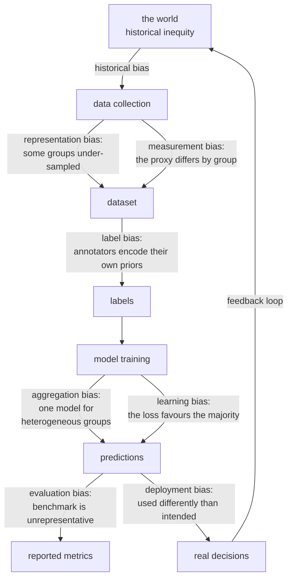

# Ethics, Fairness, and Interpretability

A model that decides who gets a loan, a job interview, bail, or a medical
referral is making a consequential decision about a person. This page treats
that as a sociotechnical problem: measurable engineering properties interact with
contested objectives, institutional choices, and people's rights. Metrics can
expose failures and test mitigations; they cannot decide which harms are acceptable
or certify a system as fair in every sense.

## Where bias enters

Bias is not one thing that appears in one place. It enters at every stage, and
each entry point has a different fix.



| Source | Concrete example |
|---|---|
| **Historical** | past hiring favoured one group; the labels record that, and the model learns it |
| **Representation** | facial recognition trained mostly on light-skinned faces |
| **Measurement** | using arrests as a proxy for crime, where policing intensity varies by area |
| **Label** | annotators rate the same content differently by dialect |
| **Aggregation** | one demand model averages together regions with different seasonal patterns |
| **Learning** | the loss is dominated by the majority group |
| **Evaluation** | the benchmark under-represents a group, so the failure is invisible |
| **Deployment** | a risk score built for triage used as a sentencing input |

**Measurement bias can survive excellent predictive performance.** A documented case: a
healthcare algorithm used *healthcare spending* as a proxy for *health need*.
Because less money was historically spent on Black patients at the same level of
illness, the model systematically under-referred them — while being an accurate
predictor of the variable it was actually trained on. The model was right; the
proxy was wrong for the intended allocation purpose.
[Obermeyer and colleagues' study](https://escholarship.org/uc/item/6h92v832)
examines this mismatch between cost prediction and health need. This is a lesson
about target construction, not a clinical recommendation.

**Removing the protected attribute does not remove the bias.** Postcode encodes
aspects of geography and social patterns that can correlate with protected
attributes; other features can do the same. Excluding an attribute from prediction
does not remove those dependencies. Deleting it from every controlled evaluation
dataset can also prevent direct disparity measurement. Its collection, access,
retention, and permissible use require a separate governance decision; keeping it
for auditing does not imply permission to use it in individual decisions.

Ask what the label actually observes. Loan repayment is usually known only for
approved applicants; job performance only for people hired. A model evaluated on
those selected cases may be accurate for the historical policy's chosen population
and unvalidated for everyone rejected. This is selective-label bias, not simply
class imbalance. Additional data collection or a justified causal design may be
needed; relabeling all rejected applicants as negatives manufactures evidence.

Feedback can also change future data. A system that sends more inspections to one
neighborhood records more discovered violations there, even without a difference
in underlying violation prevalence. Subsequent training can learn inspection
intensity instead of need. Record both actions and outcomes, and distinguish an
unobserved outcome from an observed negative.

## Fairness definitions

There is no single definition, and the differences are not academic — they
prescribe different models.

| Definition | Requires | Reading |
|---|---|---|
| **Demographic parity** | $P(\hat{Y}=1\mid A=a)$ equal | equal selection rates across groups |
| **Equal opportunity** | $P(\hat{Y}=1\mid Y=1, A=a)$ equal | equal recall among observed positives; whether the label means qualification needs justification |
| **Equalised odds** | equal TPR **and** FPR | equal error rates both ways |
| **Predictive parity** | $P(Y=1\mid \hat{Y}=1, A=a)$ equal | equal precision among selected observations |
| **Calibration within groups** | $P(Y=1\mid \hat{p}=p, A=a) = p$ | a 0.7 means 0.7 for everyone |
| **Individual fairness** | similar individuals get similar outcomes | requires a similarity metric — which is the hard part |
| **Counterfactual fairness** | an appropriate prediction distribution is invariant under a counterfactual intervention on $A$ | requires a specified causal model and assumptions about descendants |

### The impossibility result

State which objects the theorem concerns: a real-valued score, a thresholded
decision, or a class-conditional average. These are not interchangeable.

For binary decisions with common TPR $t$ and FPR $f$ across groups, Bayes' rule gives

$$\mathrm{PPV}_a=\frac{\pi_a t}{\pi_a t+(1-\pi_a)f},\qquad
\pi_a=P(Y=1\mid A=a).$$

If $t>0$, $f>0$, and base rates differ inside $(0,1)$, these precisions differ.
For $t=0.8,f=0.2$, base rates $0.3$ and $0.1$ produce PPVs
$0.24/0.38\approx0.632$ and $0.08/0.26\approx0.308$. Thus nondegenerate equalized
odds and predictive parity conflict. The exceptions matter: if $f=0$ and $t>0$,
both precisions are one even with false negatives; if nobody is selected, precision
is undefined, not evidence of parity. This arithmetic is central to
[Chouldechova's analysis](https://arxiv.org/abs/1610.07524).

A different score-level result concerns calibration plus equal mean score among
positives and equal mean score among negatives. Let these common class-conditional
means be $u$ and $v$. Calibration implies
$\pi_a=\mathbb E[S\mid A=a]=\pi_a u+(1-\pi_a)v$. With different base rates,
these equations force $u=1,v=0$, corresponding to perfect scores under the stated
conditions. These are score-balance conditions, not equality of error rates at
one arbitrarily chosen threshold. See
[Kleinberg, Mullainathan, and Raghavan](https://arxiv.org/abs/1609.05807).

A calibrated score can have different precision after thresholding because
$P(Y=1\mid S\ge c,A)=\mathbb E[S\mid S\ge c,A]$, and the selected score
distribution can differ by group. Conversely, one threshold's equalized error
rates say little about calibration over the full score range.

The COMPAS debate illustrates why reported criteria, cohort definitions, outcome
windows, and threshold choices must be examined separately. Do not reduce it to
"both sides proved the same dataset fair and unfair" or claim that calibration
alone rules out equal threshold error rates. The practical task is to specify
which harm a criterion measures, its assumptions, and what it leaves unmeasured.

| Context | Questions for choosing criteria, not automatic prescriptions |
|---|---|
| Access to opportunities | Is the observed label a defensible qualification measure? Who is missed and why? |
| Risk prediction | What harms follow false positives and false negatives, and who bears them? |
| Resource allocation | Does score calibration match expected need, and does the allocation policy meet its objective? |
| Disparate-impact review | Which legally relevant procedure, comparison population, and evidence apply? |
| Recourse and appeals | Can people obtain a feasible correction or contest an invalid input? |

## Measuring disparity

Define the positive decision, observed outcome, unit of analysis, population, and
time window before computing rates. In a benefit allocation task, selection may
be beneficial; in an investigation task, it may impose a burden. The same matrix
entries do not represent the same harm in both settings.

| Measure | Definition | Threshold in common use |
|---|---|---|
| Selection-rate ratio | $\frac{\text{selection rate}_{\min}}{\text{selection rate}_{\max}}$ | undefined if both are zero; legal interpretation is context-specific |
| Statistical parity difference | difference in selection rates | 0 is parity |
| Equal opportunity difference | difference in TPR | 0 is parity |
| Average odds difference | signed mean of TPR and FPR differences | zero can hide cancellation; also report each gap |

Always report **per-group sample sizes** alongside the metrics. A 20-point recall
gap measured on 40 examples may be noise; compute intervals before acting on it.
And evaluate **intersections**, not just single attributes — a model can be fair
by gender and by race while failing badly for one intersection of the two.

### Runnable lab: counts, undefined metrics, and incompatible criteria

The fixture makes the earlier Bayes calculation tangible. Group C has no observed
positives and no selected observations. Reporting its recall and precision as zero
would turn missing evidence into an apparent measured result. `labels=[0,1]`
keeps the confusion-matrix shape stable when a class is absent.

```python runnable
import numpy as np
from sklearn.metrics import confusion_matrix

def observations(tn, fp, fn, tp):
    truth = np.array([0] * (tn + fp) + [1] * (fn + tp))
    pred = np.array([0] * tn + [1] * fp + [0] * fn + [1] * tp)
    return truth, pred

def safe_ratio(numerator, denominator):
    return numerator / denominator if denominator else np.nan

def report(truth, pred):
    tn, fp, fn, tp = confusion_matrix(truth, pred, labels=[0, 1]).ravel()
    return {"n": len(truth), "positives": int(tp + fn), "selected": int(tp + fp),
        "tpr": safe_ratio(tp, tp + fn), "fpr": safe_ratio(fp, fp + tn),
        "ppv": safe_ratio(tp, tp + fp), "selection": safe_ratio(tp + fp, len(truth))}

groups = {"A": observations(56, 14, 6, 24),
          "B": observations(72, 18, 2, 8), "C": observations(4, 0, 0, 0)}
metrics = {name: report(*data) for name, data in groups.items()}
assert np.isclose(metrics["A"]["tpr"], metrics["B"]["tpr"])
assert np.isclose(metrics["A"]["fpr"], metrics["B"]["fpr"])
assert not np.isclose(metrics["A"]["ppv"], metrics["B"]["ppv"])
assert np.isnan(metrics["C"]["tpr"]) and np.isnan(metrics["C"]["ppv"])
assert metrics["C"]["fpr"] == 0.0
for name, values in metrics.items():
    print(name, values)

def wilson(successes, total, z=1.96):
    if total == 0:
        return (np.nan, np.nan)
    rate = successes / total
    denominator = 1.0 + z * z / total
    center = (rate + z * z / (2 * total)) / denominator
    half = z * np.sqrt(rate * (1 - rate) / total + z * z / (4 * total**2)) / denominator
    return center - half, center + half

small = wilson(8, 10)
large = wilson(80, 100)
assert small[1] - small[0] > large[1] - large[0]
assert 0 <= small[0] < 0.8 < small[1] <= 1
print("Recall 8/10 interval", small, "80/100 interval", large)
```

Wilson intervals here assume independent Bernoulli observations for one rate.
Repeated decisions for one person violate that independence; use an appropriate
cluster-aware design. An interval for a rate is not automatically an interval for
a rate difference. Intersectional exploration introduces multiple comparisons and
small denominators. Report discovered slices as exploratory until independently
validated, without suppressing a credible harm simply because a subgroup is small.

## Mitigation

| Stage | Technique | Trade-off |
|---|---|---|
| **Pre-processing** | reweighting, resampling, learned fair representations, relabelling | changes evidence or representation; preserve label meaning and justify the intervention |
| **In-processing** | fairness constraints, adversarial debiasing, exponentiated gradient reduction | changes optimization; requires compatible estimators and feasible constraints |
| **Post-processing** | group-specific thresholds, randomized decision rules | can work with fixed scores; may require group attributes at decision time and separate legal review |

A constrained training formulation is
$\min_\theta\widehat L(\theta)$ subject to $\widehat g_j(\theta)\le\epsilon_j$.
Lagrange multipliers can emphasize violated constraints, and reductions can turn
the problem into a sequence of cost-sensitive classification fits. Empirical
constraint satisfaction is not a population guarantee. A randomized mixture of
classifiers is also a different serving artifact from one deterministic model;
record the randomization and its evaluation protocol.

Group-specific deterministic thresholds do not generally achieve every pair of
equal TPR and FPR. Their achievable points lie on group ROC curves; randomization
may reach convex combinations between operating points. The available decision
rules, group information, operational feasibility, and applicable restrictions
must be specified before optimization. There is no universally most effective
mitigation.

Improving data or correcting a mislabeled objective can improve both utility and
disparity. Within a fixed score model and feasible policy family, a constraint may
reduce the maximum achievable utility. Plot that empirical frontier, including
uncertainty and the actual error costs, rather than assuming every fairness change
has a fixed accuracy price.

### Runnable lab: choose a policy on validation, then audit it on test

This is a synthetic mathematical experiment, not a recommended decision policy.
Scores are calibrated by construction because labels are Bernoulli draws with
those probabilities. Group score distributions differ. A finite threshold grid
chooses a validation cost minimum under a validation equalized-odds-gap constraint.
The untouched test reports both quantities without assuming the constraint transfers.

```python runnable
import itertools
import numpy as np
from sklearn.metrics import confusion_matrix

rng = np.random.default_rng(10)
n = 2400
group = np.tile(np.array([0, 1]), n // 2)
score = np.where(group == 0, rng.beta(3, 3, n), rng.beta(2, 5, n))
y = rng.binomial(1, score)
order = rng.permutation(n)
validation, test = order[:1200], order[1200:]

def evaluate(indices, thresholds):
    prediction = (score[indices] >= np.asarray(thresholds)[group[indices]]).astype(int)
    rates = []
    cost = 0
    for g in [0, 1]:
        mask = group[indices] == g
        tn, fp, fn, tp = confusion_matrix(y[indices][mask], prediction[mask], labels=[0, 1]).ravel()
        assert tp + fn > 0 and fp + tn > 0
        rates.append((tp / (tp + fn), fp / (fp + tn)))
        cost += fp + 2 * fn
    gap = np.max(np.abs(np.asarray(rates[0]) - np.asarray(rates[1])))
    return float(cost / len(indices)), float(gap)

grid = list(itertools.product(np.linspace(0, 1, 11), repeat=2))
records = [(thresholds, *evaluate(validation, thresholds)) for thresholds in grid]
feasible = [row for row in records if row[2] <= 0.10]
assert feasible, "Always-positive and always-negative policies should be feasible here"
chosen = min(feasible, key=lambda row: (row[1], row[2], row[0]))
frontier = [row for row in records if not any(
    other[1] <= row[1] and other[2] <= row[2] and
    (other[1] < row[1] or other[2] < row[2]) for other in records)]
test_cost, test_gap = evaluate(test, chosen[0])
assert chosen[2] <= 0.10
assert len(frontier) > 0 and np.isfinite([test_cost, test_gap]).all()
print("thresholds", chosen[0], "validation cost/gap", chosen[1:])
print("test cost/gap", (test_cost, test_gap), "frontier points", len(frontier))
```

The lab's false-negative cost of two is an explicit hypothetical value judgment.
Changing it changes the selected policy. Searching many thresholds also overfits
the validation sample, so larger applications need suitable nested development,
uncertainty checks, and new-cohort evaluation. A feasible all-negative policy may
have equalized odds while providing nobody a benefit; metric satisfaction alone
does not establish a useful or acceptable system.

**And technical mitigation is not always the answer.** If the labels themselves
encode discrimination, a fairer model trained on them is still learning
discrimination. Sometimes the right conclusion is that the problem is
mis-specified, the label is wrong, or the system should not be automated.

## Interpretability

| Method | Scope | Model | Note |
|---|---|---|---|
| Linear coefficients | global | linear only | with confidence intervals; unreliable under collinearity |
| Tree structure | global | trees | readable only when shallow |
| **Permutation importance** | global | any | honest about generalisation; misleads under correlation |
| **Partial dependence / ICE** | global | any | PDP averages away interactions; ICE shows the spread |
| **SHAP** | local + global | estimator-specific implementations | additive allocations relative to a specified value function and background |
| **LIME** | local | any | fits a local surrogate; unstable across runs |
| Counterfactuals | local | any | "what minimal change flips the decision?" — the most actionable form |
| Anchors | local | any | high-precision rules that pin the prediction |
| Attention weights | local | transformers | **not a reliable explanation** — attention is not attribution |
| Integrated gradients | local | differentiable | axiomatically grounded gradient attribution |
| Concept activation (TCAV) | global | deep nets | tests whether a human concept influences the output |

SHAP explanations have the form $f(x)=\phi_0+\sum_j\phi_j$ for the selected
output and explanation definition. Output units matter: additive log-odds are not
additive probability changes. Tree-specific algorithms can compute particular
Shapley formulations efficiently, but "exact" refers to the chosen mathematical
game, not the true causal effect of a feature. Background population and treatment
of dependent features change the question being answered.

Counterfactual explanations ask what changes would alter a model's decision.
They are actionable only if those changes are feasible, available to the person,
and stable under a future decision policy. "Increase income" is not automatically
an achievable intervention, and editing income while holding every downstream
variable fixed may describe no possible person. Immutable attributes, costs,
causal dependencies, and uncertainty should constrain the search. A counterfactual
model explanation does not guarantee an outcome in the world or satisfy a legal
disclosure requirement by itself.

For a simple dependence example, suppose $X_2=X_1$ in observed data. Both models
$f_1(x)=x_1$ and $f_2(x)=x_2$ predict identically there, yet coefficient and
interventional attribution stories differ. Partial dependence varies one coordinate
while holding the other fixed, creating unsupported points where $x_1\ne x_2$.
Check data support before interpreting the resulting curve. Conditional approaches
ask a different question; neither automatically identifies causality.

Three cautions that matter:

- **Interpretation is not causation.** SHAP tells you what the *model* used, not
  what causes the outcome. A model can rely on a proxy, and the explanation will
  faithfully report the proxy.
- **Explanations can be manipulated.** Published attacks construct models that
  behave discriminatorily while producing innocuous LIME/SHAP explanations.
- **Attention is not explanation.** This has been shown repeatedly: attention
  weights can be substantially altered without changing the prediction.

**Consider an inherently interpretable model instead.** For high-stakes
decisions, compare logistic scorecards, short rule lists, or additive models with
more complex alternatives under the same protocol. There is no universal one-point
performance gap. A transparent model can still use biased labels or invalid
features; interpretability improves inspectability, not automatic legitimacy.

## Privacy

| Risk | Description | Mitigation |
|---|---|---|
| **Memorisation** | the model reproduces training examples verbatim | deduplicate, differential privacy, output filtering |
| **Membership inference** | an attacker determines whether a record was in the training set | DP-SGD, regularisation, limiting query access |
| **Model inversion** | reconstructing inputs from the model | limit access, add noise |
| **Attribute inference** | inferring a sensitive attribute from other predictions | audit what the model reveals |
| **Re-identification** | "anonymised" data linked back to people | $k$-anonymity is weak; prefer DP |

**Differential privacy** is the rigorous framework. A mechanism is
$(\epsilon,\delta)$-differentially private if, for every allowed neighboring pair
of datasets and every measurable output event, it satisfies:

$$P[\mathcal{M}(D)\in S] \le e^{\epsilon}\,P[\mathcal{M}(D')\in S] + \delta$$

The neighbor relation must be stated: adding one record, replacing one record,
or adding all records associated with one person gives different guarantees.
$\epsilon$ bounds a multiplicative change and $\delta$ permits an additive
relaxation; neither is simply an individual's probability of being exposed.
Larger values generally mean a weaker guarantee. Differential privacy limits the
additional information from participation, not facts already inferable from
population patterns.

DP-SGD clips per-example gradients and adds calibrated Gaussian noise, with a
privacy accountant tracking sampling and repeated steps. For clipped gradient
sums, add/remove-one sensitivity is at most $C$, while replacement can change the
sum by up to $2C$. Averaging and sampling conventions then affect noise calibration.
Adding arbitrary noise to ordinary batch gradients is not sufficient to claim DP.
Use a vetted privacy library and report the neighbor unit, clipping bound, sampling
scheme, number of steps, noise multiplier, accountant, and final privacy budget.

Basic composition adds the component $\epsilon$ and $\delta$ values; tighter
accountants can improve the bound. Releasing many privately trained candidates or
privately selected metrics consumes budget too. Postprocessing a DP output without
new private-data access preserves its guarantee, but appending a raw training
example obviously does not. See
[Dwork and Roth's foundations text](https://www.microsoft.com/en-us/research/publication/algorithmic-foundations-differential-privacy/)
for the formal definitions and composition framework.

Noise and clipping can affect groups unequally, especially where evidence is
scarce or gradient norms differ. This is a possible privacy-utility-fairness
tension, not a theorem that every private learner necessarily harms every minority
group. Measure per-group changes under a stated privacy budget.

**Federated learning** trains across devices without centralising raw data. It
reduces exposure but is not private on its own — gradients leak information, and
reconstruction attacks on federated gradients are well demonstrated. Combine it
with secure aggregation and DP.

## Regulation, briefly

The sources below were checked on September 7, 2026. They are a review map, not
legal advice or a complete statement of obligations. Consult current consolidated
texts and qualified reviewers for the actual jurisdiction, role, use, and date.

| Framework and primary source | Scope question to resolve |
|---|---|
| [EU AI Act](https://eur-lex.europa.eu/eli/reg/2024/1689/oj/eng) | Which system classification, provider/deployer role, territorial scope, and application dates apply? |
| [GDPR](https://eur-lex.europa.eu/eli/reg/2016/679/oj/eng) | Does Article 22's solely automated, legally or similarly significant decision scope apply, including its exceptions? Review Articles 13-15 separately for information duties. |
| [ECOA / Regulation B](https://www.consumerfinance.gov/rules-policy/regulations/1002/9/) | Which credit-notification and specific-reason requirements apply to the action and creditor? |
| [EEOC Uniform Guidelines](https://www.eeoc.gov/laws/guidance/questions-and-answers-clarify-and-provide-common-interpretation-uniform-guidelines) | What selection procedure, relevant groups, sample sizes, and validation evidence belong in an employment review? |
| [NYC Local Law 144](https://www.nyc.gov/site/dca/about/automated-employment-decision-tools.page) | Is the tool within the AEDT definition and covered use, and what audit, publication, and notice requirements follow? |
| [HIPAA](https://www.hhs.gov/hipaa/for-professionals/covered-entities/index.html) | Is the organization a covered entity or business associate, and what protected information and activity are involved? Not all health-related data falls under HIPAA. |
| [NIST AI RMF](https://www.nist.gov/itl/ai-risk-management-framework) | How can the voluntary Govern, Map, Measure, and Manage functions structure risk management? This is not itself a legal compliance certificate. |

The four-fifths selection-rate comparison is not a universal fairness theorem or
a safe harbor. The EEOC guidance discusses statistical and contextual limitations;
ratios above or below 0.8 do not independently settle legal conclusions. Likewise,
having a person nominally approve a model output does not by itself resolve every
automated-decision issue. Engineering documentation supports review; it does not
replace interpretation of the applicable rules.

None of this is legal advice, and details change. The engineering implication is
stable, though: **build for auditability from the start** — versioned data,
versioned models, recorded evaluations including per-group metrics, documented
decisions, and the ability to explain an individual decision after the fact.
Retrofitting that is far more expensive than building it in.

## Documentation

| Artefact | Records |
|---|---|
| **Model card** | intended use, out-of-scope uses, training data, evaluation results **disaggregated by group**, limitations, ethical considerations |
| **Datasheet for a dataset** | motivation, composition, collection process, preprocessing, recommended uses, distribution, maintenance |
| **System card** | the whole system: model, guardrails, human oversight, monitoring |
| **Impact assessment** | who is affected, what harms are plausible, what mitigations exist |

Include explicit **out-of-scope uses**. One important failure mode is deploying a
model in a context it was never evaluated for: a
triage score used for sentencing, a research demo used in production, a model
trained on one population applied to another.

A usable record ties claims to evidence: model and data versions, cohort dates,
label availability, decision threshold, per-group confusion counts, undefined
metrics, uncertainty method, known exclusions, and reviewer decisions. "Fairness
checked" is not reproducible evidence. Store sensitive audit attributes under
appropriate access controls rather than scattering them through unrestricted logs.

An incident plan should name an owner, a reporting channel, a triage deadline,
temporary fallback behavior, and conditions for pausing the system. Appeals should
allow correction of inputs and reconsideration by someone with real authority,
not just repeat the same model call. Monitor the number of appeals, reversals,
resolution time, and affected groups, while accounting for the fact that barriers
to appealing can make complaint counts underestimate harm.

## A review checklist

**Before building**
- Should this be automated at all? What is the cost of the worst error?
- Who is affected, and can they contest a decision?
- Is the label a good proxy for what you actually care about?

**Data**
- Who is represented, and who is missing?
- Who produced the labels, and what were their incentives?
- Are there proxies for protected attributes? (There are.)
- Does consent cover this use?

**Model**
- Metrics disaggregated by group, including intersections, with sample sizes.
- Which fairness criterion applies, and why that one?
- Is calibration equivalent across groups?
- Is there an interpretable alternative within a point of the black box?

**Deployment**
- Are humans genuinely in the loop, or rubber-stamping?
- Is there an appeals process, and can it actually change an outcome?
- Is per-group performance monitored, not just the aggregate?
- Is there a feedback loop that will amplify the current bias?
- What is the rollback plan?

**Ongoing**
- Scheduled fairness re-audits, not just accuracy monitoring.
- A documented incident process for harm reports.
- Sunset criteria: under what conditions is this retired?

## Self-check

### Worked answers

**Can equal TPR and FPR coexist with unequal precision?** Yes. With base rates
0.3 and 0.1, TPR 0.8 and FPR 0.2 yield precisions approximately 0.632 and 0.308.
The lower-prevalence group has more false positives relative to true positives
among selected observations, despite identical class-conditional rates.

**Does an all-negative classifier satisfy equalized odds?** When each group has
both classes, its TPR and FPR are zero for every group, so yes. Its precision is
undefined, and it may fail the entire purpose of a benefit allocation system.
This is why a constraint requires a utility objective and a harm model.

**What if a subgroup has no positive labels?** Recall cannot be estimated from
that sample. Report the zero denominator, investigate label collection, and avoid
treating a library's convenience zero as a measured rate. More data may help;
structural absence of observed outcomes may instead require a different design.

**Does calibrated prediction of spending imply equitable allocation by health
need?** No. Calibration concerns the chosen target. A systematically different
relationship between spending and need can preserve accurate cost predictions
while producing inappropriate allocation. Correct the target and evaluation
question before trying to equalize a downstream metric.

**Is a SHAP value of 0.2 a twenty-point probability benefit from changing a
feature?** Not necessarily. The explained output may be log-odds, the background
may differ, and the attribution is not an intervention effect. Inspect the output
units and dependence assumptions before interpreting its magnitude.

**Does federated training prove privacy or fairness?** Neither. Keeping raw data
distributed does not prevent gradient leakage, and even a formally private
aggregate can produce disparate outcomes. Privacy threats and allocation harms
need separate definitions, evidence, and controls.

1. Explain why removing the protected attribute does not make a model fair, and
   what it also costs you.
2. State the impossibility result and explain, with base rates, why it is forced.
3. How would you distinguish calibration, predictive parity, and threshold error-rate claims in a COMPAS-style evaluation?
4. Give the healthcare-spending proxy example and name the bias type.
5. What label-validity and harm questions would you resolve before selecting a criterion for a hiring screen?
6. Why is attention not an explanation?
7. Name the tension between differential privacy and fairness.

## Where to go next

- [Model Evaluation](./model-evaluation.md) — the slicing discipline this
  depends on.
- [Imbalanced Data & Pitfalls](./imbalanced-data-and-pitfalls.md) — feedback
  loops and deployment failures.
- [Types of ML](./types-of-ml.md) — framing, including when prediction is the
  wrong tool.
- [Statistics](../math/statistics.md) — uncertainty, dependence, and causal-inference assumptions.
- [MLOps & Serving](../libraries/mlops-and-serving.md) — auditable deployment, monitoring, and incident response.
