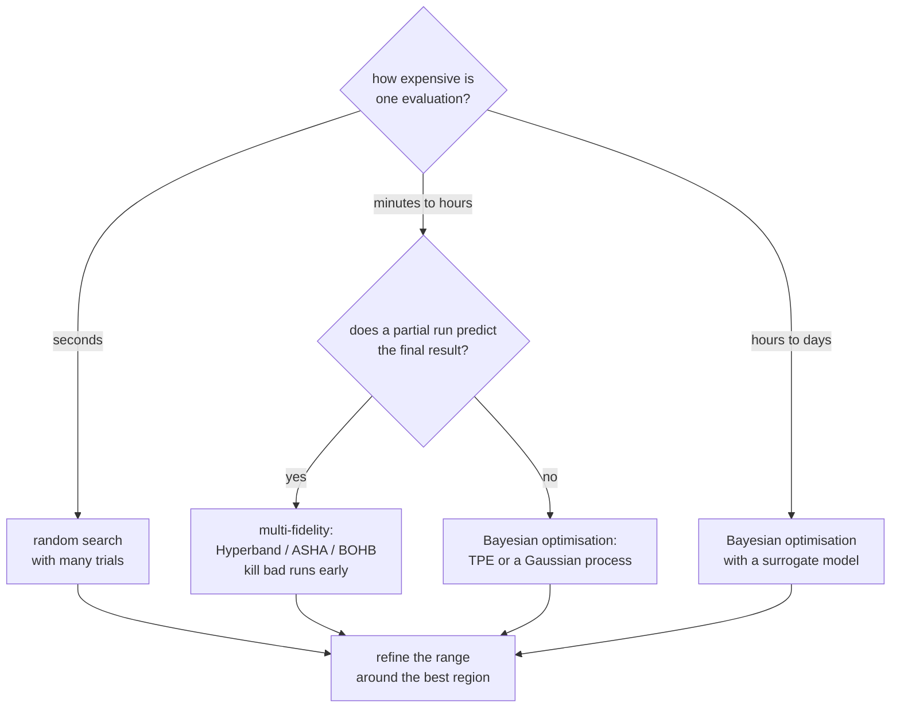

# Hyperparameter Tuning: Searching Without Fooling Yourself

Hyperparameters are the settings you choose rather than learn: learning rate,
tree depth, regularisation strength, the number of layers. They control model
capacity, and therefore they control the bias–variance trade — which is why
tuning them matters and why tuning them badly is a reliable way to produce an
optimistic number.

## The optimisation problem

$$\lambda^\star = \arg\min_{\lambda\in\Lambda}\; \mathcal{L}_{\text{val}}\bigl(\mathcal{A}_\lambda(\mathcal{D}_{\text{train}})\bigr)$$

Four properties make this hard, and they explain why the methods below exist:

| Property | Consequence |
|---|---|
| **Often treated as black-box** | hypergradients exist for differentiable training procedures, but discrete choices and long optimization paths complicate them |
| **Expensive** | full-fidelity evaluation may require several complete training runs |
| **Noisy** | seed and split variance can exceed the effect you are measuring |
| **Mixed types** | continuous, integer, categorical, and conditional dimensions |

The object being selected is a training procedure, not just a parameter dictionary.
It includes preprocessing, feature selection, stopping rules, threshold selection,
split construction, and the randomization policy. Write these down before opening
a search. A trial that scales all rows before cross-validation evaluates a
different and leaky procedure even if its final estimator has sensible parameters.

Distinguish three sources of variation: the sampled data, the partition into
training and validation, and stochastic training conditional on that partition.
Repeated seeds measure the third, not the first. Using identical folds across
configurations supports paired comparisons and reduces one source of noise, but
does not make the selected best score an unbiased final estimate.

## The search strategies



### Grid search

Evaluate every combination on a predefined grid. Exhaustive, reproducible, and
exponentially wasteful: 6 hyperparameters at 5 values each is 15,625 runs.

### Random search

Sample from distributions. It often uses a budget more efficiently when the
objective has low effective dimensionality, but does not strictly dominate every
grid on every problem. A small known discrete space may be best enumerated. A grid of $4^6$ points tries only 4
distinct values of each important parameter; 4,096 random points try 4,096
distinct values of each. The grid wastes its budget on combinations that differ
only in dimensions that do not matter.

```python
from scipy.stats import loguniform, randint, uniform

space = {
    "learning_rate": loguniform(1e-4, 3e-1),     # log scale — spans decades
    "max_depth":     randint(3, 12),
    "subsample":     uniform(0.5, 0.5),          # loc=0.5, scale=0.5 -> [0.5, 1.0]
    "reg_lambda":    loguniform(1e-3, 1e2),
}
```

**Sample log-scaled parameters on a log scale.** Learning rate and regularisation
strength span orders of magnitude; uniform sampling in $[10^{-4}, 10^{-1}]$ puts
90% of your samples in the top decade and essentially never tries $10^{-4}$.

More precisely, a continuous sampler has zero probability of drawing any exact
endpoint. Log-uniform sampling assigns equal probability to equal multiplicative
intervals. If $u\sim\mathrm{Uniform}(a,b)$ and $\lambda=e^u$, its density is
$p(\lambda)=1/[\lambda(b-a)]$ within the specified interval. A range is therefore
a prior allocation of compute, not merely a list of allowed values.

If an acceptable region occupies fraction $p$ of that sampling distribution,
$N$ independent trials hit it with probability $1-(1-p)^N$. For $p=0.05$,
roughly 59 trials give a 95% hit probability. This calculation assumes the region
is defined by the true objective and evaluations identify it reliably; noisy
validation scores and conditional spaces weaken that simplification.

### Bayesian optimisation

Fit a **surrogate** model of the objective, then use an **acquisition function**
to choose the next point by balancing exploitation (where the surrogate predicts
good results) against exploration (where it is uncertain).

| Surrogate | Character |
|---|---|
| Gaussian process | model-based uncertainty; standard exact fitting is cubic in completed trials; high-dimensional search needs structure |
| **TPE** (tree-structured Parzen estimator) | models $p(\lambda \mid \text{good})$ and $p(\lambda \mid \text{bad})$; handles conditional and categorical spaces; Optuna's default |
| Random forest (SMAC) | handles categoricals and discrete spaces well |

| Acquisition | Behaviour |
|---|---|
| Expected improvement (EI) | the standard default |
| Confidence bound | maximize $\mu+\kappa\sigma$ for reward, or minimize $\mu-\kappa\sigma$ for loss |
| Probability of improvement | greedier, exploits more |
| Entropy search | information-theoretic; expensive |

Bayesian methods pay off when each evaluation is expensive — a run that takes
hours justifies spending seconds deciding what to try next. For evaluations that
take seconds, random search with more trials is usually better per unit of
wall-clock.

For minimization with best observed loss $f_{best}$ and Gaussian surrogate
$F(\lambda)\sim\mathcal N(\mu,\sigma^2)$, expected improvement is
$\mathbb E[(f_{best}-F)_+]=(f_{best}-\mu)\Phi(z)+\sigma\phi(z)$ with
$z=(f_{best}-\mu)/\sigma$ when $\sigma>0$. The first term rewards a promising
mean and the second rewards uncertainty. At zero uncertainty, improvement becomes
$\max(0,f_{best}-\mu)$. A surrogate's uncertainty is a modeling assumption, not a
guarantee that its acquisition function explores every useful region.

Parallel evaluations complicate sequential acquisition: several workers may all
prefer the same unexplored region unless pending trials are accounted for.
Include acquisition overhead, scheduler delay, failed jobs, and resource variation
when comparing search methods. A sample-efficient algorithm can lose on elapsed
time if it cannot keep the available hardware productively occupied.

### Multi-fidelity: kill bad runs early

The key observation: you usually do not need a full run to know a configuration
is bad.

**Successive halving.** Start $n$ configurations with a small budget, keep the
top $1/\eta$, multiply their budget by $\eta$, repeat.

| Round | Configs | Epochs each | Total epochs |
|---|---|---|---|
| 1 | 81 | 1 | 81 |
| 2 | 27 | 3 | 81 |
| 3 | 9 | 9 | 81 |
| 4 | 3 | 27 | 81 |
| 5 | 1 | 81 | 81 |

The table totals 405 epochs if every promoted run restarts from scratch at its new
budget. If checkpoints resume, the incremental work is instead
$81\cdot1+27\cdot2+9\cdot6+3\cdot18+1\cdot54=297$ epochs. Full training of all
81 candidates to 81 epochs costs 6,561 epochs. State whether resource counts are
cumulative budgets or additional work before quoting a speedup.

**Hyperband** runs several successive-halving brackets with different
aggressiveness, hedging against the risk that a slow-starting configuration is
the best one. **ASHA** is the asynchronous version, which is what you want on a
cluster because it removes the synchronous round barrier, although worker idleness
can still occur through scheduling, insufficient trials, or resource constraints.
**BOHB** combines Hyperband allocation with model-based density sampling, and
is a strong practical default.

The assumption that must hold: **partial performance must correlate with final
performance.** It usually does, but configurations with long warmups or unusual
schedules can be killed unfairly. Set a minimum budget large enough for the
schedule to have done something.

Changing resource can change the problem. A small data subset may omit a rare
class; short contexts may favor a different language-model architecture; fewer
epochs may favor aggressive learning rates. Check rank correlation on a pilot
set of fully trained configurations. A low-fidelity winner is not a final winner
until it has been evaluated at the intended fidelity.

### Runnable lab: resumed successive halving

This deliberately small scheduler uses scikit-learn's actual incremental learner,
not a custom optimizer. Nine learning rates receive one epoch; three continue to
three total epochs; one continues to nine. It verifies 21 incremental epochs,
compared with 27 if each rung restarted and 81 for exhaustive full training.
Its fixed validation set is selection data, not an unbiased performance report.

```python runnable
import numpy as np
from sklearn.datasets import make_classification
from sklearn.linear_model import SGDClassifier
from sklearn.model_selection import train_test_split
from sklearn.preprocessing import StandardScaler
from sklearn.metrics import accuracy_score

X, y = make_classification(n_samples=500, n_features=12, n_informative=8,
                           class_sep=1.4, random_state=21)
train, valid, y_train, y_valid = train_test_split(
    X, y, test_size=0.3, stratify=y, random_state=2)
scaler = StandardScaler().fit(train)
train, valid = scaler.transform(train), scaler.transform(valid)
trials = [{"lr": float(lr), "epochs": 0,
           "model": SGDClassifier(loss="log_loss", learning_rate="constant",
               eta0=float(lr), alpha=1e-4, random_state=8)}
          for lr in np.logspace(-4, -0.5, 9)]
work = 0
for budget, keep in [(1, 3), (3, 1), (9, 1)]:
    for trial in trials:
        while trial["epochs"] < budget:
            trial["model"].partial_fit(train, y_train, classes=np.array([0, 1]))
            trial["epochs"] += 1
            work += 1
        trial["score"] = accuracy_score(y_valid, trial["model"].predict(valid))
    trials = sorted(trials, key=lambda t: (-t["score"], t["lr"]))[:keep]
    print("cumulative budget", budget, "survivors", len(trials), "work", work)
assert work == 21
assert trials[0]["epochs"] == 9
assert np.isfinite(trials[0]["model"].coef_).all()
assert trials[0]["score"] > 0.65
print("selected learning rate", trials[0]["lr"], "validation", trials[0]["score"])
```

### Population-based training

Train a population in parallel; periodically, poorly performing members copy the
weights of good ones and perturb their hyperparameters. This produces a
**schedule** rather than a fixed value — a learning rate that adapts over
training — which is a genuinely different and often better object than any single
setting.

## Designing the search space

This matters more than the search algorithm.

| Principle | Example |
|---|---|
| Use log scale for multiplicative parameters | learning rate, weight decay, $C$, $\gamma$ |
| Use integer ranges for structural ones | depth, layers, `num_leaves` |
| Start wide, then refine around the best region | two-stage search |
| Exclude values you know are bad | do not waste trials on `lr=10` |
| Handle conditionals | `degree` only matters when `kernel="poly"` |
| Fix what you can | learning rate fixed, tree count via early stopping |
| Tune the preprocessing too | imputation strategy, encoder choice, scaler |

A best value at the boundary is a reason to inspect the range, not proof it is
wrong. The boundary may be a real latency or memory constraint, a valid optimum
such as zero regularization, or a noisy winner. Expand only when the added region
is meaningful and affordable, and treat the expansion as another selection step.

Use conditional spaces rather than wasting trials on inactive parameters. For an
SVM, polynomial degree matters only under a polynomial kernel; an RBF trial has no
degree to optimize. For an optimizer, momentum may not exist in every branch.
Record defaults explicitly because an omitted parameter can change meaning across
library versions. Include transformations and split policy in the experiment
record, not just estimator arguments.

### What to tune, in priority order

| Model | First | Then | Rarely worth it |
|---|---|---|---|
| Gradient boosting | learning rate + n_estimators (early stopping) | depth/leaves, min_child_weight, subsample, colsample | L1/L2, gamma |
| Random forest | max_features, min_samples_leaf | n_estimators (more is fine) | criterion |
| Neural network | learning rate, batch size | architecture size, weight decay, dropout, warmup | optimiser betas, epsilon |
| SVM | C **and** gamma jointly | kernel | tolerance |
| Linear models | regularisation strength | l1_ratio | solver |
| $k$-NN | k, metric | weighting | algorithm |

**Learning rate is almost always the highest-leverage hyperparameter for
gradient-based models.** A coarse pilot is useful, but learning rate interacts
with batch size, regularization, schedule, and training duration. The
learning-rate range test — increase the LR exponentially over a few hundred steps
and plot the loss — finds a good value in one short run.

Early stopping can replace a large search over iteration count when its monitored
metric and patience suit the task. It is not free: repeated evaluation costs time,
uses validation information, and can stop on a noisy fluctuation. The stopping
validation set must lie inside the current outer training fold. Feeding the outer
test fold to an early-stopping callback contaminates the outer estimate even if
the final score is computed later.

For final refitting, specify the rule in advance: retain an internal stopping
split, or choose a training duration from inner runs and refit all outer-training
data for that duration. Do not silently use a different stopping procedure for
the deployed model than the one evaluated during development.

## Overfitting the validation set

Tuning is **selection**, and selection on a finite validation set has the same
optimism as any repeated hypothesis test. Try 1,000 configurations and the best
validation score is partly a measure of which configuration got lucky.

| Symptom | Cause |
|---|---|
| Best CV score much better than test | selection optimism, shift, leakage, or ordinary sampling variation |
| The winning configuration changes with seed | stochastic variability may exceed the observed difference |
| Small parameter changes swing the score | noise, optimization instability, or a genuinely sensitive regime |

Defences, in order of value:

1. **Nested cross-validation.** Inner loop tunes; outer loop estimates. The outer
   score estimates the whole selection procedure under the chosen splitting
   assumptions, at the outer training size; it is not universally unbiased.
2. **A held-out test set touched exactly once**, after all tuning.
3. **Fewer trials.** The optimism grows with the number of configurations tried.
4. **Inspect robust regions rather than only the maximum.** A broad plateau is
   useful evidence of stability, not proof of generalization.
5. **Repeat with different seeds** and average.
6. **Use paired comparisons and practical effect sizes.** Fold standard deviation
   is not a confidence interval or a universal significance threshold; folds have
   overlapping training data.

### Runnable lab: nested search and an untouched holdout

The inner loop chooses $C$ and $\gamma$ jointly. The outer loop evaluates that
selection procedure, not a single globally chosen configuration. A final search
uses all development rows before a once-only holdout evaluation. Scaling remains
inside every fit. This small fixture is for mechanics; real group or temporal
data require the corresponding splitters.

```python runnable
import numpy as np
from scipy.stats import loguniform
from sklearn.datasets import make_moons
from sklearn.pipeline import make_pipeline
from sklearn.preprocessing import StandardScaler
from sklearn.svm import SVC
from sklearn.model_selection import (train_test_split, StratifiedKFold,
    RandomizedSearchCV, cross_validate)
from sklearn.metrics import roc_auc_score

X, y = make_moons(n_samples=420, noise=0.22, random_state=3)
dev, test, y_dev, y_test = train_test_split(
    X, y, test_size=0.25, stratify=y, random_state=19)
inner_cv = StratifiedKFold(3, shuffle=True, random_state=5)
outer_cv = StratifiedKFold(3, shuffle=True, random_state=6)
search = RandomizedSearchCV(
    make_pipeline(StandardScaler(), SVC()),
    {"svc__C": loguniform(0.1, 100), "svc__gamma": loguniform(0.03, 5)},
    n_iter=8, scoring="roc_auc", cv=inner_cv, random_state=4, n_jobs=1,
    error_score="raise", refit=True, return_train_score=True)
result = cross_validate(search, dev, y_dev, cv=outer_cv,
    scoring="roc_auc", return_estimator=True, n_jobs=1)
assert len(result["estimator"]) == 3
assert all(len(est.cv_results_["params"]) == 8 for est in result["estimator"])
search.fit(dev, y_dev)
holdout_auc = roc_auc_score(y_test, search.decision_function(test))
assert result["test_score"].mean() > 0.85
assert holdout_auc > 0.85
assert search.best_estimator_.named_steps["standardscaler"].n_samples_seen_ == len(dev)
print("outer scores", result["test_score"], "descriptive std", result["test_score"].std())
print("selected parameters", search.best_params_, "holdout AUC", holdout_auc)
```

The [RandomizedSearchCV API](https://scikit-learn.org/stable/modules/generated/sklearn.model_selection.RandomizedSearchCV.html)
specifies sampling, refitting, and `cv_results_`. With all-list spaces, sampling
is without replacement; including a distribution changes the sampling behavior.
Scikit-learn scoring follows "higher is better," so loss scorers often have names
such as `neg_log_loss`. Do not maximize a positive loss by accident.

## A practical recipe with Optuna

The runnable baseline above needs no search-framework dependency. For an optional
Optuna study, preserve the same evaluation contract: a seeded sampler, explicit
objective direction, fixed inner splits, a complete fold-local pipeline, and a
predeclared trial or elapsed-time budget. Store the study with a suitable backend
when crash recovery or coordinated workers are required; an in-memory study is
sufficient for a disposable experiment.

Choose exactly what a pruning step means. With **fold-level pruning**, each step
is a completed fold and reports the running mean score. Every trial must use the
same fold order. With **iteration-level pruning**, steps are training iterations
and the monitored metric comes from a named evaluation dataset. Reporting both
boosting-iteration indices and fold indices into the same trial produces collisions
and incomparable intermediate values. Restarting iteration zero at each fold has
the same problem unless a framework explicitly aggregates synchronous fold metrics.

The following optional integration fragment is deliberately not a standalone lab:
it assumes `optuna`, `clone`, `roc_auc_score`, and a NumPy development dataset
`X, y`, plus a pipeline `base_pipeline` containing an `svc` step and an inner
splitter `cv`. It uses only fold-level reports; no boosting callback shares the
step namespace.

The [Optuna Trial API](https://optuna.readthedocs.io/en/stable/reference/generated/optuna.trial.Trial.html)
documents that repeated reports at one step keep the first value. Consequently,
the collision is not repaired by whichever callback happens to execute last.
Check the installed integration package and version when using optional callbacks.

```python
def objective(trial):
    params = {"svc__C": trial.suggest_float("C", 0.1, 100.0, log=True),
              "svc__gamma": trial.suggest_float("gamma", 0.03, 5.0, log=True)}
    scores = []
    for fold, (train_idx, valid_idx) in enumerate(cv.split(X, y)):
        model = clone(base_pipeline).set_params(**params)
        model.fit(X[train_idx], y[train_idx])
        scores.append(roc_auc_score(y[valid_idx], model.decision_function(X[valid_idx])))
        trial.report(sum(scores) / len(scores), step=fold)
        if trial.should_prune():
            raise optuna.TrialPruned()
    return sum(scores) / len(scores)
```

Configure a maximizing study for this objective and allow enough completed folds
before pruning. A running mean after one fold can rank candidates differently
from their eventual full-CV mean. Pruned candidates have incomplete evidence;
compare finalists on the same full protocol before making a final choice. For a
LightGBM integration, explicitly enable the desired evaluation metric and verify
the callback's expected metric and dataset names against the installed versions.
Early stopping and pruning are separate decisions: one chooses a model's stopping
iteration, while the other abandons the whole candidate.

Optimization history reveals whether improvements saturated. Slice and contour
plots reveal conditional interactions and boundary behavior. Parameter importance
summarizes the explored distribution, not an intrinsic causal ranking of settings;
a parameter held nearly fixed cannot show much measured importance. Persist data
version, folds, package versions, seeds, objective definition, failures, and actual
resource consumption alongside parameter values. A random seed alone is not a
reproduction package.

Failed trials need an explicit policy. A memory-exhausting candidate is evidence
about feasibility, not an accuracy score of zero; a transient worker failure may
deserve a retry under a bounded rule. Record failure type and consumed resources.
Do not silently drop slow or failed candidates and then claim the experiment had
the same budget as a method that counted them. Resuming a study also requires the
same dataset and objective contract: reusing its name after changing the target
or folds mixes incomparable observations in the surrogate history.

## Neural architecture search, briefly

NAS applies the same machinery to architecture. Three families:

| Approach | Cost | Note |
|---|---|---|
| RL / evolutionary over discrete architectures | thousands of GPU-days originally | the early work |
| **Weight sharing** (ENAS, one-shot supernets) | orders of magnitude cheaper | rank correlation with true performance is imperfect |
| **Differentiable** (DARTS) | cheap | a continuous relaxation of the architecture; can collapse to trivial cells |
| Zero-cost proxies | near-free | score architectures at initialisation; noisy but useful for pruning |

In practice, most teams should scale a known-good architecture family rather than
search. NAS pays off at the scale where a small efficiency gain is worth
thousands of GPU-hours — mobile inference models such as EfficientNet and
MobileNetV3 are its clearest successes.

## Budget allocation

Start from a cost equation. With $N$ trials, $K$ inner folds, and mean fit time
$t$, basic training work is approximately $NKt$, plus preprocessing, scoring,
search overhead, and final refits. Nested evaluation with $J$ outer folds costs
roughly $JNKt$ before the final development search. Eight trials with three inner
and three outer folds already involve 72 inner fits, not eight.

Parallelize one layer first. Running outer CV, inner search, and each estimator
with every core can oversubscribe the machine and increase elapsed time. Memory
can become the limiting resource when each worker owns transformed feature
matrices. Record peak memory and prediction cost if deployment has constraints.

For multiple objectives, distinguish a constraint from a preference. "Maximize
AUC subject to batch latency below 20 ms" is not equivalent to adding an arbitrary
latency penalty to AUC. A Pareto-dominated candidate is no better on any objective
and worse on at least one. Measure latency under a stated batch size, hardware,
warmup, and repetition protocol; a single noisy fit-time measurement is not a
serving benchmark.

Given a fixed compute budget, the ordering that produces the most improvement per
hour:

1. **Get the data and framing right.** No search fixes a leaky feature or the
   wrong target.
2. **Better features.** Usually a larger effect than any hyperparameter on
   tabular problems.
3. **Learning-rate and training-budget pilot**, with important interactions recorded.
4. **A sensible default configuration.** LightGBM and CatBoost defaults are
   useful baselines; the remaining tuning gain is task-dependent.
5. **Broad random or TPE search** over the 3–5 parameters that matter.
6. **Ensembling** the top configurations — frequently a bigger win than finding
   the single best one.
7. **Refinement** around the best region, if the budget remains.

Ensembling may improve performance when members make complementary errors, but
the top five nearly identical trials may add little. Selection of members and
weights is another tuning step. Nested-CV trial models are not necessarily models
refitted on all development data, and serving five models has real memory and
latency costs. Compare an ensemble against a single-model baseline under the same
evaluation and deployment budget.

## Common mistakes

| Mistake | Consequence |
|---|---|
| Tuning on the test set | the reported number is meaningless |
| Linear sampling of learning rate | wastes 90% of trials in one decade |
| Ignoring the stopping protocol | duration comparisons may use different amounts of validation information |
| Tuning $C$ and $\gamma$ separately | they interact; the joint optimum is missed |
| Ignoring a boundary winner | misses a reason to inspect constraints, noise, and adjacent values |
| 1,000 trials on 500 rows | you tuned the noise |
| Uncontrolled randomized splits | adds unnecessary variation; an unshuffled deterministic splitter does not need a seed |
| Ignoring preprocessing hyperparameters | often a larger effect than model ones |
| Reporting `best_score_` as the result | optimistically biased by selection |
| Pruning with too few warmup steps | kills configurations with warmup schedules |

## Self-check

### Worked answers and decisions

**How many epochs does the 81-candidate halving schedule consume?** With restarts,
five rungs each cost 81, totaling 405. With continuation, initial work is 81 and
each of the four promotion rungs adds 54, totaling 297. Neither number includes
validation, checkpoint I/O, or abandoned scheduler overhead.

**What does the nested outer score estimate?** Performance of the specified
selection-and-refit procedure trained on an outer-training subset and tested on
the corresponding held-out distribution. It does not estimate the winning inner
score, guarantee unbiasedness for the final full-data model, or repair an
inappropriate random split on a temporal task.

**Why not fix learning rate as a matter of principle?** Holding it fixed can make
a structural pilot cheaper, but a deeper model or changed batch size may need a
different rate or schedule. Comparability comes from a declared evaluation budget
and protocol, not from freezing every interacting setting. Report the restriction
as part of the search's scope.

**The best depth is the maximum allowed. What next?** Check whether that maximum
is a deployment constraint. Inspect neighboring scores, training-validation gaps,
and seed stability. Expand if meaningful, but allocate the extra search against
development data and keep the final holdout untouched.

**A trial's first fold reports step zero, and its boosting callback also reports
step zero. Is that harmless?** No. They describe different resource levels and
metrics, so the pruning history is incoherent. Use a single reporting scheme or
a framework that explicitly synchronizes fold-level iteration metrics.

**Which result should be reported after a broad search?** A separately evaluated
outer or holdout estimate, the selection budget, metric definition, uncertainty
limitations, and selected procedure. `best_score_` describes the maximum over
searched inner estimates and is expected to be optimistic.

1. Explain when random search uses its budget more efficiently than a grid using
   the effective-dimensionality argument, and name a case favoring enumeration.
2. Compute the epoch savings of successive halving with $n=81$, $\eta=3$.
3. What does fixing learning rate simplify in a structural booster search, and what interactions can it miss?
4. What does nested cross-validation estimate that a single search does not?
5. Your best configuration has `max_depth=12`, the top of your range. What now?
6. When is Bayesian optimisation worth its overhead over random search?
7. Give three cheaper things to do before spending a large budget on tuning.

## Where to go next

- [Model Evaluation](./model-evaluation.md) — the protocols that keep a search
  honest.
- [Bias–Variance & Generalization](./bias-variance-and-generalization.md) — what
  hyperparameters are actually controlling.
- [Boosting Libraries](../libraries/boosting-libraries.md) — the parameters most worth tuning, per
  library.
- [Optimization](../math/optimization.md) — constrained objectives, gradients, and optimization assumptions.
- [Feature Engineering](./feature-engineering.md) — transformations that belong inside every searched pipeline.
