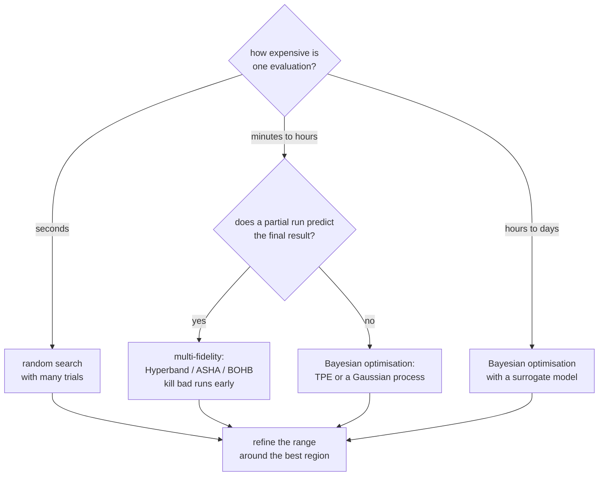

# Hyperparameter Tuning: Searching Without Fooling Yourself

Hyperparameters are the settings you choose rather than learn: learning rate,
tree depth, regularisation strength, the number of layers. They control model
capacity, and therefore they control the bias–variance trade — which is why
tuning them matters and why tuning them badly is a reliable way to produce an
optimistic number.

## The optimisation problem

$$\lambda^\star = \arg\min_{\lambda\in\Lambda}\; \mathcal{L}_{\text{val}}\bigl(\mathcal{A}_\lambda(\mathcal{D}_{\text{train}})\bigr)$$

Four properties make this hard, and they explain why the methods below exist:

| Property | Consequence |
|---|---|
| **No gradient** | you cannot backpropagate through "train a model" |
| **Expensive** | each evaluation is a full training run |
| **Noisy** | seed and split variance can exceed the effect you are measuring |
| **Mixed types** | continuous, integer, categorical, and conditional dimensions |

## The search strategies



### Grid search

Evaluate every combination on a predefined grid. Exhaustive, reproducible, and
exponentially wasteful: 6 hyperparameters at 5 values each is 15,625 runs.

### Random search

Sample from distributions. **It strictly dominates grid search**, for a reason
worth internalising: real problems have low *effective* dimensionality — usually
only 2–3 hyperparameters matter much. A grid of $4^6$ points tries only 4
distinct values of each important parameter; 4,096 random points try 4,096
distinct values of each. The grid wastes its budget on combinations that differ
only in dimensions that do not matter.

```python
from scipy.stats import loguniform, randint, uniform

space = {
    "learning_rate": loguniform(1e-4, 3e-1),     # log scale — spans decades
    "max_depth":     randint(3, 12),
    "subsample":     uniform(0.5, 0.5),          # loc=0.5, scale=0.5 -> [0.5, 1.0]
    "reg_lambda":    loguniform(1e-3, 1e2),
}
```

**Sample log-scaled parameters on a log scale.** Learning rate and regularisation
strength span orders of magnitude; uniform sampling in $[10^{-4}, 10^{-1}]$ puts
90% of your samples in the top decade and essentially never tries $10^{-4}$.

### Bayesian optimisation

Fit a **surrogate** model of the objective, then use an **acquisition function**
to choose the next point by balancing exploitation (where the surrogate predicts
good results) against exploration (where it is uncertain).

| Surrogate | Character |
|---|---|
| Gaussian process | principled uncertainty; $O(n^3)$; struggles above ~20 dimensions |
| **TPE** (tree-structured Parzen estimator) | models $p(\lambda \mid \text{good})$ and $p(\lambda \mid \text{bad})$; handles conditional and categorical spaces; Optuna's default |
| Random forest (SMAC) | handles categoricals and discrete spaces well |

| Acquisition | Behaviour |
|---|---|
| Expected improvement (EI) | the standard default |
| Upper confidence bound | $\mu + \kappa\sigma$; $\kappa$ tunes exploration explicitly |
| Probability of improvement | greedier, exploits more |
| Entropy search | information-theoretic; expensive |

Bayesian methods pay off when each evaluation is expensive — a run that takes
hours justifies spending seconds deciding what to try next. For evaluations that
take seconds, random search with more trials is usually better per unit of
wall-clock.

### Multi-fidelity: kill bad runs early

The key observation: you usually do not need a full run to know a configuration
is bad.

**Successive halving.** Start $n$ configurations with a small budget, keep the
top $1/\eta$, multiply their budget by $\eta$, repeat.

| Round | Configs | Epochs each | Total epochs |
|---|---|---|---|
| 1 | 81 | 1 | 81 |
| 2 | 27 | 3 | 81 |
| 3 | 9 | 9 | 81 |
| 4 | 3 | 27 | 81 |
| 5 | 1 | 81 | 81 |

405 epochs total explores 81 configurations. Full training of all 81 would cost
6,561 epochs — a 16× saving.

**Hyperband** runs several successive-halving brackets with different
aggressiveness, hedging against the risk that a slow-starting configuration is
the best one. **ASHA** is the asynchronous version, which is what you want on a
cluster because it never leaves workers idle waiting for a round to finish.
**BOHB** replaces Hyperband's random sampling with TPE, combining both ideas, and
is a strong practical default.

The assumption that must hold: **partial performance must correlate with final
performance.** It usually does, but configurations with long warmups or unusual
schedules can be killed unfairly. Set a minimum budget large enough for the
schedule to have done something.

### Population-based training

Train a population in parallel; periodically, poorly performing members copy the
weights of good ones and perturb their hyperparameters. This produces a
**schedule** rather than a fixed value — a learning rate that adapts over
training — which is a genuinely different and often better object than any single
setting.

## Designing the search space

This matters more than the search algorithm.

| Principle | Example |
|---|---|
| Use log scale for multiplicative parameters | learning rate, weight decay, $C$, $\gamma$ |
| Use integer ranges for structural ones | depth, layers, `num_leaves` |
| Start wide, then refine around the best region | two-stage search |
| Exclude values you know are bad | do not waste trials on `lr=10` |
| Handle conditionals | `degree` only matters when `kernel="poly"` |
| Fix what you can | learning rate fixed, tree count via early stopping |
| Tune the preprocessing too | imputation strategy, encoder choice, scaler |

**If the best value sits at a boundary of your range, the range was wrong.**
Expand it and search again — this is the most common and most easily fixed search
mistake.

### What to tune, in priority order

| Model | First | Then | Rarely worth it |
|---|---|---|---|
| Gradient boosting | learning rate + n_estimators (early stopping) | depth/leaves, min_child_weight, subsample, colsample | L1/L2, gamma |
| Random forest | max_features, min_samples_leaf | n_estimators (more is fine) | criterion |
| Neural network | learning rate, batch size | architecture size, weight decay, dropout, warmup | optimiser betas, epsilon |
| SVM | C **and** gamma jointly | kernel | tolerance |
| Linear models | regularisation strength | l1_ratio | solver |
| $k$-NN | k, metric | weighting | algorithm |

**Learning rate is almost always the highest-leverage hyperparameter for
gradient-based models.** Tune it first, alone, before anything else. The
learning-rate range test — increase the LR exponentially over a few hundred steps
and plot the loss — finds a good value in one short run.

**Use early stopping instead of tuning the number of iterations.** Fix a large
cap, early-stop on validation, and let each configuration find its own optimal
length. Tuning `n_estimators` in the grid wastes an entire search dimension on
something a callback does for free.

## Overfitting the validation set

Tuning is **selection**, and selection on a finite validation set has the same
optimism as any repeated hypothesis test. Try 1,000 configurations and the best
validation score is partly a measure of which configuration got lucky.

| Symptom | Cause |
|---|---|
| Best CV score much better than test | the search overfit the validation folds |
| The winning configuration is not reproducible with a new seed | the difference was noise |
| Small parameter changes swing the score a lot | you are reading noise, not signal |

Defences, in order of value:

1. **Nested cross-validation.** Inner loop tunes; outer loop estimates. The outer
   score is an unbiased estimate of the whole procedure.
2. **A held-out test set touched exactly once**, after all tuning.
3. **Fewer trials.** The optimism grows with the number of configurations tried.
4. **Prefer robust regions over sharp peaks.** If configurations near the winner
   also score well, the result is real; an isolated spike is noise.
5. **Repeat with different seeds** and average.
6. **Do not chase differences smaller than the fold-to-fold standard deviation.**

```python
inner = RandomizedSearchCV(pipe, space, n_iter=50, cv=StratifiedKFold(3),
                           scoring="average_precision", n_jobs=-1, random_state=0)
outer = cross_val_score(inner, X, y, cv=StratifiedKFold(5),
                        scoring="average_precision")
print(f"honest estimate: {outer.mean():.3f} ± {outer.std():.3f}")
```

## A practical recipe with Optuna

```python
import optuna
from optuna.integration import LightGBMPruningCallback

def objective(trial):
    params = {
        "learning_rate":    0.03,                        # FIXED — comparability
        "num_leaves":       trial.suggest_int("num_leaves", 15, 255, log=True),
        "min_child_samples":trial.suggest_int("min_child_samples", 5, 300, log=True),
        "subsample":        trial.suggest_float("subsample", 0.5, 1.0),
        "subsample_freq":   1,
        "colsample_bytree": trial.suggest_float("colsample_bytree", 0.3, 1.0),
        "reg_lambda":       trial.suggest_float("reg_lambda", 1e-3, 30.0, log=True),
        "reg_alpha":        trial.suggest_float("reg_alpha", 1e-3, 30.0, log=True),
        "n_estimators":     5000,
    }
    scores = []
    for fold, (tr, va) in enumerate(cv.split(X, y, groups)):
        m = LGBMClassifier(**params)
        m.fit(X.iloc[tr], y[tr], eval_set=[(X.iloc[va], y[va])],
              callbacks=[lgb.early_stopping(100, verbose=False),
                         LightGBMPruningCallback(trial, "average_precision")])
        scores.append(average_precision_score(y[va], m.predict_proba(X.iloc[va])[:, 1]))
        trial.report(np.mean(scores), fold)
        if trial.should_prune():
            raise optuna.TrialPruned()
    return float(np.mean(scores))

study = optuna.create_study(
    direction="maximize",
    sampler=optuna.samplers.TPESampler(seed=0, multivariate=True),
    pruner=optuna.pruners.MedianPruner(n_warmup_steps=1),
    storage="sqlite:///study.db", study_name="lgbm", load_if_exists=True,
)
study.optimize(objective, n_trials=200, n_jobs=4, timeout=3600)
```

Each choice is deliberate:

- **Learning rate fixed** so trials are comparable and early stopping searches
  the tree count.
- **Cross-validated objective** so a lucky split cannot win.
- **Pruning after each fold** so hopeless configurations die after one fold
  instead of five.
- **`multivariate=True`** so TPE models parameter interactions rather than each
  dimension independently.
- **Persistent storage** so the study survives a crash and can be resumed or
  parallelised across machines.

Then read the study, not just `best_params_`:

```python
optuna.visualization.plot_optimization_history(study)
optuna.visualization.plot_param_importances(study)     # which parameters mattered
optuna.visualization.plot_slice(study)                  # is the optimum at a boundary?
optuna.visualization.plot_contour(study, params=["num_leaves", "min_child_samples"])
```

The parameter-importance plot tells you which dimensions to keep and which to
fix in the next round. The slice plot tells you whether your ranges were wide
enough.

## Neural architecture search, briefly

NAS applies the same machinery to architecture. Three families:

| Approach | Cost | Note |
|---|---|---|
| RL / evolutionary over discrete architectures | thousands of GPU-days originally | the early work |
| **Weight sharing** (ENAS, one-shot supernets) | orders of magnitude cheaper | rank correlation with true performance is imperfect |
| **Differentiable** (DARTS) | cheap | a continuous relaxation of the architecture; can collapse to trivial cells |
| Zero-cost proxies | near-free | score architectures at initialisation; noisy but useful for pruning |

In practice, most teams should scale a known-good architecture family rather than
search. NAS pays off at the scale where a small efficiency gain is worth
thousands of GPU-hours — mobile inference models such as EfficientNet and
MobileNetV3 are its clearest successes.

## Budget allocation

Given a fixed compute budget, the ordering that produces the most improvement per
hour:

1. **Get the data and framing right.** No search fixes a leaky feature or the
   wrong target.
2. **Better features.** Usually a larger effect than any hyperparameter on
   tabular problems.
3. **Learning rate**, tuned alone.
4. **A sensible default configuration.** LightGBM and CatBoost defaults are
   strong; the gap to a tuned model is often 1–3%.
5. **Broad random or TPE search** over the 3–5 parameters that matter.
6. **Ensembling** the top configurations — frequently a bigger win than finding
   the single best one.
7. **Refinement** around the best region, if the budget remains.

**Ensembling the top-$k$ trials is under-used.** Averaging the predictions of the
five best configurations from a search almost always beats the single best, and
costs nothing beyond inference — the trials have already been trained.

## Common mistakes

| Mistake | Consequence |
|---|---|
| Tuning on the test set | the reported number is meaningless |
| Linear sampling of learning rate | wastes 90% of trials in one decade |
| Tuning `n_estimators` in the grid | early stopping does it for free |
| Tuning $C$ and $\gamma$ separately | they interact; the joint optimum is missed |
| Best value at a range boundary | the range was too narrow |
| 1,000 trials on 500 rows | you tuned the noise |
| No `random_state` on the splitter | trials are not comparable |
| Ignoring preprocessing hyperparameters | often a larger effect than model ones |
| Reporting `best_score_` as the result | optimistically biased by selection |
| Pruning with too few warmup steps | kills configurations with warmup schedules |

## Self-check

1. Explain why random search beats grid search using the effective-dimensionality
   argument.
2. Compute the epoch savings of successive halving with $n=81$, $\eta=3$.
3. Why should the learning rate be fixed during a structural search of a booster?
4. What does nested cross-validation estimate that a single search does not?
5. Your best configuration has `max_depth=12`, the top of your range. What now?
6. When is Bayesian optimisation worth its overhead over random search?
7. Give three cheaper things to do before spending a large budget on tuning.

## Where to go next

- [Model Evaluation](./model-evaluation.md) — the protocols that keep a search
  honest.
- [Bias–Variance & Generalization](./bias-variance-and-generalization.md) — what
  hyperparameters are actually controlling.
- [Boosting Libraries](../libraries.md) — the parameters most worth tuning, per
  library.
