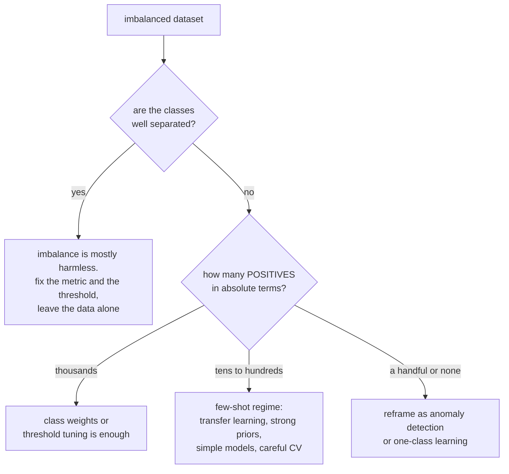

# Imbalanced Data and Practical Pitfalls

Fraud is 0.1% of transactions. Rare diseases are rarer. Manufacturing defects,
ad clicks, churn in a healthy business, security incidents — the events worth
predicting are usually the ones that hardly ever happen. This page covers what to
do about that, and then the wider set of practical failures that turn a strong
cross-validation score into a disappointing deployment.

## Why imbalance is a problem — and when it is not

The naive framing is "the model predicts the majority class". The precise
problems are:

1. **Accuracy becomes uninformative.** At 0.1% positives, always predicting
   negative scores 99.9%.
2. **The loss is dominated by the majority.** With 1,000 negatives per positive,
   the gradient signal from positives is 0.1% of the total.
3. **Few positive examples to learn from.** Often the real constraint is not the
   *ratio* but the absolute count — 50 positives is hard regardless of how many
   negatives accompany them.
4. **The decision threshold is wrong.** 0.5 assumes equal costs and roughly equal
   priors.
5. **Variance is high.** Metrics computed on 30 positives have enormous
   confidence intervals.

**Imbalance is not always a problem.** If the classes are well separated, a model
learns the boundary fine at any ratio. The difficulty comes from *overlap* plus
imbalance: rare positives that look like negatives. Before reaching for
resampling, check whether the problem is separability rather than balance —
plotting the score distributions per class answers it immediately.



## The interventions, in the order to try them

### 1. Fix the metric first

No amount of resampling helps if you are measuring the wrong thing.

| Use | Not |
|---|---|
| PR-AUC / average precision | accuracy |
| Precision and recall at your operating point | ROC-AUC alone |
| Precision@k when capacity is fixed | F1 without justifying equal costs |
| MCC for a single balanced number | — |
| Expected cost, if you can price the errors | — |

ROC-AUC is not *wrong*, it is *insensitive*: the false-positive rate divides by
the huge negative count, so thousands of false positives barely move it. PR
curves divide by predicted positives and expose the problem.

### 2. Tune the threshold

Frequently the entire fix, and it costs nothing.

```python
p = model.predict_proba(X_val)[:, 1]
ts = np.linspace(0.001, 0.999, 999)
costs = [C_fp * ((p > t) & (y_val == 0)).sum() + C_fn * ((p <= t) & (y_val == 1)).sum()
         for t in ts]
best_t = ts[int(np.argmin(costs))]
```

Train on the natural distribution, then choose the operating point from your
actual costs. This keeps the probabilities calibrated (resampling does not) and
separates the ranking question from the decision question.

**The Bayes-optimal threshold** for costs $C_{FP}$ and $C_{FN}$ is
$t^\star = \frac{C_{FP}}{C_{FP}+C_{FN}}$. With a false negative 40× more
expensive than a false positive, $t^\star \approx 0.024$ — nowhere near 0.5.

### 3. Class weights

```python
LogisticRegression(class_weight="balanced")
RandomForestClassifier(class_weight="balanced_subsample")
XGBClassifier(scale_pos_weight=n_neg / n_pos)
```

`"balanced"` sets $w_c = \frac{n}{K\,n_c}$, so each class contributes equally to
the loss. Simple, no data duplication, and usually the first thing to try after
the threshold.

The cost: **weighted models are no longer calibrated.** They no longer predict
the true base rate, because you changed the effective prior. If you need
probabilities, either recalibrate afterwards or prefer threshold tuning on an
unweighted model.

### 4. Resampling

| Method | Idea | Risk |
|---|---|---|
| Random undersampling | drop majority examples | throws away information |
| Random oversampling | duplicate minority examples | overfits the duplicates |
| **SMOTE** | interpolate between a minority point and its $k$ neighbours | creates points in overlapping regions; poor in high dimensions |
| Borderline-SMOTE | synthesise only near the boundary | more targeted |
| ADASYN | more synthesis where the class is harder | can amplify noise |
| Tomek links | remove majority points in boundary pairs | cleaning, mild effect |
| Edited nearest neighbours | remove misclassified majority points | cleaning |
| SMOTE-Tomek / SMOTE-ENN | synthesise then clean | often the best of the resampling family |
| **EasyEnsemble / BalancedBagging** | many balanced subsamples, ensemble them | uses all the data; strong |

**SMOTE must be applied inside the cross-validation fold**, and only to the
training portion. Applying it before the split puts synthetic points derived from
validation examples into training, producing spectacular and completely fake
scores. Use `imblearn.pipeline.Pipeline`, which knows to resample only during
`fit`:

```python
from imblearn.pipeline import Pipeline as ImbPipeline
from imblearn.over_sampling import SMOTE

pipe = ImbPipeline([("smote", SMOTE(k_neighbors=5, random_state=0)),
                    ("clf", LGBMClassifier())])
cross_val_score(pipe, X, y, cv=StratifiedKFold(5), scoring="average_precision")
```

**Honest assessment of SMOTE**: it was published in 2002 for low-dimensional
data with simple classifiers, and recent systematic comparisons find it rarely
beats class weighting plus threshold tuning with modern boosters, and frequently
hurts. Interpolating between minority points assumes the minority class is convex
and locally linear in feature space, which is usually false in high dimensions.
Try weights and thresholds first; treat SMOTE as one option to evaluate, not the
default answer.

### 5. Reframe the problem

At extreme imbalance (< 0.1% positives, or a handful of examples):

- **Anomaly detection** — Isolation Forest, one-class SVM, autoencoder
  reconstruction error. Trains on normal data only.
- **Two-stage cascade** — a high-recall cheap filter, then a precise expensive
  model on what survives.
- **Positive-unlabelled learning** — when negatives are actually "unlabelled".
- **Cost-sensitive learning** — put the costs in the loss directly.
- **Transfer learning** — a pretrained representation dramatically reduces the
  number of labelled positives needed.
- **Get more positives** — active learning, targeted collection, or relaxing the
  label definition.

### 6. Validate correctly

- **Stratify every split**, or a fold may contain zero positives.
- Prefer **repeated** stratified CV: with 50 positives, fold-to-fold variance is
  large.
- Report **confidence intervals**. With 30 positives in the test fold, recall has
  a half-width of roughly ±18 points.
- **Never resample the validation or test set.** They must reflect the real
  distribution, or your precision estimate is fiction.

That last point is the most common imbalance mistake after leakage: reporting
precision measured on a 50/50 rebalanced test set. Precision depends on the base
rate, so that number will not survive contact with production.

## The wider pitfall catalogue

### Data pitfalls

| Pitfall | Symptom | Prevention |
|---|---|---|
| **Target leakage** | one feature dominates; suspiciously high score | timeline audit of every feature |
| **Train/test contamination** | duplicates or near-duplicates across the split | deduplicate before splitting |
| **Temporal leakage** | random split on time-ordered data | temporal split |
| **Group leakage** | same user/patient/document in both splits | `GroupKFold` |
| **Survivorship bias** | training only on entities that still exist | reconstruct the population as of the prediction time |
| **Selection bias** | data collected under a policy you will change | log propensities; keep a randomised slice |
| **Label noise** | ceiling well below expectation | audit a sample; measure inter-annotator agreement |
| **Label definition drift** | performance drops at a specific date | version label definitions |
| **Different train and serve pipelines** | offline good, online bad | one shared transformation library, or a feature store |
| **Silent schema change** | metrics drop with no code change | schema validation at the boundary |

### Modelling pitfalls

| Pitfall | Reality |
|---|---|
| Tuning on the test set | your estimate is optimistic by an unknown amount |
| Comparing models on different splits | the difference may be entirely split variance |
| Ignoring seed variance | the improvement may be smaller than the seed spread |
| Trusting a single metric | aggregate hides slices |
| Extrapolating with a tree model | trees predict a constant outside the training range |
| Assuming feature importance is causal | it is a description of the model, not the world |
| Using default thresholds | 0.5 assumes equal costs and equal priors |
| Fitting preprocessing outside the fold | leakage |
| Over-engineering before a baseline | you cannot tell whether complexity helped |
| Optimising a proxy metric | the proxy and the goal diverge under optimisation pressure |

**That last one is Goodhart's law**, and it is the most common strategic failure
in applied ML. Optimising click-through produces clickbait. Optimising watch time
produces addictive content. Optimising a reward model produces text that games
the reward model. Whenever a metric becomes a target, check what optimising it
hard would look like, and add guardrails before you find out.

### Deployment pitfalls

| Pitfall | Prevention |
|---|---|
| Train/serve skew | shared transformation code; shadow-mode comparison |
| No monitoring | prediction distribution, feature drift, latency, error rate |
| No rollback plan | blue/green or canary with an automatic gate |
| Unversioned model | registry with lineage back to code and data |
| Feedback loops | log propensities, maintain an exploration slice |
| Stale features | monitor feature freshness, not just values |
| Unbounded latency | timeouts, circuit breakers, a fallback model |
| No fallback | a heuristic or a cached score when the model fails |
| Ignoring cold start | a default policy for new users and items |
| Silent degradation | delayed-label evaluation jobs |

**Feedback loops deserve the most attention** because they are invisible offline.
A recommender only observes outcomes for what it chose to show, so the next
model's training data is filtered by the current model's beliefs, which get
reinforced. The metrics improve while the system narrows. The defences are
logging propensities so you can inverse-propensity-weight, keeping a small
randomised exploration slice, and evaluating against that unbiased slice rather
than against the logged policy.

### Process pitfalls

| Pitfall | Better |
|---|---|
| No baseline | `DummyClassifier`, the incumbent, or a simple heuristic — first |
| Optimising before framing | confirm the decision and the cost structure |
| Notebook-only work | version-controlled code, deterministic seeds, tracked runs |
| Untracked experiments | log params, metrics, data version, git SHA |
| Modelling before data quality | fix the labels before tuning the model |
| Shipping without an evaluation plan | define success and the monitoring before launch |
| One-shot delivery | plan for retraining from the start |

## A pre-launch checklist

1. Beats a trivial baseline by more than its confidence interval.
2. Validation protocol matches the dependence structure (grouped, temporal).
3. Every stateful transform is inside the Pipeline.
4. Every feature passes the timeline test.
5. Metric matches the decision; threshold set from costs.
6. Probabilities calibrated if they are used as probabilities.
7. Sliced metrics reviewed; the worst slice is acceptable.
8. 50 errors read by hand.
9. Paired significance test against the incumbent.
10. Results stable across seeds.
11. Latency measured at p99 under realistic load.
12. Monitoring, alerting, and a rollback path exist.
13. A retraining plan and trigger are defined.
14. Fairness reviewed if the decision affects people.

## Self-check

1. Your fraud model has 99.9% accuracy and 0.98 ROC-AUC and the team says it is
   useless. Give the two metrics you would compute and what you expect to see.
2. Derive the Bayes-optimal threshold for $C_{FN} = 40\,C_{FP}$.
3. Why must SMOTE go inside the CV fold, and what does violating that produce?
4. Why does class weighting decalibrate a model, and when does that matter?
5. Give three reasons a model can be excellent offline and poor in production,
   with a diagnostic for each.
6. Explain a recommender feedback loop and two defences against it.
7. When is class imbalance *not* a problem, and how would you check?

## Where to go next

- [Model Evaluation](./model-evaluation.md) — the metrics and protocols this page
  depends on.
- [Feature Engineering](./feature-engineering.md) — where most leakage is
  introduced.
- [Ethics & Fairness](./ethics-and-fairness.md) — when the failures affect
  people.
