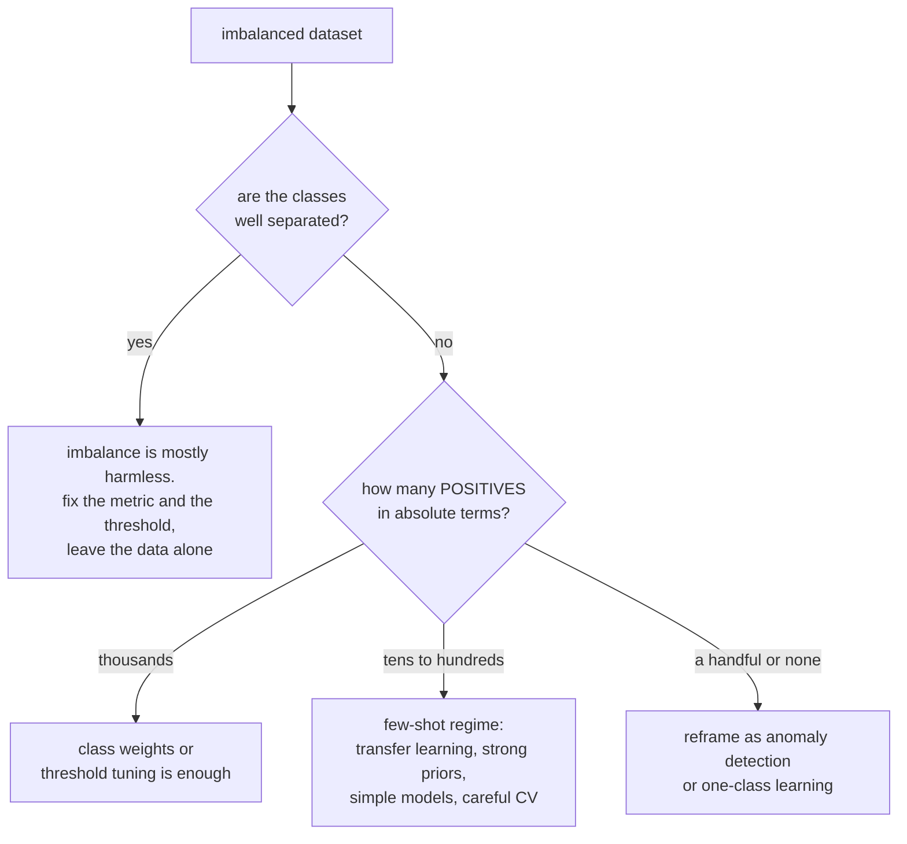

# Imbalanced Data and Practical Pitfalls

Consider a fraud task with 0.1% positive transactions. Other rare-event tasks have different prevalences and error costs. Manufacturing defects,
ad clicks, churn in a healthy business, security incidents — the events worth
predicting are usually the ones that hardly ever happen. This page covers what to
do about that, and then the wider set of practical failures that turn a strong
cross-validation score into a disappointing deployment.

## Why imbalance is a problem — and when it is not

The naive framing is "the model predicts the majority class". The precise
problems are:

1. **Accuracy becomes uninformative.** At 0.1% positives, always predicting
   negative scores 99.9%.
2. **Loss contributions can be uneven.** With 1,000 negatives per positive, counts favor negatives, but gradient contribution also depends on residuals, weights and features; it is not fixed by the frequency ratio.
3. **Few positive examples to learn from.** Often the real constraint is not the
   *ratio* but the absolute count — 50 positives is hard regardless of how many
   negatives accompany them.
4. **The operating threshold may be wrong.** For deployment-calibrated posterior probabilities and zero correct-decision costs, 0.5 corresponds to equal false-positive/false-negative costs, regardless of unequal priors.
5. **Variance is high.** Metrics computed on 30 positives have enormous
   confidence intervals.

**Imbalance is not always a problem.** If the classes are well separated, a model
may learn a useful boundary despite a large ratio, provided enough representative positives are observed. The difficulty comes from *overlap* plus
imbalance: rare positives that look like negatives. Before reaching for
resampling, check whether the problem is separability rather than balance —
held-out score distributions per class help diagnose it, alongside uncertainty and error review.



## The interventions, in the order to try them

### 1. Fix the metric first

No amount of resampling helps if you are measuring the wrong thing.

| Use | Not |
|---|---|
| PR-AUC / average precision | accuracy |
| Precision and recall at your operating point | ROC-AUC alone |
| Precision@k when capacity is fixed | treating F1 as a monetary FP/FN cost model |
| MCC for a single balanced number | — |
| Expected cost, if you can price the errors | — |

ROC-AUC is not *wrong*, it is *insensitive*: the false-positive rate divides by
the huge negative count, so thousands of false positives barely move it. PR
curves divide by predicted positives and expose the problem.

### 2. Tune the threshold

Sometimes the main improvement comes from changing the decision policy rather than retraining. Threshold selection still consumes validation information and requires an operational cost definition.

```python
p = model.predict_proba(X_val)[:, 1]
ts = np.linspace(0.001, 0.999, 999)
costs = [C_fp * ((p > t) & (y_val == 0)).sum() + C_fn * ((p <= t) & (y_val == 1)).sum()
         for t in ts]
best_t = ts[int(np.argmin(costs))]
```

Train on the natural distribution, then choose the operating point from your
actual costs. Natural-prevalence training preserves the sampling prior but does not guarantee calibration. Check or calibrate probability quality on suitable held-out data, separating ranking from the decision rule.

**The Bayes-optimal threshold** for costs $C_{FP}$ and $C_{FN}$ is
$t^\star = \frac{C_{FP}}{C_{FP}+C_{FN}}$. With a false negative 40× more
expensive than a false positive, $t^\star \approx 0.024$ — nowhere near 0.5.

### 3. Class weights

```python
LogisticRegression(class_weight="balanced")
RandomForestClassifier(class_weight="balanced_subsample")
XGBClassifier(scale_pos_weight=n_neg / n_pos)
```

`"balanced"` sets $w_c = \frac{n}{K\,n_c}$, so each class has equal total sample weight, not necessarily equal realized loss or gradient contribution. Simple, no data duplication, and usually the first thing to try after
the threshold.

The cost: **weighted proper-loss optima generally target a reweighted posterior**, not the original population posterior. Finite models may have additional calibration error too. If you need
probabilities, either recalibrate afterwards or prefer threshold tuning on an
unweighted model.

### 4. Resampling

| Method | Idea | Risk |
|---|---|---|
| Random undersampling | drop majority examples | throws away information |
| Random oversampling | duplicate minority examples | overfits the duplicates |
| **SMOTE** | interpolate between a minority point and its $k$ neighbours | creates points in overlapping regions; poor in high dimensions |
| Borderline-SMOTE | synthesise only near the boundary | more targeted |
| ADASYN | more synthesis where the class is harder | can amplify noise |
| Tomek links | remove majority points in boundary pairs | cleaning, mild effect |
| Edited nearest neighbours | remove misclassified majority points | cleaning |
| SMOTE-Tomek / SMOTE-ENN | synthesise then clean | often the best of the resampling family |
| **EasyEnsemble / BalancedBagging** | ensemble balanced subsamples | broader majority coverage, not guaranteed use of every point in a finite ensemble |

**SMOTE must be applied inside the cross-validation fold**, and only to the
training portion. Applying it before the split puts synthetic points derived from
validation examples into training, producing spectacular and completely fake
scores. Use `imblearn.pipeline.Pipeline`, which knows to resample only during
`fit`:

```python
from imblearn.pipeline import Pipeline as ImbPipeline
from imblearn.over_sampling import SMOTE

pipe = ImbPipeline([("smote", SMOTE(k_neighbors=5, random_state=0)),
                    ("clf", LGBMClassifier())])
cross_val_score(pipe, X, y, cv=StratifiedKFold(5), scoring="average_precision")
```

**Assess SMOTE as one candidate, not a guaranteed remedy.** Neighbor interpolation assumes nearby minority points can be connected through a label-preserving region in the chosen feature geometry. This is a local assumption, not a requirement of global class convexity. Overlap, noise, categorical features and unreliable high-dimensional distances can make interpolation harmful. Compare with class weighting and threshold-only baselines using the same honest folds.

### 5. Reframe the problem

At extreme imbalance (< 0.1% positives, or a handful of examples):

- **Anomaly detection** — Isolation Forest, one-class SVM, autoencoder
  reconstruction error. Novelty detection can fit trusted normal examples; outlier detectors such as Isolation Forest are also commonly fitted to contaminated unlabeled mixtures. Unusual is not synonymous with a positive event.
- **Two-stage cascade** — a high-recall cheap filter, then a precise expensive
  model on what survives.
- **Positive-unlabelled learning** — when negatives are actually "unlabelled".
- **Cost-sensitive learning** — put the costs in the loss directly.
- **Transfer learning** — a suitable pretrained representation can reduce the
  number of labelled positives needed; domain mismatch can erase that benefit.
- **Get more positives** — active learning or targeted collection. Changing the
  label definition changes the task, so justify and version it rather than silently
  broadening labels to improve a metric.

### 6. Validate correctly

- **Respect time and entity boundaries first**, then stratify where compatible. Inspect positive counts explicitly; stratification cannot justify leakage across those boundaries.
- Use **repeated** stratified CV when observations are exchangeable; otherwise repeat appropriate group or temporal evaluations. With 50 positives, fold-to-fold variance is large.
- Report **confidence intervals**. With 30 positives in the test fold, a worst-case normal-approximation recall half-width is about eighteen points; exact/binomial intervals are preferable near boundaries.
- **Do not rebalance held-out data and report unweighted metrics as deployment performance.** Natural-prevalence evaluation is the simplest default. Deliberately class-stratified evaluation requires documented sampling weights or justified prior correction; duplicating examples does not increase independent evidence.

That last point is the most common imbalance mistake after leakage: reporting
precision measured on a 50/50 rebalanced test set. Precision depends on the base
rate, so that number will not survive contact with production.

### A calibration-aware baseline comparison

Compare three candidates on the same untouched deployment-like evaluation set:
an unweighted classifier, a class-weighted classifier, and an unweighted classifier
with a separately selected threshold. Give each candidate the same feature set,
tuning budget and decision cost. Fit any calibrator on separate representative
observations, after model selection; choose operating thresholds on another held-out
partition or through a properly nested procedure. Otherwise apparent gains may
come from evaluating on the data used to optimize the threshold.

Report probability quality and decision quality separately. A weighted classifier
can improve recall at its default threshold while worsening probability estimates;
an unweighted classifier can sometimes reach the same operating point simply by
moving its threshold. Conversely, weighting may change the learned representation
and ranking, so threshold adjustment is not guaranteed to reproduce its behavior.
Include positive counts, uncertainty, review volume and recall at a fixed capacity
alongside cost. This comparison identifies what actually improved: ranking,
calibration, or the chosen action policy.

## The wider pitfall catalogue

### Data pitfalls

| Pitfall | Symptom | Prevention |
|---|---|---|
| **Target leakage** | one feature dominates; suspiciously high score | timeline audit of every feature |
| **Train/test contamination** | duplicates or near-duplicates across the split | deduplicate before splitting |
| **Temporal leakage** | random split on time-ordered data | temporal split |
| **Group leakage** | same user/patient/document in both splits | `GroupKFold` |
| **Survivorship bias** | training only on entities that still exist | reconstruct the population as of the prediction time |
| **Selection bias** | data collected under a policy you will change | log propensities; keep a randomised slice |
| **Label noise** | ceiling well below expectation | audit a sample; measure inter-annotator agreement |
| **Label definition drift** | performance drops at a specific date | version label definitions |
| **Different train and serve pipelines** | offline good, online bad | one shared transformation library, or a feature store |
| **Silent schema change** | metrics drop with no code change | schema validation at the boundary |

### Modelling pitfalls

| Pitfall | Reality |
|---|---|
| Tuning on the test set | your estimate is optimistic by an unknown amount |
| Comparing models on different splits | the difference may be entirely split variance |
| Ignoring seed variance | the improvement may be smaller than the seed spread |
| Trusting a single metric | aggregate hides slices |
| Extrapolating with a tree model | trees predict a constant outside the training range |
| Assuming feature importance is causal | it is a description of the model, not the world |
| Using default thresholds | 0.5 assumes equal error costs for deployment-calibrated posteriors, not equal priors |
| Fitting preprocessing outside the fold | leakage |
| Over-engineering before a baseline | you cannot tell whether complexity helped |
| Optimising a proxy metric | the proxy and the goal diverge under optimisation pressure |

**That last one is Goodhart's law**, and it is the most common strategic failure
in applied ML. Optimising click-through produces clickbait. Optimising watch time
produces addictive content. Optimising a reward model produces text that games
the reward model. Whenever a metric becomes a target, check what optimising it
hard would look like, and add guardrails before you find out.

### Deployment pitfalls

| Pitfall | Prevention |
|---|---|
| Train/serve skew | shared transformation code; shadow-mode comparison |
| No monitoring | prediction distribution, feature drift, latency, error rate |
| No rollback plan | blue/green or canary with an automatic gate |
| Unversioned model | registry with lineage back to code and data |
| Feedback loops | log propensities, maintain an exploration slice |
| Stale features | monitor feature freshness, not just values |
| Unbounded latency | timeouts, circuit breakers, a fallback model |
| No fallback | a heuristic or a cached score when the model fails |
| Ignoring cold start | a default policy for new users and items |
| Silent degradation | delayed-label evaluation jobs |

**Feedback loops deserve the most attention** because they are invisible offline.
A recommender only observes outcomes for what it chose to show, so the next
model's training data is filtered by the current model's beliefs, which get
reinforced. The metrics improve while the system narrows. The defences are
logging propensities so you can inverse-propensity-weight, keeping a small
randomised exploration slice, and evaluating against that unbiased slice rather
than against the logged policy.

### Process pitfalls

| Pitfall | Better |
|---|---|
| No baseline | `DummyClassifier`, the incumbent, or a simple heuristic — first |
| Optimising before framing | confirm the decision and the cost structure |
| Notebook-only work | version-controlled code, deterministic seeds, tracked runs |
| Untracked experiments | log params, metrics, data version, git SHA |
| Modelling before data quality | fix the labels before tuning the model |
| Shipping without an evaluation plan | define success and the monitoring before launch |
| One-shot delivery | plan for retraining from the start |

## A pre-launch checklist

1. Improves the decision metric over a baseline with appropriate paired uncertainty and practical effect size.
2. Validation protocol matches the dependence structure (grouped, temporal).
3. Every stateful transform is inside the Pipeline.
4. Every feature passes the timeline test.
5. Metric matches the decision; threshold set from costs.
6. Probabilities calibrated if they are used as probabilities.
7. Sliced metrics reviewed; the worst slice is acceptable.
8. 50 errors read by hand.
9. Paired significance test against the incumbent.
10. Results stable across seeds.
11. Latency measured at p99 under realistic load.
12. Monitoring, alerting, and a rollback path exist.
13. A retraining plan and trigger are defined.
14. Fairness reviewed if the decision affects people.

## Posteriors, costs, and changed priors

### Derive the decision, not just the threshold

Let $p=P(Y=1\mid X=x)$ be a probability calibrated to deployment. Predicting
positive has expected error cost $C_{FP}(1-p)$; predicting negative costs
$C_{FN}p$, assuming correct decisions cost zero. Choose positive when

$$C_{FP}(1-p)\le C_{FN}p
\quad\Longleftrightarrow\quad p\ge\frac{C_{FP}}{C_{FP}+C_{FN}}.$$

Priors are already inside $p$. With equal error costs the threshold is $0.5$
even if only one percent of the population is positive. With $C_{FN}=40C_{FP}$,
it is $1/41\approx0.02439$. Adding class priors again to this posterior formula
would count the prior twice. A likelihood-ratio decision rule does explicitly
contain prior odds because a likelihood ratio is not itself a posterior.

For a general cost matrix, compare
$L(1,1)p+L(1,0)(1-p)$ with $L(0,1)p+L(0,0)(1-p)$.
Nonzero review costs, different treatment effectiveness and abstention can change
the action comparison. A fraud score used to route cases to investigators is
not necessarily a decision to reject every flagged transaction.

If each review yields benefit $b p-c(1-p)$ and all reviews have equal effort,
rank by expected incremental value and select positive-value cases up to
capacity. With case-specific values or review times, sorting by probability
alone need not maximize utility. A hard capacity of one hundred cases also
requires a tie policy at the boundary and an understanding of daily volume shifts.

### Weighting changes the target probability

For class weights $w_1,w_0>0$, minimize conditional weighted binary log loss:

$$-w_1\pi\log q-w_0(1-\pi)\log(1-q).$$

Setting its derivative to zero gives

$$q^*=\frac{w_1\pi}{w_1\pi+w_0(1-\pi)},\qquad
\frac{q^*}{1-q^*}=\frac{w_1}{w_0}\frac{\pi}{1-\pi}.$$

Thus the idealized correction subtracts $\log(w_1/w_0)$ from the weighted
logit. With positive weight nine and true probability $0.1$, the optimum is
$0.5$. Treating that weighted score as an unweighted population probability
would be wrong even if optimization were perfect.

Finite model misspecification, regularization and altered fitting dynamics can
prevent an analytic correction from fully calibrating a learned model. Held-out
calibration is an empirical alternative, provided the calibration distribution
matches the use case and the sample includes enough positives. Do not fit a
calibrator on the same labels used to train an overfitting base model and call
the result independent validation.

Focal loss replaces a log-loss contribution with
$-\alpha_t(1-p_t)^\gamma\log p_t$, emphasizing currently difficult examples.
At $\gamma=0$ it becomes weighted cross-entropy. Larger $\gamma$ can reduce
easy-negative dominance but may emphasize mislabeled outliers and alters
probability interpretation. Compare it only when the learner supports that
objective and assess calibration separately.

### Case-control sampling and prior shift

Suppose source and deployment have the same class-conditional feature densities
but different prevalences $\pi_s$ and $\pi_d$. Bayes' rule gives

$$\operatorname{logit}p_d(x)=\operatorname{logit}p_s(x)
+\operatorname{logit}\pi_d-\operatorname{logit}\pi_s.$$

If a balanced source gives $p_s=0.8$ and deployment prevalence is $0.02$,
the new odds are $4\cdot0.02/0.98$, yielding probability about $0.07547$.
The ranking is unchanged by this constant log-odds shift, but probability
quality, precision and decisions at an unchanged old-score cutoff can change
dramatically. The Bayes cutoff on the corrected deployment posterior stays tied
to costs.

This formula requires stable $P(X\mid Y)$ and an appropriate source posterior.
It does not repair concept drift, class-conditional sampling within a class or
arbitrary SMOTE geometry. Estimating a deployment prevalence from unlabeled data
requires additional identifiability assumptions; the true prevalence is not
generally the mean of an uncalibrated score vector.

## Experiment: recover deployment probabilities after balanced sampling

The simulation uses class-conditional Gaussians with shared variance, for which
a linear logit is correctly specified. A logistic model is trained on a balanced
source, then analytically corrected to a two-percent deployment prior. The known
prior comes from the simulator, not from selecting a value on test labels.

```python runnable
import numpy as np
from scipy.special import expit, logit
from sklearn.linear_model import LogisticRegression
from sklearn.metrics import brier_score_loss, roc_auc_score
from threadpoolctl import threadpool_limits

rng = np.random.default_rng(131)
source_y = np.r_[np.zeros(2000, dtype=int), np.ones(2000, dtype=int)]
source_x = rng.normal(loc=2 * source_y, scale=1.0)[:, None]
with threadpool_limits(limits=1):
    model = LogisticRegression(C=10000, max_iter=1000).fit(source_x, source_y)
deployment_prior = 0.02
test_y = np.r_[np.zeros(19600, dtype=int), np.ones(400, dtype=int)]
test_x = rng.normal(loc=2 * test_y, scale=1.0)[:, None]
source_score = model.decision_function(test_x)
raw = expit(source_score)
corrected = expit(source_score + logit(deployment_prior) - logit(0.5))
true_probability = expit(2 * test_x[:, 0] - 2 + logit(deployment_prior))
assert brier_score_loss(test_y, corrected) < brier_score_loss(test_y, raw)
np.testing.assert_allclose(roc_auc_score(test_y, raw), roc_auc_score(test_y, corrected))
assert np.mean(np.abs(corrected - true_probability)) < 0.01
fp_cost, fn_cost = 1, 40
threshold = fp_cost / (fp_cost + fn_cost)
def cost(probabilities, cutoff):
    action = probabilities >= cutoff
    return fp_cost * np.sum(action & (test_y == 0)) + fn_cost * np.sum(~action & (test_y == 1))
assert cost(corrected, threshold) < cost(corrected, 0.5)
print("Raw/corrected Brier:", brier_score_loss(test_y, raw), brier_score_loss(test_y, corrected))
print("Cost at posterior 0.5 / Bayes threshold:", cost(corrected, 0.5), cost(corrected, threshold))
print("Corrected probability from a balanced-source score of 0.8:",
      expit(logit(0.8) + logit(deployment_prior)))
```

The exact analytic posterior is available only because this is a specified
simulation. On real data, check calibration using mature, representative labels
and report uncertainty. Stable ROC-AUC after correction is expected because the
logit shift is monotone, not evidence that both probability vectors are equally
useful for decisions.

### Prevalence changes precision even with fixed class-wise error rates

For TPR $r$, FPR $f$ and prevalence $\pi$:

$$\operatorname{Precision}=\frac{\pi r}{\pi r+(1-\pi)f}.$$

At $r=0.8,f=0.01$, precision is about $7.41\%$ for prevalence $0.1\%$,
$44.69\%$ at one percent, and $89.89\%$ at ten percent. The same conditional
error rates therefore yield very different alert usefulness. A balanced test
set can estimate TPR/FPR if sampling within each class is representative, but
its raw precision does not estimate low-prevalence deployment precision without
appropriate weighting or prior adjustment.

## Effective information and resampling geometry

Thirty positives provide thirty Bernoulli recall outcomes, not the total test
size's worth of recall information. A worst-case normal approximation gives
$1.96\sqrt{0.25/30}\approx0.179$ half-width. Exact or Wilson intervals behave
better near zero/one recall. Repeated folds reuse the same positives; they assess
split sensitivity but do not create new independent positive observations.

SMOTE with $k$ neighbors requires enough minority observations inside each
training fold, normally at least $k+1$ for the relevant class. A globally adequate
positive count can still fail after grouping or temporal splitting. Duplicate
minority observations provide less neighborhood diversity than the raw count
suggests. Distances should reflect feature units, with scaling fit inside the
training fold before neighbor interpolation.

Ordinary SMOTE interpolates continuous vectors; interpolating category IDs creates
meaningless intermediate categories. Mixed-data variants such as SMOTENC handle
categorical features differently, but still rely on a useful neighborhood
definition. Synthetic points are not independently collected positives and
should not be counted as additional statistical evidence in confidence intervals.

### Experiment: why duplication before splitting leaks

This example assigns labels independently of features, then duplicates positives.
Splitting after duplication places the same source observation in training and
test, allowing nearest-neighbor memorization. The honest comparison splits
source observations first and oversamples training only. The leaky test also
has a changed prevalence; it is intentionally not a valid performance estimate.

```python runnable
import numpy as np
from sklearn.metrics import balanced_accuracy_score, recall_score
from sklearn.model_selection import train_test_split
from sklearn.neighbors import KNeighborsClassifier

rng = np.random.default_rng(132)
X = rng.normal(size=(400, 6))
y = np.zeros(400, dtype=int)
y[rng.choice(400, size=40, replace=False)] = 1
source_ids = np.arange(len(y))
duplicated_ids = np.r_[source_ids, np.repeat(source_ids[y == 1], 9)]
train_rows, test_rows = train_test_split(np.arange(len(duplicated_ids)), test_size=0.3,
                                        stratify=y[duplicated_ids], random_state=132)
leaky_train, leaky_test = duplicated_ids[train_rows], duplicated_ids[test_rows]
overlap = np.intersect1d(leaky_train, leaky_test)
assert len(overlap) > 0
leaky = KNeighborsClassifier(n_neighbors=1).fit(X[leaky_train], y[leaky_train])
leaky_prediction = leaky.predict(X[leaky_test])

honest_train, honest_test = train_test_split(source_ids, test_size=0.3, stratify=y, random_state=133)
resampled_train = np.r_[honest_train, np.repeat(honest_train[y[honest_train] == 1], 9)]
assert set(resampled_train).isdisjoint(honest_test)
honest = KNeighborsClassifier(n_neighbors=1).fit(X[resampled_train], y[resampled_train])
honest_prediction = honest.predict(X[honest_test])
print("Leaked source observations:", len(overlap))
print("Leaky balanced accuracy/recall:", balanced_accuracy_score(y[leaky_test], leaky_prediction),
      recall_score(y[leaky_test], leaky_prediction))
print("Honest balanced accuracy/recall:", balanced_accuracy_score(y[honest_test], honest_prediction),
      recall_score(y[honest_test], honest_prediction))
assert recall_score(y[leaky_test], leaky_prediction) > 0.95
```

Nearest-neighbor memorization makes leakage easy to see; interpolation can leak
validation information less obviously through synthetic points influenced by
held-out neighbors. Use source IDs and lineage tests, not only score plausibility,
to enforce the split boundary. A good-looking result alone cannot establish that
a resampling pipeline is honest.

## Selective labels, cascades, and rare-event operations

In positive-unlabeled learning, let $S=1$ mean a positive received a label. Under
the strong assumption that positives are labeled with constant probability $c$
independently of features, $P(S=1\mid X)=cP(Y=1\mid X)$. If labeling depends on
severity or the old model's score, that constant correction is invalid. Treating
all unlabeled examples as negatives silently changes the target.

Selective outcome collection is similar but can affect both classes. Fraud
reviews reveal labels preferentially among flagged cases, and rejected
transactions may have no observed downstream outcome. Metrics from reviewed
cases alone do not necessarily describe the full transaction stream. Maintain
a justified audit sample and log selection probabilities where feasible; inverse
weighting also needs overlap and can become high variance.

For a two-stage cascade, overall recall is first-stage recall times second-stage
recall conditional on passing the first stage. A $0.95$ first-stage recall and
$0.90$ conditional second-stage recall give $0.855$, not $0.90$ or $0.95$.
Measure latency and error on the complete cascade, including cases discarded by
the cheap filter. Training the second model only on easy curated survivors can
create train/serve skew.

Rare-event monitoring should track prevalence estimates from mature labels,
alert volume, review capacity, class-conditional score distributions, precision
and recall at the active policy, subgroup counts and feature freshness.
Input drift without outcomes cannot distinguish benign population changes from
performance loss. Conversely, unchanged input marginals do not rule out changed
label relationships. A rollback plan needs a fallback policy and a clearly
defined trigger, not just an archived model file.

## Self-check

1. **What should accompany high accuracy/AUC?** Precision and recall at actual
   review capacity, plus AP and expected cost. Low precision or inadequate recall
   can coexist with a good overall ranking; inspect counts rather than presuming
   the exact failure from the two headline metrics alone.
2. **Derive the forty-to-one threshold.** Compare $C_{FP}(1-p)$ with
   $40C_{FP}p$. Positive is preferred at $p\ge1/41$. The deployment prior is
   already included in $p$ and must not be added again.
3. **Why resample inside folds?** Synthetic/duplicated training examples must not
   depend on held-out observations. Otherwise memorization or neighborhood
   information crosses the evaluation boundary and inflates the estimate.
4. **What does weighting do to probabilities?** At the ideal weighted-log-loss
   optimum, odds multiply by $w_1/w_0$. Raw weighted predictions then describe
   a reweighted target. Correct under the appropriate assumptions or calibrate
   separately when population probabilities are needed.
5. **Three offline/online failures?** Future-feature leakage: audit availability;
   train/serve transforms differ: compare reference inputs; policy/conditional
   shift: collect representative mature outcomes and inspect slices over time.
6. **How does feedback narrow recommendations?** The policy observes outcomes
   only for displayed items, reinforcing its own exposure pattern. Randomized
   audit/exploration and logged action probabilities can support broader evaluation,
   subject to safety, overlap and estimator variance.
7. **When can a large ratio be manageable?** When sufficient representative
   positives are separable enough for the chosen decision costs. Check held-out
   score overlap, positive counts and operating metrics, not ratio alone.
8. **Does natural sampling guarantee calibration?** No. It preserves the prior,
   but misspecification, regularization, small samples and shift can still cause
   wrong probabilities. Validate with proper scores and reliability diagnostics.
9. **What is cascade recall at $0.95$ and $0.90$?** $0.855$, where the second
   rate is conditional on reaching stage two. Evaluate discarded positives too.
10. **Does oversampling create more recall evidence?** No. Duplicates and synthetic
    samples are derived from existing observations. Independent held-out positives,
    not the augmented training count, determine evaluation precision.

## Where to go next

- [Model Evaluation](./model-evaluation.md) — the metrics and protocols this page
  depends on.
- [Feature Engineering](./feature-engineering.md) — where most leakage is
  introduced.
- [Ethics & Fairness](./ethics-and-fairness.md) — when the failures affect
  people.

Primary references: [decision thresholding](https://scikit-learn.org/stable/modules/classification_threshold.html),
[probability calibration](https://scikit-learn.org/stable/modules/calibration.html),
[imbalanced-learn leakage guidance](https://imbalanced-learn.org/stable/common_pitfalls.html),
and [SMOTE](https://jair.org/index.php/jair/article/view/10302).
See [probability](../math/probability.md) for Bayes' rule and
[statistics](../math/statistics.md) for binomial intervals and selection bias.
