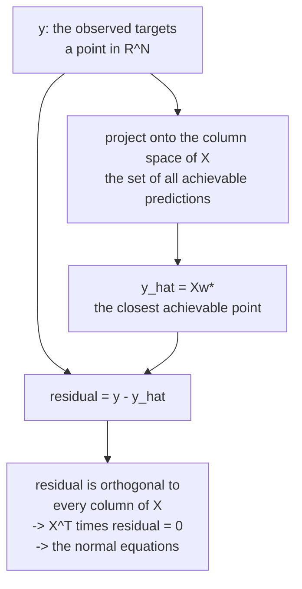

# Linear Models: The Ones You Must Be Able to Derive

Every interview reaches linear regression eventually, and it is not nostalgia.
Linear models are a family where you can derive the estimator, its
uncertainty, its regularised variants, and its failure modes end to end in a few
minutes — and every one of those derivations reappears, generalised, in the
models that replaced them. Ridge is weight decay. Logistic regression is a
one-layer network with cross-entropy. The bias–variance argument for
regularisation is the same argument at every scale.

## Linear regression

### The model

$$\hat{y} = w_0 + w_1x_1 + \cdots + w_dx_d = \mathbf{w}^\top\mathbf{x}$$

with a 1 prepended to $\mathbf{x}$ so the intercept is just another weight.
"Linear" means linear **in the parameters**, not in the inputs — $y = w_0 + w_1x
+ w_2x^2$ is a linear model with a non-linear feature.

### Derivation 1: least squares

Minimise the sum of squared residuals:

$$L(\mathbf{w}) = \|X\mathbf{w} - \mathbf{y}\|_2^2 = \mathbf{w}^\top X^\top X\mathbf{w} - 2\mathbf{y}^\top X\mathbf{w} + \mathbf{y}^\top\mathbf{y}$$

$$\nabla_{\mathbf{w}}L = 2X^\top X\mathbf{w} - 2X^\top\mathbf{y} = 0 \;\Longrightarrow\; \boxed{\mathbf{w}^\star = (X^\top X)^{-1}X^\top\mathbf{y}}$$

The inverse requires full column rank. In general the **normal equations** are $X^\top Xw=X^\top y$, and the pseudoinverse gives a minimum-norm solution. The name comes from the geometry: the
residual $\mathbf{y} - X\mathbf{w}^\star$ is orthogonal ("normal") to the column
space of $X$. The prediction $X\mathbf{w}^\star = H\mathbf{y}$ with
$H = X(X^\top X)^{-1}X^\top$ is an **orthogonal projection** of $\mathbf{y}$ onto
that column space — the closest point in the space of achievable predictions.



**Never compute this literally.** Forming $X^\top X$ squares the condition
number, so $\kappa(X^\top X) = \kappa(X)^2$. Use a QR or SVD-based solver
(`np.linalg.lstsq`, `sklearn.linear_model.LinearRegression`), which work with
$X$ directly.

### Derivation 2: maximum likelihood

Assume $y_i = \mathbf{w}^\top\mathbf{x}_i + \varepsilon_i$ with
$\varepsilon_i \sim \mathcal{N}(0,\sigma^2)$ i.i.d. Then

$$\log p(\mathbf{y}\mid X,\mathbf{w}) = -\frac{1}{2\sigma^2}\sum_i (y_i - \mathbf{w}^\top\mathbf{x}_i)^2 + \text{const}$$

Maximising this is exactly minimising squared error. **MSE is not an arbitrary
choice — it is the Gaussian likelihood.** Squared error still targets a conditional mean without Gaussian noise when required moments exist. Heavy tails can destabilize estimation; MAE targets a median, while Huber loss reduces sensitivity to large residuals.

### Assumptions, and what breaks

| Assumption | Violated by | Symptom | Fix |
|---|---|---|---|
| Correct conditional mean | omitted curvature or interactions | pattern in residuals vs fitted | splines, polynomials, trees |
| **I**ndependence of errors | time series, clustered data | autocorrelated residuals; Durbin–Watson | mixed models, GEE, time-series methods |
| **N**ormality of errors | heavy tails, skew | Q-Q plot departure | robust loss, transform the target |
| **E**qual variance (homoscedasticity) | multiplicative noise | funnel shape in residuals | log target, weighted least squares, robust SEs |
| No perfect multicollinearity | duplicated features | singular $X^\top X$, huge coefficients | drop, combine, or regularise |

Normality is the least important of these for *prediction* — asymptotic normality requires moment, dependence, and design conditions, not merely a large sample. It matters
for small-sample inference.

**Multicollinearity** is the one that bites. Two nearly-collinear features make
$X^\top X$ near-singular; coefficients become enormous with opposite signs and
vast standard errors, and they flip sign when you add a row. Predictions can
still be fine; **interpretation is what breaks.** Diagnose with the variance
inflation factor:

$$\mathrm{VIF}_j = \frac{1}{1-R_j^2}$$

where $R_j^2$ is from regressing feature $j$ on the others. Above 5–10 is a
warning.

### $R^2$ and its traps

$$R^2 = 1 - \frac{\mathrm{SS}_{\text{res}}}{\mathrm{SS}_{\text{tot}}}$$

- Training $R^2$ cannot decrease when adding columns to OLS on the same rows with an intercept. This does not apply to held-out or penalized fits. Use
  adjusted $R^2 = 1 - (1-R^2)\frac{n-1}{n-d-1}$ for in-sample comparison, or
  better, evaluate out of sample.
- $R^2$ can be **negative** out of sample, meaning you do worse than predicting
  the mean.
- A high $R^2$ says nothing about causality, correct specification, or
  usefulness. Anscombe's quartet has four datasets with identical $R^2$.

## Regularisation

Add a penalty on coefficient size:

$$L(\mathbf{w}) = \|X\mathbf{w}-\mathbf{y}\|_2^2 + \lambda\,\Omega(\mathbf{w})$$

| Method | $\Omega$ | Solution | Effect |
|---|---|---|---|
| **Ridge** (L2) | $\lVert\mathbf{w}\rVert_2^2$ | $(X^\top X+\lambda I)^{-1}X^\top\mathbf{y}$ | continuous shrinkage, not sparse selection |
| **Lasso** (L1) | $\lVert\mathbf{w}\rVert_1$ | no closed form; coordinate descent | drives coefficients **exactly** to zero |
| **Elastic net** | $\alpha\lVert\mathbf{w}\rVert_1 + \frac{1-\alpha}{2}\lVert\mathbf{w}\rVert_2^2$ | coordinate descent | sparsity plus grouping |

### Why L1 promotes sparsity

Two equivalent explanations, and knowing both is the point.

**Geometric.** The constrained form is "minimise the loss subject to
$\Omega(\mathbf{w}) \le t$". The L1 ball is a diamond with corners **on the
axes**; the L2 ball is a sphere with no corners. The elliptical loss contours
are overwhelmingly likely to first touch a diamond at a corner — where some
coordinate is exactly zero — and to touch a sphere at a generic point.

**Gradient.** The L2 gradient is $2\lambda w_j$, which shrinks toward zero
proportionally and vanishes as $w_j \to 0$; ridge can yield exact zeros, but does not promote sparse selection. Away from zero, the L1 subgradient is $\lambda\,\mathrm{sign}(w_j)$, constant magnitude
regardless of how small $w_j$ is. That constant push overwhelms a small data
gradient and pins the coefficient at exactly zero. The proximal operator makes
it explicit — **soft thresholding**:

$$w_j \leftarrow \mathrm{sign}(z_j)\max(|z_j| - \lambda,\; 0)$$

### The Bayesian reading

$$\arg\max_\mathbf{w} \; \log p(\mathcal{D}\mid\mathbf{w}) + \log p(\mathbf{w})$$

- Gaussian prior $\mathbf{w}\sim\mathcal{N}(0,\tau^2I)$ → **ridge**, with
  $\lambda = \sigma^2/\tau^2$.
- Laplace prior → **lasso**.

Regularisation is a prior. A stronger penalty is a narrower prior — a stronger
belief that coefficients are near zero before seeing data.

### Choosing between them

| Situation | Use |
|---|---|
| Many correlated features, all somewhat relevant | ridge |
| Few features truly matter, want selection | lasso |
| Correlated predictors, want more stable sparse selection | elastic net; explicit group selection requires a group penalty |
| $d \gg n$ | lasso has a sparse solution with at most the design rank active variables; nonunique solutions need qualification |
| Need a stable, interpretable coefficient set | elastic net or ridge; lasso is unstable under correlation |

**Lasso is unstable with correlated features**: among a group of near-identical
predictors it picks one essentially at random, and a slightly different sample
picks a different one. Elastic net's L2 component makes correlated features enter
or leave together — the "grouping effect".

**Choose feature scales before regularising.** The penalty treats all coefficients
in the same units; a feature measured in millimetres gets a coefficient 1,000 times smaller than in metres, and therefore a one-million-times smaller squared penalty for identical predictions. Standardization is a useful default, not a substitute for deliberate priors in physical units. Scikit-learn does not do this for you outside a Pipeline.

**Do not penalise the intercept.** Shrinking it toward zero biases predictions
toward zero rather than toward the data's mean.

## Logistic regression

OLS on a binary target is a linear probability model. It can be useful for some
estimands, but predictions may leave $[0,1]$, and binary residual variance depends
on the mean. Logistic regression directly models Bernoulli probabilities; lack
of Gaussian errors alone does not make OLS mathematically invalid.

### The model

Model the **log-odds** as linear:

$$\log\frac{p}{1-p} = \mathbf{w}^\top\mathbf{x} \;\Longleftrightarrow\; p = \sigma(\mathbf{w}^\top\mathbf{x}) = \frac{1}{1+e^{-\mathbf{w}^\top\mathbf{x}}}$$

The logit maps $(0,1)$ to $\mathbb{R}$, so a linear function can range freely
while the probability stays valid.

### The loss, derived

Bernoulli likelihood for one example: $p^{y}(1-p)^{1-y}$. Negative log-likelihood
over the dataset:

$$L(\mathbf{w}) = -\sum_i \left[y_i\log p_i + (1-y_i)\log(1-p_i)\right]$$

This is binary cross-entropy. It is **convex** in $\mathbf{w}$ (its Hessian
$X^\top S X$ with $S = \mathrm{diag}(p_i(1-p_i))$ is PSD). Convexity alone does not guarantee uniqueness or existence of a finite optimum; rank and separation matter. There is no closed form, so
solvers use Newton's method (IRLS), L-BFGS, or SAGA.

### The gradient, and why it is beautiful

$$\nabla_\mathbf{w} L = X^\top(\mathbf{p} - \mathbf{y})$$

Predicted minus actual, projected back through the features. Identical in form
to linear regression's gradient. This is not a coincidence — it holds for every
generalised linear model with its canonical link, and it is the same
$\mathbf{p}-\mathbf{y}$ that falls out of softmax + cross-entropy in a neural
network.

### Interpreting coefficients

$e^{w_j}$ is the **odds ratio**: a one-unit increase in $x_j$ multiplies the odds
by $e^{w_j}$, holding everything else fixed.

| $w_j$ | $e^{w_j}$ | Reading |
|---|---|---|
| 0 | 1 | no effect on the odds |
| 0.69 | 2.0 | doubles the odds |
| −0.69 | 0.5 | halves the odds |
| 2.30 | 10.0 | ten times the odds |

Two cautions. **Odds ratios are not risk ratios** — doubling odds from 0.01 to
0.02 is a small absolute change; doubling from 1 to 2 moves probability from 50%
to 67%. With strongly correlated features, "holding everything else fixed" may
describe poorly supported combinations, and coefficients are not automatically
effects of an intervention.

### Multiclass

**Softmax (multinomial) regression** generalises directly:

$$p_k = \frac{e^{\mathbf{w}_k^\top\mathbf{x}}}{\sum_j e^{\mathbf{w}_j^\top\mathbf{x}}}$$

Note the parameters are non-identifiable without a convention: adding the same vector to every
$\mathbf{w}_k$ leaves the probabilities unchanged — which is why regularisation
or fixing one class's weights to zero is needed for a unique solution.

The alternatives, **one-vs-rest** ($K$ binary classifiers) and **one-vs-one**
($\binom{K}{2}$ classifiers), do not produce a calibrated joint distribution and
need a tie-breaking rule. Prefer multinomial when the classes are mutually
exclusive.

### Separation

If a feature perfectly separates the classes, the likelihood is maximised by
sending its coefficient to $\pm\infty$. Unregularised logistic regression will
not converge — you get enormous coefficients and a warning. Positive regularization on separating directions usually restores a finite fit; an unpenalized intercept with only one observed class is a separate problem, which is why scikit-learn applies L2 by default (`C=1.0`), a default
that surprises people who expect an unpenalised fit. Note that `C` is the
*inverse* of regularisation strength: small `C` means strong regularisation.

## Generalised linear models

Linear and logistic regression are two members of one family:

$$g(\mathbb{E}[y\mid\mathbf{x}]) = \mathbf{w}^\top\mathbf{x}$$

for a **link function** $g$ and a response distribution from the exponential
family.

| Response | Distribution | Common link | Model |
|---|---|---|---|
| Continuous, symmetric | Gaussian | identity | linear regression |
| Binary | Bernoulli | logit | logistic regression |
| Count | Poisson | log | Poisson regression |
| Over-dispersed count | Negative binomial | log, generally not canonical | NB regression |
| Positive continuous, skewed | Gamma | log; inverse is canonical up to sign convention | Gamma regression |
| Continuous proportion in $(0,1)$ | Beta | logit for mean | also models precision; not an ordinary one-parameter GLM |
| Censored time to event | Exponential/Weibull | hazard/AFT-dependent | survival likelihood includes censoring |

**Poisson regression is the one people should reach for more often.** For
counts (visits, purchases, defects), it enforces non-negativity, models the
variance-equals-mean relationship, and has an interpretable multiplicative
structure — $e^{w_j}$ is a rate ratio. A linear MSE model can predict negative
values and uses a different variance/loss model. When conditional variance exceeds the mean
(over-dispersion, which is common), move to negative binomial.

For canonical-link exponential-dispersion GLMs, the negative-likelihood gradient is $X^\top(\mu-y)/\phi$ before observation weights. Noncanonical links introduce a derivative/variance factor.

## Other linear-model variants

| Model | Idea | Use for |
|---|---|---|
| **Polynomial regression** | add $x^2, x^3, x_ix_j$ terms | mild curvature; explodes with $d$ |
| **Splines / GAM** | smooth basis per feature, $\sum_j f_j(x_j)$ | non-linearity while staying interpretable |
| **Quantile regression** | pinball loss | prediction intervals, robust central tendency |
| **Huber regression** | quadratic near zero, linear in the tails | outliers without abandoning smoothness |
| **RANSAC / Theil–Sen** | fit on inlier subsets | heavy contamination |
| **Weighted least squares** | per-observation weights | known heteroscedasticity, importance weighting |
| **Bayesian linear regression** | posterior over $\mathbf{w}$ | genuine predictive uncertainty |
| **Partial least squares** | components maximising covariance with $y$ | $d\gg n$, spectroscopy-style data |
| **Mixed-effects models** | random intercepts/slopes per group | repeated measures, hierarchical data |

**GAMs deserve more attention than they get.** $y = \beta_0 + \sum_j f_j(x_j)$
with smooth $f_j$ captures feature-wise nonlinear effects with inspectable
partial functions. Interactions must be added explicitly, and correlation
complicates interpretation. `pygam`, `mgcv`, and Microsoft's Explainable Boosting Machine
(a GAM with pairwise interactions, fit by boosting) are the practical options,
and should be compared on identical folds rather than assumed to match a booster.

## Why linear models still matter

| Reason | Detail |
|---|---|
| **Baseline** | if a regularised linear model matches your deep model, the deep model is not earning its complexity |
| **Interpretability** | coefficients with confidence intervals; required in credit, insurance, medicine |
| **Extrapolation** | trees predict a constant outside the training range; linear models extend the trend |
| **Data efficiency** | a useful small-sample baseline when its inductive bias matches the problem |
| **Speed** | a dot product; microseconds, trivially deployable, no framework |
| **Calibration** | log-loss encourages honest probabilities; specification, regularization and shift still require calibration checks |
| **Building block** | the last layer of nearly every deep network is linear; embeddings + logistic regression is a strong text baseline |
| **Regulatory acceptance** | a scorecard derived from logistic regression is auditable in a way an ensemble is not |

## Diagnostics checklist

```python
import statsmodels.api as sm
model = sm.OLS(y, sm.add_constant(X)).fit()
print(model.summary())                 # coefficients, SEs, t-stats, CIs, R2, F
print(model.get_robust_cov_results("HC3").summary())   # heteroscedasticity-robust SEs
```

| Check | Tool | Threshold |
|---|---|---|
| Residuals vs fitted | scatter plot | no pattern, no funnel |
| Normality of residuals | Q-Q plot, Shapiro–Wilk | roughly on the line |
| Multicollinearity | VIF | $< 5$–$10$ |
| Influential points | Cook's distance | $> 4/n$ warrants a look |
| Autocorrelation | Durbin–Watson | near 2 |
| Heteroscedasticity | Breusch–Pagan | if significant, use robust SEs |
| Out-of-sample fit | cross-validated $R^2$ / log-loss | the number that actually matters |

`statsmodels` for inference, `scikit-learn` for prediction — they are optimised
for different questions, and using the wrong one is a common time sink.


## Least squares as a complete experiment

### A worked fit and an independent numerical check

Take $x=(0,1,2)$ and $y=(1,2,2)$. The slope is
$\sum(x_i-\bar x)(y_i-\bar y)/\sum(x_i-\bar x)^2=1/2$ and the intercept is
$7/6$. Predictions are $(7/6,5/3,13/6)$; residuals are $(-1/6,1/3,-1/6)$.
Both the residual sum and its dot product with $x$ are zero. RSS is $1/6$.

The distinction between coefficients and predictions matters in rank-deficient
problems. Duplicating a feature makes its individual coefficient non-identifiable,
but the training projection remains unique. A minimum-norm solution is a
convention for selecting coefficients, not evidence that each duplicated
feature contributes half of a causal effect.

```python runnable
import numpy as np
from sklearn.linear_model import LinearRegression
from sklearn.metrics import mean_squared_error

X = np.array([0.0, 1.0, 2.0])[:, None]
y = np.array([1.0, 2.0, 2.0])
A = np.column_stack([np.ones(len(X)), X])
beta, _, rank, singular = np.linalg.lstsq(A, y, rcond=None)
model = LinearRegression().fit(X, y)
pred = model.predict(X)
assert rank == 2
assert np.allclose(beta, [7 / 6, 1 / 2])
assert np.allclose(A @ beta, pred)
assert np.allclose(A.T @ (y - pred), 0, atol=1e-12)
assert np.isclose(mean_squared_error(y, pred), 1 / 18)
print("Intercept and slope:", beta)
print("Residuals:", y - pred)
print("Singular values:", singular)
```

This checks training algebra, not generalization. Under squared-error risk,
$E[(Y-a)^2\mid x]=\operatorname{Var}(Y\mid x)+(E[Y\mid x]-a)^2$.
Consequently, the target is the conditional mean. If that mean is nonlinear,
OLS finds a distribution-dependent linear approximation rather than discovering
a universally correct line.

### Fit, predict, compare a baseline

All preprocessing belongs inside the fitted pipeline. Although scaling is not
necessary for ordinary OLS predictions, keeping it inside a pipeline makes
later regularized comparisons consistent. A random split is appropriate for
the independent synthetic observations below; repeated users, sites, and time
series require a different split.

```python runnable
import numpy as np
from sklearn.datasets import make_regression
from sklearn.dummy import DummyRegressor
from sklearn.impute import SimpleImputer
from sklearn.linear_model import LinearRegression
from sklearn.metrics import mean_absolute_error, mean_squared_error, r2_score
from sklearn.model_selection import train_test_split
from sklearn.pipeline import make_pipeline
from sklearn.preprocessing import StandardScaler

X, y = make_regression(n_samples=450, n_features=6, n_informative=4,
                       noise=15, random_state=12)
X_train, X_test, y_train, y_test = train_test_split(
    X, y, test_size=0.25, random_state=12)
model = make_pipeline(SimpleImputer(strategy="median"), StandardScaler(),
                      LinearRegression())
model.fit(X_train, y_train)
pred = model.predict(X_test)
baseline = DummyRegressor().fit(X_train, y_train).predict(X_test)
assert pred.shape == y_test.shape and np.isfinite(pred).all()
assert mean_squared_error(y_test, pred) < mean_squared_error(y_test, baseline)
print({"MAE": mean_absolute_error(y_test, pred),
       "RMSE": np.sqrt(mean_squared_error(y_test, pred)),
       "R2": r2_score(y_test, pred)})
print("Test residual mean:", np.mean(y_test - pred))
```

The assertion is specific to this deliberately linear experiment. A model can
fail to beat a baseline on real data. Test residuals need not sum to zero, and
a small average residual does not rule out subgroup bias or missing curvature.
Report errors in target units and inspect the worst cases, not only aggregate
$R^2$. If the target is constant, the usual $R^2$ denominator is zero; library
conventions for that edge case should not become scientific conclusions.

## Regularization beyond the penalty table

### Singular values explain ridge

For centered $X=USV^\top$ and summed squared-error ridge,

$$\hat w_\lambda=V\operatorname{diag}\left(\frac{s_j}{s_j^2+\lambda}\right)U^\top y,
\qquad
\hat y_\lambda=U\operatorname{diag}\left(\frac{s_j^2}{s_j^2+\lambda}\right)U^\top y.$$

OLS divides by small singular values and amplifies noise. Ridge damps precisely
those weakly identified directions. Its effective degrees of freedom for
centered fitted values are $\sum_j s_j^2/(s_j^2+\lambda)$, plus the intercept
when present. The model retains all columns but has less effective flexibility.

For normalized lasso,
$\|y-Xw\|^2/(2n)+\alpha\|w\|_1$, the KKT zero condition is

$w_j=0 \quad\Longrightarrow\quad
\left|X_j^\top(y-Xw)/n\right|\le\alpha.$

At zero, the absolute-value subgradient is the interval $[-1,1]$. That interval,
rather than a vague claim about gradient descent eventually reaching zero,
explains sparsity. With orthonormal normalized columns, the solution is
soft-thresholding of the unpenalized coordinates.

Scikit-learn's ridge uses a summed squared loss, while lasso and elastic net
normalize squared error by $2n$. Identical numeric alpha values do not mean
identical regularization strength. Gaussian-prior ridge and Laplace-prior lasso
are MAP estimators; MAP is one posterior mode, not a full posterior uncertainty
distribution. Centering before the slope calculation is also what makes the
ridge identity consistent with leaving the intercept unpenalized.

### A training-only hyperparameter comparison

```python runnable
import numpy as np
from sklearn.cross_decomposition import PLSRegression
from sklearn.datasets import make_regression
from sklearn.linear_model import BayesianRidge, ElasticNet, Lasso, Ridge
from sklearn.metrics import mean_squared_error
from sklearn.model_selection import GridSearchCV, KFold, train_test_split
from sklearn.pipeline import Pipeline
from sklearn.preprocessing import StandardScaler

X, y = make_regression(n_samples=180, n_features=20, n_informative=5,
                       noise=18, random_state=7)
X[:, 10:15] = X[:, :5] + 0.03 * np.random.default_rng(7).normal(size=(180, 5))
X_train, X_test, y_train, y_test = train_test_split(X, y, random_state=7)
cv = KFold(n_splits=3, shuffle=True, random_state=7)
for name, estimator in [("ridge", Ridge()), ("lasso", Lasso(max_iter=15000)),
                        ("elastic", ElasticNet(l1_ratio=0.5, max_iter=15000))]:
    search = GridSearchCV(
        Pipeline([("scale", StandardScaler()), ("model", estimator)]),
        {"model__alpha": [0.1, 1.0, 10.0]}, cv=cv,
        scoring="neg_mean_squared_error", n_jobs=1)
    search.fit(X_train, y_train)
    pred = search.predict(X_test)
    assert np.isfinite(pred).all()
    print(name, search.best_params_, np.sqrt(mean_squared_error(y_test, pred)))
for name, estimator in [("Bayesian ridge", BayesianRidge()),
                        ("PLS", PLSRegression(n_components=5))]:
    pipe = Pipeline([("scale", StandardScaler()), ("model", estimator)])
    pipe.fit(X_train, y_train)
    pred = np.asarray(pipe.predict(X_test)).reshape(-1)
    assert pred.shape == y_test.shape
    print(name, np.sqrt(mean_squared_error(y_test, pred)))
```

PLS components use labels, unlike PCA, so their fitting must stay inside
supervised folds. Bayesian ridge's posterior depends on its prior and likelihood;
its reported uncertainty is not automatically calibrated under misspecification.
Repeatedly modifying this experiment after reading test scores would convert
the test set into a validation set. Nested CV or a fresh final holdout is needed
for honest selection among many model families.

## Logistic regression as a complete experiment

### Stable loss and one Newton update

Using score $z=A\beta$, write the Bernoulli loss as
$\sum_i[\operatorname{logaddexp}(0,z_i)-y_i z_i]$. This avoids taking logarithms
of probabilities rounded to zero. Newton's method solves

$A^\top W A\,\Delta=A^\top(p-y),\qquad
\beta_{\mathrm{new}}=\beta-\Delta,\qquad W_{ii}=p_i(1-p_i).$

IRLS expresses the same step as weighted least squares on the working response
$z+(y-p)/(p(1-p))$. Near-zero weights can make that expression unstable.
Practical solvers use regularization and numerical safeguards. L-BFGS avoids
forming a dense Hessian; SAGA is useful for large sparse inputs and compatible
L1/elastic-net objectives. Solver support is an API contract, not every
combination of solver and penalty is valid.

A coefficient changes probability by $w_jp(1-p)$ locally. Doubling odds at
probability 0.2 gives odds 0.5 and probability $1/3$, not 0.4. Starting at 0.8,
doubling odds gives $8/9$. Coefficients are conditional associations; correlated
features may make the hypothetical one-feature intervention unsupported.

### Probability quality and decision quality

```python runnable
import numpy as np
from sklearn.datasets import load_breast_cancer
from sklearn.linear_model import LogisticRegression
from sklearn.metrics import (balanced_accuracy_score, brier_score_loss,
                             confusion_matrix, log_loss, roc_auc_score)
from sklearn.model_selection import GridSearchCV, StratifiedKFold, train_test_split
from sklearn.pipeline import Pipeline
from sklearn.preprocessing import StandardScaler

X, y = load_breast_cancer(return_X_y=True)
X_train, X_test, y_train, y_test = train_test_split(
    X, y, test_size=0.25, stratify=y, random_state=19)
search = GridSearchCV(
    Pipeline([("scale", StandardScaler()),
              ("model", LogisticRegression(solver="lbfgs", max_iter=1500))]),
    {"model__C": [0.01, 0.1, 1.0]}, scoring="neg_log_loss",
    cv=StratifiedKFold(3, shuffle=True, random_state=19), n_jobs=1)
search.fit(X_train, y_train)
p = search.predict_proba(X_test)[:, 1]
pred = search.predict(X_test)
assert np.isfinite(p).all() and ((p >= 0) & (p <= 1)).all()
assert np.array_equal(pred, (p >= 0.5).astype(int))
assert roc_auc_score(y_test, p) > 0.85
print("Chosen C:", search.best_params_)
print({"log_loss": log_loss(y_test, p), "Brier": brier_score_loss(y_test, p),
       "ROC AUC": roc_auc_score(y_test, p),
       "balanced_accuracy": balanced_accuracy_score(y_test, pred)})
print("Confusion matrix:\n", confusion_matrix(y_test, pred))
```

This built-in dataset is an offline educational task, not a clinically validated
model. Log-loss and Brier score assess probabilities; AUC assesses ranking;
a confusion matrix assesses a threshold. Optimizing one does not guarantee the
others. With calibrated probabilities and only false-positive/false-negative
costs, predict positive when $p>C_{FP}/(C_{FP}+C_{FN})$. Specify costs or choose
a policy on validation data before looking at the final test set.

Class weighting, resampling, and case-control sampling can change the implied
class prior. They are not free probability corrections. Reliability diagnostics
should reflect the intended deployment population. In multilabel classification,
several labels can be true, so independent binary probabilities should not be
forced to sum to one as if the labels were mutually exclusive.

## Counts, exposure, and robust prediction

### Exposure is an offset, not an ordinary covariate

If a rate is $r_i=\exp(b+x_i^\top w)$ and observation time is $t_i$, expected
count is $t_i r_i$. The log mean contains $\log t_i$ with coefficient fixed to
one. Fitting count divided by exposure with sample weight equal to exposure
gives the same coefficient-dependent Poisson objective, with consistent penalty
normalization.

```python runnable
import numpy as np
from sklearn.linear_model import PoissonRegressor
from sklearn.metrics import mean_poisson_deviance
from sklearn.model_selection import train_test_split

rng = np.random.default_rng(4)
X = rng.normal(size=(500, 2))
exposure = rng.uniform(0.5, 3.0, size=500)
rate = np.exp(0.3 + X @ np.array([0.5, -0.25]))
counts = rng.poisson(exposure * rate)
train, test = train_test_split(np.arange(500), random_state=4)
model = PoissonRegressor(alpha=0.01, max_iter=500)
model.fit(X[train], counts[train] / exposure[train],
          sample_weight=exposure[train])
pred = exposure[test] * model.predict(X[test])
baseline = exposure[test] * counts[train].sum() / exposure[train].sum()
assert (pred > 0).all()
assert mean_poisson_deviance(counts[test], pred) < mean_poisson_deviance(counts[test], baseline)
print("Poisson deviance:", mean_poisson_deviance(counts[test], pred))
```

Overdispersion can arise from omitted predictors, dependence, heterogeneous
rates, or a different count process. A marginal variance larger than the marginal
mean does not alone reject a conditional Poisson model. Examine conditional
residual behavior. Hurdle and zero-inflated models make additional assumptions
about how zeros arise; they are not automatic replacements for every zero-heavy
dataset.

### Robust losses and nonlinear bases

Huber regression reduces the influence of large residuals, but leverage outliers
can still matter. RANSAC requires enough genuine inliers for consensus to find
the intended relationship. Theil-Sen aggregates subset-based fits. Quantile
regression targets a conditional quantile through pinball loss
$\rho_\tau(r)=r(\tau-\mathbf1[r<0])$; an upper quantile is not a confidence
interval for a mean. Separately fitted quantiles can cross.

```python runnable
import numpy as np
from sklearn.linear_model import (HuberRegressor, LinearRegression,
                                  QuantileRegressor, RANSACRegressor, Ridge,
                                  TheilSenRegressor)
from sklearn.metrics import mean_absolute_error, mean_pinball_loss
from sklearn.model_selection import train_test_split
from sklearn.pipeline import make_pipeline
from sklearn.preprocessing import PolynomialFeatures, SplineTransformer

rng = np.random.default_rng(8)
X = rng.uniform(-2, 2, size=(160, 1))
y = 1 + 2 * X[:, 0] + rng.normal(0, 0.3, size=160)
X_train, X_test, y_train, y_test = train_test_split(X, y, random_state=8)
y_corrupt = y_train.copy()
y_corrupt[::12] += 12
models = {
    "OLS": LinearRegression(), "Huber": HuberRegressor(),
    "RANSAC": RANSACRegressor(random_state=8),
    "Theil-Sen": TheilSenRegressor(random_state=8, max_subpopulation=300),
    "polynomial": make_pipeline(PolynomialFeatures(2, include_bias=False), Ridge()),
    "spline": make_pipeline(SplineTransformer(n_knots=4), Ridge()),
}
for name, model in models.items():
    model.fit(X_train, y_corrupt)
    pred = model.predict(X_test)
    assert np.isfinite(pred).all()
    print(name, "clean-test MAE", mean_absolute_error(y_test, pred))
quantile = QuantileRegressor(quantile=0.9, alpha=0.01, solver="highs")
quantile.fit(X_train, y_train)
upper = quantile.predict(X_test)
assert np.isfinite(upper).all()
print("Pinball loss:", mean_pinball_loss(y_test, upper, alpha=0.9))
print("Observed upper-quantile coverage:", np.mean(y_test <= upper))
```

Polynomial and spline basis size is a model-capacity choice. Additive GAMs need
explicit interaction terms when joint effects matter. Weighted least squares
is OLS on rows multiplied by square-root weights, but frequency, importance,
and inverse-noise weights have different inferential interpretations.

Mixed-effects models add random group intercepts/slopes and partially pool
groups. Predicting an observed user's outcome is not the same task as predicting
a new user's outcome with no known random effect. This distinction should
determine the validation split before choosing a library or covariance estimator.

## Uncertainty and diagnostic reasoning

For a full-rank homoscedastic model,
$\operatorname{Cov}(\hat\beta\mid A)=\sigma^2(A^\top A)^{-1}$.
Estimate $\sigma^2$ by RSS divided by $n-p$, including the intercept in $p$.
At a new row $a_*$, variance of the estimated mean is
$s^2a_*^\top(A^\top A)^{-1}a_*$. A prediction interval adds another $s^2$
for a new observation's noise. Mean confidence intervals and prediction
intervals therefore answer different questions.

Leverage $h_{ii}$ is a diagonal of the projection matrix. It describes an
unusual feature row, not necessarily an incorrect label. Cook's distance combines
leverage with residual size. A threshold such as $4/n$ should trigger review,
not automatic deletion: a valid rare observation may be operationally important.

Heteroscedasticity-robust HC3 covariance uses the sandwich

$$(A^\top A)^{-1}A^\top
\operatorname{diag}\left(\frac{r_i^2}{(1-h_{ii})^2}\right)
A(A^\top A)^{-1}.$$

It changes uncertainty estimates, not the fitted mean. Cluster-robust covariance
and temporal covariance estimators handle different dependence structures.
None repairs target leakage or omitted confounding. Likewise, intervals computed
after selecting variables on the same labels generally ignore selection
uncertainty. Report what was selected, how it was selected, and whether inference
is conditional on that selection.

A good diagnosis follows a question: curvature suggests a missing mean term;
a funnel suggests changing variance; serial residual structure suggests
dependence; unstable slopes with stable predictions suggest weak identification.
Statistical tests are supporting evidence. With large samples trivial departures
can be significant, and with small samples important departures can go undetected.

## Solved extensions

1. **Two duplicate columns receive different slopes after a tiny perturbation.
   Is prediction necessarily broken?** No. The identifiable combination may be
   stable while individual slopes are not. Inspect singular directions and
   held-out predictions.
2. **A coefficient is zero under ridge. Is the implementation wrong?** No.
   Ridge does not induce threshold sparsity, but exact zeros are possible.
3. **A logistic Hessian is PSD. Must a finite minimizer exist?** No: separation
   can drive coefficients to infinity; flat directions can defeat uniqueness.
4. **Doubling odds at probability 0.2 gives what?** Odds 0.25 become 0.5,
   yielding probability 1/3.
5. **Why is a 90% quantile not a 90% mean confidence bound?** It concerns future
   conditional outcomes, not uncertainty about the estimated conditional mean.
6. **Why is scaling on all rows before CV leakage?** Validation observations
   influenced a learned transform. Put the transform inside each training fold.

## References

- [Scikit-learn linear models](https://scikit-learn.org/stable/modules/linear_model.html): objectives and solver conventions.
- [LogisticRegression API](https://scikit-learn.org/stable/modules/generated/sklearn.linear_model.LogisticRegression.html): compatible solvers and probability methods.
- [Calibration guide](https://scikit-learn.org/stable/modules/calibration.html): reliability and leakage-safe calibration.
- [Statsmodels GLMs](https://www.statsmodels.org/stable/glm.html): families, links, and inference.
- [NumPy least squares](https://numpy.org/doc/stable/reference/generated/numpy.linalg.lstsq.html): rank-aware solution and diagnostics.
- [Linear algebra](../math/linear-algebra.md): projections, SVD, and conditioning.

## Self-check

1. Derive the normal equations and say why you should not implement them
   literally.
2. Explain both the geometric and the gradient argument for why L1 produces
   exact zeros.
3. What prior corresponds to ridge, and what is $\lambda$ in terms of its
   variance?
4. Why does logistic regression use log-odds rather than modelling $p$ directly?
5. Your logistic regression will not converge and one coefficient is $10^{15}$.
   What happened and what is the one-line fix?
6. Your target is a count of daily events. Give the correct GLM, the link, and
   two things MSE gets wrong.
7. Two features have VIF 40. What is broken, what is not, and what would you do?

## Where to go next

- [Trees & Ensembles](./trees-and-ensembles.md) — the non-linear, non-parametric
  alternative.
- [Bias–Variance & Generalization](./bias-variance-and-generalization.md) — why
  regularisation helps, formally.
- [Model Evaluation](./model-evaluation.md) — measuring whether any of it worked.
