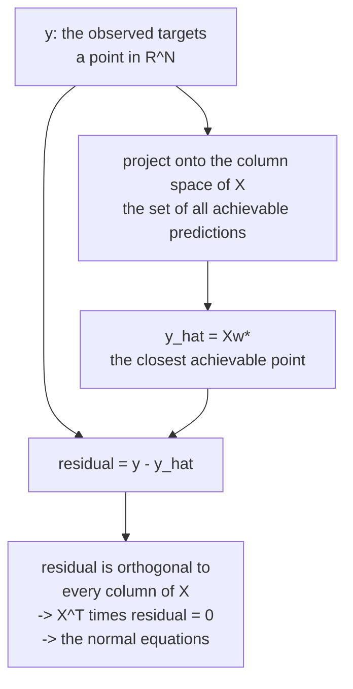

# Linear Models: The Ones You Must Be Able to Derive

Every interview reaches linear regression eventually, and it is not nostalgia.
Linear models are the only family where you can derive the estimator, its
uncertainty, its regularised variants, and its failure modes end to end in a few
minutes — and every one of those derivations reappears, generalised, in the
models that replaced them. Ridge is weight decay. Logistic regression is a
one-layer network with cross-entropy. The bias–variance argument for
regularisation is the same argument at every scale.

## Linear regression

### The model

$$\hat{y} = w_0 + w_1x_1 + \cdots + w_dx_d = \mathbf{w}^\top\mathbf{x}$$

with a 1 prepended to $\mathbf{x}$ so the intercept is just another weight.
"Linear" means linear **in the parameters**, not in the inputs — $y = w_0 + w_1x
+ w_2x^2$ is a linear model with a non-linear feature.

### Derivation 1: least squares

Minimise the sum of squared residuals:

$$L(\mathbf{w}) = \|X\mathbf{w} - \mathbf{y}\|_2^2 = \mathbf{w}^\top X^\top X\mathbf{w} - 2\mathbf{y}^\top X\mathbf{w} + \mathbf{y}^\top\mathbf{y}$$

$$\nabla_{\mathbf{w}}L = 2X^\top X\mathbf{w} - 2X^\top\mathbf{y} = 0 \;\Longrightarrow\; \boxed{\mathbf{w}^\star = (X^\top X)^{-1}X^\top\mathbf{y}}$$

These are the **normal equations**. The name comes from the geometry: the
residual $\mathbf{y} - X\mathbf{w}^\star$ is orthogonal ("normal") to the column
space of $X$. The prediction $X\mathbf{w}^\star = H\mathbf{y}$ with
$H = X(X^\top X)^{-1}X^\top$ is an **orthogonal projection** of $\mathbf{y}$ onto
that column space — the closest point in the space of achievable predictions.



**Never compute this literally.** Forming $X^\top X$ squares the condition
number, so $\kappa(X^\top X) = \kappa(X)^2$. Use a QR or SVD-based solver
(`np.linalg.lstsq`, `sklearn.linear_model.LinearRegression`), which work with
$X$ directly.

### Derivation 2: maximum likelihood

Assume $y_i = \mathbf{w}^\top\mathbf{x}_i + \varepsilon_i$ with
$\varepsilon_i \sim \mathcal{N}(0,\sigma^2)$ i.i.d. Then

$$\log p(\mathbf{y}\mid X,\mathbf{w}) = -\frac{1}{2\sigma^2}\sum_i (y_i - \mathbf{w}^\top\mathbf{x}_i)^2 + \text{const}$$

Maximising this is exactly minimising squared error. **MSE is not an arbitrary
choice — it is the Gaussian likelihood.** If your residuals are heavy-tailed,
MSE is wrong for a principled reason, and MAE (the Laplace likelihood) or Huber
loss is the fix.

### Assumptions, and what breaks

| Assumption | Violated by | Symptom | Fix |
|---|---|---|---|
| **L**inearity in parameters | curved relationships | pattern in residuals vs fitted | splines, polynomials, trees |
| **I**ndependence of errors | time series, clustered data | autocorrelated residuals; Durbin–Watson | mixed models, GEE, time-series methods |
| **N**ormality of errors | heavy tails, skew | Q-Q plot departure | robust loss, transform the target |
| **E**qual variance (homoscedasticity) | multiplicative noise | funnel shape in residuals | log target, weighted least squares, robust SEs |
| No perfect multicollinearity | duplicated features | singular $X^\top X$, huge coefficients | drop, combine, or regularise |

Normality is the least important of these for *prediction* — the CLT makes
coefficient estimates approximately normal for large $n$ regardless. It matters
for small-sample inference.

**Multicollinearity** is the one that bites. Two nearly-collinear features make
$X^\top X$ near-singular; coefficients become enormous with opposite signs and
vast standard errors, and they flip sign when you add a row. Predictions can
still be fine; **interpretation is what breaks.** Diagnose with the variance
inflation factor:

$$\mathrm{VIF}_j = \frac{1}{1-R_j^2}$$

where $R_j^2$ is from regressing feature $j$ on the others. Above 5–10 is a
warning.

### $R^2$ and its traps

$$R^2 = 1 - \frac{\mathrm{SS}_{\text{res}}}{\mathrm{SS}_{\text{tot}}}$$

- $R^2$ **never decreases** when you add a feature, even a random one. Use
  adjusted $R^2 = 1 - (1-R^2)\frac{n-1}{n-d-1}$ for in-sample comparison, or
  better, evaluate out of sample.
- $R^2$ can be **negative** out of sample, meaning you do worse than predicting
  the mean.
- A high $R^2$ says nothing about causality, correct specification, or
  usefulness. Anscombe's quartet has four datasets with identical $R^2$.

## Regularisation

Add a penalty on coefficient size:

$$L(\mathbf{w}) = \|X\mathbf{w}-\mathbf{y}\|_2^2 + \lambda\,\Omega(\mathbf{w})$$

| Method | $\Omega$ | Solution | Effect |
|---|---|---|---|
| **Ridge** (L2) | $\lVert\mathbf{w}\rVert_2^2$ | $(X^\top X+\lambda I)^{-1}X^\top\mathbf{y}$ | shrinks all coefficients; none reach zero |
| **Lasso** (L1) | $\lVert\mathbf{w}\rVert_1$ | no closed form; coordinate descent | drives coefficients **exactly** to zero |
| **Elastic net** | $\alpha\lVert\mathbf{w}\rVert_1 + \frac{1-\alpha}{2}\lVert\mathbf{w}\rVert_2^2$ | coordinate descent | sparsity plus grouping |

### Why L1 gives exact zeros and L2 does not

Two equivalent explanations, and knowing both is the point.

**Geometric.** The constrained form is "minimise the loss subject to
$\Omega(\mathbf{w}) \le t$". The L1 ball is a diamond with corners **on the
axes**; the L2 ball is a sphere with no corners. The elliptical loss contours
are overwhelmingly likely to first touch a diamond at a corner — where some
coordinate is exactly zero — and to touch a sphere at a generic point.

**Gradient.** The L2 gradient is $2\lambda w_j$, which shrinks toward zero
proportionally and vanishes as $w_j \to 0$ — an asymptotic approach, never
arrival. The L1 subgradient is $\lambda\,\mathrm{sign}(w_j)$, constant magnitude
regardless of how small $w_j$ is. That constant push overwhelms a small data
gradient and pins the coefficient at exactly zero. The proximal operator makes
it explicit — **soft thresholding**:

$$w_j \leftarrow \mathrm{sign}(z_j)\max(|z_j| - \lambda,\; 0)$$

### The Bayesian reading

$$\arg\max_\mathbf{w} \; \log p(\mathcal{D}\mid\mathbf{w}) + \log p(\mathbf{w})$$

- Gaussian prior $\mathbf{w}\sim\mathcal{N}(0,\tau^2I)$ → **ridge**, with
  $\lambda = \sigma^2/\tau^2$.
- Laplace prior → **lasso**.

Regularisation is a prior. A stronger penalty is a narrower prior — a stronger
belief that coefficients are near zero before seeing data.

### Choosing between them

| Situation | Use |
|---|---|
| Many correlated features, all somewhat relevant | ridge |
| Few features truly matter, want selection | lasso |
| Correlated groups, want group selection | elastic net |
| $d \gg n$ | lasso selects at most $n$ features; elastic net does not have that cap |
| Need a stable, interpretable coefficient set | elastic net or ridge; lasso is unstable under correlation |

**Lasso is unstable with correlated features**: among a group of near-identical
predictors it picks one essentially at random, and a slightly different sample
picks a different one. Elastic net's L2 component makes correlated features enter
or leave together — the "grouping effect".

**Always standardise before regularising.** The penalty treats all coefficients
in the same units; a feature measured in millimetres gets a coefficient 1,000×
larger than the same feature in metres, and is therefore penalised 1,000,000×
more under L2. Scikit-learn does not do this for you outside a Pipeline.

**Do not penalise the intercept.** Shrinking it toward zero biases predictions
toward zero rather than toward the data's mean.

## Logistic regression

Linear regression on a binary target is wrong in three ways: it predicts values
outside $[0,1]$, its errors are not Gaussian, and its variance depends on the
mean. Logistic regression fixes all three.

### The model

Model the **log-odds** as linear:

$$\log\frac{p}{1-p} = \mathbf{w}^\top\mathbf{x} \;\Longleftrightarrow\; p = \sigma(\mathbf{w}^\top\mathbf{x}) = \frac{1}{1+e^{-\mathbf{w}^\top\mathbf{x}}}$$

The logit maps $[0,1]$ to $\mathbb{R}$, so a linear function can range freely
while the probability stays valid.

### The loss, derived

Bernoulli likelihood for one example: $p^{y}(1-p)^{1-y}$. Negative log-likelihood
over the dataset:

$$L(\mathbf{w}) = -\sum_i \left[y_i\log p_i + (1-y_i)\log(1-p_i)\right]$$

This is binary cross-entropy. It is **convex** in $\mathbf{w}$ (its Hessian
$X^\top S X$ with $S = \mathrm{diag}(p_i(1-p_i))$ is PSD), so there is a unique
optimum and any reasonable optimiser finds it. There is no closed form, so
solvers use Newton's method (IRLS), L-BFGS, or SAGA.

### The gradient, and why it is beautiful

$$\nabla_\mathbf{w} L = X^\top(\mathbf{p} - \mathbf{y})$$

Predicted minus actual, projected back through the features. Identical in form
to linear regression's gradient. This is not a coincidence — it holds for every
generalised linear model with its canonical link, and it is the same
$\mathbf{p}-\mathbf{y}$ that falls out of softmax + cross-entropy in a neural
network.

### Interpreting coefficients

$e^{w_j}$ is the **odds ratio**: a one-unit increase in $x_j$ multiplies the odds
by $e^{w_j}$, holding everything else fixed.

| $w_j$ | $e^{w_j}$ | Reading |
|---|---|---|
| 0 | 1 | no effect on the odds |
| 0.69 | 2.0 | doubles the odds |
| −0.69 | 0.5 | halves the odds |
| 2.30 | 10.0 | ten times the odds |

Two cautions. **Odds ratios are not risk ratios** — doubling odds from 0.01 to
0.02 is a small absolute change; doubling from 1 to 2 moves probability from 50%
to 67%. And "holding everything else fixed" is meaningless when features are
correlated.

### Multiclass

**Softmax (multinomial) regression** generalises directly:

$$p_k = \frac{e^{\mathbf{w}_k^\top\mathbf{x}}}{\sum_j e^{\mathbf{w}_j^\top\mathbf{x}}}$$

Note the parameters are over-determined — adding a constant to every
$\mathbf{w}_k$ leaves the probabilities unchanged — which is why regularisation
or fixing one class's weights to zero is needed for a unique solution.

The alternatives, **one-vs-rest** ($K$ binary classifiers) and **one-vs-one**
($\binom{K}{2}$ classifiers), do not produce a calibrated joint distribution and
need a tie-breaking rule. Prefer multinomial when the classes are mutually
exclusive.

### Separation

If a feature perfectly separates the classes, the likelihood is maximised by
sending its coefficient to $\pm\infty$. Unregularised logistic regression will
not converge — you get enormous coefficients and a warning. **Any regularisation
fixes it**, which is why scikit-learn applies L2 by default (`C=1.0`), a default
that surprises people who expect an unpenalised fit. Note that `C` is the
*inverse* of regularisation strength: small `C` means strong regularisation.

## Generalised linear models

Linear and logistic regression are two members of one family:

$$g(\mathbb{E}[y\mid\mathbf{x}]) = \mathbf{w}^\top\mathbf{x}$$

for a **link function** $g$ and a response distribution from the exponential
family.

| Response | Distribution | Canonical link | Model |
|---|---|---|---|
| Continuous, symmetric | Gaussian | identity | linear regression |
| Binary | Bernoulli | logit | logistic regression |
| Count | Poisson | log | Poisson regression |
| Over-dispersed count | Negative binomial | log | NB regression |
| Positive continuous, skewed | Gamma | log or inverse | Gamma regression |
| Proportion in $[0,1]$ | Beta | logit | Beta regression |
| Time to event | Exponential/Weibull | log | survival models |

**Poisson regression is the one people should reach for more often.** For
counts (visits, purchases, defects), it enforces non-negativity, models the
variance-equals-mean relationship, and has an interpretable multiplicative
structure — $e^{w_j}$ is a rate ratio. Using MSE on counts predicts negative
values and mis-weights the large observations. When variance exceeds the mean
(over-dispersion, which is common), move to negative binomial.

For all GLMs, the gradient is $X^\top(\hat{\mathbf{y}} - \mathbf{y})$ under the
canonical link. One derivation covers the family.

## Other linear-model variants

| Model | Idea | Use for |
|---|---|---|
| **Polynomial regression** | add $x^2, x^3, x_ix_j$ terms | mild curvature; explodes with $d$ |
| **Splines / GAM** | smooth basis per feature, $\sum_j f_j(x_j)$ | non-linearity while staying interpretable |
| **Quantile regression** | pinball loss | prediction intervals, robust central tendency |
| **Huber regression** | quadratic near zero, linear in the tails | outliers without abandoning smoothness |
| **RANSAC / Theil–Sen** | fit on inlier subsets | heavy contamination |
| **Weighted least squares** | per-observation weights | known heteroscedasticity, importance weighting |
| **Bayesian linear regression** | posterior over $\mathbf{w}$ | genuine predictive uncertainty |
| **Partial least squares** | components maximising covariance with $y$ | $d\gg n$, spectroscopy-style data |
| **Mixed-effects models** | random intercepts/slopes per group | repeated measures, hierarchical data |

**GAMs deserve more attention than they get.** $y = \beta_0 + \sum_j f_j(x_j)$
with smooth $f_j$ captures most of the non-linearity boosted trees find, while
remaining fully interpretable — you can plot every $f_j$ and see exactly what
the model believes. `pygam`, `mgcv`, and Microsoft's Explainable Boosting Machine
(a GAM with pairwise interactions, fit by boosting) are the practical options,
and EBM is often within a point of a black-box booster.

## Why linear models still matter

| Reason | Detail |
|---|---|
| **Baseline** | if a regularised linear model matches your deep model, the deep model is not earning its complexity |
| **Interpretability** | coefficients with confidence intervals; required in credit, insurance, medicine |
| **Extrapolation** | trees predict a constant outside the training range; linear models extend the trend |
| **Data efficiency** | with 200 rows and 20 features, a linear model is the correct capacity |
| **Speed** | a dot product; microseconds, trivially deployable, no framework |
| **Calibration** | logistic regression optimises log-loss and is well calibrated by construction |
| **Building block** | the last layer of nearly every deep network is linear; embeddings + logistic regression is a strong text baseline |
| **Regulatory acceptance** | a scorecard derived from logistic regression is auditable in a way an ensemble is not |

## Diagnostics checklist

```python
import statsmodels.api as sm
model = sm.OLS(y, sm.add_constant(X)).fit()
print(model.summary())                 # coefficients, SEs, t-stats, CIs, R2, F
print(model.get_robust_cov_results("HC3").summary())   # heteroscedasticity-robust SEs
```

| Check | Tool | Threshold |
|---|---|---|
| Residuals vs fitted | scatter plot | no pattern, no funnel |
| Normality of residuals | Q-Q plot, Shapiro–Wilk | roughly on the line |
| Multicollinearity | VIF | $< 5$–$10$ |
| Influential points | Cook's distance | $> 4/n$ warrants a look |
| Autocorrelation | Durbin–Watson | near 2 |
| Heteroscedasticity | Breusch–Pagan | if significant, use robust SEs |
| Out-of-sample fit | cross-validated $R^2$ / log-loss | the number that actually matters |

`statsmodels` for inference, `scikit-learn` for prediction — they are optimised
for different questions, and using the wrong one is a common time sink.

## Self-check

1. Derive the normal equations and say why you should not implement them
   literally.
2. Explain both the geometric and the gradient argument for why L1 produces
   exact zeros.
3. What prior corresponds to ridge, and what is $\lambda$ in terms of its
   variance?
4. Why does logistic regression use log-odds rather than modelling $p$ directly?
5. Your logistic regression will not converge and one coefficient is $10^{15}$.
   What happened and what is the one-line fix?
6. Your target is a count of daily events. Give the correct GLM, the link, and
   two things MSE gets wrong.
7. Two features have VIF 40. What is broken, what is not, and what would you do?

## Where to go next

- [Trees & Ensembles](./trees-and-ensembles.md) — the non-linear, non-parametric
  alternative.
- [Bias–Variance & Generalization](./bias-variance-and-generalization.md) — why
  regularisation helps, formally.
- [Model Evaluation](./model-evaluation.md) — measuring whether any of it worked.
