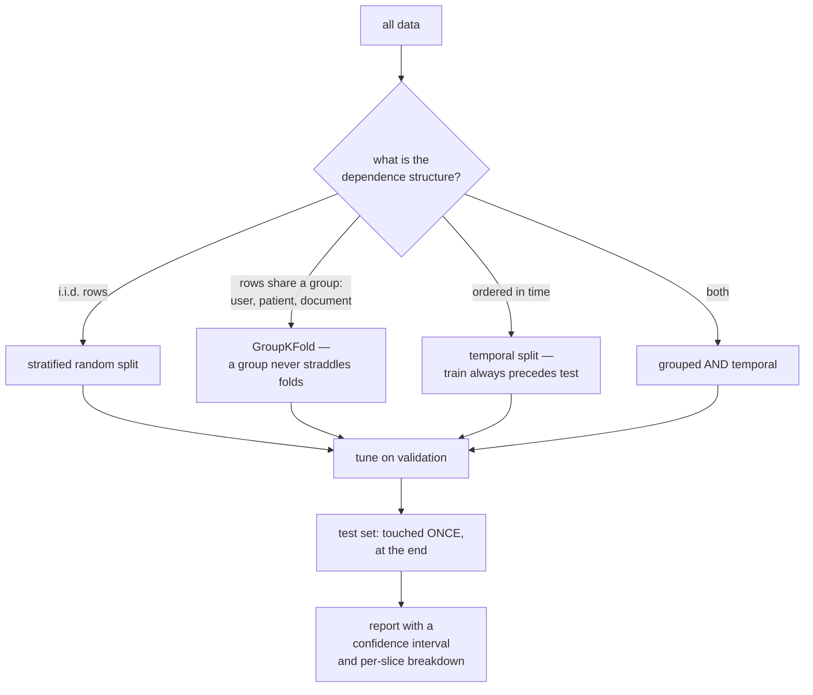

# Model Evaluation: Not Fooling Yourself

Most machine learning failures are evaluation failures. The model was fine; the
number was wrong. It leaked, or it measured the wrong thing, or it was within
noise of the baseline, or it was an average that concealed a subgroup where the
model was useless. This page is about producing a number you would defend.

## The two halves

Evaluation has a **protocol** (how you split data and what you are allowed to
look at) and a **metric** (what you compute). Getting the metric right and the
protocol wrong produces a confident, precise, wrong answer — which is worse than
no answer.



## Classification metrics

Start from the confusion matrix.

| | Predicted positive | Predicted negative |
|---|---|---|
| **Actually positive** | TP | FN (type II) |
| **Actually negative** | FP (type I) | TN |

| Metric | Formula | Answers | Blind to |
|---|---|---|---|
| Accuracy | $\frac{TP+TN}{\text{all}}$ | overall correctness | class imbalance |
| **Precision** | $\frac{TP}{TP+FP}$ | of flagged items, how many are right? | missed positives |
| **Recall** (sensitivity, TPR) | $\frac{TP}{TP+FN}$ | of real positives, how many did we catch? | false alarms |
| Specificity (TNR) | $\frac{TN}{TN+FP}$ | of real negatives, how many did we clear? | missed positives |
| F1 | $\frac{2PR}{P+R}$ | harmonic mean of precision and recall | true negatives; not a monetary error-cost model |
| F$\beta$ | $\frac{(1+\beta^2)PR}{\beta^2P+R}$ | uses a squared $\beta$ weighting in the precision/recall tradeoff | — |
| Balanced accuracy | $\frac{TPR+TNR}{2}$ | mean per-class recall | class sizes |
| **MCC** | correlation of predictions and truth | a balanced single number | — |
| Cohen's $\kappa$ | agreement above chance | inter-rater style agreement | — |

**The accuracy trap**, stated once: on a problem with 1% positives, predicting
"negative" always gives 99% accuracy while detecting none of the positives. Report prevalence and the operational consequences alongside aggregate metrics; different metrics intentionally answer different questions.

**MCC is a useful symmetric summary**, but no scalar is best for every decision. It uses all four cells, it is symmetric under swapping the classes,
and it only scores high when the model does well on both classes. F1 ignores true
negatives entirely and can be gamed by predicting positive very often.

**Multiclass averaging** changes the answer substantially:

| Averaging | Computes | Favours |
|---|---|---|
| `micro` | pool all TP/FP/FN globally | large classes; equals accuracy for single-label |
| `macro` | unweighted mean of per-class scores | **treats every class equally** — rare classes count fully |
| `weighted` | mean weighted by class support | large classes |
| `samples` | per-example, for multilabel | — |

Use macro when rare classes matter, micro/weighted when overall volume matters,
and always say which one you used — macro and weighted F1 can differ substantially when class supports and class-wise errors differ.

## Threshold-free metrics

Precision and recall depend on a threshold. These do not.

### ROC-AUC

Plot TPR against FPR across all thresholds; AUC is the area. Interpretation:
**the probability a random positive outranks a random negative, plus half the probability of a tie.** 0.5 is chance, 1.0 is perfect.

### PR-AUC / average precision

Plot precision against recall. Scikit-learn's average precision is the noninterpolated sum $AP=\sum_j(R_j-R_{j-1})P_j$ when recall levels are ordered increasingly. Trapezoidal PR area linearly connects points and can differ. State which quantity is reported. A no-skill precision reference is prevalence; finite random-ranking AP need not equal it exactly.

### Which one, and why it matters

| | ROC-AUC | PR-AUC |
|---|---|---|
| Uses | TPR and FPR | precision and recall |
| Baseline | 0.5 | positive prevalence |
| Sensitive to imbalance | **no** — can look great when the model is useless | **yes** |
| Best for | balanced data, ranking quality overall | **imbalanced data**, when positives are what matter |

The mechanism: FPR's denominator is the total number of negatives. With 1%
positives, 1,000 false positives among 99,000 negatives moves FPR by 0.01 —
small on a full-range ROC plot — while destroying precision, which divides by the
number of *predicted* positives. **On imbalanced problems, report PR-AUC.**

Also useful: **partial AUC** when you only care about a low-FPR regime, and
**precision@k** or **recall@k** when your capacity is fixed — if the fraud team
can investigate 100 cases a day, precision@100 is the metric, not AUC.

## Probability quality

If you threshold at a fixed value, or feed probabilities into an expected-value
calculation, ranking is not enough.

| Metric | Formula | Notes |
|---|---|---|
| **Log-loss** | $-\frac1N\sum[y\log p + (1-y)\log(1-p)]$ | strictly proper; punishes confident errors severely |
| **Brier score** | $\frac1N\sum(p-y)^2$ | strictly proper; bounded, more interpretable |
| **ECE** | $\sum_b \frac{n_b}{N}\lvert\mathrm{acc}_b - \mathrm{conf}_b\rvert$ | expected calibration error over bins |
| Reliability diagram | predicted vs observed frequency | the picture, not a number |

A **strictly proper scoring rule** is minimised only by reporting your true
belief — which is exactly the property that makes log-loss and Brier the right
things to optimise if probabilities matter.

Log-loss is unbounded: a single confident wrong prediction ($p = 0.001$ when
$y=1$) contributes $\approx 6.9$. Implementations clip at a numerical epsilon to avoid taking the logarithm of zero; arbitrary aggressive clipping changes the score and hides confident errors. Stable logit-based losses avoid forming extreme probabilities during training.

**Which models are miscalibrated, and how:**

| Model | Typical distortion | Fix |
|---|---|---|
| Modern deep networks | overconfident | temperature scaling |
| Boosted trees | pushed toward 0 and 1 | Platt or isotonic |
| Random forests | pulled toward the middle | isotonic |
| SVMs | `decision_function` is not a probability at all | Platt scaling |
| Naive Bayes | wildly overconfident | isotonic, if enough data |
| Logistic regression | can be calibrated under adequate specification and fitting; misspecification and regularization can distort it | check held-out reliability |

**Temperature scaling** divides logits by a positive scalar fitted on held-out calibration data. Binary sigmoid ranking is preserved. Multiclass argmax is preserved, but one class's probability ordering across examples can change because softmax denominators differ; its one-vs-rest AUC can therefore change. Calibration improvement is empirical, not guaranteed.

## Regression metrics

| Metric | Formula | Properties |
|---|---|---|
| **MSE** | $\frac1N\sum(y-\hat y)^2$ | penalises large errors quadratically; Gaussian likelihood |
| **RMSE** | $\sqrt{\mathrm{MSE}}$ | same units as the target |
| **MAE** | $\frac1N\sum\lvert y-\hat y\rvert$ | robust to outliers; optimises the **median** |
| MAPE | $\frac{100}{N}\sum\lvert\frac{y-\hat y}{y}\rvert$ | scale-free; **undefined at $y=0$**, asymmetric |
| SMAPE | symmetric variant | bounded, still awkward |
| **MASE** | MAE relative to a naive forecast | useful across series when the training-derived naive-error scale is positive |
| Huber | quadratic then linear | robust and differentiable |
| Quantile / pinball | asymmetric absolute error | prediction intervals |
| $R^2$ | $1-\frac{SS_{res}}{SS_{tot}}$ | proportion of variance explained; can be negative out of sample |
| RMSLE | RMSE on $\log(1+y)$ | penalises under-prediction more; for skewed positive targets |

**MSE optimises the conditional mean; MAE optimises the conditional median.**
That is not a stylistic difference — it changes what the model learns. On
right-skewed targets (revenue, latency), MSE-trained models systematically
over-predict the typical case because they chase the tail.

**MAPE needs careful interpretation.** For positive actual values and nonnegative predictions, underprediction is bounded by 100%, while overprediction is unbounded. Its inverse-actual weighting emphasizes small targets and can favor low predictions. Near-zero actuals dominate, and zero actuals make the mathematical ratio undefined. MASE avoids division by each actual but is undefined when its training naive-error scale is zero.

## Ranking and recommendation

| Metric | Measures |
|---|---|
| Precision@k / Recall@k | quality of the top $k$ |
| MAP@k | mean average precision — position-aware |
| **NDCG@k** | discounted cumulative gain, normalised; handles graded relevance |
| MRR | reciprocal rank of the first relevant item |
| Hit rate@k | did any relevant item appear? |
| Coverage | fraction of the catalogue ever recommended |
| Diversity / novelty / serendipity | beyond-accuracy objectives |

NDCG is the standard because it handles **graded** relevance (not just
relevant/irrelevant) and discounts by position logarithmically, which
approximates how attention decays down a list.

Beyond-accuracy metrics matter more than they seem: a recommender optimised
purely for an incomplete proxy can overemphasize popularity and miss diversity, exposure or long-term value. This is a possible failure mode, not an inevitable outcome of every relevance objective.

## Validation protocols

| Protocol | Use for |
|---|---|
| Hold-out (single split) | very large datasets; fast iteration |
| $k$-fold CV | the default; $k=5$ or 10 |
| Stratified $k$-fold | classification, especially imbalanced |
| **GroupKFold** | rows share an entity that must not straddle folds |
| **TimeSeriesSplit** | temporal data; expanding or rolling window |
| Repeated CV | small data; averages away split variance |
| Leave-one-out | tiny data; high variance, expensive |
| **Nested CV** | when you both tune and estimate performance |

**Nested cross-validation** exists because the inner-loop best score is
optimistically biased — you selected on it. The outer loop estimates the whole selection procedure trained on the outer training size under the chosen sampling protocol. It removes direct inner-selection optimism, not every source of finite-sample bias or dependence.

```python
inner = GridSearchCV(pipe, grid, cv=StratifiedKFold(3), scoring="average_precision")
outer = cross_val_score(inner, X, y, cv=StratifiedKFold(5), scoring="average_precision")
print(f"{outer.mean():.3f} ± {outer.std():.3f}")
```

### Leakage: the failure that makes everything look wonderful

| Type | Example | Prevention |
|---|---|---|
| **Preprocessing leakage** | scaler/imputer/PCA fit on all data before CV | fit inside a Pipeline |
| **Target leakage** | a feature recorded only after the outcome (`cancellation_reason`) | draw a timeline; audit every feature's availability |
| **Temporal leakage** | random split on time-ordered data | temporal split |
| **Group leakage** | the same user in train and test | `GroupKFold` |
| **Duplicate leakage** | near-duplicate rows across the split | deduplicate before splitting |
| **Target-encoding leakage** | category means computed including the row itself | cross-fitted encoding |
| **Feature-selection leakage** | selecting features on the full dataset | select inside the fold |
| **Test-set peeking** | repeated evaluation on test | one look, at the end |
| **Oversampling leakage** | SMOTE applied before the split | resample inside the fold |

**The tell for leakage**: a suspiciously good result, or a single feature with
overwhelming importance. Both deserve investigation before celebration. The
practical test is "would this value be available, with this value, at the moment
the prediction must be made?" — and the honest answer often is not.

## Threshold selection

A classifier outputs a score; the threshold turns it into a decision, and it is a
**decision-policy choice** linked to the statistical model. A threshold of 0.5 is Bayes-optimal for deployment-calibrated posterior probabilities under equal false-positive/false-negative costs and zero cost for correct decisions; equal class priors are not required.

| Objective | Choose the threshold that |
|---|---|
| Maximise F1 | maximises F1 on validation |
| Fixed precision (e.g. ≥ 90%) | maximizes useful recall/capacity among validated feasible thresholds, with uncertainty |
| Fixed capacity (100 reviews/day) | yields exactly 100 positives |
| Minimise cost | minimises $C_{FP}\cdot FP + C_{FN}\cdot FN$ |
| Balanced errors | equal error rate |

```python
costs = [C_fp * ((p > t) & (y == 0)).sum() + C_fn * ((p <= t) & (y == 1)).sum()
         for t in thresholds]
best_t = thresholds[int(np.argmin(costs))]
```

Choose an empirical threshold on validation, not test. Under pure prior shift, uncorrected scores may need correction. Once probabilities are calibrated to deployment and costs stay fixed, the Bayes posterior threshold stays fixed; the corresponding threshold on old scores generally changes.

## Statistical significance

Two models on the same test set are compared with a **paired** test. Unpaired
tests throw away the pairing and are badly underpowered.

**McNemar's test** for classification. Build the disagreement table: $b$ =
examples A got right and B wrong, $c$ = the reverse.

$$\chi^2 = \frac{(\lvert b-c\rvert - 1)^2}{b+c}$$

Examples both models get right, or both wrong, carry no information about which
is better — which is exactly the structure an unpaired test discards.

**Paired bootstrap** for any metric: resample example indices once, compute both
models' scores on the same resample, and take the difference. An interval excluding zero is evidence under the sampling and bootstrap assumptions, not proof of a practically important or universally replicable gain. Account for prior model selection and multiple comparisons.

```python
def paired_bootstrap(y, p_a, p_b, metric, B=10_000, seed=0):
    rng, n = np.random.default_rng(seed), len(y)
    diffs = np.empty(B)
    for i in range(B):
        idx = rng.integers(0, n, n)
        diffs[i] = metric(y[idx], p_a[idx]) - metric(y[idx], p_b[idx])
    return np.percentile(diffs, [2.5, 97.5]), (diffs > 0).mean()
```

**Test-set sizing.** For accuracy, a rough worst-case 95% half-width is
$0.98/\sqrt{n}$:

| $n$ | Half-width |
|---|---|
| 100 | ±9.8 pts |
| 1,000 | ±3.1 pts |
| 10,000 | ±1.0 pt |
| 100,000 | ±0.31 pts |

These are marginal worst-case intervals for one accuracy, not an automatic verdict on a paired difference. The disagreement pattern determines paired uncertainty; specify the test, significance level and practical effect size.

**Seed variance** is the other half of this: for small models, the spread across
random seeds often exceeds the claimed improvement. Report mean ± std across 3–5
seeds, and compare distributions rather than single runs.

## Slice-based error analysis

An aggregate metric is an average over a population, and averages hide the
failures that matter.

```python
for name, mask in slices.items():
    if mask.sum() < 30 or np.unique(y[mask]).size < 2:
        continue
    print(f"{name:<24} n={mask.sum():>6}  "
          f"auc={roc_auc_score(y[mask], p[mask]):.3f}  "
          f"recall={recall_score(y[mask], p[mask] > t):.3f}")
```

Slice by: class, data source, time period, geography, device, language, sequence
length, feature-missingness pattern, and any protected attribute you are
permitted to evaluate on. Look for slices where the model is at or below the
baseline — those are either a data problem, a fairness problem, or both.

**Manual error review is the highest-value hour in the project.** Read 50
misclassified examples. You will find label errors, a systematic subgroup
failure, or a feature you did not know existed — none of which any aggregate
number would have surfaced.

## Beyond the metric

| Question | Test |
|---|---|
| Does it behave sensibly on obvious cases? | minimum functionality tests |
| Is it invariant to things it should ignore? | invariance tests (change an irrelevant field) |
| Does it respond in the right direction? | directional expectation tests |
| Is it robust to small perturbations? | typos, noise, adversarial examples |
| Does it degrade gracefully out of distribution? | evaluate on a shifted set |
| Is it fast enough? | latency at p99 under realistic load |
| Is it fair across groups? | per-group metrics, disparity measures |
| Is it stable across retrains? | prediction churn between versions |

Prediction churn is worth naming: two models with identical accuracy can disagree
on 15% of examples. For a user-facing system, that instability is itself a
quality problem.

## An evaluation checklist

1. Baseline first — `DummyClassifier`, the incumbent system, or human
   performance.
2. Split by the actual dependence structure (grouped, temporal, or both).
3. Every stateful transform inside the Pipeline.
4. Choose the metric from the decision the model informs, not from habit.
5. Report a confidence interval and the number of test examples.
6. Use a paired test for model comparisons.
7. Report across seeds, not a single run.
8. Slice the metrics; look for the worst slice.
9. Check calibration if probabilities are used.
10. Set the threshold from costs on validation data.
11. Read 50 errors by hand.
12. Touch the test set once.

## Work the numbers before trusting a dashboard

### One operating point

Among 1,000 examples, suppose 100 are positive and a threshold yields
$TP=80,FN=20,FP=90,TN=810$. Accuracy is $0.89$, precision is $80/170\approx0.471$,
recall is $0.8$, specificity is $0.9$, balanced accuracy is $0.85$, and
$F1=160/(160+90+20)\approx0.593$. Majority-only accuracy is already $0.9$,
yet this model catches eighty positives. Whether that is better depends on
the cost or benefit of those detections, not on one universal metric ranking.

With $C_{FP}=1,C_{FN}=10$, its error cost is $90+200=290$, versus $1000$ for
always-negative decisions. F1 does not encode those costs. Its denominator
contains no true negatives, so adding correctly cleared negatives leaves F1
unchanged while changing accuracy and often the deployment workload.

If there are no predicted positives, precision has a zero denominator. Libraries
choose conventions or warnings; report the convention and counts. A slice with
no positive examples cannot estimate recall or ROC-AUC regardless of its total
size. For small rare-event slices, uncertainty and support counts belong beside
the metric rather than being hidden by a zero-filled dashboard.

### Ranking, integration, and ties

For descending scores with labels $(1,0,1)$, the positive ranks are one and
three. Average precision is $(1+2/3)/2=5/6$. A trapezoidal integration of the
empirical PR points gives $19/24$, a different number. Both can be calculated,
but they are not interchangeable names for one algorithm.

Equal scores should enter together at a threshold. Breaking ties using the true
label inflates the ranking result. ROC-AUC assigns half credit to tied
positive-negative pairs. For top-$k$ metrics, specify how ties at the capacity
boundary are resolved, and whether $k$ is fixed per query, per day or globally.
Ranking metrics also need a query-weighting convention: averaging equally over
queries differs from weighting queries by impression volume.

For NDCG, common DCG uses gain $2^{rel}-1$ divided by $\log_2(rank+1)$.
Some implementations use a different gain definition. An all-zero-relevance
query has zero ideal DCG and needs an explicit convention. MRR uses only the
first relevant rank; it cannot distinguish lists that differ only after that
first success. No ranking metric automatically corrects click-position bias.

### Executable metric counterexamples

```python runnable
import numpy as np
from scipy.special import softmax
from scipy.stats import binomtest
from sklearn.metrics import (average_precision_score, auc, precision_recall_curve,
                             roc_auc_score, mean_absolute_percentage_error,
                             confusion_matrix, f1_score)

y = np.r_[np.ones(100, dtype=int), np.zeros(900, dtype=int)]
prediction = np.r_[np.ones(80, dtype=int), np.zeros(20, dtype=int),
                   np.ones(90, dtype=int), np.zeros(810, dtype=int)]
tn, fp, fn, tp = confusion_matrix(y, prediction, labels=[0, 1]).ravel()
assert (tn, fp, fn, tp) == (810, 90, 20, 80)
np.testing.assert_allclose(f1_score(y, prediction), 160 / 270)
assert fp + 10 * fn < 10 * y.sum()

ranked_labels = np.array([1, 0, 1])
scores = np.array([0.9, 0.8, 0.7])
precision, recall, _ = precision_recall_curve(ranked_labels, scores)
ap = average_precision_score(ranked_labels, scores)
trapezoidal = auc(recall, precision)
np.testing.assert_allclose(ap, 5 / 6)
np.testing.assert_allclose(trapezoidal, 19 / 24)
assert ap != trapezoidal

assert mean_absolute_percentage_error([100.], [0.]) == 1.0
assert mean_absolute_percentage_error([100.], [300.]) == 2.0
# sklearn returns proportions: multiply by 100 to express percentages.
logits = np.array([[0.01, 0., 0.], [0., 2., -100.]])
cold = softmax(logits, axis=1)
warm = softmax(logits / 10, axis=1)
np.testing.assert_array_equal(cold.argmax(1), warm.argmax(1))
one_vs_rest = np.array([1, 0])
assert roc_auc_score(one_vs_rest, cold[:, 0]) == 1.0
assert roc_auc_score(one_vs_rest, warm[:, 0]) == 0.0

# Ten discordant cases favor A; the other 990 cases agree.
paired_p = binomtest(10, n=10, p=0.5, alternative="two-sided").pvalue
assert paired_p < 0.01
print("AP/trapezoidal PR area:", ap, trapezoidal)
print("Multiclass argmax preserved but one-vs-rest AUC changed.")
print("Exact paired p-value for a 1-point gain on 1000 cases:", paired_p)
```

The temperature example is deliberately extreme to make the logical distinction
visible: class decisions stay correct while a one-vs-rest probability ranking
reverses. A binary sigmoid is monotone in its scalar logit at every positive
temperature, so that particular reversal cannot occur in the binary case.

## Experiment: separate tuning, calibration, policy, and final assessment

The synthetic cohorts below arrive in time order and contain repeated entity
observations. Inner folds train on earlier complete groups and validate on later
groups with a gap. Final calibration, threshold selection and test cohorts are
also separate. This evaluates a future-cohort, new-entity use case; predicting
future observations of already known entities would require a different split.

The outcome horizon is shorter than the imposed gap, so training labels mature
before each next validation period. Features are generated as already available
at their row's decision time. These design assertions are as important as a
high score, because generic `TimeSeriesSplit` alone cannot infer label maturity.

```python runnable
import numpy as np
from scipy.special import expit
from sklearn.linear_model import LogisticRegression
from sklearn.metrics import average_precision_score, brier_score_loss, log_loss
from sklearn.model_selection import GridSearchCV
from sklearn.pipeline import make_pipeline
from sklearn.preprocessing import StandardScaler
from threadpoolctl import threadpool_limits

rng = np.random.default_rng(121)
groups = np.repeat(np.arange(100), 20)
time = groups + np.tile(np.arange(20), 100) / 100
X = rng.normal(size=(len(groups), 5))
group_effect = rng.normal(scale=0.3, size=100)
probability = expit(-1.7 + 1.8 * X[:, 0] - X[:, 1] + group_effect[groups])
y = rng.binomial(1, probability)
development = np.flatnonzero(groups < 55)
calibration = np.flatnonzero((groups >= 55) & (groups < 70))
policy = np.flatnonzero((groups >= 70) & (groups < 85))
test = np.flatnonzero(groups >= 85)
partitions = [development, calibration, policy, test]
for before, after in zip(partitions[:-1], partitions[1:]):
    assert set(groups[before]).isdisjoint(groups[after])
    assert time[before].max() + 0.3 < time[after].min()

inner_folds = []
for train_end, val_start, val_end in ((25, 26, 35), (35, 36, 45), (45, 46, 55)):
    train_ids = np.flatnonzero(groups[development] < train_end)
    val_ids = np.flatnonzero((groups[development] >= val_start) &
                             (groups[development] < val_end))
    assert set(groups[train_ids]).isdisjoint(groups[val_ids])
    assert time[train_ids].max() + 0.3 < time[val_ids].min()
    assert np.unique(y[val_ids]).size == 2
    inner_folds.append((train_ids, val_ids))
pipeline = make_pipeline(StandardScaler(), LogisticRegression(max_iter=1000, random_state=121))
search = GridSearchCV(pipeline, {"logisticregression__C": [0.1, 1.0, 10.0]},
                      cv=inner_folds, scoring="neg_log_loss", n_jobs=1)
with threadpool_limits(limits=1):
    search.fit(X[development], y[development])
    model = search.best_estimator_
    calibrator = LogisticRegression(C=100.0, max_iter=1000).fit(
        model.decision_function(X[calibration])[:, None], y[calibration])
def calibrated(indices):
    score = model.decision_function(X[indices])[:, None]
    return calibrator.predict_proba(score)[:, 1]
policy_probability = calibrated(policy)
fp_cost, fn_cost = 1.0, 6.0
thresholds = np.r_[0., np.unique(policy_probability), np.nextafter(1., 2.)]
costs = []
for threshold in thresholds:
    decisions = policy_probability >= threshold
    costs.append(fp_cost * np.sum(decisions & (y[policy] == 0)) +
                 fn_cost * np.sum(~decisions & (y[policy] == 1)))
threshold = thresholds[np.argmin(costs)]
test_probability = calibrated(test)
test_decisions = test_probability >= threshold
assert np.all((test_probability > 0) & (test_probability < 1))
assert average_precision_score(y[test], test_probability) > y[test].mean()
print("Chosen C:", search.best_params_, "policy threshold:", threshold)
print("Test prevalence/AP:", y[test].mean(), average_precision_score(y[test], test_probability))
print("Test log loss/Brier:", log_loss(y[test], test_probability),
      brier_score_loss(y[test], test_probability))
print("Test error cost:", fp_cost * np.sum(test_decisions & (y[test] == 0)) +
      fn_cost * np.sum(~test_decisions & (y[test] == 1)))
```

The inner score's fold standard deviation is not a confidence interval: training
sets overlap, folds can have different distributions and there are only a few
folds. The final test cohort estimates one specific future-period performance,
not every future population. Repeated outer backtests can assess temporal
variation, provided all tuning/calibration/policy decisions stay within each
outer training history.

## Uncertainty is about the sampling unit

For paired accuracy comparison, define $d_i$ as A's correctness minus B's.
The estimated difference is the mean of $d_i$, whose uncertainty depends on
discordant outcomes. If both models agree on most examples, the difference may
be estimated more precisely than either marginal accuracy. Exact McNemar testing
conditions on $b+c$ disagreements and tests a binomial split with probability
one-half under the null. If $b+c=0$, there is no observed difference and the
asymptotic division is undefined; handle it rather than reporting a numerical
exception as significance.

Bootstrap the unit independently sampled from the population. If patients each
contribute many rows, resample patients and retain their rows. For a dependent
time series, a block bootstrap may be appropriate under additional assumptions.
An ordinary row bootstrap can report implausibly narrow intervals by counting
correlated observations as independent. Bootstrap replicates with only one class
make AUC undefined; choose a justified stratified design or a metric/protocol
that can handle the sample, and state its conditioning.

Trying many models, thresholds, slices and seeds then reporting only a favorable
comparison spends information. Pre-specify primary metrics, use nested selection
or fresh confirmation data, and account for multiplicity when making formal
claims. Statistical significance does not measure deployment value: a tiny
precise gain may not justify added latency, maintenance or subgroup harm.
Power planning needs an effect size and paired disagreement assumptions, not
only a target marginal half-width.

### Calibration, intervals, and selective prediction

Brier score combines probability calibration with resolution: a calibrated
constant prevalence predictor can still be uninformative. For predictions taking
discrete probability values, its population decomposition is uncertainty minus
resolution plus reliability error. Binning continuous scores provides an
approximation whose value depends on bin choices; low ECE alone does not imply
useful probabilities or good discrimination.

Conformal regression can use a separate calibration set of absolute residuals
and an appropriately finite-sample-adjusted quantile to form prediction intervals.
Under exchangeability it gives a marginal coverage guarantee, not exact coverage
for every subgroup or every input. Temporal shift and calibration-set reuse can
invalidate that guarantee. Report interval width and conditional coverage
diagnostics alongside the marginal rate.

For survival outcomes, censored follow-up requires censoring-aware evaluation;
ordinary regression error on only observed failures selects a biased subset.
For logged recommendations, observed clicks depend on exposure and position, so
offline relevance metrics need a justified sampling or propensity model.
For abstention, report risk versus coverage and the downstream cost of rejected
cases. These extensions preserve the same principle: match the metric and
sampling protocol to the decision, rather than adapting the decision to a
convenient metric.

## Self-check

1. **Why can high ROC-AUC be operationally poor?** Ranking over all thresholds
   need not give adequate precision at the required workload and prevalence.
   Inspect AP, precision/recall at the chosen threshold, precision at capacity
   and expected cost rather than inferring those from ROC-AUC alone.
2. **Why does F1 ignore true negatives?** Its count form is
   $2TP/(2TP+FP+FN)$. Adding correct negatives leaves it unchanged, which is
   useful in some retrieval settings but insufficient for decisions valuing them.
3. **Name leakage defenses.** Fit preprocessing inside each training fold; separate
   related entities or duplicates; enforce feature availability and mature labels
   at temporal cutoffs. Each prevents a different prohibited information path.
4. **How compare paired classifiers?** McNemar uses their disagreement table for
   binary correctness; a paired bootstrap can estimate other metric differences.
   Unpaired analysis discards dependence and usually answers the wrong sampling question.
5. **How many cases establish a one-point gain?** There is no universal count.
   Power depends on paired disagreements, effect, significance level and sampling
   dependence. Ten one-sided disagreements among 1,000 cases give exact two-sided
   McNemar p-value about $0.00195$.
6. **What is strictly proper?** The expected score is uniquely optimized by the
   true conditional distribution under its assumptions. Log loss and Brier score
   are examples; this property does not guarantee an estimated model is calibrated.
7. **When choose MAE?** When absolute error matches the decision penalty and a
   conditional median is desired. MSE targets the conditional mean instead;
   skewed outcomes make those estimands meaningfully different.
8. **Is AP trapezoidal PR-AUC?** No. The ranked three-label example gives
   $5/6$ versus $19/24$. Specify the integration/interpolation convention.
9. **Which MAPE direction is unbounded?** With positive actuals and nonnegative
   forecasts, overprediction is unbounded; predicting zero gives 100% undererror.
   Zero actuals make the mathematical percentage undefined.
10. **Does changing prevalence change the Bayes posterior threshold?** With
    fixed costs and deployment-corrected posterior probabilities, no. It can
    change the mapping from old scores to that posterior and thus the old-score cutoff.

## Where to go next

- [Bias–Variance & Generalization](./bias-variance-and-generalization.md) — what
  the numbers are diagnosing.
- [Hyperparameter Tuning](./hyperparameter-tuning.md) — searching without
  overfitting the validation set.
- [Imbalanced Data & Pitfalls](./imbalanced-data-and-pitfalls.md) — the setting
  where evaluation goes wrong most often.

Primary implementation references: [average precision](https://scikit-learn.org/stable/modules/generated/sklearn.metrics.average_precision_score.html),
[MAPE](https://scikit-learn.org/stable/modules/generated/sklearn.metrics.mean_absolute_percentage_error.html),
[calibration](https://scikit-learn.org/stable/modules/calibration.html), and
[decision thresholds](https://scikit-learn.org/stable/modules/classification_threshold.html).
See [statistics](../math/statistics.md) for hypothesis tests, confidence intervals
and experimental design, and [information theory](../math/information-theory.md)
for proper likelihood-based objectives.
