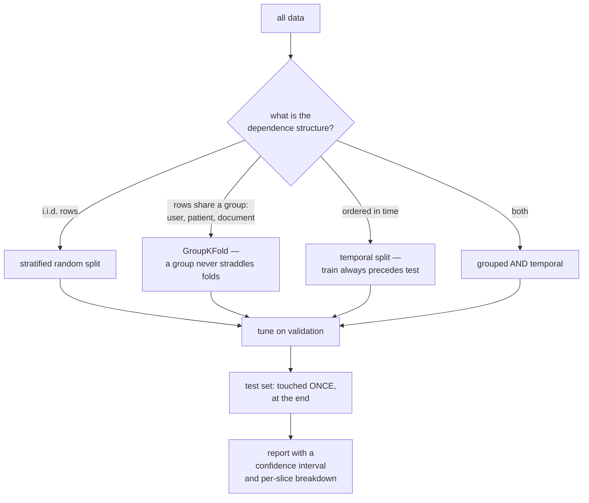

# Model Evaluation: Not Fooling Yourself

Most machine learning failures are evaluation failures. The model was fine; the
number was wrong. It leaked, or it measured the wrong thing, or it was within
noise of the baseline, or it was an average that concealed a subgroup where the
model was useless. This page is about producing a number you would defend.

## The two halves

Evaluation has a **protocol** (how you split data and what you are allowed to
look at) and a **metric** (what you compute). Getting the metric right and the
protocol wrong produces a confident, precise, wrong answer — which is worse than
no answer.



## Classification metrics

Start from the confusion matrix.

| | Predicted positive | Predicted negative |
|---|---|---|
| **Actually positive** | TP | FN (type II) |
| **Actually negative** | FP (type I) | TN |

| Metric | Formula | Answers | Blind to |
|---|---|---|---|
| Accuracy | $\frac{TP+TN}{\text{all}}$ | overall correctness | class imbalance |
| **Precision** | $\frac{TP}{TP+FP}$ | of flagged items, how many are right? | missed positives |
| **Recall** (sensitivity, TPR) | $\frac{TP}{TP+FN}$ | of real positives, how many did we catch? | false alarms |
| Specificity (TNR) | $\frac{TN}{TN+FP}$ | of real negatives, how many did we clear? | missed positives |
| F1 | $\frac{2PR}{P+R}$ | harmonic mean of precision and recall | true negatives; asserts equal cost |
| F$\beta$ | $\frac{(1+\beta^2)PR}{\beta^2P+R}$ | recall weighted $\beta$ times more | — |
| Balanced accuracy | $\frac{TPR+TNR}{2}$ | mean per-class recall | class sizes |
| **MCC** | correlation of predictions and truth | a balanced single number | — |
| Cohen's $\kappa$ | agreement above chance | inter-rater style agreement | — |

**The accuracy trap**, stated once: on a problem with 1% positives, predicting
"negative" always gives 99% accuracy and zero value. Any metric that ignores the
base rate is not a metric for imbalanced data.

**MCC is the best single number for binary classification** and is
under-used. It uses all four cells, it is symmetric under swapping the classes,
and it only scores high when the model does well on both classes. F1 ignores true
negatives entirely and can be gamed by predicting positive very often.

**Multiclass averaging** changes the answer substantially:

| Averaging | Computes | Favours |
|---|---|---|
| `micro` | pool all TP/FP/FN globally | large classes; equals accuracy for single-label |
| `macro` | unweighted mean of per-class scores | **treats every class equally** — rare classes count fully |
| `weighted` | mean weighted by class support | large classes |
| `samples` | per-example, for multilabel | — |

Use macro when rare classes matter, micro/weighted when overall volume matters,
and always say which one you used — the gap between macro and weighted F1 on an
imbalanced problem is routinely 20 points.

## Threshold-free metrics

Precision and recall depend on a threshold. These do not.

### ROC-AUC

Plot TPR against FPR across all thresholds; AUC is the area. Interpretation:
**the probability that a randomly chosen positive is scored above a randomly
chosen negative.** 0.5 is chance, 1.0 is perfect.

### PR-AUC / average precision

Plot precision against recall; average precision is the area. The baseline is the
**positive base rate**, not 0.5.

### Which one, and why it matters

| | ROC-AUC | PR-AUC |
|---|---|---|
| Uses | TPR and FPR | precision and recall |
| Baseline | 0.5 | positive prevalence |
| Sensitive to imbalance | **no** — can look great when the model is useless | **yes** |
| Best for | balanced data, ranking quality overall | **imbalanced data**, when positives are what matter |

The mechanism: FPR's denominator is the total number of negatives. With 1%
positives, 1,000 false positives among 99,000 negatives moves FPR by 0.01 —
invisible on the ROC curve — while destroying precision, which divides by the
number of *predicted* positives. **On imbalanced problems, report PR-AUC.**

Also useful: **partial AUC** when you only care about a low-FPR regime, and
**precision@k** or **recall@k** when your capacity is fixed — if the fraud team
can investigate 100 cases a day, precision@100 is the metric, not AUC.

## Probability quality

If you threshold at a fixed value, or feed probabilities into an expected-value
calculation, ranking is not enough.

| Metric | Formula | Notes |
|---|---|---|
| **Log-loss** | $-\frac1N\sum[y\log p + (1-y)\log(1-p)]$ | strictly proper; punishes confident errors severely |
| **Brier score** | $\frac1N\sum(p-y)^2$ | strictly proper; bounded, more interpretable |
| **ECE** | $\sum_b \frac{n_b}{N}\lvert\mathrm{acc}_b - \mathrm{conf}_b\rvert$ | expected calibration error over bins |
| Reliability diagram | predicted vs observed frequency | the picture, not a number |

A **strictly proper scoring rule** is minimised only by reporting your true
belief — which is exactly the property that makes log-loss and Brier the right
things to optimise if probabilities matter.

Log-loss is unbounded: a single confident wrong prediction ($p = 0.001$ when
$y=1$) contributes $\approx 6.9$, and clipping predictions to $[\epsilon,
1-\epsilon]$ is standard practice for that reason.

**Which models are miscalibrated, and how:**

| Model | Typical distortion | Fix |
|---|---|---|
| Modern deep networks | overconfident | temperature scaling |
| Boosted trees | pushed toward 0 and 1 | Platt or isotonic |
| Random forests | pulled toward the middle | isotonic |
| SVMs | `decision_function` is not a probability at all | Platt scaling |
| Naive Bayes | wildly overconfident | isotonic, if enough data |
| Logistic regression | usually well calibrated | — |

**Temperature scaling** — dividing logits by a single learned scalar $T$ fit on
validation data — is the highest-value-per-line-of-code fix in the whole field.
It cannot change the ranking (so AUC is unaffected) and typically cuts ECE by an
order of magnitude.

## Regression metrics

| Metric | Formula | Properties |
|---|---|---|
| **MSE** | $\frac1N\sum(y-\hat y)^2$ | penalises large errors quadratically; Gaussian likelihood |
| **RMSE** | $\sqrt{\mathrm{MSE}}$ | same units as the target |
| **MAE** | $\frac1N\sum\lvert y-\hat y\rvert$ | robust to outliers; optimises the **median** |
| MAPE | $\frac{100}{N}\sum\lvert\frac{y-\hat y}{y}\rvert$ | scale-free; **undefined at $y=0$**, asymmetric |
| SMAPE | symmetric variant | bounded, still awkward |
| **MASE** | MAE relative to a naive forecast | scale-free and well-behaved; best for forecasting |
| Huber | quadratic then linear | robust and differentiable |
| Quantile / pinball | asymmetric absolute error | prediction intervals |
| $R^2$ | $1-\frac{SS_{res}}{SS_{tot}}$ | proportion of variance explained; can be negative out of sample |
| RMSLE | RMSE on $\log(1+y)$ | penalises under-prediction more; for skewed positive targets |

**MSE optimises the conditional mean; MAE optimises the conditional median.**
That is not a stylistic difference — it changes what the model learns. On
right-skewed targets (revenue, latency), MSE-trained models systematically
over-predict the typical case because they chase the tail.

**MAPE's asymmetry** is a real trap in forecasting: over-prediction is bounded at
100% error while under-prediction is unbounded, so optimising MAPE biases
forecasts downward. Use MASE.

## Ranking and recommendation

| Metric | Measures |
|---|---|
| Precision@k / Recall@k | quality of the top $k$ |
| MAP@k | mean average precision — position-aware |
| **NDCG@k** | discounted cumulative gain, normalised; handles graded relevance |
| MRR | reciprocal rank of the first relevant item |
| Hit rate@k | did any relevant item appear? |
| Coverage | fraction of the catalogue ever recommended |
| Diversity / novelty / serendipity | beyond-accuracy objectives |

NDCG is the standard because it handles **graded** relevance (not just
relevant/irrelevant) and discounts by position logarithmically, which
approximates how attention decays down a list.

Beyond-accuracy metrics matter more than they seem: a recommender optimised
purely for accuracy converges on recommending the most popular items to everyone,
which is accurate and commercially useless.

## Validation protocols

| Protocol | Use for |
|---|---|
| Hold-out (single split) | very large datasets; fast iteration |
| $k$-fold CV | the default; $k=5$ or 10 |
| Stratified $k$-fold | classification, especially imbalanced |
| **GroupKFold** | rows share an entity that must not straddle folds |
| **TimeSeriesSplit** | temporal data; expanding or rolling window |
| Repeated CV | small data; averages away split variance |
| Leave-one-out | tiny data; high variance, expensive |
| **Nested CV** | when you both tune and estimate performance |

**Nested cross-validation** exists because the inner-loop best score is
optimistically biased — you selected on it. The outer loop provides an unbiased
estimate of the whole *procedure* including tuning.

```python
inner = GridSearchCV(pipe, grid, cv=StratifiedKFold(3), scoring="average_precision")
outer = cross_val_score(inner, X, y, cv=StratifiedKFold(5), scoring="average_precision")
print(f"{outer.mean():.3f} ± {outer.std():.3f}")
```

### Leakage: the failure that makes everything look wonderful

| Type | Example | Prevention |
|---|---|---|
| **Preprocessing leakage** | scaler/imputer/PCA fit on all data before CV | fit inside a Pipeline |
| **Target leakage** | a feature recorded only after the outcome (`cancellation_reason`) | draw a timeline; audit every feature's availability |
| **Temporal leakage** | random split on time-ordered data | temporal split |
| **Group leakage** | the same user in train and test | `GroupKFold` |
| **Duplicate leakage** | near-duplicate rows across the split | deduplicate before splitting |
| **Target-encoding leakage** | category means computed including the row itself | cross-fitted encoding |
| **Feature-selection leakage** | selecting features on the full dataset | select inside the fold |
| **Test-set peeking** | repeated evaluation on test | one look, at the end |
| **Oversampling leakage** | SMOTE applied before the split | resample inside the fold |

**The tell for leakage**: a suspiciously good result, or a single feature with
overwhelming importance. Both deserve investigation before celebration. The
practical test is "would this value be available, with this value, at the moment
the prediction must be made?" — and the honest answer often is not.

## Threshold selection

A classifier outputs a score; the threshold turns it into a decision, and it is a
**business decision**, not a modelling one. 0.5 is almost never right.

| Objective | Choose the threshold that |
|---|---|
| Maximise F1 | maximises F1 on validation |
| Fixed precision (e.g. ≥ 90%) | the lowest threshold meeting it |
| Fixed capacity (100 reviews/day) | yields exactly 100 positives |
| Minimise cost | minimises $C_{FP}\cdot FP + C_{FN}\cdot FN$ |
| Balanced errors | equal error rate |

```python
costs = [C_fp * ((p > t) & (y == 0)).sum() + C_fn * ((p <= t) & (y == 1)).sum()
         for t in thresholds]
best_t = thresholds[int(np.argmin(costs))]
```

Tune the threshold on a **validation** set, not the test set, and re-tune it when
the class balance shifts — a threshold calibrated at 2% prevalence is wrong at
6%.

## Statistical significance

Two models on the same test set are compared with a **paired** test. Unpaired
tests throw away the pairing and are badly underpowered.

**McNemar's test** for classification. Build the disagreement table: $b$ =
examples A got right and B wrong, $c$ = the reverse.

$$\chi^2 = \frac{(\lvert b-c\rvert - 1)^2}{b+c}$$

Examples both models get right, or both wrong, carry no information about which
is better — which is exactly the structure an unpaired test discards.

**Paired bootstrap** for any metric: resample example indices once, compute both
models' scores on the same resample, and take the difference. If the 95%
interval on the difference excludes zero, it is real.

```python
def paired_bootstrap(y, p_a, p_b, metric, B=10_000, seed=0):
    rng, n = np.random.default_rng(seed), len(y)
    diffs = np.empty(B)
    for i in range(B):
        idx = rng.integers(0, n, n)
        diffs[i] = metric(y[idx], p_a[idx]) - metric(y[idx], p_b[idx])
    return np.percentile(diffs, [2.5, 97.5]), (diffs > 0).mean()
```

**Test-set sizing.** For accuracy, a rough worst-case 95% half-width is
$0.98/\sqrt{n}$:

| $n$ | Half-width |
|---|---|
| 100 | ±9.8 pts |
| 1,000 | ±3.1 pts |
| 10,000 | ±1.0 pt |
| 100,000 | ±0.31 pts |

A 0.5-point improvement on a 1,000-example test set is not a result.

**Seed variance** is the other half of this: for small models, the spread across
random seeds often exceeds the claimed improvement. Report mean ± std across 3–5
seeds, and compare distributions rather than single runs.

## Slice-based error analysis

An aggregate metric is an average over a population, and averages hide the
failures that matter.

```python
for name, mask in slices.items():
    if mask.sum() < 30:
        continue
    print(f"{name:<24} n={mask.sum():>6}  "
          f"auc={roc_auc_score(y[mask], p[mask]):.3f}  "
          f"recall={recall_score(y[mask], p[mask] > t):.3f}")
```

Slice by: class, data source, time period, geography, device, language, sequence
length, feature-missingness pattern, and any protected attribute you are
permitted to evaluate on. Look for slices where the model is at or below the
baseline — those are either a data problem, a fairness problem, or both.

**Manual error review is the highest-value hour in the project.** Read 50
misclassified examples. You will find label errors, a systematic subgroup
failure, or a feature you did not know existed — none of which any aggregate
number would have surfaced.

## Beyond the metric

| Question | Test |
|---|---|
| Does it behave sensibly on obvious cases? | minimum functionality tests |
| Is it invariant to things it should ignore? | invariance tests (change an irrelevant field) |
| Does it respond in the right direction? | directional expectation tests |
| Is it robust to small perturbations? | typos, noise, adversarial examples |
| Does it degrade gracefully out of distribution? | evaluate on a shifted set |
| Is it fast enough? | latency at p99 under realistic load |
| Is it fair across groups? | per-group metrics, disparity measures |
| Is it stable across retrains? | prediction churn between versions |

Prediction churn is worth naming: two models with identical accuracy can disagree
on 15% of examples. For a user-facing system, that instability is itself a
quality problem.

## An evaluation checklist

1. Baseline first — `DummyClassifier`, the incumbent system, or human
   performance.
2. Split by the actual dependence structure (grouped, temporal, or both).
3. Every stateful transform inside the Pipeline.
4. Choose the metric from the decision the model informs, not from habit.
5. Report a confidence interval and the number of test examples.
6. Use a paired test for model comparisons.
7. Report across seeds, not a single run.
8. Slice the metrics; look for the worst slice.
9. Check calibration if probabilities are used.
10. Set the threshold from costs on validation data.
11. Read 50 errors by hand.
12. Touch the test set once.

## Self-check

1. Your model has 0.96 ROC-AUC on a 0.5%-positive problem and is useless in
   production. Explain why, and name the metric that would have shown it.
2. Why does F1 ignore true negatives, and when does that matter?
3. Give three forms of leakage and the specific protocol that prevents each.
4. Which test compares two classifiers on the same test set, and why is an
   unpaired test wrong?
5. How large must a test set be for a 1-point accuracy difference to be
   meaningful?
6. What is a strictly proper scoring rule, and name two.
7. When is MAE the right regression metric, and what does it change about what
   the model learns?

## Where to go next

- [Bias–Variance & Generalization](./bias-variance-and-generalization.md) — what
  the numbers are diagnosing.
- [Hyperparameter Tuning](./hyperparameter-tuning.md) — searching without
  overfitting the validation set.
- [Imbalanced Data & Pitfalls](./imbalanced-data-and-pitfalls.md) — the setting
  where evaluation goes wrong most often.
