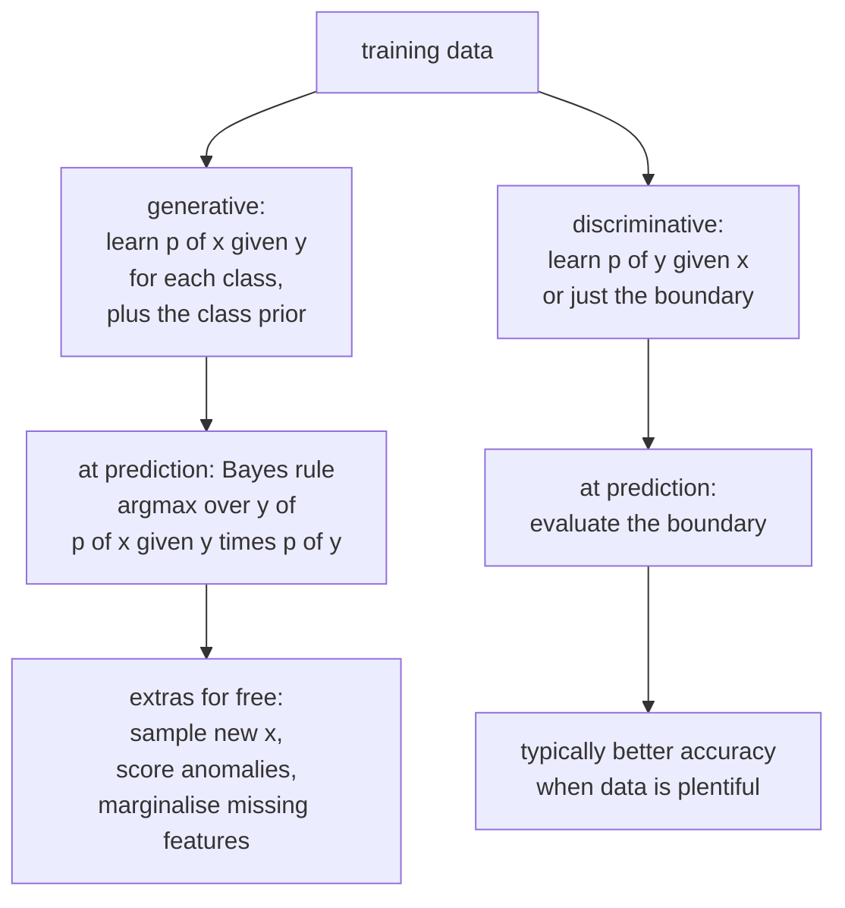

# Probabilistic and Instance-Based Models

Two families that look nothing alike but are usually taught together, because
they are the two clearest examples of learning without fitting a decision
boundary. Naive Bayes models how each class *generates* data; $k$-NN does not
build a model at all and defers everything to prediction time. Both are old, both
are still deployed, and both illustrate ideas that matter far beyond themselves.

## Generative vs discriminative

The distinction organises most of supervised learning.

| | Discriminative | Generative |
|---|---|---|
| Models | $p(y \mid x)$ directly, or just a boundary | $p(x \mid y)$ and $p(y)$, then applies Bayes |
| Examples | logistic regression, SVM, trees, neural nets | naive Bayes, LDA/QDA, GMM, HMM, VAE, diffusion |
| Asks | "which side of the boundary?" | "which class would most likely have produced this?" |
| Needs | less data for the same asymptotic error | more data, but converges faster initially |
| Can | usually higher accuracy at the limit | generate samples, handle missing features, detect outliers |
| Assumptions | few | strong (about how $x$ is distributed) |

The classic result (Ng and Jordan): a generative model has **higher asymptotic
error** but **approaches it faster**, so naive Bayes often beats logistic
regression with few training examples and loses with many. The crossover is
usually a few hundred to a few thousand examples.

## Naive Bayes

### The model

Apply Bayes' rule and pick the most probable class:

$$\hat{y} = \arg\max_c\; p(c \mid \mathbf{x}) = \arg\max_c\; p(c)\,p(\mathbf{x}\mid c)$$

The denominator $p(\mathbf{x})$ is the same for every class, so it drops out.

The problem: $p(\mathbf{x}\mid c) = p(x_1,\dots,x_d\mid c)$ is a
$d$-dimensional joint distribution needing exponentially many parameters.

**The "naive" assumption**: features are conditionally independent given the
class.

$$p(\mathbf{x}\mid c) = \prod_{j=1}^{d}p(x_j\mid c)$$

Now you need $d$ one-dimensional distributions per class instead of one
$d$-dimensional one. Parameter count drops from exponential to linear.

In practice, work in log space to avoid underflow:

$$\hat{y} = \arg\max_c\left[\log p(c) + \sum_{j=1}^{d}\log p(x_j\mid c)\right]$$

### The variants

| Variant | $p(x_j \mid c)$ | For |
|---|---|---|
| **Multinomial NB** | categorical over counts | word counts, TF-IDF, text classification |
| **Bernoulli NB** | Bernoulli per feature | binary presence/absence; explicitly models absence |
| **Gaussian NB** | $\mathcal{N}(\mu_{jc},\sigma_{jc}^2)$ | continuous features |
| **Complement NB** | statistics from the complement class | imbalanced text; often beats multinomial |
| **Categorical NB** | categorical per feature | discrete non-count features |

### Laplace smoothing

If a word never appears in the training documents of class $c$, then
$p(x_j\mid c)=0$, and one zero annihilates the entire product — the class is
ruled out regardless of all other evidence. Add pseudo-counts:

$$p(x_j\mid c) = \frac{\text{count}(x_j,c) + \alpha}{\text{count}(c) + \alpha\,|V|}$$

$\alpha = 1$ is Laplace smoothing; $\alpha < 1$ is Lidstone. In Bayesian terms
this is a **Dirichlet prior** on the categorical parameters, and $\alpha$ is its
concentration. It is not a hack — it is MAP estimation.

### Why it works despite being wrong

Words in a document are obviously not conditionally independent — "New" and
"York" co-occur constantly. Yet naive Bayes classifies text well. Two reasons:

1. **You only need the argmax to be right.** The probability estimates are badly
   wrong — typically pushed to 0 or 1 — but the *ranking* of classes often
   survives, because dependence inflates the evidence for the true class and its
   competitors in similar proportion.
2. **Extremely low variance.** With $d\cdot K$ parameters estimated from simple
   counts, there is very little to overfit. Under the bias–variance
   decomposition, naive Bayes takes on enormous bias and almost no variance,
   which is a good trade when data is scarce.

**The probabilities are not usable.** Because correlated features multiply their
evidence repeatedly, naive Bayes is spectacularly overconfident — it will output
0.9999999 routinely. If you need calibrated probabilities, calibrate explicitly
or use a different model.

### Strengths and limits

| Strengths | Limits |
|---|---|
| Trains in one pass; $O(nd)$ | independence assumption is false |
| Works with very little data | probabilities badly calibrated |
| Handles very high dimensions (text) | correlated features double-count evidence |
| Naturally online (`partial_fit`) | cannot capture interactions at all |
| Interpretable per-feature log-odds | Gaussian NB assumes per-feature normality |
| A strong, near-free baseline | usually beaten by a linear model with enough data |

Real deployments: spam filtering (the original), language identification,
document routing, and as the fast first stage of a cascade.

## $k$-nearest neighbours

### The algorithm

There is no training. To predict, find the $k$ closest training points and
aggregate their labels: majority vote for classification, mean for regression.

$$\hat{y}(\mathbf{x}) = \frac{1}{k}\sum_{i \in N_k(\mathbf{x})} y_i \quad\text{or}\quad \arg\max_c \sum_{i\in N_k(\mathbf{x})}\mathbb{1}[y_i=c]$$

This is the canonical **lazy learner**: training is $O(1)$ (store the data),
prediction is expensive.

### The choices that matter

**$k$** controls the bias–variance trade directly:

| $k$ | Boundary | Bias | Variance |
|---|---|---|---|
| 1 | jagged, wraps every point | very low | very high — zero training error, memorises noise |
| moderate | smooth | moderate | moderate |
| $n$ | constant (the global majority) | very high | zero |

Choose by cross-validation. Use an odd $k$ for binary classification to avoid
ties. A rough starting point is $k \approx \sqrt{n}$.

**The distance metric** is where domain knowledge enters:

| Metric | Formula | Use for |
|---|---|---|
| Euclidean (L2) | $\sqrt{\sum(a_j-b_j)^2}$ | continuous, comparable scales |
| Manhattan (L1) | $\sum\lvert a_j-b_j\rvert$ | high dimensions, grid-like structure |
| Minkowski | $\left(\sum\lvert a_j-b_j\rvert^p\right)^{1/p}$ | generalises both |
| Cosine | $1 - \frac{\mathbf{a}^\top\mathbf{b}}{\lVert\mathbf{a}\rVert\,\lVert\mathbf{b}\rVert}$ | text, embeddings — magnitude-invariant |
| Hamming | count of differing positions | categorical, binary |
| Mahalanobis | $\sqrt{(\mathbf{a}-\mathbf{b})^\top\Sigma^{-1}(\mathbf{a}-\mathbf{b})}$ | correlated features |
| Learned metric | from a Siamese/metric-learning model | when raw distance is meaningless |

**Scaling is mandatory.** With income in the tens of thousands and age in the
tens, Euclidean distance is entirely income. This is the single most common
$k$-NN mistake.

**Weighting** by inverse distance (`weights="distance"`) lets close neighbours
count more, which usually helps and reduces sensitivity to $k$.

### The curse of dimensionality

$k$-NN degrades sharply as $d$ grows, for reasons worth understanding precisely.

- **Distances concentrate.** For random points in high dimensions,
  $\frac{d_{\max}-d_{\min}}{d_{\min}} \to 0$. All points become roughly
  equidistant, so "nearest" stops meaning anything.
- **Data becomes sparse.** To cover a fraction $r$ of the volume of a
  $d$-dimensional unit cube you need a sub-cube of side $r^{1/d}$. For $d=100$
  and $r=0.01$, the side length is 0.955 — a "local" neighbourhood spans 95% of
  each axis, so it is not local at all.
- **Everything is in the shell.** Volume concentrates near the surface, so most
  points are near the boundary of the data, where neighbours are one-sided.

The mitigations: reduce dimensionality first (PCA, UMAP, or a learned
embedding), use a metric suited to the space (cosine on normalised embeddings),
or select features aggressively. Note that $k$-NN on **learned embeddings** works
extremely well — which is why vector search is everywhere — because the embedding
places semantically similar items close together, restoring the meaning of
"near".

### Making it fast

Brute force is $O(nd)$ per query. Better structures:

| Structure | Best for | Complexity |
|---|---|---|
| KD-tree | $d \lesssim 20$, low dimensions | $O(\log n)$ per query when it works |
| Ball tree | moderate $d$, arbitrary metrics | better than KD-tree above ~20 dims |
| Brute force with BLAS | high $d$, moderate $n$ | $O(nd)$, but very fast constants |
| **HNSW** (hierarchical navigable small world) | approximate, high $d$ | sub-linear, the current default |
| **IVF-PQ** | approximate, billion-scale | quantised, memory-efficient |
| LSH | approximate, theoretical guarantees | hash-based |

KD-trees degrade to brute force above roughly 20 dimensions — another face of the
curse. For real embedding search, **approximate nearest neighbour** libraries
(FAISS, hnswlib, ScaNN) are the answer: they trade a small recall loss for orders
of magnitude in speed, and that trade is almost always correct.

### Where $k$-NN wins

| Situation | Why |
|---|---|
| Vector search / retrieval | it *is* the algorithm behind RAG and semantic search |
| Recommendations from embeddings | item-item similarity |
| Few-shot classification on embeddings | no training needed; add a class by adding examples |
| Highly irregular decision boundaries | non-parametric; no functional form imposed |
| Deduplication, near-duplicate detection | direct similarity |
| Anomaly detection | distance to the $k$-th neighbour is an outlier score |
| Imputation | `KNNImputer` fills from similar rows |
| A baseline you can build in one line | genuinely useful for sanity checks |

And where it loses: large $n$ with exact search, high $d$ on raw features,
imbalanced data (majority class dominates every neighbourhood — use distance
weighting or class-balanced voting), and anything latency-critical without an ANN
index.

## Discriminant analysis

Gaussian generative classifiers, sitting between naive Bayes and logistic
regression.

Model $p(\mathbf{x}\mid c) = \mathcal{N}(\boldsymbol\mu_c, \Sigma_c)$.

| | **LDA** | **QDA** | Gaussian NB |
|---|---|---|---|
| Covariance | shared $\Sigma$ across classes | separate $\Sigma_c$ | diagonal, per class |
| Boundary | **linear** | **quadratic** | quadratic, axis-aligned |
| Parameters | $Kd + d^2/2$ | $Kd + Kd^2/2$ | $2Kd$ |
| Needs | moderate data | a lot of data | very little |

The shared-covariance assumption is what makes LDA's boundary linear: the
quadratic terms in the log-ratio cancel. That is worth deriving once — it is the
cleanest example of how a distributional assumption determines a decision
boundary's functional form.

LDA is also a **supervised dimensionality reduction** method: it projects onto at
most $K-1$ directions maximising between-class scatter relative to within-class
scatter. Unlike PCA, which finds directions of maximum variance regardless of
labels, LDA finds directions of maximum class separation. On labelled data where
you want a low-dimensional representation for a downstream classifier, LDA
frequently beats PCA.

QDA needs enough data per class to estimate a full covariance; with $d=100$ that
is 5,050 parameters per class. **Regularised discriminant analysis** shrinks
$\Sigma_c$ toward a shared or diagonal matrix, interpolating between QDA, LDA,
and naive Bayes — a nice illustration of the bias–variance dial.

## Gaussian processes

A GP defines a distribution over *functions*: any finite set of function values
is jointly Gaussian, with covariance given by a kernel.

$$f \sim \mathcal{GP}(m(\mathbf{x}), k(\mathbf{x},\mathbf{x}'))$$

Conditioning on observed data gives a closed-form posterior with both a mean and
a **variance** at every input:

$$\mu_* = K_*^\top(K+\sigma^2I)^{-1}\mathbf{y}, \qquad \sigma_*^2 = k_{**} - K_*^\top(K+\sigma^2I)^{-1}K_*$$

| Strength | Limitation |
|---|---|
| Principled, calibrated uncertainty | $O(n^3)$ training, $O(n^2)$ memory |
| Works well with very little data | impractical above ~10k points without approximation |
| The kernel encodes structure (periodicity, smoothness) | kernel choice is a modelling decision |
| Exact Bayesian inference for regression | classification needs approximation |

Where GPs actually get used: **Bayesian optimisation** of expensive functions
(hyperparameter tuning, experiment design, materials discovery), small-data
scientific regression, and time-series with structured kernels. Sparse GPs with
inducing points push the limit to $\sim10^5$ points.

The uncertainty is the whole point. A GP's posterior variance grows away from
the data, which is exactly what an acquisition function needs in order to
balance exploration against exploitation.

## Choosing among them

| Situation | Model |
|---|---|
| Text classification, small labelled set | Multinomial or Complement naive Bayes |
| Text classification, plenty of data | linear model on TF-IDF, or a fine-tuned encoder |
| Retrieval / semantic search | $k$-NN over embeddings with an ANN index |
| Small data, roughly Gaussian classes | LDA |
| Need to sample or detect out-of-distribution inputs | a generative model |
| Expensive black-box optimisation | Gaussian process + acquisition function |
| Need calibrated uncertainty on < 1000 points | Gaussian process |
| Features have very different scales | anything but raw $k$-NN — or scale first |

## Self-check

1. State the naive Bayes assumption and explain why the model still classifies
   well when it is false.
2. Why does one zero probability destroy a naive Bayes prediction, and what is
   the principled fix?
3. Why must features be scaled for $k$-NN but not for a decision tree?
4. Explain the "local neighbourhood spans 95% of each axis" calculation and what
   it implies.
5. What makes LDA's boundary linear and QDA's quadratic?
6. Give three things a generative model can do that a discriminative one cannot.
7. Why are Gaussian processes the standard surrogate in Bayesian optimisation?

## Where to go next

- [Unsupervised Learning](./unsupervised-learning.md) — GMMs, clustering, and
  density estimation.
- [Linear Models](./linear-models.md) — logistic regression, the discriminative
  counterpart to naive Bayes.
- [SVMs & Kernels](./svm-and-kernels.md) — the other kernel-method family.
