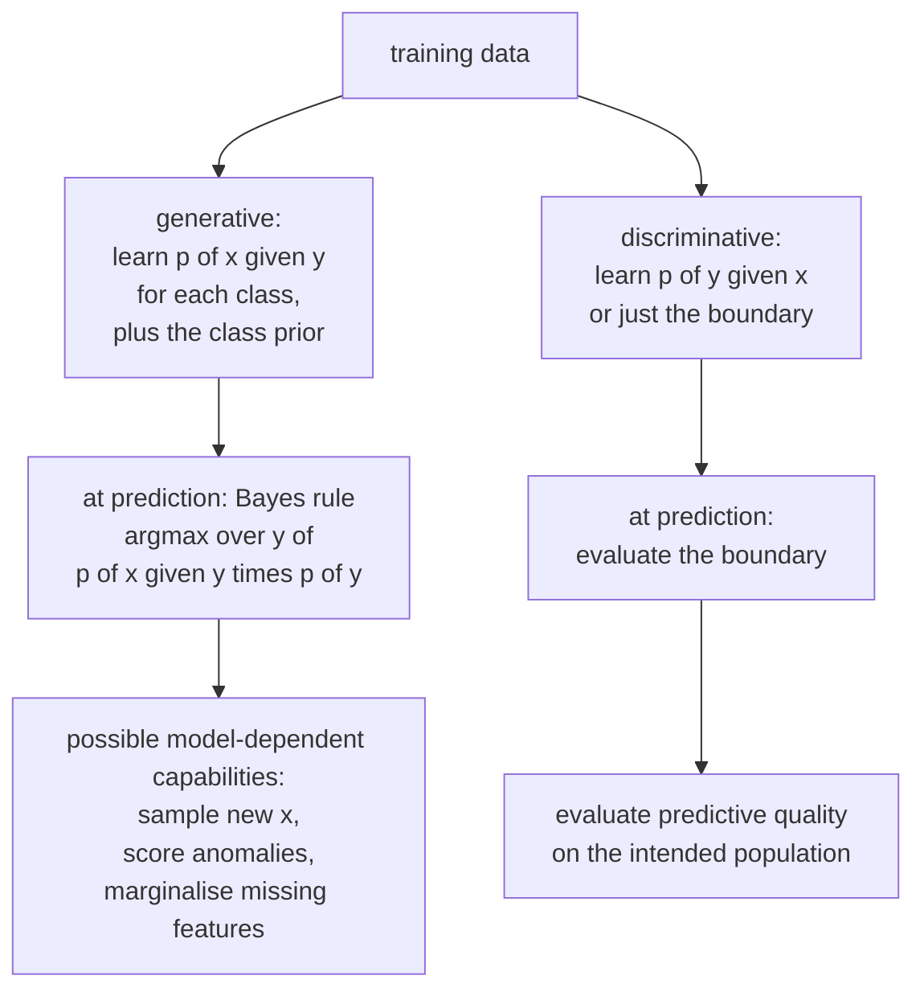

# Probabilistic and Instance-Based Models

Two families that look nothing alike but are usually taught together, because
they are the two clearest examples of learning without fitting a decision
boundary. Naive Bayes models how each class *generates* data; $k$-NN retains examples and defers neighborhood aggregation to prediction time. Both are old, both
are still deployed, and both illustrate ideas that matter far beyond themselves.

## Generative vs discriminative

The distinction organises most of supervised learning.

| | Discriminative | Generative |
|---|---|---|
| Models | $p(y \mid x)$ directly, or just a boundary | $p(x \mid y)$ and $p(y)$, then applies Bayes |
| Examples | logistic regression, SVM, trees, neural nets | naive Bayes, LDA/QDA, GMM, HMM, VAE, diffusion |
| Asks | "which side of the boundary?" | "which class would most likely have produced this?" |
| Needs | depends on model and specification | depends on model and specification |
| Can | directly optimize predictive or decision objectives | sometimes sample, marginalize missing features, or score density |
| Assumptions | hypothesis class, loss, and sampling assumptions | additionally specifies a data-generating distribution |



Ng and Jordan analyze specific generative/discriminative model pairs under stated assumptions. Their learning-curve comparison is not a universal ordering of all methods, and no universal sample-count crossover exists. Compare the actual models and data regime.

## Naive Bayes

### The model

Apply Bayes' rule and pick the most probable class:

$$\hat{y} = \arg\max_c\; p(c \mid \mathbf{x}) = \arg\max_c\; p(c)\,p(\mathbf{x}\mid c)$$

The denominator $p(\mathbf{x})$ is the same for every class, so it drops out.

The problem: $p(\mathbf{x}\mid c) = p(x_1,\dots,x_d\mid c)$ is a
$d$-dimensional joint distribution needing exponentially many parameters.

**The "naive" assumption**: features are conditionally independent given the
class.

$$p(\mathbf{x}\mid c) = \prod_{j=1}^{d}p(x_j\mid c)$$

Now you need $d$ one-dimensional distributions per class instead of one
$d$-dimensional one. Parameter count drops from exponential to linear.

In practice, work in log space to avoid underflow:

$$\hat{y} = \arg\max_c\left[\log p(c) + \sum_{j=1}^{d}\log p(x_j\mid c)\right]$$

### The variants

| Variant | $p(x_j \mid c)$ | For |
|---|---|---|
| **Multinomial NB** | categorical over counts | word counts, TF-IDF, text classification |
| **Bernoulli NB** | Bernoulli per feature | binary presence/absence; explicitly models absence |
| **Gaussian NB** | $\mathcal{N}(\mu_{jc},\sigma_{jc}^2)$ | continuous features |
| **Complement NB** | statistics from the complement class | imbalanced text; often beats multinomial |
| **Categorical NB** | categorical per feature | discrete non-count features |

### Laplace smoothing

If a word never appears in the training documents of class $c$, then
$p(x_j\mid c)=0$, and one zero annihilates the entire product — the class is
ruled out regardless of all other evidence. Add pseudo-counts:

$$p(x_j\mid c) = \frac{\text{count}(x_j,c) + \alpha}{\text{count}(c) + \alpha\,|V|}$$

$\alpha = 1$ is Laplace smoothing; $\alpha < 1$ is Lidstone. In Bayesian terms
this is a **Dirichlet prior** on the categorical parameters, and $\alpha$ is its
concentration. This is the posterior mean/predictive under a symmetric Dirichlet(alpha) prior. An interior MAP under that prior uses count + alpha - 1; the displayed add-alpha formula can instead be a MAP under Dirichlet(alpha + 1).

### Why it works despite being wrong

Words in a document are obviously not conditionally independent — "New" and
"York" co-occur constantly. Yet naive Bayes classifies text well. Two reasons:

1. **You only need the argmax to be right.** The probability estimates are badly
   wrong — typically pushed to 0 or 1 — but the *ranking* of classes often
   survives, because dependence inflates the evidence for the true class and its
   competitors in similar proportion.
2. **Extremely low variance.** With $d\cdot K$ parameters estimated from simple
   counts, there is very little to overfit. Under the bias–variance
   decomposition, naive Bayes takes on enormous bias and almost no variance,
   which is a good trade when data is scarce.

**Assess probability calibration separately from classification.** Correlated features can multiply evidence repeatedly, making naive Bayes overconfident — it will output
0.9999999 routinely. If you need calibrated probabilities, calibrate explicitly
or use a different model.

### Strengths and limits

| Strengths | Limits |
|---|---|
| Trains in one pass; $O(nd)$ | independence assumption is false |
| Works with very little data | probabilities badly calibrated |
| Handles very high dimensions (text) | correlated features double-count evidence |
| Naturally online (`partial_fit`) | cannot capture interactions at all |
| Interpretable per-feature log-odds | Gaussian NB assumes per-feature normality |
| A strong, near-free baseline | usually beaten by a linear model with enough data |

Real deployments: spam filtering (the original), language identification,
document routing, and as the fast first stage of a cascade.

## $k$-nearest neighbours

### The algorithm

There is no fitted global decision-boundary parameter. To predict, find the $k$ closest training points and
aggregate their labels: majority vote for classification, mean for regression.

$$\hat{y}(\mathbf{x}) = \frac{1}{k}\sum_{i \in N_k(\mathbf{x})} y_i \quad\text{or}\quad \arg\max_c \sum_{i\in N_k(\mathbf{x})}\mathbb{1}[y_i=c]$$

This is the canonical **lazy learner**: fitting stores or copies $O(nd)$ data and may construct an index; exact prediction can be expensive.

### The choices that matter

**$k$** controls the bias–variance trade directly:

| $k$ | Boundary | Bias | Variance |
|---|---|---|---|
| 1 | jagged, wraps every point | very low | very high — memorizes distinct labeled rows; conflicting duplicates and tie rules are exceptions |
| moderate | smooth | moderate | moderate |
| $n$ | constant (the global majority) | very high | the learned global majority still varies across training samples |

Choose by cross-validation. Use an odd $k$ for binary classification to avoid
ties. A rough starting point is $k \approx \sqrt{n}$.

**The distance metric** is where domain knowledge enters:

| Metric | Formula | Use for |
|---|---|---|
| Euclidean (L2) | $\sqrt{\sum(a_j-b_j)^2}$ | continuous, comparable scales |
| Manhattan (L1) | $\sum\lvert a_j-b_j\rvert$ | high dimensions, grid-like structure |
| Minkowski | $\left(\sum\lvert a_j-b_j\rvert^p\right)^{1/p}$ | generalises both |
| Cosine | $1 - \frac{\mathbf{a}^\top\mathbf{b}}{\lVert\mathbf{a}\rVert\,\lVert\mathbf{b}\rVert}$ | text, embeddings — magnitude-invariant |
| Hamming | count of differing positions | categorical, binary |
| Mahalanobis | $\sqrt{(\mathbf{a}-\mathbf{b})^\top\Sigma^{-1}(\mathbf{a}-\mathbf{b})}$ | correlated features |
| Learned metric | from a Siamese/metric-learning model | when raw distance is meaningless |

**Choose scales deliberately.** With income in the tens of thousands and age in the
tens, Euclidean distance is entirely income. This is the single most common
$k$-NN mistake.

**Weighting** by inverse distance (`weights="distance"`) lets close neighbours
count more, which changes the bias-variance tradeoff and should be validated rather than assumed better.

### The curse of dimensionality

$k$-NN degrades sharply as $d$ grows, for reasons worth understanding precisely.

- **Distances concentrate.** For random points in high dimensions,
  $\frac{d_{\max}-d_{\min}}{d_{\min}} \to 0$. All points become roughly
  equidistant, so "nearest" stops meaning anything.
- **Data becomes sparse.** To cover a fraction $r$ of the volume of a
  $d$-dimensional unit cube you need a sub-cube of side $r^{1/d}$. For $d=100$
  and $r=0.01$, the side length is 0.955 — a "local" neighbourhood spans 95% of
  each axis, so it is not local at all.
- **Everything is in the shell.** Volume concentrates near the surface, so most
  points are near the boundary of the data, where neighbours are one-sided.

The mitigations: reduce dimensionality first (PCA, UMAP, or a learned
embedding), use a metric suited to the space (cosine on normalised embeddings),
or select features aggressively. Note that $k$-NN on **learned embeddings** works
extremely well — which is why vector search is everywhere — because the embedding
places semantically similar items close together, restoring the meaning of
"near".

### Making it fast

Brute force is $O(nd)$ per query. Better structures:

| Structure | Best for | Complexity |
|---|---|---|
| KD-tree | $d \lesssim 20$, low dimensions | $O(\log n)$ per query when it works |
| Ball tree | moderate $d$, arbitrary metrics | better than KD-tree above ~20 dims |
| Brute force with BLAS | high $d$, moderate $n$ | $O(nd)$, but very fast constants |
| **HNSW** (hierarchical navigable small world) | approximate, high $d$ | sub-linear, the current default |
| **IVF-PQ** | approximate, billion-scale | quantised, memory-efficient |
| LSH | approximate, theoretical guarantees | hash-based |

KD-trees degrade to brute force above roughly 20 dimensions — another face of the
curse. For real embedding search, **approximate nearest neighbour** libraries
(FAISS, hnswlib, ScaNN) are the answer: they trade a small recall loss for orders
of magnitude in speed in suitable settings. Measure retrieval recall and
downstream quality before accepting that trade.

### Where $k$-NN wins

| Situation | Why |
|---|---|
| Vector search / retrieval | it *is* the algorithm behind RAG and semantic search |
| Recommendations from embeddings | item-item similarity |
| Few-shot classification on embeddings | no training needed; add a class by adding examples |
| Highly irregular decision boundaries | non-parametric; no functional form imposed |
| Deduplication, near-duplicate detection | direct similarity |
| Anomaly detection | distance to the $k$-th neighbour is an outlier score |
| Imputation | `KNNImputer` fills from similar rows |
| A baseline you can build in one line | genuinely useful for sanity checks |

And where it loses: large $n$ with exact search, high $d$ on raw features,
imbalanced data (majority classes can dominate neighborhoods; compare distance
weighting or class-aware decision rules), and latency-critical large-scale tasks without an ANN
index.

## Discriminant analysis

Gaussian generative classifiers, sitting between naive Bayes and logistic
regression.

Model $p(\mathbf{x}\mid c) = \mathcal{N}(\boldsymbol\mu_c, \Sigma_c)$.

| | **LDA** | **QDA** | Gaussian NB |
|---|---|---|---|
| Covariance | shared $\Sigma$ across classes | separate $\Sigma_c$ | diagonal, per class |
| Boundary | **linear** | **quadratic** | quadratic, axis-aligned |
| Parameters | $Kd + d^2/2$ | $Kd + Kd^2/2$ | $2Kd$ |
| Needs | moderate data | a lot of data | very little |

The shared-covariance assumption is what makes LDA's boundary linear: the
quadratic terms in the log-ratio cancel. That is worth deriving once — it is the
cleanest example of how a distributional assumption determines a decision
boundary's functional form.

LDA is also a **supervised dimensionality reduction** method: it projects onto at
most $K-1$ directions maximising between-class scatter relative to within-class
scatter. Unlike PCA, which finds directions of maximum variance regardless of
labels, LDA finds directions of maximum class separation. On labelled data where
you want a low-dimensional representation for a downstream classifier, LDA
frequently beats PCA.

QDA needs enough data per class to estimate a full covariance; with $d=100$ that
is 5,050 parameters per class. **Regularised discriminant analysis** shrinks
$\Sigma_c$ toward a shared or diagonal matrix, interpolating between QDA, LDA,
and naive Bayes — a nice illustration of the bias–variance dial.

## Gaussian processes

A GP defines a distribution over *functions*: any finite set of function values
is jointly Gaussian, with covariance given by a kernel.

$$f \sim \mathcal{GP}(m(\mathbf{x}), k(\mathbf{x},\mathbf{x}'))$$

For zero prior mean and independent Gaussian noise, conditioning gives a closed-form posterior mean and **latent-function variance**:

$$\mu_* = K_*^\top(K+\sigma^2I)^{-1}\mathbf{y}, \qquad \sigma_*^2 = k_{**} - K_*^\top(K+\sigma^2I)^{-1}K_*$$

| Strength | Limitation |
|---|---|
| Model-based posterior uncertainty | $O(n^3)$ training, $O(n^2)$ memory |
| Works well with very little data | impractical above ~10k points without approximation |
| The kernel encodes structure (periodicity, smoothness) | kernel choice is a modelling decision |
| Exact Bayesian inference for regression | classification needs approximation |

Where GPs actually get used: **Bayesian optimisation** of expensive functions
(hyperparameter tuning, experiment design, materials discovery), small-data
scientific regression, and time-series with structured kernels. Sparse GPs with
inducing points push the limit to $\sim10^5$ points.

For kernels whose covariance decays with separation, posterior variance tends
toward prior variance as covariance with observations vanishes. Periodic and
structured kernels need not behave monotonically with geometric distance.
Acquisition functions combine the modeled uncertainty and mean to balance
exploration against exploitation; their usefulness depends on those assumptions.

## Choosing among them

| Situation | Model |
|---|---|
| Text classification, small labelled set | Multinomial or Complement naive Bayes |
| Text classification, plenty of data | linear model on TF-IDF, or a fine-tuned encoder |
| Retrieval / semantic search | $k$-NN over embeddings with an ANN index |
| Small data, roughly Gaussian classes | LDA |
| Need to sample or detect out-of-distribution inputs | a generative model |
| Expensive black-box optimisation | Gaussian process + acquisition function |
| Need model-based uncertainty on a small dataset | Gaussian process |
| Features have very different scales | anything but raw $k$-NN — or scale first |

## Bayesian decisions and a worked naive Bayes calculation

Bayes' rule produces a posterior; a decision rule combines that posterior with
loss. For actions $a$ and classes $c$, choose
$a^*=\arg\min_a\sum_c L(a,c)p(c\mid x)$. Maximum-posterior classification
is the special case of equal zero-one error costs. With false-positive cost
$C_{FP}$ and false-negative cost $C_{FN}$, the binary threshold is
$C_{FP}/(C_{FP}+C_{FN})$. Abstention can be optimal when every prediction has
greater expected cost than asking for review.

Generative modeling does not automatically provide every capability in the
opening comparison. Missing-feature inference requires tractable marginalization;
sampling requires a usable generative mechanism; high likelihood is not a
universal out-of-distribution detector. The typical set and the highest-density
region can differ, especially in high dimensions. A discriminative method can
also be paired with uncertainty or anomaly tools.

### Multinomial versus Bernoulli event models

Suppose the vocabulary is {offer, meeting, now}. Class A has counts (6,1,3),
class B has counts (1,7,2), and class priors are equal. Add-one smoothing gives
class-A token probabilities (7,2,4)/13 and class-B probabilities (2,8,3)/13.
For a document containing one offer and one now, posterior odds A:B are
$(7\cdot4)/(2\cdot3)=14/3$, so $p(A\mid x)=14/17\approx0.824$.

The multinomial denominator is total **token events** in the class plus prior
pseudocount mass, not the number of documents. The multinomial combinatorial
coefficient cancels when comparing classes for a fixed document. TF-IDF is a
useful nonnegative weighted-feature adaptation, not literal integer token-count
sampling. Complement NB uses complement-class statistics with its own decision
rule; it is not simply a generative class likelihood with the labels reversed.

Bernoulli NB counts presence and absence separately:
$\log p(x\mid c)=\sum_j[x_j\log\theta_{jc}+(1-x_j)\log(1-\theta_{jc})]$.
A missing word contributes evidence under Bernoulli, while a zero count makes
no token contribution in multinomial NB. Do not feed negative centered features
to a nonnegative count model. Gaussian NB instead estimates class-specific
means and variances; variance smoothing protects numerics but does not make
strongly dependent features independent.

```python runnable
import numpy as np
from sklearn.metrics import accuracy_score, log_loss
from sklearn.model_selection import train_test_split
from sklearn.naive_bayes import BernoulliNB, CategoricalNB, ComplementNB, MultinomialNB

rng = np.random.default_rng(9)
y = np.repeat([0, 1], 120)
rates = np.array([[4.0, 0.7, 2.0, 0.5], [0.6, 4.0, 0.7, 2.0]])
counts = rng.poisson(rates[y])
train, test = train_test_split(np.arange(len(y)), stratify=y, random_state=9)
for name, model, X in [
    ("Multinomial", MultinomialNB(alpha=1.0), counts),
    ("Complement", ComplementNB(alpha=1.0), counts),
    ("Bernoulli", BernoulliNB(alpha=1.0), (counts > 0).astype(int)),
    ("Categorical", CategoricalNB(alpha=1.0, min_categories=4), np.minimum(counts, 3)),
]:
    model.fit(X[train], y[train])
    pred = model.predict(X[test])
    prob = model.predict_proba(X[test])
    assert np.allclose(prob.sum(axis=1), 1)
    assert accuracy_score(y[test], pred) > 0.6
    print(name, "accuracy", accuracy_score(y[test], pred),
          "log loss", log_loss(y[test], prob))
```

The classes and synthetic rates are known only to create the experiment.
Real vocabularies and discretization cut points must be learned on training
data. Categorical NB requires a stable category coding scheme and an explicit
unknown-category policy. Repeating a predictive feature can improve neither
information nor sample size, yet can inflate NB's confidence by double-counting
evidence. Compare log loss, reliability, and accuracy separately.

Online `partial_fit` is useful for count accumulation, but changing vocabulary,
feature order, or category codes across batches silently changes the problem.
Supply the complete class set on the first call and document how class-prior
drift, vocabulary growth, and forgotten historical observations are handled.

## KNN: complete classification and regression workflows

### Geometry, duplicates, and ties

A nearest-neighbor model consists of retained reference examples, a metric,
an index, and an aggregation rule. Increasing $k$ generally smooths local
variation but can wash out minority regions. The $k=n$ classifier is constant
for one fitted dataset, yet its learned majority still varies across samples.
An odd $k$ only prevents an unweighted binary vote tie when all $k$ neighbors
are included; distance ties, multiclass votes, and weighted votes remain.

For points at distances (1,2,4) with regression targets (0,4,8), an unweighted
prediction is four. Inverse-distance weighting gives
$(0+2+2)/(1+1/2+1/4)=16/7$. An exact duplicate at distance zero requires a
special rule, not division by zero. Scikit-learn gives zero-distance neighbors
priority under distance weighting. Conflicting duplicate labels therefore
still require aggregation and may make training accuracy less than one.

Scaling specifies a geometry. Dividing income and age by their training
standard deviations says that one standard deviation of either should have
comparable distance impact. That may or may not match the application. A
Mahalanobis metric whitens covariance directions and needs a stable covariance
estimate; learned metrics need their own training and leakage-safe validation.
For unit-normalized nonzero vectors, squared Euclidean distance equals
$2(1-\cos\theta)$, so cosine and Euclidean neighbor ordering agree.

```python runnable
import numpy as np
from sklearn.datasets import load_wine
from sklearn.metrics import accuracy_score, log_loss
from sklearn.model_selection import GridSearchCV, StratifiedKFold, train_test_split
from sklearn.neighbors import KNeighborsClassifier
from sklearn.pipeline import Pipeline
from sklearn.preprocessing import StandardScaler

X, y = load_wine(return_X_y=True)
X_train, X_test, y_train, y_test = train_test_split(
    X, y, stratify=y, random_state=15)
search = GridSearchCV(
    Pipeline([("scale", StandardScaler()), ("knn", KNeighborsClassifier())]),
    {"knn__n_neighbors": [3, 7, 11], "knn__weights": ["uniform", "distance"],
     "knn__p": [1, 2]}, scoring="accuracy",
    cv=StratifiedKFold(3, shuffle=True, random_state=15), n_jobs=1)
search.fit(X_train, y_train)
pred = search.predict(X_test)
prob = search.predict_proba(X_test)
assert pred.shape == y_test.shape
assert np.allclose(prob.sum(axis=1), 1)
assert accuracy_score(y_test, pred) > 0.7
print(search.best_params_)
print("Accuracy:", accuracy_score(y_test, pred), "log loss:", log_loss(y_test, prob))
fitted = search.best_estimator_
scaled = fitted.named_steps["scale"].transform(X_test[:2])
distance, index = fitted.named_steps["knn"].kneighbors(scaled)
print("Neighbor distances:", distance)
print("Neighbor training labels:", y_train[index])
```

Neighbor probabilities are empirical local proportions, not automatically
calibrated probabilities. Small $k$ can produce zeros and ones that hurt log
loss. Class imbalance can dominate neighborhoods, but distance weighting is not
equivalent to correcting class priors. Evaluate subgroup recall and the actual
decision cost before introducing a class-balanced aggregation rule.

```python runnable
import numpy as np
from sklearn.dummy import DummyRegressor
from sklearn.metrics import mean_squared_error
from sklearn.model_selection import GridSearchCV, KFold, train_test_split
from sklearn.neighbors import KNeighborsRegressor
from sklearn.pipeline import make_pipeline
from sklearn.preprocessing import StandardScaler

rng = np.random.default_rng(16)
X = rng.uniform(-3, 3, size=(240, 1))
y = np.sin(X[:, 0]) + rng.normal(0, 0.12, size=240)
X_train, X_test, y_train, y_test = train_test_split(X, y, random_state=16)
search = GridSearchCV(make_pipeline(StandardScaler(), KNeighborsRegressor()),
    {"kneighborsregressor__n_neighbors": [3, 9, 17],
     "kneighborsregressor__weights": ["uniform", "distance"]},
    scoring="neg_mean_squared_error", cv=KFold(3, shuffle=True, random_state=16))
search.fit(X_train, y_train)
pred = search.predict(X_test)
baseline = DummyRegressor().fit(X_train, y_train).predict(X_test)
assert mean_squared_error(y_test, pred) < mean_squared_error(y_test, baseline)
assert np.isfinite(pred).all()
print("RMSE:", np.sqrt(mean_squared_error(y_test, pred)))
print("Outside training range:", search.predict(np.array([[-6.0], [6.0]])))
```

Outside the observed range, KNN continues aggregating boundary examples. It
does not infer the periodic structure of sine or extrapolate a trend. That
behavior is a property of its retained-example representation, not a bug in the
distance search.

### Exact versus approximate retrieval

Brute force costs approximately $O(nd)$ work per query and $O(nd)$ retained
data. Tree indexes add construction cost and can approach brute force when
their geometric pruning becomes ineffective. Dimension cutoffs such as 20
are heuristics; intrinsic dimension, metric, and distribution matter too.
Batch matrix operations may make brute force faster than a theoretically
better index at moderate sizes.

HNSW trades graph storage and search breadth for approximate recall. IVF-PQ
trades quantization and coarse partitions for memory and speed. LSH has
metric-specific collision guarantees. None guarantees that a small retrieval
recall loss has a small downstream classification or recommendation impact.
Measure recall@k against an exact reference, p50/p95 latency, memory, filtering,
updates, and downstream utility on representative queries. The
[retrieval chapter](../nlp/rag-and-retrieval.md) develops the system side.

Learned embeddings can make semantic neighborhoods meaningful, but validation
must include hard negatives and domain shift. Hubness can make a few points
appear in many neighborhoods. The unit-cube volume argument illustrates
potential sparsity, not a theorem that every high-dimensional dataset is useless:
low-dimensional manifolds and structured representations can behave differently.

## LDA and QDA: deriving the discriminant

For class prior $\pi_c$ and shared covariance $\Sigma$, the Gaussian log score
is $\log\pi_c-\frac12(x-\mu_c)^\top\Sigma^{-1}(x-\mu_c)$ plus
class-independent constants. Expanding and dropping the common quadratic term
gives

$$\delta_c(x)=x^\top\Sigma^{-1}\mu_c
-\frac12\mu_c^\top\Sigma^{-1}\mu_c+\log\pi_c.$$

The difference between two such scores is affine in $x$, so the boundary is
linear. QDA instead uses
$\delta_c(x)=-\frac12\log|\Sigma_c|-\frac12(x-\mu_c)^\top\Sigma_c^{-1}(x-\mu_c)+\log\pi_c$.
Class-specific quadratic terms no longer cancel. Gaussian NB is a diagonal
covariance restriction, not generally a linear classifier.

For example, two one-dimensional classes with equal variance and means zero
and two, equal priors, have a boundary at one. Increasing the prior of the
mean-two class moves that boundary left. Different variances can create two
crossings: a high-variance class can dominate both tails.

Empirical covariance is singular when there are too few independent rows for
the feature dimension. Shrinkage, such as
$\hat\Sigma_\lambda=(1-\lambda)\hat\Sigma+\lambda\tau I$, stabilizes weak
directions. Choosing shrinkage must respect solver support. LDA's supervised
projection has at most $K-1$ dimensions because centered class-mean differences
span at most that rank; unlike PCA, its fitting uses labels.

```python runnable
import numpy as np
from sklearn.datasets import load_wine
from sklearn.discriminant_analysis import LinearDiscriminantAnalysis, QuadraticDiscriminantAnalysis
from sklearn.metrics import accuracy_score, log_loss
from sklearn.model_selection import train_test_split
from sklearn.naive_bayes import GaussianNB
from sklearn.pipeline import make_pipeline
from sklearn.preprocessing import StandardScaler

X, y = load_wine(return_X_y=True)
X_train, X_test, y_train, y_test = train_test_split(
    X, y, stratify=y, random_state=17)
for name, estimator in [
    ("LDA shrinkage", LinearDiscriminantAnalysis(solver="lsqr", shrinkage="auto")),
    ("QDA regularized", QuadraticDiscriminantAnalysis(reg_param=0.1)),
    ("Gaussian NB", GaussianNB()),
]:
    model = make_pipeline(StandardScaler(), estimator)
    model.fit(X_train, y_train)
    pred = model.predict(X_test)
    prob = model.predict_proba(X_test)
    assert np.allclose(prob.sum(axis=1), 1)
    print(name, accuracy_score(y_test, pred), log_loss(y_test, prob))
projection = make_pipeline(StandardScaler(), LinearDiscriminantAnalysis(n_components=2))
projection.fit(X_train, y_train)
embedded = projection.transform(X_test)
assert embedded.shape == (len(X_test), 2)
print("Supervised projection shape:", embedded.shape)
```

A flexible QDA covariance can overfit small classes even when the total sample
is large. Check observations per class, covariance conditioning, prior estimates,
and calibration. A global Gaussian class model can also fail on multimodal
classes; fitting more covariance parameters is not always the right repair.

## Gaussian processes: conditioning, noise, and evaluation

With mean function $m$, training covariance $K$, cross covariance $K_*$, and
noise covariance $\sigma^2I$, the joint Gaussian conditioning identity gives

$$\mu_*=m_*+K_*^\top(K+\sigma^2I)^{-1}(y-m),$$
$$\Sigma_{f_*}=K_{**}-K_*^\top(K+\sigma^2I)^{-1}K_*.$$

These are latent-function predictions. A future noisy observation adds its
noise covariance to $\Sigma_{f_*}$. A zero mean simplifies the formula but is
an assumption, not the definition of a GP. Repeated noisy observations at the
same input can reduce uncertainty about the latent mean without eliminating
irreducible observation noise.

Use a Cholesky factorization $LL^\top=K+\sigma^2I$ and triangular solves,
not an explicit inverse. Jitter stabilizes numerical factorization; it is not
automatically a scientifically estimated noise variance. The log marginal
likelihood combines a fit term, log determinant complexity term, and constant:

$$\log p(y\mid X)=-\frac12(y-m)^\top K_y^{-1}(y-m)
-\frac12\log|K_y|-\frac n2\log(2\pi).$$

Kernel hyperparameters are often fitted by maximizing this quantity, which is
not a guarantee of calibrated uncertainty. Multiple optima, restrictive kernel
families, and estimated hyperparameter uncertainty matter. RBF encodes very
smooth functions; Matern permits rougher behavior; periodic kernels create
correlation between geometrically distant but phase-aligned inputs. Posterior
variance therefore need not increase monotonically with Euclidean distance.

```python runnable
import numpy as np
from sklearn.gaussian_process import GaussianProcessRegressor
from sklearn.gaussian_process.kernels import ConstantKernel, RBF
from sklearn.metrics import mean_squared_error

rng = np.random.default_rng(20)
X_train = np.linspace(-3, 3, 45)[:, None]
noise_std = 0.12
y_train = np.sin(X_train[:, 0]) + rng.normal(0, noise_std, len(X_train))
X_test = np.linspace(-2.9, 2.9, 70)[:, None]
y_test = np.sin(X_test[:, 0]) + rng.normal(0, noise_std, len(X_test))
kernel = ConstantKernel(1.0, constant_value_bounds="fixed") * RBF(1.0, length_scale_bounds="fixed")
model = GaussianProcessRegressor(kernel=kernel, alpha=noise_std ** 2,
                                 optimizer=None, normalize_y=False, random_state=20)
model.fit(X_train, y_train)
mean, latent_std = model.predict(X_test, return_std=True)
observation_std = np.sqrt(latent_std ** 2 + noise_std ** 2)
coverage = np.mean(np.abs(y_test - mean) <= 1.96 * observation_std)
assert mean.shape == y_test.shape and np.isfinite(mean).all()
assert np.all(observation_std >= latent_std)
assert np.sqrt(mean_squared_error(y_test, mean)) < 0.4
print("RMSE:", np.sqrt(mean_squared_error(y_test, mean)))
print("Observed 95% interval coverage:", coverage)
print("Log marginal likelihood:", model.log_marginal_likelihood_value_)
```

Here `alpha` represents training observation noise and the returned uncertainty
is latent uncertainty, so observation noise is added explicitly. Using a
`WhiteKernel` changes prediction covariance semantics; do not add the same noise
twice. Interval coverage on one small sample is noisy: evaluate repeated samples
and conditional coverage, especially under kernel misspecification.

Exact GP regression has cubic factorization cost and quadratic storage in
training count. Inducing-point approximations, structured kernels, and iterative
linear algebra trade approximation assumptions for scale. GP classification
with Bernoulli likelihood is not conjugate and needs an approximation.
In Bayesian optimization, the surrogate mean and uncertainty feed an acquisition
function such as expected improvement or an upper-confidence bound; the
acquisition is a decision policy, not a new posterior.

## Solved extensions and boundaries

1. **Is add-one smoothing MAP under Dirichlet(1)?** No. It is a posterior
   predictive/mean estimate; the interior MAP uses counts plus alpha minus one.
2. **Does KNN fit cost constant time?** No. Data storage/copy and possible index
   construction cost scale with the retained reference set.
3. **Does $k=n$ give zero statistical variance?** No. It is constant for one
   fit, but the learned majority or mean changes across training samples.
4. **Why is LDA linear?** Shared covariance makes the quadratic term cancel in
   class score differences; QDA's separate covariances prevent cancellation.
5. **Which GP interval predicts a new measurement?** Latent variance plus new
   observation noise, with conventions checked against the kernel/API.
6. **Can high density alone prove an input is in-distribution?** No. Typicality,
   model misspecification, and density concentration complicate that inference.

Hierarchical Bayesian models, graphical models, HMMs, VAEs, and diffusion
models remain related families rather than variants of naive Bayes. A latent
state HMM adds sequential dependence and forward/backward inference; a
hierarchical prior partially pools related groups. Their conditional-independence
structure and likelihood must be stated before borrowing the simple product
or conjugate formulas above.

## References

- [Scikit-learn naive Bayes](https://scikit-learn.org/stable/modules/naive_bayes.html): event models and probability limitations.
- [Nearest-neighbor guide](https://scikit-learn.org/stable/modules/neighbors.html): metrics, algorithms, weights, and complexity.
- [Discriminant analysis](https://scikit-learn.org/stable/modules/lda_qda.html): covariance assumptions and shrinkage.
- [Gaussian processes](https://scikit-learn.org/stable/modules/gaussian_process.html): kernels, noise conventions, and posterior APIs.
- [Gaussian Processes for Machine Learning](https://gaussianprocess.org/gpml/): Gaussian conditioning, marginal likelihood, and approximation.
- [Model evaluation](./model-evaluation.md): decision costs, calibration, and valid comparison.

## Self-check

1. State the naive Bayes assumption and explain why the model still classifies
   well when it is false.
2. Why does one zero probability destroy a naive Bayes prediction, and what is
   the principled fix?
3. Why must features be scaled for $k$-NN but not for a decision tree?
4. Explain the "local neighbourhood spans 95% of each axis" calculation and what
   it implies.
5. What makes LDA's boundary linear and QDA's quadratic?
6. Give three things a generative model can do that a discriminative one cannot.
7. Why are Gaussian processes the standard surrogate in Bayesian optimisation?

## Where to go next

- [Unsupervised Learning](./unsupervised-learning.md) — GMMs, clustering, and
  density estimation.
- [Linear Models](./linear-models.md) — logistic regression, the discriminative
  counterpart to naive Bayes.
- [SVMs & Kernels](./svm-and-kernels.md) — the other kernel-method family.
