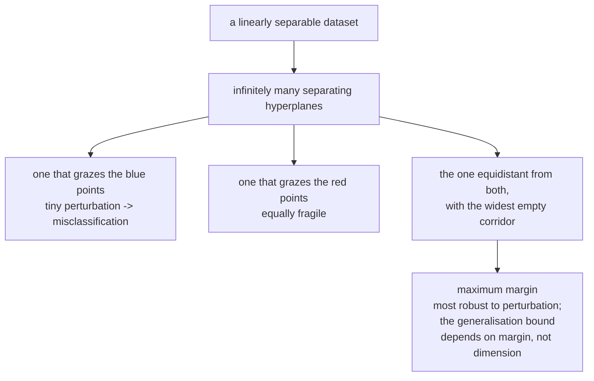

# SVMs and Kernel Methods

The support vector machine is the most mathematically satisfying classical
classifier: a clean geometric idea (maximise the margin), a clean optimisation
formulation (a convex quadratic program), and one genuinely surprising
consequence (the kernel trick, which buys you infinite-dimensional feature
spaces for the price of a dot product).

## The maximum-margin idea

Many hyperplanes separate two linearly separable classes. Which one should you
choose?



The SVM answer: the one with the **largest margin** — the widest slab containing
no training points. The intuition is robustness: a wide margin means a new point
must move far before it crosses the boundary. The theory backs it up — the
generalisation bound depends on the margin and not on the dimensionality of the
feature space, which is what makes infinite-dimensional kernels safe.

## Deriving the hard-margin SVM

A hyperplane is $\mathbf{w}^\top\mathbf{x} + b = 0$. The signed distance from a
point to it is $\frac{\mathbf{w}^\top\mathbf{x}+b}{\|\mathbf{w}\|}$.

Labels are $y_i \in \{-1,+1\}$. Since $(\mathbf{w}, b)$ can be scaled freely,
fix the scale so the closest points satisfy
$|\mathbf{w}^\top\mathbf{x}_i + b| = 1$. Then all points satisfy

$$y_i(\mathbf{w}^\top\mathbf{x}_i + b) \ge 1$$

and the margin width is $\frac{2}{\|\mathbf{w}\|}$. Maximising that is
minimising $\|\mathbf{w}\|$, and squaring for differentiability:

$$\min_{\mathbf{w},b} \; \tfrac12\|\mathbf{w}\|^2 \quad\text{s.t.}\quad y_i(\mathbf{w}^\top\mathbf{x}_i+b)\ge 1 \;\forall i$$

A convex quadratic objective with linear constraints — a QP, with a unique global
optimum.

## The dual, and where support vectors come from

Form the Lagrangian with multipliers $\alpha_i \ge 0$:

$$\mathcal{L} = \tfrac12\|\mathbf{w}\|^2 - \sum_i \alpha_i\left[y_i(\mathbf{w}^\top\mathbf{x}_i+b)-1\right]$$

Stationarity gives

$$\mathbf{w} = \sum_i \alpha_i y_i \mathbf{x}_i, \qquad \sum_i \alpha_i y_i = 0$$

Substituting back yields the **dual problem**:

$$\max_{\boldsymbol\alpha} \; \sum_i \alpha_i - \tfrac12\sum_{i,j}\alpha_i\alpha_j y_i y_j \,\mathbf{x}_i^\top\mathbf{x}_j \quad\text{s.t.}\quad \alpha_i\ge0,\; \sum_i\alpha_iy_i=0$$

Two facts fall out of this, and they are the whole reason the SVM is interesting.

**1. Sparsity.** KKT complementary slackness requires
$\alpha_i\left[y_i(\mathbf{w}^\top\mathbf{x}_i+b)-1\right]=0$. So either
$\alpha_i = 0$, or the constraint is active and the point lies **exactly on the
margin**. Points with $\alpha_i > 0$ are the **support vectors**; every other
training point could be deleted and the solution would be identical.

**2. The data appears only as inner products.** $\mathbf{x}_i^\top\mathbf{x}_j$
is the only way the training data enters the dual — and the same is true of the
prediction rule:

$$f(\mathbf{x}) = \mathrm{sign}\left(\sum_{i \in SV}\alpha_iy_i\,\mathbf{x}_i^\top\mathbf{x} + b\right)$$

That observation is the door to kernels.

## Soft margins

Real data is not separable, and even when it is, a single outlier can force a
terrible margin. Introduce slack variables $\xi_i \ge 0$:

$$\min_{\mathbf{w},b,\boldsymbol\xi} \; \tfrac12\|\mathbf{w}\|^2 + C\sum_i\xi_i \quad\text{s.t.}\quad y_i(\mathbf{w}^\top\mathbf{x}_i+b)\ge1-\xi_i,\; \xi_i\ge0$$

| $\xi_i$ | Meaning |
|---|---|
| $0$ | correctly classified, outside the margin |
| $(0,1)$ | correct side, but inside the margin |
| $1$ | exactly on the boundary |
| $>1$ | misclassified |

$C$ controls the trade-off, and its direction confuses people constantly:

| $C$ | Behaviour |
|---|---|
| **Large** $C$ | violations are expensive → narrow margin, few errors, **low bias, high variance** |
| **Small** $C$ | violations are cheap → wide margin, more errors tolerated, **high bias, low variance** |

$C$ is the *inverse* of regularisation strength. In the dual, the only change is
that $\alpha_i$ is now bounded: $0 \le \alpha_i \le C$ — the "box constraint".

### The hinge-loss view

The soft-margin problem is equivalent to unconstrained minimisation of

$$\sum_i \max\bigl(0,\; 1 - y_i f(\mathbf{x}_i)\bigr) + \lambda\|\mathbf{w}\|^2, \qquad \lambda = \frac{1}{2C}$$

This is regularised empirical risk minimisation with the **hinge loss** — which
places the SVM in the same framework as logistic regression, differing only in
the loss:

| Loss | Formula | Behaviour |
|---|---|---|
| Hinge (SVM) | $\max(0, 1-yf)$ | exactly zero once correct with margin → sparsity |
| Logistic | $\log(1+e^{-yf})$ | never exactly zero → no sparsity, but gives probabilities |
| Exponential (AdaBoost) | $e^{-yf}$ | grows without bound → sensitive to outliers |
| Squared hinge | $\max(0,1-yf)^2$ | smooth, differentiable, penalises large violations harder |
| 0-1 (what we want) | $\mathbb{1}[yf<0]$ | non-convex, non-differentiable, NP-hard |

All the usable losses are **convex surrogates** for the 0-1 loss, chosen because
0-1 has zero gradient almost everywhere. The hinge's flat zero region is exactly
what produces support-vector sparsity.

## The kernel trick

Since the data appears only as $\mathbf{x}_i^\top\mathbf{x}_j$, replace that
inner product with $K(\mathbf{x}_i,\mathbf{x}_j) = \phi(\mathbf{x}_i)^\top
\phi(\mathbf{x}_j)$ for some feature map $\phi$ — **without ever computing
$\phi$**.

### The classic demonstration

Take $\phi(\mathbf{x}) = (x_1^2, x_2^2, \sqrt{2}x_1x_2)$ for a 2-D input. Then

$$\phi(\mathbf{a})^\top\phi(\mathbf{b}) = a_1^2b_1^2 + a_2^2b_2^2 + 2a_1a_2b_1b_2 = (a_1b_1+a_2b_2)^2 = (\mathbf{a}^\top\mathbf{b})^2$$

The left side needs 3 multiplications plus a 3-D dot product; the right side
needs a 2-D dot product and one squaring. For a degree-$p$ polynomial kernel in
$d$ dimensions, $\phi$ has $\binom{d+p}{p}$ components — for $d=100$, $p=5$ that
is over 96 million — while $K$ costs a 100-dimensional dot product. **The
saving grows without bound**, and for the RBF kernel $\phi$ is infinite
dimensional, so computing it is not merely expensive but impossible.

### Mercer's condition

$K$ is a valid kernel iff it is symmetric and the Gram matrix
$K_{ij} = K(\mathbf{x}_i,\mathbf{x}_j)$ is positive semi-definite for every
finite sample. That guarantees a corresponding $\phi$ exists in some Hilbert
space, which is what keeps the dual convex.

### The kernels

| Kernel | Formula | Parameters | Notes |
|---|---|---|---|
| Linear | $\mathbf{a}^\top\mathbf{b}$ | — | high-dimensional sparse data (text) |
| Polynomial | $(\gamma\,\mathbf{a}^\top\mathbf{b}+r)^p$ | $\gamma, r, p$ | explicit interactions; numerically awkward for large $p$ |
| **RBF / Gaussian** | $\exp(-\gamma\lVert\mathbf{a}-\mathbf{b}\rVert^2)$ | $\gamma$ | the default; infinite-dimensional $\phi$ |
| Laplacian | $\exp(-\gamma\lVert\mathbf{a}-\mathbf{b}\rVert_1)$ | $\gamma$ | heavier tails than RBF |
| Sigmoid | $\tanh(\gamma\,\mathbf{a}^\top\mathbf{b}+r)$ | $\gamma, r$ | not always PSD; rarely worth it |
| String / spectrum | shared substring counts | — | text, biological sequences |
| Graph kernels | shared substructures | — | molecules, program graphs |

**Understanding $\gamma$ in the RBF kernel is the key practical skill.**
$K(\mathbf{a},\mathbf{b}) = \exp(-\gamma\|\mathbf{a}-\mathbf{b}\|^2)$ is a
similarity that decays with distance:

| $\gamma$ | Effective radius | Behaviour |
|---|---|---|
| Very small | huge | every point similar to every other → nearly linear, underfits |
| Well chosen | comparable to typical inter-point distance | smooth non-linear boundary |
| Very large | tiny | each point similar only to itself → memorises, wild overfitting |

`gamma="scale"` sets $\gamma = 1/(d\cdot\mathrm{Var}(X))$, which adapts to the
data's scale and is a much better default than the old `"auto"`. **Always scale
your features before an RBF SVM** — the kernel uses Euclidean distance, so a
feature with a large range dominates it entirely.

$C$ and $\gamma$ interact strongly, so tune them **jointly** on a log grid:

```python
from sklearn.svm import SVC
from sklearn.pipeline import make_pipeline
from sklearn.preprocessing import StandardScaler

grid = {"svc__C": np.logspace(-3, 4, 8), "svc__gamma": np.logspace(-5, 2, 8)}
search = GridSearchCV(make_pipeline(StandardScaler(), SVC(kernel="rbf")),
                      grid, cv=5, scoring="roc_auc", n_jobs=-1)
```

## Other members of the family

### Support vector regression

Use an **$\epsilon$-insensitive tube**: no penalty for residuals within
$\epsilon$, linear penalty outside.

$$\min \tfrac12\|\mathbf{w}\|^2 + C\sum_i(\xi_i+\xi_i^*) \quad\text{s.t.}\quad |y_i - f(\mathbf{x}_i)| \le \epsilon + \xi$$

The flat region produces sparsity in exactly the way the hinge loss does for
classification: points inside the tube contribute nothing.

### One-class SVM

Given only "normal" data, find the smallest region containing most of it —
anomaly detection without anomaly labels. The parameter $\nu$ upper-bounds the
fraction of training points allowed outside, and lower-bounds the fraction of
support vectors.

### $\nu$-SVM

Reparameterises $C$ as $\nu \in (0,1]$, which bounds the fraction of margin
errors and support vectors directly — a more interpretable knob than $C$'s
unbounded scale.

### Kernel methods beyond SVMs

The trick generalises to anything expressible in inner products:

| Method | Kernelised version |
|---|---|
| PCA | kernel PCA — non-linear components |
| Ridge regression | kernel ridge regression |
| $k$-means | kernel $k$-means, spectral clustering |
| Linear discriminant analysis | kernel FDA |
| Canonical correlation | kernel CCA |
| Bayesian regression | **Gaussian processes** — a kernel *is* a covariance function |

Gaussian processes are worth a specific mention: the kernel becomes the prior
covariance over functions, and you get calibrated predictive uncertainty for
free. That makes GPs the standard surrogate model in Bayesian hyperparameter
optimisation.

## Multiclass, and probabilities

SVMs are natively binary. `sklearn.svm.SVC` uses **one-vs-one**
($\binom{K}{2}$ classifiers with voting) and `LinearSVC` uses **one-vs-rest**.
One-vs-one trains more models but each on a smaller subset, so it is often
faster overall despite the count.

For probabilities, `probability=True` fits **Platt scaling** — a logistic
regression on the decision values, using internal cross-validation. Two
consequences: it makes `fit` roughly 5× slower, and the resulting
`predict_proba` can occasionally disagree with `predict`, because the sigmoid is
fit separately from the margin. If you need probabilities as a first-class
output, logistic regression or a calibrated tree ensemble is usually the better
choice.

## Complexity, and the practical ceiling

| Aspect | Cost |
|---|---|
| Training (kernel SVM) | between $O(n^2)$ and $O(n^3)$ |
| Memory | $O(n^2)$ for the kernel matrix if cached |
| Prediction | $O(n_{SV} \cdot d)$ — proportional to the number of support vectors |
| Linear SVM (`LinearSVC`, `SGDClassifier`) | $O(nd)$, scales to millions |

**This is the SVM's real limitation.** The quadratic kernel matrix means kernel
SVMs become impractical above roughly $10^5$ samples. Options at scale:

- `LinearSVC` or `SGDClassifier(loss="hinge")` — linear only, but linear in $n$.
- **Nyström approximation** or **random Fourier features** — approximate the
  kernel map explicitly with $m \ll n$ components, then fit a linear model. This
  recovers most of the accuracy at linear cost, and `sklearn.kernel_approximation`
  implements both.
- Subsample, or move to a gradient-boosted ensemble.

Note also that the number of support vectors grows roughly linearly with $n$ for
noisy problems, so inference cost grows with training set size — the opposite of
a parametric model.

## When SVMs are still the right answer

| Situation | Why |
|---|---|
| Small to medium data ($n < 10^5$) with clear margins | strong accuracy, few assumptions |
| $d \gg n$ (text, genomics, spectroscopy) | margin-based bounds do not depend on $d$ |
| High-dimensional sparse text with a linear kernel | `LinearSVC` remains a very strong text baseline |
| Structured inputs with a natural similarity | string, graph, and tree kernels have no neural equivalent that is as cheap |
| You need a convex problem with a unique optimum | reproducibility, no seed dependence |
| One-class anomaly detection | one-class SVM is a principled formulation |

And when they are not: very large $n$, when you need calibrated probabilities,
when features are heterogeneous and unscaled (trees do not care; SVMs do), when
you need interpretability, or when the data is heavily imbalanced (use
`class_weight="balanced"`, but a booster is usually easier).

## Common pitfalls

| Pitfall | Consequence |
|---|---|
| Not scaling features | RBF distance dominated by the largest-range feature |
| Tuning $C$ and $\gamma$ separately | they interact; the joint optimum is missed |
| Using an RBF kernel on 500k rows | training does not finish |
| Expecting `decision_function` to be a probability | it is a margin |
| `probability=True` by default | 5× slower fit, and it can disagree with `predict` |
| Assuming more support vectors is better | it usually means overfitting or noise |
| Polynomial kernel with large $p$ and unscaled data | numerical overflow |
| Treating $C$ as "more regularisation" | it is the inverse — large $C$ means *less* |

## Self-check

1. Derive why maximising the margin is minimising $\|\mathbf{w}\|$.
2. Which KKT condition makes support vectors sparse, and what does it say?
3. Show that $(\mathbf{a}^\top\mathbf{b})^2$ corresponds to an explicit
   3-dimensional feature map for 2-D inputs.
4. Explain what happens to the decision boundary as $\gamma \to \infty$, and why.
5. Does large $C$ mean more or less regularisation? Explain via the objective.
6. Why does an SVM scale badly to $10^6$ rows, and name two ways around it.
7. Compare hinge and logistic loss: what does each give you that the other does
   not?

## Where to go next

- [Linear Models](./linear-models.md) — logistic regression, the SVM's closest
  relative.
- [Trees & Ensembles](./trees-and-ensembles.md) — what usually beats SVMs on
  tabular data, and why.
- [Optimization](../math.md) — the convex-programming machinery behind the dual.
