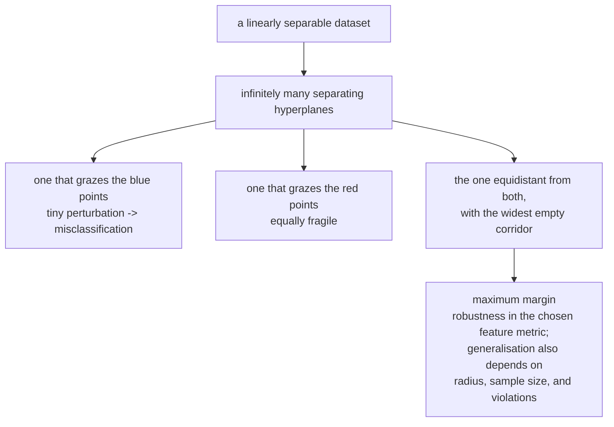

# SVMs and Kernel Methods

The support vector machine is the most mathematically satisfying classical
classifier: a clean geometric idea (maximise the margin), a clean optimisation
formulation (a convex quadratic program), and one genuinely surprising
consequence (the kernel trick, which buys you infinite-dimensional feature
spaces for the price of a dot product).

## The maximum-margin idea

Many hyperplanes separate two linearly separable classes. Which one should you
choose?



The SVM answer: the one with the **largest margin** — the widest slab containing
no training points. The intuition is robustness: a wide margin means a new point
must move far before it crosses the boundary. The theory backs it up — the
some generalisation bounds replace explicit feature dimension with the ratio of
feature-space radius to margin, together with sample size and margin violations.
An infinite-dimensional kernel is not automatically protected against overfitting.
The kernel determines what counts as a nearby point.

## Deriving the hard-margin SVM

A hyperplane is $\mathbf{w}^\top\mathbf{x} + b = 0$. The signed distance from a
point to it is $\frac{\mathbf{w}^\top\mathbf{x}+b}{\|\mathbf{w}\|}$.

Labels are $y_i \in \{-1,+1\}$. Since $(\mathbf{w}, b)$ can be scaled freely,
fix the scale so the closest points satisfy
$|\mathbf{w}^\top\mathbf{x}_i + b| = 1$. Then all points satisfy

$$y_i(\mathbf{w}^\top\mathbf{x}_i + b) \ge 1$$

and the margin width is $\frac{2}{\|\mathbf{w}\|}$. Maximising that is
minimising $\|\mathbf{w}\|$, and squaring for differentiability:

$$\min_{\mathbf{w},b} \; \tfrac12\|\mathbf{w}\|^2 \quad\text{s.t.}\quad y_i(\mathbf{w}^\top\mathbf{x}_i+b)\ge 1 \;\forall i$$

A convex quadratic objective with linear constraints: a QP. When feasible, strict
convexity in $\mathbf w$ makes the optimal weight vector unique. This does not
establish uniqueness of every dual multiplier or, in general SVM formulations,
the unpenalized intercept. Duplicate observations can create nonunique dual
representations of the same decision function. Convexity rules out spurious local
minima; it does not make solver tolerances, randomized solvers, and calibration
seeds irrelevant.

### A complete one-dimensional solution

Take $x=(-2,-1,1,2)$ with labels $y=(-1,-1,1,1)$. The closest opposite-class
points impose $w-b\ge1$ and $w+b\ge1$. Adding them gives $w\ge1$; the smallest
norm solution is $w=1,b=0$. The boundary is zero and the margin boundaries are
$-1$ and $1$, so the corridor width is two. The outer observations have functional
margin two and impose no additional restriction at this optimum.

Scaling all inputs by ten makes the solution $w=0.1$ and the numerical margin
width twenty. Nothing became intrinsically easier: we changed the units in which
distance is measured. Scaling different coordinates by different amounts changes
which separating direction has the smallest penalized norm. Scaling is part of
the model's regularization geometry, not merely an optimizer convenience.

## The dual, and where support vectors come from

Form the Lagrangian with multipliers $\alpha_i \ge 0$:

$$\mathcal{L} = \tfrac12\|\mathbf{w}\|^2 - \sum_i \alpha_i\left[y_i(\mathbf{w}^\top\mathbf{x}_i+b)-1\right]$$

Stationarity gives

$$\mathbf{w} = \sum_i \alpha_i y_i \mathbf{x}_i, \qquad \sum_i \alpha_i y_i = 0$$

Substituting back yields the **dual problem**:

$$\max_{\boldsymbol\alpha} \; \sum_i \alpha_i - \tfrac12\sum_{i,j}\alpha_i\alpha_j y_i y_j \,\mathbf{x}_i^\top\mathbf{x}_j \quad\text{s.t.}\quad \alpha_i\ge0,\; \sum_i\alpha_iy_i=0$$

Two facts fall out of this, and they are the whole reason the SVM is interesting.

**1. Sparsity.** KKT complementary slackness requires
$\alpha_i\left[y_i(\mathbf{w}^\top\mathbf{x}_i+b)-1\right]=0$. So either
$\alpha_i = 0$, or the constraint is active and the point lies **exactly on the
margin**. Points with $\alpha_i > 0$ are the **support vectors**; every other
training point could be deleted and the solution would be identical.

**2. The data appears only as inner products.** $\mathbf{x}_i^\top\mathbf{x}_j$
is the only way the training data enters the dual — and the same is true of the
prediction rule:

$$f(\mathbf{x}) = \mathrm{sign}\left(\sum_{i \in SV}\alpha_iy_i\,\mathbf{x}_i^\top\mathbf{x} + b\right)$$

That observation is the door to kernels.

## Soft margins

Real data is not separable, and even when it is, a single outlier can force a
terrible margin. Introduce slack variables $\xi_i \ge 0$:

$$\min_{\mathbf{w},b,\boldsymbol\xi} \; \tfrac12\|\mathbf{w}\|^2 + C\sum_i\xi_i \quad\text{s.t.}\quad y_i(\mathbf{w}^\top\mathbf{x}_i+b)\ge1-\xi_i,\; \xi_i\ge0$$

| $\xi_i$ | Meaning |
|---|---|
| $0$ | correctly classified, on or outside the margin |
| $(0,1)$ | correct side, but inside the margin |
| $1$ | exactly on the boundary |
| $>1$ | misclassified |

$C$ controls the trade-off, and its direction confuses people constantly:

| $C$ | Behaviour |
|---|---|
| **Large** $C$ | violations are expensive; less relative regularization |
| **Small** $C$ | violations are cheaper; more relative regularization |

$C$ is the *inverse* of regularisation strength. In the dual, the only change is
that $\alpha_i$ is now bounded: $0 \le \alpha_i \le C$ — the "box constraint".

These are tendencies, not guarantees about test variance or error counts. The
complete soft-margin KKT conditions also include
$\alpha_i[y_i f_i-1+\xi_i]=0$ and $(C-\alpha_i)\xi_i=0$. Consequently:

| Multiplier | Consequence at an optimum |
|---|---|
| $\alpha_i=0$ | $\xi_i=0$ and $y_i f_i\ge1$ |
| $0<\alpha_i<C$ | $\xi_i=0$ and $y_i f_i=1$ |
| $\alpha_i=C$ | $y_i f_i=1-\xi_i\le1$ |

A point with $\alpha_i=C$ is not necessarily misclassified. It can be correctly
classified inside the margin or exactly on the margin. Conversely, a point on
the margin can have zero multiplier in a degenerate solution. Do not reverse
these implications without additional assumptions. With sample or class weights,
replace $C$ by the observation-specific upper bound $C_i$.

For a free support vector, recover the intercept from
$b=y_i-\sum_j\alpha_jy_jK(x_j,x_i)$. Averaging this expression over several free
support vectors reduces numerical noise. When none are free, the inequality
constraints instead provide bounds on $b$; blindly averaging over every support
vector includes margin violators and is incorrect.

### The hinge-loss view

The soft-margin problem is equivalent to unconstrained minimisation of

$$\sum_i \max\bigl(0,\; 1 - y_i f(\mathbf{x}_i)\bigr) + \lambda\|\mathbf{w}\|^2, \qquad \lambda = \frac{1}{2C}$$

This is regularised empirical risk minimisation with the **hinge loss** — which
places the SVM in the same framework as logistic regression, differing only in
the loss:

| Loss | Formula | Behaviour |
|---|---|---|
| Hinge (SVM) | $\max(0, 1-yf)$ | exactly zero once correct with margin → sparsity |
| Logistic | $\log(1+e^{-yf})$ | no finite zero-loss region; supports a probabilistic model, not guaranteed calibration |
| Exponential (AdaBoost) | $e^{-yf}$ | grows without bound → sensitive to outliers |
| Squared hinge | $\max(0,1-yf)^2$ | smooth, differentiable, penalises large violations harder |
| 0-1 | $\mathbb{1}[yf\le0]$ | discontinuous; exact empirical minimization is generally hard |

All the usable losses are **convex surrogates** for the 0-1 loss, chosen because
0-1 has zero gradient almost everywhere. The hinge's flat zero region is exactly
what produces support-vector sparsity.

Normalization matters when comparing libraries. Dividing the primal by $Cn$
gives mean hinge loss plus $\|w\|^2/(2Cn)$. Thus an objective written as mean loss
plus $\lambda\|w\|^2/2$ has $\lambda=1/(Cn)$, not $1/C$. Duplicating every
observation changes the relative penalty if $C$ remains fixed. Also distinguish
`SVC(kernel="linear")` from `LinearSVC`: their default losses, intercept treatment,
multiclass reduction, and solvers differ. Equal parameter names do not imply equal
optimization problems. [The scikit-learn SVM guide](https://scikit-learn.org/stable/modules/svm.html)
documents these estimator differences.

### Runnable lab: verify the dual and KKT conditions

This experiment checks the one-dimensional solution rather than trusting only
classification accuracy. `dual_coef_` already contains the signed coefficients
$\alpha_i y_i$. The assertions are approximate because a numerical QP solver uses
tolerances.

```python runnable
import numpy as np
from sklearn.svm import SVC, SVR

X = np.array([[-2.0], [-1.0], [1.0], [2.0]])
y = np.array([-1, -1, 1, 1])
C = 10.0
model = SVC(kernel="linear", C=C, tol=1e-10).fit(X, y)
signed = model.dual_coef_[0]
alpha = np.zeros(len(y))
alpha[model.support_] = np.abs(signed)
w = signed @ model.support_vectors_
margin = y * model.decision_function(X)
slack = np.maximum(0.0, 1.0 - margin)
assert np.allclose(w, [1.0], atol=1e-7)
assert np.allclose(model.intercept_, [0.0], atol=1e-7)
assert np.allclose(alpha, [0.0, 0.5, 0.5, 0.0], atol=1e-7)
assert abs(alpha @ y) < 1e-7
assert np.allclose(alpha * (margin - 1.0 + slack), 0.0, atol=1e-7)
assert np.allclose((C - alpha) * slack, 0.0, atol=1e-7)
primal = 0.5 * (w @ w) + C * slack.sum()
dual = alpha.sum() - 0.5 * (w @ w)
assert abs(primal - dual) < 1e-7

points = np.array([[1.0, 2.0], [-1.0, 0.5], [2.0, -1.0]])
phi = np.column_stack((points[:, 0] ** 2, points[:, 1] ** 2,
                       np.sqrt(2.0) * points[:, 0] * points[:, 1]))
gram = (points @ points.T) ** 2
assert np.allclose(phi @ phi.T, gram)
assert np.linalg.eigvalsh(gram).min() > -1e-10

reg = SVR(kernel="linear", C=10.0, epsilon=0.1).fit(X, X[:, 0])
residual = np.abs(X[:, 0] - reg.predict(X))
assert residual.max() <= 0.1001
print("weights", w, "multipliers", alpha, "duality gap", primal - dual)
```

## The kernel trick

Since the data appears only as $\mathbf{x}_i^\top\mathbf{x}_j$, replace that
inner product with $K(\mathbf{x}_i,\mathbf{x}_j) = \phi(\mathbf{x}_i)^\top
\phi(\mathbf{x}_j)$ for some feature map $\phi$ — **without ever computing
$\phi$**.

### The classic demonstration

Take $\phi(\mathbf{x}) = (x_1^2, x_2^2, \sqrt{2}x_1x_2)$ for a 2-D input. Then

$$\phi(\mathbf{a})^\top\phi(\mathbf{b}) = a_1^2b_1^2 + a_2^2b_2^2 + 2a_1a_2b_1b_2 = (a_1b_1+a_2b_2)^2 = (\mathbf{a}^\top\mathbf{b})^2$$

The left side needs 3 multiplications plus a 3-D dot product; the right side
needs a 2-D dot product and one squaring. For a degree-$p$ polynomial kernel in
$d$ dimensions, the homogeneous kernel $(a^Tb)^p$ uses
$\binom{d+p-1}{p}$ degree-exactly-$p$ monomials. A polynomial kernel with a
positive constant offset also contains lower degrees, giving $\binom{d+p}{p}$
features. For $d=100,p=5$, either count is tens of millions. RBF has an
infinite-dimensional representation, but its exact pairwise kernel is inexpensive
to evaluate. This saves feature construction, not the cost of comparing many
training observations.

### The function-space regularizer

In a reproducing-kernel Hilbert space, write the objective as
$\frac12\|f\|_{\mathcal H}^2+C\sum_i\max(0,1-y_i[f(x_i)+b])$.
The intercept is separate from the penalized function here. A representer argument
explains why an infinite-dimensional optimization can have a finite solution:
decompose $f=f_{\parallel}+f_{\perp}$ relative to the span of the training kernel
sections $K(x_i,\cdot)$. The reproducing property makes $f_{\perp}(x_i)=0$ at all
training observations. It cannot improve the empirical loss, but increases the
squared norm unless it is zero. Therefore an optimum can be expressed in the
training span.

If $f(x)=\sum_i c_iK(x_i,x)$, then $\|f\|_{\mathcal H}^2=c^TKc$, not generally
$\|c\|_2^2$. A small coefficient norm is not interchangeable with a small RKHS
function norm. When the Gram matrix is singular, different coefficient vectors
can represent the same function on the relevant span, another reason dual
uniqueness must not be assumed.

Kernel normalization changes this regularization geometry. Multiplying the kernel
by a positive constant multiplies all squared feature-space distances and changes
the relation between function size and penalty. Retune $C$ after changing kernel
scale. Combining kernels for heterogeneous modalities also requires explicit
weights: a text similarity and a sensor similarity do not have inherently
comparable units just because both return one scalar.

### Mercer's condition

$K$ is a valid kernel iff it is symmetric and the Gram matrix
$K_{ij} = K(\mathbf{x}_i,\mathbf{x}_j)$ is positive semi-definite for every
finite sample. That guarantees a corresponding $\phi$ exists in some Hilbert
space, which is what keeps the dual convex.

### The kernels

| Kernel | Formula | Parameters | Notes |
|---|---|---|---|
| Linear | $\mathbf{a}^\top\mathbf{b}$ | — | high-dimensional sparse data (text) |
| Polynomial | $(\gamma\,\mathbf{a}^\top\mathbf{b}+r)^p$ | $\gamma, r, p$ | explicit interactions; numerically awkward for large $p$ |
| **RBF / Gaussian** | $\exp(-\gamma\lVert\mathbf{a}-\mathbf{b}\rVert^2)$ | $\gamma$ | the default; infinite-dimensional $\phi$ |
| Laplacian | $\exp(-\gamma\lVert\mathbf{a}-\mathbf{b}\rVert_1)$ | $\gamma$ | heavier tails than RBF |
| Sigmoid | $\tanh(\gamma\,\mathbf{a}^\top\mathbf{b}+r)$ | $\gamma, r$ | not always PSD; rarely worth it |
| String / spectrum | shared substring counts | — | text, biological sequences |
| Graph kernels | shared substructures | — | molecules, program graphs |

Nonnegative sums and products of valid kernels remain valid; arbitrary similarity
functions do not. Checking one Gram matrix for negative eigenvalues can reject a
candidate, but passing that check does not prove validity for every possible
dataset. A precomputed training Gram matrix has shape $(n,n)$; prediction needs
the cross-kernel of shape $(n_{test},n)$ with exactly the same training-column
order. A square test-test matrix is the wrong object.

For kernel PCA, centering happens in feature space: $K_c=HKH$ with
$H=I-\mathbf1\mathbf1^T/n$. A test kernel row must subtract its mean over training
points and the stored training column means, then add the training grand mean.
Centering test and training Gram matrices independently changes the feature
coordinate system and leaks evaluation-distribution information.

**Understanding $\gamma$ in the RBF kernel is the key practical skill.**
$K(\mathbf{a},\mathbf{b}) = \exp(-\gamma\|\mathbf{a}-\mathbf{b}\|^2)$ is a
similarity that decays with distance:

| $\gamma$ | Effective radius | Behaviour |
|---|---|---|
| Very small | huge | kernel approaches a constant matrix; commonly underfits unless other parameters compensate |
| Well chosen | comparable to typical inter-point distance | smooth non-linear boundary |
| Very large | tiny | each point similar only to itself → memorises, wild overfitting |

`gamma="scale"` sets $\gamma = 1/(d\cdot\mathrm{Var}(X))$, which adapts to the
data's overall scale. Standardizing meaningful continuous features is a useful
baseline, but do not blindly give noise coordinates or one-hot columns the same
weight as informative measurements. For sparse text, use sparse-preserving
normalization rather than mean centering. Preprocessing must be fitted inside
each training fold.

$C$ and $\gamma$ interact strongly, so tune them **jointly** on a log grid:

```python runnable
import numpy as np
from sklearn.datasets import make_moons
from sklearn.model_selection import train_test_split, GridSearchCV
from sklearn.metrics import accuracy_score
from sklearn.kernel_approximation import RBFSampler
from sklearn.svm import LinearSVC
from sklearn.svm import SVC
from sklearn.pipeline import make_pipeline
from sklearn.preprocessing import StandardScaler

X, y = make_moons(n_samples=360, noise=0.18, random_state=7)
X_train, X_test, y_train, y_test = train_test_split(
    X, y, test_size=0.25, stratify=y, random_state=11)
grid = {"svc__C": [0.1, 1.0, 10.0], "svc__gamma": [0.1, 1.0, 10.0]}
search = GridSearchCV(make_pipeline(StandardScaler(), SVC(kernel="rbf")),
                      grid, cv=3, scoring="roc_auc", n_jobs=1)
search.fit(X_train, y_train)
exact_accuracy = accuracy_score(y_test, search.predict(X_test))
approx = make_pipeline(StandardScaler(),
    RBFSampler(gamma=search.best_params_["svc__gamma"],
               n_components=256, random_state=3),
    LinearSVC(C=search.best_params_["svc__C"], dual=False,
              max_iter=5000, random_state=3))
approx.fit(X_train, y_train)
approx_accuracy = accuracy_score(y_test, approx.predict(X_test))
assert exact_accuracy > 0.85
assert approx_accuracy > 0.80
assert search.best_estimator_.named_steps["svc"].support_vectors_.shape[1] == 2
print("best", search.best_params_, "exact", exact_accuracy,
      "random features", approx_accuracy)
for params, mean, std in zip(search.cv_results_["params"],
        search.cv_results_["mean_test_score"], search.cv_results_["std_test_score"]):
    print("C/gamma response", params, "mean AUC", mean, "fold spread", std)
print("exact support vectors", search.best_estimator_.named_steps["svc"].n_support_.sum(),
      "approximation width", approx.named_steps["rbfsampler"].n_components)
```

This is a small demonstration, not a fair exhaustive comparison: a random-feature
model should receive its own validation search over feature count and penalty.
The holdout is inspected only after choosing the exact model. Kernel approximation
can change the best $C$, and `LinearSVC` uses squared hinge by default.

The printed response table is more informative than only `best_params_`: nearby
strong configurations indicate a plateau, while an isolated maximum deserves
repeated-split investigation. Class weighting changes the relative box constraints
and hence the boundary; it is not merely a post-hoc threshold adjustment. Evaluate
minority recall, precision, and calibration under deployment prevalence instead
of treating `class_weight="balanced"` as a complete imbalance solution.

## Other members of the family

### Support vector regression

Use an **$\epsilon$-insensitive tube**: no penalty for residuals within
$\epsilon$, linear penalty outside.

$$\min_{w,b,\xi,\xi^*} \tfrac12\|w\|^2+C\sum_i(\xi_i+\xi_i^*)$$

subject to $y_i-f(x_i)\le\epsilon+\xi_i$,
$f(x_i)-y_i\le\epsilon+\xi_i^*$, and $\xi_i,\xi_i^*\ge0$.
The equivalent residual loss is $\max(0,|y_i-f(x_i)|-\epsilon)$. With
$\epsilon=0.2$, residual magnitudes $0.1$ and $0.5$ contribute zero and $0.3$,
respectively. The two slacks represent opposite sides of the tube; one unspecified
slack in an absolute-value constraint is not this two-slack primal.

The flat region produces sparsity in exactly the way the hinge loss does for
classification: points strictly inside the tube have zero dual coefficients.
The dual prediction uses $(\alpha_i-\alpha_i^*)K(x_i,x)$, with both multipliers
between zero and $C$ and their differences summing to zero. Tune $\epsilon$ in
target units; changing dollars to cents changes the sensible tube width.

### One-class SVM

Given mostly normal data, separate its mapped observations from the origin in
feature space while controlling violations. This is not literally a minimum-volume
region objective. The parameter $\nu$ upper-bounds the training-error fraction and
lower-bounds the support-vector fraction under the formulation's assumptions;
finite solver tolerances affect boundary counts. It does not promise a particular
future anomaly rate. Contaminated training data, shifted sensors, and unscaled
features can all produce misleading novelty scores.

### $\nu$-SVM

Uses $\nu$ to upper-bound the fraction of margin errors and lower-bound the
support-vector fraction. Not every value is feasible for every class balance;
this is an alternative constrained formulation, not a universal data-independent
conversion from $C$ to $\nu$.

### Kernel methods beyond SVMs

The trick generalises to anything expressible in inner products:

| Method | Kernelised version |
|---|---|
| PCA | kernel PCA — non-linear components |
| Ridge regression | kernel ridge regression |
| $k$-means | kernel $k$-means, spectral clustering |
| Linear discriminant analysis | kernel FDA |
| Canonical correlation | kernel CCA |
| Bayesian regression | **Gaussian processes** — a kernel *is* a covariance function |

Gaussian processes are worth a specific mention: the kernel becomes the prior
covariance over functions, yielding a posterior predictive distribution under a
specified likelihood and prior. Its empirical calibration depends on those
assumptions, fitted hyperparameters, and distribution shift. Analytic uncertainty
is not free assurance that the model is correct. GPs are one useful surrogate in
Bayesian hyperparameter optimization.

## Multiclass, and probabilities

SVMs are natively binary. `sklearn.svm.SVC` uses **one-vs-one**
($\binom{K}{2}$ classifiers with voting) and `LinearSVC` uses **one-vs-rest**.
One-vs-one trains more models but each on a smaller subset, so it is often
faster overall despite the count.

For probabilities, `probability=True` fits **Platt scaling** — a logistic
regression on the decision values, using internal cross-validation. Two
consequences: internal calibration adds substantial training work, and the resulting
`predict_proba` can occasionally disagree with `predict`, because the sigmoid is
fit separately from the margin. If you need probabilities as a first-class
output, logistic regression or a calibrated tree ensemble is usually the better
choice.

## Complexity, and the practical ceiling

| Aspect | Cost |
|---|---|
| Training (kernel SVM) | between $O(n^2)$ and $O(n^3)$ |
| Memory | $O(n^2)$ for the kernel matrix if cached |
| Prediction | $O(n_{SV} \cdot d)$ — proportional to the number of support vectors |
| Linear SVM (`LinearSVC`, `SGDClassifier`) | approximately $O(nd)$ per pass for dense data; passes and convergence still matter |

These are planning heuristics, not universal tight bounds. LIBSVM uses a bounded
kernel cache and need not materialize the entire Gram matrix; a user-provided
precomputed matrix does. Actual time depends strongly on separability, tolerance,
kernel evaluation cost, and support-vector count. Benchmark on a scaling ladder
instead of declaring a universal sample cutoff. Options at scale:

- `LinearSVC` or `SGDClassifier(loss="hinge")` — linear only, but linear in $n$.
- **Nyström approximation** or **random Fourier features** — approximate the
  kernel map explicitly with $m \ll n$ components, then fit a linear model. This
  trades approximation error and feature memory for cheaper optimization.
  `sklearn.kernel_approximation` implements both.
- Subsample, or move to a gradient-boosted ensemble.

Note also that the number of support vectors grows roughly linearly with $n$ for
noisy problems, so inference cost grows with training set size — the opposite of
a parametric model.

### What the approximations compute

For RBF, draw $\omega_j\sim\mathcal N(0,2\gamma I)$ and
$b_j\sim\mathrm{Uniform}(0,2\pi)$, then define
$z_j(x)=\sqrt{2/m}\cos(\omega_j^Tx+b_j)$. Averaging over phases removes the
sum-angle term. The Gaussian characteristic function gives
$\mathbb E[z(x)^Tz(x')]=\exp(-\gamma\|x-x'\|^2)$. More random features generally
reduce approximation noise, but do not guarantee monotone holdout accuracy in a
single draw. The feature matrix costs $O(nm)$ memory if fully materialized; it can
also be produced in batches for an incremental linear learner.

Nyström selects $m$ landmark observations. Let $B=K(X,L)$ have shape $(n,m)$ and
$W=K(L,L)$ have shape $(m,m)$. The approximation is $BW^\dagger B^T$; an explicit
map can be built from the retained eigendecomposition of $W$. Tiny eigenvalues
need truncation or numerical regularization. Landmark coverage matters: uniform
sampling may miss a rare but important region. Both approaches preserve a fixed
feature width at prediction time, unlike evaluation against every support vector.
See the [official kernel-approximation guide](https://scikit-learn.org/stable/modules/kernel_approximation.html)
for the library estimators and computational tradeoffs.

## When SVMs are still the right answer

| Situation | Why |
|---|---|
| Small to medium data ($n < 10^5$) with clear margins | strong accuracy, few assumptions |
| $d \gg n$ (text, genomics, spectroscopy) | norm regularization can be effective when feature geometry is appropriate |
| High-dimensional sparse text with a linear kernel | `LinearSVC` remains a very strong text baseline |
| Structured inputs with a natural similarity | string, graph, and tree kernels provide useful domain-specific baselines |
| You need convex optimization | globally optimal solutions up to numerical tolerance; uniqueness depends on the formulation |
| One-class anomaly detection | one-class SVM is a principled formulation |

And when they are not: very large $n$, when you need calibrated probabilities,
when features are heterogeneous and unscaled (trees do not care; SVMs do), when
you need interpretability, or when the data is heavily imbalanced (use
`class_weight="balanced"`, but a booster is usually easier).

## Common pitfalls

Before blaming the kernel, inspect input shape, target encoding, finite values,
training-only preprocessing state, and the support-vector fraction. Compare
training and validation decision scores, not just class labels: a stable ranking
with a poor threshold calls for a different intervention than chance-level
ranking. Record solver convergence warnings and tolerance before interpreting
tiny differences in the fitted objective as meaningful.

| Pitfall | Consequence |
|---|---|
| Not scaling features | RBF distance dominated by the largest-range feature |
| Tuning $C$ and $\gamma$ separately | they interact; the joint optimum is missed |
| Using an RBF kernel on 500k rows | training does not finish |
| Expecting `decision_function` to be a probability | it is a margin |
| `probability=True` by default | additional calibration cost; probabilities can disagree with `predict` |
| Assuming more support vectors is better | support count measures prediction cost, not quality by itself |
| Polynomial kernel with large $p$ and unscaled data | numerical overflow |
| Treating $C$ as "more regularisation" | it is the inverse — large $C$ means *less* |

## Self-check

### Worked diagnostic questions

**Why does a support multiplier equal to $C$ not prove a wrong prediction?**
The KKT identity is $yf=1-\xi$. For $\xi=0.3$, the signed score is $0.7$:
correct side of the boundary but inside the margin. Misclassification requires
$\xi>1$. A free multiplier instead requires zero slack and signed score one.

**What happens when every training observation is duplicated?** The summed
hinge loss doubles, whereas the weight penalty does not. Halving $C$ preserves
the original primal objective. Keeping $C$ fixed makes the loss relatively more
important. This explains why translating regularization values across mean-loss
and sum-loss libraries requires the sample-count factor.

**An RBF model has almost perfect training accuracy and chance-level validation
accuracy. Which measurements distinguish causes?** Inspect the train-only scaled
distance distribution, selected $\gamma$, support fraction, duplicate/group split
policy, and learning curves. A nearly identity training Gram matrix suggests an
overly local kernel, but mislabeled data, leakage in the split, or distribution
shift can create related symptoms. Test a linear baseline and a joint $C,\gamma$
search without repeatedly selecting against the final holdout.

**Why does a precomputed test matrix have $n$ columns?** Each decision is a weighted
sum over training support vectors, whose indices refer to the training ordering.
It needs similarities to those observations, not similarities among test rows.

**Does logistic loss guarantee calibrated probabilities?** No. It supplies a
proper probabilistic training objective, but finite data, regularization, model
misspecification, class reweighting, and shift can all impair calibration.

1. Derive why maximising the margin is minimising $\|\mathbf{w}\|$.
2. Which KKT condition makes support vectors sparse, and what does it say?
3. Show that $(\mathbf{a}^\top\mathbf{b})^2$ corresponds to an explicit
   3-dimensional feature map for 2-D inputs.
4. Explain what happens to the decision boundary as $\gamma \to \infty$, and why.
5. Does large $C$ mean more or less regularisation? Explain via the objective.
6. Why does an SVM scale badly to $10^6$ rows, and name two ways around it.
7. Compare hinge and logistic loss: what does each give you that the other does
   not?

## Where to go next

- [Linear Models](./linear-models.md) — logistic regression, the SVM's closest
  relative.
- [Trees & Ensembles](./trees-and-ensembles.md) — what usually beats SVMs on
  tabular data, and why.
- [Optimization](../math/optimization.md) — the convex-programming machinery behind the dual.
- [Feature Engineering](./feature-engineering.md) — fold-local scaling and sparse representations.
- [Hyperparameter Tuning](./hyperparameter-tuning.md) — joint kernel search and untouched evaluation.
