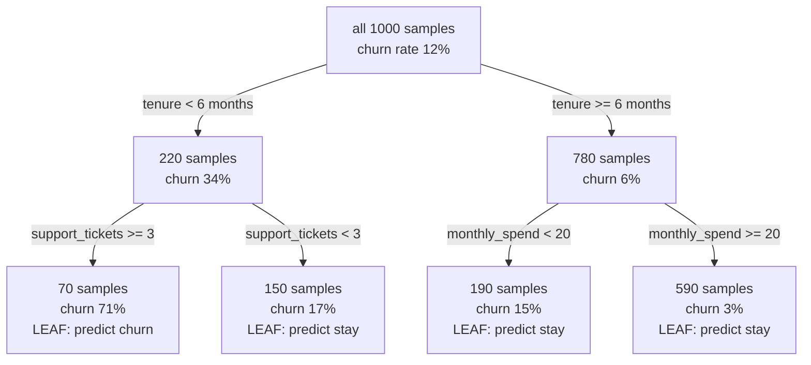
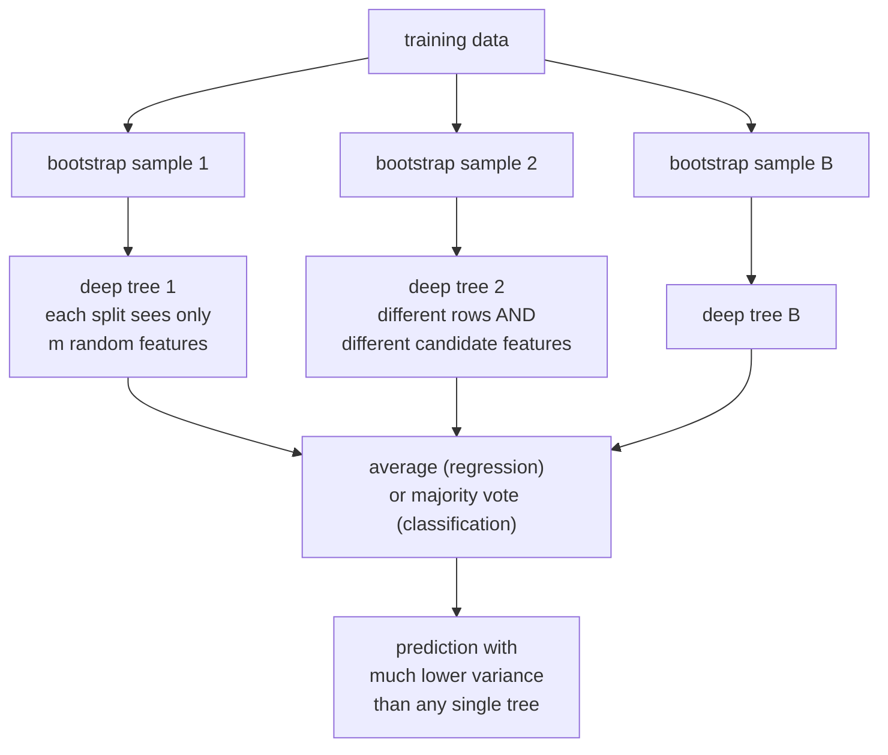

# Trees and Ensembles: The Tabular Workhorse

A decision tree is the most interpretable model there is and, on its own, one of
the worst performers — high variance, unstable, prone to memorising. Ensembles
fix that in two opposite ways, and understanding *which* problem each fixes is
the whole subject.

## The decision tree

A tree recursively partitions the feature space with axis-aligned splits, and
predicts a constant in each region.



### The greedy algorithm

At each node, choose the (feature, threshold) pair that most reduces impurity;
recurse; stop on a criterion.

Finding the *globally optimal* tree is NP-complete, so every practical algorithm
is greedy. A greedy split that looks poor now might enable an excellent split
later, and the algorithm will never find it — which is one reason ensembles of
imperfect trees beat any single tree.

### Splitting criteria

For classification, with $p_k$ the proportion of class $k$ in a node:

| Criterion | Formula | Range (binary) | Note |
|---|---|---|---|
| **Gini impurity** | $1-\sum_k p_k^2$ | $[0, 0.5]$ | probability two random draws differ in class |
| **Entropy** | $-\sum_k p_k\log_2 p_k$ | $[0, 1]$ | information content; splits maximise information gain |
| **Misclassification** | $1-\max_k p_k$ | $[0, 0.5]$ | not differentiable enough to guide splits well |

The chosen split maximises the weighted impurity decrease:

$$\Delta = I(\text{parent}) - \frac{n_L}{n}I(\text{left}) - \frac{n_R}{n}I(\text{right})$$

**Gini vs entropy is not worth agonising over.** They agree on the chosen split
the overwhelming majority of the time; Gini is slightly cheaper because it avoids
logarithms, which is why it is the default. Misclassification rate is a poor
criterion precisely because it is insensitive to changes in node purity that do
not change the majority class.

For regression, the criterion is variance reduction (equivalently, MSE), or MAE
for a more robust but slower split.

### Worked split

100 samples, 50 positive. Gini $= 1 - 0.5^2 - 0.5^2 = 0.5$.

Candidate split A: left 50 (40 pos), right 50 (10 pos).

- $I_L = 1 - 0.8^2 - 0.2^2 = 0.32$, $I_R = 1 - 0.2^2 - 0.8^2 = 0.32$
- Weighted $= 0.5(0.32) + 0.5(0.32) = 0.32$, so $\Delta = 0.18$

Candidate split B: left 10 (10 pos), right 90 (40 pos).

- $I_L = 0$, $I_R = 1 - (4/9)^2 - (5/9)^2 = 0.494$
- Weighted $= 0.1(0) + 0.9(0.494) = 0.444$, so $\Delta = 0.056$

Split A wins despite B producing a perfectly pure node — because that pure node
holds only 10% of the data. The weighting by node size is what stops trees from
chasing tiny pure corners.

### Stopping and pruning

| Control | Effect |
|---|---|
| `max_depth` | hard cap on tree depth |
| `min_samples_split` | do not split a node below this size |
| `min_samples_leaf` | every leaf must hold at least this many — the most effective single knob |
| `max_features` | consider a random subset of features per split |
| `min_impurity_decrease` | require a minimum gain |
| `ccp_alpha` | **cost-complexity pruning**: grow fully, then prune back |

Cost-complexity (weakest-link) pruning minimises
$R_\alpha(T) = R(T) + \alpha|T|$, trading training error against leaf count. It
is better than pre-pruning because it can look past a locally weak split, and
$\alpha$ is chosen by cross-validation.

### Strengths and weaknesses

| Strengths | Weaknesses |
|---|---|
| Interpretable — you can read the rules | **High variance**: a different sample gives a very different tree |
| No scaling or normalisation needed | Cannot extrapolate beyond the training range |
| Handles mixed types and missing values | Axis-aligned splits struggle with diagonal boundaries |
| Captures interactions automatically | Biased toward high-cardinality features |
| Fast inference — a few comparisons | Greedy, so globally suboptimal |
| Non-parametric | Unstable: one changed row can restructure the whole tree |

That instability is the key fact. It is a defect in a single tree and the
**resource** that makes bagging work.

## Bagging

**Bootstrap aggregating**: train $B$ models on $B$ bootstrap samples and average
their predictions.

The variance of an average of $B$ identically distributed variables with pairwise
correlation $\rho$ is:

$$\mathrm{Var}\left(\frac{1}{B}\sum_b f_b\right) = \rho\sigma^2 + \frac{1-\rho}{B}\sigma^2$$

Read this formula carefully, because it contains the entire theory of ensembles:

- As $B\to\infty$ the second term vanishes. **More trees never hurt** — bagging
  does not overfit with more estimators.
- The first term, $\rho\sigma^2$, does **not** vanish. The correlation between
  trees is a floor on the achievable variance.
- Therefore the way to improve a bagged ensemble is to **decorrelate** its
  members.

Bagging reduces variance and leaves bias roughly unchanged, which is why its base
learners should be low-bias and high-variance: **fully grown, unpruned trees**.

Each bootstrap sample omits about $(1-1/n)^n \to e^{-1} \approx 36.8\%$ of the
data. Those **out-of-bag** samples give a free validation estimate with no
separate holdout.

## Random forests

Bagging plus one crucial addition: at **every split**, consider only a random
subset of $m$ features.



**Why feature subsampling matters.** With all features available, one strong
predictor is chosen as the root split in nearly every tree, so the trees are
highly correlated and $\rho\sigma^2$ stays large. Forcing each split to choose
among a random $m$ gives other features a chance, decorrelating the trees and
lowering that floor.

Defaults: $m = \sqrt{d}$ for classification, $m = d/3$ for regression. Lowering
$m$ increases decorrelation (good) and increases individual-tree bias (bad); it
is the main knob.

| Hyperparameter | Effect |
|---|---|
| `n_estimators` | more is better, with diminishing returns; 300–1000 typical |
| `max_features` | the decorrelation knob |
| `min_samples_leaf` | raise on noisy data to reduce overfitting |
| `max_depth` | usually leave unlimited |
| `bootstrap` | `False` gives Extra Trees behaviour on rows |
| `class_weight` | `"balanced_subsample"` for imbalance |

**Extremely Randomised Trees (Extra Trees)** go further: thresholds are drawn at
random rather than optimised. More bias, less variance, and much faster training
since no threshold search is needed. Often competitive, and worth trying.

### Feature importance, and its bias

Two built-in measures:

- **Mean decrease in impurity (MDI)** — sum of impurity reductions attributable
  to each feature. Fast, and **biased toward high-cardinality and continuous
  features**, because they offer more candidate split points and therefore more
  chances to fit noise. Computed on training data, so it rewards overfitting.
- **Permutation importance** — shuffle a feature on held-out data and measure the
  performance drop. Model-agnostic and honest about generalisation, but it
  **understates importance under correlation**: shuffling one of two correlated
  features leaves the other to compensate, so both look unimportant.

Neither is causal. Use SHAP for per-example attribution and treat all of them as
descriptions of the model, not of the world.

## Boosting

Bagging attacks variance by averaging independent models. Boosting attacks
**bias** by fitting models sequentially, each correcting its predecessors'
errors.

| | Bagging / Random Forest | Boosting |
|---|---|---|
| Training | parallel, independent | sequential, dependent |
| Base learners | deep, low-bias, high-variance | shallow, high-bias, low-variance |
| Reduces | variance | bias (and variance, via shrinkage) |
| More estimators | plateaus, never overfits | **overfits** — needs early stopping |
| Sensitivity to noise | robust | sensitive; outliers get up-weighted |
| Tuning | forgiving | needs learning rate and depth tuned |
| Typical accuracy | good | usually better |

### AdaBoost

The original. Maintain a weight per training example; after each weak learner,
increase the weights of misclassified examples so the next learner focuses on
them.

$$\alpha_m = \frac12\ln\frac{1-\epsilon_m}{\epsilon_m}, \qquad w_i \leftarrow w_i e^{-\alpha_m y_i h_m(x_i)}$$

$$F(x) = \mathrm{sign}\left(\sum_m \alpha_m h_m(x)\right)$$

A learner with error just under 50% gets a small positive $\alpha$; a very
accurate one gets a large weight. AdaBoost was later shown to be **forward
stagewise additive modelling with an exponential loss**, which connected it to
the gradient-boosting framework.

Its weakness follows from that loss: $e^{-yF(x)}$ grows without bound on badly
misclassified points, so a mislabelled example receives ever-increasing weight.
AdaBoost is fragile with label noise.

### Gradient boosting

Generalise: fit each new learner to the **negative gradient** of any
differentiable loss with respect to the current predictions.

$$r_{im} = -\left[\frac{\partial \ell(y_i, F(x_i))}{\partial F(x_i)}\right]_{F=F_{m-1}}, \qquad F_m = F_{m-1} + \eta\,h_m$$

For squared error, $r_{im}$ is literally the residual. For log-loss, it is
$y_i - p_i$. **This is gradient descent in function space**, with $\eta$ as the
learning rate.

The regularisation levers:

| Lever | Mechanism |
|---|---|
| **Shrinkage** $\eta$ | each tree contributes only a fraction; more trees, better generalisation |
| **Number of trees** | chosen by early stopping on a validation set |
| **Tree depth** | 3–8 typical; depth $d$ allows $d$-way interactions |
| **Subsampling rows** | stochastic gradient boosting; decorrelates and speeds up |
| **Subsampling columns** | further decorrelation |
| **L1/L2 on leaf values** | XGBoost's $\alpha$, $\lambda$ |
| **Minimum child weight** | require enough evidence per leaf |

The learning-rate/tree-count trade is the central one: halving $\eta$ roughly
doubles the trees needed and slightly improves the final result.

The production implementations — XGBoost, LightGBM, CatBoost — each add their
own algorithmic contributions; they have [their own page](../libraries.md).

## Stacking and blending

Train several diverse base models, then train a **meta-learner** on their
out-of-fold predictions.

```python
from sklearn.ensemble import StackingClassifier

stack = StackingClassifier(
    estimators=[
        ("lgbm", LGBMClassifier()),
        ("logit", make_pipeline(StandardScaler(), LogisticRegression())),
        ("knn",  make_pipeline(StandardScaler(), KNeighborsClassifier(50))),
    ],
    final_estimator=LogisticRegression(),
    cv=5, passthrough=False, n_jobs=-1,
)
```

**Out-of-fold predictions are mandatory.** If the meta-learner sees in-fold
predictions, the base models have already seen those labels, and the meta-learner
learns to trust an overfitted signal. Scikit-learn's `cv=` handles this; a
hand-rolled stack usually does not.

The gain comes from **diversity**: base models that make *different* errors.
Stacking a random forest with gradient boosting adds little (both are trees on
the same features). Stacking a booster with a linear model and a $k$-NN adds
more. In practice a simple weighted average, or even rank-averaging, captures
most of the benefit with far less machinery.

| Method | Combiner |
|---|---|
| Voting (hard) | majority class |
| Voting (soft) | average predicted probabilities — usually better |
| Weighted average | weights tuned on a validation set |
| Rank averaging | average the ranks; robust to differing score scales |
| Stacking | a learned meta-model on out-of-fold predictions |
| Blending | a learned meta-model on a single holdout — simpler, more variance |

## Choosing among them

| Situation | Model |
|---|---|
| Need a human-readable rule set | single pruned tree, or a rule list |
| Tabular data, want strong results with little tuning | random forest, or CatBoost with defaults |
| Tabular data, want the best result | tuned LightGBM/XGBoost/CatBoost with early stopping |
| Noisy labels | random forest — boosting chases the noise |
| Very high-dimensional sparse data (text) | linear models usually win |
| Need calibrated probabilities | random forest with calibration, or logistic regression |
| Small dataset (< 1000 rows) | random forest or regularised linear; boosting overfits |
| Latency-critical inference | a shallow booster, or CatBoost's symmetric trees |
| Extrapolation beyond the training range | **not trees** — use a linear or parametric model |

That last row is a genuine limitation, not a nuance. Trees predict a constant in
each leaf, so a feature value beyond anything seen in training falls into the
outermost leaf and gets its constant. A model trained on house prices up to
£1M predicts £1M for a £5M house — silently.

## Common pitfalls

| Pitfall | Reality |
|---|---|
| "Random forests can't overfit" | they can with very noisy data and deep trees; more *trees* do not overfit, but the model can |
| "More boosting rounds is better" | boosting overfits; always early-stop on validation |
| Reading MDI importances as truth | biased toward high-cardinality features, computed on train |
| Correlated features and importance | importance splits across correlates; neither looks important |
| One-hot encoding high-cardinality categoricals | wastes tree depth; use native categorical support |
| Scaling features before a tree | harmless but pointless |
| Trusting a tree's extrapolation | it does not extrapolate at all |
| Stacking with in-fold predictions | leaks; use out-of-fold |
| Random forest probabilities as calibrated | averaging pulls them toward the middle; calibrate |
| Deep trees on 500 rows | memorisation; raise `min_samples_leaf` |

## Self-check

1. Write the variance formula for an average of $B$ correlated predictors and
   read off why random forests subsample features.
2. Why does bagging use deep trees and boosting use shallow ones?
3. Compute the Gini gain for a split of 100 samples (50 positive) into 60 (45
   positive) and 40 (5 positive).
4. Which ensemble overfits with more estimators, and what is the standard
   defence?
5. Why is MDI feature importance biased, and what are two better alternatives
   with their own limitations?
6. Your model must predict prices above anything in the training set. Why is a
   tree ensemble the wrong choice?
7. Explain why stacking requires out-of-fold predictions.

## Where to go next

- [Boosting Libraries](../libraries.md) — XGBoost, LightGBM,
  and CatBoost in implementation detail.
- [Bias–Variance & Generalization](./bias-variance-and-generalization.md) — the
  decomposition these ensembles are engineering against.
- [Linear Models](./linear-models.md) — the other half of the tabular toolkit.
