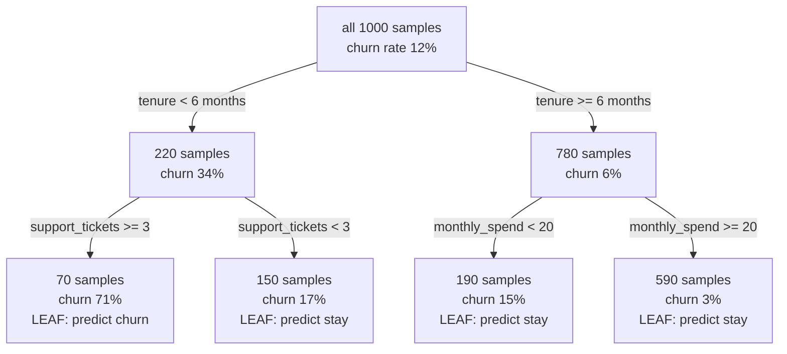
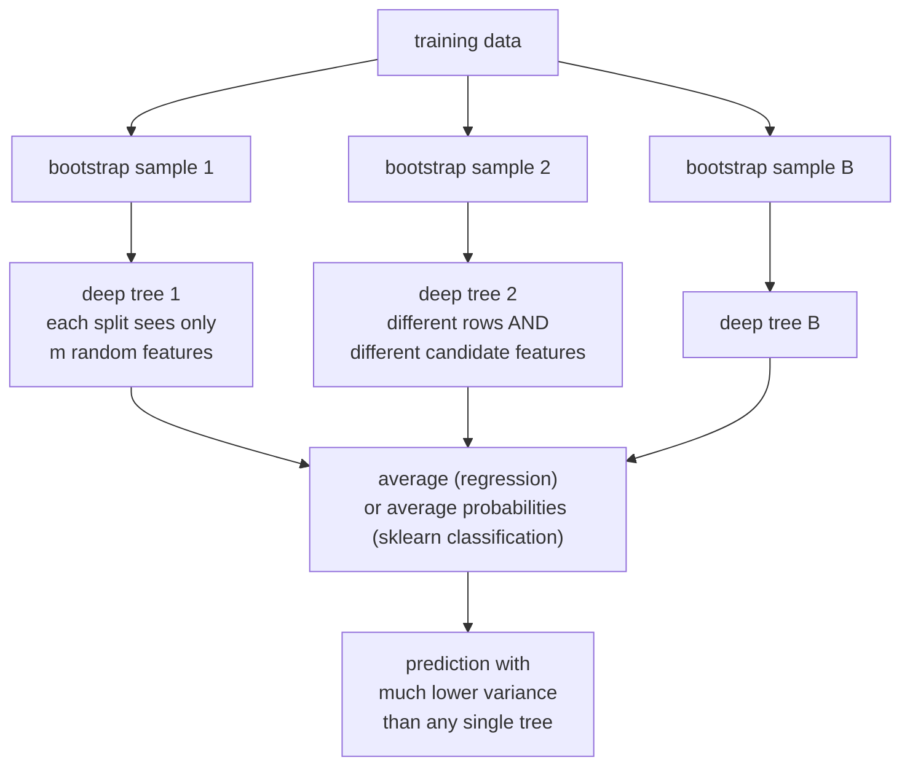

# Trees and Ensembles: The Tabular Workhorse

A decision tree is the most interpretable model there is and, on its own, often a high-variance predictor — high variance, unstable, prone to memorising. Ensembles
fix that in two opposite ways, and understanding *which* problem each fixes is
the whole subject.

## The decision tree

A tree recursively partitions the feature space with axis-aligned splits, and
predicts a constant in each region.



### The greedy algorithm

At each node, choose the (feature, threshold) pair that most reduces impurity;
recurse; stop on a criterion.

Optimal decision-tree construction is computationally hard under common formulations; standard CART uses greedy search, although specialized optimal-tree methods also exist. A greedy split that looks poor now might enable an excellent split
later, and the algorithm will never find it — which is one reason ensembles of
imperfect trees beat any single tree.

### Splitting criteria

For classification, with $p_k$ the proportion of class $k$ in a node:

| Criterion | Formula | Range (binary) | Note |
|---|---|---|---|
| **Gini impurity** | $1-\sum_k p_k^2$ | $[0, 0.5]$ | probability two random draws differ in class |
| **Entropy** | $-\sum_k p_k\log_2 p_k$ | $[0, 1]$ | information content; splits maximise information gain |
| **Misclassification** | $1-\max_k p_k$ | $[0, 0.5]$ | not differentiable enough to guide splits well |

The chosen split maximises the weighted impurity decrease:

$$\Delta = I(\text{parent}) - \frac{n_L}{n}I(\text{left}) - \frac{n_R}{n}I(\text{right})$$

**Gini vs entropy is not worth agonising over.** They agree on the chosen split
the overwhelming majority of the time; Gini is slightly cheaper because it avoids
logarithms, which is why it is the default. Misclassification rate is a poor
criterion precisely because it is insensitive to changes in node purity that do
not change the majority class.

For regression, the criterion is variance reduction (equivalently, MSE), or MAE
for a more robust but slower split.

### Worked split

100 samples, 50 positive. Gini $= 1 - 0.5^2 - 0.5^2 = 0.5$.

Candidate split A: left 50 (40 pos), right 50 (10 pos).

- $I_L = 1 - 0.8^2 - 0.2^2 = 0.32$, $I_R = 1 - 0.2^2 - 0.8^2 = 0.32$
- Weighted $= 0.5(0.32) + 0.5(0.32) = 0.32$, so $\Delta = 0.18$

Candidate split B: left 10 (10 pos), right 90 (40 pos).

- $I_L = 0$, $I_R = 1 - (4/9)^2 - (5/9)^2 = 0.494$
- Weighted $= 0.1(0) + 0.9(0.494) = 0.444$, so $\Delta = 0.056$

Split A wins despite B producing a perfectly pure node — because that pure node
holds only 10% of the data. The weighting by node size is what stops trees from
chasing tiny pure corners.

### Stopping and pruning

| Control | Effect |
|---|---|
| `max_depth` | hard cap on tree depth |
| `min_samples_split` | do not split a node below this size |
| `min_samples_leaf` | every leaf must hold at least this many — the most effective single knob |
| `max_features` | consider a random subset of features per split |
| `min_impurity_decrease` | require a minimum gain |
| `ccp_alpha` | **cost-complexity pruning**: grow fully, then prune back |

Cost-complexity (weakest-link) pruning minimises
$R_\alpha(T) = R(T) + \alpha|T|$, trading training error against leaf count.
It can look past a locally weak split, unlike early pre-pruning, but neither
strategy is universally better. Choose $\alpha$ using valid cross-validation.

### Strengths and weaknesses

| Strengths | Weaknesses |
|---|---|
| Interpretable — you can read the rules | **High variance**: a different sample gives a very different tree |
| No scaling or normalisation needed | Cannot extrapolate beyond the training range |
| Encoding and missing-value support depend on the implementation | Axis-aligned splits struggle with diagonal boundaries |
| Captures interactions automatically | Biased toward high-cardinality features |
| Fast inference — a few comparisons | Greedy, so globally suboptimal |
| Non-parametric | Unstable: one changed row can restructure the whole tree |

That instability is the key fact. It is a defect in a single tree and the
**resource** that makes bagging work.

## Bagging

**Bootstrap aggregating**: train $B$ models on $B$ bootstrap samples and average
their predictions.

The variance of an average of $B$ identically distributed variables with pairwise
correlation $\rho$ is:

$$\mathrm{Var}\left(\frac{1}{B}\sum_b f_b\right) = \rho\sigma^2 + \frac{1-\rho}{B}\sigma^2$$

Read this formula carefully, because it contains the entire theory of ensembles:

- As $B\to\infty$ the second term vanishes. More trees reduce Monte Carlo variability under these assumptions; finite-sample test metrics need not improve monotonically.
- The first term, $\rho\sigma^2$, does **not** vanish. The correlation between
  trees is a floor on the achievable variance.
- Therefore the way to improve a bagged ensemble is to **decorrelate** its
  members.

Bagging reduces variance and leaves bias roughly unchanged, which is why its base
learners should be low-bias and high-variance: **fully grown, unpruned trees**.

Each bootstrap sample omits about $(1-1/n)^n \to e^{-1} \approx 36.8\%$ of the
data. Those **out-of-bag** samples give a free validation estimate with no
separate holdout.

## Random forests

Bagging plus one crucial addition: at **every split**, consider only a random
subset of $m$ features.



**Why feature subsampling matters.** With all features available, one strong
predictor is chosen as the root split in nearly every tree, so the trees are
highly correlated and $\rho\sigma^2$ stays large. Forcing each split to choose
among a random $m$ gives other features a chance, decorrelating the trees and
lowering that floor.

In scikit-learn, classification defaults to `max_features="sqrt"`; regression defaults to `max_features=1.0` (all features), not the historical $d/3$ heuristic. Lowering
$m$ increases decorrelation (good) and increases individual-tree bias (bad); it
is the main knob.

| Hyperparameter | Effect |
|---|---|
| `n_estimators` | more is better, with diminishing returns; 300–1000 typical |
| `max_features` | the decorrelation knob |
| `min_samples_leaf` | raise on noisy data to reduce overfitting |
| `max_depth` | usually leave unlimited |
| `bootstrap` | `False` disables row bootstrapping; it does not randomize split thresholds |
| `class_weight` | `"balanced_subsample"` for imbalance |

**Extremely Randomised Trees (Extra Trees)** go further: thresholds are drawn at
random rather than optimised. More bias, less variance, and much faster training
since no threshold search is needed. Often competitive, and worth trying.

### Feature importance, and its bias

Two built-in measures:

- **Mean decrease in impurity (MDI)** — sum of impurity reductions attributable
  to each feature. Fast, and **biased toward high-cardinality and continuous
  features**, because they offer more candidate split points and therefore more
  chances to fit noise. Computed on training data, so it rewards overfitting.
- **Permutation importance** — shuffle a feature on held-out data and measure the
  performance drop. Model-agnostic and honest about generalisation, but it
  **understates importance under correlation**: shuffling one of two correlated
  features leaves the other to compensate, so both look unimportant.

Neither is causal. Use SHAP for per-example attribution and treat all of them as
descriptions of the model, not of the world.

## Boosting

Bagging attacks variance by averaging randomized models whose errors are usually correlated. Boosting attacks
**bias** by fitting models sequentially, each correcting its predecessors'
errors.

| | Bagging / Random Forest | Boosting |
|---|---|---|
| Training | parallel fits on dependent resamples | sequential, dependent |
| Base learners | deep, low-bias, high-variance | shallow, high-bias, low-variance |
| Reduces | variance | bias (and variance, via shrinkage) |
| More estimators | averaging stabilizes; finite test metrics can fluctuate | **overfits** — needs early stopping |
| Sensitivity to noise | robust | sensitive; outliers get up-weighted |
| Tuning | forgiving | needs learning rate and depth tuned |
| Typical accuracy | good | usually better |

### AdaBoost

The original. Maintain a weight per training example; after each weak learner,
increase the weights of misclassified examples so the next learner focuses on
them.

$$\alpha_m = \frac12\ln\frac{1-\epsilon_m}{\epsilon_m}, \qquad w_i \leftarrow w_i e^{-\alpha_m y_i h_m(x_i)}$$

$$F(x) = \mathrm{sign}\left(\sum_m \alpha_m h_m(x)\right)$$

A learner with error just under 50% gets a small positive $\alpha$; a very
accurate one gets a large weight. AdaBoost was later shown to be **forward
stagewise additive modelling with an exponential loss**, which connected it to
the gradient-boosting framework.

Its weakness follows from that loss: $e^{-yF(x)}$ grows without bound on badly
misclassified points, so a mislabelled example receives ever-increasing weight.
AdaBoost is fragile with label noise.

### Gradient boosting

Generalise: fit each new learner to the **negative gradient** of any
differentiable loss with respect to the current predictions.

$$r_{im} = -\left[\frac{\partial \ell(y_i, F(x_i))}{\partial F(x_i)}\right]_{F=F_{m-1}}, \qquad F_m = F_{m-1} + \eta\,h_m$$

For squared error, $r_{im}$ is literally the residual. For log-loss, it is
$y_i - p_i$. **This is gradient descent in function space**, with $\eta$ as the
learning rate.

The regularisation levers:

| Lever | Mechanism |
|---|---|
| **Shrinkage** $\eta$ | smaller updates generally need more rounds; validate the resulting generalization |
| **Number of trees** | chosen by early stopping on a validation set |
| **Tree depth** | 3–8 typical; depth $d$ allows $d$-way interactions |
| **Subsampling rows** | stochastic gradient boosting; decorrelates and speeds up |
| **Subsampling columns** | further decorrelation |
| **L1/L2 on leaf values** | XGBoost's $\alpha$, $\lambda$ |
| **Minimum child weight** | require enough evidence per leaf |

The learning-rate/tree-count trade is the central one: smaller $\eta$ generally requires more trees; neither inverse scaling nor better final generalization is guaranteed.

The production implementations — XGBoost, LightGBM, CatBoost — each add their
own algorithmic contributions; they have [their own page](../libraries.md).

## Stacking and blending

Train several diverse base models, then train a **meta-learner** on their
out-of-fold predictions.

```python
from sklearn.ensemble import StackingClassifier

stack = StackingClassifier(
    estimators=[
        ("lgbm", LGBMClassifier()),
        ("logit", make_pipeline(StandardScaler(), LogisticRegression())),
        ("knn",  make_pipeline(StandardScaler(), KNeighborsClassifier(50))),
    ],
    final_estimator=LogisticRegression(),
    cv=5, passthrough=False, n_jobs=-1,
)
```

**Out-of-fold predictions are mandatory.** If the meta-learner sees in-fold
predictions, the base models have already seen those labels, and the meta-learner
learns to trust an overfitted signal. Scikit-learn's `cv=` handles this; a
hand-rolled stack usually does not.

The gain comes from **diversity**: base models that make *different* errors.
A forest and booster can make meaningfully different errors despite both using trees. Compare out-of-fold error correlation and validation gains; architectural diversity alone does not guarantee a useful stack. In practice a simple weighted average, or even rank-averaging, captures
most of the benefit with far less machinery.

| Method | Combiner |
|---|---|
| Voting (hard) | majority class |
| Voting (soft) | average predicted probabilities — usually better |
| Weighted average | weights tuned on a validation set |
| Rank averaging | average the ranks; robust to differing score scales |
| Stacking | a learned meta-model on out-of-fold predictions |
| Blending | a learned meta-model on a single holdout — simpler, more variance |

## Choosing among them

| Situation | Model |
|---|---|
| Need a human-readable rule set | single pruned tree, or a rule list |
| Tabular data, want strong results with little tuning | random forest, or CatBoost with defaults |
| Tabular data, want the best result | tuned LightGBM/XGBoost/CatBoost with early stopping |
| Noisy labels | random forest — boosting chases the noise |
| Very high-dimensional sparse data (text) | linear models usually win |
| Need calibrated probabilities | random forest with calibration, or logistic regression |
| Small dataset (< 1000 rows) | random forest or regularised linear; boosting overfits |
| Latency-critical inference | a shallow booster, or CatBoost's symmetric trees |
| Extrapolation beyond the training range | **not trees** — use a linear or parametric model |

That last row is a genuine limitation, not a nuance. Trees predict a constant in
each leaf, so a feature value beyond anything seen in training falls into the
outermost leaf and gets its constant. A model trained only on lower-priced properties returns its selected outer leaf values, not necessarily the maximum observed price. Boosted sums remain piecewise constant in ordinary constant-leaf implementations.

## Common pitfalls

| Pitfall | Reality |
|---|---|
| "Random forests can't overfit" | they can with very noisy data and deep trees; more trees stabilize averaging, but generalization is not monotonic for every metric |
| "More boosting rounds is better" | choose rounds using valid validation or CV; extra rounds can overfit |
| Reading MDI importances as truth | biased toward high-cardinality features, computed on train |
| Correlated features and importance | importance splits across correlates; neither looks important |
| One-hot encoding high-cardinality categoricals | wastes tree depth; use native categorical support |
| Scaling features before a tree | generally unnecessary for axis-aligned threshold trees; numerical and preprocessing effects can still matter |
| Trusting a tree's extrapolation | it does not extrapolate at all |
| Stacking with in-fold predictions | leaks; use out-of-fold |
| Random forest probabilities as calibrated | averaging pulls them toward the middle; calibrate |
| Deep trees on 500 rows | memorisation; raise `min_samples_leaf` |

## Decision trees: fit, predict, and prune

A tree is a partition plus leaf predictions. Classification leaves estimate
class proportions; squared-error leaves estimate means; absolute-error leaves
estimate medians. Sample weights change both impurity and the evidence reaching
each leaf. A pure leaf containing one heavily weighted observation is not the
same evidence as many independent observations.

Distinguish a split's local impurity decrease from that decrease multiplied by
the fraction of the entire training set reaching its parent. Scikit-learn's
`min_impurity_decrease` uses the globally weighted convention. For the earlier
self-check split, 60 rows with 45 positives have Gini 0.375, and 40 rows with
5 positives have Gini 0.21875. Weighted impurity is 0.3125, so gain is 0.1875.

Greedy search also explains a classic limitation: balanced XOR has no immediate
gain from either feature alone, although a depth-two tree can represent it.
A positive gain threshold can block the first necessary split. Axis-aligned
trees approximate diagonal boundaries with stair steps, so rotating features
can change fit difficulty even when rescaling one feature does not.

Weakest-link pruning compares a subtree's improvement against the leaves it
adds. Its effective alpha is $[R(t)-R(T_t)]/(|T_t|-1)$. Post-pruning can retain
useful descendants that pre-pruning would never explore, but it costs more
initial construction. Neither strategy is universally superior.

```python runnable
import numpy as np
from sklearn.datasets import make_classification
from sklearn.metrics import balanced_accuracy_score, log_loss
from sklearn.model_selection import GridSearchCV, StratifiedKFold, train_test_split
from sklearn.tree import DecisionTreeClassifier, export_text

X, y = make_classification(n_samples=600, n_features=8, n_informative=5,
                           n_redundant=1, class_sep=1.2, random_state=21)
X_train, X_test, y_train, y_test = train_test_split(
    X, y, test_size=0.25, stratify=y, random_state=21)
search = GridSearchCV(DecisionTreeClassifier(random_state=21),
    {"max_depth": [3, 6, None], "min_samples_leaf": [5, 15],
     "ccp_alpha": [0.0, 0.005]}, scoring="neg_log_loss",
    cv=StratifiedKFold(3, shuffle=True, random_state=21), n_jobs=1)
search.fit(X_train, y_train)
tree = search.best_estimator_
pred = tree.predict(X_test)
prob = tree.predict_proba(X_test)
assert np.allclose(prob.sum(axis=1), 1)
assert tree.get_n_leaves() <= len(X_train)
assert balanced_accuracy_score(y_test, pred) > 0.6
print(search.best_params_)
print("Balanced accuracy:", balanced_accuracy_score(y_test, pred))
print("Log loss:", log_loss(y_test, prob))
print(export_text(tree, max_depth=2))
```

The alpha grid is fixed before cross-validation. A data-derived pruning path
can itself depend on labels; in a formal nested evaluation, derive it inside
the relevant training partition. Printed rules aid inspection, but hundreds of
leaves are not globally easy to interpret. Inspect leaf support, extreme
probabilities, rare categories, and important error cases. Ordinary threshold
trees need an encoding strategy for unordered categorical features.

## Random forest: OOB and feature diagnostics

The variance-of-average formula describes an expectation under equal-variance
and common-correlation assumptions. More estimators reduce Monte Carlo
variability; finite test metrics need not improve monotonically. Changing leaf
size or feature subsampling changes the ensemble being estimated, not just the
precision of its average.

An OOB prediction aggregates only trees that omitted the observation. That is
useful for independent rows, but cannot prevent leakage from global preprocessing,
related users in other bootstrap rows, or future information in features.
Repeatedly choosing hyperparameters against OOB also consumes validation signal.
Use a separate final holdout and an appropriate group/time split when needed.

Scikit-learn classification forests average probability vectors, then take an
argmax. This differs from majority vote over hard labels. The code checks the
actual aggregation against the member predictions.

```python runnable
import numpy as np
from sklearn.datasets import make_classification
from sklearn.ensemble import ExtraTreesClassifier, RandomForestClassifier
from sklearn.inspection import permutation_importance
from sklearn.metrics import balanced_accuracy_score, log_loss
from sklearn.model_selection import train_test_split

X, y = make_classification(n_samples=700, n_features=10, n_informative=5,
                           n_redundant=2, random_state=13)
X_train, X_test, y_train, y_test = train_test_split(
    X, y, test_size=0.25, stratify=y, random_state=13)
forest = RandomForestClassifier(n_estimators=100, min_samples_leaf=3,
    max_features="sqrt", oob_score=True, random_state=13, n_jobs=1)
forest.fit(X_train, y_train)
pred = forest.predict(X_test)
prob = forest.predict_proba(X_test)
manual = np.mean([t.predict_proba(X_test) for t in forest.estimators_], axis=0)
assert np.allclose(prob, manual)
assert np.isfinite(forest.oob_score_)
print("OOB accuracy:", forest.oob_score_)
print("Test balanced accuracy:", balanced_accuracy_score(y_test, pred))
print("Test log loss:", log_loss(y_test, prob))
importance = permutation_importance(forest, X_test, y_test,
    scoring="balanced_accuracy", n_repeats=3, random_state=13, n_jobs=1)
print("Permutation importance:", importance.importances_mean.round(3))
extra = ExtraTreesClassifier(n_estimators=80, min_samples_leaf=3,
    random_state=13, n_jobs=1).fit(X_train, y_train)
extra_pred = extra.predict(X_test)
assert extra_pred.shape == y_test.shape
print("Extra Trees accuracy:", balanced_accuracy_score(y_test, extra_pred))
```

Do not select features from these test importances and then call the same test
an independent confirmation. Correlation can allow one feature to substitute
for another, reducing apparent importance; permutation can also create
unrealistic feature combinations. Grouped permutation tests a correlated set
together. Conditional permutation requires a model of the feature distribution.
SHAP depends on its background and dependence convention; none of these measures
establishes causality.

For regression, variation across trees is not automatically a prediction
interval: future observation noise and model bias remain. Quantile forests
estimate a response distribution through weights on training outcomes. Oblique
trees split on feature combinations, while distillation approximates an ensemble
with a simpler student; both change the accuracy/interpretability tradeoff.

## AdaBoost: a complete weighted-learning example

For binary discrete AdaBoost, labels and weak predictions are in $\{-1,+1\}$.
With normalized weights $D_m$, error is
$\epsilon_m=\sum_iD_m(i)\mathbf1[y_i\ne h_m(x_i)]$.
If error is 0.25, $\alpha=\frac12\log3\approx0.5493$. Correct observations
are multiplied by about 0.577 and mistakes by 1.732 before normalization;
total normalized weight on mistakes becomes one half. The next learner must
confront those cases even when their original count is small.

Zero error is a stopping edge case, not an instruction to retain infinite
weights. Error at or above random performance violates the intended weak-learning
condition. Multiclass SAMME includes a $\log(K-1)$ term and uses a different
score normalization from the binary half-log derivation. SAMME and the older
real-valued SAMME.R variant should not be conflated.

```python runnable
import numpy as np
from sklearn.datasets import make_classification
from sklearn.ensemble import AdaBoostClassifier
from sklearn.metrics import balanced_accuracy_score, log_loss
from sklearn.model_selection import train_test_split
from sklearn.tree import DecisionTreeClassifier

X, y = make_classification(n_samples=500, n_features=6, n_informative=4,
                           n_redundant=0, class_sep=1.4, random_state=5)
X_train, X_test, y_train, y_test = train_test_split(
    X, y, stratify=y, random_state=5)
model = AdaBoostClassifier(
    estimator=DecisionTreeClassifier(max_depth=1, random_state=5),
    n_estimators=70, learning_rate=0.5, random_state=5)
# Older releases expose this selector; newer releases use SAMME directly.
if "algorithm" in model.get_params():
    model.set_params(algorithm="SAMME")
model.fit(X_train, y_train)
pred = model.predict(X_test)
prob = model.predict_proba(X_test)
assert len(model.estimators_) > 0
assert np.allclose(prob.sum(axis=1), 1)
print("Balanced accuracy:", balanced_accuracy_score(y_test, pred))
print("Log loss:", log_loss(y_test, prob))
print("First stage errors:", model.estimator_errors_[:5])
```

Stumps form an additive model in threshold features; deeper weak learners can
model richer interactions. Exponential loss can focus intensely on mislabeled
cases. Inspect whether heavily weighted examples are informative rare cases,
measurement errors, or impossible targets. Training accuracy alone does not
describe margins or probability calibration.

## Gradient boosting: two iterations and two implementations

Take ordered inputs $(0,1,2,3)$ and targets $(0,0,4,4)$. Squared-error boosting
starts at the target mean two, with residuals $(-2,-2,2,2)$. A stump at 1.5
fits those residuals. At learning rate 0.5, predictions become $(1,1,3,3)$,
reducing MSE from four to one. The next residuals are $(-1,-1,1,1)$; another
half step produces $(0.5,0.5,3.5,3.5)$ and MSE 0.25.

For binary log-loss, additions are to a raw logit score, not directly to a
probability. The initial score is the logit of the training positive fraction;
the negative gradient is $y-p$. Terminal-region line searches or Newton steps
can refine the update. Apply sigmoid after score accumulation.

```python runnable
import numpy as np
from sklearn.datasets import make_friedman1
from sklearn.dummy import DummyRegressor
from sklearn.ensemble import GradientBoostingRegressor, HistGradientBoostingRegressor
from sklearn.metrics import mean_squared_error
from sklearn.model_selection import train_test_split

X, y = make_friedman1(n_samples=600, n_features=7, noise=1.0, random_state=6)
X_train, X_test, y_train, y_test = train_test_split(X, y, random_state=6)
models = {
    "gradient": GradientBoostingRegressor(n_estimators=160, learning_rate=0.05,
        max_depth=2, validation_fraction=0.2, n_iter_no_change=10, random_state=6),
    "histogram": HistGradientBoostingRegressor(max_iter=160, learning_rate=0.08,
        max_leaf_nodes=15, early_stopping=True, random_state=6),
}
baseline = DummyRegressor().fit(X_train, y_train).predict(X_test)
for name, model in models.items():
    model.fit(X_train, y_train)
    pred = model.predict(X_test)
    assert np.isfinite(pred).all()
    assert mean_squared_error(y_test, pred) < mean_squared_error(y_test, baseline)
    print(name, "RMSE", np.sqrt(mean_squared_error(y_test, pred)))
```

Histogram boosting bins candidate values and aggregates sufficient statistics,
trading threshold resolution for computational efficiency. Internal random
validation is inappropriate for some temporal or grouped tasks. Early stopping
is a selection procedure; it must use a valid validation set and leave final
testing untouched. Monotonic and interaction constraints encode allowed response
shapes, not causal truths or automatic fairness guarantees.

## XGBoost: second-order trees and honest early stopping

For a proposed leaf $j$, let $G_j$ and $H_j$ sum first and second loss derivatives.
With L2 leaf penalty $\lambda$ and leaf-count penalty $\gamma$,

$$w_j^*=-\frac{G_j}{H_j+\lambda},\qquad
\mathrm{Gain}=\frac12\left[\frac{G_L^2}{H_L+\lambda}
+\frac{G_R^2}{H_R+\lambda}-\frac{G_P^2}{H_P+\lambda}\right]-\gamma.$$

This explains why `min_child_weight` is not generally a row count: it thresholds
a Hessian sum. Under logistic loss, confident examples contribute small
$p(1-p)$. Leaf penalties, maximum depth, row/column sampling, histogram bins,
learning rate, and stopping rounds control different mechanisms.

The independent example requires the optional `xgboost` package. It uses CPU
histogram training, synthetic data, and separate training, validation, and test
partitions. Current sklearn-interface early-stopping parameters belong in the
estimator constructor.

```python runnable boosters
import numpy as np
from sklearn.datasets import make_classification
from sklearn.metrics import log_loss, roc_auc_score
from sklearn.model_selection import train_test_split
from xgboost import XGBClassifier

X, y = make_classification(n_samples=750, n_features=10, n_informative=6,
                           n_redundant=2, random_state=23)
X_dev, X_test, y_dev, y_test = train_test_split(
    X, y, test_size=0.2, stratify=y, random_state=23)
X_train, X_valid, y_train, y_valid = train_test_split(
    X_dev, y_dev, test_size=0.25, stratify=y_dev, random_state=24)
model = XGBClassifier(n_estimators=150, max_depth=3, learning_rate=0.08,
    tree_method="hist", objective="binary:logistic", eval_metric="logloss",
    early_stopping_rounds=12, subsample=0.9, colsample_bytree=0.9,
    random_state=23, n_jobs=1)
model.fit(X_train, y_train, eval_set=[(X_valid, y_valid)], verbose=False)
pred = model.predict(X_test)
prob = model.predict_proba(X_test)[:, 1]
assert pred.shape == y_test.shape
assert np.isfinite(prob).all() and ((prob >= 0) & (prob <= 1)).all()
assert 0 <= model.best_iteration < 150
print("Best iteration:", model.best_iteration)
print("Test log loss:", log_loss(y_test, prob))
print("Test ROC AUC:", roc_auc_score(y_test, prob))
```

The sklearn prediction interface uses the best iteration after early stopping;
native Booster APIs and explicit iteration ranges have their own contracts.
Multiple metrics/evaluation sets require knowing which controls stopping.
Sparse zeros, missing values, and categorical codes have representation-specific
semantics. A zero in a dense numeric feature is not automatically missing.
Validate feature order and serialized-model predictions before deployment.

## CatBoost: categories, ordered statistics, and symmetric trees

A naive category mean calculated from all training labels leaks an observation's
own target, especially when its category is rare. Ordered target statistics
use preceding examples in a permutation plus a prior to avoid that direct
self-inclusion. Ordered boosting addresses a related prediction-shift issue.
These are distinct from the tree growth policy and should not be inferred solely
from the library name.

Internal ordering does not repair future information, duplicate customers across
splits, or test-derived external features. Rare categories still need shrinkage;
unseen categories need a defined fallback. Missing categorical values should be
represented consistently rather than silently switching between numeric and
string encodings.

Symmetric trees apply the same split at every node of a depth. The resulting
regular structure supports efficient inference but restricts partitions relative
to an arbitrary asymmetric tree. Other growth policies exist; the property is
configuration-specific. Depth can grow leaf count exponentially.

```python runnable boosters
import numpy as np
from catboost import CatBoostClassifier
from sklearn.metrics import balanced_accuracy_score, log_loss
from sklearn.model_selection import train_test_split

rng = np.random.default_rng(31)
numeric = rng.normal(size=(600, 2))
region = rng.choice(["north", "south", "east"], size=600)
score = numeric[:, 0] - 0.7 * numeric[:, 1] + 0.9 * (region == "north")
y = rng.binomial(1, 1 / (1 + np.exp(-score)))
X = np.empty((600, 3), dtype=object)
X[:, :2] = numeric
X[:, 2] = region
dev, test = train_test_split(np.arange(600), test_size=0.2,
                              stratify=y, random_state=31)
train, valid = train_test_split(dev, test_size=0.25,
                                stratify=y[dev], random_state=32)
model = CatBoostClassifier(iterations=140, depth=4, learning_rate=0.06,
    loss_function="Logloss", cat_features=[2], random_seed=31,
    thread_count=1, task_type="CPU", allow_writing_files=False, verbose=False)
model.fit(X[train], y[train], eval_set=(X[valid], y[valid]),
          early_stopping_rounds=12, use_best_model=True)
pred = np.asarray(model.predict(X[test])).reshape(-1)
prob = model.predict_proba(X[test])[:, 1]
assert pred.shape == y[test].shape
assert np.isfinite(prob).all() and 0 < model.tree_count_ <= 140
print("Trees retained:", model.tree_count_)
print("Test log loss:", log_loss(y[test], prob))
print("Balanced accuracy:", balanced_accuracy_score(y[test], pred))
```

Categorical columns contain actual strings and are explicitly identified.
`allow_writing_files=False` prevents training artifacts in this example.
LightGBM is another histogram booster, commonly with leaf-wise growth and its
own depth/leaf-count tradeoff. Its sampling and feature-bundling contributions
address computation, not a universal accuracy advantage. The
[boosting library chapter](../libraries/boosting-libraries.md) develops these
implementation differences; evaluate it with the same held-out protocol rather
than copying identically named parameter values across libraries.

## Stacking as an executable workflow

Each base estimator learns preprocessing on its fold's training observations.
The combiner receives out-of-fold predictions, then the bases are refitted on
all development data. A final test set stays outside both levels. Architectural
diversity is only a hypothesis: measure complementary errors and validation gain.

```python runnable
import numpy as np
from sklearn.datasets import make_classification
from sklearn.ensemble import RandomForestClassifier, StackingClassifier
from sklearn.linear_model import LogisticRegression
from sklearn.metrics import log_loss, roc_auc_score
from sklearn.model_selection import StratifiedKFold, train_test_split
from sklearn.neighbors import KNeighborsClassifier
from sklearn.pipeline import make_pipeline
from sklearn.preprocessing import StandardScaler

X, y = make_classification(n_samples=400, n_features=8,
                           n_informative=5, random_state=41)
X_train, X_test, y_train, y_test = train_test_split(
    X, y, stratify=y, random_state=41)
model = StackingClassifier(estimators=[
    ("forest", RandomForestClassifier(n_estimators=50, min_samples_leaf=3,
                                       random_state=41, n_jobs=1)),
    ("linear", make_pipeline(StandardScaler(), LogisticRegression(max_iter=500))),
    ("neighbors", make_pipeline(StandardScaler(), KNeighborsClassifier(11))),
], final_estimator=LogisticRegression(max_iter=500),
   cv=StratifiedKFold(3, shuffle=True, random_state=41), n_jobs=1)
model.fit(X_train, y_train)
pred = model.predict(X_test)
p = model.predict_proba(X_test)[:, 1]
assert pred.shape == y_test.shape and np.isfinite(p).all()
print("Test log loss:", log_loss(y_test, p))
print("Test ROC AUC:", roc_auc_score(y_test, p))
```

Blending uses one holdout for the combiner and sacrifices some base-training
data. Soft voting or a validation-weighted average may capture similar gains
with less machinery. Rank averaging supports ranking but does not produce
calibrated probabilities. Temporal stacks need forward out-of-fold predictions;
random folds do not become safe simply because an ensemble performs the split.

## Solved extensions

1. **Does `bootstrap=False` produce Extra Trees?** No. It changes row sampling,
   not the split-threshold randomization.
2. **Why can one more tree lower test accuracy?** A finite thresholded metric
   can fluctuate even while expected averaging variance declines.
3. **Can the early-stopping set be the final test?** No. Its labels selected the
   stopping point, so the result is a validation score.
4. **Why might two correlated features each look unimportant?** Each can
   substitute for the other; also inspect unrealistic permutation combinations.
5. **What does a category observed once reveal under naive target means?** Its
   own label. Cross-fitting or suitable ordered statistics avoid direct self-use.
6. **Do monotonic constraints establish causal direction?** No. They constrain
   predictions; identification of interventions remains a separate problem.

## References

- [Scikit-learn trees](https://scikit-learn.org/stable/modules/tree.html): criteria and pruning.
- [Scikit-learn ensembles](https://scikit-learn.org/stable/modules/ensemble.html): averaging, boosting, and stacking.
- [AdaBoostClassifier](https://scikit-learn.org/stable/modules/generated/sklearn.ensemble.AdaBoostClassifier.html): weak learners and version-specific parameters.
- [XGBoost sklearn interface](https://xgboost.readthedocs.io/en/stable/python/sklearn_estimator.html): validation and early stopping.
- [CatBoost classifier](https://catboost.ai/docs/en/concepts/python-reference_catboostclassifier): categorical features and fitted model properties.
- [CatBoost fit](https://catboost.ai/docs/en/concepts/python-reference_catboostclassifier_fit): evaluation sets and best-model selection.

## Self-check

1. Write the variance formula for an average of $B$ correlated predictors and
   read off why random forests subsample features.
2. Why does bagging use deep trees and boosting use shallow ones?
3. Compute the Gini gain for a split of 100 samples (50 positive) into 60 (45
   positive) and 40 (5 positive).
4. Which ensemble overfits with more estimators, and what is the standard
   defence?
5. Why is MDI feature importance biased, and what are two better alternatives
   with their own limitations?
6. Your model must predict prices above anything in the training set. Why is a
   tree ensemble the wrong choice?
7. Explain why stacking requires out-of-fold predictions.

## Where to go next

- [Boosting Libraries](../libraries.md) — XGBoost, LightGBM,
  and CatBoost in implementation detail.
- [Bias–Variance & Generalization](./bias-variance-and-generalization.md) — the
  decomposition these ensembles are engineering against.
- [Linear Models](./linear-models.md) — the other half of the tabular toolkit.
