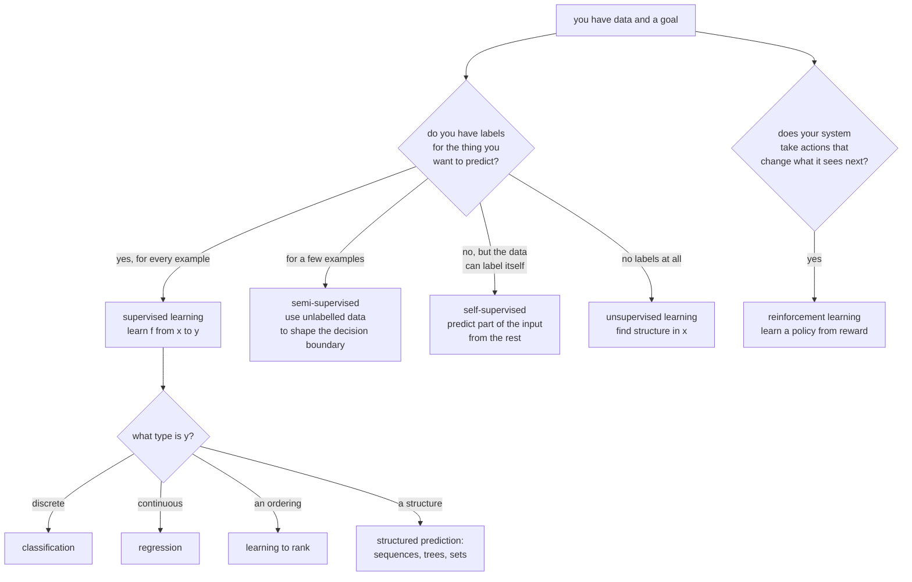

# Types of Machine Learning: Framing the Problem

The most consequential decision in a machine learning project is made before any
model is trained: **what kind of problem is this?** A classification score can be a useful ranking baseline, but its loss may not match a top-of-list objective. A predictive association does not by itself identify a treatment effect. This page is about
that framing.

## The taxonomy, organised by what supervision you have



## Supervised learning

You have pairs $(x_i, y_i)$ and want a function $f$ that predicts $y$ from $x$
on data you have not seen.

The formal object is **empirical risk minimisation**:

$$\hat f = \arg\min_{f \in \mathcal{F}} \frac{1}{N}\sum_{i=1}^{N}\ell(f(x_i), y_i) + \Omega(f)$$

Three central modeling choices are the hypothesis class $\mathcal{F}$
(linear functions, trees, networks), the loss $\ell$, and the regulariser
$\Omega$. Data collection, feature availability, sampling, optimization and decision costs are also part of the learning procedure.

The usual empirical-risk analysis starts with independent observations from the target distribution. Dependent or shifted settings need an appropriate protocol and additional assumptions. Capacity alone does not repair distribution shift, although adaptation, robust modeling or better features may help.

### Classification vs regression

| | Classification | Regression |
|---|---|---|
| Target | discrete class | continuous value |
| Typical loss | cross-entropy | squared or absolute error |
| Output | a distribution over classes | a value, ideally with an interval |
| Metrics | accuracy, F1, AUC, log-loss | RMSE, MAE, MAPE, $R^2$ |
| Underlying likelihood | Bernoulli / Categorical | Gaussian / Laplace |

The boundary is not as firm as it looks. **Ordinal targets** (star ratings,
severity grades) are neither — treating them as classification throws away the
ordering, and as regression asserts equal spacing between grades. Ordinal regression or a cumulative-link model explicitly uses ordering. Classification or regression can still be defensible baselines when their loss matches the actual decision.

**Counts** are also their own thing: Poisson or negative-binomial regression
respects non-negativity and the mean–variance relationship in a way MSE does
not.

### The variants people meet

| Variant | Setup | Note |
|---|---|---|
| Binary | two classes | the base case |
| Multiclass | $K$ mutually exclusive classes | softmax, or one-vs-rest |
| Multilabel | each example can have several labels | $K$ independent sigmoids, **not** softmax |
| Hierarchical | labels form a taxonomy | exploit the hierarchy in the loss |
| Extreme multilabel | millions of labels | needs specialised negative sampling |
| Learning to rank | order items within a query | pairwise or listwise losses; NDCG |
| Structured prediction | output is a sequence/tree/set | CRF, seq2seq, Hungarian matching |
| Multi-task | several targets, shared representation | shared trunk, task heads |
| Quantile regression | predict a quantile, not the mean | pinball loss; gives intervals |

**Multilabel with softmax is a real and common bug.** Softmax forces the outputs
to sum to one, so it cannot express "this document is about both sports and
politics". Use independent sigmoids with binary cross-entropy.

## Unsupervised learning

No labels. The goal is to find structure that is useful for something else.

| Family | Question it answers | Methods |
|---|---|---|
| **Clustering** | which points group together? | k-means, hierarchical, DBSCAN, HDBSCAN, GMM, spectral |
| **Dimensionality reduction** | what are the important directions? | PCA, kernel PCA, autoencoders, NMF |
| **Manifold learning** | what does the data look like in 2-D? | t-SNE, UMAP, Isomap |
| **Density estimation** | how likely is this point? | KDE, GMM, normalising flows |
| **Anomaly detection** | which points are unusual? | Isolation Forest, One-Class SVM, LOF, autoencoder reconstruction error |
| **Association rules** | what co-occurs? | Apriori, FP-Growth |
| **Topic modelling** | what themes exist in this text? | LDA, NMF, BERTopic |

**The evaluation problem is fundamental.** With no ground truth, "good" is
underdetermined. Internal metrics (silhouette score, Davies–Bouldin, inertia)
measure geometric properties that may have nothing to do with usefulness.
External metrics such as adjusted Rand index require reference labels, which may exist for a small held-out evaluation set even when training is unsupervised.

The honest approach: **evaluate unsupervised output by its downstream effect.**
Do the clusters make a segmentation strategy work? Does the reduced
representation improve a supervised model? Does the anomaly score correlate with
incidents your team actually investigated?

## Self-supervised learning

The data provides its own labels by hiding part of itself. It is a major foundation-model training strategy, often grouped under unsupervised learning. The distinction concerns how targets are constructed, not whether data collection, licensing, filtering and computation are free. Cross-modal pairs such as captions can also contain human-provided supervision.

| Pretext task | Modality | Produces |
|---|---|---|
| Next-token prediction | text, code, audio tokens | GPT-family LLMs |
| Masked token prediction | text | BERT-family encoders |
| Masked patch reconstruction | images | MAE, BEiT |
| Contrastive views of one item | images, audio | SimCLR, MoCo |
| Cross-modal alignment | image + caption | CLIP, SigLIP |
| Denoising | anything | diffusion models, denoising autoencoders |
| Permutation / jigsaw / rotation | images | early self-supervised vision |
| Contrastive predictive coding | sequences | CPC, wav2vec |

**Why it changed everything**: labels are the scarce resource. There are
trillions of tokens of text on the internet and no annotation budget large
enough to label them. Self-supervision converts the entire corpus into training
signal, and the representations learned transfer to tasks the pretext task never
mentioned.

The two dominant recipes:

- **Predictive / generative** — reconstruct the hidden part. Next-token
  prediction is the canonical case, and it scales extraordinarily well.
- **Contrastive** — pull together representations of two views of the same item,
  push apart different items. Needs careful negative sampling; under suitable positive/negative sampling assumptions, $I\ge\log M-L_{NCE}$ for $M$ total candidates. The loss itself is not a mutual-information lower bound. More negatives change both the bound and optimization; false negatives and correlated samples can alter the tradeoff.

## Semi-supervised learning

A few labelled examples, many unlabelled ones. Common in practice: labelling is
expensive, data is not.

| Method | Idea |
|---|---|
| **Self-training / pseudo-labelling** | train, predict on unlabelled data, add confident predictions as labels, repeat |
| **Consistency regularisation** | the prediction should not change under augmentation; penalise if it does |
| **FixMatch** | pseudo-label from a weak augmentation, train on a strong one |
| **Co-training** | two models on different feature views label data for each other |
| **Graph-based label propagation** | spread labels along a similarity graph |
| **Pretrain then fine-tune** | self-supervise on everything, fine-tune on the labels |

Semi-supervised learning works when the **cluster assumption** holds: the
decision boundary lies in a low-density region, so unlabelled data reveals where
*not* to put it. When that assumption fails, adding unlabelled data can actively
hurt.

**Pseudo-labelling has a confirmation-bias failure mode**: the model's confident
mistakes become training labels, and the error compounds. Mitigate with a high
confidence threshold, class-balanced selection, and held-out calibration/evaluation. Restarting a model is an option, not a guarantee against repeated mistakes.

Pretraining on unlabelled data and then adapting to labeled examples is one important route. It combines transfer and self-supervision; its relationship to a particular semi-supervised benchmark depends on which unlabeled data are allowed.

## Reinforcement learning

An agent takes actions in an environment, receives rewards, and learns a policy
that maximises cumulative reward. The distinguishing feature is not the absence
of labels — it is that **the agent's actions change the data it subsequently
sees**.

| Element | Meaning |
|---|---|
| State $s$ | a Markov description of the environment; observations may reveal only part of it |
| Action $a$ | what it can do |
| Reward $r$ | scalar feedback |
| Policy $\pi(a \mid s)$ | the thing being learned |
| Value $V^\pi(s)$ | expected return from $s$ under $\pi$ |
| Q-value $Q^\pi(s,a)$ | expected return from taking $a$ in $s$, then following $\pi$ |
| Discount $\gamma$ | how much future reward is worth now |

Three difficulties especially prominent with interactive feedback:

1. **Credit assignment.** A reward at step 200 may be caused by an action at
   step 3.
2. **Exploration vs exploitation.** You only learn about actions you take.
3. **Non-stationarity.** As the policy improves, the data distribution changes.

| When RL is the right frame | When it is not |
|---|---|
| Sequential decisions where actions affect future states | one-shot predictions |
| A reward signal exists or can be designed | no measurable objective |
| A simulator, or cheap/safe exploration | exploration is expensive or dangerous |
| Long-horizon objectives | the greedy choice is the right choice |

**RL is over-applied.** Many problems posed as RL are contextual bandits — one
decision, immediate feedback, no state transition — and bandits are dramatically
easier and more sample-efficient. Ask first whether your actions really change
the next state.

Language-model post-training includes reward-optimized RL methods, supervised fine-tuning and direct preference methods. **DPO is not simply an RL optimizer**: it fits a direct preference objective motivated by a KL-regularized policy formulation, avoiding the explicit RL optimization stage in the original method. A reward model or checker can score generated sequences, while tool-using agents additionally interact with external state. See the [DPO paper](https://arxiv.org/abs/2305.18290) and [deep RL](../deep-learning/deep-rl.md).

## Other framings worth knowing

| Paradigm | Setup |
|---|---|
| **Transfer learning** | pretrain on a large source task, adapt to a small target task |
| **Multi-task learning** | learn several related tasks jointly, sharing representation |
| **Meta-learning** | learn to learn; adapt to a new task from a handful of examples |
| **Few-shot / zero-shot** | few or no labeled target examples; methods include fine-tuning, metric learning and in-context prompting |
| **Active learning** | the model chooses which examples to have labelled |
| **Online / incremental learning** | update continuously as data arrives |
| **Federated learning** | train across devices without centralising the data |
| **Continual learning** | learn new tasks without forgetting old ones |
| **Curriculum learning** | order examples from easy to hard |
| **Causal inference** | estimate the effect of an intervention, not a correlation |

**Active learning** chooses examples for annotation using uncertainty, ensemble disagreement, expected model change or coverage. It can improve label efficiency, but outliers, miscalibrated uncertainty and annotation difficulty can defeat a naive strategy. Compare against random acquisition at an equal labeling budget.

**Causal inference deserves a specific warning.** When the question is how an intervention changes an outcome, prediction alone answers a different question. Predictive risk can still legitimately support triage, routing or resource planning without estimating treatment benefit. "Customers who receive discounts churn less"
does not mean discounts reduce churn; it may mean you send discounts to loyal
customers. Uplift modelling and causal ML exist for exactly this.

## Framing a real problem

Work through these in order. Getting them wrong costs more than any modelling
choice downstream.

1. **What decision does this inform, and who makes it?** If nobody changes
   behaviour based on the output, stop.
2. **What is the unit of prediction?** A user, a session, a transaction, a
   user-day? This determines the row granularity and the correct CV split.
3. **What exactly is the label, and when is it known?** A churn label needs a
   definition ("no purchase in 60 days") and a horizon. Anything known only after
   the prediction time is leakage.
4. **What is available at prediction time?** Draw the timeline. Every feature
   must be computable before the decision.
5. **What is the cost of each error type?** A false negative in fraud and a false
   positive in fraud have very different prices; that asymmetry belongs in the
   loss or the threshold, not in a post-hoc apology.
6. **Prediction or intervention?** If the output triggers an action on the same
   entity, you need causal thinking.
7. **What is the baseline?** The current rule-based system, the previous model,
   or a majority-class predictor. A model that does not beat the incumbent is not
   a result.

### A worked framing

*"Reduce customer churn."*

| Question | Answer |
|---|---|
| Decision | who receives a retention offer this week |
| Unit | one customer, evaluated weekly |
| Label | no activity in the 60 days following the prediction week |
| Horizon | features up to Sunday, label measured over the next 60 days |
| Available at prediction time | activity history, plan, support tickets — **not** the cancellation reason, which is recorded after the fact |
| Error costs | false positive = wasted discount (~£10); false negative = lost lifetime value (~£400) |
| Prediction or intervention | intervention value: conditional average churn reduction under an offer, not an identifiable individual counterfactual type |
| Baseline | current rule: "no login in 30 days" |
| Framing | a predictive baseline for prioritization plus a randomized offer/control pilot to estimate benefit and cost; select a treatment policy from causal evidence |

Note what the framing produced: a randomised holdout in v1 so that v2 has the
data it needs. That decision is invisible in any model comparison and it
determines whether the project has a future.

## Common framing errors

| Error | Consequence | Correct frame |
|---|---|---|
| Ranking evaluated only as classification | threshold accuracy can miss ordering errors; pointwise probabilities can still rank well | evaluate query-level ranking and compare learning-to-rank objectives |
| Multilabel with softmax | cannot express multiple labels | independent sigmoids |
| Ordinal target as multiclass | ignores the ordering | ordinal regression |
| Counts with unconstrained MSE | possible negative outputs; mean objective may still be appropriate | evaluate count likelihood or nonnegative mean models |
| Intervention framed as prediction | correlations that reverse on treatment | uplift / causal ML |
| Rare-event classification treated as generic anomaly detection | unusual is not necessarily harmful | compare supervised, one-class and reviewed-anomaly baselines |
| Forecasting with a random split | leaks the future | temporal split |
| Grouped data with a random split | leaks near-duplicates | `GroupKFold` |
| Time-varying label without a horizon | label means different things per row | fix the horizon explicitly |
| RL where a bandit suffices | vastly harder, needs more data | contextual bandit |

## From a business sentence to an estimand

### Draw the information and outcome windows

A supervised row is not just a bag of columns. Define its entity, decision time
$t$, available information $\mathcal I_t$, prediction horizon $h$, and the time
at which the target becomes observable. A churn model might predict
$P(Y_{t:t+60}=1\mid\mathcal I_t)$ weekly. The cancellation reason recorded after
churn is not in $\mathcal I_t$, even if a retrospective database join places it
on the same row.

An event timestamp and its availability timestamp can differ: a purchase occurs
Monday but arrives in a warehouse Wednesday. Tuesday's predictor must not use
it unless the production system actually had it then. Repeated rows from one
customer also share history and overlapping outcome windows. A random row split
can therefore leak both identity and future outcome information.

Delayed labels create another distinction. A customer observed for only twenty
days after a prediction has not yet supplied a complete sixty-day churn label.
Calling that customer negative treats incomplete follow-up as an observed
outcome. Options include waiting for mature labels, defining a shorter horizon
or using a survival model with explicit censoring assumptions. Do not quietly
mix these target definitions.

The same discipline applies outside churn. Equipment-failure prediction needs
the failure horizon and maintenance policy; document classification needs a
document rather than page-level split when pages share content; forecasting
needs a decision-time cutoff and future horizon rather than shuffled rows.
See [feature engineering](./feature-engineering.md) and
[evaluation](./model-evaluation.md) for point-in-time and split mechanics.

### Prediction, effect, and value are different targets

Let $Y(0)$ and $Y(1)$ denote an outcome without and with treatment. A conditional
average treatment effect is

$$\tau(x)=E[Y(1)-Y(0)\mid X=x].$$

For an undesirable event such as churn, a beneficial treatment has negative
$\tau$. A risk model estimates an outcome probability under a specified policy;
it does not automatically estimate this difference. Only one potential outcome
is observed for each person, so neither a high risk nor an estimated CATE tells
us with certainty which individual would change outcome.

Suppose group A has untreated churn $0.80$ and treated churn $0.78$, while group B
has untreated churn $0.30$ and treated churn $0.10$. If retaining a customer is
worth $100$ and an offer costs $5$, expected incremental values are
$100(0.80-0.78)-5=-3$ and $100(0.30-0.10)-5=15$. Highest untreated risk targets
group A; highest treatment value targets group B. Neither policy can be justified
by risk ranking alone.

Random assignment identifies group-average effects when treatment versions are
well-defined and interference is handled appropriately. With observational data,
one typically needs consistency, sufficient confounding adjustment and overlap:
both treatments must have positive probability in the covariate region of
interest. A flexible model cannot recover a comparison never supported by the
data without additional extrapolation assumptions. These are identification
conditions, separate from optimization or held-out predictive accuracy.

### A randomized-treatment experiment

The simulation below fits library decision-tree outcome models separately for
randomized treated and untreated groups. Its simple binary feature makes the
true treatment heterogeneity inspectable. The observed estimates are averages;
the code never learns both potential outcomes of one individual.

```python runnable
import numpy as np
from sklearn.tree import DecisionTreeRegressor

rng = np.random.default_rng(101)
n = 20000
X = rng.integers(0, 2, size=(n, 1))
treatment = rng.integers(0, 2, size=n)
untreated_probability = np.where(X[:, 0] == 0, 0.80, 0.30)
treated_probability = np.where(X[:, 0] == 0, 0.78, 0.10)
observed_probability = np.where(treatment == 1, treated_probability, untreated_probability)
outcome = rng.binomial(1, observed_probability)
control_model = DecisionTreeRegressor(max_depth=1, random_state=101).fit(
    X[treatment == 0], outcome[treatment == 0])
treated_model = DecisionTreeRegressor(max_depth=1, random_state=101).fit(
    X[treatment == 1], outcome[treatment == 1])
groups = np.array([[0], [1]])
risk = control_model.predict(groups)
benefit = risk - treated_model.predict(groups)
incremental_value = 100 * benefit - 5
np.testing.assert_allclose(risk, [0.80, 0.30], atol=0.025)
np.testing.assert_allclose(benefit, [0.02, 0.20], atol=0.035)
assert risk.argmax() == 0 and incremental_value.argmax() == 1
assert incremental_value[0] < 0 < incremental_value[1]
print("Untreated risk:", risk)
print("Estimated average churn reduction:", benefit)
print("Offer value:", incremental_value)
```

This is not a general causal-estimation benchmark. Randomization eliminates the
specific confounding problem by design, and the two leaves match the simulation.
For real data, evaluate uncertainty, overlap, treatment costs and a held-out
policy-value estimate. If treatment affects who remains observed, missing outcomes
need a separate analysis rather than ordinary train/test splitting.

## Experiment: pseudo-labeling and its assumptions

Self-training first fits the labeled subset, predicts high-confidence labels for
unlabeled examples, then refits with those pseudo-labels. Confidence is not truth:
a model may be confidently wrong outside its supported distribution. A threshold
therefore trades quantity against potential label noise, not uncertainty against
a guaranteed correctness certificate.

The complete experiment compares the same learner with labeled data only,
matched unlabeled data, and an unlabeled pool shifted far from the labeled domain.
The test set is never supplied to self-training. No particular ordering of test
accuracies is asserted; the purpose is to inspect acceptance and accuracy
together rather than assume more unlabeled data must help.

```python runnable
import inspect
import numpy as np
from sklearn.datasets import make_moons
from sklearn.linear_model import LogisticRegression
from sklearn.metrics import accuracy_score
from sklearn.model_selection import train_test_split
from sklearn.pipeline import make_pipeline
from sklearn.preprocessing import PolynomialFeatures, StandardScaler
from sklearn.semi_supervised import SelfTrainingClassifier

rng = np.random.default_rng(102)
X, y = make_moons(n_samples=700, noise=0.22, random_state=102)
pool_x, test_x, pool_y, test_y = train_test_split(
    X, y, test_size=300, stratify=y, random_state=103)
labeled_ids = np.concatenate([np.flatnonzero(pool_y == label)[:12] for label in (0, 1)])
unlabeled_ids = np.setdiff1d(np.arange(len(pool_x)), labeled_ids)
lx, ly = pool_x[labeled_ids], pool_y[labeled_ids]
ux = pool_x[unlabeled_ids]
def learner():
    return make_pipeline(PolynomialFeatures(3, include_bias=False), StandardScaler(),
                         LogisticRegression(C=1.0, max_iter=1000, random_state=102))
baseline = learner().fit(lx, ly)
print("Labeled-only accuracy:", accuracy_score(test_y, baseline.predict(test_x)))
parameter = "estimator" if "estimator" in inspect.signature(SelfTrainingClassifier).parameters else "base_estimator"
for name, unlabeled in (("matched", ux), ("shifted", ux + np.array([3.0, -2.0]))):
    features = np.vstack([lx, unlabeled])
    targets = np.concatenate([ly, np.full(len(unlabeled), -1, dtype=int)])
    model = SelfTrainingClassifier(**{parameter: learner()}, threshold=0.85, max_iter=10)
    model.fit(features, targets)
    accepted = np.sum(model.labeled_iter_[len(lx):] > 0)
    probability = model.predict_proba(test_x)
    assert probability.shape == (len(test_x), 2)
    np.testing.assert_allclose(probability.sum(axis=1), 1.0, atol=1e-12)
    assert 0 < accepted <= len(unlabeled)
    assert np.all(model.transduction_[:len(lx)] == ly)
    print(name, "pseudo-labels accepted:", accepted,
          "test accuracy:", accuracy_score(test_y, model.predict(test_x)))
```

Changing the unlabeled pool also changes preprocessing learned during refitting.
That is permitted in this inductive semi-supervised setup because these are
training-pool features, not test features; it is also one reason distribution
mismatch can matter. A more controlled algorithmic ablation could freeze the
preprocessor and vary only pseudo-label inclusion. Hidden labels from synthetic
data can diagnose pseudo-label errors after the procedure is fixed, but must
not be used to choose its confidence threshold as though they were unavailable.

## Feedback, labels, and evaluation boundaries

### Supervised learning, bandits, and MDPs

In supervised learning, an observation usually arrives with the target needed
to score its prediction. In a contextual bandit, an action is selected and only
its reward is observed; the rewards of actions not taken are missing. In an MDP,
actions additionally affect transitions relevant to future return. Offline RL
uses previously logged transitions, so the learner need not collect new data
while training, although the data-collection policy remains crucial.

A recommender showing one item can be treated as a contextual bandit for an
immediate-click objective. If recommendations alter future preferences or retention,
an MDP may be more appropriate. A demand forecast can remain supervised even
when an operator acts on it; estimating how a new price changes demand is the
causal question. Frame the estimand and feedback structure first, not by whether
the application contains the word decision.

Bandit evaluation needs support for candidate actions under the logging policy.
If an item was never shown in a context, logged outcomes alone cannot identify
its reward there. Recording action probabilities enables some off-policy
estimators under assumptions, but tiny probabilities create high variance.
The [deep-RL chapter](../deep-learning/deep-rl.md) develops returns and policy
objectives beyond this framing overview.

### Further distinctions that change the experiment

**Inductive** learning fits a rule for future unseen observations. **Transductive**
learning may use the particular unlabeled evaluation inputs during fitting while
their labels remain hidden. Neither protocol is inherently dishonest, but
reporting a transductive result as ordinary inductive generalization is misleading.

Weak supervision combines noisy label functions, rules or annotators. Correlated
rules do not provide independent evidence, and their errors can be systematic.
Positive-unlabeled learning treats unmarked examples as a mixture rather than
known negatives; it needs assumptions about which positives become labeled.
Selective labels arise when a historical decision controls whether an outcome
is observed, as when only approved applications reveal repayment behavior.

Active learning changes which examples receive labels and thus changes the
labeled distribution. Keep a representative evaluation set outside acquisition.
Federated learning changes data placement and communication; it does not by
itself guarantee privacy, identical client distributions or resistance to
malicious updates. Continual learning changes the time sequence of tasks, making
retained performance and forgetting part of evaluation rather than merely the
latest task's accuracy.

Reject-option prediction adds an abstention action. Its value depends on what
happens after abstention: human review, a fallback policy or a delayed decision
all have different costs. Report error versus coverage and include the rejected
population, rather than presenting accuracy on the easiest retained subset as
the quality of the complete system.

## Self-check

1. **Who should receive a discount?** If the goal is incremental retention value,
   compare expected treated and untreated outcomes and subtract offer costs.
   High risk can identify customers whose behavior an offer barely changes.
   Risk prediction remains useful for some triage tasks, but is not treatment effect.
2. **Self-supervised versus unsupervised?** Self-supervision constructs targets
   from inputs or related views; unsupervised learning is the broader family of
   structure-learning tasks without conventional target labels. Taxonomies overlap.
3. **Why not softmax for multilabel?** It constrains a single probability mass
   across exclusive outcomes. Multiple marginal labels can simultaneously have
   high probability and require a different output/likelihood contract.
4. **When can unlabeled data hurt?** If density clusters do not align with label
   boundaries, the unlabeled population shifts, or confident pseudo-labels are
   wrong, the additional training constraint can reinforce a bad boundary.
5. **When use a bandit?** One action with only its immediate reward observed is
   a bandit-style feedback problem when future state effects are irrelevant.
   If full targets are already observed, ordinary supervised learning may suffice.
6. **Which framing questions come first?** Unit of observation determines grouping;
   decision time determines available features; label horizon determines follow-up
   and censoring. Error costs and the intended action determine the utility metric.
7. **How treat a one-to-five rating?** An ordinal model uses ordering without
   assuming equal spacing. Multiclass ignores order in a standard loss; regression
   assumes numeric distances. Either can still be a justified decision-oriented baseline.
8. **Is DPO just RL?** It is a direct preference-learning objective derived under
   a policy/reward relationship, not the explicit online RL optimization loop of
   methods such as PPO. Their motivations overlap; their training procedures differ.
9. **Can a CATE reveal one person's two outcomes?** No. It estimates a conditional
   average difference under identification assumptions. Only one potential outcome
   is observed for each person in the ordinary setting.
10. **Why does a sixty-day target need mature labels?** Twenty days of follow-up
    cannot establish the full outcome. Wait, change the horizon or model censoring;
    do not silently label incomplete observations as negatives.

## Where to go next

- [Linear Models](./linear-models.md) — the simplest supervised hypothesis class,
  fully derived.
- [Unsupervised Learning](./unsupervised-learning.md) — clustering and structure
  discovery in depth.
- [Model Evaluation](./model-evaluation.md) — how to know whether the framing
  worked.

Related foundations: [probability](../math/probability.md),
[statistics and causal reasoning](../math/statistics.md), and
[self-supervised objectives](../deep-learning/self-supervised-learning.md).
Primary references: [scikit-learn semi-supervised guide](https://scikit-learn.org/stable/modules/semi_supervised.html),
[DPO](https://arxiv.org/abs/2305.18290), and
[Causal Inference: What If](https://www.hsph.harvard.edu/miguel-hernan/causal-inference-book/).
