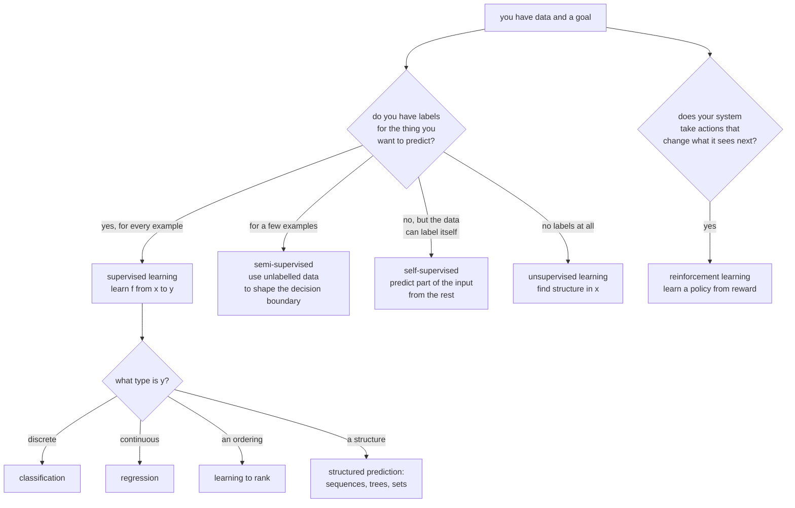

# Types of Machine Learning: Framing the Problem

The most consequential decision in a machine learning project is made before any
model is trained: **what kind of problem is this?** Frame a ranking problem as
classification and you optimise the wrong thing. Frame a causal question as
prediction and you ship a model that is accurate and useless. This page is about
that framing.

## The taxonomy, organised by what supervision you have

## Supervised learning

You have pairs $(x_i, y_i)$ and want a function $f$ that predicts $y$ from $x$
on data you have not seen.

The formal object is **empirical risk minimisation**:

$$\hat f = \arg\min_{f \in \mathcal{F}} \frac{1}{N}\sum_{i=1}^{N}\ell(f(x_i), y_i) + \Omega(f)$$

Three choices define any supervised method: the hypothesis class $\mathcal{F}$
(linear functions, trees, networks), the loss $\ell$, and the regulariser
$\Omega$. Everything else is optimisation detail.

**The assumption that makes it work** is that training and deployment data are
drawn from the same distribution, independently. When that fails — and it
usually does, eventually — you get distribution shift, and no amount of model
capacity helps.

### Classification vs regression

| | Classification | Regression |
|---|---|---|
| Target | discrete class | continuous value |
| Typical loss | cross-entropy | squared or absolute error |
| Output | a distribution over classes | a value, ideally with an interval |
| Metrics | accuracy, F1, AUC, log-loss | RMSE, MAE, MAPE, $R^2$ |
| Underlying likelihood | Bernoulli / Categorical | Gaussian / Laplace |

The boundary is not as firm as it looks. **Ordinal targets** (star ratings,
severity grades) are neither — treating them as classification throws away the
ordering, and as regression asserts equal spacing between grades. Ordinal
regression or a cumulative-link model is the correct framing.

**Counts** are also their own thing: Poisson or negative-binomial regression
respects non-negativity and the mean–variance relationship in a way MSE does
not.

### The variants people meet

| Variant | Setup | Note |
|---|---|---|
| Binary | two classes | the base case |
| Multiclass | $K$ mutually exclusive classes | softmax, or one-vs-rest |
| Multilabel | each example can have several labels | $K$ independent sigmoids, **not** softmax |
| Hierarchical | labels form a taxonomy | exploit the hierarchy in the loss |
| Extreme multilabel | millions of labels | needs specialised negative sampling |
| Learning to rank | order items within a query | pairwise or listwise losses; NDCG |
| Structured prediction | output is a sequence/tree/set | CRF, seq2seq, Hungarian matching |
| Multi-task | several targets, shared representation | shared trunk, task heads |
| Quantile regression | predict a quantile, not the mean | pinball loss; gives intervals |

**Multilabel with softmax is a real and common bug.** Softmax forces the outputs
to sum to one, so it cannot express "this document is about both sports and
politics". Use independent sigmoids with binary cross-entropy.

## Unsupervised learning

No labels. The goal is to find structure that is useful for something else.

| Family | Question it answers | Methods |
|---|---|---|
| **Clustering** | which points group together? | k-means, hierarchical, DBSCAN, HDBSCAN, GMM, spectral |
| **Dimensionality reduction** | what are the important directions? | PCA, kernel PCA, autoencoders, NMF |
| **Manifold learning** | what does the data look like in 2-D? | t-SNE, UMAP, Isomap |
| **Density estimation** | how likely is this point? | KDE, GMM, normalising flows |
| **Anomaly detection** | which points are unusual? | Isolation Forest, One-Class SVM, LOF, autoencoder reconstruction error |
| **Association rules** | what co-occurs? | Apriori, FP-Growth |
| **Topic modelling** | what themes exist in this text? | LDA, NMF, BERTopic |

**The evaluation problem is fundamental.** With no ground truth, "good" is
underdetermined. Internal metrics (silhouette score, Davies–Bouldin, inertia)
measure geometric properties that may have nothing to do with usefulness.
External metrics (adjusted Rand index, normalised mutual information) require
the labels you said you did not have.

The honest approach: **evaluate unsupervised output by its downstream effect.**
Do the clusters make a segmentation strategy work? Does the reduced
representation improve a supervised model? Does the anomaly score correlate with
incidents your team actually investigated?

## Self-supervised learning

The data provides its own labels by hiding part of itself. This is the paradigm
that produced every modern foundation model, and it deserves to be understood as
distinct from unsupervised learning: the objective is still supervised, the
labels are just free.

| Pretext task | Modality | Produces |
|---|---|---|
| Next-token prediction | text, code, audio tokens | GPT-family LLMs |
| Masked token prediction | text | BERT-family encoders |
| Masked patch reconstruction | images | MAE, BEiT |
| Contrastive views of one item | images, audio | SimCLR, MoCo |
| Cross-modal alignment | image + caption | CLIP, SigLIP |
| Denoising | anything | diffusion models, denoising autoencoders |
| Permutation / jigsaw / rotation | images | early self-supervised vision |
| Contrastive predictive coding | sequences | CPC, wav2vec |

**Why it changed everything**: labels are the scarce resource. There are
trillions of tokens of text on the internet and no annotation budget large
enough to label them. Self-supervision converts the entire corpus into training
signal, and the representations learned transfer to tasks the pretext task never
mentioned.

The two dominant recipes:

- **Predictive / generative** — reconstruct the hidden part. Next-token
  prediction is the canonical case, and it scales extraordinarily well.
- **Contrastive** — pull together representations of two views of the same item,
  push apart different items. Needs careful negative sampling; InfoNCE is a
  lower bound on mutual information between the views, and the bound is capped at
  $\log N$ for $N$ negatives, which is the real reason large batches help.

## Semi-supervised learning

A few labelled examples, many unlabelled ones. Common in practice: labelling is
expensive, data is not.

| Method | Idea |
|---|---|
| **Self-training / pseudo-labelling** | train, predict on unlabelled data, add confident predictions as labels, repeat |
| **Consistency regularisation** | the prediction should not change under augmentation; penalise if it does |
| **FixMatch** | pseudo-label from a weak augmentation, train on a strong one |
| **Co-training** | two models on different feature views label data for each other |
| **Graph-based label propagation** | spread labels along a similarity graph |
| **Pretrain then fine-tune** | self-supervise on everything, fine-tune on the labels |

Semi-supervised learning works when the **cluster assumption** holds: the
decision boundary lies in a low-density region, so unlabelled data reveals where
*not* to put it. When that assumption fails, adding unlabelled data can actively
hurt.

**Pseudo-labelling has a confirmation-bias failure mode**: the model's confident
mistakes become training labels, and the error compounds. Mitigate with a high
confidence threshold, class-balanced selection, and a fresh model each round.

In 2026 the pragmatic version is usually "pretrain or take a foundation model,
then fine-tune on the labels you have" — which is semi-supervised learning with
the unlabelled phase outsourced.

## Reinforcement learning

An agent takes actions in an environment, receives rewards, and learns a policy
that maximises cumulative reward. The distinguishing feature is not the absence
of labels — it is that **the agent's actions change the data it subsequently
sees**.

| Element | Meaning |
|---|---|
| State $s$ | what the agent observes |
| Action $a$ | what it can do |
| Reward $r$ | scalar feedback |
| Policy $\pi(a \mid s)$ | the thing being learned |
| Value $V^\pi(s)$ | expected return from $s$ under $\pi$ |
| Q-value $Q^\pi(s,a)$ | expected return from taking $a$ in $s$, then following $\pi$ |
| Discount $\gamma$ | how much future reward is worth now |

Three difficulties that supervised learning does not have:

1. **Credit assignment.** A reward at step 200 may be caused by an action at
   step 3.
2. **Exploration vs exploitation.** You only learn about actions you take.
3. **Non-stationarity.** As the policy improves, the data distribution changes.

| When RL is the right frame | When it is not |
|---|---|
| Sequential decisions where actions affect future states | one-shot predictions |
| A reward signal exists or can be designed | no measurable objective |
| A simulator, or cheap/safe exploration | exploration is expensive or dangerous |
| Long-horizon objectives | the greedy choice is the right choice |

**RL is over-applied.** Many problems posed as RL are contextual bandits — one
decision, immediate feedback, no state transition — and bandits are dramatically
easier and more sample-efficient. Ask first whether your actions really change
the next state.

The place RL genuinely dominates in 2026 is **post-training language models**:
RLHF, DPO, and verifiable-reward methods for reasoning. There, the "environment"
is a reward model or a checker, and the sequential structure is the token
sequence itself.

## Other framings worth knowing

| Paradigm | Setup |
|---|---|
| **Transfer learning** | pretrain on a large source task, adapt to a small target task |
| **Multi-task learning** | learn several related tasks jointly, sharing representation |
| **Meta-learning** | learn to learn; adapt to a new task from a handful of examples |
| **Few-shot / zero-shot** | in-context examples, or none, at inference time |
| **Active learning** | the model chooses which examples to have labelled |
| **Online / incremental learning** | update continuously as data arrives |
| **Federated learning** | train across devices without centralising the data |
| **Continual learning** | learn new tasks without forgetting old ones |
| **Curriculum learning** | order examples from easy to hard |
| **Causal inference** | estimate the effect of an intervention, not a correlation |

**Active learning is the most under-used of these in industry.** When labelling
costs dominate, choosing *which* 1,000 examples to label — by uncertainty, by
disagreement among an ensemble, by expected model change, or by coverage of the
input space — routinely beats labelling 5,000 at random.

**Causal inference deserves a specific warning.** If anyone will *act* on your
model — change a price, send a discount, intervene on a patient — a predictive
model answers the wrong question. "Customers who receive discounts churn less"
does not mean discounts reduce churn; it may mean you send discounts to loyal
customers. Uplift modelling and causal ML exist for exactly this.

## Framing a real problem

Work through these in order. Getting them wrong costs more than any modelling
choice downstream.

1. **What decision does this inform, and who makes it?** If nobody changes
   behaviour based on the output, stop.
2. **What is the unit of prediction?** A user, a session, a transaction, a
   user-day? This determines the row granularity and the correct CV split.
3. **What exactly is the label, and when is it known?** A churn label needs a
   definition ("no purchase in 60 days") and a horizon. Anything known only after
   the prediction time is leakage.
4. **What is available at prediction time?** Draw the timeline. Every feature
   must be computable before the decision.
5. **What is the cost of each error type?** A false negative in fraud and a false
   positive in fraud have very different prices; that asymmetry belongs in the
   loss or the threshold, not in a post-hoc apology.
6. **Prediction or intervention?** If the output triggers an action on the same
   entity, you need causal thinking.
7. **What is the baseline?** The current rule-based system, the previous model,
   or a majority-class predictor. A model that does not beat the incumbent is not
   a result.

### A worked framing

*"Reduce customer churn."*

| Question | Answer |
|---|---|
| Decision | who receives a retention offer this week |
| Unit | one customer, evaluated weekly |
| Label | no activity in the 60 days following the prediction week |
| Horizon | features up to Sunday, label measured over the next 60 days |
| Available at prediction time | activity history, plan, support tickets — **not** the cancellation reason, which is recorded after the fact |
| Error costs | false positive = wasted discount (~£10); false negative = lost lifetime value (~£400) |
| Prediction or intervention | **intervention** — the correct target is uplift (who churns *only if untreated*), not churn probability |
| Baseline | current rule: "no login in 30 days" |
| Framing | binary classification for v1, with a threshold set by the 40:1 cost ratio; uplift model for v2 using data from a randomised holdout |

Note what the framing produced: a randomised holdout in v1 so that v2 has the
data it needs. That decision is invisible in any model comparison and it
determines whether the project has a future.

## Common framing errors

| Error | Consequence | Correct frame |
|---|---|---|
| Ranking framed as classification | optimises accuracy, not ordering | learning to rank with NDCG |
| Multilabel with softmax | cannot express multiple labels | independent sigmoids |
| Ordinal target as multiclass | ignores the ordering | ordinal regression |
| Counts with MSE | negative predictions, wrong variance | Poisson regression |
| Intervention framed as prediction | correlations that reverse on treatment | uplift / causal ML |
| Anomaly detection as supervised | almost no positives, unstable | one-class or unsupervised methods |
| Forecasting with a random split | leaks the future | temporal split |
| Grouped data with a random split | leaks near-duplicates | `GroupKFold` |
| Time-varying label without a horizon | label means different things per row | fix the horizon explicitly |
| RL where a bandit suffices | vastly harder, needs more data | contextual bandit |

## Self-check

1. A model must decide who receives a discount. Why is churn probability the
   wrong target, and what is the right one?
2. Distinguish self-supervised from unsupervised learning in one sentence.
3. Why is softmax wrong for multilabel classification?
4. Give the cluster assumption and say when semi-supervised learning fails.
5. Your problem has one decision and immediate feedback. Why is RL likely the
   wrong tool?
6. Name three questions to answer before choosing a model, and say what each
   protects against.
7. You are asked to predict "customer satisfaction" on a 1–5 scale. Name the
   framing and say what both classification and regression get wrong.

## Where to go next

- [Linear Models](./linear-models.md) — the simplest supervised hypothesis class,
  fully derived.
- [Unsupervised Learning](./unsupervised-learning.md) — clustering and structure
  discovery in depth.
- [Model Evaluation](./model-evaluation.md) — how to know whether the framing
  worked.
