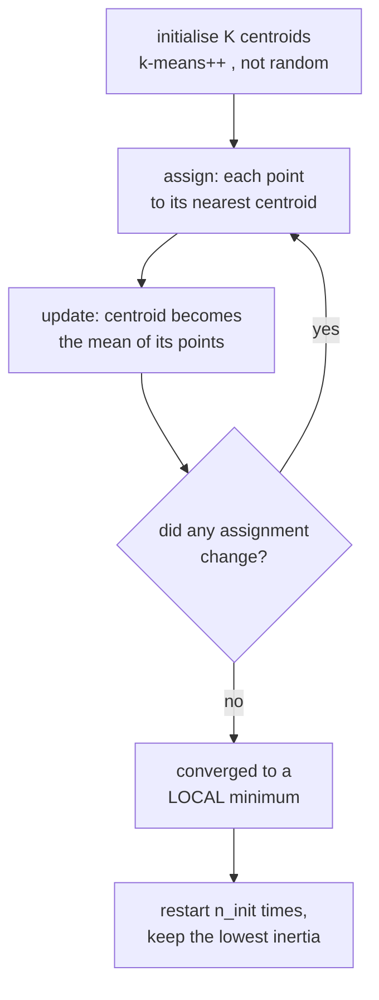

# Unsupervised Learning: Structure Without Labels

Unsupervised learning is where "what is a good answer?" becomes a genuinely hard
question. With labels, evaluation is arithmetic. Without them, you are asserting
that some structure exists and that your algorithm's notion of structure matches
the one you care about. Most unsupervised failures are failures of that
assumption, not of the optimiser.

## Clustering

### $k$-means

Minimise within-cluster sum of squares:

$$J = \sum_{k=1}^{K}\sum_{\mathbf{x}\in C_k}\|\mathbf{x}-\boldsymbol\mu_k\|^2$$

Lloyd's algorithm alternates two steps, each of which provably does not increase
$J$:

1. **Assign** each point to its nearest centroid.
2. **Update** each centroid to the mean of its assigned points.



Under the usual exact-arithmetic and tie-handling assumptions, assignment and
mean updates reach a stable partition because improving assignments cannot
continue indefinitely over a finite set. This is not a guarantee of the global
minimum. Empty clusters, ties, tolerances, and iteration caps need explicit
handling in an implementation. Hence `n_init` restarts.

**$k$-means++ initialisation** picks centroids sequentially with probability
proportional to squared distance from the nearest existing centroid. It spreads
the initial centroids out. The original randomized seeding has an expected
$O(\log K)$ objective approximation guarantee; distinguish that theorem from
specific greedy variants and a guarantee for every seed. Scikit-learn uses a
greedy k-means++ variant. Warm starts and application-specific seeds can also
be appropriate.

**The geometric bias, stated plainly.** $k$-means tends to work best with:

| Assumption | Fails on |
|---|---|
| Spherical (isotropic) | elongated or elliptical clusters |
| Similar size | one large and one small cluster — the boundary is pulled wrong |
| Similar density | dense and sparse clusters |
| Convex and linearly separable in the input space | concentric rings, moons, spirals |
| Every point belongs to a cluster | data with genuine noise or outliers |
| $K$ is known | almost always false |

Because the objective is squared Euclidean distance, **feature scaling defines the geometry and should be deliberate** and
outliers pull centroids hard. For non-spherical structure, use DBSCAN, spectral
clustering, or a GMM.

**Choosing $K$:**

| Method | Idea | Weakness |
|---|---|---|
| Elbow on inertia | look for the bend | often no clear bend; subjective |
| Silhouette score | $\frac{b-a}{\max(a,b)}$ per point, averaged | favours convex, spherical clusters |
| Gap statistic | compare inertia against a uniform null | expensive |
| Davies–Bouldin, Calinski–Harabasz | ratio of within to between scatter | same geometric bias |
| BIC/AIC with a GMM | principled model selection | requires the Gaussian assumption |
| **Downstream utility** | does $K=5$ make the business process work? | the only one that really answers the question |

Variants: **MiniBatchKMeans** for millions of points, **$k$-medoids/PAM**
(centres are actual data points, works with any metric, robust to outliers), and
**$k$-modes** for categorical data.

### DBSCAN and HDBSCAN

Density-based clustering: a cluster is a dense region separated from other dense
regions by sparse ones.

Two parameters: `eps` (neighbourhood radius) and `min_samples`. A point is a
**core point** if at least `min_samples` points lie within `eps`. Core points
that are within `eps` of each other join the same cluster; non-core points within
reach of a core point are **border points**; everything else is **noise**.

| Advantage | Limitation |
|---|---|
| Finds arbitrarily shaped clusters | struggles when clusters have very different densities |
| Does **not** require $K$ | `eps` is hard to choose and very sensitive |
| Explicitly labels outliers as noise | degrades in high dimensions (distance concentration) |
| Robust to outliers | border-point assignment depends on processing order |

Choose `eps` with a **$k$-distance plot**: sort every point's distance to its
$k$-th nearest neighbour and look for the knee.

**HDBSCAN** removes the `eps` parameter by building a hierarchy across all
density levels and extracting the most stable clusters. It handles varying
density, also depends on `min_samples`, metric, and extraction choices; compare it with DBSCAN on the actual density structure.

### Hierarchical clustering

Build a tree of nested clusters, then cut it at the level you want. Agglomerative
(bottom-up) is the common form.

| Linkage | Merge criterion | Produces |
|---|---|---|
| Single | min pairwise distance | chained, elongated clusters; equivalent to cutting a minimum spanning tree |
| Complete | max pairwise distance | compact, similar-diameter clusters |
| Average | mean pairwise distance | a compromise |
| **Ward** | minimum increase in within-cluster variance | spherical, balanced; the usual default |

Complexity depends on linkage, implementation, and connectivity constraints. Dense pairwise storage is often $O(n^2)$; some common optimized linkages have $O(n^2)$ time. There is no universal 10,000-point boundary. Its advantage is the **dendrogram**: you see the whole hierarchy, choose
the cut afterwards, and get a visual sense of how well-separated the structure
is.

### Gaussian mixture models and EM

Model the data as a mixture of Gaussians:

$$p(\mathbf{x}) = \sum_{k=1}^{K}\pi_k\,\mathcal{N}(\mathbf{x}\mid\boldsymbol\mu_k,\Sigma_k)$$

Fit by **expectation–maximisation**:

- **E-step**: compute the responsibility of each component for each point,
  $\gamma_{ik} = \frac{\pi_k\mathcal{N}(\mathbf{x}_i\mid\mu_k,\Sigma_k)}{\sum_j \pi_j\mathcal{N}(\mathbf{x}_i\mid\mu_j,\Sigma_j)}$.
- **M-step**: update $\pi_k, \mu_k, \Sigma_k$ as responsibility-weighted
  statistics.

Exact EM is nondecreasing in likelihood, but can approach stationary/saddle points or degenerate unbounded solutions; finite numerical and regularized implementations need their own checks.
It is the same alternating structure as $k$-means, and in fact **$k$-means is the
limit of a GMM** with spherical, equal, vanishing covariance and hard
assignments.

| GMM over $k$-means | Detail |
|---|---|
| Soft assignments | each point has a probability per cluster |
| Elliptical clusters | full covariance captures orientation and scale |
| A real density model | you can sample, and score new points |
| Principled $K$ selection | BIC/AIC over the likelihood |
| Costs | more parameters, can be singular, slower |

Guard against **covariance collapse**: a component can shrink onto a single point
and drive the likelihood to infinity. `reg_covar` adds a small ridge to the
diagonal and prevents it.

### Spectral clustering

Build a similarity graph, compute the graph Laplacian $L = D - A$, construct the relevant low-eigenvalue embedding, retaining connected-component zero eigenspaces when needed, and run $k$-means in that
embedding.

The eigenvector for the second-smallest eigenvalue — the **Fiedler vector** —
solves a relaxed partition problem, not necessarily the globally optimal discrete cut. Spectral clustering handles non-convex
shapes that defeat $k$-means (the classic two-moons example) because the graph
embedding makes them linearly separable. Dense full eigendecomposition is cubic, but sparse graphs and partial eigensolvers change the cost. Graph construction and storage can dominate.

### Which clustering algorithm

| Data | Algorithm |
|---|---|
| Spherical, similar size, $K$ known, large $n$ | $k$-means (MiniBatch if huge) |
| Arbitrary shapes, outliers present, $K$ unknown | **HDBSCAN** |
| Elliptical clusters, want probabilities/density | GMM |
| Want the full hierarchy, $n < 10^4$ | Ward agglomerative |
| Non-convex, graph-like, $n < 10^4$ | spectral |
| Categorical features | $k$-modes, or Gower distance + hierarchical |
| Mixed types | Gower distance + hierarchical or HDBSCAN |
| Text or embeddings | HDBSCAN on UMAP-reduced embeddings (the BERTopic recipe) |

## Dimensionality reduction

### PCA, derived

Find orthogonal directions of maximum variance. Centre the data, then:

$$\max_{\|\mathbf{w}\|=1}\; \mathbf{w}^\top\Sigma\mathbf{w} \quad\Longrightarrow\quad \Sigma\mathbf{w} = \lambda\mathbf{w}$$

The Lagrangian gives an eigenvalue problem directly: the principal components are
the eigenvectors of the covariance matrix, ordered by eigenvalue, and each
eigenvalue **is** the variance along its component.

Equivalently, PCA is the SVD $X = U\Sigma V^\top$ with the components as the
columns of $V$ — and computing it that way is numerically far better than forming
the covariance matrix, exactly as with the normal equations.

Two more equivalent characterisations, both worth knowing:

- PCA finds the **rank-$k$ linear subspace minimising reconstruction error**
  (Eckart–Young).
- PCA **decorrelates** the data: in the new basis the covariance is diagonal.

Practical rules:

- **Standardise first** unless all features share units, or the largest-variance
  feature simply wins by virtue of its scale.
- Choose $k$ by cumulative explained variance (85–95%), a scree-plot elbow, or
  downstream performance.
- PCA is **unsupervised** — the highest-variance direction is not necessarily the
  most predictive one. A low-variance direction can carry all the label
  information, and PCA will discard it.
- Components are linear combinations of every feature, so they are usually not
  interpretable.
- Fit on training data only, inside a Pipeline.

| Variant | For |
|---|---|
| Randomised / truncated SVD | large matrices, only the top $k$ needed |
| Incremental PCA | data that does not fit in memory |
| Sparse PCA | components with few non-zero loadings; interpretable |
| Kernel PCA | non-linear structure |
| **NMF** | non-negative data (counts, spectra, images); parts-based, interpretable |
| **ICA** | separate statistically independent sources (blind source separation) |
| **LDA (discriminant)** | supervised — maximises class separation, not variance |
| Factor analysis | models shared latent factors plus per-feature noise |
| Autoencoders | non-linear, learned |
| Random projection | fast, approximately pairwise-distance preserving for a finite set (Johnson–Lindenstrauss) |

### t-SNE and UMAP

Both are **visualisation** methods: they preserve local neighbourhood structure
in 2 or 3 dimensions.

**t-SNE** converts pairwise distances into probabilities in both the original and
the embedded space, and minimises the KL divergence between them. The Student-$t$
kernel in the low-dimensional space has heavier tails, which relieves the
"crowding problem" and lets clusters separate visibly.

**UMAP** builds a fuzzy topological representation and optimises a
cross-entropy. It is faster, scales better, preserves more global structure, and supports transforming new points; plain scikit-learn t-SNE has no transform method, although other extensions exist.

| Parameter | Effect |
|---|---|
| t-SNE `perplexity` (5–50) | effective number of neighbours; changes the picture substantially |
| UMAP `n_neighbors` | local (small) vs global (large) structure |
| UMAP `min_dist` | how tightly points may pack |
| both: `metric` | cosine for embeddings, Euclidean for scaled features |

**What these plots cannot tell you**, and it is a long list:

- Displayed cluster areas and densities need not preserve original-space areas or densities; their interpretation requires care.
- **Distances between** clusters are largely meaningless.
- Apparent clusters can appear in pure noise, especially at low perplexity.
- The result changes with the seed and every hyperparameter.
- Global geometry is not preserved (UMAP more than t-SNE, but neither reliably).

Use them to generate hypotheses and to spot duplicates or mislabelled points.
Do not use apparent separation alone as evidence of original-space clusters. PCA is uglier and more honest: its axes have
meaning and its explained-variance ratio is interpretable.

## Density estimation

| Method | Idea | Note |
|---|---|---|
| Histogram | bin and count | bin width and origin change everything; useless above ~3 dims |
| **KDE** | sum of kernels centred on each point | bandwidth is the critical parameter; Silverman's rule as a start |
| GMM | mixture of Gaussians | parametric, scales better |
| Normalising flows | invertible neural maps to a simple base density | exact likelihood, high dimensions |
| Autoregressive models | factor $p(x) = \prod p(x_i \mid x_{<i})$ | exact likelihood, slow sampling |
| Diffusion / score models | learn $\nabla\log p$ | excellent samples, likelihood is approximate |
| Energy-based models | unnormalised $e^{-E(x)}$ | flexible; the partition function is intractable |

Bandwidth in KDE plays exactly the role of $k$ in $k$-NN: too small and you get a
spiky memorisation of the sample; too large and everything is one smooth blob.

## Anomaly detection

| Method | Idea | Best for |
|---|---|---|
| **Isolation Forest** | random splits isolate anomalies in fewer splits | the strong general default; scales well |
| **Local Outlier Factor** | local density relative to neighbours' density | clusters of varying density |
| One-class SVM | smallest region containing most data | small data, clean training set |
| Elliptic envelope | robust Gaussian fit, Mahalanobis distance | roughly Gaussian data |
| $k$-NN distance | distance to the $k$-th neighbour | simple, effective on embeddings |
| Autoencoder reconstruction error | anomalies reconstruct poorly | images, sequences, high dimensions |
| Statistical thresholds | z-score, IQR fences, extreme value theory | univariate, interpretable |
| Forecast residuals | deviation from a predicted value | time series |

Isolation Forest's insight is neat and worth stating: anomalies are **few and
different**, so random axis-aligned splits isolate them near the root of the
tree. Scores normalize and transform path length; library APIs also differ in sign conventions, and no distance metric or
density estimate is required — which is why it survives high dimensions better
than distance-based methods.

**Evaluation is the hard part**, since you rarely have labelled anomalies. Use
whatever labelled incidents exist (even a handful), inject synthetic anomalies to
sanity-check sensitivity, set the threshold by the alert volume your team can
actually triage, and track precision on the alerts that were investigated.
In these APIs, `contamination` generally controls a threshold from fitted scores; it is not a learned anomaly rate or necessarily a Bayesian prior.

## Association rule mining

Find rules $\{A, B\} \Rightarrow \{C\}$ in transaction data.

| Measure | Formula | Reading |
|---|---|---|
| Support | $P(A\cap C)$ | how often the pattern occurs |
| Confidence | $P(C\mid A)$ | how often the rule holds |
| **Lift** | $\frac{P(C\mid A)}{P(C)}$ | how much more likely than chance; $>1$ is interesting |
| Conviction | $\frac{1-P(C)}{1-P(C\mid A)}$ | robustness to independence |

**Confidence alone is misleading.** If 80% of all transactions contain bread, a
rule with 80% confidence for bread tells you nothing. Lift corrects for the base
rate, and it is the measure to sort by. Apriori and FP-Growth are the standard
algorithms; FP-Growth is generally faster because it avoids repeated database
scans.

## Evaluating unsupervised results

| Metric type | Examples | Limitation |
|---|---|---|
| **Internal** | silhouette, Davies–Bouldin, Calinski–Harabasz, inertia | measure geometry; biased toward convex, spherical clusters |
| **External** | adjusted Rand index, normalised/adjusted mutual information, V-measure, purity | need ground-truth labels |
| **Stability** | agreement across bootstrap resamples or seeds | a good proxy when labels are absent |
| **Downstream** | does the clustering improve a supervised model or a business process? | the only one that answers the real question |

**Always use the adjusted variants** (adjusted Rand, adjusted MI) when comparing
against ground truth — the unadjusted versions are inflated by chance agreement
and increase with the number of clusters, so they will happily tell you that more
clusters are better.

Stability deserves more use than it gets: cluster several bootstrap resamples and
measure how consistently pairs of points end up together. Stability is useful evidence, not proof of meaningful structure: a consistently misspecified method can be stably wrong, while rare genuine structure can be unstable.

## Common pitfalls

| Pitfall | Consequence |
|---|---|
| Not scaling before $k$-means or PCA | the largest-range feature determines everything |
| Choosing $K$ by the elbow alone | there is usually no elbow; the choice is arbitrary |
| Reading t-SNE cluster sizes or distances | both are meaningless |
| Using PCA before a supervised model without checking | the discarded directions may hold the signal |
| Running DBSCAN in 100 dimensions | distance concentration makes density meaningless |
| Treating unadjusted Rand/MI as a score | inflated by chance |
| Fitting PCA on the full dataset before CV | leakage |
| Assuming clusters exist | uniform noise clusters happily into any $K$ you ask for |
| Applying `contamination=0.1` without a threshold justification | you asserted a 10% anomaly rate |

That "assuming clusters exist" line is the deepest one. Fixed-K methods return partitions even without meaningful clusters; density methods can label every observation noise. Run $k$-means with $K=5$ on uniform random data and
you get five tidy regions. Before interpreting, check whether the data has any
cluster tendency at all — the Hopkins statistic, a stability analysis, or simply
comparing your silhouette score against the same score on shuffled data.

## KMeans: a complete clustering experiment

### Assignment and update, numerically

For one-dimensional observations $(0,2,8,10)$, start two centers at zero and
eight. Assignment gives clusters $(0,2)$ and $(8,10)$, with objective eight.
Updating centers to one and nine reduces the objective to four. Reassignment
does not change memberships. Each mean minimizes squared error within its fixed
cluster, which proves the update step is nonincreasing. It does not prove the
global partition is optimal.

Ties need a deterministic convention. Empty clusters need a reinitialization
policy. Floating-point tolerances and iteration limits can stop before a strict
fixed point. Library-reported labels and final centers should therefore be
checked against the actual objective rather than assumed to follow an idealized
proof word for word.

KMeans does not posit a literal generative distribution. Its squared-Euclidean
objective favors compact Voronoi regions and can split large/elongated groups
while merging nearby small groups. The familiar spherical/equal-density list
describes its inductive bias, not formal preconditions for calling `fit`.
Outliers pull means strongly. A medoid minimizes within-cluster dissimilarity
using an observed representative and permits a wider range of distances, but
its optimization cost and robustness depend on the method and metric.

```python runnable
import numpy as np
from sklearn.cluster import KMeans, MiniBatchKMeans
from sklearn.datasets import make_blobs
from sklearn.metrics import adjusted_rand_score, silhouette_score
from sklearn.model_selection import train_test_split
from sklearn.pipeline import make_pipeline
from sklearn.preprocessing import StandardScaler

X, truth = make_blobs(n_samples=450, centers=3, cluster_std=0.75, random_state=11)
train, test = train_test_split(np.arange(len(X)), random_state=11)
model = make_pipeline(StandardScaler(), KMeans(n_clusters=3, n_init=10, random_state=11))
model.fit(X[train])
labels = model.predict(X[test])
scaled_test = model.named_steps["standardscaler"].transform(X[test])
centers = model.named_steps["kmeans"].cluster_centers_
distances = ((scaled_test[:, None, :] - centers[None, :, :]) ** 2).sum(axis=2)
assert np.array_equal(labels, distances.argmin(axis=1))
assert len(np.unique(labels)) == 3
print("Held-out silhouette:", silhouette_score(scaled_test, labels))
print("Synthetic external ARI:", adjusted_rand_score(truth[test], labels))
mini = make_pipeline(StandardScaler(), MiniBatchKMeans(
    n_clusters=3, n_init=5, batch_size=64, random_state=11))
mini.fit(X[train])
mini_labels = mini.predict(X[test])
assert mini_labels.shape == labels.shape
print("MiniBatch external ARI:", adjusted_rand_score(truth[test], mini_labels))
```

Here the held-out observations are assigned to existing centers, an **inductive**
use of clustering. Their synthetic labels evaluate recovery but never fit the
model. In a real unsupervised task such labels may not exist. Choosing K by ARI
would then be supervised model selection, not an internal clustering criterion.

An explicit integer `n_init` keeps restart behavior clear across library
versions. Compare inertia only for identical data and geometry; it decreases
as K increases and cannot independently select K. Report cluster sizes, center
interpretations, stability, and downstream usefulness. MiniBatchKMeans updates
centers from batches and is not guaranteed to match full Lloyd optimization.

## Hierarchical and agglomerative clustering in depth

Agglomerative clustering begins with singleton clusters and repeatedly merges
two current clusters. The merge sequence forms a hierarchy; choosing K or a
distance threshold cuts it. This is generally transductive: scikit-learn's
estimator does not provide a native `predict` rule for new rows. Nearest-centroid
assignment afterward is a new approximation, not the original hierarchical fit.

For Euclidean Ward linkage, merging A and B increases within-cluster SSE by

$$\Delta(A,B)=\frac{|A||B|}{|A|+|B|}\|\mu_A-\mu_B\|^2.$$

If A contains $(0,2)$ and B contains $(6)$, their means are one and six,
so the increase is $(2/3)25=50/3$. This is not simply centroid distance: cluster
sizes matter. Standard Ward requires Euclidean geometry. Passing an arbitrary
cosine or Gower distance matrix to Ward does not preserve this objective.

Single linkage chooses the minimum cross-cluster distance and can chain through
a few bridge observations. Complete linkage uses the maximum and emphasizes
diameter. Average linkage averages cross-pair distances, which is not generally
the distance between centroids. A dendrogram's leaf order is not a meaningful
one-dimensional embedding: branches may be rotated without changing merges.

```python runnable
import numpy as np
from scipy.cluster.hierarchy import dendrogram, linkage
from sklearn.cluster import AgglomerativeClustering
from sklearn.datasets import make_blobs
from sklearn.metrics import adjusted_rand_score, silhouette_score
from sklearn.preprocessing import StandardScaler

X, truth = make_blobs(n_samples=180, centers=3, cluster_std=0.7, random_state=22)
Z = StandardScaler().fit_transform(X)
ward = AgglomerativeClustering(n_clusters=3, linkage="ward",
                               metric="euclidean", compute_distances=True)
labels = ward.fit_predict(Z)
assert labels.shape == truth.shape
assert ward.children_.shape == (len(Z) - 1, 2)
assert np.all(ward.distances_ >= 0)
print("Ward silhouette:", silhouette_score(Z, labels))
print("Ward synthetic ARI:", adjusted_rand_score(truth, labels))
for method in ["single", "complete", "average"]:
    other = AgglomerativeClustering(n_clusters=3, linkage=method, metric="euclidean")
    result = other.fit_predict(Z)
    assert len(np.unique(result)) == 3
    print(method, "ARI", adjusted_rand_score(truth, result))
# Dendrogram coordinates are inspectable without opening a plotting window.
tree = linkage(Z, method="ward")
diagram = dendrogram(tree, no_plot=True)
assert len(diagram["leaves"]) == len(Z)
print("Last three merges [left, right, height, count]:\n", tree[-3:])
```

The example intentionally clusters the full set; no out-of-sample prediction
is claimed. Connectivity constraints can enforce neighborhood-local merges and
reduce computation, but also change the admissible hierarchy. Inspect graph
connectivity and the implementation's treatment of disconnected components.
Merge-height conventions differ between Ward's SSE increase and displayed
distance; use the library's definition rather than comparing heights directly
to raw SSE without a conversion.

For mixed data, a Gower-style dissimilarity combines feature-specific distances
and missingness conventions. Its weights express substantive choices about
similarity. Use a compatible linkage on a valid precomputed dissimilarity and
check scale/missingness sensitivity; ordinal integer codes do not create a
meaningful Euclidean geometry for arbitrary categories. K-modes instead uses
categorical mismatch and modal representatives.

## Density and graph clustering: compare the right structures

DBSCAN's `min_samples` includes the point itself in scikit-learn. Border points
can touch two density-connected components, making their assignment sensitive
to traversal order even when core components are stable. Report the fraction
marked noise instead of silently discarding it. A silhouette computed only on
retained points can improve merely because difficult observations were excluded.

HDBSCAN explores density scales through a hierarchy, but does not eliminate
all choices: `min_samples`, `min_cluster_size`, metric, cluster selection, and
selection epsilon can matter. Stable clusters under its objective need not
match useful business categories. Both DBSCAN and HDBSCAN may return all noise.

For a symmetric nonnegative similarity matrix W, the unnormalized Laplacian is
$L=D-W$. Its quadratic form is
$v^\top Lv=\frac12\sum_{ij}W_{ij}(v_i-v_j)^2\ge0$.
Connected-component indicator vectors have zero energy; the multiplicity of
eigenvalue zero equals the number of connected components. Discarding every
zero eigenvector can therefore discard the exact cluster structure.
Normalized variants include $I-D^{-1/2}WD^{-1/2}$ and $I-D^{-1}W$ and
correspond to different cut relaxations and normalization conventions.

```python runnable
import numpy as np
from sklearn.cluster import DBSCAN, HDBSCAN, KMeans, SpectralClustering
from sklearn.datasets import make_moons
from sklearn.metrics import adjusted_rand_score

X, truth = make_moons(n_samples=300, noise=0.045, random_state=33)
models = {
    "KMeans": KMeans(n_clusters=2, n_init=10, random_state=33),
    "DBSCAN": DBSCAN(eps=0.2, min_samples=5),
    "HDBSCAN": HDBSCAN(min_cluster_size=15, min_samples=5),
    "spectral": SpectralClustering(n_clusters=2, affinity="nearest_neighbors",
        n_neighbors=12, assign_labels="kmeans", random_state=33),
}
for name, model in models.items():
    labels = model.fit_predict(X)
    assert labels.shape == truth.shape
    print(name, "ARI", adjusted_rand_score(truth, labels),
          "noise fraction", np.mean(labels == -1))
W = np.array([[0., 1., 0., 0.], [1., 0., 0., 0.],
              [0., 0., 0., 1.], [0., 0., 1., 0.]])
L = np.diag(W.sum(axis=1)) - W
eigenvalues = np.linalg.eigvalsh(L)
assert np.count_nonzero(np.isclose(eigenvalues, 0)) == 2
print("Two-component Laplacian eigenvalues:", eigenvalues)
```

This is a recovery benchmark on synthetic moons, not a universal method ranking.
Nearest-neighbor graph construction, affinity bandwidth, and normalization
determine what spectral clustering sees. A disconnected graph warning is
information about that structure, not necessarily a failure to suppress.
Dense graph storage can dominate cost before eigensolving; sparse partial
solvers alter the cubic full-decomposition story.

## GMM and EM: likelihood, responsibilities, and degeneracy

Introduce a latent component $z_i$. For any responsibility distribution $q_i$,
Jensen's inequality gives

$$\log p(x_i)\ge\sum_k q_{ik}\log\frac{\pi_k\mathcal N(x_i;\mu_k,\Sigma_k)}{q_{ik}}.$$

The E-step sets q to the current posterior, making this bound tight. The exact
M-step maximizes it. Define $N_k=\sum_i\gamma_{ik}$; then

$$\pi_k=N_k/n,\quad \mu_k=\frac{\sum_i\gamma_{ik}x_i}{N_k},\quad
\Sigma_k=\frac{\sum_i\gamma_{ik}(x_i-\mu_k)(x_i-\mu_k)^\top}{N_k}.$$

For two points zero and two and responsibilities (0.8,0.2) for component one,
$N_1=1$, $\mu_1=0.4$, and variance is
$0.8(0-0.4)^2+0.2(2-0.4)^2=0.64$. The other component is symmetric with mean
1.6 and variance 0.64. This is a complete M-step for those responsibilities;
the next E-step must recompute them rather than retain the supplied values.

Evaluate Gaussian log densities and normalize with log-sum-exp to avoid
underflow. Covariance floors stabilize the fit but change the unconstrained
optimization. Likelihood monotonicity does not guarantee a useful global
solution: components can collapse or converge to poor stationary behavior.
Restarts, covariance choices, and held-out likelihood matter.

```python runnable
import numpy as np
from sklearn.datasets import make_blobs
from sklearn.metrics import adjusted_rand_score
from sklearn.mixture import GaussianMixture
from sklearn.model_selection import train_test_split

X, truth = make_blobs(n_samples=400, centers=3, cluster_std=0.8, random_state=44)
X = X @ np.array([[1.8, 0.7], [0.0, 0.5]])
train, test = train_test_split(np.arange(len(X)), random_state=44)
candidates = []
for k in [2, 3, 4]:
    model = GaussianMixture(n_components=k, covariance_type="full",
        reg_covar=1e-5, n_init=3, max_iter=150, random_state=44).fit(X[train])
    assert model.converged_
    candidates.append((model.bic(X[train]), model))
model = min(candidates, key=lambda item: item[0])[1]
labels = model.predict(X[test])
responsibility = model.predict_proba(X[test])
assert np.allclose(responsibility.sum(axis=1), 1)
assert np.isfinite(model.score_samples(X[test])).all()
print("Selected components:", model.n_components)
print("Held-out mean log density:", model.score(X[test]))
print("Synthetic ARI:", adjusted_rand_score(truth[test], labels))
samples, component = model.sample(5)
assert samples.shape == (5, 2) and component.shape == (5,)
```

BIC penalizes fitted parameter count and is useful under its model/large-sample
approximations; mixture models have nonregular edge cases. Component IDs are
arbitrary, so comparing raw integer labels across fits is invalid. A mixture
component need not equal a semantic class: several components may approximate
one non-Gaussian population.

## PCA, reconstruction, and other latent representations

For centered $X=USV^\top$, sample covariance eigenvalues are
$\lambda_j=s_j^2/(n-1)$, components are columns of V, and scores are $U S$.
Keeping the first k components reconstructs $\hat X=X V_kV_k^\top$ and
minimizes squared reconstruction error among rank-k linear projections.
Total omitted squared error is $\sum_{j>k}s_j^2$.

Whitening divides scores by component standard deviation. It removes relative
variance scale and can amplify noise in small-eigenvalue directions; whitening
is not inherently an improvement. PCA decorrelates, not generally makes
coordinates statistically independent. Component sign is arbitrary, and repeated
eigenvalues make the individual basis vectors nonunique even when the subspace
is identifiable.

```python runnable
import numpy as np
from sklearn.decomposition import PCA
from sklearn.metrics import mean_squared_error
from sklearn.model_selection import train_test_split
from sklearn.preprocessing import StandardScaler

rng = np.random.default_rng(55)
latent = rng.normal(size=(240, 2))
X = latent @ rng.normal(size=(2, 6)) + 0.05 * rng.normal(size=(240, 6))
X_train, X_test = train_test_split(X, random_state=55)
scaler = StandardScaler().fit(X_train)
Z_train, Z_test = scaler.transform(X_train), scaler.transform(X_test)
model = PCA(n_components=2, svd_solver="full").fit(Z_train)
scores = model.transform(Z_test)
reconstruction = model.inverse_transform(scores)
singular = np.linalg.svd(Z_train - Z_train.mean(axis=0), compute_uv=False)
assert np.allclose(model.explained_variance_, singular[:2] ** 2 / (len(Z_train) - 1))
assert scores.shape == (len(X_test), 2)
assert mean_squared_error(Z_test, reconstruction) < mean_squared_error(Z_test, np.zeros_like(Z_test))
print("Variance fractions:", model.explained_variance_ratio_)
print("Held-out reconstruction MSE:", mean_squared_error(Z_test, reconstruction))
```

A low-variance direction can contain all useful label information. Evaluate a
PCA-supervised pipeline end to end rather than selecting variance retention as
if it were predictive accuracy. Truncated SVD is useful for sparse matrices
without centering; that is not identical to centered PCA. Incremental PCA trades
batchwise approximation for memory. Sparse PCA changes the objective to favor
sparse loadings and need not produce orthogonal components. Kernel PCA depends
on the chosen kernel and may need an additional approximate inverse mapping.

NMF factors nonnegative X into nonnegative W and H, often minimizing
$\|X-WH\|_F^2$ or a divergence. Its factors have scale/permutation ambiguities
and may reach different local solutions. ICA seeks independent non-Gaussian
sources; whitening is preprocessing, not the independence objective. Factor
analysis models $x=\mu+Wz+\varepsilon$ with diagonal observation-noise
covariance, separating shared factors from feature-specific noise.

```python runnable
import numpy as np
from sklearn.decomposition import FactorAnalysis, FastICA, NMF
from sklearn.metrics import mean_squared_error
from sklearn.model_selection import train_test_split

rng = np.random.default_rng(66)
positive = rng.uniform(0, 2, (180, 3)) @ rng.uniform(0, 2, (3, 8))
train, test = train_test_split(positive, random_state=66)
nmf = NMF(n_components=3, init="nndsvda", max_iter=1200, tol=1e-3, random_state=66)
nmf.fit(train)
codes = nmf.transform(test)
reconstruction = nmf.inverse_transform(codes)
assert np.all(codes >= 0)
print("NMF reconstruction MSE:", mean_squared_error(test, reconstruction))
sources = np.column_stack([rng.laplace(size=300), rng.uniform(-2, 2, 300)])
mixed = sources @ np.array([[1.0, 0.5], [0.2, 1.0]])
ica = FastICA(n_components=2, whiten="unit-variance", random_state=66, max_iter=600)
recovered = ica.fit_transform(mixed)
assert np.allclose(ica.inverse_transform(recovered), mixed, atol=1e-6)
correlations = np.abs(np.corrcoef(recovered.T, sources.T)[:2, 2:])
print("ICA source correlations, allowing sign/order changes:\n", correlations)
fa = FactorAnalysis(n_components=2, random_state=66).fit(train)
factors = fa.transform(test)
assert factors.shape == (len(test), 2) and np.isfinite(fa.score(test))
print("Factor-analysis held-out mean log likelihood:", fa.score(test))
```

t-SNE and UMAP are useful exploratory embeddings, not automatic cluster
validators. Repeat seeds and neighborhood settings, inspect nearest neighbors
in the original representation, and quantify trustworthiness where appropriate.
UMAP is also used above two dimensions for representation learning; its transform
capability does not guarantee preserved global geometry. Autoencoders add
nonlinear representation capacity but introduce architecture, regularization,
and optimization choices; low reconstruction error alone need not preserve
the distinctions a downstream task requires.

## Density and anomalies: scores are not decisions

KDE estimates $\hat p(x)=\frac1{nh^d}\sum_i K((x-x_i)/h)$. Bandwidth h
controls smoothing and can be selected by training-only held-out likelihood.
Density depends on coordinate scale and the base measure: changing units changes
density values. Comparing raw density magnitudes across incompatible spaces is
not a meaningful anomaly ranking.

Novelty detection fits on nominal training examples and scores future data.
Outlier detection searches for unusual observations within a contaminated set.
LOF's default fitted-sample behavior differs from `novelty=True`, which supports
new-point scoring and should not be evaluated by pretending its training rows
are unseen queries. Isolation Forest's path-length transformation and library
score sign must be checked before thresholding.

```python runnable
import numpy as np
from sklearn.ensemble import IsolationForest
from sklearn.metrics import average_precision_score, roc_auc_score
from sklearn.neighbors import KernelDensity, LocalOutlierFactor
from sklearn.svm import OneClassSVM
from sklearn.covariance import EllipticEnvelope

rng = np.random.default_rng(77)
train = rng.normal(size=(240, 2))
normal = rng.normal(size=(100, 2))
anomaly = rng.uniform(5, 7, size=(25, 2))
test = np.vstack([normal, anomaly])
y = np.r_[np.zeros(len(normal)), np.ones(len(anomaly))]
models = {
    "Isolation Forest": IsolationForest(n_estimators=80, contamination=0.05, random_state=77),
    "LOF novelty": LocalOutlierFactor(n_neighbors=20, novelty=True, contamination=0.05),
    "one-class SVM": OneClassSVM(nu=0.05, gamma="scale"),
    "elliptic envelope": EllipticEnvelope(contamination=0.05, random_state=77),
}
for name, model in models.items():
    model.fit(train)
    score = -model.decision_function(test)
    alerts = model.predict(test) == -1
    assert np.isfinite(score).all() and alerts.shape == y.shape
    print(name, "AUC", roc_auc_score(y, score),
          "AP", average_precision_score(y, score), "alerts", alerts.sum())
kde = KernelDensity(kernel="gaussian", bandwidth=0.5).fit(train)
density_score = kde.score_samples(test)
assert np.isfinite(density_score).all()
print("KDE anomaly AUC:", roc_auc_score(y, -density_score))
```

These deliberately distant synthetic anomalies are a sanity check, not evidence
of production recall. Real incidents may lie in dense regions or differ in a
small, operationally important feature. Choose thresholds using alert budget,
costs, nominal validation data, and labeled incidents where available. Labels
collected only for investigated alerts produce selection bias; occasionally
review a sample of non-alerts and track changing prevalence.

Association rules have a related evaluation trap: high confidence can simply
reflect a common consequent. If bread occurs in 80% of transactions and a rule
has 80% confidence, lift is one. Apriori uses downward closure of support to
prune candidate itemsets; FP-Growth compresses transactions in a prefix tree.
Neither prevents multiple-testing false discoveries, seasonal confounding, or
rules that fail on future transactions. Validate support and usefulness on an
independent time period, not only the mined sample.

## Solved extensions and evaluation protocol

1. **Can DBSCAN return no clusters?** Yes: every row can be noise. Report it
   rather than forcing a silhouette calculation with an invalid label count.
2. **Why not remove all zero Laplacian eigenvectors?** They encode connected
   components and may already identify the desired structure.
3. **What variance corresponds to singular value s?** Sample PCA variance is
   $s^2/(n-1)$ for centered data, not s or $s^2$ alone.
4. **Does monotone EM likelihood imply the best mixture?** No. Initialization,
   stationary points, and covariance collapse still matter.
5. **Why does Ward reject cosine distance?** Its merge cost derives from
   Euclidean within-cluster squared error, not arbitrary dissimilarity.
6. **Is stable clustering necessarily meaningful?** No. A biased geometric
   partition can be highly stable; assess null models and downstream use too.
7. **Does high anomaly AUC select an alert threshold?** No. Ranking quality,
   calibration, prevalence, and operational decision cost are distinct.

For resampling stability, compare memberships on common observations or assign
a common held-out set using a clearly defined inductive extension. Raw cluster
IDs are arbitrary; use pairwise co-membership or permutation-invariant measures.
Internal metrics reward specific geometries, external labels answer a particular
recovery question, and downstream evaluation answers utility. None alone proves
that a discovered grouping is a natural category in the world.

## References

- [Scikit-learn clustering](https://scikit-learn.org/stable/modules/clustering.html): objectives, connectivity, evaluation, and estimator limitations.
- [AgglomerativeClustering](https://scikit-learn.org/stable/modules/generated/sklearn.cluster.AgglomerativeClustering.html): metric/linkage contracts and hierarchy attributes.
- [Gaussian mixtures](https://scikit-learn.org/stable/modules/mixture.html): covariance models, fitting, and model selection.
- [Matrix decomposition](https://scikit-learn.org/stable/modules/decomposition.html): PCA, NMF, ICA, factor analysis, and variants.
- [Novelty and outlier detection](https://scikit-learn.org/stable/modules/outlier_detection.html): score signs, thresholds, and LOF behavior.
- [SciPy linkage](https://docs.scipy.org/doc/scipy/reference/generated/scipy.cluster.hierarchy.linkage.html): linkage distances and computational complexity.
- [Linear algebra](../math/linear-algebra.md): SVD, projections, eigenspaces, and numerical conditioning.

## Self-check

1. Name four assumptions $k$-means makes and give a dataset that violates each.
2. Why is $k$-means++ worth using, and what guarantee does it come with?
3. In what precise sense is $k$-means a limiting case of a GMM?
4. Derive PCA's eigenvalue problem from the maximum-variance objective.
5. Give three things a t-SNE plot cannot tell you.
6. Why can a low-variance principal component matter for a supervised task?
7. You have no labelled anomalies. Describe how you would still evaluate an
   anomaly detector.

## Where to go next

- [Feature Engineering](./feature-engineering.md) — using these representations
  as features.
- [Probabilistic & Instance Models](./probabilistic-and-instance-models.md) —
  GMMs, $k$-NN, and generative modelling.
- [Model Evaluation](./model-evaluation.md) — evaluation done properly.
