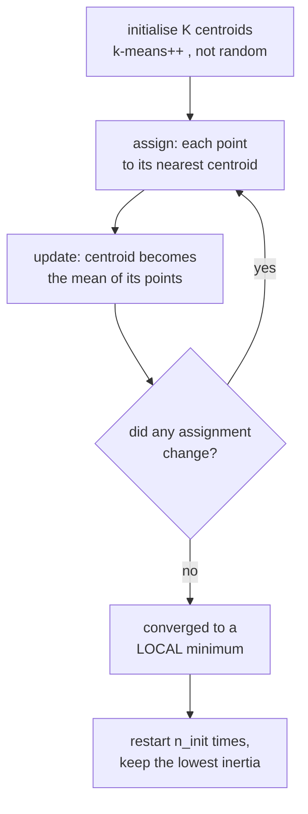

# Unsupervised Learning: Structure Without Labels

Unsupervised learning is where "what is a good answer?" becomes a genuinely hard
question. With labels, evaluation is arithmetic. Without them, you are asserting
that some structure exists and that your algorithm's notion of structure matches
the one you care about. Most unsupervised failures are failures of that
assumption, not of the optimiser.

## Clustering

### $k$-means

Minimise within-cluster sum of squares:

$$J = \sum_{k=1}^{K}\sum_{\mathbf{x}\in C_k}\|\mathbf{x}-\boldsymbol\mu_k\|^2$$

Lloyd's algorithm alternates two steps, each of which provably does not increase
$J$:

1. **Assign** each point to its nearest centroid.
2. **Update** each centroid to the mean of its assigned points.

It converges in finite steps because there are finitely many assignments and $J$
strictly decreases — but only to a **local** minimum. Hence `n_init` restarts.

**$k$-means++ initialisation** picks centroids sequentially with probability
proportional to squared distance from the nearest existing centroid. It spreads
the initial centroids out, and it comes with an $O(\log K)$ approximation
guarantee — a rare case where a practical heuristic has a real bound. It is the
default in scikit-learn and you should never turn it off.

**The assumptions, stated plainly.** $k$-means implicitly assumes clusters are:

| Assumption | Fails on |
|---|---|
| Spherical (isotropic) | elongated or elliptical clusters |
| Similar size | one large and one small cluster — the boundary is pulled wrong |
| Similar density | dense and sparse clusters |
| Convex and linearly separable in the input space | concentric rings, moons, spirals |
| Every point belongs to a cluster | data with genuine noise or outliers |
| $K$ is known | almost always false |

Because the objective is squared Euclidean distance, **scaling is mandatory** and
outliers pull centroids hard. For non-spherical structure, use DBSCAN, spectral
clustering, or a GMM.

**Choosing $K$:**

| Method | Idea | Weakness |
|---|---|---|
| Elbow on inertia | look for the bend | often no clear bend; subjective |
| Silhouette score | $\frac{b-a}{\max(a,b)}$ per point, averaged | favours convex, spherical clusters |
| Gap statistic | compare inertia against a uniform null | expensive |
| Davies–Bouldin, Calinski–Harabasz | ratio of within to between scatter | same geometric bias |
| BIC/AIC with a GMM | principled model selection | requires the Gaussian assumption |
| **Downstream utility** | does $K=5$ make the business process work? | the only one that really answers the question |

Variants: **MiniBatchKMeans** for millions of points, **$k$-medoids/PAM**
(centres are actual data points, works with any metric, robust to outliers), and
**$k$-modes** for categorical data.

### DBSCAN and HDBSCAN

Density-based clustering: a cluster is a dense region separated from other dense
regions by sparse ones.

Two parameters: `eps` (neighbourhood radius) and `min_samples`. A point is a
**core point** if at least `min_samples` points lie within `eps`. Core points
that are within `eps` of each other join the same cluster; non-core points within
reach of a core point are **border points**; everything else is **noise**.

| Advantage | Limitation |
|---|---|
| Finds arbitrarily shaped clusters | struggles when clusters have very different densities |
| Does **not** require $K$ | `eps` is hard to choose and very sensitive |
| Explicitly labels outliers as noise | degrades in high dimensions (distance concentration) |
| Robust to outliers | border-point assignment depends on processing order |

Choose `eps` with a **$k$-distance plot**: sort every point's distance to its
$k$-th nearest neighbour and look for the knee.

**HDBSCAN** removes the `eps` parameter by building a hierarchy across all
density levels and extracting the most stable clusters. It handles varying
density, needs only `min_cluster_size`, and is the better default in almost every
case where DBSCAN is being considered.

### Hierarchical clustering

Build a tree of nested clusters, then cut it at the level you want. Agglomerative
(bottom-up) is the common form.

| Linkage | Merge criterion | Produces |
|---|---|---|
| Single | min pairwise distance | chained, elongated clusters; equivalent to cutting a minimum spanning tree |
| Complete | max pairwise distance | compact, similar-diameter clusters |
| Average | mean pairwise distance | a compromise |
| **Ward** | minimum increase in within-cluster variance | spherical, balanced; the usual default |

Cost is $O(n^2)$ memory and $O(n^2\log n)$ time, so it caps out around $10^4$
points. Its advantage is the **dendrogram**: you see the whole hierarchy, choose
the cut afterwards, and get a visual sense of how well-separated the structure
is.

### Gaussian mixture models and EM

Model the data as a mixture of Gaussians:

$$p(\mathbf{x}) = \sum_{k=1}^{K}\pi_k\,\mathcal{N}(\mathbf{x}\mid\boldsymbol\mu_k,\Sigma_k)$$

Fit by **expectation–maximisation**:

- **E-step**: compute the responsibility of each component for each point,
  $\gamma_{ik} = \frac{\pi_k\mathcal{N}(\mathbf{x}_i\mid\mu_k,\Sigma_k)}{\sum_j \pi_j\mathcal{N}(\mathbf{x}_i\mid\mu_j,\Sigma_j)}$.
- **M-step**: update $\pi_k, \mu_k, \Sigma_k$ as responsibility-weighted
  statistics.

EM monotonically increases the log-likelihood and converges to a local optimum.
It is the same alternating structure as $k$-means, and in fact **$k$-means is the
limit of a GMM** with spherical, equal, vanishing covariance and hard
assignments.

| GMM over $k$-means | Detail |
|---|---|
| Soft assignments | each point has a probability per cluster |
| Elliptical clusters | full covariance captures orientation and scale |
| A real density model | you can sample, and score new points |
| Principled $K$ selection | BIC/AIC over the likelihood |
| Costs | more parameters, can be singular, slower |

Guard against **covariance collapse**: a component can shrink onto a single point
and drive the likelihood to infinity. `reg_covar` adds a small ridge to the
diagonal and prevents it.

### Spectral clustering

Build a similarity graph, compute the graph Laplacian $L = D - A$, take the
eigenvectors of the smallest non-zero eigenvalues, and run $k$-means in that
embedding.

The eigenvector for the second-smallest eigenvalue — the **Fiedler vector** —
gives the best spectral bipartition. Spectral clustering handles non-convex
shapes that defeat $k$-means (the classic two-moons example) because the graph
embedding makes them linearly separable. Cost is $O(n^3)$ for the
eigendecomposition, so it does not scale past ~$10^4$ points without
approximation.

### Which clustering algorithm

| Data | Algorithm |
|---|---|
| Spherical, similar size, $K$ known, large $n$ | $k$-means (MiniBatch if huge) |
| Arbitrary shapes, outliers present, $K$ unknown | **HDBSCAN** |
| Elliptical clusters, want probabilities/density | GMM |
| Want the full hierarchy, $n < 10^4$ | Ward agglomerative |
| Non-convex, graph-like, $n < 10^4$ | spectral |
| Categorical features | $k$-modes, or Gower distance + hierarchical |
| Mixed types | Gower distance + hierarchical or HDBSCAN |
| Text or embeddings | HDBSCAN on UMAP-reduced embeddings (the BERTopic recipe) |

## Dimensionality reduction

### PCA, derived

Find orthogonal directions of maximum variance. Centre the data, then:

$$\max_{\|\mathbf{w}\|=1}\; \mathbf{w}^\top\Sigma\mathbf{w} \quad\Longrightarrow\quad \Sigma\mathbf{w} = \lambda\mathbf{w}$$

The Lagrangian gives an eigenvalue problem directly: the principal components are
the eigenvectors of the covariance matrix, ordered by eigenvalue, and each
eigenvalue **is** the variance along its component.

Equivalently, PCA is the SVD $X = U\Sigma V^\top$ with the components as the
columns of $V$ — and computing it that way is numerically far better than forming
the covariance matrix, exactly as with the normal equations.

Two more equivalent characterisations, both worth knowing:

- PCA finds the **rank-$k$ linear subspace minimising reconstruction error**
  (Eckart–Young).
- PCA **decorrelates** the data: in the new basis the covariance is diagonal.

Practical rules:

- **Standardise first** unless all features share units, or the largest-variance
  feature simply wins by virtue of its scale.
- Choose $k$ by cumulative explained variance (85–95%), a scree-plot elbow, or
  downstream performance.
- PCA is **unsupervised** — the highest-variance direction is not necessarily the
  most predictive one. A low-variance direction can carry all the label
  information, and PCA will discard it.
- Components are linear combinations of every feature, so they are usually not
  interpretable.
- Fit on training data only, inside a Pipeline.

| Variant | For |
|---|---|
| Randomised / truncated SVD | large matrices, only the top $k$ needed |
| Incremental PCA | data that does not fit in memory |
| Sparse PCA | components with few non-zero loadings; interpretable |
| Kernel PCA | non-linear structure |
| **NMF** | non-negative data (counts, spectra, images); parts-based, interpretable |
| **ICA** | separate statistically independent sources (blind source separation) |
| **LDA (discriminant)** | supervised — maximises class separation, not variance |
| Factor analysis | models shared latent factors plus per-feature noise |
| Autoencoders | non-linear, learned |
| Random projection | fast, distribution-preserving (Johnson–Lindenstrauss) |

### t-SNE and UMAP

Both are **visualisation** methods: they preserve local neighbourhood structure
in 2 or 3 dimensions.

**t-SNE** converts pairwise distances into probabilities in both the original and
the embedded space, and minimises the KL divergence between them. The Student-$t$
kernel in the low-dimensional space has heavier tails, which relieves the
"crowding problem" and lets clusters separate visibly.

**UMAP** builds a fuzzy topological representation and optimises a
cross-entropy. It is faster, scales better, preserves more global structure, and
can transform new points — which t-SNE cannot.

| Parameter | Effect |
|---|---|
| t-SNE `perplexity` (5–50) | effective number of neighbours; changes the picture substantially |
| UMAP `n_neighbors` | local (small) vs global (large) structure |
| UMAP `min_dist` | how tightly points may pack |
| both: `metric` | cosine for embeddings, Euclidean for scaled features |

**What these plots cannot tell you**, and it is a long list:

- Cluster **sizes** are meaningless — both algorithms equalise density.
- **Distances between** clusters are largely meaningless.
- Apparent clusters can appear in pure noise, especially at low perplexity.
- The result changes with the seed and every hyperparameter.
- Global geometry is not preserved (UMAP more than t-SNE, but neither reliably).

Use them to generate hypotheses and to spot duplicates or mislabelled points.
Never use them as evidence. PCA is uglier and more honest: its axes have
meaning and its explained-variance ratio is interpretable.

## Density estimation

| Method | Idea | Note |
|---|---|---|
| Histogram | bin and count | bin width and origin change everything; useless above ~3 dims |
| **KDE** | sum of kernels centred on each point | bandwidth is the critical parameter; Silverman's rule as a start |
| GMM | mixture of Gaussians | parametric, scales better |
| Normalising flows | invertible neural maps to a simple base density | exact likelihood, high dimensions |
| Autoregressive models | factor $p(x) = \prod p(x_i \mid x_{<i})$ | exact likelihood, slow sampling |
| Diffusion / score models | learn $\nabla\log p$ | excellent samples, likelihood is approximate |
| Energy-based models | unnormalised $e^{-E(x)}$ | flexible; the partition function is intractable |

Bandwidth in KDE plays exactly the role of $k$ in $k$-NN: too small and you get a
spiky memorisation of the sample; too large and everything is one smooth blob.

## Anomaly detection

| Method | Idea | Best for |
|---|---|---|
| **Isolation Forest** | random splits isolate anomalies in fewer splits | the strong general default; scales well |
| **Local Outlier Factor** | local density relative to neighbours' density | clusters of varying density |
| One-class SVM | smallest region containing most data | small data, clean training set |
| Elliptic envelope | robust Gaussian fit, Mahalanobis distance | roughly Gaussian data |
| $k$-NN distance | distance to the $k$-th neighbour | simple, effective on embeddings |
| Autoencoder reconstruction error | anomalies reconstruct poorly | images, sequences, high dimensions |
| Statistical thresholds | z-score, IQR fences, extreme value theory | univariate, interpretable |
| Forecast residuals | deviation from a predicted value | time series |

Isolation Forest's insight is neat and worth stating: anomalies are **few and
different**, so random axis-aligned splits isolate them near the root of the
tree. The anomaly score is the average path length, and no distance metric or
density estimate is required — which is why it survives high dimensions better
than distance-based methods.

**Evaluation is the hard part**, since you rarely have labelled anomalies. Use
whatever labelled incidents exist (even a handful), inject synthetic anomalies to
sanity-check sensitivity, set the threshold by the alert volume your team can
actually triage, and track precision on the alerts that were investigated.
`contamination` is a prior on the anomaly rate, not something the algorithm can
discover.

## Association rule mining

Find rules $\{A, B\} \Rightarrow \{C\}$ in transaction data.

| Measure | Formula | Reading |
|---|---|---|
| Support | $P(A\cap C)$ | how often the pattern occurs |
| Confidence | $P(C\mid A)$ | how often the rule holds |
| **Lift** | $\frac{P(C\mid A)}{P(C)}$ | how much more likely than chance; $>1$ is interesting |
| Conviction | $\frac{1-P(C)}{1-P(C\mid A)}$ | robustness to independence |

**Confidence alone is misleading.** If 80% of all transactions contain bread, a
rule with 80% confidence for bread tells you nothing. Lift corrects for the base
rate, and it is the measure to sort by. Apriori and FP-Growth are the standard
algorithms; FP-Growth is generally faster because it avoids repeated database
scans.

## Evaluating unsupervised results

| Metric type | Examples | Limitation |
|---|---|---|
| **Internal** | silhouette, Davies–Bouldin, Calinski–Harabasz, inertia | measure geometry; biased toward convex, spherical clusters |
| **External** | adjusted Rand index, normalised/adjusted mutual information, V-measure, purity | need ground-truth labels |
| **Stability** | agreement across bootstrap resamples or seeds | a good proxy when labels are absent |
| **Downstream** | does the clustering improve a supervised model or a business process? | the only one that answers the real question |

**Always use the adjusted variants** (adjusted Rand, adjusted MI) when comparing
against ground truth — the unadjusted versions are inflated by chance agreement
and increase with the number of clusters, so they will happily tell you that more
clusters are better.

Stability deserves more use than it gets: cluster several bootstrap resamples and
measure how consistently pairs of points end up together. Structure that
survives resampling is real; structure that does not is an artefact of the
sample.

## Common pitfalls

| Pitfall | Consequence |
|---|---|
| Not scaling before $k$-means or PCA | the largest-range feature determines everything |
| Choosing $K$ by the elbow alone | there is usually no elbow; the choice is arbitrary |
| Reading t-SNE cluster sizes or distances | both are meaningless |
| Using PCA before a supervised model without checking | the discarded directions may hold the signal |
| Running DBSCAN in 100 dimensions | distance concentration makes density meaningless |
| Treating unadjusted Rand/MI as a score | inflated by chance |
| Fitting PCA on the full dataset before CV | leakage |
| Assuming clusters exist | uniform noise clusters happily into any $K$ you ask for |
| Applying `contamination=0.1` because it is the default | you asserted a 10% anomaly rate |

That "assuming clusters exist" line is the deepest one. Every clustering
algorithm returns clusters. Run $k$-means with $K=5$ on uniform random data and
you get five tidy regions. Before interpreting, check whether the data has any
cluster tendency at all — the Hopkins statistic, a stability analysis, or simply
comparing your silhouette score against the same score on shuffled data.

## Self-check

1. Name four assumptions $k$-means makes and give a dataset that violates each.
2. Why is $k$-means++ worth using, and what guarantee does it come with?
3. In what precise sense is $k$-means a limiting case of a GMM?
4. Derive PCA's eigenvalue problem from the maximum-variance objective.
5. Give three things a t-SNE plot cannot tell you.
6. Why can a low-variance principal component matter for a supervised task?
7. You have no labelled anomalies. Describe how you would still evaluate an
   anomaly detector.

## Where to go next

- [Feature Engineering](./feature-engineering.md) — using these representations
  as features.
- [Probabilistic & Instance Models](./probabilistic-and-instance-models.md) —
  GMMs, $k$-NN, and generative modelling.
- [Model Evaluation](./model-evaluation.md) — evaluation done properly.
