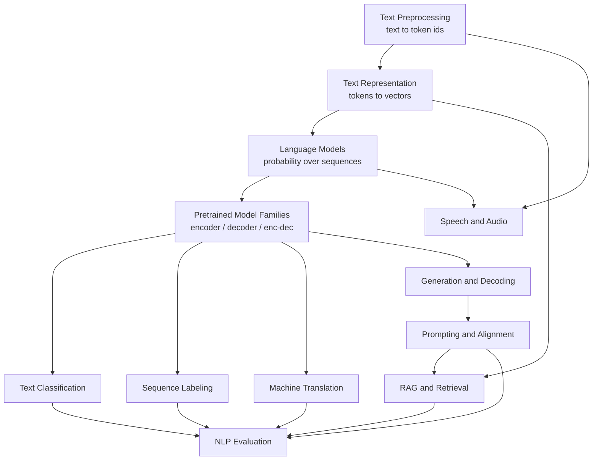

# NLP

NLP changed more between 2017 and 2026 than any other area of machine learning,
and the change was not incremental. Task-specific architectures gave way to
pretrained transformers; pretrained transformers gave way to general models
prompted in natural language. What survived is the underlying set of problems —
tokenization, representation, ambiguity, evaluation — which is why these pages
are organised by problem rather than by model.

## Topics

| Topic | Level | What it covers |
|---|---|---|
| [Text Preprocessing](./nlp/text-preprocessing.md) | beginner | Unicode, the tokenization problem, BPE/WordPiece/SentencePiece with a worked example, what modern pipelines should not do |
| [Text Representation](./nlp/text-representation.md) | intermediate | TF-IDF and BM25, word2vec and GloVe derived, fastText, contextual and sentence embeddings, vector search |
| [Language Models](./nlp/language-models.md) | intermediate | n-grams and smoothing, neural LMs, perplexity done properly, scaling laws, emergence, hallucination |
| [Text Classification](./nlp/text-classification.md) | beginner | the approach ladder from TF-IDF up, fine-tuning, LLM classification, imbalance, error analysis |
| [Sequence Labeling](./nlp/sequence-labeling.md) | intermediate | BIO schemes, HMMs and CRFs with Viterbi, transformer taggers, subword alignment, nested entities |
| [Machine Translation](./nlp/machine-translation.md) | advanced | SMT to seq2seq to transformer, back-translation, multilingual models, BLEU and COMET |
| [Text Generation & Decoding](./nlp/text-generation-and-decoding.md) | intermediate | greedy/beam/top-p/min-p, repetition control, constrained decoding, speculative decoding |
| [Pretrained Model Families](./nlp/pretrained-model-families.md) | intermediate | BERT, GPT, T5 and their descendants; the modern decoder recipe; choosing a checkpoint |
| [LLM Prompting & Alignment](./nlp/llm-prompting-and-alignment.md) | advanced | SFT, RLHF, DPO, GRPO; prompting that works; chain of thought; tool use; failure modes |
| [RAG & Retrieval](./nlp/rag-and-retrieval.md) | advanced | chunking, hybrid search, reranking, context assembly, verification, stage-wise evaluation |
| [Speech & Audio](./nlp/speech-and-audio.md) | advanced | spectrograms, CTC and RNN-T, Whisper, TTS, speaker tasks, audio LLMs, WER |
| [NLP Evaluation](./nlp/nlp-evaluation.md) | intermediate | metrics per task, BLEU/ROUGE/BERTScore/COMET, LLM judges and their biases, contamination |

## How they fit together

## Suggested order

1. **Text Preprocessing** — tokenization decisions leak into everything.
2. **Text Representation** — and note that TF-IDF is still a baseline worth
   beating.
3. **Language Models** — the object everything else is built on.
4. **Text Classification** — the most deployed task, and the one where the cheap
   baseline is most often skipped.
5. **Pretrained Model Families** — how to choose a checkpoint.
6. **Text Generation & Decoding**, then **LLM Prompting & Alignment**.
7. **RAG & Retrieval** — the standard production architecture.
8. **NLP Evaluation** — revisit in depth here; read its split/metric protocol before tuning any earlier model or prompt.
9. **Sequence Labeling**, **Machine Translation**, and **Speech & Audio** as
   needed.

## Related courses

- **[Transformers Deep Dive](/courses/transformers/)** — 17 modules deriving the
  architecture from first principles.
- **[The Inference Engineering Course](/courses/inference/)** — 14 chapters on
  serving these models efficiently.

## The short version

- **Tokenization is not a detail.** It decides cost, context, arithmetic
  ability, and cross-language equity.
- **Run the cheap baseline.** TF-IDF plus a linear model, and BM25 for
  retrieval, are still hard to beat and take minutes.
- **Fine-tuning and retrieval solve overlapping problems.** Weights can learn
  facts; retrieval often makes changing information and attribution easier.
- **Likelihood is not a truth guarantee.** Next-token training alone neither
  guarantees factuality nor proves a theorem that every possible model must hallucinate.
- **Evaluate relevant data with enough evidence.** Private task fixtures complement
  public benchmarks; fifty examples may be useful for debugging but underpowered
  for small gains or rare subgroup failures.

### Shared task contract

Before choosing a checkpoint, record input unit, output ontology, annotation
ambiguities, source/license permissions, privacy handling, and document/user/time
split boundaries. Entry skills are array shapes, conditional probability, and
train/development/test isolation. Exit skills include explaining a tokenizer's
offsets, fitting a leakage-safe baseline, distinguishing score from decision
metrics, and tracing a generated claim to authorized evidence or abstaining.

A small capstone can reuse a versioned, redistributable support-document corpus
for topic classification, entity extraction, retrieval and grounded answers.
Maintain one annotation guide and provenance manifest, plus unanswerable queries,
near duplicates, minority-language slices, and malformed input cases. Freeze the
evaluation protocol before repeated prompt/model selection. Record quality,
uncertainty, latency and cost together; a polished output on one example is not
an evaluation dashboard.

Start the executable portion with the [text-classifier artifact capstone](./libraries/mlops-and-serving.md#capstone-train-package-reload-serve).
It trains and evaluates a sparse baseline, saves its data/split/schema manifest,
reloads the full pipeline, and checks served probabilities against a fixed
prediction fixture. The corpus is intentionally synthetic and offline. Extraction,
retrieval, grounded generation, and real multilingual benchmark slices are not
claimed by that narrower acceptance test.
