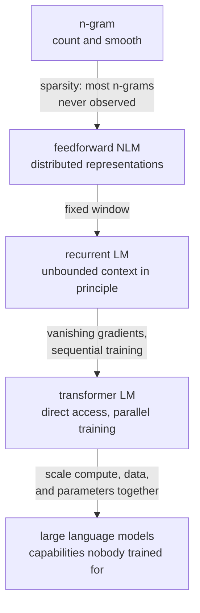

# Language Models

A language model assigns probability to sequences of text. That is a modest
definition for an object that now writes code, passes professional exams, and
runs agents — and the gap between the definition and the capability is the most
interesting thing in the field.

## The definition

$$P(w_1,\dots,w_n) = \prod_{i=1}^{n}P(w_i\mid w_1,\dots,w_{i-1})$$

That factorisation is the **chain rule of probability** — an exact identity, not
an approximation or a modelling choice. An autoregressive language model is a
machine for estimating each conditional on the right-hand side. Everything else
is architecture.

## N-gram models

Approximate the full history with the last $n-1$ words (a Markov assumption):

$$P(w_i\mid w_1,\dots,w_{i-1}) \approx P(w_i\mid w_{i-n+1},\dots,w_{i-1}) = \frac{C(w_{i-n+1},\dots,w_i)}{C(w_{i-n+1},\dots,w_{i-1})}$$

| $n$ | Model | Parameters for $V=50$k | Problem |
|---|---|---|---|
| 1 | unigram | $5\times10^4$ | no context at all |
| 2 | bigram | $2.5\times10^9$ | one word of context |
| 3 | trigram | $1.25\times10^{14}$ possible sequences | sparse storage and smoothing required |
| 5 | 5-gram | about $3\times10^{23}$ possible sequences | useful sparse models store observed histories, not the full Cartesian space |

**The sparsity problem is fundamental, not incidental.** Most valid trigrams
never occur in any corpus, and an unseen n-gram gets probability zero, which
makes the whole sequence probability zero. Smoothing is not a refinement; without
it the model is unusable.

| Smoothing | Idea |
|---|---|
| Add-one (Laplace) | add 1 to every count; far too aggressive for large vocabularies |
| Add-$k$ | tune the pseudo-count |
| Good–Turing | estimate the mass of unseen events from the count of singletons |
| Backoff (Katz) | fall back to a shorter n-gram when the longer one is unseen |
| Interpolation (Jelinek–Mercer) | mix all orders with learned weights |
| **Kneser–Ney** | the best of the family; discounts counts and uses *continuation* probability |

**Kneser–Ney's key insight** is worth knowing because it is a genuinely clever
statistical idea. "Francisco" is frequent, but almost exclusively after "San", so
it is a poor unigram backoff candidate. Kneser–Ney replaces raw frequency with
the number of **distinct contexts** a word appears in, which correctly ranks
"Francisco" low as a standalone continuation.

Modified Kneser–Ney with a 5-gram order was the state of the art for roughly a
decade and is still a legitimate baseline. It also remains genuinely useful:
n-gram LMs are cheap, exact, and used for ASR rescoring and constrained decoding.

## Neural language models

### Feedforward (Bengio, 2003)

Embed the previous $n-1$ words, concatenate, pass through an MLP, softmax over
the vocabulary. Two contributions that outlived the architecture:

1. **Distributed representations** — similar words get similar vectors, so
   probability mass generalises across them. "The cat is walking in the bedroom"
   informs "A dog was running in a room" even if the second never occurred.
2. **Parameters scale with $V\times d$, not $V^n$** — the sparsity problem is
   solved by construction rather than by smoothing.

The limitation was still the fixed window.

### Recurrent

An RNN/LSTM carries a hidden state, so the context is unbounded in principle.
In practice, vanishing gradients and the fixed-size state limited effective
context to tens of tokens, and training was sequential and therefore slow.

### Transformer

The current answer. Self-attention gives every position direct access to every
earlier position ($O(1)$ path length instead of $O(n)$), and the causal mask lets
all positions train **simultaneously** in one forward pass.

That last point is the decisive one. An RNN's sequential dependency cannot use a
sequence-axis parallelism during recurrence; GPUs still parallelize batch and
matrix operations. A transformer's forward pass is a stack of matrix
multiplications. The change is not primarily about representational power — it is
about being able to spend $10^{25}$ FLOPs productively.



## The three architectural families

| Family | Attention | Objective | Best for |
|---|---|---|---|
| **Decoder-only** | causal | next-token prediction | generation, and in practice everything |
| **Encoder-only** | bidirectional | masked token prediction | classification, NER, embeddings |
| **Encoder–decoder** | bidirectional encoder + causal decoder | span corruption / denoising | translation, summarisation |

**Decoder-only won**, and the reasons are worth stating explicitly: next-token
prediction applies to any text without annotation; every position produces a
training signal in a single pass; the architecture is simpler with no
cross-attention; and in-context learning emerges from it. Encoders remain
correct for embeddings and for token-level tasks where you can afford a
specialised model.

## Perplexity

$$\mathrm{PPL} = \exp\left(-\frac{1}{N}\sum_{i=1}^{N}\log p(w_i\mid w_{<i})\right) = e^{H}$$

The exponentiated average cross-entropy. Interpret it as the **effective number
of equally likely choices** at each step: perplexity 20 means the model is as
uncertain as if choosing uniformly among 20 tokens.

| Model class | Rough word-level perplexity on English |
|---|---|
| Uniform over 50k vocabulary | 50,000 |
| Unigram | ~950 |
| Smoothed trigram | ~150 |
| LSTM (2016 era) | ~60 |
| Large transformer | ~10 or below |

**Three conditions must match for a perplexity comparison to mean anything:**

1. **Identical tokenisation.** Byte-level, subword, and word-level perplexities
   are not comparable. Normalise to **bits per byte** to compare across
   tokenizers.
2. **Identical corpus.** Perplexity on Wikipedia and on code are different
   numbers about different things.
3. **Matched context/evaluation policy.** Longer context can help but is not free
   and need not lower measured loss for a finite model. Match stride, boundaries,
   masking and predicted-token counts.

Perplexity also correlates imperfectly with usefulness: an instruction-tuned
model typically has *worse* perplexity on raw web text than its base model while
being far more useful. It measures distribution fit, not helpfulness.

## Scaling laws

Loss falls as a predictable power law in model size $N$, dataset size $D$, and
compute $C$ — smooth over many orders of magnitude:

$$L(N) \approx \left(\frac{N_c}{N}\right)^{\alpha_N}, \qquad L(D) \approx \left(\frac{D_c}{D}\right)^{\alpha_D}$$

### Chinchilla

The 2022 result that changed how models are sized. For a fixed compute budget
$C \approx 6ND$, the compute-optimal allocation is roughly **20 tokens per
parameter** in its fitted experimental regime. This ratio is not a universal
training rule; data quality, architecture, budget and deployment economics matter.

| Model | Parameters | Tokens | Tokens/param |
|---|---|---|---|
| GPT-3 | 175B | 300B | 1.7 |
| **Chinchilla** | 70B | 1.4T | 20 |
| Llama 3 8B | 8B | 15T | **1,875** |

Chinchilla outperformed GPT-3 while being 2.5× smaller, because GPT-3 was badly
under-trained. The Llama 3 row shows the further practical wrinkle: for a model
that will be **served** to many users, inference cost dominates lifetime cost, so
it pays to train far past compute-optimal on a smaller model. The
compute-optimal point optimises training cost; almost nobody actually wants to
optimise that alone.

### What scaling does not fix

Scaling improves loss smoothly and reliably. It does not fix hallucination,
knowledge cutoffs, arithmetic reliability, or the absence of information that was
never in the training data. And high-quality text data is finite — estimates put
the usable public web in the low tens of trillions of tokens — which is why
synthetic data, multi-epoch training, and data curation now receive as much
attention as architecture.

## Emergent capabilities

Some abilities appear abruptly above a scale threshold rather than improving
smoothly: multi-step arithmetic, word unscrambling, chain-of-thought reasoning,
instruction following.

**The important caveat**: a well-supported analysis argues emergence is often an
artefact of **discontinuous metrics**. Exact-match accuracy on a multi-step task
is 0 until every step is right, so a smooth improvement in per-step accuracy
produces a step change in the aggregate. Measure with a continuous metric — token
edit distance, per-step accuracy, log-likelihood of the correct answer — and many
"emergent" curves become smooth.

This does not mean capabilities do not appear at scale; it means the
discontinuity is often in the measurement rather than the model.

## The stages of building one

| Stage | Data | Objective | Produces |
|---|---|---|---|
| **Pretraining** | trillions of tokens of web text, code, books | next-token prediction | a base model — completes text, does not follow instructions |
| **Mid-training / continued pretraining** | domain or high-quality data | same | domain adaptation, longer context |
| **SFT** | instruction–response pairs | next-token on the response only | an instruction-following model |
| **Preference tuning** | preference pairs, or verifiable rewards | DPO / PPO / GRPO | helpfulness, harmlessness, formatting, reasoning |
| **Distillation** | teacher generations | matching the teacher | a small model with much of the capability |

**Base models and instruct models behave completely differently**, and confusing
them is a common practical error. A base model given "What is the capital of
France?" may continue with more questions, because that is what the training
distribution contains. Instruct models are the ones that answer.

## In-context learning

Give examples in the prompt; the model performs the task without any weight
update.

| Mode | Examples in prompt |
|---|---|
| Zero-shot | 0, instruction only |
| Few-shot | 3–50 |
| Chain-of-thought | worked reasoning, not just answers |
| Many-shot | hundreds, using long context |

Findings that are counter-intuitive and well replicated: the **format** and
**label space** of the examples matter far more than their correctness — models
still improve with randomly-labelled demonstrations, suggesting the examples
mainly specify the task and output format rather than teaching the mapping.
Example order also matters, sometimes by many points, which is a reminder that
prompting is empirical.

The mechanism is still debated. The leading accounts are that the model performs
implicit gradient descent in its activations, that it performs Bayesian inference
over latent tasks seen in pretraining, and that induction heads — attention heads
that complete `[A][B]…[A]` → `[B]` — provide the copy-and-pattern-match
substrate. All three have supporting evidence.

## What a language model does and does not know

| It does | It does not |
|---|---|
| Model the distribution of text | Have beliefs, intentions, or goals |
| Store an enormous amount of factual association | Have a reliable, queryable knowledge base |
| Perform impressive multi-step reasoning | Reliably know when it is wrong |
| Follow instructions | Have access to anything after its cutoff |
| Manipulate its context window | Have persistent memory between conversations |
| Produce fluent, well-formed text | Guarantee that fluent text is true |

**Hallucination risk** arises because high likelihood does not guarantee truth.
Training data, model capacity, optimization, prompts and decoding all matter.
Next-token prediction alone does not establish a theorem that every model must
hallucinate, nor that factual reliability cannot improve through training.

Practical mitigations include both system design and model training:
retrieval-augmented generation grounds answers in retrieved text; verifiable
rewards during post-training penalise unsupported claims; abstention training
teaches the model to say it does not know; and citation requirements make claims
checkable. None supplies an unconditional guarantee for arbitrary deployment inputs.

## Practical notes

| Concern | Guidance |
|---|---|
| Context length | attention is $O(n^2)$; long context is expensive and quality degrades in the middle |
| Lost in the middle | retrieval accuracy is highest at the start and end of a long context; put the important material there |
| KV cache | may dominate for large batches/contexts; weights or activations dominate other regimes; GQA reduces cache size and paging manages allocation |
| Prompt caching | shared system prompts can be cached across requests — a large cost saving |
| Determinism | even at temperature 0, batching and kernel non-determinism cause variation |
| Tokenizer costs | non-Latin scripts cost 2–5× more tokens for the same content |
| Evaluation contamination | assume public benchmarks are in the training data; keep a private set |

## Self-check

### Runnable normalized counts and token-weighted language loss

The toy bigram model maps a previous token to vocabulary logits using a PyTorch
embedding table. This is an actual next-token training example, not a pretrained
language-capability demonstration. Rows are separate documents, EOS is supervised,
and padding is not; concatenation must not silently create cross-document targets.

```python runnable
import numpy as np
import torch
torch.manual_seed(9)
torch.set_num_threads(1)
counts = np.array([[2., 0., 1.], [0., 0., 0.]])
smoothed = (counts+.5)/(counts.sum(1, keepdims=True)+.5*3)
assert np.allclose(smoothed.sum(1), 1)
assert np.allclose(smoothed[1], np.full(3, 1/3))
tokens = torch.tensor([[1, 3, 4, 2, 0], [1, 3, 5, 4, 2]])  # PAD=0 BOS=1 EOS=2
inputs = tokens[:, :-1]
targets = tokens[:, 1:].clone()
targets[targets == 0] = -100
model = torch.nn.Embedding(6, 6)
optimizer = torch.optim.Adam(model.parameters(), lr=.15)
loss_fn = torch.nn.CrossEntropyLoss(ignore_index=-100)
initial = loss_fn(model(inputs).reshape(-1, 6), targets.reshape(-1)).item()
for _ in range(30):
    optimizer.zero_grad()
    loss = loss_fn(model(inputs).reshape(-1, 6), targets.reshape(-1))
    loss.backward()
    optimizer.step()
with torch.no_grad():
    token_losses = torch.nn.functional.cross_entropy(model(inputs).reshape(-1, 6),
        targets.reshape(-1), ignore_index=-100, reduction="none")
    count = (targets != -100).sum()
    nll = token_losses.sum()/count
assert count.item() == 7 and nll.item() < initial
assert np.isfinite(np.exp(nll.item()))
print("valid targets", count.item(), "mean NLL", nll.item(), "PPL", np.exp(nll.item()))
```

**Why not average batch perplexities?** Exponentiation is nonlinear and batches
have unequal valid-token counts. Sum NLL and target counts, divide, then
exponentiate. For fixed-window transformers, mask reused context targets so every
evaluated token is counted once and maximize available left context within the
window. Byte-normalized loss uses total nats divided by $\log2$ and the exact
evaluated raw-byte count; it still requires matched corpus/boundary conventions.
The [Transformers perplexity guide](https://huggingface.co/docs/transformers/en/perplexity)
describes sliding-window evaluation. **Why can five-grams work despite the table's
huge count?** Sparse observed n-grams plus normalized smoothing avoid allocating
every possible sequence.

1. Why is the chain-rule factorisation an identity rather than an assumption?
2. Explain Kneser–Ney's continuation probability with the "Francisco" example.
3. Give the three conditions under which a perplexity comparison is meaningful.
4. State the Chinchilla result and explain why Llama 3 deliberately ignores it.
5. What is the "emergence is a metric artefact" argument, and what does it not
   claim?
6. Why does likelihood not guarantee truth, and why is that weaker than an impossibility theorem?
7. What surprising finding about few-shot example labels suggests about what
   in-context learning is doing?

## Where to go next

- [Text Generation & Decoding](./text-generation-and-decoding.md) — turning a
  distribution into text.
- [Pretrained Model Families](./pretrained-model-families.md) — BERT, GPT, T5 and
  their descendants.
- [LLM Prompting & Alignment](./llm-prompting-and-alignment.md) — SFT, RLHF, DPO,
  and prompting technique.
- [Transformers Deep Dive](/courses/transformers/) — the architecture in full.
