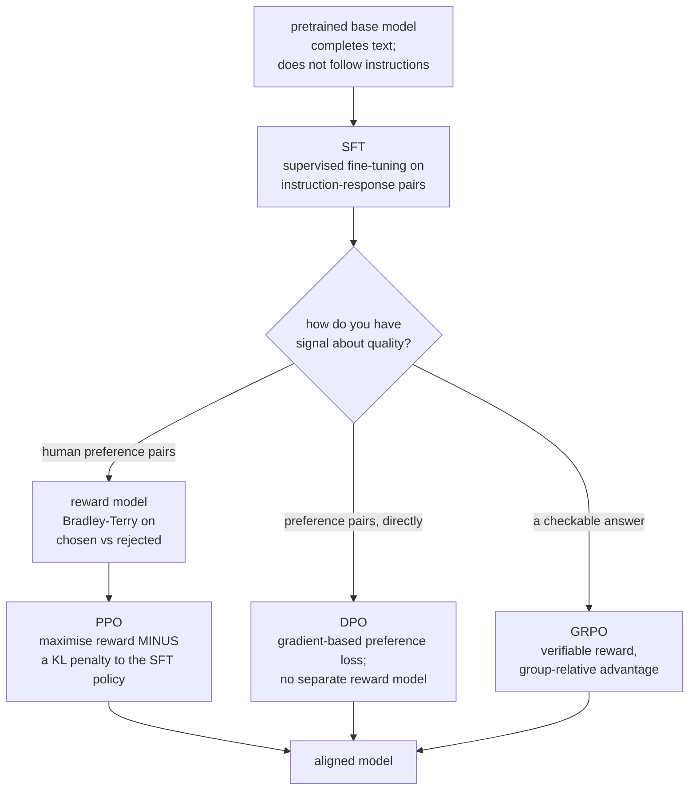
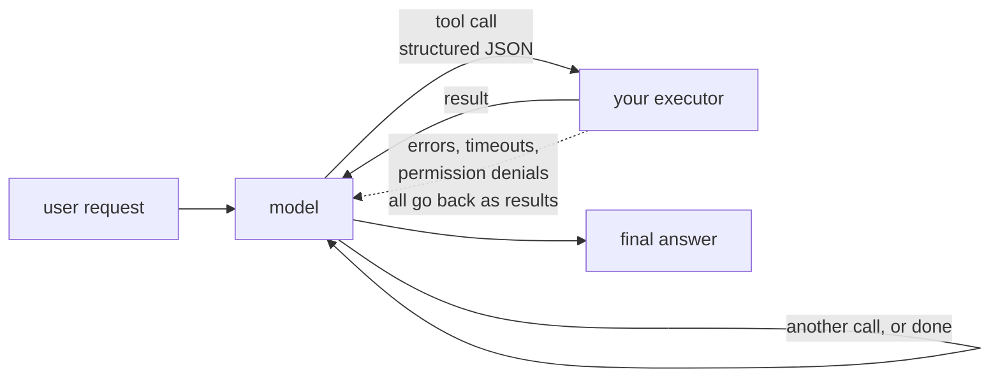

# LLM Prompting and Alignment

A base language model completes text. Turning it into something that answers
questions, follows instructions, uses tools, and declines harmful requests takes
a post-training pipeline — and getting good results out of the finished model
takes a set of prompting techniques that are more empirical than most people
admit. This page covers both halves.

## The post-training pipeline



### Supervised fine-tuning

Train on (instruction, response) pairs with the standard next-token loss,
often **computing loss on response tokens only** to focus the learning signal on
assistant behaviour. Full-sequence and prompt-weighted objectives are also valid
choices; they spend some gradient budget modelling the input distribution.
Assistant-only masking requires correct chat-template span boundaries.

| Detail | Guidance |
|---|---|
| Data quality and coverage | LIMA demonstrated a particular small curated-data recipe; no universal sample-count ranking follows |
| Diversity | cover the task distribution you actually expect |
| Format consistency | use the model's chat template; do not hand-write control tokens |
| Learning rate | 1e-5 to 2e-5 full, 1e-4 to 3e-4 for LoRA |
| Epochs | choose from held-out quality and overfitting checks, not a universal count |
| Packing | concatenate short examples to fill the context — can double throughput |
| Mask the prompt | loss on the response only |

**LIMA's finding — that 1,000 carefully curated examples produce a strong
assistant — is the most actionable result in this area.** The base model already
has the capability; SFT mostly teaches format and style. Curating a small,
excellent dataset beats scraping a large mediocre one.

### Reward modelling

Train a model to score responses, using pairwise human preferences and the
Bradley–Terry likelihood:

$$L = -\log\sigma\bigl(r_\phi(x,y_w) - r_\phi(x,y_l)\bigr)$$

Pairwise comparison is used rather than absolute rating because humans are far
more consistent at "which of these two is better" than at "rate this 1–10".

### RLHF with PPO

$$\max_\pi\;\mathbb{E}_{y\sim\pi}\bigl[r_\phi(x,y)\bigr] - \beta\,D_{\mathrm{KL}}\bigl(\pi\,\Vert\,\pi_{\text{SFT}}\bigr)$$

**KL regularisation is an important design choice, not mandatory in every RL
algorithm.** Reward models are imperfect proxies, and an
unconstrained optimiser finds their failure modes — repetitive phrasings,
excessive hedging, characteristic filler that scores well and reads badly. This
is Goodhart's law with a learned metric, and $\beta$ is the dial between
alignment and drift.

PPO's practical difficulties: four models in memory (policy, reference, reward,
value), a sampling loop inside training, and notorious hyperparameter
sensitivity.

### DPO

Direct preference optimisation observes that the KL-constrained objective has a
**closed-form optimal policy**, which can be inverted to express the implicit
reward in terms of the policy itself. Substituting into the Bradley–Terry
likelihood gives a supervised loss over preference pairs:

$$L_{\text{DPO}} = -\mathbb{E}\left[\log\sigma\left(\beta\log\frac{\pi_\theta(y_w\mid x)}{\pi_{\text{ref}}(y_w\mid x)} - \beta\log\frac{\pi_\theta(y_l\mid x)}{\pi_{\text{ref}}(y_l\mid x)}\right)\right]$$

Standard offline DPO needs no separately trained reward model or on-policy
sampling loop. The closed form belongs to the ideal unrestricted policy,
$\pi^*(y\mid x)\propto\pi_{\rm ref}(y\mid x)\exp(r(x,y)/\beta)$, with
$\beta>0$ and reference support. DPO still fits neural parameters iteratively.
The connection uses the KL-regularised reward objective and Bradley-Terry
preference model; finite data, limited policy capacity, and noisy preferences
do not guarantee the same learned policy as PPO.
[Original DPO derivation](https://arxiv.org/abs/2305.18290).

Practical notes: learning rates are very small ($5\times10^{-7}$ to
$1\times10^{-6}$); $\beta$ around 0.1; and over-training collapses output
diversity noticeably. DPO is also **off-policy** — it never samples from the
current policy — which is its main quality limitation relative to online methods.

### GRPO and verifiable rewards

For tasks with a **checkable** answer — mathematics, code that must pass tests,
formal proofs — a verifier can replace a learned reward model. This reduces
some subjective scoring problems but does not remove reward hacking: incomplete
unit tests, leaked answers, parser bugs, and exploitable execution environments
can all reward incorrect behaviour. Run generated code in an isolated sandbox.

Group relative policy optimisation samples $G$ completions per prompt and
standardises the rewards within the group:

$$\hat{A}_i = \frac{r_i - \mathrm{mean}(r_1,\dots,r_G)}{\mathrm{std}(r_1,\dots,r_G)+\epsilon}$$

The group mean supplies a baseline without a value network. Memory savings depend
on the whole rollout/training system, not a fixed factor of two. GRPO can use
learned rewards as well as verifiers. Equal-reward groups have zero centred
advantage and provide no relative learning signal. Modern variants differ in
reward scaling, clipping, token aggregation, and KL settings; record the exact
[TRL GRPO configuration](https://huggingface.co/docs/trl/grpo_trainer).

### The method table

| Method | Needs | Trade-off |
|---|---|---|
| SFT | demonstrations | simple; capped by demonstration quality |
| RLHF (PPO) | reward model + sampling | strongest control; complex, unstable |
| **DPO** | preference pairs | simple and stable; off-policy |
| IPO / KTO / ORPO | variants | KTO needs only binary good/bad labels |
| **GRPO** | sampled completion groups and reward scores | avoids a critic; quality depends on reward and rollout design |
| Constitutional AI / RLAIF | a principle set, AI feedback | scales past human labelling |
| Best-of-$n$ | reward model + inference compute | no training; pay at inference |

## Prompting

### What reliably works

| Technique | Why |
|---|---|
| **Be specific about the output format** | ambiguity is filled with the training distribution's default |
| **Give examples** (few-shot) | demonstrates format and edge cases better than description |
| **Assign a role or context** | narrows the distribution usefully |
| **Chain of thought** | "think step by step" — allocates compute to intermediate reasoning |
| **Reasoning before the answer** | in structured output, put the reasoning field *first* |
| **Decompose** | several focused calls beat one overloaded prompt |
| **Delimit sections clearly** | XML tags or markdown headers; reduces instruction/content confusion |
| **Say what to do, not what to avoid** | negative instructions are followed less reliably |
| **Provide an escape hatch** | "if the answer is not in the context, say so" — measurably reduces fabrication |
| Prefill the response | starting the assistant turn constrains the format |

### Chain of thought

$$\text{prompt} \to \text{reasoning steps} \to \text{answer}$$

The mechanism is best understood as **compute allocation**: a transformer does a
fixed amount of computation per token, so a problem needing more computation than
one forward pass provides must be spread across tokens. Chain of thought gives
the model somewhere to do the work.

Consequences that follow from that framing:

- It helps most on multi-step problems and barely at all on single-step recall.
- The reasoning must come **before** the answer. Reasoning generated after the
  answer cannot influence it.
- The written reasoning is **not necessarily faithful** — models produce
  post-hoc justifications for answers reached otherwise. Do not treat it as an
  explanation.
- Reasoning-trained models (o-series, R1-style) internalise this and perform
  extended reasoning by default.

### Self-consistency

Sample $n$ chains of thought at temperature ~0.7 and take the **majority final
answer**. It routinely adds 10–20 points on mathematical reasoning benchmarks,
because errors are diverse while correct reasoning converges. It is the simplest
and most reliable inference-time compute technique.

### What is over-sold

| Claim | Reality |
|---|---|
| "Prompt engineering is a durable skill" | tricks that worked on GPT-3 are unnecessary now; the transferable skills are specificity, examples, and decomposition |
| Emotional appeals ("this is very important") | inconsistent, model-dependent, unreliable |
| Elaborate persona prompts | mild effect; specificity about the *task* matters more |
| Prompt "magic words" | brittle, and break across model versions |
| One prompt to do everything | decomposition beats overloading |
| Politeness affecting quality | no reliable effect |

**Build an evaluation set before optimising prompts.** Twenty to a hundred
examples from your real distribution, scored automatically where possible. Prompt
changes without measurement are superstition, and the field is full of it.

### Prompts are code

| Practice | Why |
|---|---|
| Version control | prompts change behaviour as much as code |
| An evaluation suite in CI | catch regressions from prompt or model changes |
| Templating and typed arguments | maintainability and correct escaping; not a prompt-injection security boundary |
| Track model version with prompt version | a prompt tuned on one model may fail on another |
| A/B test prompt changes | intuition about prompts is unreliable |
| Privacy-aware traces | redact secrets, minimise raw text, restrict access and retention |

## Tool use and agents

Give the model function definitions; it emits structured calls; your code
executes them and returns results.



| Pattern | Description |
|---|---|
| Function calling | the model emits a call matching a schema |
| **ReAct** | interleaved reasoning and acting |
| Plan-and-execute | plan first, then run the steps |
| Reflexion | critique and retry after failures |
| Multi-agent | specialised agents with a coordinator |
| Code as action | generate and execute code rather than calling fixed tools |

**What makes tool use work in practice:**

- **Clear, minimal schemas.** Fewer parameters, unambiguous names, examples in
  the description.
- **Constrained decoding** improves structural validity; still handle truncation,
  unsupported schemas, refusal outputs, and semantically invalid arguments.
- **Errors returned as results**, not as exceptions. The model can recover from
  "file not found"; it cannot recover from a crash.
- **Idempotency and confirmation** for anything destructive.
- **A step limit.** Agents loop.
- **Observability.** Log every call, result, and decision.

**Agents fail differently from models.** Compounding errors across steps (95%
per-step reliability over 20 steps is 36% end-to-end), infinite loops,
overconfident tool selection, and unbounded cost. Design for a bounded step
budget, checkpointing, and human confirmation at high-consequence actions.

## Failure modes to design around

| Failure | Nature | Mitigation |
|---|---|---|
| **Hallucination** | a direct consequence of the training objective — probable text is not true text | RAG with citations, abstention training, verification, restricted claims |
| Sycophancy | preference tuning rewards agreement | ask for critique explicitly; avoid leading questions |
| **Prompt injection** | untrusted input contains instructions | never trust retrieved or user content as instructions; separate channels; least privilege on tools |
| Jailbreaks | adversarial framing bypasses refusals | layered defences, output filtering, monitoring |
| Position bias | "lost in the middle" — long-context recall dips in the middle | put key material at the start and end |
| Verbosity bias | reward models prefer longer answers | length-controlled evaluation |
| Format brittleness | small prompt changes cause large output changes | constrained decoding, evaluation suites |
| Knowledge cutoff | no information after training | retrieval, tools |
| Non-determinism | batching and kernels vary results even at temperature 0 | do not assume reproducibility |
| Overconfidence | fluent text regardless of certainty | calibration prompts, self-consistency as a confidence signal |

**Prompt injection requires layered defences.** If a model
processes untrusted text — a retrieved web page, a user-uploaded document, an
email — that text can contain instructions the model may follow. Shared token
representation does not prove an impossibility theorem about distinguishing
roles. Role training and filtering can reduce risk, but prompts alone should
not enforce authorization or prevent consequential side effects.

The workable defences are architectural: give the model the **least privilege**
needed, require human confirmation for consequential actions, never let retrieved
content trigger tool calls without review, and treat every model output derived
from untrusted input as untrusted itself.

## Evaluating an aligned model

| Method | Note |
|---|---|
| Public benchmarks (MMLU, GSM8K, HumanEval) | comparable, and **contaminated** — assume they are in training data |
| **Your own held-out set** | the only number that predicts your production quality |
| LLM-as-judge | scalable; biased toward length, position, and its own style |
| Pairwise human comparison | reliable, expensive |
| Arena-style Elo | good aggregate signal; not task-specific |
| Behavioural test suites | invariance, minimum functionality, directional expectation |
| Red teaming | adversarial probing for harmful behaviour |

**LLM-as-judge biases are well documented and correctable**: position bias (swap
the order and average), verbosity bias (control for length), self-preference
(judges favour their own family), and score compression (use pairwise comparison
rather than absolute scoring). A judge with a detailed rubric and randomised
positions is usable; a naive "rate this 1–10" judge is not.

## Self-check

1. What does response-only SFT optimise, and when might full-sequence loss be chosen?
2. What does DPO replace from the RLHF pipeline, and what objective is it
   equivalent to?
3. Why does GRPO not need a value network?
4. Explain chain of thought as compute allocation, and derive two practical rules
   from that framing.
5. Why is chain-of-thought reasoning not a reliable explanation?
6. Why is a model instruction not an authorization boundary, and what architectural
   controls limit damage from prompt injection?
7. Name three LLM-as-judge biases and the correction for each.

### Worked preference and equal-reward checks

For a preference pair define $z=\beta[(\log\pi_w-\log\pi_l)-
(\log\pi_{{\rm ref},w}-\log\pi_{{\rm ref},l})]$. Then
$L=\operatorname{softplus}(-z)$ and $\partial L/\partial z=\sigma(z)-1$.
At $z=0$ the loss is $\log2$; increasing the chosen-minus-rejected margin reduces
it. Sequence log probabilities are sums over response tokens with matching
tokenisation and masks, not a mean unless a deliberate variant says otherwise.

```python runnable
import math
import torch
import torch.nn.functional as F

torch.set_num_threads(1)
torch.manual_seed(7)
logp = torch.tensor([-3.0, -4.0], requires_grad=True)
reference = torch.tensor([-3.5, -4.5])
beta = 0.1
z = beta * ((logp[0] - logp[1]) - (reference[0] - reference[1]))
loss = F.softplus(-z)
loss.backward()
assert abs(loss.item() - math.log(2)) < 1e-6
torch.testing.assert_close(logp.grad, torch.tensor([-0.05, 0.05]))
rewards = torch.tensor([[1., 1., 1., 1.], [0., 0., 1., 1.]])
adv = (rewards - rewards.mean(1, keepdim=True)) / (
    rewards.std(1, correction=0, keepdim=True) + 1e-8)
assert torch.isfinite(adv).all() and torch.count_nonzero(adv[0]) == 0
torch.testing.assert_close(adv[1], torch.tensor([-1., -1., 1., 1.]))
print("DPO gradient and zero-variance GRPO group verified")
```

**Operational answers.** A valid JSON tool request can still name another tenant's
record. The executor must authenticate the caller, authorize the resource, check
typed arguments, bound time and output size, and enforce idempotency outside the
model. Treat returned documents as data. Retry only transient failures within a
budget; do not retry authorization denial until it succeeds. Independently
measure verifier false accepts and judge disagreement on high-consequence cases.

## Where to go next

- [RAG & Retrieval](./rag-and-retrieval.md) — the standard answer to
  hallucination and stale knowledge.
- [Text Generation & Decoding](./text-generation-and-decoding.md) — sampling and
  constrained output.
- [NLP Evaluation](./nlp-evaluation.md) — measuring generation quality.
