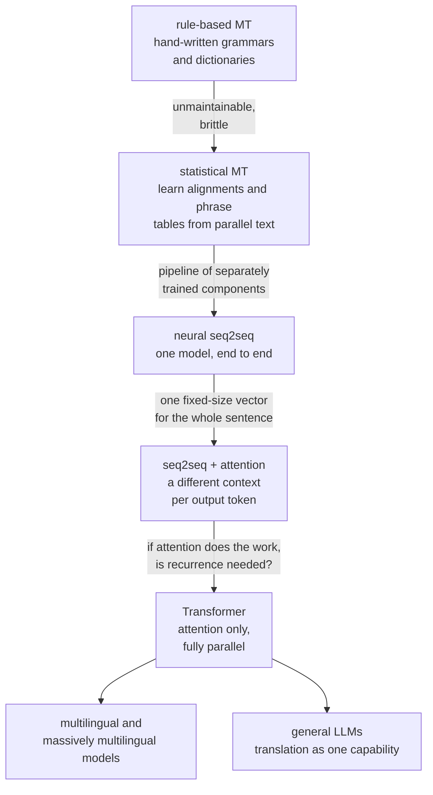

# Machine Translation

Machine translation drove more architectural innovation than any other NLP task.
Attention was invented for it. The transformer paper is a translation paper.
BLEU, back-translation, subword tokenization, and beam search all came from MT
and then spread everywhere. Understanding its arc is understanding how modern NLP
was built.

## The arc

## Statistical machine translation

The noisy-channel formulation: to translate source $f$ into target $e$,

$$\hat{e} = \arg\max_e P(e\mid f) = \arg\max_e P(f\mid e)\,P(e)$$

Two separately trained components: a **translation model** $P(f\mid e)$ learned
from parallel text, and a **language model** $P(e)$ learned from monolingual
target text. The language model is what makes the output fluent, and having it as
a separate component was a genuine strength — target-language monolingual data is
far more abundant than parallel data.

The IBM Models 1–5 introduced **word alignment** as a latent variable trained
with EM. Phrase-based SMT extended this to multi-word units, which handled
idioms and local reordering far better.

SMT's weaknesses were structural: a pipeline of separately-tuned components
(alignment, phrase extraction, reordering model, language model, tuning), an
enormous phrase table, and no ability to generalise beyond observed phrases.

## Neural machine translation

### Seq2seq and the bottleneck

An encoder RNN compresses the source into a vector; a decoder RNN generates the
target from it. Elegant, end-to-end, and limited by one thing: **everything the
decoder knows about the source passes through a single fixed-size vector.**
Translation quality fell off sharply beyond roughly 20 tokens.

### Attention

Instead of one context vector, compute a **different** weighted combination of
encoder states at each output step:

$$e_{tj} = a(\mathbf{s}_{t-1},\mathbf{h}_j), \qquad \alpha_{tj} = \mathrm{softmax}_j(e_{tj}), \qquad \mathbf{c}_t = \sum_j \alpha_{tj}\mathbf{h}_j$$

Bahdanau's additive scoring ($a = \mathbf{v}^\top\tanh(W[\mathbf{s};\mathbf{h}])$)
came first; Luong's multiplicative variant
($a = \mathbf{s}^\top W\mathbf{h}$) is cheaper and became standard.

The effect on long sentences was dramatic, and the attention weights turned out
to align roughly with word correspondences — giving a free, inspectable
soft-alignment matrix that SMT had needed a separate model to produce.

### Transformer

Then the obvious question: if attention does the work, is the recurrence needed?
"Attention Is All You Need" answered no, and the encoder–decoder transformer it
introduced remains the reference architecture for dedicated MT systems.

The decoder has **two** attention mechanisms: masked self-attention over the
target generated so far, and **cross-attention** over the encoder output. That
separation — self-attention for target fluency, cross-attention for source
fidelity — is the architectural expression of the noisy-channel decomposition.

## Data

Parallel corpora are the constraint.

| Source | Note |
|---|---|
| Europarl, UN corpus | high quality, formal register, limited domains |
| OPUS | an aggregation of many corpora |
| ParaCrawl, CCMatrix | web-mined; large and noisy |
| **Back-translation** | translate target-language monolingual text into the source, use the synthetic pair |
| Multilingual pivoting | translate via a high-resource language |
| LLM-generated pairs | increasingly viable, needs verification |

**Back-translation is the single most effective data technique in MT.** Take
abundant monolingual target text, translate it into the source with a
reverse-direction model, and train on the (synthetic source, real target) pair.
The target side is real and fluent, which is the side that matters for output
quality, and the noisy source side acts as a regulariser. It routinely adds
several BLEU points and is standard practice.

**Corpus filtering matters more than corpus size.** Web-mined parallel data is
full of misalignments, boilerplate, machine-translated text, and wrong-language
pairs. Filtering with a cross-lingual similarity model (LASER, LaBSE) before
training reliably improves quality despite reducing data volume.

## Multilingual translation

One model, many language pairs. Add a target-language tag to the input and share
all parameters.

| Effect | Direction |
|---|---|
| **Transfer to low-resource pairs** | strongly positive — related languages share representation |
| **Zero-shot translation** | possible between pairs never seen together in training |
| Parameter efficiency | one model instead of $N^2$ |
| **Capacity dilution** | negative for high-resource pairs — the "curse of multilinguality" |
| Vocabulary sharing | efficient for related scripts, wasteful across scripts |

The tension is real: adding languages helps the low-resource ones and hurts the
high-resource ones at fixed capacity. Mitigations are language-specific adapters,
mixture-of-experts routing, temperature-based sampling of the language mix, and
simply making the model bigger.

Massively multilingual models — mBART, M2M-100, NLLB-200 — cover 100–200
languages in one model, and NLLB explicitly targeted low-resource languages that
commercial systems ignore.

## LLMs as translators

General-purpose LLMs are now competitive with or better than dedicated MT systems
for high-resource pairs, and worse for low-resource ones.

| LLM advantage | Dedicated MT advantage |
|---|---|
| Document-level context and coherence | much lower cost per token |
| Follows style and terminology instructions | lower latency |
| Handles idioms and cultural adaptation better | better on low-resource pairs |
| Can explain choices, offer alternatives | deterministic and auditable |
| No per-pair model needed | smaller footprint |
| Better at register and formality control | — |

The most interesting LLM advantage is **document-level translation**: pronoun
resolution, consistent terminology, and register agreement across sentences all
require context that sentence-level MT systems structurally do not have.

## Evaluation

### BLEU

$$\mathrm{BLEU} = \mathrm{BP}\cdot\exp\left(\sum_{n=1}^{4}w_n\log p_n\right), \qquad \mathrm{BP} = \min\left(1, e^{1-r/c}\right)$$

Modified $n$-gram precision for $n = 1..4$, geometrically averaged, with a
**brevity penalty** because precision alone rewards short output.

The "modified" part matters: each $n$-gram's count is clipped at its maximum
count in the reference, so repeating "the the the the" cannot inflate unigram
precision.

**BLEU's problems**, and they are serious:

- No credit for synonyms or paraphrase — a perfect translation using different
  words scores poorly.
- No notion of meaning or grammaticality.
- Correlates weakly with human judgement at the sentence level.
- **Not comparable across papers** unless tokenisation, casing, and the number of
  references match. This is why **sacreBLEU** exists: it standardises
  tokenisation and emits a signature describing the configuration.
- Poor at distinguishing strong systems from each other, which is exactly the
  regime modern MT operates in.

Use sacreBLEU, always, and report the signature.

### The alternatives

| Metric | Type | Note |
|---|---|---|
| **chrF / chrF++** | character n-gram F-score | better for morphologically rich languages; no tokenisation dependence |
| TER | edit distance to the reference | interpretable as post-editing effort |
| METEOR | unigram matching with stems and synonyms | better sentence-level correlation |
| **BERTScore** | contextual embedding similarity | credits paraphrase |
| **COMET** | a trained neural metric using source, hypothesis, and reference | the current standard; much better human correlation |
| **COMET-QE / CometKiwi** | **reference-free** quality estimation | can score production output with no reference |
| BLEURT | trained regression metric | similar family to COMET |
| Human evaluation | direct assessment, MQM error annotation | the ground truth |

**COMET is the metric to use in 2026** for system comparison, and reference-free
quality estimation is the one that changes practice: it lets you score live
production translations, route low-confidence outputs to human review, and detect
degradation without maintaining a reference set.

**MQM** (multidimensional quality metrics) is the human protocol worth knowing:
annotators mark specific errors by category and severity rather than giving a
holistic score, which is far more reliable and more actionable.

## Decoding

| Strategy | Note |
|---|---|
| Greedy | fast, noticeably worse |
| **Beam search** | the standard; beam 4–5 |
| Length normalisation | essential — otherwise beam search prefers short output |
| Coverage penalty | discourages repeating or dropping source content |
| Minimum Bayes risk | pick the candidate most similar to other candidates under a metric |
| Sampling | for diversity; generally worse for translation |

**The beam search curse** is a genuinely surprising empirical fact: increasing
the beam beyond about 5 makes translations *worse* by BLEU, even though it finds
higher-probability sequences. The model's probability distribution and
translation quality diverge — larger beams find degenerate high-probability
outputs, typically too short or overly generic. It is a clean example of a model
whose objective and whose goal are not the same function.

**MBR decoding** attacks this directly: instead of maximising probability,
sample many candidates and pick the one with the highest average similarity to
the others under a metric like COMET. It consistently beats beam search when you
can afford the compute.

## Practical deployment

| Concern | Handling |
|---|---|
| **Terminology control** | constrained decoding, terminology injection, or a glossary in the prompt |
| Formatting and tags | protect HTML/XML/placeholders from being translated or reordered |
| Numbers, dates, units | locale-aware formatting; MT models get these wrong |
| Named entities | should usually pass through untranslated; entity-aware handling |
| Domain adaptation | fine-tune on in-domain parallel data; even a few thousand pairs helps a lot |
| Quality estimation | route low-confidence segments to human post-editing |
| Translation memory | reuse exact and fuzzy matches from previous translations |
| Latency | distil to a smaller model; quantise; batch |
| Gender and bias | "the doctor" defaults to masculine in many target languages; provide alternatives or context |

**Terminology control is the most common enterprise requirement** and the one
generic systems handle worst. A pharmaceutical company needs a drug name rendered
exactly one way, every time. Constrained decoding that forces specified target
strings is the reliable solution; prompt-based glossaries with an LLM work but
are not guaranteed.

**Gender bias in translation is well documented and structural.** Translating
from a gender-neutral language into a gendered one forces a choice, and the model
makes it from training-data statistics — nurses become feminine, engineers
masculine. Serious systems detect the ambiguity and offer both, which is what
Google Translate does for short queries.

## Related generation tasks

The same encoder–decoder machinery, different data:

| Task | Note |
|---|---|
| **Summarisation** | extractive (select sentences) or abstractive (generate); faithfulness is the hard problem |
| Paraphrasing | often trained via round-trip translation |
| Grammatical error correction | monolingual "translation" from erroneous to correct |
| Style transfer | formality, simplification, register |
| Data-to-text | tables or knowledge graphs to prose |
| Simplification | for accessibility or reading level |

**Summarisation's central difficulty is faithfulness**, not fluency. Abstractive
models produce readable summaries containing facts absent from the source. The
countermeasures — entailment-based faithfulness metrics, question-answering
consistency checks, and explicit grounding — matter more than any ROUGE
improvement, because a fluent unfaithful summary is worse than a clumsy faithful
one.

## Self-check

1. What was the seq2seq bottleneck, and how did attention remove it?
2. Why does the transformer decoder need two attention mechanisms?
3. Explain back-translation and why the synthetic data goes on the source side.
4. Give three reasons BLEU is a poor metric, and name the current alternative.
5. What is the beam search curse, and what does it reveal about the objective?
6. What is the curse of multilinguality, and what mitigates it?
7. Why is terminology control hard, and what is the reliable solution?

## Where to go next

- [Text Generation & Decoding](./text-generation-and-decoding.md) — decoding
  strategies in depth.
- [NLP Evaluation](./nlp-evaluation.md) — BLEU, ROUGE, BERTScore, COMET, and
  LLM judges.
- [Language Models](./language-models.md) — the models doing the translating now.
