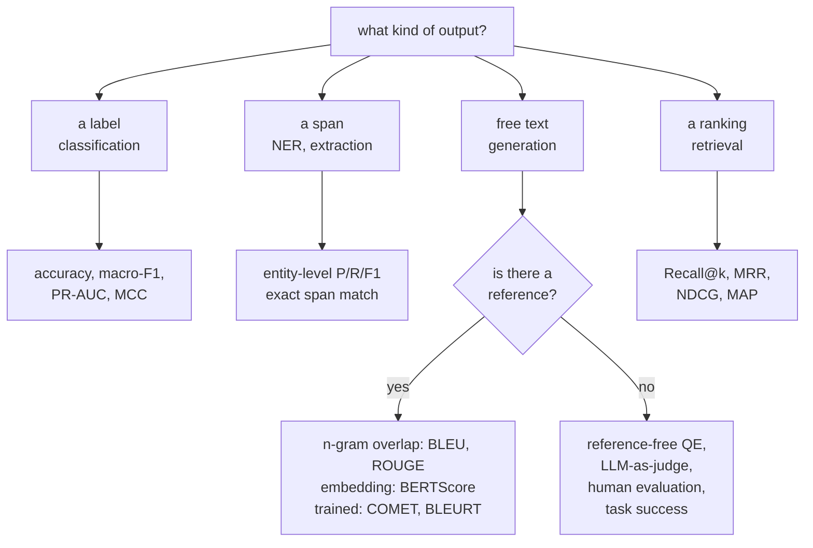

# NLP Evaluation

Evaluating text is harder than evaluating numbers because there is rarely one
correct output. Two translations can both be perfect and share no words. A
summary can be fluent, well-formed, and contain a fact absent from the source.
This page covers the metrics, what each actually measures, and how to build an
evaluation you would defend.

## The taxonomy



## Classification and labelling

Covered in depth on the [text classification](./text-classification.md) page; the
essentials:

| Metric | When |
|---|---|
| Accuracy | balanced classes, equal error costs |
| **Macro-F1** | imbalanced multiclass — every class counts equally |
| Weighted F1 | when class volume should count |
| PR-AUC | imbalanced binary, threshold-free |
| MCC | one balanced number using all four confusion cells |
| Cohen's $\kappa$ | agreement above chance; comparable to annotator agreement |

For **sequence labelling**, score **entities, not tokens**. With 95% `O` tags,
token accuracy of 95% means finding nothing. Use `seqeval`, require exact span
and type match, and report per-type numbers.

## Generation with references

### BLEU

Modified $n$-gram precision for $n=1..4$, geometrically averaged, times a brevity
penalty. Precision-oriented: it asks how much of the output appears in the
reference.

Its problems are structural: no credit for synonyms or paraphrase, no notion of
grammaticality, weak sentence-level correlation with human judgement, and — most
practically — **incomparable across papers** unless tokenisation, casing, and
reference count match.

**Use sacreBLEU and report its signature.** That is the whole fix for the
comparability problem and it costs nothing.

### ROUGE

Recall-oriented, designed for summarisation:

| Variant | Measures |
|---|---|
| ROUGE-N | $n$-gram recall |
| **ROUGE-L** | longest common subsequence — order-sensitive without requiring contiguity |
| ROUGE-W | weighted LCS, favouring consecutive matches |
| ROUGE-S | skip-bigram co-occurrence |

ROUGE inherits every one of BLEU's weaknesses. A summary that captures the
meaning in different words scores poorly; a summary that copies sentences
verbatim scores well. **This directly biases the field toward extractive
summarisation**, and it is a good illustration of a metric shaping research.

### Embedding and trained metrics

| Metric | Mechanism |
|---|---|
| **BERTScore** | greedy token matching by contextual embedding similarity; precision, recall, F1 |
| MoverScore | earth-mover distance between embedding distributions |
| **BLEURT** | a trained regression model fine-tuned on human ratings |
| **COMET** | trained on human judgements using **source, hypothesis, and reference** |
| **COMET-QE / CometKiwi** | **reference-free** quality estimation |
| BARTScore | probability of generating the reference under a seq2seq model |

**COMET is the current standard for translation** and correlates far better with
human judgement than BLEU. Reference-free quality estimation is the one that
changes practice: it lets you score live production output with no reference,
route low-confidence segments to human review, and detect degradation
continuously.

### Comparison

| Metric | Type | Catches paraphrase | Needs a reference | Human correlation |
|---|---|---|---|---|
| BLEU | $n$-gram precision | no | yes | weak |
| ROUGE | $n$-gram recall | no | yes | weak |
| chrF | character $n$-gram F | partly | yes | moderate |
| METEOR | matching with stems/synonyms | partly | yes | moderate |
| BERTScore | embedding similarity | **yes** | yes | good |
| **COMET** | trained neural | **yes** | yes | **best** |
| COMET-QE | trained neural | **yes** | **no** | good |
| LLM judge | prompted model | **yes** | optional | good, with biases |
| Human | — | yes | no | the ground truth |

## Task-specific metrics

| Task | Metric |
|---|---|
| Question answering (extractive) | exact match, token-F1 |
| QA (generative) | LLM judge, or answer equivalence |
| **Summarisation faithfulness** | entailment-based (SummaC, FactCC), QA-based (QAGS, QuestEval) |
| Dialogue | task success, turn-level appropriateness, human preference |
| Code | **pass@k** — execution against unit tests |
| Reasoning | final-answer accuracy, step-level correctness |
| ASR | WER, CER |
| TTS | MOS, and the WER of an ASR system on the synthesised audio |
| Retrieval | Recall@k, MRR, NDCG |
| RAG | faithfulness, answer relevance, context relevance, citation accuracy |

**pass@k is the metric that got generation evaluation right.** For code, do not
compare strings — **run the tests**. It is objective, it credits any correct
solution regardless of style, and it is exactly what the user cares about. The
unbiased estimator from $n \ge k$ samples:

$$\mathrm{pass@}k = \mathbb{E}\left[1 - \frac{\binom{n-c}{k}}{\binom{n}{k}}\right]$$

where $c$ is the number of correct samples. The lesson generalises: **wherever
you can verify the output programmatically, do that instead of comparing text.**

**Summarisation faithfulness deserves its own measurement.** ROUGE cannot detect
a hallucinated fact — a summary can score well while asserting something the
source never said. Entailment-based metrics check whether each summary sentence
is entailed by the source; QA-based metrics generate questions from the summary
and check that the source answers them the same way.

## LLM as judge

Prompt a strong model to evaluate outputs. Scalable, cheap relative to humans,
and correlates reasonably with human preference — with well-documented biases.

| Bias | Effect | Correction |
|---|---|---|
| **Position** | prefers the first (or second) option | swap the order and average |
| **Verbosity** | prefers longer answers | control for length; instruct explicitly |
| **Self-preference** | favours its own family's style | use a different judge family; use several |
| Style over substance | prefers confident, well-formatted answers | rubric with explicit criteria |
| Score compression | clusters at 7–8 out of 10 | use **pairwise comparison** instead of absolute scores |
| Sycophancy | agrees with the prompt's framing | avoid leading questions |
| Anchoring | influenced by an example score | randomise or omit |

**Pairwise comparison with position swapping is the reliable protocol.** Absolute
1–10 scoring from an LLM is noisy and compressed; "which of these two is better,
and why" is far more consistent. Run both orders and count a win only when both
agree; disagreements are ties.

```
Rate on: (1) factual accuracy against the source, (2) completeness,
(3) conciseness. For each, give a score 1-5 and one sentence of
justification citing specific text. Then give an overall verdict.

Source: {source}
Response A: {a}
Response B: {b}
```

A detailed rubric with required justification substantially improves judge
reliability over "rate this 1-10", because it forces the model to attend to
specific criteria rather than overall impression.

**Validate your judge against human labels.** Score 100 examples both ways and
measure agreement. If judge–human agreement is no better than human–human
agreement, the judge is usable. If it is much worse, fix the rubric before
trusting any judged number.

## Benchmarks and their problems

| Benchmark | Measures |
|---|---|
| GLUE / SuperGLUE | general language understanding — largely saturated |
| **MMLU / MMLU-Pro** | broad knowledge across 57 subjects |
| GSM8K / MATH | mathematical reasoning |
| HumanEval / MBPP / SWE-bench | code generation and repository-level fixes |
| HellaSwag, ARC, WinoGrande | commonsense reasoning |
| TruthfulQA | resistance to common misconceptions |
| BIG-bench / BBH | diverse hard tasks |
| **MTEB** | embedding quality across many task types |
| Chatbot Arena | human pairwise preference, Elo-ranked |
| GPQA, FrontierMath | deliberately contamination-resistant, expert-level |

### Contamination

**Assume every public benchmark is in the training data of any model trained on
the web.** Test sets are on GitHub, in papers, on Hugging Face, and in scraped
forum discussions.

| Detection | Method |
|---|---|
| N-gram overlap | search the training corpus for test strings — only possible with open data |
| Perplexity gap | anomalously low perplexity on test items |
| Canary strings | deliberately inserted markers |
| Ordering sensitivity | a contaminated model does better on the original order than a shuffled one |
| Held-out variants | GSM1k-style regenerated problems reveal inflated scores |

The practical response is not to abandon benchmarks but to weight them
correctly: **a private evaluation set drawn from your own distribution is worth
more than any public leaderboard position.** Public benchmarks are useful for
coarse comparison and for detecting gross regressions; they are not evidence
about your application.

### Other benchmark problems

- **Saturation.** Once a benchmark is near-solved, differences are noise.
- **Construct validity.** MMLU measures multiple-choice recall, not
  understanding.
- **Format sensitivity.** Reported scores vary by several points with the prompt
  template, the answer-extraction regex, and few-shot ordering.
- **Metric artefacts.** Discontinuous metrics create apparent "emergence" where
  the underlying improvement is smooth.
- **Cherry-picking.** Nobody reports the benchmarks their model does badly on.

## Statistical rigour

| Practice | Why |
|---|---|
| **Confidence intervals** | a 1-point difference on 500 examples is noise |
| **Paired tests** | McNemar for classification, paired bootstrap for anything else |
| Multiple seeds | seed variance often exceeds the claimed improvement |
| Multiple prompts | format sensitivity is large; report a distribution |
| Multiple samples | for stochastic generation, report mean and variance |
| Correct for multiple comparisons | 20 benchmarks at $\alpha = 0.05$ gives a 64% chance of a false positive |

**Test-set sizing**, worst-case 95% half-width for a proportion:

| $n$ | Half-width |
|---|---|
| 100 | ±9.8 pts |
| 500 | ±4.4 pts |
| 1,000 | ±3.1 pts |
| 10,000 | ±1.0 pt |

Most published NLP improvements of under one point on a thousand-example test set
are not distinguishable from noise, and the paired bootstrap is the two-line fix.

## Human evaluation

Still the ground truth for open-ended generation.

| Protocol | Note |
|---|---|
| **Pairwise comparison** | most reliable; humans compare better than they rate |
| Likert scales | familiar, but rater-dependent and compressed |
| **Best–worst scaling** | more reliable than Likert for the same annotation cost |
| **MQM error annotation** | mark specific errors by category and severity — reliable and actionable |
| Task success | did the user achieve their goal? the only metric that fully matters |
| A/B testing | real users, real behaviour, real stakes |

| Requirement | Detail |
|---|---|
| Clear guidelines with examples | especially of edge cases |
| **Inter-annotator agreement** | Cohen's/Fleiss' $\kappa$; below ~0.6 means the task is underspecified |
| Randomised presentation order | removes position bias |
| Attention checks | detect inattentive annotators |
| Multiple annotators per item | 3 is a common minimum |
| Fair pay and reasonable workload | quality tracks conditions |

**Measure inter-annotator agreement first.** If humans agree only 70% of the
time, a model at 70% is at the ceiling and further optimisation is measuring
noise. This single number reframes many "the model is not good enough"
conversations.

## Building an evaluation you can trust

1. **Define success from the decision** the output informs, not from a metric
   catalogue.
2. **Build a golden set** — 50–500 real examples from your distribution, with
   known good outputs.
3. **Establish a baseline** — the current system, a simple heuristic, or human
   performance.
4. **Automate what you can** — execution tests, schema validation, regex checks,
   entailment scoring.
5. **Use LLM judges for the rest**, validated against a human-labelled subset.
6. **Slice the results** — by input type, length, language, difficulty, user
   segment.
7. **Report intervals**, not point estimates.
8. **Version the evaluation** alongside the model and prompts, and run it in CI.
9. **Read the failures** — 50 by hand, every time.
10. **Monitor in production** — offline metrics predict production quality
    imperfectly.

**The golden set is the highest-leverage artefact in an LLM project.** It turns
every prompt tweak, model swap, and retrieval change from an argument into a
measurement, and it takes an afternoon to build.

## Self-check

1. Why does ROUGE bias the field toward extractive summarisation?
2. Give three reasons a BLEU comparison between two papers may be meaningless.
3. What does pass@k do that string comparison cannot, and what generalises from
   it?
4. Name four LLM-judge biases and the correction for each.
5. Why is macro-F1 preferred to accuracy on imbalanced multiclass?
6. Your model scores 84.2% and a rival 85.0% on 500 examples. What do you do?
7. Why measure inter-annotator agreement before optimising a model?

## Where to go next

- [Text Classification](./text-classification.md) — classification metrics in
  context.
- [Machine Translation](./machine-translation.md) — BLEU, COMET, and MT
  evaluation.
- [RAG & Retrieval](./rag-and-retrieval.md) — stage-wise evaluation of a
  retrieval system.
