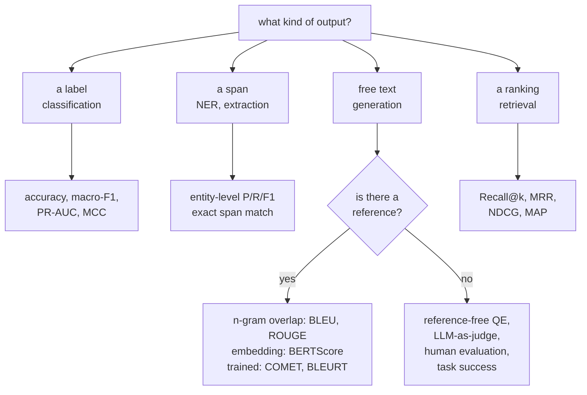

# NLP Evaluation

Evaluating text is harder than evaluating numbers because there is rarely one
correct output. Two translations can both be perfect and share no words. A
summary can be fluent, well-formed, and contain a fact absent from the source.
This page covers the metrics, what each actually measures, and how to build an
evaluation you would defend.

## The taxonomy



## Classification and labelling

Covered in depth on the [text classification](./text-classification.md) page; the
essentials:

| Metric | When |
|---|---|
| Accuracy | balanced classes, equal error costs |
| **Macro-F1** | imbalanced multiclass — every class counts equally |
| Weighted F1 | when class volume should count |
| PR-AUC | imbalanced binary, threshold-free |
| MCC | one balanced number using all four confusion cells |
| Cohen's $\kappa$ | agreement above chance; comparable to annotator agreement |

For **sequence labelling**, score **entities, not tokens**. With 95% `O` tags,
token accuracy of 95% means finding nothing. Use `seqeval`, require exact span
and type match, and report per-type numbers.

## Generation with references

### BLEU

Modified $n$-gram precision for $n=1..4$, geometrically averaged, times a brevity
penalty. Precision-oriented: it asks how much of the output appears in the
reference.

Its problems are structural: no credit for synonyms or paraphrase, no notion of
grammaticality, weak sentence-level correlation with human judgement, and — most
practically — **incomparable across papers** unless tokenisation, casing, and
reference count match.

**Use sacreBLEU and report its signature.** That is the whole fix for the
comparability problem and it costs nothing.

### ROUGE

Recall-oriented, designed for summarisation:

| Variant | Measures |
|---|---|
| ROUGE-N | overlapping $n$-grams; implementations may report precision, recall, and F1, so name the statistic |
| **ROUGE-L** | longest common subsequence — order-sensitive without requiring contiguity |
| ROUGE-W | weighted LCS, favouring consecutive matches |
| ROUGE-S | skip-bigram co-occurrence |

ROUGE inherits every one of BLEU's weaknesses. A summary that captures the
meaning in different words scores poorly; a summary that copies sentences
verbatim scores well. **This directly biases the field toward extractive
summarisation**, and it is a good illustration of a metric shaping research.

### Embedding and trained metrics

| Metric | Mechanism |
|---|---|
| **BERTScore** | greedy token matching by contextual embedding similarity; precision, recall, F1 |
| MoverScore | earth-mover distance between embedding distributions |
| **BLEURT** | a trained regression model fine-tuned on human ratings |
| **COMET** | trained on human judgements using **source, hypothesis, and reference** |
| **COMET-QE / CometKiwi** | **reference-free** quality estimation |
| BARTScore | seq2seq conditional log-likelihood; source-to-hypothesis, reference-to-hypothesis, and other directions measure different properties |

**COMET is widely used for translation**, with correlations depending on its
checkpoint, language, domain, and human evaluation. Reference-free quality estimation
changes practice: it lets you score live production output with no reference,
route low-confidence segments to human review, and detect degradation
continuously.

### Comparison

| Metric | Type | Catches paraphrase | Needs a reference | Human correlation |
|---|---|---|---|---|
| BLEU | $n$-gram precision | no | yes | weak |
| ROUGE | $n$-gram recall | no | yes | weak |
| chrF | character $n$-gram F | partly | yes | moderate |
| METEOR | matching with stems/synonyms | partly | yes | moderate |
| BERTScore | embedding similarity | **yes** | yes | good |
| **COMET** | trained neural | **yes** | yes for reference-based variants | checkpoint- and evaluation-dependent |
| COMET-QE | trained neural | **yes** | **no** | good |
| LLM judge | prompted model | **yes** | optional | good, with biases |
| Human | — | yes | not always | expertise, rubric, and agreement determine reliability |

## Task-specific metrics

| Task | Metric |
|---|---|
| Question answering (extractive) | exact match, token-F1 |
| QA (generative) | LLM judge, or answer equivalence |
| **Summarisation faithfulness** | entailment-based (SummaC, FactCC), QA-based (QAGS, QuestEval) |
| Dialogue | task success, turn-level appropriateness, human preference |
| Code | **pass@k** — execution against unit tests |
| Reasoning | final-answer accuracy, step-level correctness |
| ASR | WER, CER |
| TTS | MOS, and the WER of an ASR system on the synthesised audio |
| Retrieval | Recall@k, MRR, NDCG |
| RAG | faithfulness, answer relevance, context relevance, citation accuracy |

**pass@k measures test-passing coverage, not proof of correctness.** Execute
untrusted generated code only in a sandbox with resource, filesystem, and network
restrictions. Incomplete tests can accept incorrect or malicious solutions.
Under the standard independent sampling protocol, the estimator from $n\ge k$ samples is:

$$\mathrm{pass@}k = \mathbb{E}\left[1 - \frac{\binom{n-c}{k}}{\binom{n}{k}}\right]$$

where $c$ is the number of samples passing the specified tests. The lesson generalises: **wherever
you can verify the output programmatically, do that instead of comparing text.**

**Summarisation faithfulness deserves its own measurement.** ROUGE cannot detect
a hallucinated fact — a summary can score well while asserting something the
source never said. Entailment-based metrics check whether each summary sentence
is entailed by the source; QA-based metrics generate questions from the summary
and check that the source answers them the same way.

## LLM as judge

Prompt a strong model to evaluate outputs. Scalable, cheap relative to humans,
and correlates reasonably with human preference — with well-documented biases.

| Bias | Effect | Correction |
|---|---|---|
| **Position** | prefers the first (or second) option | swap the order and average |
| **Verbosity** | prefers longer answers | control for length; instruct explicitly |
| **Self-preference** | favours its own family's style | use a different judge family; use several |
| Style over substance | prefers confident, well-formatted answers | rubric with explicit criteria |
| Score compression | clusters at 7–8 out of 10 | use **pairwise comparison** instead of absolute scores |
| Sycophancy | agrees with the prompt's framing | avoid leading questions |
| Anchoring | influenced by an example score | randomise or omit |

**Pairwise comparison with position swapping is the reliable protocol.** Absolute
1–10 scoring from an LLM is noisy and compressed; "which of these two is better,
and why" is far more consistent. Run both orders and count a win only when both
agree; disagreements are ties.

```
Rate on: (1) factual accuracy against the source, (2) completeness,
(3) conciseness. For each, give a score 1-5 and one sentence of
justification citing specific text. Then give an overall verdict.

Source: {source}
Response A: {a}
Response B: {b}
```

A detailed rubric with required justification substantially improves judge
reliability over "rate this 1-10", because it forces the model to attend to
specific criteria rather than overall impression.

**Validate your judge against human labels.** Score 100 examples both ways and
measure agreement with intervals and per-error-category confusion rates. Agreement
approaching a relevant human-human baseline is encouraging, not sufficient for
deployment. Check costly false accepts, subgroup errors, and calibration against
adjudicated labels; low or high aggregate agreement alone does not decide usability.

## Benchmarks and their problems

| Benchmark | Measures |
|---|---|
| GLUE / SuperGLUE | general language understanding — largely saturated |
| **MMLU / MMLU-Pro** | MMLU has 57 subjects; MMLU-Pro groups its more demanding questions into 14 broad categories |
| GSM8K / MATH | mathematical reasoning |
| HumanEval / MBPP / SWE-bench | code generation and repository-level fixes |
| HellaSwag, ARC, WinoGrande | commonsense reasoning |
| TruthfulQA | resistance to common misconceptions |
| BIG-bench / BBH | diverse hard tasks |
| **MTEB** | embedding quality across many task types |
| Chatbot Arena | human pairwise preference, Elo-ranked |
| GPQA, FrontierMath | deliberately contamination-resistant, expert-level |

### Contamination

**Assume every public benchmark is in the training data of any model trained on
the web.** Test sets are on GitHub, in papers, on Hugging Face, and in scraped
forum discussions.

| Detection | Method |
|---|---|
| N-gram overlap | search the training corpus for test strings — only possible with open data |
| Perplexity gap | anomalously low perplexity on test items |
| Canary strings | deliberately inserted markers |
| Ordering sensitivity | a contaminated model does better on the original order than a shuffled one |
| Held-out variants | GSM1k-style regenerated problems reveal inflated scores |

The practical response is not to abandon benchmarks but to weight them
correctly: **a private evaluation set drawn from your own distribution is worth
more than any public leaderboard position.** Public benchmarks are useful for
coarse comparison and for detecting gross regressions; they are not evidence
about your application.

### Other benchmark problems

- **Saturation.** Once a benchmark is near-solved, differences are noise.
- **Construct validity.** MMLU measures multiple-choice recall, not
  understanding.
- **Format sensitivity.** Reported scores vary by several points with the prompt
  template, the answer-extraction regex, and few-shot ordering.
- **Metric artefacts.** Discontinuous metrics create apparent "emergence" where
  the underlying improvement is smooth.
- **Cherry-picking.** Nobody reports the benchmarks their model does badly on.

## Statistical rigour

| Practice | Why |
|---|---|
| **Confidence intervals** | uncertainty in a difference depends on paired outcomes, not just sample count and marginal scores |
| **Paired tests** | McNemar for classification, paired bootstrap for anything else |
| Multiple seeds | seed variance often exceeds the claimed improvement |
| Multiple prompts | format sensitivity is large; report a distribution |
| Multiple samples | for stochastic generation, report mean and variance |
| Correct for multiple comparisons | for 20 independent true-null tests each at $\alpha=0.05$, probability of at least one false positive is $1-0.95^{20}\approx64\%$; dependence changes this calculation |

**Test-set sizing**, worst-case 95% half-width for a proportion:

| $n$ | Half-width |
|---|---|
| 100 | ±9.8 pts |
| 500 | ±4.4 pts |
| 1,000 | ±3.1 pts |
| 10,000 | ±1.0 pt |

These half-widths are normal-approximation bounds for a single binomial
proportion near 0.5, not confidence intervals for paired model differences.
Use paired outcomes and match resampling units to independent users/documents.
A bootstrap estimates uncertainty; it does not remove selection bias or turn
an underpowered experiment into a conclusive one.

## Human evaluation

Often the most relevant reference for open-ended generation, but itself noisy
and dependent on expertise, incentives, and the rubric.

| Protocol | Note |
|---|---|
| **Pairwise comparison** | most reliable; humans compare better than they rate |
| Likert scales | familiar, but rater-dependent and compressed |
| **Best–worst scaling** | more reliable than Likert for the same annotation cost |
| **MQM error annotation** | mark specific errors by category and severity — reliable and actionable |
| Task success | did the user achieve their goal? the only metric that fully matters |
| A/B testing | real users, real behaviour, real stakes |

| Requirement | Detail |
|---|---|
| Clear guidelines with examples | especially of edge cases |
| **Inter-annotator agreement** | Cohen's/Fleiss' $\kappa$; interpret prevalence, rater differences, and rubric ambiguity, not a universal 0.6 cutoff |
| Randomised presentation order | removes position bias |
| Attention checks | detect inattentive annotators |
| Multiple annotators per item | 3 is a common minimum |
| Fair pay and reasonable workload | quality tracks conditions |

**Measure inter-annotator agreement first**, but do not treat pairwise agreement
as a hard accuracy ceiling. A model can agree with adjudicated consensus more
often than two noisy individual raters agree with each other. Inspect ambiguity,
systematic rater bias, and the target definition before interpreting the number.

## Building an evaluation you can trust

1. **Define success from the decision** the output informs, not from a metric
   catalogue.
2. **Build a golden set** — 50–500 real examples from your distribution, with
   known good outputs.
3. **Establish a baseline** — the current system, a simple heuristic, or human
   performance.
4. **Automate what you can** — execution tests, schema validation, regex checks,
   entailment scoring.
5. **Use LLM judges for the rest**, validated against a human-labelled subset.
6. **Slice the results** — by input type, length, language, difficulty, user
   segment.
7. **Report intervals**, not point estimates.
8. **Version the evaluation** alongside the model and prompts, and run it in CI.
9. **Read the failures** — 50 by hand, every time.
10. **Monitor in production** — offline metrics predict production quality
    imperfectly.

**The golden set is the highest-leverage artefact in an LLM project.** It turns
every prompt tweak, model swap, and retrieval change from an argument into a
measurement, and it takes an afternoon to build.

### An evaluation manifest you can execute

The [text-artifact capstone](../libraries/mlops-and-serving.md#capstone-train-package-reload-serve)
writes the concrete records behind an evaluation claim: hashed dataset bytes,
fixed group-level split membership, every development candidate, selected
hyperparameters, a final per-class report, confusion-matrix counts, runtime and
schema versions, and ordered prediction fixtures. Tests check that reloading and
serving preserve the same probabilities. Its symmetric synthetic templates make
development and test scores identical; that is explicitly a workflow fixture,
not an independent demonstration of task generalization.

On real data, extend the manifest with annotation revisions, document provenance,
deduplication policy, subgroup counts, abstention decisions, and uncertainty at
the appropriate sampling unit. Use a newly held-out collection when repeated
decisions have made the old test set part of development. Artifact reproducibility
and evaluation validity are different obligations; neither replaces the other.

## Practical lab: calibration, abstention, and uncertainty

The artifact capstone establishes that the same classifier survives packaging
and serving. This extension asks a different question: **which predictions
should an operational policy accept, and what evidence supports that decision?**
It reuses the capstone's TF-IDF/logistic-regression pipeline. The new work is a
chronological split contract, separate calibration and policy-development sets,
a cost-sensitive abstention rule, and group-level uncertainty for a frozen policy.

**Downloads:** [evaluation protocol](/assets/examples/evaluation_protocol.py),
[shared classifier module](/assets/examples/artifact_capstone.py), and
[environment requirements](/assets/examples/requirements-artifact-capstone.txt).
Keep both Python modules in the same directory. The protocol does not start a
server, deserialize an artifact, or download a model or corpus.

```bash
python3.11 -m venv .venv
.venv/bin/python -m pip install -r requirements-artifact-capstone.txt
.venv/bin/python evaluation_protocol.py --output fixture-evaluation.json
```

The default corpus contains 72 explicitly synthetic support messages, two per
incident group, with controlled ambiguous messages in the later windows. These
are a mechanics fixture, not samples from an observed customer population. The
report refuses to overwrite an existing file so separate experiments retain
separate evidence. No fixture result establishes production quality.

### Four datasets, four different decisions

| Partition | Default rows / groups | What may be learned here | What must remain frozen |
|---|---|---|---|
| Training | 36 / 18 | TF-IDF vocabulary, document frequencies, classifier weights | Regularization is prespecified as C = 2 |
| Calibration | 12 / 6 | One temperature minimizing negative log likelihood | Vocabulary, classifier, class ordering |
| Policy development | 12 / 6 | Confidence threshold minimizing prespecified cost | Model and temperature |
| Final test | 12 / 6 | Nothing; compute reports and intervals only | Entire prediction and decision policy |

The calibration and policy partitions are both development data, but serve
different roles. Using the same tiny set for both would make policy performance
more optimistic after two rounds of fitting. This four-way design is simple to
audit, although expensive in scarce labels. Cross-fitting can use limited data
more efficiently; preserve the same separation for each out-of-fold prediction
and still reserve a final untouched evaluation.

Training hyperparameters are fixed in this extension. To tune C, features, or
model family, add training-only inner validation with group/time boundaries.
After a train-plus-development refit, the old temperature and threshold are not
automatically valid for the new model: obtain out-of-sample calibration/policy
evidence again. [Scikit-learn's calibration guidance](https://scikit-learn.org/stable/modules/calibration.html)
explains why classifier fitting and calibration fitting require separate data.

### Time and related-document boundaries

The CSV adapter requires `id`, `group`, `text`, `label`, and `timestamp` columns.
An ID identifies one row; a group identifies the unit that must not leak across
partitions, such as an incident, conversation, document family, or customer.
Timestamps must have an explicit UTC offset and are normalized to UTC. With
cutoffs A, B, and C, the windows are:

- Training: timestamp before A.
- Calibration: A included, B excluded.
- Policy development: B included, C excluded.
- Test: C and later.

**A group spanning a boundary is purged in its entirety.** Assigning a straddling
group to its first window lets later messages enter earlier training. Moving it
to its last window can invalidate the intended chronology of evaluation.
Purging is conservative but has a cost: long-running incidents may disappear
disproportionately. Compare their duration, class, and customer mix with retained
data. The script records purged group IDs and rejects empty retained partitions.

This is not a universal split recipe. A customer-level group may span years and
purge most data; a conversation-level group may still leak customer templates.
Predicting future messages from existing customers is a different generalization
claim from predicting messages from entirely unseen customers. A time split
alone does not enforce group independence, and a group split alone does not
enforce chronology. See the distinctions in
[scikit-learn's cross-validation documentation](https://scikit-learn.org/stable/modules/cross_validation.html).

The loader rejects duplicate row IDs and normalized exact text appearing in
different groups. Normalization is case-folding plus whitespace collapse, not
semantic deduplication. Near duplicates, quotations, shared templates, and
translated copies still need a corpus-specific audit. Reconcile duplicate groups
before splitting; never inspect test labels to decide which examples to discard.
The fixture's unique marker tokens let tests confirm that held-out markers are
absent from the fitted training vocabulary.

Timestamps must represent information available at the deployment decision. If
a label is adjudicated weeks after a message arrives, training at cutoff A cannot
use that label just because the message preceded A. This adapter has one timestamp:
enforce label-availability constraints upstream or extend the schema with separate
event and label-availability times. Group purging does not solve delayed-label
leakage or supply a temporal embargo for near-neighbor dependence.

### Temperature scaling and probability diagnostics

For class probabilities p and positive temperature T, the implementation uses:

$$
q_k(T) = \frac{\exp(\log p_k / T)}{\sum_j \exp(\log p_j / T)}.
$$

For a softmax classifier this is equivalent to scaling logits because the shared
log-normalization constant cancels. The script clips probabilities for numerical
stability and uses a stable softmax. Positive temperature preserves the winning
class except for numerical ties. T above one softens the distribution; T below
one sharpens it. Calibration can therefore change confidence and abstention
without improving closed-set accuracy.

A calibration-only bounded search minimizes mean negative log likelihood for
temperatures from 0.1 to 10, with T = 1 as an explicit fallback. These bounds are
experimental choices, not a guarantee of correct calibration. A boundary solution,
tiny calibration set, or new label distribution is a reason to investigate.
Missing classes in a held-out window are allowed and visible in class counts;
their calibration cannot be certified by that window. Labels absent from training
are rejected because this is a closed-set classifier.

The final report includes before/after log loss, a multiclass Brier score using
the **sum over classes**, and ten equal-width top-label reliability bins. Each bin
records count, mean confidence, and accuracy. Empty bins have null statistics,
not zero accuracy. Top-label ECE is the count-weighted absolute gap between bin
confidence and accuracy. Class ordering is explicit throughout the report.

ECE depends on bin boundaries and sample size; top-label ECE also misses errors
in non-winning probabilities. The Brier sum convention matters because other
implementations divide by class count. Inspect proper scoring rules, reliability
counts, and per-class behavior together. Temperature fitting may worsen test loss
under sampling noise or drift; the report shows the outcome rather than asserting
improvement.

### Worked decision: coverage, risk, and review cost

A threshold accepts an item when its calibrated maximum probability is at least
that threshold. Coverage is the accepted fraction. Selective risk is the error
fraction **among accepted items**, not among all items. The objective is:

$$
\widehat{C}(\tau) =
\frac{c_e\,N_{\text{accepted errors}}(\tau)
      + c_r\,N_{\text{reviewed}}(\tau)}{N}.
$$

Correct accepted items have zero modeled cost. Suppose an incorrect automated
decision costs 1 and a review costs 0.2. Four development predictions have
confidences 0.95, 0.80, 0.60, and 0.55; the first two are correct and the last two
are wrong:

| Threshold | Accepted | Coverage | Selective risk | Mean cost |
|---|---|---|---|---|
| Accept all | 4 | 1.00 | 0.50 | 0.50 |
| 0.60 | 3 | 0.75 | 1/3 | 0.30 |
| 0.80 | 2 | 0.50 | 0.00 | 0.10 |
| 0.95 | 1 | 0.25 | 0.00 | 0.15 |
| Reject all | 0 | 0.00 | Undefined | 0.20 |

The selected threshold is 0.80. Rejecting everything has no selective-risk
estimate, not a perfect zero error rate; the implementation writes `null`.
It enumerates distinct confidence breakpoints, accept-all, and reject-all,
treating tied confidences together. Equal-cost policies prefer higher coverage,
then smaller thresholds. `--min-coverage` restricts development choices; it does
not guarantee coverage under future shift.

For genuinely calibrated probabilities and uniform costs, comparing expected
accepted-error cost with review cost suggests accepting when
`error_cost * (1 - confidence) <= review_cost`. The empirical search instead
measures cost on labeled policy-development data. Neither approach captures
per-class harm, reviewer mistakes, delayed reviews, queue capacity, or unknown
classes. A cost matrix and capacity constraints change the decision rule.
Confidently wrong out-of-domain inputs may pass; evaluate them separately.

### Group bootstrap: what the interval means

The model, temperature, and threshold are frozen before test predictions are
scored. Each replicate samples test **groups** with replacement, keeps every row
in each sampled group, and recomputes coverage, risk, and cost. Repeated groups
repeat all their rows. Endpoints are the 2.5th and 97.5th percentiles, with the
replicate count and random seed recorded.

The statistic is pooled-row performance: large conversations contribute more
messages than small conversations. It is not an equally weighted average of
per-conversation metrics. Choose the estimand before seeing results. If a
replicate accepts no rows, its risk is undefined and omitted from risk quantiles.
The report records `valid_replicates` for each metric. Risk quantiles from only
the nonempty-acceptance replicates are conditional on that event, not an
unconditional 95% guarantee. If none accept, both risk endpoints are null.
If the observed accepted items contain no errors, resampling them can produce a
degenerate zero-to-zero risk interval; it cannot reveal unobserved failures and
does not establish zero population risk.

These intervals assume independent, representative groups. Nearby groups can
share an outage, event, or labeling shift; chronology does not make a group
bootstrap valid. Time-block resampling or multiple held-out periods may be more
appropriate under temporal dependence. Six synthetic test groups are far too few
and too artificial for an inferential claim. The code requires two groups only
as an input floor, not as a recommended sample size.

The intervals also condition on the fitted model and policy. They omit retraining
randomness, calibration/threshold fitting variability, annotation error, and
future shift. Repeated nested evaluation can estimate more of that variability
at greater cost. See [statistics](../math/statistics.md) for sampling assumptions
and [model evaluation](../ml/model-evaluation.md) for selection issues.

### Bring a real corpus without changing the contract

Use data you have permission to evaluate. Record its source, license or permission,
immutable revision, annotation version, and deduplication policy. CSV input requires
explicit provenance and cutoffs. The report records the CSV-byte SHA-256 and
parsed-row digest; hashes establish identity, not lawful use or valid annotation.
It also records both Python source digests, package versions, split membership,
temperature, costs, development policy curve, and test predictions. Labels, row
IDs, group IDs, and probabilities can be sensitive even without raw text.

```bash
.venv/bin/python evaluation_protocol.py \
  --csv tickets.csv \
  --provenance "Internal permitted corpus; snapshot 2026-08-01; labels v3" \
  --cutoffs 2026-05-01T00:00:00Z 2026-06-01T00:00:00Z 2026-07-01T00:00:00Z \
  --error-cost 5 --review-cost 0.4 --min-coverage 0.5 \
  --bootstrap 2000 --output tickets-evaluation-v3.json
```

Verify complete groups/timestamps, training label coverage, and enough retained
examples for planned slices. Inspect purged groups, class counts, the development
cost curve, reliability-bin counts, accepted errors, and review volume. Do not
tune on this report and call the same test untouched on the next run. Promotion
requires justified costs and independent evidence, not merely a low JSON metric.

Regression tests mutate only test text and labels and verify that temperature
and policy stay identical. They also cover train-only vocabulary, cutoff equality,
whole-group purging, class ordering, tied confidence, reject-all, empty bins,
unequal group sizes, reproducible resampling, and a fresh-process CSV/report
roundtrip. These establish execution contracts, not corpus representativeness.

## Real-corpus study: SMS spam with a frozen decision policy

The synthetic protocol above verifies mechanics. This separate study evaluates
the same sparse classifier on the **SMS Spam Collection**, credited to Tiago
Almeida and Jose Maria Gomez Hidalgo. UCI currently lists the dataset under
CC BY 4.0 and notes that its messages are not chronologically sorted. The archive
does not supply the timestamps or sender/conversation identifiers needed for a
future-time or sender-disjoint claim. We therefore use a random, stratified,
duplicate-group holdout and explicitly limit the interpretation.
[Dataset and attribution](https://archive.ics.uci.edu/dataset/228/sms+spam+collection).

The license/source check was made on September 8, 2026 UTC. The repository does
not redistribute raw SMS text. The reproducible script downloads the original
archive only on an explicit `fetch` command, then verifies both its archive and
member digests. Keep attribution, source, license, and modification notices with
derived materials. The license does not settle privacy or publicity obligations;
see [CC BY 4.0](https://creativecommons.org/licenses/by/4.0/legalcode).

**Downloads:** [SMS study script](/assets/examples/sms_spam_study.py) and
[actual measured report](/assets/examples/sms_spam_results.json). It also needs
the [evaluation helpers](/assets/examples/evaluation_protocol.py),
[shared classifier](/assets/examples/artifact_capstone.py), and the same
[pinned environment](/assets/examples/requirements-artifact-capstone.txt).

```bash
.venv/bin/python sms_spam_study.py fetch --archive sms-spam-collection.zip
.venv/bin/python sms_spam_study.py run \
  --archive sms-spam-collection.zip --bootstrap 1000 \
  --output sms-evaluation.json
```

`run` is offline: it never downloads data implicitly. A corrupt cache is rejected,
not silently replaced. An unexpected upstream revision fails its checksum; review
and record a new version deliberately rather than removing that protection.
The script reads the named ZIP member in memory and does not extract archive
paths. If Python's HTTPS request reports a certificate-chain error, repair the
environment's CA certificates or point `SSL_CERT_FILE` at a trusted CA bundle.
Do not disable certificate verification to make the download pass.

### Immutable input and duplicate audit

The official archive is 203,415 bytes. The `SMSSpamCollection` member is 477,907
bytes; parsing this exact member yields 5,574 labeled rows: 4,827 ham and 747 spam.
Counts come from the verified bytes, not from a third-party cleaned CSV.

| Identity | SHA-256 |
|---|---|
| Downloaded ZIP | `1587ea43e58e82b14ff1f5425c88e17f8496bfcdb67a583dbff9eefaf9963ce3` |
| Original text member | `7d039a24a6083ed9ef0f806ebad56bbb976e3aeb8de05669173bfdc4996c239d` |

The parser splits each line at its first tab and preserves the remaining text.
It groups equal messages after Unicode case-folding and whitespace collapse,
using a full SHA-256 of that normalized text as the group key. This discovers
5,159 groups: 290 contain duplicates, covering 705 rows. There are 415 extra
duplicate rows beyond one per group; the largest group contains 30 rows. No
normalized group has conflicting labels in the pinned input. The parser rejects
such conflicts if encountered instead of silently choosing a majority label.

Every duplicate group stays entirely in one partition. All rows are retained,
so repeated messages still receive repeated weight within that partition. This
is deliberately different from deduplicating to one row per message. It also
does not catch near duplicates with different phone numbers, URLs, punctuation,
or campaign wording. Two messages in different groups may come from the same
sender or campaign; group bootstrap independence remains an assumption, not a
verified property of this dataset.

### Frozen split, model, and policy

The prespecified split seed is 41. Scikit-learn stratifies **group labels**, first
allocating approximately 60% of groups to training, then 10% each to calibration
and policy development, and 20% to test. Row percentages differ because group
sizes differ. The report stores every split's row IDs, class counts, and a
membership digest; source hashes and the runtime identify the exact procedure.

| Partition | Rows | Groups | Ham | Spam |
|---|---|---|---|---|
| Training | 3,386 | 3,095 | 2,930 | 456 |
| Calibration | 548 | 516 | 474 | 74 |
| Policy development | 549 | 516 | 473 | 76 |
| Test | 1,091 | 1,032 | 950 | 141 |

The model is the existing train-only unigram/bigram TF-IDF pipeline with sublinear
term frequency and logistic regression at fixed C = 2. Its fitted vocabulary has
34,030 features. No model-family search or regularization sweep was conducted on
the test set. Calibration minimizes its own partition's negative log likelihood;
policy development selects a confidence threshold at fixed error cost 1 and
review cost 0.2. Neither fitted weights nor vocabulary are refit afterward.

The measured runtime was Python 3.11.6, NumPy 1.26.4, SciPy 1.11.4, and scikit-learn
1.3.2. The selected temperature was approximately **0.573899**, and the development
threshold was **0.812243**. It accepted 520 of 549 development messages, with seven
accepted errors. These are fitted development outcomes, not test estimates.

### Actual held-out results

| Quantity | Measured test result | Interpretation |
|---|---|---|
| Majority-class baseline accuracy | 87.076% | Predict ham for every message |
| Classifier accuracy | 98.075% | 1,070 correct out of 1,091 |
| Macro-F1 | 0.9543 | Each class contributes equally |
| Spam precision | 1.0000 | 120 predicted spam, all labeled spam in this holdout |
| Spam recall | 0.8511 | 120 of 141 labeled spam messages found |
| Spam average precision | 0.9884 | Ranking statistic, not precision at the operating threshold |
| Spam ROC-AUC | 0.9961 | Ranking statistic, not a deployment decision |

With true classes on rows and predicted classes on columns, the confusion matrix
in `[ham, spam]` order is `[[950, 0], [21, 120]]`. The apparently strong accuracy
still misses **21 of 141 spam messages**. Zero false spam accusations on 950 ham
messages does not establish a zero population false-positive rate. Sampling,
source mix, and future drift remain relevant, especially when a false spam label
would hide an important legitimate message.

Temperature scaling sharpened this model's probabilities without changing those
predicted labels. Test log loss changed from 0.10297 to 0.05939; the summed
multiclass Brier score changed from 0.04070 to 0.03102. Ten-bin top-label ECE changed
from 0.05995 to 0.01115. These are this run's outcomes, not a guarantee that
calibration always helps. The downloadable report retains reliability-bin counts
and both before/after metrics rather than only the favorable summary.

### Abstention reduces observed mistakes, but leaves confident errors

The already selected threshold accepts 1,040 test messages and sends 51 to review:
**95.325% coverage**, with **seven accepted errors**, or **0.673% selective risk**.
The modeled mean cost is `(7 + 0.2 * 51) / 1091 = 0.01577`. Rejecting everything
would cost 0.2 under this toy objective; accepting everything costs `21 / 1091`,
approximately 0.01925. These comparisons use the prespecified cost model, which
treats both error directions equally and assumes review has no residual error.

The 1,000 group-bootstrap replicates produce percentile intervals of approximately
93.87%-96.72% for coverage and 0.281%-1.165% for selective risk. All 1,000 risk
replicates accepted at least one row. These are conditional, fixed-policy
resampling intervals with duplicate groups treated as independent; they do not
cover sender/campaign dependence, model selection uncertainty, or future drift.

The error ledger publishes row IDs, truth/prediction, confidence, acceptance,
length, a digit-presence indicator, and out-of-vocabulary n-gram fraction. It
does not publish message excerpts, names, phone numbers, URLs, or contact details.
Public row IDs still allow corpus lookup, so this is data minimization, **not
anonymization**. Avoid casually republishing the raw private-looking messages
found in a public research corpus.

A manual review of the seven confidently accepted mistakes found several distinct
patterns: a humorous message labeled spam without obvious marketing cues; a
network-billing complaint; event-ticket and game-purchase announcements; and
adult promotional messages. Those descriptions are paraphrases, not quoted
corpus content. They suggest questions about missing sender/context information,
annotation meaning, and promotional phrasing that overlaps ordinary conversation.
They do not justify relabeling the holdout after seeing the model's errors.

The most confident mistake has confidence above 0.99. This is why a low aggregate
calibration error cannot certify every prediction, and why raising the threshold
after reading these mistakes would turn this test set into development data.
Investigate the hypotheses using new labeled data or a separately defined next
experiment, retaining this report as the frozen result of the original protocol.

### What this study establishes, and what it leaves open

It establishes an actually executed baseline on pinned real text, with duplicate
boundaries, train-only representation learning, separate calibration/policy
selection, held-out errors, and inspectable provenance. It does not establish
current carrier-grade spam filtering, multilingual performance, sender-disjoint
generalization, or future-time behavior. Dataset collection sources can differ
between classes, and no available metadata lets this script isolate every such
shortcut.

The next independent study should specify the population and asymmetric cost
matrix, collect appropriately consented current messages with sender/campaign
and label-availability metadata, and reserve a new holdout before comparing
features or models. For operational integration, see the
[classification promotion contract](./text-classification.md#promotion-and-monitoring-contract)
and [artifact-serving capstone](../libraries/mlops-and-serving.md#capstone-train-package-reload-serve).
The SMS script is an offline evaluation, not a deployed SMS-blocking service.

## Self-check

1. Why does ROUGE bias the field toward extractive summarisation?
2. Give three reasons a BLEU comparison between two papers may be meaningless.
3. What does pass@k do that string comparison cannot, and what generalises from
   it?
4. Name four LLM-judge biases and the correction for each.
5. Why is macro-F1 preferred to accuracy on imbalanced multiclass?
6. Your model scores 84.2% and a rival 85.0% on 500 examples. What do you do?
7. Why measure inter-annotator agreement before optimising a model?

### Worked paired evidence and pass@k

Two systems can differ by the same one percentage point with very different
evidence. On 1,000 examples, ten wins and zero losses give exact two-sided
McNemar $p\approx0.00195$; 105 wins and 95 losses have much weaker evidence.
Only disagreements enter the conditional binomial test. This assumes independent
paired items and a prespecified comparison, not repeatedly selecting a winning run.

```python runnable
import math
import numpy as np
from scipy.stats import binomtest

rng = np.random.default_rng(7)
few = np.r_[np.ones(10), np.zeros(990)]
many = np.r_[np.ones(105), -np.ones(95), np.zeros(800)]
assert np.isclose(few.mean(), many.mean())
p_few = binomtest(10, 10, p=0.5).pvalue
p_many = binomtest(105, 200, p=0.5).pvalue
assert p_few < 0.01 and p_many > 0.05
resampled = rng.choice(many, size=(2000, len(many)), replace=True).mean(1)
interval = np.quantile(resampled, [0.025, 0.975])
assert interval[0] < 0 < interval[1]

def pass_at_k(n, c, k):
    if not (0 <= c <= n and 1 <= k <= n):
        raise ValueError("require 0 <= c <= n and 1 <= k <= n")
    if n - c < k:
        return 1.0
    return -math.expm1(sum(math.log1p(-c / (n - i)) for i in range(k)))

assert math.isclose(pass_at_k(10, 2, 3), 1 - math.comb(8, 3) / math.comb(10, 3))
assert pass_at_k(10, 0, 3) == 0 and pass_at_k(10, 10, 3) == 1
print("paired p-values:", p_few, p_many, "bootstrap interval:", interval)
```

**Answers.** The original 84.2% versus 85.0% example on 500 cases is only four
net wins; obtain item-level paired outcomes, account for tuning on this set,
then report a paired interval and operational effect size. For a judge, swapping
positions reduces a bias but does not certify correctness. Maintain separate
confusion tables for unsupported claims and stylistic preference, and review
high-cost false accepts even when aggregate agreement looks high. A failed
format parse is an explicit outcome, not a silently dropped evaluation example.

The [MMLU-Pro repository](https://github.com/TIGER-AI-Lab/MMLU-Pro) describes its
categories. [SciPy's exact binomial test](https://docs.scipy.org/doc/scipy/reference/generated/scipy.stats.binomtest.html)
implements the conditional test used above. Pin dataset revision, prompt,
tokenizer, metric implementation, model revision, seeds, and generation settings
alongside results; a metric signature alone cannot capture all these choices.

## Where to go next

- [Text Classification](./text-classification.md) — classification metrics in
  context.
- [Machine Translation](./machine-translation.md) — BLEU, COMET, and MT
  evaluation.
- [RAG & Retrieval](./rag-and-retrieval.md) — stage-wise evaluation of a
  retrieval system.
