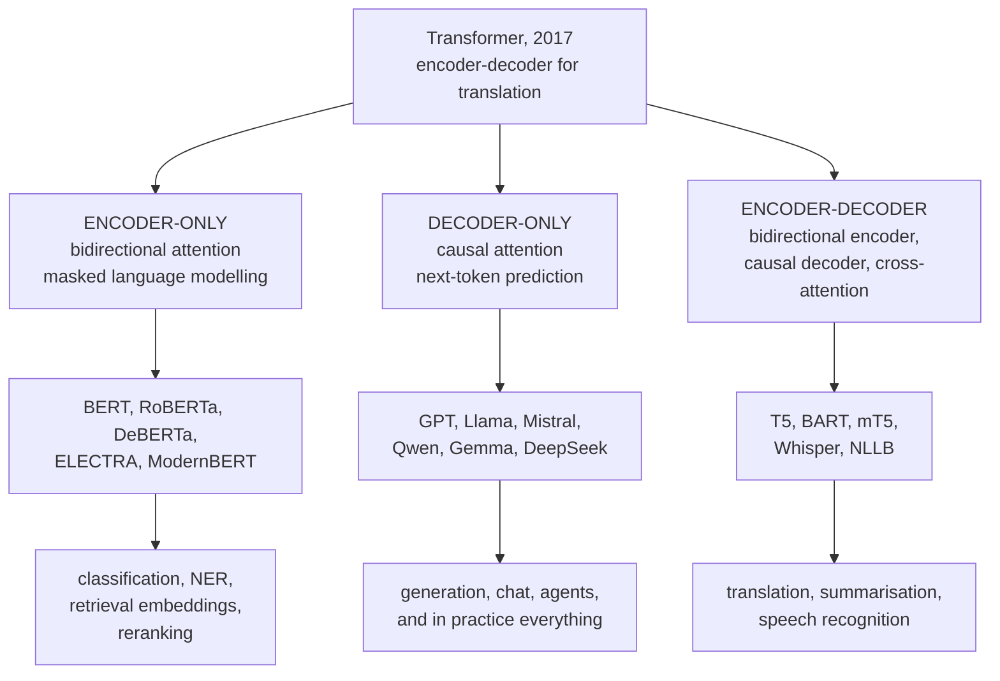

# Pretrained Model Families

There are three architectural families, a handful of pretraining objectives, and
a long list of checkpoints. Knowing which family fits which task — and why the
field converged on decoder-only for generation — saves more time than any amount
of prompt engineering.

## The three families



## Encoder-only

### BERT

The original BERT recipe combined two objectives:

- **Masked language modelling** — mask 15% of tokens and predict them from
  bidirectional context. The 80/10/10 split (replace with `[MASK]` / a random
  token / unchanged) exists because `[MASK]` never appears at fine-tuning time,
  so training on it exclusively creates a train–inference mismatch.
- **Next sentence prediction** — do these two segments follow each other? RoBERTa
  found NSP unnecessary in its controlled training comparisons. This does not
  prove every sentence-level objective hurts: ALBERT uses sentence-order
  prediction. See the [RoBERTa study](https://arxiv.org/abs/1907.11692).

Bidirectional context is BERT's defining property and the reason it dominated
classification and tagging: predicting a masked word uses both sides, which is
strictly more information than a causal model has.

### The successors

| Model | Change |
|---|---|
| **RoBERTa** | drop NSP, more data, longer training, dynamic masking, larger batches — the same architecture trained properly |
| ALBERT | factorised embeddings, cross-layer parameter sharing — fewer parameters, not faster |
| **DeBERTa-v3** | disentangled content/position attention, ELECTRA-style pretraining; evaluate against task-matched encoder baselines |
| **ELECTRA** | replaced-token detection: a generator corrupts tokens, a discriminator finds them. Trains on **100%** of positions rather than 15%, so it is far more sample-efficient |
| DistilBERT | distilled: 40% smaller, ~97% of the quality, 60% faster |
| **ModernBERT** | 2024-era: 8k context, RoPE, FlashAttention, modern data mixture, much faster |
| Longformer / BigBird | sparse attention for long documents |

**ELECTRA's insight is worth internalising**: MLM computes a loss on only 15% of
positions, wasting 85% of each forward pass. Replaced-token detection gives every
position a binary training signal, which is why ELECTRA-style pretraining reaches
BERT quality with a fraction of the compute.

### Why encoders still matter

With representative labels, a small fine-tuned encoder can outperform a prompted
large decoder on a narrow task with lower serving cost. Neither the quality
ranking nor a fixed cost ratio is guaranteed. Bidirectional encoders are strong
retrieval and reranking candidates; decoder-derived models can serve these tasks
too. Compare matched evaluation data, hardware, and latency targets.

Use an encoder for: classification, NER and token tagging, extractive QA,
sentence embeddings, and cross-encoder reranking.

## Decoder-only

Trained on next-token prediction with causal attention. The family that won.

| Generation | Models | Notable |
|---|---|---|
| GPT-1/2 | 117M–1.5B | showed unsupervised pretraining transfers |
| GPT-3 | 175B | in-context learning at scale |
| Chinchilla | 70B | compute-optimal scaling — 20 tokens per parameter |
| **Llama 1–3** | 7B–405B across releases | RoPE, RMSNorm, SwiGLU; Llama 1 uses MHA, Llama 2 introduces GQA in its 70B model, and Llama 3 uses GQA |
| Mistral / Mixtral | 7B, 8×7B | sliding-window attention; sparse mixture-of-experts |
| Qwen, Gemma, Phi | various | strong open models; Phi demonstrates curated/synthetic data |
| DeepSeek | various | multi-head latent attention, MoE, and RL-trained reasoning |
| Frontier proprietary | GPT, Claude, Gemini | undisclosed architectures |

### The modern decoder recipe

Common choices in dense decoders, not a specification shared by every model:

| Component | Choice | Reason |
|---|---|---|
| Normalisation | **pre-RMSNorm** | removes mean subtraction; warmup and stability tuning still matter |
| Position | **RoPE** | relative position, extends to longer contexts via frequency scaling |
| FFN activation | **SwiGLU** | empirical gated-FFN tradeoff; compare matched widths and compute |
| Attention | **GQA** | KV storage scales with KV-head count; quality and speed depend on grouping and implementation |
| Bias terms | often removed | modest parameter savings, not evidence that biases never help |
| Vocabulary | 32k–256k | larger vocabularies help multilingual coverage |
| Context | 8k–1M | long-context training and RoPE scaling |
| Optimiser | AdamW, $\beta_2 = 0.95$ | shorter second-moment window for stability |

**Mixture of experts** is the other major structural choice: replace the FFN with
$N$ experts and route each token to $k$ of them (typically $k = 1$ or 2). Total
parameters grow without evaluating every expert per token. Mixtral 8x7B is a
specific roughly 47B-total/13B-active example, not eight independent 7B models.
Shared layers, routing, and communication still cost compute. Experts need storage
somewhere; distributed placement or offloading reduces per-device residency at
additional communication or transfer cost.

### Why decoder-only won

1. **Universal objective.** Next-token prediction applies to any text with no
   annotation.
2. **Full training signal.** Every position contributes a loss in one forward
   pass; MLM uses 15%.
3. **Simplicity.** No cross-attention, one attention pattern, one stack.
4. **Scaling behaviour.** Clean, predictable power laws.
5. **In-context learning.** Emerges from the objective, and turns one model into
   many task-specific ones without training.

## Encoder–decoder

### T5

Cast **every** task as text-to-text. Translation, classification, regression,
summarisation — all become "input text → output text", with a task prefix.
Pretrained with **span corruption**: mask contiguous spans and generate them,
which is closer to the generation task than BERT's single-token masking.

The unified framing was influential well beyond T5, and the "instruction as
prefix" idea is a direct ancestor of instruction tuning.

### The family

| Model | Note |
|---|---|
| T5, Flan-T5 | Flan-T5 adds large-scale instruction tuning; still competitive for its size |
| BART | denoising autoencoder (token masking, deletion, sentence permutation); strong for summarisation |
| mT5, mBART | multilingual |
| **Whisper** | encoder–decoder for speech-to-text; the standard open ASR model |
| NLLB-200 | 200-language translation |
| Pegasus | gap-sentence pretraining, designed for summarisation |

Encoder–decoders remain the right choice where input and output are genuinely
different objects and the input must be encoded once and attended to many times —
translation, speech recognition, and summarisation of a fixed source.

## Multilingual models

| Model | Coverage |
|---|---|
| mBERT | 104 languages |
| **XLM-R** | 100 languages; strong cross-lingual transfer |
| mDeBERTa | 100-language pretraining; compare with XLM-R per language and task |
| mT5 / umT5 | 101 languages, text-to-text |
| BLOOM | 46 languages, open training data |
| NLLB-200 | 200 languages, translation-focused |
| Aya 101 | 101 languages, instruction-tuned; other Aya releases have different coverage |

**The curse of multilinguality**: at fixed capacity, adding languages helps
low-resource ones and hurts high-resource ones. Mitigations are more parameters,
language-specific adapters, MoE routing, and temperature-sampling the language
mix so low-resource languages are over-sampled relative to their corpus share.

**Cross-lingual zero-shot transfer** is the practical payoff: fine-tune XLM-R on
English NER and it works reasonably on 50 other languages without any labelled
data in them. This is the single most useful property of multilingual encoders.

## Domain-specific models

| Domain | Models |
|---|---|
| Biomedical | BioBERT, PubMedBERT, BioGPT, Med-PaLM |
| Clinical | ClinicalBERT, GatorTron |
| Scientific | SciBERT, SPECTER (paper embeddings) |
| Legal | LegalBERT, CaseLawBERT |
| Finance | FinBERT, BloombergGPT |
| Code | CodeBERT, StarCoder, CodeLlama, Qwen-Coder |
| Chemistry / proteins | ChemBERTa, ESM-2, ProtBERT |
| Tabular / time series | TabPFN, Chronos, TimesFM |

**Domain pretraining can help when vocabulary and distribution differ.** PubMedBERT
reported benefits on biomedical benchmarks; vocabulary, corpus, and training
recipe all contribute. A fragmented medical term is not inherently meaningless
to a subword model, and domain pretraining is not universally superior.

Check the tokenizer's **fertility** (tokens per word) on your domain text. If
your key terms cost 6 tokens each, measure truncation, latency, and downstream
quality before paying for vocabulary changes and retraining embeddings.

## Choosing a checkpoint

| Need | Pick |
|---|---|
| Text classification, 1k+ labels | DeBERTa-v3-base or ModernBERT |
| NER / token tagging | DeBERTa-v3 or a domain encoder |
| Sentence embeddings | BGE, E5, GTE — check MTEB for your task type |
| Reranking | a cross-encoder (bge-reranker, monoT5) |
| Generation, chat, agents | a decoder-only instruct model sized to your latency budget |
| Translation | NLLB, or an LLM for high-resource pairs |
| Speech to text | Whisper |
| Code | StarCoder2, CodeLlama, Qwen-Coder |
| Multilingual classification | XLM-R or mDeBERTa |
| Very long documents | ModernBERT, Longformer, or a long-context LLM |
| Tight latency or CPU-only | DistilBERT, MiniLM, or a distilled small LLM |

### Practical selection criteria

| Criterion | Why |
|---|---|
| **Licence** | Apache-2.0, Llama community licence, research-only — check before building on it |
| Size vs latency budget | CPU execution is possible for both; measure precision, RAM, context, batching, and acceptable latency |
| Context length | do your documents fit? |
| Tokenizer fertility on your domain | more tokens increase cost, not necessarily linearly because attention, batching, and pricing differ |
| **Base vs instruct** | base models complete text, instruct models follow instructions |
| Training data recency | knowledge cutoff |
| Community support | quantised versions, serving support, fine-tuning recipes |
| Benchmark relevance | evaluate on **your** data, not a leaderboard average |

**Base and instruct models behave completely differently** and confusing them is
a common early mistake. A base model given "What is the capital of France?" may
continue with more questions, because that is what its training distribution
contains.

**Benchmark contamination is pervasive.** Assume public test sets are in the
training data of any model trained on the web. A private evaluation set drawn
from your own distribution is worth more than any leaderboard position.

## Sizes and what they can do

| Size | Runs on | Capability |
|---|---|---|
| < 500M encoder | CPU | classification, NER, embeddings — excellent when fine-tuned |
| 1–3B | consumer GPU, quantised CPU | simple instruction following, classification, summarisation |
| 7–8B | suitable GPU or quantised CPU | evaluate task quality and context requirements |
| 13–34B | sufficiently large GPU, multiple devices, or CPU/offload | larger capacity, not guaranteed better reasoning |
| 70B+ | large-memory or distributed deployment; quantisation changes fit | strong candidates with substantial memory needs |
| Hosted frontier | API | evaluate provider-specific quality, cost, privacy, and limits |

**Task-specific fine-tuning of a small model frequently beats a large model
prompted zero-shot**, at a fraction of the cost. The large model's advantage is
generality, not per-task quality — which is why the LLM-labels-then-distil
pipeline is so effective.

## Self-check

1. Why did RoBERTa drop next sentence prediction?
2. What does ELECTRA's objective change, and why is it more sample-efficient?
3. Give five common decoder design choices, their tradeoffs, and a counterexample
   to treating a family name as a fixed architecture.
4. Why did decoder-only win over encoder–decoder for general use?
5. When is a 100M encoder the right answer over a 70B LLM?
6. What is the curse of multilinguality and what mitigates it?
7. How would you decide whether a domain-specific model is worth using?

### Worked checkpoint and objective checks

A 7B-parameter model has a weight-only lower bound of 14 GB at two bytes per
parameter or 3.5 GB at four bits. Quantisation scales, unquantised layers, KV
cache, activations, and runtime workspaces are additional. A model fitting RAM
does not imply meeting a latency SLO. Count bytes before assigning hardware.

This offline experiment constructs random tiny models, not useful pretrained
checkpoints. It checks the actual objective contracts: BERT predicts masked
positions without shifting labels; a causal LM shifts labels internally.

```python runnable
import os
os.environ["USE_TF"] = "0"  # select the PyTorch backend before importing Transformers
import torch
from transformers import BertConfig, BertForMaskedLM, GPT2Config, GPT2LMHeadModel

torch.set_num_threads(1)
torch.manual_seed(7)
ids = torch.tensor([[1, 5, 9, 2]])
bert = BertForMaskedLM(BertConfig(vocab_size=16, hidden_size=8,
    num_hidden_layers=1, num_attention_heads=2, intermediate_size=16,
    hidden_dropout_prob=0, attention_probs_dropout_prob=0))
masked = ids.clone()
masked[0, 2] = 3
labels = torch.full_like(ids, -100)
labels[0, 2] = ids[0, 2]
out = bert(masked, labels=labels)
manual = torch.nn.functional.cross_entropy(out.logits[:, 2], ids[:, 2])
torch.testing.assert_close(out.loss, manual)
gpt = GPT2LMHeadModel(GPT2Config(vocab_size=16, n_embd=8, n_layer=1,
    n_head=2, n_positions=8, resid_pdrop=0, embd_pdrop=0, attn_pdrop=0))
causal = gpt(ids, labels=ids)
manual = torch.nn.functional.cross_entropy(
    causal.logits[:, :-1].reshape(-1, 16), ids[:, 1:].reshape(-1))
torch.testing.assert_close(causal.loss, manual)
assert out.logits.shape == causal.logits.shape == (1, 4, 16)
print("MLM position selection and causal label shift verified")
```

**Answers.** NSP removal is evidence about a training setup, not all auxiliary
losses. ELECTRA supplies replaced/original supervision at more positions, but
MLM's unlabelled positions still provide context and gradients. T5 instead
encodes corrupted text and generates removed spans with sentinel boundaries.
A small encoder is preferable only after its quality and serving budget pass
your test. Evaluate domain adaptation against the original checkpoint using the
same split and seeds; compare token fertility as a diagnostic, not the objective.

## Where to go next

- [Language Models](./language-models.md) — objectives, perplexity, scaling.
- [LLM Prompting & Alignment](./llm-prompting-and-alignment.md) — turning a base
  model into an assistant.
- [Transformers Deep Dive](/courses/transformers/) — the architecture in detail.
