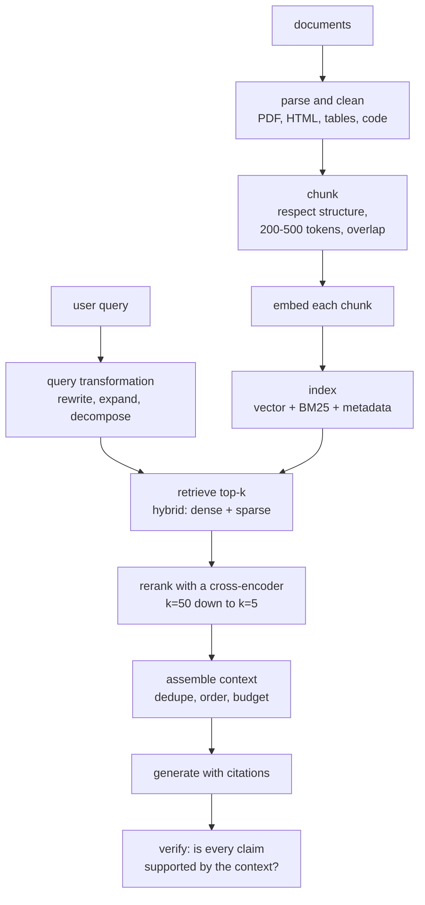

# RAG and Retrieval

Retrieval-augmented generation is the standard architecture for grounding a
language model in information it was not trained on. It is also the most commonly
built and most commonly under-evaluated LLM system, because a demo works
immediately and a production system needs every stage tuned.

## Why RAG

| Problem with a bare LLM | RAG's answer |
|---|---|
| Knowledge cutoff | retrieve current documents |
| No private or proprietary data | retrieve from your corpus |
| Hallucination | ground the answer in retrieved text |
| No attribution | cite the retrieved sources |
| Expensive to update | update the index, not the weights |
| No access control | filter at retrieval time by permission |

**The dividing rule**: fine-tuning teaches **behaviour**; retrieval supplies
**knowledge**. Fine-tuning a model on your documentation so it can answer
questions about your product is the standard mistake — the facts are memorised
imperfectly, are not attributable, and go stale the moment the documentation
changes.

## The pipeline



Every stage is a place the system fails, and the failure is usually silent.

## Indexing

### Parsing

The unglamorous stage that determines everything downstream. PDFs are the
recurring difficulty: multi-column layouts read out of order, tables become
scrambled text, headers and footers pollute every chunk, and scanned documents
need OCR.

| Content | Tooling |
|---|---|
| PDF (text) | PyMuPDF, pdfplumber; layout-aware parsers for multi-column |
| PDF (scanned) | OCR — Tesseract, or a vision model |
| HTML | trafilatura, readability — strip boilerplate |
| Office documents | python-docx, openpyxl, or a converter |
| Tables | preserve structure; linearise with explicit separators or keep as markdown |
| Code | preserve indentation; chunk by function or class |
| Slides | one chunk per slide, with the title |

**Bad parsing is the most common root cause of bad RAG**, and it is invisible
from the generation side — the model dutifully answers from garbled context.
Inspect a random sample of your chunks by eye before blaming the retriever.

### Chunking

| Strategy | Note |
|---|---|
| Fixed size | simple; splits sentences and loses context |
| **Recursive character** | split on paragraph, then sentence, then word boundaries — a good default |
| Structural | split on headings, sections, list items — best when structure exists |
| Semantic | split where embedding similarity between adjacent sentences drops |
| Sentence-window | embed one sentence, retrieve with surrounding context |
| **Parent–child** | embed small chunks for precision, return the parent for context |
| Proposition | decompose into atomic factual statements |

| Parameter | Guidance |
|---|---|
| Size | 200–500 tokens for precision; 800–1500 for context-heavy answers |
| Overlap | 10–20%, so a fact spanning a boundary survives |
| Metadata | **prepend the document title and section heading to every chunk** |

That last row matters more than the chunk-size debate. A chunk reading "It
requires approval from the regional manager" is uninterpretable alone; prefixed
with "Expense Policy → Travel → Approvals", it is retrievable and answerable.

**Parent–child retrieval is the pattern to reach for** when precision and context
conflict: index small chunks so the embedding is focused, but return the enclosing
section so the model has enough to answer.

### Embedding

| Consideration | Guidance |
|---|---|
| Model | check MTEB on **retrieval** tasks specifically, then test on your data |
| Asymmetric prefixes | E5/BGE-style models need `"query: "` / `"passage: "` — omitting them silently degrades recall |
| Dimensions | 384 vs 768 vs 1536 — larger is marginally better, proportionally more expensive |
| Max length | must exceed your chunk size, or chunks are truncated |
| Domain | general models can fail badly on legal, biomedical, or code text |
| Normalisation | L2-normalise so the dot product is cosine similarity |
| Versioning | changing the embedding model requires **reindexing everything** |

## Retrieval

### Hybrid search

**Dense and sparse retrieval fail differently**, which is why combining them
reliably beats either.

| | Dense (embeddings) | Sparse (BM25) |
|---|---|---|
| Finds | semantic matches, paraphrase | exact terms, rare tokens |
| Misses | exact product codes, rare names, numbers | synonyms, rephrasing |
| Needs | a GPU or an API to embed | an inverted index |
| Out-of-domain | degrades | robust |

Fuse the rankings with **reciprocal rank fusion**, which needs no score
calibration between the two systems:

$$\mathrm{RRF}(d) = \sum_{r\in\text{rankers}}\frac{1}{k + \mathrm{rank}_r(d)}, \qquad k = 60$$

This is one of the highest-value, lowest-effort improvements available in a RAG
system, and it is a dozen lines of code.

### Query transformation

The user's question is often a poor search query.

| Technique | Idea |
|---|---|
| Query rewriting | make a conversational follow-up standalone ("what about the second one?") |
| Query expansion | add synonyms and related terms |
| **Multi-query** | generate several phrasings, retrieve for each, merge |
| **HyDE** | generate a *hypothetical answer*, embed that, and search — answers look more like documents than questions do |
| Decomposition | split a multi-part question into sub-queries |
| Step-back | ask a more general question first to retrieve background |
| Metadata extraction | pull filters (date, author, product) out of the query |

**Conversational query rewriting is not optional** in a chat interface. "What
about the second one?" retrieves nothing useful; rewritten to "What are the
pricing terms of the enterprise plan?" it retrieves correctly.

### Reranking

Retrieve broadly (top 50–100), then rerank precisely with a **cross-encoder**
that reads the query and document **together** rather than embedding them
separately.

| | Bi-encoder (retrieval) | Cross-encoder (reranking) |
|---|---|---|
| Encodes | query and document separately | jointly, with full attention between them |
| Precomputable | yes — the index | no |
| Cost | $O(1)$ per query after indexing | $O(k)$ full forward passes |
| Accuracy | good | **much better** |

Cross-encoders see term interactions that separate embeddings cannot represent,
and reranking typically gives the largest single quality gain in the whole
pipeline. Options: bge-reranker, monoT5, Cohere Rerank, or an LLM used as a
ranker.

**ColBERT** sits between the two: per-token embeddings with late interaction
(MaxSim), giving much of the cross-encoder's accuracy at retrieval-time cost, at
the price of a far larger index.

## Generation

### Context assembly

| Decision | Guidance |
|---|---|
| How many chunks | 3–10 typically; more is not better |
| Ordering | **most relevant at the start and end** — the lost-in-the-middle effect is real |
| Deduplication | overlapping chunks waste budget |
| Attribution | number the sources so the model can cite them |
| Budget | leave room for the answer |
| Metadata | include titles, dates, and section paths |

**Lost in the middle**: retrieval accuracy from a long context is highest at the
beginning and end and dips substantially in the middle. Order your chunks
accordingly rather than by rank alone.

### The prompt

```
Answer the question using ONLY the provided sources.
Cite sources as [1], [2] after each claim.
If the sources do not contain the answer, say "I don't have enough information."

Sources:
[1] {title} — {section}
{chunk_text}

[2] ...

Question: {query}
```

Three elements do the work: **restriction to the sources**, **mandatory
citation**, and an **explicit escape hatch**. The escape hatch measurably reduces
fabrication — without it, a model that finds nothing relevant will answer anyway.

### Verification

For high-stakes applications, check the output rather than trusting it:

- **Citation checking** — does each cited chunk actually support the claim?
  An NLI model can score entailment.
- **Claim decomposition** — split the answer into atomic claims and verify each.
- **Self-consistency** — generate several answers and compare.
- **Abstention** — return "insufficient information" rather than a low-confidence
  answer.

## Evaluation

Evaluate the **stages separately**. An end-to-end score cannot tell you whether
retrieval or generation failed.

### Retrieval

| Metric | Measures |
|---|---|
| Recall@k | is the answer-bearing chunk in the top $k$? |
| Precision@k | how much retrieved content is relevant |
| **MRR** | reciprocal rank of the first relevant chunk |
| **NDCG@k** | position-weighted, graded relevance |
| Hit rate | did any relevant chunk appear? |

**Recall@k is the one to optimise first.** If the answer is not retrieved, no
generation quality can recover it — this is the ceiling on the whole system.

### Generation

| Metric | Measures |
|---|---|
| **Faithfulness / groundedness** | is every claim supported by the context? |
| Answer relevance | does it address the question? |
| Context relevance | was the retrieved context useful? |
| Citation accuracy | do citations point to text that supports the claim? |
| Correctness | against a gold answer, where one exists |

Frameworks: RAGAS, TruLens, DeepEval, ARES. All use LLM judges, so their scores
carry judge bias — useful for relative comparison and regression detection, not
as absolute truth.

**Build a golden set.** 50–200 real questions with known answers and known
source documents. Score every pipeline change against it. This single artefact
distinguishes a RAG system that improves from one that changes.

## Failure modes

| Failure | Stage | Fix |
|---|---|---|
| Answer not in the index | ingestion | check coverage; fix parsing |
| Answer in a chunk that was not retrieved | retrieval | hybrid search, reranking, query rewriting |
| Right chunk retrieved, wrong answer generated | generation | better prompt, stronger model, less context |
| Answer split across chunks | chunking | larger chunks, more overlap, parent–child |
| Model ignores the context and uses parametric knowledge | generation | explicit restriction, citation requirement |
| Fabricated citations | generation | verify citations programmatically |
| Confidently wrong on out-of-scope questions | generation | escape hatch, abstention, a relevance threshold |
| Conversational follow-ups fail | query | conversational rewriting |
| Stale answers | ingestion | incremental reindexing, freshness metadata |
| Slow | retrieval | ANN tuning, cache embeddings, smaller reranker |
| Leaks documents across tenants | retrieval | **metadata filtering enforced at the index level** |

That last row is a security issue, not a quality issue. Permission filtering must
happen **in the retrieval query**, not by post-filtering results — post-filtering
means the model has already seen documents the user may not access, and any
summary it produces leaks them.

## Beyond basic RAG

| Pattern | Idea |
|---|---|
| **Agentic RAG** | the model decides what and when to retrieve, iteratively |
| Self-RAG | the model critiques its own retrievals and generations |
| **Corrective RAG** | detect poor retrieval and fall back to web search |
| **GraphRAG** | build a knowledge graph and retrieve subgraphs — better for global questions |
| Multi-hop | chain retrievals for questions needing several documents |
| Hierarchical (RAPTOR) | index summaries at multiple levels of abstraction |
| Multimodal | retrieve images, tables, and charts alongside text |
| Long-context stuffing | skip retrieval, put everything in a 1M-token context |

**Does long context replace RAG?** No, for four reasons: cost (attention is
quadratic; 1M tokens per query is expensive), latency (prefill dominates TTFT),
recall degradation in the middle of very long contexts, and corpora that are far
larger than any context window. Long context does reduce the pressure on precise
chunking — you can retrieve more generously — which is a genuine simplification.

**GraphRAG addresses a specific gap**: questions like "what are the main themes
across these 500 documents?" cannot be answered by retrieving 5 chunks, because
the answer is not local to any of them. Building an entity graph with
community summaries enables global reasoning that chunk retrieval structurally
cannot do.

## Self-check

1. Give the rule for fine-tuning versus retrieval, and the standard mistake.
2. Why does hybrid search beat dense retrieval alone? Give an example query for
   each failure mode.
3. What is HyDE, and why does a hypothetical answer retrieve better than a
   question?
4. What does a cross-encoder do that a bi-encoder cannot, and what does it cost?
5. Why is Recall@k the first metric to optimise?
6. Where must permission filtering happen, and why is post-filtering a security
   bug?
7. Give three reasons long context does not replace RAG.

## Where to go next

- [Text Representation](./text-representation.md) — embeddings and vector search.
- [LLM Prompting & Alignment](./llm-prompting-and-alignment.md) — the generation
  half.
- [NLP Evaluation](./nlp-evaluation.md) — measuring all of it.
