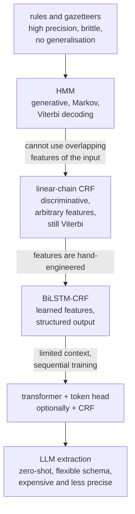

# Sequence Labeling: NER, POS, and Span Extraction

Assign a label to every token rather than to the document. It sounds like a
minor variation on classification and is not: labels are **structurally
dependent** — an entity's continuation tag is only valid after its beginning
tag — and evaluation has to score spans, not tokens.

## The tasks

| Task | Labels |
|---|---|
| **Named entity recognition** | PERSON, ORG, LOC, DATE, MONEY, … |
| Part-of-speech tagging | NOUN, VERB, ADJ, … (Universal Dependencies or Penn Treebank) |
| Chunking / shallow parsing | NP, VP, PP spans |
| Slot filling | intent slots in a dialogue system |
| Extractive QA | the answer span within a passage |
| Keyphrase extraction | important spans |
| Word segmentation | token boundaries in Chinese, Japanese, Thai |
| Grammatical error detection | error spans |

## Tagging schemes

Span boundaries must be encoded in per-token labels.

| Scheme | Tags | Note |
|---|---|---|
| **IO** | `I-TYPE`, `O` | cannot separate two adjacent entities of the same type |
| **BIO / IOB2** | `B-TYPE`, `I-TYPE`, `O` | the standard |
| **BIOES / BILOU** | adds `E-` (end) and `S-` (single) | more supervision signal; often 1–2 points better |
| BMES | Chinese word segmentation | begin, middle, end, single |

```
Text:   Barack  Obama  visited  New    York   City   yesterday
BIO:    B-PER   I-PER  O        B-LOC  I-LOC  I-LOC  O
BIOES:  B-PER   E-PER  O        B-LOC  I-LOC  E-LOC  O
```

**Why BIO beats IO**: in "Apple Google are companies", IO tagging gives
`I-ORG I-ORG O O`, which is indistinguishable from a single two-word
organisation. The `B-` prefix marks where a new entity starts.

**Invalid sequences are possible.** `O` followed by `I-PER` is not a legal BIO
sequence. A per-token classifier or unconstrained CRF can emit it. Hard start and
transition masks are required when legality must be guaranteed.

## The modelling arc



### Hidden Markov models

A generative model with two components: transition probabilities
$P(t_i\mid t_{i-1})$ and emission probabilities $P(w_i\mid t_i)$.

$$P(\mathbf{t},\mathbf{w}) = \prod_i P(t_i\mid t_{i-1})\,P(w_i\mid t_i)$$

Decoding — finding the highest-probability tag sequence — is done by the
**Viterbi** dynamic program:

$$\delta_t(j) = \max_i \bigl[\delta_{t-1}(i)\,P(j\mid i)\bigr]\,P(w_t\mid j)$$

$O(TK^2)$ instead of $O(K^T)$ for brute force. Store backpointers to recover the
path.

The simple categorical-emission HMM does not directly use arbitrary overlapping
whole-input features. Richer emission distributions can model word shape or suffix
information; the limitation is the chosen generative factorization, not a universal
ban on suffix features. Initialize Viterbi with start probabilities and terminate
with any end-state probabilities. Use sums of log probabilities, preserving
impossible transitions as negative infinity, to avoid product underflow.

### Conditional random fields

A CRF is the discriminative counterpart: model $P(\mathbf{t}\mid\mathbf{w})$
directly, with arbitrary features of the **whole** input sequence.

$$P(\mathbf{t}\mid\mathbf{w}) = \frac{1}{Z(\mathbf{w})}\exp\left(\sum_{i}\sum_{k}\lambda_k f_k(t_{i-1},t_i,\mathbf{w},i)\right)$$

Because it is conditional, features may depend on any part of the input without
requiring a generative story for it. Classic features: word identity, prefixes
and suffixes, capitalisation pattern, word shape (`Xxxx`), gazetteer membership,
and the same features for neighbouring words.

**The essential property**: a CRF learns preferences over transitions. Finite
scores do not make an illegal BIO transition impossible. Add hard start/transition
masks to the forward partition and decoding if the trained distribution must
exclude illegal paths, or explicitly distinguish decode-only constraints. It optimises the
whole sequence jointly rather than each token independently. Decoding is Viterbi
again; training uses forward–backward to compute the partition function $Z$.

### BiLSTM-CRF

Replace hand-engineered features with a learned bidirectional LSTM encoder, keep
the CRF layer on top. This was the state of the art from roughly 2016 to 2018 and
established the pattern that persists: **a neural encoder for features, a
structured layer for the output**.

### Transformer taggers

```python
model = AutoModelForTokenClassification.from_pretrained(
    "microsoft/deberta-v3-base", num_labels=len(label_list),
    id2label=id2label, label2id=label2id)
```

A per-token classification head on a transformer encoder. Bidirectional context
is exactly what tagging needs, which is why encoders — not decoder-only LLMs —
remain the right architecture here.

**Is a CRF layer still worth it?** With a strong encoder the gain shrinks to
a fraction of a point on well-resourced tasks, because the transformer's context
already encodes most of the label dependency. It still helps for: low-resource
settings, long entities and schemes with many types. Validity requires explicit
constraints, not merely attaching a CRF.
A cheaper alternative is **constrained decoding** — mask illegal transitions at
inference — which gets validity without the training cost.

## Subword alignment

The practical detail that trips everyone up. Tokenizers split words into
subwords, but labels are per word.

```python
def align_labels(words, tags, tokenizer, label2id):
    enc = tokenizer(words, is_split_into_words=True, truncation=True, max_length=512)
    labels, prev = [], None
    for wid in enc.word_ids():
        if wid is None:                     # [CLS], [SEP], padding
            labels.append(-100)
        elif wid != prev:                   # first subword of a word
            labels.append(label2id[tags[wid]])
        else:                               # continuation subword
            labels.append(-100)             # ignored by the loss
        prev = wid
    enc["labels"] = labels
    return enc
```

Two conventions exist for continuation subwords: **ignore them** (`-100`, so
they contribute no loss) or **label them with the `I-` form**. Ignoring is more
common and slightly simpler; labelling gives more supervision signal. Whichever
you choose, be consistent between training and inference — a mismatch produces
subtly wrong spans.

`-100` is PyTorch's cross-entropy ignore index and the convention throughout the
Hugging Face stack.

## Nested and overlapping entities

Standard BIO **cannot represent** "Bank of [China]" where both the whole phrase
and the inner token are entities. Real corpora (especially biomedical) are full
of these.

| Approach | Idea |
|---|---|
| **Span-based** | enumerate candidate spans, classify each; $O(n^2)$ spans, handles nesting naturally |
| Layered / cascaded | stack several BIO taggers, one per nesting level |
| **Biaffine** | score every (start, end) pair with a biaffine classifier — strong and now standard |
| Hypergraph | encode nesting in a graph structure |
| MRC framing | ask "where is the ORG?" as an extractive QA question per type |
| Generative | generate the entities as text (LLM or seq2seq) |

Biaffine span scoring is the current default for nested NER: it is simple,
handles arbitrary nesting, and performs well. The cost is $O(n^2)$ span
candidates, usually capped by a maximum span width.

## Evaluation: entity-level, not token-level

**Token accuracy is misleading.** With 95% `O` tags, a model predicting `O`
everywhere scores 95% and finds nothing. Score **spans**, requiring both the
boundaries and the type to be exactly right.

```python
from seqeval.metrics import classification_report, f1_score
from seqeval.scheme import IOB2
print(classification_report(true_tags, pred_tags, digits=4, mode="strict", scheme=IOB2))
assert f1_score([["B-PER", "I-PER"]], [["I-PER", "I-PER"]],
                mode="strict", scheme=IOB2) == 0.0
```

This optional seqeval example explicitly requests strict IOB2; default conlleval
compatibility can interpret malformed paths permissively. Validate annotation
schemes separately and use a tested span-scoring library. See
[seqeval's strict/default examples](https://github.com/chakki-works/seqeval).

| Match criterion | Counts as correct |
|---|---|
| **Exact** | boundaries and type both exactly right (the standard) |
| Partial / overlap | any overlap with a gold entity of the same type |
| Type-only | correct type, boundaries ignored |
| MUC-style | separate credit for boundaries and typing |

Report **per-type** precision, recall, and F1. Aggregate F1 hides the rare type
your product actually needs, and NER type distributions are always skewed.

**Boundary errors are the dominant failure mode**, and they are worth
distinguishing from type errors: "New York City" tagged as "New York" is a
boundary error; tagging it as ORG is a type error. They have different causes and
different fixes.

## Practical difficulties

| Difficulty | Detail |
|---|---|
| **Annotation consistency** | is "the White House" a LOC or an ORG? Guidelines must be explicit, and agreement measured |
| Ambiguity | "Washington" — person, state, city, or organisation |
| Domain shift | a model trained on news collapses on clinical notes or legal text |
| Nested entities | standard BIO cannot express them |
| Long entities | full legal names, chemical compounds |
| **Rare types** | very few training examples; the metric hides them |
| Non-English | morphologically rich languages, no capitalisation signal in many scripts |
| Emerging entities | new products, people, and organisations appear constantly |
| Discontinuous entities | "left and right arm" → two entities sharing tokens |

**Capitalisation dependence is a specific and severe fragility.** English NER
models trained on well-formed news text lean heavily on capitalisation and
collapse on lowercase text, ALL CAPS, or transcribed speech. The fix is
augmentation: train on randomly lowercased and uppercased copies of the data.
This is cheap and consistently effective.

## Distant supervision and weak labels

Annotation is expensive. Cheaper sources of labels:

| Source | Note |
|---|---|
| Gazetteers / dictionaries | high precision, low recall, noisy for ambiguous names |
| Wikipedia links | the basis of several large NER corpora |
| Rule-based patterns | regex for dates, emails, IDs — often better than a model |
| **LLM annotation** | strong zero-shot; verify a sample and treat as noisy |
| Weak supervision frameworks | combine noisy sources with a label model (Snorkel-style) |
| Active learning | annotate the examples the model is least sure about |

**Distant supervision produces false negatives**, because a gazetteer misses
entities that are then labelled `O`. Training naively teaches the model to miss
them too. Partial-annotation-aware losses, or treating unmatched tokens as
unlabelled rather than negative, address this.

**LLM-then-distil is now a strong pipeline**: use an LLM to label 10k documents,
verify a stratified sample by hand, and fine-tune a small encoder on the result.
You get most of the LLM's coverage at a hundredth of the serving cost.

## LLMs for extraction

```python
schema = {"people": ["..."], "organizations": ["..."], "dates": ["..."]}
prompt = f"Extract entities as JSON matching this schema:\n{schema}\n\nText: {text}"
```

| Strength | Weakness |
|---|---|
| Zero-shot on a novel schema | worse precision and recall than a fine-tuned encoder |
| Handles nested and overlapping naturally | no reliable character offsets |
| Follows complex instructions | slow and expensive per document |
| Explains its extractions | hallucinated entities |
| No training data needed | inconsistent across runs |

**Character offsets are the practical blocker.** Downstream systems need to know
*where* in the document an entity was found — for highlighting, redaction, or
linking — and a generative model returns text, not positions. Post-hoc string
matching fails on repeated mentions and on any normalisation the model applied.

Use structured/constrained decoding to guarantee valid JSON, and treat LLM
extraction as a bootstrapping tool or a fallback for rare schemas, not as the
production path for high-volume extraction.

## Related: entity linking

NER finds spans; **entity linking** maps them to unique identifiers in a
knowledge base — resolving "Michael Jordan" to the basketball player or the
statistician.

| Stage | Method |
|---|---|
| Mention detection | NER |
| Candidate generation | alias dictionary, or dense retrieval over entity descriptions |
| Disambiguation | context-based ranking; global coherence across all mentions in a document |
| NIL detection | recognising an entity absent from the knowledge base |

The global coherence step is what distinguishes good linkers: entities mentioned
in one document tend to be related, so disambiguating them jointly beats
disambiguating each in isolation.

## Self-check

### Worked partition and Viterbi calculation

For three positions and two labels there are eight paths. The forward recurrence
uses log-sum-exp over predecessor scores, while Viterbi uses max and stores its
argmax. Their distinction is the sum of path probability versus the best path,
not a different emission model. This numerical demonstration verifies both against
exhaustive enumeration; use a library decoder for production tagging.

```python runnable
import itertools
import numpy as np
emission = np.array([[.2, -.1], [.1, .7], [.4, .0]])
transition = np.array([[.3, -.2], [-.1, .2]])
start = np.array([0., -np.inf])  # second label cannot begin a sequence
forward = start + emission[0]
best = forward.copy()
back = []
for token in emission[1:]:
    candidates = best[:, None] + transition
    back.append(candidates.argmax(0))
    best = candidates.max(0) + token
    forward = np.logaddexp.reduce(forward[:, None]+transition, axis=0)+token
paths = list(itertools.product(range(2), repeat=3))
scores = np.array([start[p[0]] + sum(emission[t, p[t]] for t in range(3))
                  + sum(transition[p[t-1], p[t]] for t in range(1, 3)) for p in paths])
assert np.isclose(np.logaddexp.reduce(forward), np.logaddexp.reduce(scores))
decoded = [int(best.argmax())]
for pointers in reversed(back):
    decoded.append(int(pointers[decoded[-1]]))
decoded.reverse()
assert tuple(decoded) == paths[int(scores.argmax())]
assert decoded[0] == 0
print("best path", decoded, "log partition", np.logaddexp.reduce(forward))
```

**Why can BIO not express nesting?** A token has only one tag in one layer;
independently typed `(start,end,type)` spans or layered taggers can retain both
outer and inner mentions. A span decoder must define overlapping/crossing conflict
rules and maximum width. **Why do offsets matter after truncation?** Entity spans
crossing a window boundary need an explicit discard, overlap, or merge policy;
do not score only the retained fragment as if it were the original entity. Entity
linking should report candidate recall before disambiguation and evaluate NIL
thresholds separately. Missing weak labels are unobserved, not reliable `O` labels.

1. Why does BIO tagging need the `B-` prefix? Give a concrete failing example
   for IO.
2. What is the complexity of Viterbi decoding, and what does it replace?
3. What does a CRF layer add over independent per-token classification, and when
   is it still worth it?
4. What is `-100` in a labels tensor, and why do continuation subwords get it?
5. Why is token-level accuracy the wrong metric for NER?
6. Give two approaches to nested entities and say why BIO cannot express them.
7. Why do English NER models fail on lowercase text, and what is the fix?

## Where to go next

- [Text Classification](./text-classification.md) — document-level prediction.
- [Text Preprocessing](./text-preprocessing.md) — the tokenization that
  complicates alignment.
- [NLP Evaluation](./nlp-evaluation.md) — span-level scoring in depth.
