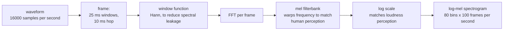
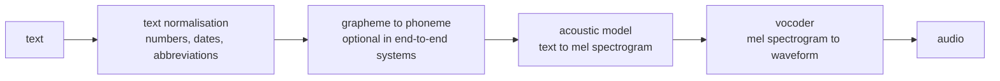

# Speech and Audio

Speech is text plus everything text throws away: timing, prosody, speaker
identity, emotion, and acoustic environment. That extra information is why speech
systems need their own representations and architectures, and why the tasks fail
in ways text systems do not.

## Audio representations

Raw audio is a waveform: amplitude sampled at 16 kHz for speech, 44.1 kHz for
music. One second of 16 kHz audio is 16,000 numbers, which is far too long a
sequence to model directly with attention.



**The framing rate is the key number**: 25 ms windows with a 10 ms hop gives 100
frames per second, so one second becomes 100 timesteps of 80 features instead of
16,000 samples — a 160× reduction, and now a tractable sequence length.

| Representation | Note |
|---|---|
| Raw waveform | maximum information; used by WaveNet, SEW, some end-to-end models |
| Spectrogram (STFT) | time–frequency magnitude |
| **Log-mel spectrogram** | mel-warped and log-scaled; the standard input |
| MFCC | DCT of log-mel; decorrelated, compact — the classical feature, now largely superseded |
| **Learned SSL features** | wav2vec 2.0, HuBERT, WavLM — self-supervised, and better than hand-designed features |
| Discrete audio tokens | EnCodec, SoundStream — enable audio LLMs |

**The mel scale** is an empirical approximation to pitch perception, concentrating
more frequency resolution at lower frequencies. Actual discrimination depends on
listener, level, duration, and signal context; a frequency difference is not
universally inaudible simply because it occurs at high frequency.

**Discrete audio tokens are the enabling technology for audio LLMs.** A neural
codec compresses audio into a sequence of integers, which a transformer can model
with exactly the same machinery it uses for text — turning speech generation into
next-token prediction.

## Automatic speech recognition

### The arc

| Era | Approach |
|---|---|
| 1980s–2000s | **HMM-GMM**: HMM for temporal structure, GMM for acoustics, separate pronunciation lexicon and n-gram language model |
| 2010s | HMM-DNN: replace the GMM with a neural network; large accuracy gain |
| 2015+ | **CTC**: end-to-end, no alignment needed, no lexicon |
| 2016+ | **RNN-T**: CTC plus a prediction network; the streaming standard |
| 2017+ | Attention encoder–decoder (LAS): full seq2seq |
| 2020+ | **Self-supervised pretraining** (wav2vec 2.0, HuBERT) then fine-tune |
| 2022+ | **Whisper**: weakly supervised at massive scale, multilingual, multitask |

### CTC

The alignment problem: an input of $T$ audio frames maps to $U \ll T$ output
characters, with no per-frame labels.

**Connectionist temporal classification** introduces a blank symbol and defines
the probability of a label sequence as the sum over **all** alignments that
collapse to it:

$$p(\mathbf{y}\mid\mathbf{x}) = \sum_{\pi\in\mathcal{B}^{-1}(\mathbf{y})}\prod_{t=1}^{T}p(\pi_t\mid\mathbf{x})$$

The collapse rule removes repeated symbols and then blanks, so `h-e-l-l-o` needs
a blank between the two `l`s to survive: `hel_lo`. That is precisely why the
blank exists.

The sum has exponentially many terms and is computed in $O(TU)$ by a
forward–backward dynamic program, which is what makes the loss differentiable and
trainable.

**CTC factorises alignment-symbol probabilities given the whole input.** This
does not forbid its contextual acoustic encoder from learning linguistic
regularities. CTC lacks an explicit output-history prediction network; an
external LM can improve decoding but is not required by the loss.

**RNN-Transducer** removes that assumption by adding a prediction network
conditioned on previous outputs, combining acoustic and language modelling in one
architecture. Streaming requires a causal or bounded-lookahead encoder and
incremental feature extraction; an RNN-T with a bidirectional full-utterance
encoder is not streaming merely because its output model is a transducer.

### Whisper

The original Whisper release was trained on 680,000 hours of weakly supervised
audio. Later checkpoints differ in data and language coverage. Its encoder-decoder handles transcription, translation,
language identification, and timestamps through **special tokens in the decoder
prompt**.

| Strength | Weakness |
|---|---|
| Robust across accents, noise, and domains | not streaming — processes 30-second windows |
| Original multilingual models support 99 languages; large-v3 adds Cantonese | **hallucinates** on silence and non-speech audio |
| No fine-tuning needed for most uses | repetition loops on long or unusual audio |
| Multitask through prompt tokens | no speaker diarisation |
| Open weights | high latency for real-time use |

**Whisper's hallucination on silence is a genuine production problem**: given
non-speech input it can emit fluent transcript text (frequently subtitle-corpus
artefacts like "Thank you for watching"). Mitigate with voice-activity detection
before transcription, a no-speech probability threshold, and repetition
detection.

Faster-whisper (CTranslate2) and WhisperX (with forced alignment and diarisation)
are the practical deployment paths.

### Streaming

Real-time ASR must emit output before the utterance ends, which changes the
architecture.

| Requirement | Mechanism |
|---|---|
| Causal or limited-lookahead encoding | chunked or causal attention |
| Incremental decoding | RNN-T, or a streaming transformer transducer |
| Endpointing | detect when the speaker has finished |
| Partial hypotheses | show provisional text, revise as more audio arrives |

The trade is direct: more lookahead gives better accuracy and higher latency.
Production systems tune this per use case — dictation tolerates more latency than
a voice assistant.

## Text to speech



| Stage | Models |
|---|---|
| Acoustic | Tacotron 2 (autoregressive), FastSpeech 2 (non-autoregressive, controllable duration), VITS (end-to-end with a VAE and flows) |
| **Vocoder** | WaveNet (excellent, very slow), WaveGlow, **HiFi-GAN** (fast and high quality), BigVGAN |
| End-to-end | VITS, StyleTTS 2, VALL-E, XTTS |

**Text normalisation is the unglamorous stage that breaks systems.** "Dr. Smith
lives at 123 Dr." — the first is "Doctor", the second is "Drive". "1/2" is "one
half" or "January second". "$1.5M" is "one point five million dollars".
Rule-based normalisers handle most cases; neural normalisers handle more and fail
less predictably.

**TTS quality remains task- and language-dependent**: intelligibility on unusual
names, long-form stability, accent coverage, expressive control, and robustness
still need evaluation. Other important problems include **voice cloning** from a few seconds of reference audio, **prosody
and emotion control**, **latency** for conversational agents, and **streaming**
synthesis that starts speaking before the full text is generated.

That last one matters for LLM voice interfaces: the pipeline is ASR → LLM → TTS,
and each stage adds latency. Streaming all three — partial transcripts feeding a
streaming LLM feeding a streaming vocoder — is what makes a voice assistant feel
responsive rather than sluggish.

## Speaker and audio tasks

| Task | Description |
|---|---|
| **Speaker identification** | who is speaking, from a known set |
| **Speaker verification** | is this the claimed speaker? (biometric) |
| **Diarisation** | "who spoke when" — segmentation plus clustering |
| Voice activity detection | speech versus non-speech |
| Language identification | which language |
| **Source separation** | isolate voices or instruments from a mixture |
| Keyword spotting | wake words, on-device and low power |
| Emotion recognition | affect from prosody |
| Audio classification | events, scenes, music genre |
| Music transcription | audio to notation |

**Speaker embeddings** (x-vectors, ECAPA-TDNN) are the shared substrate: a
fixed-length vector per utterance where cosine distance measures speaker
similarity. Verification, diarisation, and clustering all reduce to comparing
these.

**Diarisation combined with ASR** is what most real transcription products
actually need — a meeting transcript with speaker labels — and it remains harder
than either component alone, particularly with overlapping speech.

## Self-supervised speech models

| Model | Objective |
|---|---|
| **wav2vec 2.0** | contrastive prediction of quantised latent speech units from masked context |
| **HuBERT** | masked prediction of cluster IDs from an offline $k$-means over features, refined iteratively |
| WavLM | HuBERT plus simulated overlapped speech and denoising — better for speaker tasks |
| Whisper encoder | weakly supervised, but its features transfer well |
| EnCodec / SoundStream | neural codecs producing discrete tokens |

**The impact is on data requirements.** wav2vec 2.0 fine-tuned on **10 minutes**
of labelled speech reaches word error rates that previously needed hundreds of
hours. For low-resource languages — most of the world's languages — this is the
difference between a possible and an impossible ASR system.

## Audio language models

The convergence: tokenise audio with a neural codec, then model the tokens with a
transformer exactly as with text.

| System | Capability |
|---|---|
| AudioLM | continue speech or music from a prompt |
| VALL-E | zero-shot voice cloning from a 3-second sample |
| MusicGen / MusicLM | text-to-music |
| AudioGen | text-to-sound-effect |
| Speech-in LLMs (Qwen-Audio, Gemini, GPT-4o) | audio understanding as one modality among several |
| Speech-to-speech | skip the text bottleneck entirely; preserve prosody and emotion |

**Speech-to-speech is the architecturally interesting direction.** The
conventional pipeline (ASR → LLM → TTS) discards prosody, emotion, and speaker
characteristics at the first stage and cannot recover them at the last. A model
operating on audio tokens can retain these signals, but preservation depends on
its representation and training. Lower latency is possible, not guaranteed:
codec rates, streaming lookahead, endpointing, and generation architecture matter.

## Evaluation

### Word error rate

$$\mathrm{WER} = \frac{S + D + I}{N}$$

Substitutions, deletions, and insertions divided by reference words, computed by
the **edit-distance dynamic program**. It can exceed 100% when insertions
dominate.

| Caveat | Detail |
|---|---|
| **Normalisation dominates** | casing, punctuation, numbers ("5" vs "five"), contractions — a WER comparison without identical normalisation is meaningless |
| Not all errors are equal | a wrong digit in an account number matters more than "a" vs "the" |
| Morphologically rich or non-space-delimited languages | report tokenisation; CER can supplement WER rather than universally replace it |
| Speaker-attributed WER | for diarised multi-speaker transcripts |

**Always publish the normalisation.** Whisper ships a text normaliser precisely
because WER numbers are otherwise incomparable, and most disputes about ASR
quality turn out to be disputes about normalisation.

| Task | Metric |
|---|---|
| ASR | WER, CER |
| ASR (downstream) | task success, entity error rate |
| Diarisation | **DER** — diarisation error rate (missed, false alarm, confusion) |
| Speaker verification | **EER** — equal error rate; ROC-AUC |
| TTS quality | **MOS** (human 1–5), UTMOS (predicted MOS) |
| TTS intelligibility | WER of an ASR system on the synthesised audio |
| Voice similarity | speaker-embedding cosine similarity |
| Source separation | SDR, SI-SNR |

**Using ASR-WER to evaluate TTS** is the neat trick worth knowing: synthesise
text, transcribe it, and measure the error rate. It gives an automatic,
reproducible intelligibility number without human raters.

## Production concerns

| Concern | Handling |
|---|---|
| Audio quality | 16 kHz mono is standard for speech; check for clipping and DC offset |
| Noise and reverberation | augment training with noise and room impulse responses |
| Accents and dialects | a well-documented equity gap; measure per-group WER explicitly |
| Code-switching | multilingual models; mid-utterance language changes are hard |
| Domain vocabulary | biasing, hotwords, or a custom LM for names and jargon |
| Long audio | chunk with overlap; align and stitch |
| Latency | streaming models; measure time-to-first-word |
| Cost | on-device for wake words and simple commands; server for full ASR |
| Privacy | minimise retention and access; identification-oriented voice processing can raise additional sensitive-data requirements that need jurisdiction-specific review |

**Per-group WER measurement is not optional.** ASR error rates differ
substantially by accent, dialect, age, and gender, and aggregate WER hides it.
Published audits have found error rates roughly twice as high for some speaker
groups as for others. This is both a quality problem and a fairness problem, and
you cannot fix what you do not measure.

## Self-check

1. Why convert a waveform to a log-mel spectrogram? Give the sequence-length
   arithmetic.
2. What problem does CTC solve, and what makes its loss tractable?
3. Why does CTC need a blank symbol? Give a word that demonstrates it.
4. What does RNN-T add over CTC, and why does that matter for streaming?
5. Why does Whisper hallucinate on silence, and what are two mitigations?
6. Why is a WER comparison meaningless without stated normalisation?
7. How would you evaluate TTS intelligibility automatically?

### Worked waveform and CTC checks

Frame count depends on boundary handling. With no centring/padding, $N=16000$,
window $W=400$, and hop $H=160$, there are
$1+\lfloor(N-W)/H\rfloor=98$ complete frames, not exactly 100. A real FFT
returns $W/2+1=201$ bins before applying a chosen mel filterbank. Mel and log
scales are useful perceptual approximations, not exact models of hearing.
Convert integer PCM with the correct bit depth and signedness, check channel
layout before averaging, and use anti-alias filtering when downsampling.

```python runnable
import math
import torch

torch.set_num_threads(1)
torch.manual_seed(7)
rate = 16000
t = torch.arange(rate) / rate
wave = 0.2 * torch.sin(2 * math.pi * 440 * t)
spectrum = torch.stft(wave, n_fft=400, hop_length=160, win_length=400,
    window=torch.hann_window(400), center=False, return_complex=True)
assert spectrum.shape == (201, 98)
assert torch.isfinite(spectrum.abs().square()).all()
# Target aa needs at least three frames: a, blank, a.
prob = torch.tensor([[0.1, 0.9], [0.8, 0.2], [0.1, 0.9]])
logp = prob.log().unsqueeze(1).requires_grad_()  # time, batch, classes
target = torch.tensor([1, 1])
ctc = torch.nn.CTCLoss(blank=0, reduction="sum", zero_infinity=False)
loss = ctc(logp, target, torch.tensor([3]), torch.tensor([2]))
expected = -math.log(0.9 * 0.8 * 0.9)
assert abs(loss.item() - expected) < 1e-6
loss.backward()
assert torch.isfinite(logp.grad).all()
impossible = ctc(logp[:2].detach(), target, torch.tensor([2]), torch.tensor([2]))
assert torch.isinf(impossible)
print("STFT shape:", tuple(spectrum.shape), "CTC loss:", loss.item())
```

**Answers and failure diagnosis.** CTC merges consecutive repeated labels before
removing blanks: `a,a,blank,a` becomes `aa`, but `a,a` becomes `a`. Minimum input
length is target length plus the count of adjacent repeats. `zero_infinity=True`
can prevent an impossible example's infinite loss from propagating, but can also
hide a data/length bug; count these examples explicitly. See
[PyTorch CTCLoss](https://pytorch.org/docs/stable/generated/torch.nn.CTCLoss.html).

For references with 3 and 30 words and 1 and 3 errors, corpus WER is $4/33$,
not the unweighted mean of $1/3$ and $3/30$. An empty reference has undefined
per-utterance WER under the ratio; report false speech/insertions on silence
separately and specify the implementation convention. DER needs a declared
collar, overlap policy, and speaker mapping. ASR-based TTS intelligibility also
inherits the recognizer's errors, so retain human and difficult-entity checks.
Streaming reports should include first partial latency, finalization latency,
endpoint delay, real-time factor, and partial-hypothesis revisions, not just WER.
The [Whisper repository](https://github.com/openai/whisper) documents checkpoint
and language differences; this CPU lab does not download or evaluate Whisper.

## Where to go next

- [Text Preprocessing](./text-preprocessing.md) — normalisation, which decides
  WER.
- [Language Models](./language-models.md) — the LM half of a speech pipeline.
- [NLP Evaluation](./nlp-evaluation.md) — metrics across generation tasks.
