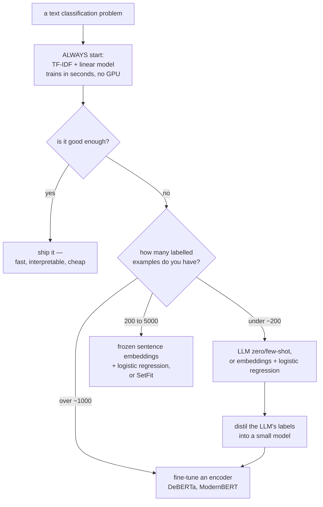

# Text Classification

Spam or not. Positive, negative, or neutral. Which of 200 support categories.
Text classification is the most deployed NLP task by a wide margin, and it is
also the one where the strong, cheap baseline is most often skipped in favour of
something more impressive and worse.

## The task, and its variants

| Variant | Setup | Loss |
|---|---|---|
| Binary | two mutually exclusive classes | binary cross-entropy on one logit |
| Multiclass | $K$ mutually exclusive classes | cross-entropy over $K$ logits (softmax) |
| **Multilabel** | any subset of $K$ labels | $K$ independent sigmoids — **not softmax** |
| Hierarchical | labels form a taxonomy | exploit the hierarchy in the loss or decode top-down |
| Ordinal | ordered classes (1–5 stars) | ordinal regression or a cumulative-link model |
| Extreme multilabel | $10^5$+ labels | negative sampling, label trees |
| Zero-shot | classes unseen at training time | NLI-based or LLM prompting |

**Multilabel with softmax is a real and frequent bug.** Softmax forces the
outputs to sum to 1, so it structurally cannot express "this ticket is about both
billing and cancellation". Use independent sigmoids with binary cross-entropy,
and tune a threshold per label.

**Ordinal targets are neither.** Treating a 1–5 rating as five unordered classes
throws away the ordering, so predicting 1 when the truth is 5 costs the same as
predicting 4. Treating it as regression asserts equal spacing between grades.
Ordinal regression handles both.

## The approach ladder



### Baseline: TF-IDF plus a linear model

```python
pipe = make_pipeline(
    TfidfVectorizer(ngram_range=(1, 2), min_df=3, max_df=0.7,
                    sublinear_tf=True, strip_accents="unicode"),
    LogisticRegression(C=1.0, class_weight="balanced", max_iter=2000),
)
pipe.fit(X_train, y_train)
```

This trains in seconds on a laptop, needs no GPU, is fully interpretable (read
the coefficients), serves in microseconds, and on topical classification often
lands within a few points of a fine-tuned transformer. **It is the number every
other approach must beat**, and it is remarkable how often nobody computes it.

Character n-grams (`analyzer="char_wb", ngram_range=(3,5)`) are the variant to
know: robust to typos and morphology, excellent for short strings, names, product
codes, and languages without clean word boundaries.

`LinearSVC` is often slightly better than logistic regression on text; use
`CalibratedClassifierCV` around it if you need probabilities.

### Frozen embeddings plus a classifier

```python
from sentence_transformers import SentenceTransformer
from sklearn.linear_model import LogisticRegression
encoder = SentenceTransformer("BAAI/bge-base-en-v1.5")
emb_train = encoder.encode(X_train, normalize_embeddings=True)
emb_test = encoder.encode(X_test, normalize_embeddings=True)
clf = LogisticRegression(max_iter=2000, class_weight="balanced").fit(emb_train, y_train)
```

Strong with only a few hundred labels, since the representation is already good
and only the head is learned. Embeddings can be **precomputed once**, which makes
iteration essentially instant. This is the right first move whenever labels are
scarce.

**SetFit** improves on it: contrastively fine-tune the sentence encoder on
label-derived pairs, then fit a classifier head. It reaches competitive accuracy
with 8–64 examples per class and no prompts.

### Fine-tuning an encoder

This optional downloaded-model configuration targets Transformers **4.57.1** and
bf16-capable hardware. Define dataset splits, tokenizer, label maps and metrics
before constructing a Trainer. Newer major versions may use a different
length-grouping argument; do not mix unpinned examples.

```python
model = AutoModelForSequenceClassification.from_pretrained(
    "microsoft/deberta-v3-base", num_labels=K, id2label=id2label, label2id=label2id)

args = TrainingArguments(
    output_dir="classifier-output", learning_rate=2e-5, num_train_epochs=3, warmup_ratio=0.06,
    per_device_train_batch_size=16, weight_decay=0.01,
    eval_strategy="steps", eval_steps=200, save_strategy="steps", save_steps=200,
    load_best_model_at_end=True, metric_for_best_model="f1",
    bf16=True, group_by_length=True,
)
```

Hyperparameters that matter, in order: learning rate ($2\times10^{-5}$ to
$5\times10^{-5}$ as a pilot range, not a universal law),
epochs selected on development data, and `max_length` (truncation silently discards the
end of long documents).

| Encoder | Note |
|---|---|
| DeBERTa-v3 | consistently the strongest base-size encoder |
| RoBERTa | solid, widely supported |
| ModernBERT | 2024-era: 8k context, RoPE, FlashAttention, faster |
| DistilBERT | 40% smaller, ~97% of the quality; good for latency |
| XLM-R / mDeBERTa | multilingual |
| Domain-specific (BioBERT, SciBERT, FinBERT, CodeBERT) | worth checking before general models |

Fine-tuned encoders can be strong, inexpensive task-specific models. Whether one
beats a prompted larger model depends on the actual checkpoint, labels, domain,
prompt, hardware and tuning budget. Measure accuracy and cost rather than applying
a universal thousandfold comparison or label-count cutoff.

### LLM classification

```python
prompt = f"""Classify the support ticket into exactly one category.

Categories: {", ".join(categories)}

Ticket: {text}

Respond with only the category name."""
```

| When it wins | When it does not |
|---|---|
| Fewer than ~200 labels | thousands of labels available |
| Many classes with clear semantic names | subtle, domain-specific distinctions |
| Rapidly changing label sets | a stable taxonomy |
| Needs an explanation alongside the label | latency or cost-critical serving |
| Prototyping | high-volume production |

Techniques that meaningfully improve LLM classification:

- **Constrained decoding** — restrict output to the valid label set, so parsing
  never fails.
- **Score the labels directly** — compare the log-probability of each candidate
  label rather than generating free text. More reliable and cheaper.
- **Few-shot examples** covering the confusable pairs specifically.
- **Distillation** — label 10k examples with the LLM, train a small encoder on
  them. This is frequently the best end state: LLM quality at encoder cost.

## Imbalanced classes

Follow the ladder rather than reaching straight for resampling.

1. **Fix the metric.** Macro-F1 or PR-AUC, never accuracy.
2. **Tune the threshold** on validation, from your actual error costs.
3. **Class weights** — `class_weight="balanced"`, or a weighted loss in the
   trainer.
4. **Focal loss** — $(1-p_t)^\gamma$ down-weights easy examples so the gradient
   concentrates on hard ones. Effective at extreme imbalance.
5. **Resampling** — undersample the majority, or oversample the minority.
   Text-specific augmentation (back-translation, LLM paraphrase) generates new
   minority examples rather than duplicating them.
6. **Reframe** — at extreme imbalance, one-class or anomaly detection.

**Never resample the validation or test set.** They must reflect the real
distribution, or your precision estimate is fiction.

## Long documents

Encoders cap at 512 tokens (ModernBERT and Longformer go further). Options:

| Strategy | Note |
|---|---|
| Truncate to the first 512 tokens | works better than expected — leads are informative |
| Head + tail | first 128 + last 382 tokens; a strong cheap heuristic |
| Chunk and aggregate | mean/max pool chunk predictions, or a small model over chunk embeddings |
| Hierarchical | encode chunks, then a transformer over chunk vectors |
| Long-context model | Longformer, ModernBERT, or an LLM |
| Extractive pre-summarisation | select the most relevant sentences first |

Measure how much text you are losing before choosing. If 90% of documents fit in
512 tokens, truncation is the right answer and everything else is complexity for
10% of the data.

## Evaluation

| Metric | When |
|---|---|
| Accuracy | balanced classes, equal error costs |
| **Macro-F1** | imbalanced multiclass — every class counts equally |
| Weighted F1 | when class volume should count |
| Micro-F1 | equals accuracy for single-label multiclass |
| PR-AUC | imbalanced binary; threshold-free |
| **Per-class precision/recall** | always look at this, not just the aggregate |
| MCC | a single balanced number using all four confusion cells |
| Cohen's $\kappa$ | agreement above chance; comparable to annotator agreement |
| Sample-F1 / subset accuracy | multilabel |

**Report the per-class table.** A macro-F1 of 0.78 can hide one class at 0.20,
and that class is usually the one someone cares about.

**Measure annotation reliability.** Pairwise agreement of 85% is not a hard model
accuracy ceiling against adjudicated or latent labels. Raters can make different
errors, and adjudication changes the reference. Inspect ambiguity, systematic
rater effects and task definition before interpreting either agreement or model accuracy.

### Error analysis

The highest-value hour in any text classification project: read 50 misclassified
examples.

| What you find | What it means |
|---|---|
| The label is wrong | fix the data; label noise caps performance |
| The label is genuinely ambiguous | the taxonomy needs work, or the ceiling is lower than you think |
| A systematic pattern (negation, sarcasm, a domain term) | a feature or data problem, fixable |
| Confusion concentrated between two classes | consider merging them, or add targeted training data |
| Failures on long or short inputs | a preprocessing problem |
| Failures on one language or dialect | a coverage and fairness problem |

Sort the confusion matrix by class frequency and look for **off-diagonal
blocks** — groups of classes systematically confused with each other are a
possible taxonomy, representation, annotation or model problem; inspect examples
before assigning the cause.

## Robustness

Text classifiers are fragile in specific, well-documented ways.

| Failure | Example | Mitigation |
|---|---|---|
| Negation | "not good" classified positive | ensure negation appears in training; bigrams |
| Sarcasm and irony | genuinely hard | often out of scope; measure it separately |
| Domain shift | trained on reviews, applied to tweets | domain-matched data, continued pretraining |
| Spurious correlations | a topic word that happens to correlate with the label | counterfactual augmentation, group-robust training |
| Adversarial edits | character substitution, spacing | character n-grams, adversarial training |
| Length bias | long documents systematically classified one way | check the metric by length bucket |
| Temporal drift | new slang, new products | scheduled retraining, drift monitoring |

**Behavioural testing** (the CheckList methodology) catches what an aggregate
metric cannot:

| Test type | Example |
|---|---|
| Minimum functionality | "This is terrible." must be negative |
| **Invariance** | changing a name or location must not change the prediction |
| **Directional expectation** | adding "and I loved it" must not decrease the positive score |

These tests are cheap to write, run in CI, and catch regressions that a stable
F1 will not.

## Production notes

| Concern | Guidance |
|---|---|
| Latency | benchmark a smaller encoder and ONNX Runtime/int8 on the actual CPU, batch sizes, sequence lengths, and quality constraints; no universal speedup |
| Calibration | inspect held-out reliability and proper scoring rules; fit a temperature on separate calibration data when appropriate |
| Threshold | set from costs, not 0.5, and re-tune when the base rate shifts |
| Unknown classes | add an "other" class, or threshold on max probability and route to a human |
| Explanations | SHAP, LIME, or attention are all imperfect; for compliance, prefer a linear model |
| Monitoring | prediction distribution, per-class rates, input length, OOV rate |
| Feedback | route low-confidence cases to human review and use the labels for retraining |

That last row enables **active learning through the review queue**. Uncertain
examples can be informative, but they can also be mislabeled, intrinsically
ambiguous, or out of scope. Combine uncertainty with diversity and representative
random sampling. A review-only labeled stream is selected by the current model;
it cannot by itself estimate accuracy on the full production population. Preserve
a random audit sample, record selection probabilities when appropriate, and keep
evaluation labels separate from retraining choices.

### From baseline to a reloadable service

The [train/package/reload/serve capstone](../libraries/mlops-and-serving.md#capstone-train-package-reload-serve)
implements the complete sparse-classifier path in one downloadable CPU script.
It includes a group-disjoint synthetic support-message corpus, development-only
selection of logistic-regression regularization, per-class test metrics, a
fitted-vocabulary leakage check, and an artifact bundle whose probabilities are
reproduced after reload and through FastAPI. The service rejects malformed or
oversized text batches and returns explicit class ordering and model identity.

The twelve-message holdout is intentionally too small and templated to establish
production quality. Its perfect score is a plumbing assertion, not a reason to
ship. Replace it with an independently collected, licensed corpus, preserve
conversation/customer/time boundaries, and add ambiguous, unsupported, multilingual,
and long-text slices before comparing the baseline with a fine-tuned encoder.
The capstone also demonstrates why all-OOV input still produces a class: a
closed-set probability interface is not an out-of-domain detector.

### A measured baseline on real SMS messages

The [real-corpus SMS study](./nlp-evaluation.md#real-corpus-study-sms-spam-with-a-frozen-decision-policy)
now executes the same TF-IDF/logistic pipeline on the official UCI SMS Spam
Collection, with checksum-pinned data and a downloadable measured report. It
keeps normalized duplicates together in a stratified four-way split. It does
**not** invent timestamps or sender identities absent from the archive.

On the fixed 1,091-message holdout, the model achieved 98.075% accuracy versus
87.076% for an always-ham baseline, but its spam recall was only 85.11%: 21 spam
messages were missed. A development-selected review threshold retained 95.325%
coverage with seven accepted mistakes. This makes the real tradeoff visible:
headline accuracy, minority-class recall, review load, and confidently wrong
accepted decisions describe different parts of the workflow.

The study publishes no raw SMS excerpts. Its error ledger and worked analysis
connect the failures to possible missing context and annotation ambiguity without
silently fixing test labels or tuning another threshold against them. The source
is historical and mixes collection sources, so these measurements are evidence
about one frozen corpus split, not present-day or future-time spam detection.

### A calibrated acceptance policy, not just a confidence score

The [evaluation protocol lab](./nlp-evaluation.md#practical-lab-calibration-abstention-and-uncertainty)
extends the same pipeline with four chronological, group-disjoint partitions:
training, calibration, policy development, and final test. It provides a
[downloadable CPU script](/assets/examples/evaluation_protocol.py), an explicit
real-data CSV adapter, and a versioned JSON report. No external corpus or model
download is needed for its controlled fixture.

Why four partitions? The classifier learns weights on training data; temperature
scaling learns confidence on calibration data; a cost-sensitive threshold learns
which decisions to accept on policy-development data. Only then is the complete
policy evaluated on final test data. If customers or conversations span temporal
boundaries, the lab purges those entire groups and reports them. That prevents
one form of leakage but can remove long-running incidents disproportionately,
so inspect the excluded population rather than treating purging as automatically
representative.

For example, 50% coverage with 0% observed accepted error means half the examples
still need another outcome. It does not mean the classifier solved the task.
Include review cost, staffing capacity, reviewer accuracy, and the cost of
incorrect automated decisions. The lab models fixed error/review costs and
reports coverage, selective risk, and mean cost; it deliberately does not model
a staffing queue or reviewer errors. The resulting threshold is evidence for
that specified objective, not a general deployment recommendation.

**Calibration preserves class ranking; it does not repair representation.** A
positive scalar temperature leaves the predicted class unchanged but can move
its confidence across the acceptance threshold. A systematically confused pair
of classes still needs better labels, features, or a different taxonomy. A
closed-set model can also be confident on an unsupported language or task. Test
unknown-class and out-of-domain behavior explicitly rather than interpreting
softmax confidence as proof that an input belongs to the training distribution.

### Slices that keep the aggregate score honest

Plan slices before selecting a winner, and report counts and uncertainty beside
the metric. Avoid ranking dozens of tiny slices and treating the worst observed
one as a precise population estimate. Useful classification slices include:

| Slice | Question | Possible next experiment |
|---|---|---|
| New versus returning customers | Is customer-specific language helping the baseline? | Evaluate a customer-disjoint holdout alongside future-time performance |
| New versus known product versions | Are features stale rather than broadly inadequate? | Hold out a later release and inspect terminology changes |
| Long documents | Does truncation discard decisive evidence? | Compare head-only, head/tail, and chunk aggregation with identical split membership |
| Low-support labels | Does aggregate accuracy hide costly tail errors? | Report label support, recall, precision, and accepted-error counts |
| Unsupported language or task | Is the system confidently making out-of-scope decisions? | Build a separate rejection set with an explicit routing outcome |
| Empty or all-OOV features | Does the model silently fall back to priors? | Inspect sparse row nnz, intercept-driven predictions, and an explicit fallback policy |
| Ambiguous or disputed labels | Is disagreement about model behavior or taxonomy? | Re-annotate using written guidelines and adjudicate independently |

The current evaluation script produces a closed-set per-class report and per-item
predictions, not an automatic fairness or out-of-domain assessment. Additional
slice metadata belongs in a governed dataset or a versioned join keyed by row
ID. Do not infer sensitive attributes from message text merely to fill a dashboard.
For comparisons, join both systems on the same IDs and bootstrap the paired
difference using the appropriate independent group, not two unrelated intervals.

```html
<h3 id="promotion-and-monitoring-contract">Promotion and monitoring contract</h3>
```

Before promotion, freeze the model version, class order, feature pipeline,
calibration parameters, threshold, cost definition, and evaluation revision.
The service must apply the same calibrated probabilities and acceptance rule:
adding a threshold only in an offline notebook does not alter the existing
artifact capstone's `/predict` endpoint. This lab intentionally evaluates policy
offline; integrating it into serving requires a versioned response schema with
an explicit accepted/reviewed outcome, and new roundtrip contract tests.

After deployment, monitor acceptance rate and queue load immediately; observe
accuracy only when representative labels arrive. A drop in confidence can signal
drift, but stable confidence cannot rule out confidently wrong predictions.
Preserve a random labeled audit stream including accepted items, inspect label
delay, and evaluate the whole human-plus-model workflow. Retraining or changing
the temperature produces a new policy candidate, which needs fresh development
selection and held-out evidence before promotion.

## Self-check

### Runnable grouped text baseline

Each group contributes two related synthetic tickets and remains entirely on one
side of the split. Vocabulary fitting is training-only. This deliberately simple
fixture checks the pipeline contract, not production accuracy.

```python runnable
import numpy as np
from sklearn.model_selection import GroupShuffleSplit
from sklearn.feature_extraction.text import TfidfVectorizer
from sklearn.pipeline import make_pipeline
from sklearn.linear_model import LogisticRegression
from sklearn.metrics import f1_score
texts, labels, groups = [], [], []
for group in range(30):
    texts.extend([f"billing payment invoice account{group}", f"technical crash error account{group}"])
    labels.extend([0, 1])
    groups.extend([group, group])
texts, labels, groups = np.array(texts), np.array(labels), np.array(groups)
train, test = next(GroupShuffleSplit(n_splits=1, test_size=.3, random_state=3).split(texts, labels, groups))
assert not set(groups[train]) & set(groups[test])
model = make_pipeline(TfidfVectorizer(ngram_range=(1, 2)), LogisticRegression(random_state=0))
model.fit(texts[train], labels[train])
prediction = model.predict(texts[test])
assert f1_score(labels[test], prediction, average="macro") == 1
vocab = model.named_steps["tfidfvectorizer"].vocabulary_
assert f"account{groups[test][0]}" not in vocab
print("grouped split, train-only vocabulary and baseline predictions passed")
```

**Why is unknown-class rejection not solved by max probability?** Softmax can be
confident on out-of-distribution inputs. Fit abstention rules on representative
development cases and report coverage versus conditional error; do not tune the
threshold on final test labels. **What about multilabel missing annotations?**
Independent sigmoid loss still needs a mask for unobserved labels; unannotated
does not automatically mean negative. **Why retain tail-critical tests?** A
small long-document slice can carry most high-cost failures even if 90% of inputs
fit the context limit. Compare truncation with head/tail or chunk aggregation on
that slice. The [Trainer contract](https://huggingface.co/docs/transformers/main_classes/trainer)
documents checkpoint/evaluation scheduling requirements.

1. What is the first model you build for any text classification problem, and
   why?
2. Why is softmax wrong for multilabel, and what replaces it?
3. When does a fine-tuned encoder beat a prompted LLM, and when does it not?
4. Give the interventions for class imbalance in the order you would try them.
5. Your macro-F1 is 0.78 and the product team says the model is useless. Where do
   you look first?
6. What is an invariance test, and what does it catch that F1 does not?
7. Why should you measure inter-annotator agreement before optimising?

## Where to go next

- [Sequence Labeling](./sequence-labeling.md) — per-token rather than
  per-document prediction.
- [Text Representation](./text-representation.md) — the features these
  classifiers consume.
- [NLP Evaluation](./nlp-evaluation.md) — metrics in depth.
