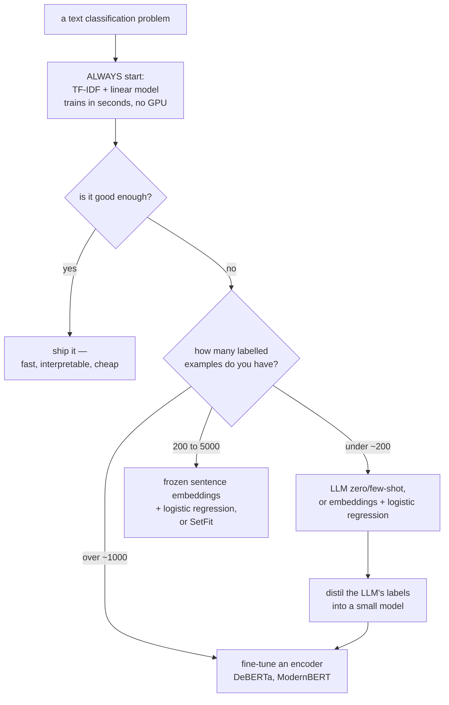

# Text Classification

Spam or not. Positive, negative, or neutral. Which of 200 support categories.
Text classification is the most deployed NLP task by a wide margin, and it is
also the one where the strong, cheap baseline is most often skipped in favour of
something more impressive and worse.

## The task, and its variants

| Variant | Setup | Loss |
|---|---|---|
| Binary | two mutually exclusive classes | binary cross-entropy on one logit |
| Multiclass | $K$ mutually exclusive classes | cross-entropy over $K$ logits (softmax) |
| **Multilabel** | any subset of $K$ labels | $K$ independent sigmoids — **not softmax** |
| Hierarchical | labels form a taxonomy | exploit the hierarchy in the loss or decode top-down |
| Ordinal | ordered classes (1–5 stars) | ordinal regression or a cumulative-link model |
| Extreme multilabel | $10^5$+ labels | negative sampling, label trees |
| Zero-shot | classes unseen at training time | NLI-based or LLM prompting |

**Multilabel with softmax is a real and frequent bug.** Softmax forces the
outputs to sum to 1, so it structurally cannot express "this ticket is about both
billing and cancellation". Use independent sigmoids with binary cross-entropy,
and tune a threshold per label.

**Ordinal targets are neither.** Treating a 1–5 rating as five unordered classes
throws away the ordering, so predicting 1 when the truth is 5 costs the same as
predicting 4. Treating it as regression asserts equal spacing between grades.
Ordinal regression handles both.

## The approach ladder



### Baseline: TF-IDF plus a linear model

```python
pipe = make_pipeline(
    TfidfVectorizer(ngram_range=(1, 2), min_df=3, max_df=0.7,
                    sublinear_tf=True, strip_accents="unicode"),
    LogisticRegression(C=1.0, class_weight="balanced", max_iter=2000),
)
pipe.fit(X_train, y_train)
```

This trains in seconds on a laptop, needs no GPU, is fully interpretable (read
the coefficients), serves in microseconds, and on topical classification often
lands within a few points of a fine-tuned transformer. **It is the number every
other approach must beat**, and it is remarkable how often nobody computes it.

Character n-grams (`analyzer="char_wb", ngram_range=(3,5)`) are the variant to
know: robust to typos and morphology, excellent for short strings, names, product
codes, and languages without clean word boundaries.

`LinearSVC` is often slightly better than logistic regression on text; use
`CalibratedClassifierCV` around it if you need probabilities.

### Frozen embeddings plus a classifier

```python
emb = SentenceTransformer("BAAI/bge-base-en-v1.5").encode(texts, normalize_embeddings=True)
clf = LogisticRegression(max_iter=2000, class_weight="balanced").fit(emb_train, y_train)
```

Strong with only a few hundred labels, since the representation is already good
and only the head is learned. Embeddings can be **precomputed once**, which makes
iteration essentially instant. This is the right first move whenever labels are
scarce.

**SetFit** improves on it: contrastively fine-tune the sentence encoder on
label-derived pairs, then fit a classifier head. It reaches competitive accuracy
with 8–64 examples per class and no prompts.

### Fine-tuning an encoder

```python
model = AutoModelForSequenceClassification.from_pretrained(
    "microsoft/deberta-v3-base", num_labels=K, id2label=id2label, label2id=label2id)

args = TrainingArguments(
    learning_rate=2e-5, num_train_epochs=3, warmup_ratio=0.06,
    per_device_train_batch_size=16, weight_decay=0.01,
    eval_strategy="steps", eval_steps=200,
    load_best_model_at_end=True, metric_for_best_model="f1",
    bf16=True, group_by_length=True,
)
```

Hyperparameters that matter, in order: learning rate ($2\times10^{-5}$ to
$5\times10^{-5}$ — anything near $10^{-3}$ destroys the pretrained weights),
epochs (2–4; more overfits), and `max_length` (truncation silently discards the
end of long documents).

| Encoder | Note |
|---|---|
| DeBERTa-v3 | consistently the strongest base-size encoder |
| RoBERTa | solid, widely supported |
| ModernBERT | 2024-era: 8k context, RoPE, FlashAttention, faster |
| DistilBERT | 40% smaller, ~97% of the quality; good for latency |
| XLM-R / mDeBERTa | multilingual |
| Domain-specific (BioBERT, SciBERT, FinBERT, CodeBERT) | worth checking before general models |

**Encoders are still the right tool here.** A fine-tuned 100M-parameter encoder
beats a prompted 70B model on a task with a few thousand labelled examples, at a
thousandth of the cost and with far lower latency. Reach for an LLM when labels
are scarce, not when they are plentiful.

### LLM classification

```python
prompt = f"""Classify the support ticket into exactly one category.

Categories: {", ".join(categories)}

Ticket: {text}

Respond with only the category name."""
```

| When it wins | When it does not |
|---|---|
| Fewer than ~200 labels | thousands of labels available |
| Many classes with clear semantic names | subtle, domain-specific distinctions |
| Rapidly changing label sets | a stable taxonomy |
| Needs an explanation alongside the label | latency or cost-critical serving |
| Prototyping | high-volume production |

Techniques that meaningfully improve LLM classification:

- **Constrained decoding** — restrict output to the valid label set, so parsing
  never fails.
- **Score the labels directly** — compare the log-probability of each candidate
  label rather than generating free text. More reliable and cheaper.
- **Few-shot examples** covering the confusable pairs specifically.
- **Distillation** — label 10k examples with the LLM, train a small encoder on
  them. This is frequently the best end state: LLM quality at encoder cost.

## Imbalanced classes

Follow the ladder rather than reaching straight for resampling.

1. **Fix the metric.** Macro-F1 or PR-AUC, never accuracy.
2. **Tune the threshold** on validation, from your actual error costs.
3. **Class weights** — `class_weight="balanced"`, or a weighted loss in the
   trainer.
4. **Focal loss** — $(1-p_t)^\gamma$ down-weights easy examples so the gradient
   concentrates on hard ones. Effective at extreme imbalance.
5. **Resampling** — undersample the majority, or oversample the minority.
   Text-specific augmentation (back-translation, LLM paraphrase) generates new
   minority examples rather than duplicating them.
6. **Reframe** — at extreme imbalance, one-class or anomaly detection.

**Never resample the validation or test set.** They must reflect the real
distribution, or your precision estimate is fiction.

## Long documents

Encoders cap at 512 tokens (ModernBERT and Longformer go further). Options:

| Strategy | Note |
|---|---|
| Truncate to the first 512 tokens | works better than expected — leads are informative |
| Head + tail | first 128 + last 382 tokens; a strong cheap heuristic |
| Chunk and aggregate | mean/max pool chunk predictions, or a small model over chunk embeddings |
| Hierarchical | encode chunks, then a transformer over chunk vectors |
| Long-context model | Longformer, ModernBERT, or an LLM |
| Extractive pre-summarisation | select the most relevant sentences first |

Measure how much text you are losing before choosing. If 90% of documents fit in
512 tokens, truncation is the right answer and everything else is complexity for
10% of the data.

## Evaluation

| Metric | When |
|---|---|
| Accuracy | balanced classes, equal error costs |
| **Macro-F1** | imbalanced multiclass — every class counts equally |
| Weighted F1 | when class volume should count |
| Micro-F1 | equals accuracy for single-label multiclass |
| PR-AUC | imbalanced binary; threshold-free |
| **Per-class precision/recall** | always look at this, not just the aggregate |
| MCC | a single balanced number using all four confusion cells |
| Cohen's $\kappa$ | agreement above chance; comparable to annotator agreement |
| Sample-F1 / subset accuracy | multilabel |

**Report the per-class table.** A macro-F1 of 0.78 can hide one class at 0.20,
and that class is usually the one someone cares about.

**Establish the human ceiling.** If two annotators agree only 85% of the time,
a model at 85% is at the ceiling and further work is wasted. Measure
inter-annotator agreement before optimising.

### Error analysis

The highest-value hour in any text classification project: read 50 misclassified
examples.

| What you find | What it means |
|---|---|
| The label is wrong | fix the data; label noise caps performance |
| The label is genuinely ambiguous | the taxonomy needs work, or the ceiling is lower than you think |
| A systematic pattern (negation, sarcasm, a domain term) | a feature or data problem, fixable |
| Confusion concentrated between two classes | consider merging them, or add targeted training data |
| Failures on long or short inputs | a preprocessing problem |
| Failures on one language or dialect | a coverage and fairness problem |

Sort the confusion matrix by class frequency and look for **off-diagonal
blocks** — groups of classes systematically confused with each other are a
taxonomy problem, not a model problem.

## Robustness

Text classifiers are fragile in specific, well-documented ways.

| Failure | Example | Mitigation |
|---|---|---|
| Negation | "not good" classified positive | ensure negation appears in training; bigrams |
| Sarcasm and irony | genuinely hard | often out of scope; measure it separately |
| Domain shift | trained on reviews, applied to tweets | domain-matched data, continued pretraining |
| Spurious correlations | a topic word that happens to correlate with the label | counterfactual augmentation, group-robust training |
| Adversarial edits | character substitution, spacing | character n-grams, adversarial training |
| Length bias | long documents systematically classified one way | check the metric by length bucket |
| Temporal drift | new slang, new products | scheduled retraining, drift monitoring |

**Behavioural testing** (the CheckList methodology) catches what an aggregate
metric cannot:

| Test type | Example |
|---|---|
| Minimum functionality | "This is terrible." must be negative |
| **Invariance** | changing a name or location must not change the prediction |
| **Directional expectation** | adding "and I loved it" must not decrease the positive score |

These tests are cheap to write, run in CI, and catch regressions that a stable
F1 will not.

## Production notes

| Concern | Guidance |
|---|---|
| Latency | distil to a small encoder; ONNX Runtime with int8 gives 2–4× on CPU |
| Calibration | fine-tuned transformers are overconfident; temperature-scale on validation |
| Threshold | set from costs, not 0.5, and re-tune when the base rate shifts |
| Unknown classes | add an "other" class, or threshold on max probability and route to a human |
| Explanations | SHAP, LIME, or attention are all imperfect; for compliance, prefer a linear model |
| Monitoring | prediction distribution, per-class rates, input length, OOV rate |
| Feedback | route low-confidence cases to human review and use the labels for retraining |

That last row is the highest-value production pattern: **active learning through
the review queue**. The examples the model is least confident about are the most
informative to label, and you are already paying a human to look at them.

## Self-check

1. What is the first model you build for any text classification problem, and
   why?
2. Why is softmax wrong for multilabel, and what replaces it?
3. When does a fine-tuned encoder beat a prompted LLM, and when does it not?
4. Give the interventions for class imbalance in the order you would try them.
5. Your macro-F1 is 0.78 and the product team says the model is useless. Where do
   you look first?
6. What is an invariance test, and what does it catch that F1 does not?
7. Why should you measure inter-annotator agreement before optimising?

## Where to go next

- [Sequence Labeling](./sequence-labeling.md) — per-token rather than
  per-document prediction.
- [Text Representation](./text-representation.md) — the features these
  classifiers consume.
- [NLP Evaluation](./nlp-evaluation.md) — metrics in depth.
