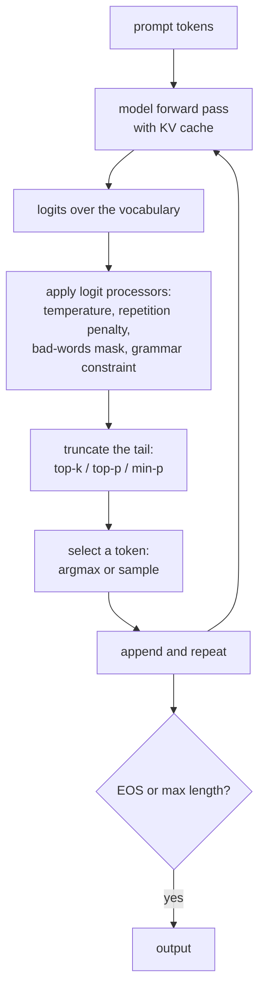

# Text Generation and Decoding

A language model outputs a probability distribution over the vocabulary. Turning
that into text is a separate algorithm, and the choice of algorithm changes the
output more than most people expect — often more than switching to a larger
model.

## The setup

At each step the model gives logits $\mathbf{z}\in\mathbb{R}^V$ over the
vocabulary. A decoding strategy converts them into a token, appends it, and
repeats.



## Deterministic strategies

### Greedy

Take the argmax at each step. Fast, reproducible, and **prone to
degeneration** — repetitive loops, generic phrasing, and getting stuck. It is
also myopic: a locally optimal token can lead into a low-probability region with
no way back.

Correct for: extraction, classification framed as generation, structured output,
and anything where you want the same answer every time.

### Beam search

Keep the $B$ highest-probability partial sequences at each step, expand all of
them, keep the best $B$ again.

$$\text{score}(\mathbf{y}) = \frac{\log P(\mathbf{y}\mid\mathbf{x})}{\mathrm{lp}(|\mathbf{y}|)}, \qquad \mathrm{lp}(t) = \left(\frac{5+t}{6}\right)^{\alpha}$$

Length normalization changes the search objective and can counter unwanted short
outputs. It is not mandatory for every probabilistic task: raw sequence probability
already includes EOS and may be the intended objective. Manage finished hypotheses,
length penalties and stopping bounds consistently rather than extending EOS paths.

| Good for | Bad for |
|---|---|
| Translation | open-ended text |
| Summarisation | dialogue |
| Constrained tasks with a "correct" answer | creative writing |

**The beam search curse**: in some experiments larger beams reduce translation
quality despite finding higher-probability sequences; there is no universal beam-five
threshold. The model's
probability and the human notion of quality diverge — high-probability sequences
are generic, short, and often degenerate. This is one of the clearest examples in
NLP of an objective that is not the goal.

For open-ended generation, beam search is actively bad. It produces bland,
repetitive text because the most probable continuation of anything is usually
uninteresting.

## Stochastic strategies

### Temperature

$$p_i = \frac{\exp(z_i/T)}{\sum_j \exp(z_j/T)}$$

| $T$ | Effect |
|---|---|
| $\to 0$ | approaches greedy |
| 0.7 | slightly sharpened; the common default for assistants |
| 1.0 | the model's own distribution, unmodified |
| 1.5 | flattened; more surprising, less coherent |
| $\to\infty$ | uniform over the vocabulary |

Temperature alone is a poor strategy at high values, because it also inflates the
probability of the long tail of genuinely bad tokens. With $V = 50{,}000$, even a
tiny per-token probability of nonsense accumulates over hundreds of steps.

### Top-$k$

Keep the $k$ highest-probability tokens, renormalise, sample.

The flaw is that $k$ is fixed while the distribution's shape is not. After "The
capital of France is" the distribution is sharp — one token has 0.99 — and
$k = 50$ admits 49 wrong answers. After "She opened the door and saw a" it is
flat, and $k = 50$ cuts off legitimate options.

### Top-$p$ (nucleus sampling)

Keep the smallest set of tokens whose cumulative probability exceeds $p$.

Sort probabilities $p_{(1)}\ge p_{(2)}\ge\cdots$ and keep the shortest prefix
$1{:}k$ with $\sum_{i=1}^k p_{(i)}\ge p$. Specify deterministic tie handling.

**The nucleus adapts to the distribution's shape**: sharp distributions keep 1–2
tokens, flat ones keep hundreds. This is the fix for top-$k$'s fixed cutoff, and
it is the reason nucleus sampling became the default for open-ended generation.
Typical $p = 0.9$–0.95.

### Min-$p$

Keep tokens with probability at least $p_{\min}\times p_{\max}$ — a threshold
**relative to the top token**.

Its advantage is robustness at high temperature. Top-$p$ computes the nucleus
*after* temperature has flattened the distribution, so at $T = 2$ the nucleus
sweeps in tail tokens. Min-$p$ anchors to the top token, so the relative
threshold is relative, but still temperature dependent:
$p_i/p_{max}=\exp((z_i-z_{max})/T)$. Increasing temperature admits more tokens
for fixed min-p. Values around .05-.1 are starting experiments, not guarantees
of coherent high-temperature output.

### Others worth knowing

| Strategy | Idea |
|---|---|
| Typical sampling | keep tokens whose surprisal is near the distribution's entropy |
| $\eta$/$\epsilon$ sampling | entropy-dependent thresholds |
| **Contrastive search** | maximise model confidence minus similarity to previous tokens — fluent and non-repetitive without sampling |
| Mirostat | control perplexity to a target during generation |
| Locally typical | information-theoretic truncation |

## Comparison

| Strategy | Diversity | Coherence | Determinism | Best for |
|---|---|---|---|---|
| Greedy | none | can loop | yes | extraction, structured output |
| Beam | very low | high | yes | translation, summarisation |
| Temperature only | tunable | poor at high $T$ | no | rarely alone |
| Top-$k$ | moderate | good | no | superseded by top-$p$ |
| **Top-$p$** | good | good | no | **the general default** |
| Min-$p$ | good | good at high $T$ | no | creative work |
| Contrastive search | moderate | very good | yes | long-form, repetition-prone models |

A practical default for an assistant: `temperature=0.7, top_p=0.9`. For factual
extraction in Transformers: `do_sample=False` (greedy), not a universal
`temperature=0` API. For creative writing:
`temperature=1.0–1.2, min_p=0.05`.

## Repetition control

Neural text degeneration — the model falling into a loop — is a well-documented
failure of maximum-likelihood-trained models under likelihood-maximising
decoding. Sampling largely fixes it; when it does not, these help:

| Control | Mechanism | Caution |
|---|---|---|
| `repetition_penalty` | repeated negative logits multiply by $\theta>1$; nonnegative logits divide by it | sign-aware: both cases lower the repeated token's score |
| `no_repeat_ngram_size` | hard ban on repeating any $n$-gram | breaks names, quotes, and code; use sparingly |
| `frequency_penalty` | subtract $\alpha\times$count from logits | proportional, gentler |
| `presence_penalty` | subtract a fixed amount for any prior appearance | encourages topic shift |
| Contrastive search | built into the objective | changes the decoding strategy |

**Do not use `no_repeat_ngram_size` for code or structured output.** Code
legitimately repeats — `for i in range`, closing braces, repeated field names —
and banning 3-gram repeats produces syntactically broken output.

## Structured and constrained decoding

When output must be valid JSON, match a schema, or follow a grammar, do not
prompt and hope. Constrain the sampler.

**The mechanism**: maintain a state machine (a compiled grammar or JSON schema)
and mask the logits of every token that cannot legally continue. Sampling then
preserves legal prefixes under the supported constraint implementation. A token
limit, timeout, refusal, or unsupported schema feature can still prevent a complete
valid document; completion and semantic validation remain necessary.

| Tool | Approach |
|---|---|
| Outlines | regex and JSON-schema to a finite state machine over the vocabulary |
| **XGrammar** | fast context-free grammar constraints; used in vLLM/SGLang |
| llama.cpp GBNF | grammar-constrained sampling |
| Provider "JSON mode" / structured outputs | server-side constraint |
| Instructor / Pydantic wrappers | schema validation with retries — not a true constraint |

| Advantage | Cost |
|---|---|
| Supported syntactic constraints enforced during decoding | mask computation adds overhead; incomplete output still fails parsing |
| Fewer syntax-repair retries | semantic errors and interruptions still need handling |
| Enables reliable tool calling | grammar compilation is not free |

The quality caveat is real: forcing a schema the model finds unnatural can push
it into low-probability regions. Design schemas that match how the model would
naturally answer, and put the reasoning field *before* the answer field so the
model can think before committing.

## Speed

Small-batch decoding is often memory-bandwidth limited. Large batches, prefill,
long-context attention and different architectures can be compute- or
communication-limited. Profile the actual workload before choosing an optimization.

| Technique | Gain |
|---|---|
| **KV caching** | avoids recomputing all previous keys and values — turns $O(n^2)$ into $O(n)$ per token. Non-negotiable. |
| **Continuous batching** | admit new requests into a running batch as others finish; the single largest throughput win |
| **PagedAttention** | block-based KV allocation reduces fragmentation; partly filled blocks and metadata remain |
| Prefix caching | reuse the KV cache for a shared system prompt across requests |
| **Speculative decoding** | a small draft model proposes $k$ tokens; the large model verifies them in one pass |
| Medusa / EAGLE | Medusa uses extra token heads; EAGLE-family methods use learned draft/feature prediction, not simply independent heads |
| Quantisation (int8/int4) | fewer bytes to read — a direct latency win for decoding |
| GQA / MQA | smaller KV cache |
| Chunked prefill | interleave prefill and decode to smooth latency |

**Speculative decoding deserves the detail** because it is counter-intuitive: a
small model generates $k$ candidate tokens, the large model scores all $k$
positions in **one** forward pass, and a modified rejection-sampling rule accepts
an accepted prefix using probabilities, not equality with independently sampled
target tokens. Exact target-distribution preservation requires the correct
acceptance/residual algorithm and matching sampling transformations. It is not
a pure latency win: expensive drafting, low acceptance or already saturated batches
can make it slower. Distributional equivalence does not mean identical seeded strings.

The metrics that matter for serving:

| Metric | Meaning |
|---|---|
| **TTFT** | time to first token — dominated by prefill, so by prompt length |
| **TPOT / ITL** | time per output token — dominated by memory bandwidth |
| Throughput | total tokens/second across all concurrent requests |
| Goodput | requests/second meeting a latency target |

## Stopping

| Method | Note |
|---|---|
| EOS token | the model decides; requires proper training |
| `max_new_tokens` | a hard cap; always set one |
| Stop sequences | stop on `"\n\n"`, `"User:"`, a closing tag |
| Grammar completion | the state machine reaches an accepting state |
| Timeout | wall-clock safety |

**Always set `max_new_tokens`.** A model that never emits EOS will generate until
the context is exhausted, which is expensive and slow. And note that stop
sequences are usually matched on the *decoded string*, not on tokens, because a
stop string may not align with token boundaries.

## Quality beyond the sampler

| Technique | Idea |
|---|---|
| **Best-of-$n$** | generate $n$ candidates, pick the best under a reward model or verifier |
| Self-consistency | sample $n$ chains of thought, take the majority answer — very effective for reasoning |
| **Reranking** | score candidates with a separate model |
| MBR decoding | pick the candidate most similar to the others under a metric |
| Self-refine | generate, critique, revise |
| Tree search / lookahead | explore several continuations before committing |
| Verifier-guided | a trained verifier scores partial solutions |

**Self-consistency is the highest-value trick for reasoning tasks.** Sample 5–40
chain-of-thought traces at temperature ~0.7 and take the majority final answer.
It routinely adds 10–20 points on mathematical reasoning benchmarks, and it works
because errors are diverse while correct reasoning converges.

All of these are **inference-time compute** — trading tokens for quality without
touching the weights. It is now a first-class axis of model improvement alongside
parameters and training data.

## Common problems

| Problem | Cause | Fix |
|---|---|---|
| Repetitive loops | greedy or beam on an open-ended task | sample; add a repetition penalty; contrastive search |
| Bland, generic output | temperature too low, or beam search | raise temperature, use top-$p$ |
| Incoherent output | temperature too high, or too wide a nucleus | lower $T$; use min-$p$ |
| Never stops | no EOS training, no cap | `max_new_tokens`, stop sequences |
| Invalid JSON | prompting instead of constraining | constrained decoding |
| Different results at temperature 0 | batching and kernel non-determinism | pin batch size; accept some variance |
| Truncated mid-sentence | `max_new_tokens` too small | raise it, or stop on sentence boundaries |
| Garbage with batched generation | **right padding** on a causal model | `tokenizer.padding_side = "left"` |
| Prompt leaking into output | not slicing off the prompt | `out[0][input_len:]` |
| Degrades with a long prompt | lost-in-the-middle | put key material at the start and end |

The padding-side bug is worth restating because it is silent: decoder-only models
generate from the last position, so right padding makes the model generate from a
pad token. Output looks plausible and is subtly wrong for every sequence shorter
than the longest in the batch.

## Self-check

### Runnable logit processing and incomplete-output checks

The following five-logit example fixes the processing order: penalize repeated
tokens, divide by temperature, normalize, then retain the shortest descending
top-p prefix. Production libraries may combine processors in version-specific
order, so inspect the resulting distribution rather than assuming commutativity.

```python runnable
import json
import numpy as np
from transformers import RepetitionPenaltyLogitsProcessor
import torch
torch.set_num_threads(1)
logits = torch.tensor([[-2., -1., 0., 1., 2.]])
seen = torch.tensor([[0, 4]])
penalized = RepetitionPenaltyLogitsProcessor(1.2)(seen, logits.clone())
assert penalized[0, 0] < logits[0, 0] and penalized[0, 4] < logits[0, 4]
p = torch.softmax(penalized[0]/.8, -1).numpy()
order = np.argsort(-p, kind="stable")
k = int(np.searchsorted(np.cumsum(p[order]), .8, side="left"))+1
kept = order[:k]
assert p[kept].sum() >= .8 and (k == 1 or p[order[:k-1]].sum() < .8)
min_p = p >= .1*p.max()
assert min_p[p.argmax()]
try:
    json.loads('{"answer": "unfinished')
except json.JSONDecodeError:
    pass
else:
    raise AssertionError("incomplete JSON unexpectedly accepted")
print("penalized logits", penalized.tolist(), "nucleus", kept.tolist(), "min-p mask", min_p.tolist())
```

**What does exact speculation accept?** For draft token $x\sim q$, accept with
$\min(1,p(x)/q(x))$; on rejection sample from normalized $(p-q)_+$. Summing the
accepted and rejected branches recovers $p$ under the algorithm's assumptions.
Measure acceptance and actual latency, not only draft length. **What does a grammar
not prove?** An amount can be a syntactically valid number but violate a business
rule; validate complete documents, schema constraints and semantic authorization
separately. Primary references: [generation settings](https://huggingface.co/docs/transformers/main_classes/text_generation)
and [logit processors](https://github.com/huggingface/transformers/blob/main/src/transformers/generation/logits_process.py).

1. Why does beam search need length normalisation?
2. Explain the beam search curse and what it says about the training objective.
3. Give the failure mode of top-$k$ that top-$p$ fixes, with an example
   distribution.
4. How does min-p depend on temperature despite using a relative threshold?
5. Under which assumptions does speculative sampling preserve the target distribution?
6. When should you never use `no_repeat_ngram_size`?
7. Why must padding be on the left for batched generation with a causal LM?

## Where to go next

- [Language Models](./language-models.md) — the distributions being sampled from.
- [LLM Prompting & Alignment](./llm-prompting-and-alignment.md) — shaping what
  the distribution contains.
- [The Inference Engineering Course](/courses/inference/) — KV caching, continuous
  batching, and speculative decoding in depth.
